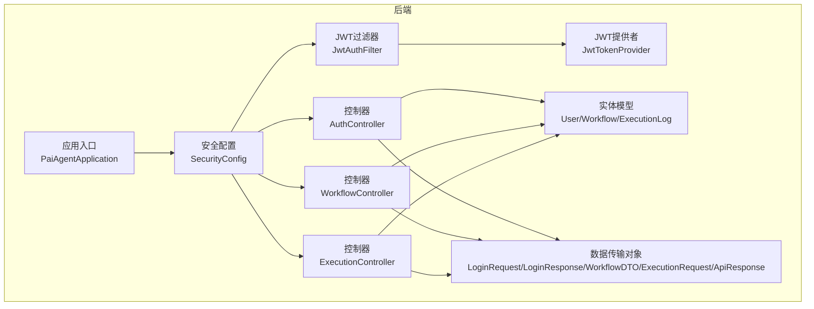
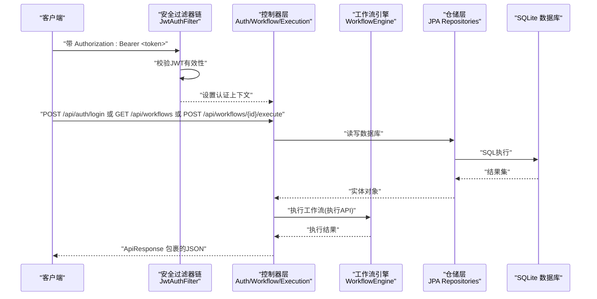
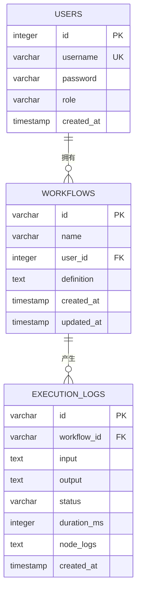
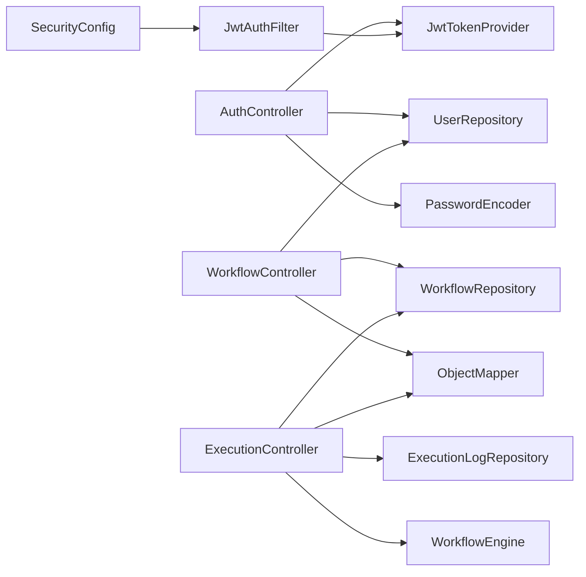

# API参考文档

<cite>
**本文引用的文件**
- [PaiAgentApplication.java](file://backend/src/main/java/com/paiagent/PaiAgentApplication.java)
- [AuthController.java](file://backend/src/main/java/com/paiagent/controller/AuthController.java)
- [WorkflowController.java](file://backend/src/main/java/com/paiagent/controller/WorkflowController.java)
- [ExecutionController.java](file://backend/src/main/java/com/paiagent/controller/ExecutionController.java)
- [JwtAuthFilter.java](file://backend/src/main/java/com/paiagent/security/JwtAuthFilter.java)
- [JwtTokenProvider.java](file://backend/src/main/java/com/paiagent/security/JwtTokenProvider.java)
- [SecurityConfig.java](file://backend/src/main/java/com/paiagent/config/SecurityConfig.java)
- [LoginRequest.java](file://backend/src/main/java/com/paiagent/model/dto/LoginRequest.java)
- [LoginResponse.java](file://backend/src/main/java/com/paiagent/model/dto/LoginResponse.java)
- [WorkflowDTO.java](file://backend/src/main/java/com/paiagent/model/dto/WorkflowDTO.java)
- [ExecutionRequest.java](file://backend/src/main/java/com/paiagent/model/dto/ExecutionRequest.java)
- [ApiResponse.java](file://backend/src/main/java/com/paiagent/model/dto/ApiResponse.java)
- [User.java](file://backend/src/main/java/com/paiagent/model/entity/User.java)
- [Workflow.java](file://backend/src/main/java/com/paiagent/model/entity/Workflow.java)
- [ExecutionLog.java](file://backend/src/main/java/com/paiagent/model/entity/ExecutionLog.java)
- [application.yml](file://backend/src/main/resources/application.yml)
- [schema.sql](file://backend/src/main/resources/schema.sql)
</cite>

## 目录
1. [简介](#简介)
2. [项目结构](#项目结构)
3. [核心组件](#核心组件)
4. [架构总览](#架构总览)
5. [详细组件分析](#详细组件分析)
6. [依赖分析](#依赖分析)
7. [性能考虑](#性能考虑)
8. [故障排除指南](#故障排除指南)
9. [结论](#结论)
10. [附录](#附录)

## 简介
本文件为 PaiAgent 的 RESTful API 参考文档，覆盖认证、工作流与执行三大模块的所有公开端点。文档提供每个端点的 HTTP 方法、URL 模式、请求参数、响应格式与错误码说明，并详述基于 JWT 的认证机制（获取、验证与过期处理）、安全策略、速率限制与版本管理建议。同时给出常见使用场景与最佳实践，帮助开发者快速集成与稳定运行。

## 项目结构
后端采用 Spring Boot 架构，控制器层负责暴露 REST API，安全层通过 JWT 过滤器进行无状态认证，数据访问层使用 JPA 与 SQLite 数据库。前端通过 TypeScript 发起 API 请求，后端统一返回 ApiResponse 包裹体。

图表来源
- [PaiAgentApplication.java:1-12](file://backend/src/main/java/com/paiagent/PaiAgentApplication.java#L1-L12)
- [SecurityConfig.java:1-54](file://backend/src/main/java/com/paiagent/config/SecurityConfig.java#L1-L54)
- [JwtAuthFilter.java:1-51](file://backend/src/main/java/com/paiagent/security/JwtAuthFilter.java#L1-L51)
- [JwtTokenProvider.java:1-55](file://backend/src/main/java/com/paiagent/security/JwtTokenProvider.java#L1-L55)
- [AuthController.java:1-56](file://backend/src/main/java/com/paiagent/controller/AuthController.java#L1-L56)
- [WorkflowController.java:1-91](file://backend/src/main/java/com/paiagent/controller/WorkflowController.java#L1-L91)
- [ExecutionController.java:1-93](file://backend/src/main/java/com/paiagent/controller/ExecutionController.java#L1-L93)
- [User.java:1-28](file://backend/src/main/java/com/paiagent/model/entity/User.java#L1-L28)
- [Workflow.java:1-31](file://backend/src/main/java/com/paiagent/model/entity/Workflow.java#L1-L31)
- [ExecutionLog.java:1-37](file://backend/src/main/java/com/paiagent/model/entity/ExecutionLog.java#L1-L37)
- [LoginRequest.java:1-14](file://backend/src/main/java/com/paiagent/model/dto/LoginRequest.java#L1-L14)
- [LoginResponse.java:1-20](file://backend/src/main/java/com/paiagent/model/dto/LoginResponse.java#L1-L20)
- [WorkflowDTO.java:1-13](file://backend/src/main/java/com/paiagent/model/dto/WorkflowDTO.java#L1-L13)
- [ExecutionRequest.java:1-12](file://backend/src/main/java/com/paiagent/model/dto/ExecutionRequest.java#L1-L12)
- [ApiResponse.java:1-23](file://backend/src/main/java/com/paiagent/model/dto/ApiResponse.java#L1-L23)

章节来源
- [PaiAgentApplication.java:1-12](file://backend/src/main/java/com/paiagent/PaiAgentApplication.java#L1-L12)
- [SecurityConfig.java:1-54](file://backend/src/main/java/com/paiagent/config/SecurityConfig.java#L1-L54)

## 核心组件
- 统一响应包装：所有 API 响应均以 ApiResponse 包裹，包含状态码、数据与消息字段，便于客户端统一处理。
- 认证与授权：基于 JWT 的无状态认证，仅在登录时发放令牌；后续请求需在 Authorization 头中携带 Bearer Token。
- 工作流与执行：工作流定义以 JSON 文本存储；执行时将输入传入引擎，返回结果并记录执行日志。
- 安全策略：禁用 CSRF，启用 CORS；除登录与静态资源外，所有 /api/** 路由均需认证。

章节来源
- [ApiResponse.java:1-23](file://backend/src/main/java/com/paiagent/model/dto/ApiResponse.java#L1-L23)
- [SecurityConfig.java:26-42](file://backend/src/main/java/com/paiagent/config/SecurityConfig.java#L26-L42)
- [application.yml:16-19](file://backend/src/main/resources/application.yml#L16-L19)

## 架构总览
下图展示从客户端到控制器、安全过滤器链、业务控制器与数据持久层的整体交互。

图表来源
- [JwtAuthFilter.java:26-41](file://backend/src/main/java/com/paiagent/security/JwtAuthFilter.java#L26-L41)
- [AuthController.java:31-43](file://backend/src/main/java/com/paiagent/controller/AuthController.java#L31-L43)
- [WorkflowController.java:35-82](file://backend/src/main/java/com/paiagent/controller/WorkflowController.java#L35-L82)
- [ExecutionController.java:37-82](file://backend/src/main/java/com/paiagent/controller/ExecutionController.java#L37-L82)
- [schema.sql:1-34](file://backend/src/main/resources/schema.sql#L1-L34)

## 详细组件分析

### 认证API
- 端点列表
  - POST /api/auth/login
    - 功能：用户登录，返回 JWT 令牌与用户信息
    - 请求体：LoginRequest（用户名、密码）
    - 成功响应：ApiResponse<LoginResponse>（code=200，data包含token与user）
    - 失败响应：401 未授权（无效凭据）
  - GET /api/auth/me
    - 功能：获取当前已认证用户信息
    - 需要认证：是
    - 成功响应：ApiResponse<UserDTO>
    - 失败响应：401 用户不存在或未认证

- 认证流程（获取/验证/过期）
  - 获取：调用登录端点，服务端验证凭据后签发 JWT
  - 验证：后续请求在请求头添加 Authorization: Bearer <token>，过滤器解析并校验令牌
  - 过期：令牌默认有效期 24 小时，过期后需重新登录获取新令牌

- 请求/响应示例
  - 登录请求（JSON）
    - {"username":"admin","password":"admin123"}
  - 登录成功响应（JSON）
    - {"code":200,"data":{"token":"<JWT字符串>","user":{"id":1,"username":"admin","role":"admin"}},"message":"ok"}
  - 登录失败响应（JSON）
    - {"code":401,"data":null,"message":"Invalid credentials"}

- 错误码
  - 401：未认证或认证失败

章节来源
- [AuthController.java:31-54](file://backend/src/main/java/com/paiagent/controller/AuthController.java#L31-L54)
- [LoginRequest.java:1-14](file://backend/src/main/java/com/paiagent/model/dto/LoginRequest.java#L1-L14)
- [LoginResponse.java:1-20](file://backend/src/main/java/com/paiagent/model/dto/LoginResponse.java#L1-L20)
- [JwtAuthFilter.java:26-41](file://backend/src/main/java/com/paiagent/security/JwtAuthFilter.java#L26-L41)
- [JwtTokenProvider.java:25-35](file://backend/src/main/java/com/paiagent/security/JwtTokenProvider.java#L25-L35)
- [application.yml:16-19](file://backend/src/main/resources/application.yml#L16-L19)

### 工作流API
- 端点列表
  - GET /api/workflows
    - 功能：列出当前用户的工作流（按更新时间倒序）
    - 需要认证：是
    - 成功响应：ApiResponse<List<Workflow>>
  - GET /api/workflows/{id}
    - 功能：获取指定工作流详情
    - 需要认证：是
    - 成功响应：ApiResponse<Workflow>
    - 失败响应：404 未找到
  - POST /api/workflows
    - 功能：创建新的工作流
    - 需要认证：是
    - 请求体：WorkflowDTO（name、definition）
    - 成功响应：ApiResponse<Workflow>
  - PUT /api/workflows/{id}
    - 功能：更新指定工作流
    - 需要认证：是
    - 请求体：WorkflowDTO（name、definition）
    - 成功响应：ApiResponse<Workflow>
    - 失败响应：404 未找到
  - DELETE /api/workflows/{id}
    - 功能：删除指定工作流
    - 需要认证：是
    - 成功响应：ApiResponse<Void>

- 请求/响应示例
  - 创建工作流请求（JSON）
    - {"name":"示例工作流","definition":{"nodes":[...],"edges":[...]}}
  - 创建工作流成功响应（JSON）
    - {"code":200,"data":{"id":"<UUID>","name":"示例工作流","userId":1,"definition":"{...}","createdAt":"YYYY-MM-DDTHH:mm:ss","updatedAt":"YYYY-MM-DDTHH:mm:ss"},"message":"ok"}

- 错误码
  - 404：工作流不存在

章节来源
- [WorkflowController.java:35-89](file://backend/src/main/java/com/paiagent/controller/WorkflowController.java#L35-L89)
- [WorkflowDTO.java:1-13](file://backend/src/main/java/com/paiagent/model/dto/WorkflowDTO.java#L1-L13)
- [Workflow.java:1-31](file://backend/src/main/java/com/paiagent/model/entity/Workflow.java#L1-L31)

### 执行API
- 端点列表
  - POST /api/workflows/{id}/execute
    - 功能：执行指定工作流，返回执行结果并记录执行日志
    - 需要认证：是
    - 请求体：ExecutionRequest（input）
    - 成功响应：ApiResponse<Map<String,Object>>（包含执行结果、executionId、status、durationMs）
    - 失败响应：404 工作流不存在；500 执行异常
  - GET /api/executions/{id}
    - 功能：查询执行日志详情
    - 需要认证：是
    - 成功响应：ApiResponse<ExecutionLog>
    - 失败响应：404 未找到

- 执行流程
  - 校验工作流是否存在
  - 调用工作流引擎执行，捕获异常并记录失败日志
  - 成功时保存执行日志（含输入、输出、状态、耗时），并将执行信息注入响应

- 请求/响应示例
  - 执行请求（JSON）
    - {"input":"你好"}
  - 执行成功响应（JSON）
    - {"code":200,"data":{"executionId":"<UUID>","status":"SUCCESS","durationMs":123,"result":"..."},"message":"ok"}
  - 执行失败响应（JSON）
    - {"code":500,"data":null,"message":"Execution failed: <异常信息>"}

- 错误码
  - 404：工作流或执行记录不存在
  - 500：执行过程中发生异常

章节来源
- [ExecutionController.java:37-91](file://backend/src/main/java/com/paiagent/controller/ExecutionController.java#L37-L91)
- [ExecutionRequest.java:1-12](file://backend/src/main/java/com/paiagent/model/dto/ExecutionRequest.java#L1-L12)
- [ExecutionLog.java:1-37](file://backend/src/main/java/com/paiagent/model/entity/ExecutionLog.java#L1-L37)

### 数据模型与约束
- 用户表（users）
  - 字段：id、username（唯一）、password、role、created_at
- 工作流表（workflows）
  - 字段：id、name、user_id（外键）、definition（TEXT）、created_at、updated_at
- 执行日志表（execution_logs）
  - 字段：id、workflow_id（外键）、input、output、status、duration_ms、node_logs、created_at

图表来源
- [schema.sql:1-34](file://backend/src/main/resources/schema.sql#L1-L34)
- [User.java:1-28](file://backend/src/main/java/com/paiagent/model/entity/User.java#L1-L28)
- [Workflow.java:1-31](file://backend/src/main/java/com/paiagent/model/entity/Workflow.java#L1-L31)
- [ExecutionLog.java:1-37](file://backend/src/main/java/com/paiagent/model/entity/ExecutionLog.java#L1-L37)

## 依赖分析
- 控制器依赖
  - AuthController 依赖 UserRepository、PasswordEncoder、JwtTokenProvider
  - WorkflowController 依赖 WorkflowRepository、UserRepository、ObjectMapper
  - ExecutionController 依赖 WorkflowRepository、ExecutionLogRepository、WorkflowEngine、ObjectMapper
- 安全依赖
  - SecurityConfig 注册 JwtAuthFilter 并配置无状态会话策略
  - JwtAuthFilter 使用 JwtTokenProvider 解析与校验令牌
  - JwtTokenProvider 从配置加载密钥与过期时间

图表来源
- [AuthController.java:20-29](file://backend/src/main/java/com/paiagent/controller/AuthController.java#L20-L29)
- [WorkflowController.java:24-33](file://backend/src/main/java/com/paiagent/controller/WorkflowController.java#L24-L33)
- [ExecutionController.java:27-35](file://backend/src/main/java/com/paiagent/controller/ExecutionController.java#L27-L35)
- [SecurityConfig.java:26-42](file://backend/src/main/java/com/paiagent/config/SecurityConfig.java#L26-L42)
- [JwtAuthFilter.java:20-24](file://backend/src/main/java/com/paiagent/security/JwtAuthFilter.java#L20-L24)
- [JwtTokenProvider.java:15-23](file://backend/src/main/java/com/paiagent/security/JwtTokenProvider.java#L15-L23)

章节来源
- [AuthController.java:20-29](file://backend/src/main/java/com/paiagent/controller/AuthController.java#L20-L29)
- [WorkflowController.java:24-33](file://backend/src/main/java/com/paiagent/controller/WorkflowController.java#L24-L33)
- [ExecutionController.java:27-35](file://backend/src/main/java/com/paiagent/controller/ExecutionController.java#L27-L35)
- [SecurityConfig.java:26-42](file://backend/src/main/java/com/paiagent/config/SecurityConfig.java#L26-L42)
- [JwtAuthFilter.java:20-24](file://backend/src/main/java/com/paiagent/security/JwtAuthFilter.java#L20-L24)
- [JwtTokenProvider.java:15-23](file://backend/src/main/java/com/paiagent/security/JwtTokenProvider.java#L15-L23)

## 性能考虑
- 无状态认证：JWT 无需服务端存储会话，降低内存压力，但需注意令牌泄露风险与过期策略。
- 日志记录：执行成功/失败均写入执行日志，建议对高频执行场景开启异步落库或批量写入，避免阻塞主流程。
- 数据库：SQLite 适合开发与小规模场景，生产环境建议迁移到关系型数据库并启用连接池与索引优化。
- 序列化：工作流定义与执行日志以文本存储，注意大对象的序列化开销与存储空间。

## 故障排除指南
- 401 未认证
  - 检查请求头是否包含 Authorization: Bearer <token>
  - 检查令牌是否过期（默认24小时）
  - 检查用户名/密码是否正确
- 404 未找到
  - 确认工作流ID或执行ID是否正确
  - 确认当前用户是否拥有对应资源权限
- 500 执行失败
  - 查看执行日志中的异常信息与耗时
  - 检查工作流定义是否合法
  - 检查外部 LLM/TTS 服务配置与网络连通性

章节来源
- [JwtAuthFilter.java:26-41](file://backend/src/main/java/com/paiagent/security/JwtAuthFilter.java#L26-L41)
- [JwtTokenProvider.java:46-53](file://backend/src/main/java/com/paiagent/security/JwtTokenProvider.java#L46-L53)
- [ExecutionController.java:40-82](file://backend/src/main/java/com/paiagent/controller/ExecutionController.java#L40-L82)

## 结论
PaiAgent 提供简洁明确的 REST API，围绕 JWT 认证与工作流执行构建。通过统一的 ApiResponse 包裹体与清晰的错误码，客户端可稳定集成。建议在生产环境完善速率限制、令牌刷新策略与数据库迁移方案，并结合执行日志持续优化性能与可观测性。

## 附录

### 安全与合规
- 认证机制
  - 令牌类型：JWT（HS256）
  - 存储位置：客户端本地（如浏览器 localStorage/sessionStorage）
  - 传输要求：HTTPS
- 速率限制
  - 当前未内置限流策略，建议在网关或控制器层增加限流规则（如每分钟请求数）
- 版本管理
  - 建议在 URL 中加入版本号（如 /api/v1/...）以便平滑演进
- 最佳实践
  - 令牌过期后自动刷新：可在前端检测 401 后触发重新登录
  - 输入校验：严格校验请求体字段，防止注入与越权
  - 日志脱敏：避免在日志中打印敏感信息（如密码、完整令牌）

### 常见使用场景
- 场景一：登录获取令牌
  - 步骤：POST /api/auth/login -> 保存返回的 token -> 在后续请求头添加 Authorization: Bearer <token>
- 场景二：创建工作流并执行
  - 步骤：POST /api/workflows -> 记录返回的 workflowId -> POST /api/workflows/{id}/execute -> 读取执行结果与执行ID
- 场景三：查询执行历史
  - 步骤：GET /api/executions/{id} -> 查看执行日志详情