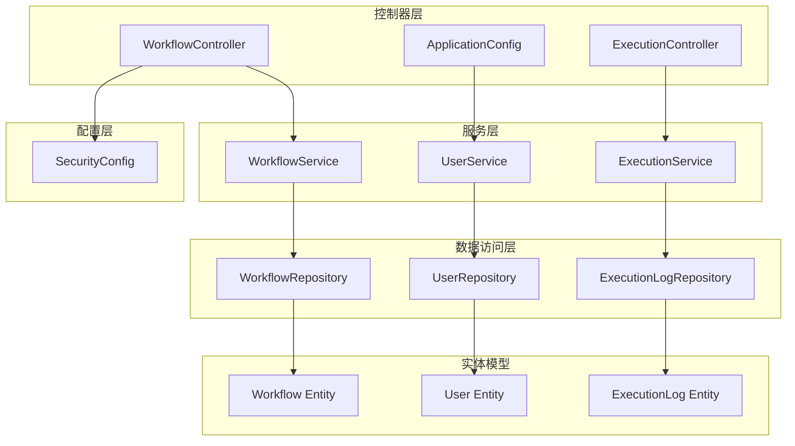
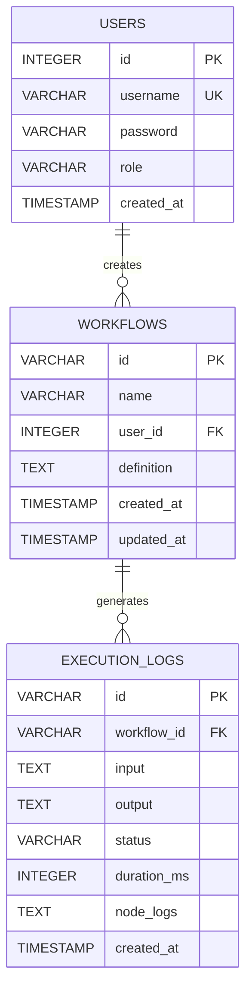
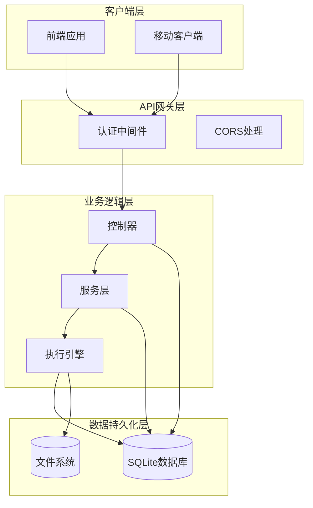
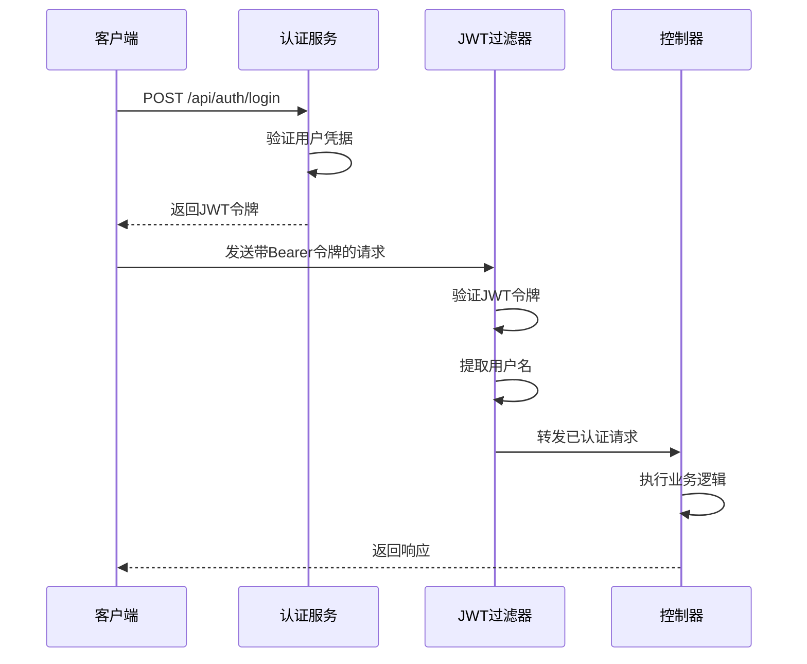
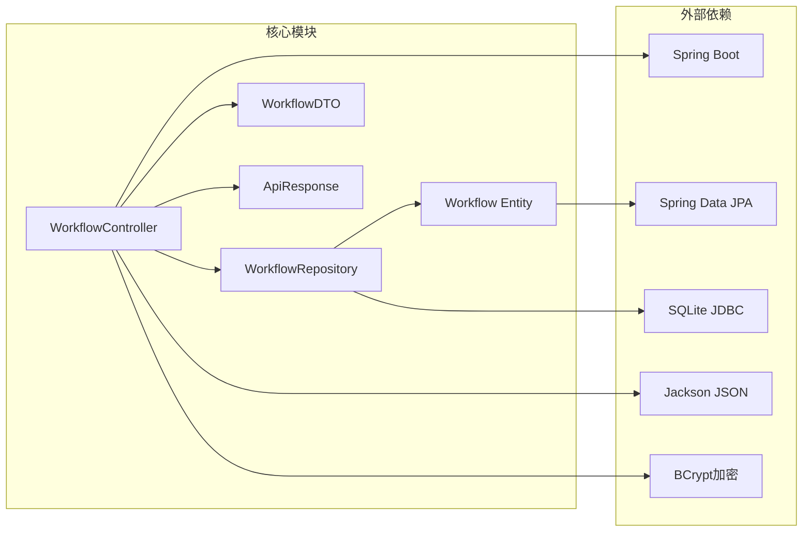
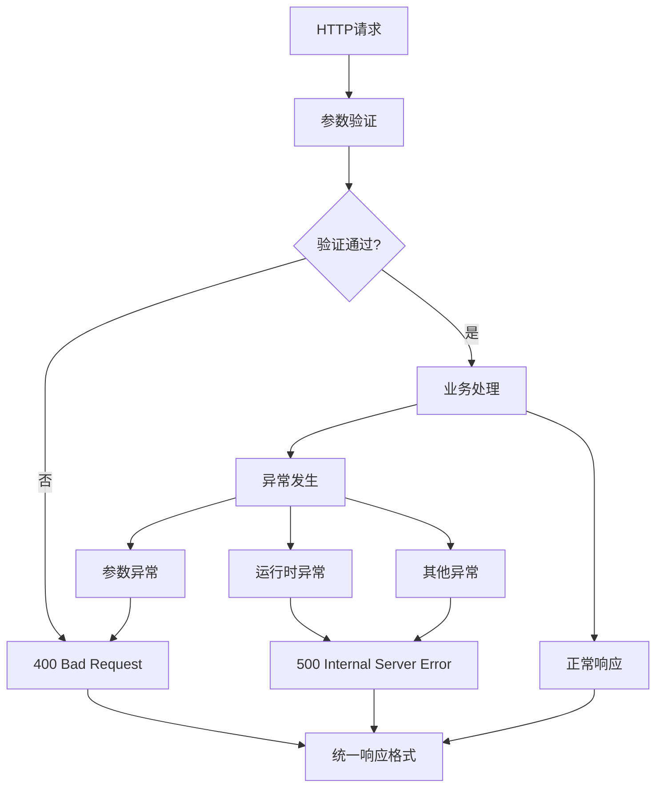

# 工作流API

<cite>
**本文档引用的文件**
- [WorkflowController.java](file://backend/src/main/java/com/paiagent/controller/WorkflowController.java)
- [Workflow.java](file://backend/src/main/java/com/paiagent/model/entity/Workflow.java)
- [WorkflowRepository.java](file://backend/src/main/java/com/paiagent/repository/WorkflowRepository.java)
- [WorkflowDTO.java](file://backend/src/main/java/com/paiagent/model/dto/WorkflowDTO.java)
- [ApiResponse.java](file://backend/src/main/java/com/paiagent/model/dto/ApiResponse.java)
- [SecurityConfig.java](file://backend/src/main/java/com/paiagent/config/SecurityConfig.java)
- [JwtAuthFilter.java](file://backend/src/main/java/com/paiagent/security/JwtAuthFilter.java)
- [GlobalExceptionHandler.java](file://backend/src/main/java/com/paiagent/exception/GlobalExceptionHandler.java)
- [application.yml](file://backend/src/main/resources/application.yml)
- [schema.sql](file://backend/src/main/resources/schema.sql)
- [workflow.ts](file://frontend/src/types/workflow.ts)
- [workflow.ts](file://frontend/src/api/workflow.ts)
</cite>

## 目录
1. [简介](#简介)
2. [项目结构](#项目结构)
3. [核心组件](#核心组件)
4. [架构概览](#架构概览)
5. [详细组件分析](#详细组件分析)
6. [依赖关系分析](#依赖关系分析)
7. [性能考虑](#性能考虑)
8. [故障排除指南](#故障排除指南)
9. [结论](#结论)
10. [附录](#附录)

## 简介

PaiAgent工作流管理API是一个基于Spring Boot构建的RESTful服务，专门用于管理和操作AI工作流。该API提供了完整的工作流生命周期管理功能，包括创建、读取、更新和删除操作。系统采用JWT认证机制确保安全性，并使用SQLite数据库存储工作流数据。

工作流定义采用JSON格式存储，支持复杂的节点图结构，包括输入节点、LLM节点、输出节点和TTS节点等不同类型的工作流节点。每个工作流都与特定用户关联，确保数据隔离和权限控制。

## 项目结构

后端采用标准的Spring Boot分层架构：



**图表来源**
- [WorkflowController.java:1-91](file://backend/src/main/java/com/paiagent/controller/WorkflowController.java#L1-L91)
- [SecurityConfig.java:1-54](file://backend/src/main/java/com/paiagent/config/SecurityConfig.java#L1-L54)

**章节来源**
- [WorkflowController.java:1-91](file://backend/src/main/java/com/paiagent/controller/WorkflowController.java#L1-L91)
- [schema.sql:1-34](file://backend/src/main/resources/schema.sql#L1-L34)

## 核心组件

### 数据模型

工作流系统的核心数据模型包括以下关键实体：



**图表来源**
- [schema.sql:1-34](file://backend/src/main/resources/schema.sql#L1-L34)
- [Workflow.java:1-31](file://backend/src/main/java/com/paiagent/model/entity/Workflow.java#L1-L31)
- [User.java:1-28](file://backend/src/main/java/com/paiagent/model/entity/User.java#L1-L28)

### API响应格式

所有API响应都遵循统一的JSON格式：

| 字段名 | 类型 | 必填 | 描述 |
|--------|------|------|------|
| code | number | 是 | HTTP状态码或业务状态码 |
| data | any | 否 | 响应数据主体 |
| message | string | 否 | 响应消息 |

**章节来源**
- [ApiResponse.java:1-23](file://backend/src/main/java/com/paiagent/model/dto/ApiResponse.java#L1-L23)

## 架构概览

系统采用分层架构设计，确保关注点分离和可维护性：



**图表来源**
- [SecurityConfig.java:26-42](file://backend/src/main/java/com/paiagent/config/SecurityConfig.java#L26-L42)
- [JwtAuthFilter.java:26-41](file://backend/src/main/java/com/paiagent/security/JwtAuthFilter.java#L26-L41)

**章节来源**
- [SecurityConfig.java:1-54](file://backend/src/main/java/com/paiagent/config/SecurityConfig.java#L1-L54)
- [JwtAuthFilter.java:1-51](file://backend/src/main/java/com/paiagent/security/JwtAuthFilter.java#L1-L51)

## 详细组件分析

### 工作流控制器

工作流控制器实现了RESTful API的所有核心功能：

#### GET /api/workflows
**功能**: 获取当前用户的所有工作流列表

**请求参数**: 无

**响应数据**:
- 返回类型: `List<Workflow>`
- 按更新时间降序排列

**错误处理**:
- 200: 成功获取工作流列表
- 500: 服务器内部错误

#### GET /api/workflows/{id}
**功能**: 获取指定工作流的详细信息

**路径参数**:
- `id`: 工作流唯一标识符（UUID格式）

**响应数据**:
- 返回类型: `Workflow`
- 如果工作流不存在返回404错误

**错误处理**:
- 200: 成功获取工作流详情
- 404: 工作流不存在
- 500: 服务器内部错误

#### POST /api/workflows
**功能**: 创建新的工作流

**请求体**:
```json
{
  "name": "string",
  "definition": {
    "nodes": [
      {
        "id": "string",
        "type": "input|output|llm|tts",
        "position": {
          "x": 0,
          "y": 0
        },
        "data": {
          "label": "string",
          "provider": "deepseek|qwen|chatglm|aiping",
          "model": "string",
          "prompt": "string",
          "temperature": 0,
          "maxTokens": 0
        }
      }
    ],
    "edges": [
      {
        "id": "string",
        "source": "string",
        "target": "string"
      }
    ]
  }
}
```

**响应数据**:
- 返回类型: `Workflow`
- 自动设置创建时间和更新时间

**错误处理**:
- 201: 工作流创建成功
- 400: 请求参数验证失败
- 500: 服务器内部错误

#### PUT /api/workflows/{id}
**功能**: 更新现有工作流

**路径参数**:
- `id`: 工作流唯一标识符

**请求体**:
- 结构同POST请求

**响应数据**:
- 返回类型: `Workflow`
- 自动更新更新时间

**错误处理**:
- 200: 工作流更新成功
- 404: 工作流不存在
- 400: 请求参数验证失败
- 500: 服务器内部错误

#### DELETE /api/workflows/{id}
**功能**: 删除指定工作流

**路径参数**:
- `id`: 工作流唯一标识符

**响应数据**:
- 返回类型: `Void`
- 删除成功返回空数据

**错误处理**:
- 200: 工作流删除成功
- 500: 服务器内部错误

**章节来源**
- [WorkflowController.java:35-82](file://backend/src/main/java/com/paiagent/controller/WorkflowController.java#L35-L82)

### 认证与授权

系统采用JWT令牌进行身份验证：



**图表来源**
- [JwtAuthFilter.java:26-41](file://backend/src/main/java/com/paiagent/security/JwtAuthFilter.java#L26-L41)
- [SecurityConfig.java:27-42](file://backend/src/main/java/com/paiagent/config/SecurityConfig.java#L27-L42)

**章节来源**
- [JwtAuthFilter.java:1-51](file://backend/src/main/java/com/paiagent/security/JwtAuthFilter.java#L1-L51)
- [SecurityConfig.java:1-54](file://backend/src/main/java/com/paiagent/config/SecurityConfig.java#L1-L54)

### 数据验证规则

工作流数据验证采用Bean Validation注解：

| 字段 | 验证规则 | 错误消息 |
|------|----------|----------|
| name | @NotBlank | 工作流名称不能为空 |
| definition | 任意JSON对象 | 工作流定义必须是有效的JSON |

**章节来源**
- [WorkflowDTO.java:9-12](file://backend/src/main/java/com/paiagent/model/dto/WorkflowDTO.java#L9-L12)

## 依赖关系分析

系统各组件之间的依赖关系如下：



**图表来源**
- [WorkflowController.java:24-33](file://backend/src/main/java/com/paiagent/controller/WorkflowController.java#L24-L33)
- [WorkflowRepository.java:8-10](file://backend/src/main/java/com/paiagent/repository/WorkflowRepository.java#L8-L10)

**章节来源**
- [WorkflowController.java:1-91](file://backend/src/main/java/com/paiagent/controller/WorkflowController.java#L1-L91)
- [WorkflowRepository.java:1-11](file://backend/src/main/java/com/paiagent/repository/WorkflowRepository.java#L1-L11)

## 性能考虑

### 数据库优化
- 使用UUID作为主键，避免序列化冲突
- 为user_id字段建立外键约束
- 使用TEXT类型存储JSON定义，便于灵活扩展

### 缓存策略
- 当前实现未包含缓存层
- 建议对常用查询结果添加Redis缓存

### 并发处理
- 使用Spring Data JPA的事务管理
- 支持多用户并发操作

## 故障排除指南

### 常见错误及解决方案

| 错误代码 | 错误类型 | 可能原因 | 解决方案 |
|----------|----------|----------|----------|
| 401 | 未授权 | JWT令牌无效或过期 | 重新登录获取新令牌 |
| 403 | 禁止访问 | 权限不足 | 检查用户角色和权限 |
| 404 | 资源不存在 | 工作流ID错误 | 验证工作流是否存在 |
| 400 | 请求错误 | JSON格式不正确 | 检查请求体格式 |
| 500 | 服务器错误 | 系统内部异常 | 查看服务器日志 |

### 异常处理机制

系统采用全局异常处理器统一处理各种异常情况：



**图表来源**
- [GlobalExceptionHandler.java:12-28](file://backend/src/main/java/com/paiagent/exception/GlobalExceptionHandler.java#L12-L28)

**章节来源**
- [GlobalExceptionHandler.java:1-30](file://backend/src/main/java/com/paiagent/exception/GlobalExceptionHandler.java#L1-L30)

## 结论

PaiAgent工作流管理API提供了一个完整、安全且可扩展的工作流管理系统。系统采用现代化的技术栈，具有以下优势：

1. **RESTful设计**: 符合REST规范的API设计，易于集成和使用
2. **安全性**: 基于JWT的认证机制，确保API调用安全
3. **数据完整性**: 使用SQLite数据库和外键约束保证数据一致性
4. **可扩展性**: 清晰的分层架构支持功能扩展和性能优化
5. **开发友好**: 统一的响应格式和错误处理机制

建议在生产环境中进一步增强：
- 添加API版本控制
- 实现请求速率限制
- 集成监控和日志系统
- 添加工作流执行状态跟踪

## 附录

### API端点完整列表

| 方法 | 端点 | 权限要求 | 功能描述 |
|------|------|----------|----------|
| GET | /api/workflows | 已认证 | 获取工作流列表 |
| GET | /api/workflows/{id} | 已认证 | 获取工作流详情 |
| POST | /api/workflows | 已认证 | 创建新工作流 |
| PUT | /api/workflows/{id} | 已认证 | 更新工作流 |
| DELETE | /api/workflows/{id} | 已认证 | 删除工作流 |

### 前端集成示例

前端类型定义提供了完整的工作流结构：

```typescript
interface WorkflowDefinition {
  nodes: WorkflowNode[];
  edges: WorkflowEdge[];
}

interface WorkflowNode {
  id: string;
  type: 'input' | 'output' | 'llm' | 'tts';
  position: { x: number; y: number };
  data: CustomNodeData;
}
```

**章节来源**
- [workflow.ts:38-50](file://frontend/src/types/workflow.ts#L38-L50)
- [workflow.ts:1-22](file://frontend/src/api/workflow.ts#L1-L22)