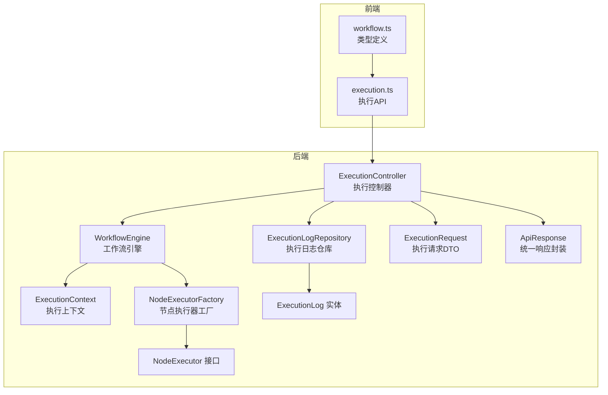
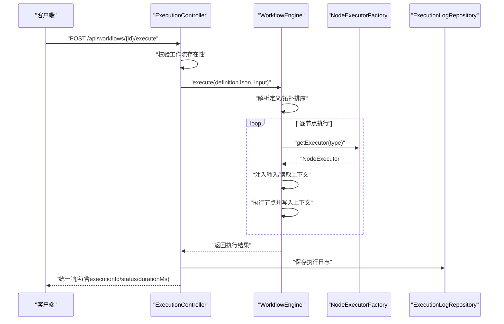
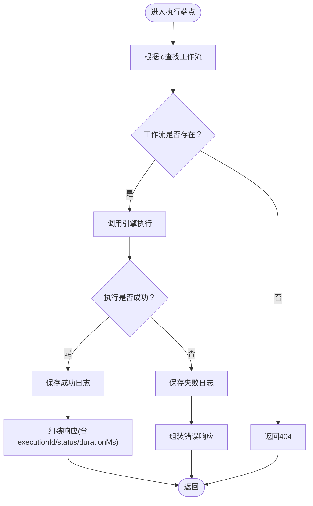
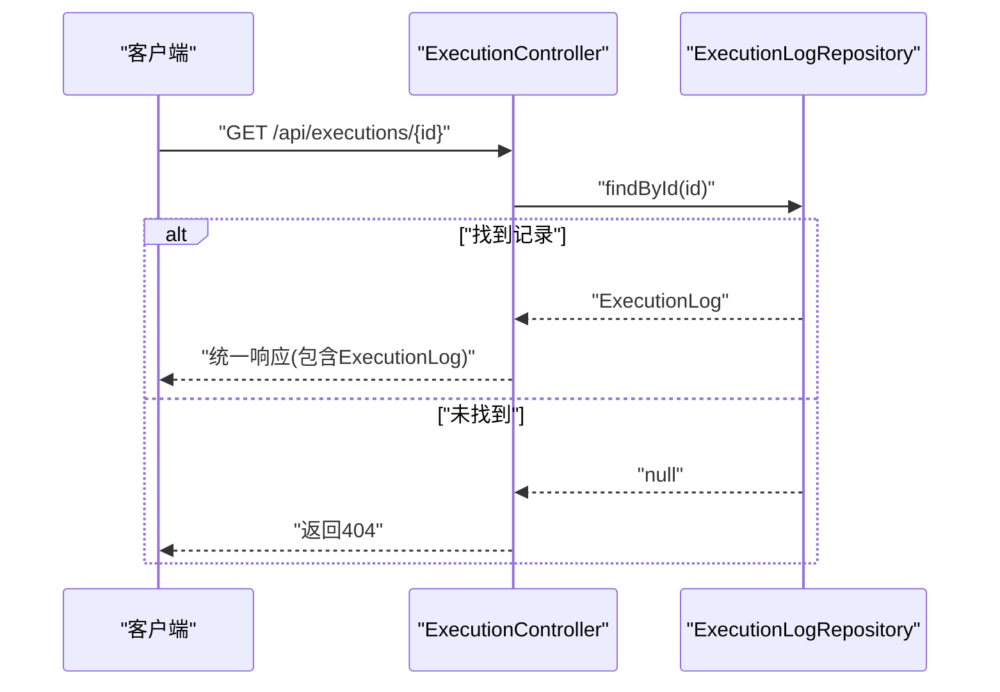
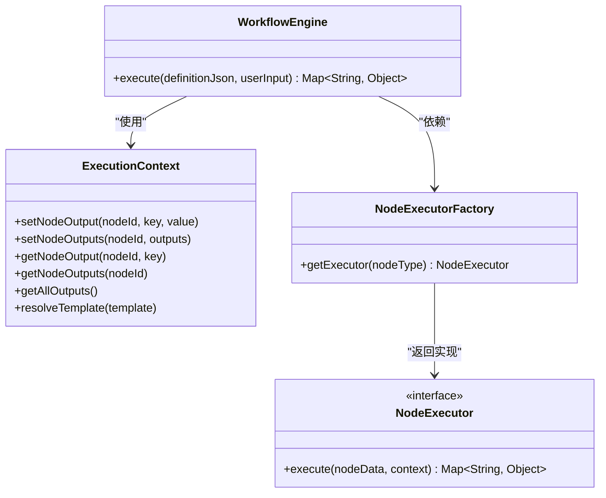
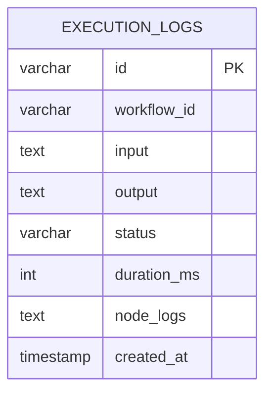
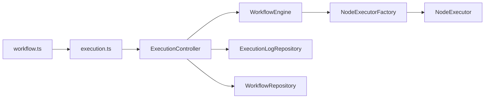

# 执行API

<cite>
**本文引用的文件**
- [ExecutionController.java](file://backend/src/main/java/com/paiagent/controller/ExecutionController.java)
- [WorkflowEngine.java](file://backend/src/main/java/com/paiagent/engine/WorkflowEngine.java)
- [ExecutionContext.java](file://backend/src/main/java/com/paiagent/engine/ExecutionContext.java)
- [NodeExecutor.java](file://backend/src/main/java/com/paiagent/engine/NodeExecutor.java)
- [NodeExecutorFactory.java](file://backend/src/main/java/com/paiagent/engine/NodeExecutorFactory.java)
- [ExecutionRequest.java](file://backend/src/main/java/com/paiagent/model/dto/ExecutionRequest.java)
- [ExecutionLog.java](file://backend/src/main/java/com/paiagent/model/entity/ExecutionLog.java)
- [ApiResponse.java](file://backend/src/main/java/com/paiagent/model/dto/ApiResponse.java)
- [ExecutionLogRepository.java](file://backend/src/main/java/com/paiagent/repository/ExecutionLogRepository.java)
- [application.yml](file://backend/src/main/resources/application.yml)
- [execution.ts](file://frontend/src/api/execution.ts)
- [workflow.ts](file://frontend/src/types/workflow.ts)
</cite>

## 目录
1. [简介](#简介)
2. [项目结构](#项目结构)
3. [核心组件](#核心组件)
4. [架构总览](#架构总览)
5. [详细组件分析](#详细组件分析)
6. [依赖分析](#依赖分析)
7. [性能考虑](#性能考虑)
8. [故障排查指南](#故障排查指南)
9. [结论](#结论)
10. [附录](#附录)

## 简介
本文件为 PaiAgent 工作流执行API的详细RESTful文档，聚焦于以下两个核心端点：
- 工作流执行：POST /api/workflows/{id}/execute
- 执行结果查询：GET /api/executions/{id}

文档内容涵盖：
- 请求参数与输入数据格式
- 执行上下文构建与节点拓扑排序
- 异步执行（同步返回）与日志持久化
- 响应结构与错误信息
- 执行日志存储机制、超时处理与并发控制策略
- 调试最佳实践与性能优化建议

## 项目结构
后端采用Spring Boot + JPA + SQLite，控制器位于 controller 包，执行引擎位于 engine 包，实体与仓库位于 model 与 repository 包；前端通过独立的 API 模块调用后端接口。

图表来源
- [ExecutionController.java:18-92](file://backend/src/main/java/com/paiagent/controller/ExecutionController.java#L18-L92)
- [WorkflowEngine.java:10-136](file://backend/src/main/java/com/paiagent/engine/WorkflowEngine.java#L10-L136)
- [ExecutionContext.java:10-63](file://backend/src/main/java/com/paiagent/engine/ExecutionContext.java#L10-L63)
- [NodeExecutorFactory.java:9-29](file://backend/src/main/java/com/paiagent/engine/NodeExecutorFactory.java#L9-L29)
- [NodeExecutor.java:8-17](file://backend/src/main/java/com/paiagent/engine/NodeExecutor.java#L8-L17)
- [ExecutionLogRepository.java:8-11](file://backend/src/main/java/com/paiagent/repository/ExecutionLogRepository.java#L8-L11)
- [ExecutionLog.java:11-37](file://backend/src/main/java/com/paiagent/model/entity/ExecutionLog.java#L11-L37)
- [ExecutionRequest.java:8-12](file://backend/src/main/java/com/paiagent/model/dto/ExecutionRequest.java#L8-L12)
- [ApiResponse.java:10-23](file://backend/src/main/java/com/paiagent/model/dto/ApiResponse.java#L10-L23)
- [execution.ts:5-12](file://frontend/src/api/execution.ts#L5-L12)
- [workflow.ts:52-71](file://frontend/src/types/workflow.ts#L52-L71)

章节来源
- [ExecutionController.java:18-92](file://backend/src/main/java/com/paiagent/controller/ExecutionController.java#L18-L92)
- [WorkflowEngine.java:10-136](file://backend/src/main/java/com/paiagent/engine/WorkflowEngine.java#L10-L136)
- [execution.ts:5-12](file://frontend/src/api/execution.ts#L5-L12)
- [workflow.ts:52-71](file://frontend/src/types/workflow.ts#L52-L71)

## 核心组件
- 执行控制器（ExecutionController）
  - 提供工作流执行与执行结果查询两个端点
  - 负责校验工作流存在性、调用引擎执行、持久化执行日志、构造统一响应
- 工作流引擎（WorkflowEngine）
  - 解析工作流定义（节点与边）、拓扑排序、按序执行节点、收集输出与节点日志
  - 注入用户输入到输入节点，并在上下文中传递中间结果
- 执行上下文（ExecutionContext）
  - 存储各节点输出键值对，支持模板占位符解析（如 {{nodeId.key}}）
- 节点执行器工厂（NodeExecutorFactory）
  - 维护节点类型到执行器的映射，按类型分发执行
- 执行请求DTO（ExecutionRequest）
  - 定义执行请求的输入字段（必填）
- 执行日志实体与仓库（ExecutionLog、ExecutionLogRepository）
  - 记录执行ID、工作流ID、输入、输出、状态、耗时、节点日志与时间戳
- 统一响应封装（ApiResponse）
  - 规范化返回结构（code/data/message）

章节来源
- [ExecutionController.java:27-91](file://backend/src/main/java/com/paiagent/controller/ExecutionController.java#L27-L91)
- [WorkflowEngine.java:21-108](file://backend/src/main/java/com/paiagent/engine/WorkflowEngine.java#L21-L108)
- [ExecutionContext.java:10-63](file://backend/src/main/java/com/paiagent/engine/ExecutionContext.java#L10-L63)
- [NodeExecutorFactory.java:9-29](file://backend/src/main/java/com/paiagent/engine/NodeExecutorFactory.java#L9-L29)
- [ExecutionRequest.java:8-12](file://backend/src/main/java/com/paiagent/model/dto/ExecutionRequest.java#L8-L12)
- [ExecutionLog.java:11-37](file://backend/src/main/java/com/paiagent/model/entity/ExecutionLog.java#L11-L37)
- [ApiResponse.java:10-23](file://backend/src/main/java/com/paiagent/model/dto/ApiResponse.java#L10-L23)

## 架构总览
下图展示了从HTTP请求到执行完成并落库的整体流程。

图表来源
- [ExecutionController.java:37-82](file://backend/src/main/java/com/paiagent/controller/ExecutionController.java#L37-L82)
- [WorkflowEngine.java:21-108](file://backend/src/main/java/com/paiagent/engine/WorkflowEngine.java#L21-L108)
- [NodeExecutorFactory.java:21-27](file://backend/src/main/java/com/paiagent/engine/NodeExecutorFactory.java#L21-L27)
- [ExecutionLogRepository.java:8-11](file://backend/src/main/java/com/paiagent/repository/ExecutionLogRepository.java#L8-L11)

## 详细组件分析

### 执行端点：POST /api/workflows/{id}/execute
- 功能概述
  - 接收工作流ID与执行输入，调用工作流引擎执行，返回执行结果与元信息
- 请求路径与方法
  - POST /api/workflows/{id}/execute
- 路径参数
  - id：工作流唯一标识（字符串）
- 请求体（JSON）
  - 字段：input（字符串，必填）
  - 说明：作为用户输入传入工作流中的“输入”节点
- 成功响应
  - 返回结构：统一响应对象，包含code=200、message="ok"，data为执行结果
  - data字段：
    - executionId：本次执行的唯一标识（字符串）
    - status：执行状态（字符串："SUCCESS"）
    - output：工作流最终输出（结构取决于工作流定义）
    - nodeLogs：节点执行日志数组（见“节点日志结构”）
    - durationMs：本次执行耗时（毫秒，整数）
- 失败响应
  - 返回结构：统一响应对象，包含非200的code与错误消息
  - 常见错误：
    - 404：工作流不存在
    - 500：执行异常（包含错误消息）
- 执行流程要点
  - 输入数据以字符串形式接收，引擎将其注入到“输入”节点
  - 引擎按拓扑顺序执行节点，节点间通过ExecutionContext传递输出
  - 执行完成后，将结果与元信息写入执行日志表
- 前端调用参考
  - 前端通过API模块发起POST请求，携带{ input }对象

图表来源
- [ExecutionController.java:37-82](file://backend/src/main/java/com/paiagent/controller/ExecutionController.java#L37-L82)
- [ExecutionRequest.java:8-12](file://backend/src/main/java/com/paiagent/model/dto/ExecutionRequest.java#L8-L12)
- [ApiResponse.java:15-21](file://backend/src/main/java/com/paiagent/model/dto/ApiResponse.java#L15-L21)

章节来源
- [ExecutionController.java:37-82](file://backend/src/main/java/com/paiagent/controller/ExecutionController.java#L37-L82)
- [ExecutionRequest.java:8-12](file://backend/src/main/java/com/paiagent/model/dto/ExecutionRequest.java#L8-L12)
- [ApiResponse.java:15-21](file://backend/src/main/java/com/paiagent/model/dto/ApiResponse.java#L15-L21)
- [execution.ts:6-8](file://frontend/src/api/execution.ts#L6-L8)

### 执行结果查询端点：GET /api/executions/{id}
- 功能概述
  - 根据执行ID查询执行详情（包括输入、输出、状态、耗时、节点日志等）
- 请求路径与方法
  - GET /api/executions/{id}
- 路径参数
  - id：执行记录唯一标识（字符串）
- 成功响应
  - 返回结构：统一响应对象，包含code=200、message="ok"，data为执行日志实体
  - data字段（ExecutionLog）：
    - id：执行ID（字符串）
    - workflowId：所属工作流ID（字符串）
    - input：原始输入（字符串，TEXT）
    - output：执行结果（字符串，TEXT，JSON序列化）
    - status：执行状态（字符串："SUCCESS"|"FAILED"）
    - durationMs：耗时（整数，毫秒）
    - nodeLogs：节点级日志（字符串，TEXT，JSON序列化）
    - createdAt：创建时间（时间戳）
- 失败响应
  - 返回结构：统一响应对象，包含404与错误消息
- 前端调用参考
  - 前端通过API模块发起GET请求，传入executionId

图表来源
- [ExecutionController.java:84-91](file://backend/src/main/java/com/paiagent/controller/ExecutionController.java#L84-L91)
- [ExecutionLogRepository.java:8-11](file://backend/src/main/java/com/paiagent/repository/ExecutionLogRepository.java#L8-L11)

章节来源
- [ExecutionController.java:84-91](file://backend/src/main/java/com/paiagent/controller/ExecutionController.java#L84-L91)
- [ExecutionLogRepository.java:8-11](file://backend/src/main/java/com/paiagent/repository/ExecutionLogRepository.java#L8-L11)
- [execution.ts:9-11](file://frontend/src/api/execution.ts#L9-L11)

### 执行上下文与节点执行
- 上下文（ExecutionContext）
  - 作用：在节点间传递中间结果，支持模板占位符解析
  - 关键能力：
    - setNodeOutputs/getNodeOutputs：设置与获取节点输出
    - resolveTemplate：解析形如 {{nodeId.key}} 的模板
- 节点执行器（NodeExecutor）
  - 接口：execute(nodeData, context) -> Map<String, Object>
  - 工厂：NodeExecutorFactory 按类型返回对应执行器
- 引擎执行流程（简化）
  - 解析工作流定义（nodes/edges）
  - 构建邻接表与入度，进行拓扑排序
  - 遍历执行顺序：
    - 对“输入”节点注入用户输入
    - 获取执行器并执行，将输出写入上下文
    - 记录节点日志（含状态、耗时、输出或错误）
  - 收集最终输出（来自“输出”节点）

图表来源
- [ExecutionContext.java:10-63](file://backend/src/main/java/com/paiagent/engine/ExecutionContext.java#L10-L63)
- [NodeExecutor.java:8-17](file://backend/src/main/java/com/paiagent/engine/NodeExecutor.java#L8-L17)
- [NodeExecutorFactory.java:9-29](file://backend/src/main/java/com/paiagent/engine/NodeExecutorFactory.java#L9-L29)
- [WorkflowEngine.java:10-18](file://backend/src/main/java/com/paiagent/engine/WorkflowEngine.java#L10-L18)

章节来源
- [ExecutionContext.java:10-63](file://backend/src/main/java/com/paiagent/engine/ExecutionContext.java#L10-L63)
- [NodeExecutor.java:8-17](file://backend/src/main/java/com/paiagent/engine/NodeExecutor.java#L8-L17)
- [NodeExecutorFactory.java:9-29](file://backend/src/main/java/com/paiagent/engine/NodeExecutorFactory.java#L9-L29)
- [WorkflowEngine.java:21-108](file://backend/src/main/java/com/paiagent/engine/WorkflowEngine.java#L21-L108)

### 数据模型与日志存储
- 执行日志实体（ExecutionLog）
  - 字段：id、workflowId、input、output、status、durationMs、nodeLogs、createdAt
  - 存储：TEXT类型字段用于存放JSON序列化的输入、输出与节点日志
- 日志仓库（ExecutionLogRepository）
  - 提供按工作流ID查询执行历史的排序查询方法
- 应用配置（application.yml）
  - 数据源：SQLite（默认路径 ./data/paiagent.db）
  - JWT密钥与过期时间
  - LLM/TTS服务配置（用于节点执行器）

图表来源
- [ExecutionLog.java:11-37](file://backend/src/main/java/com/paiagent/model/entity/ExecutionLog.java#L11-L37)
- [ExecutionLogRepository.java:8-11](file://backend/src/main/java/com/paiagent/repository/ExecutionLogRepository.java#L8-L11)

章节来源
- [ExecutionLog.java:11-37](file://backend/src/main/java/com/paiagent/model/entity/ExecutionLog.java#L11-L37)
- [ExecutionLogRepository.java:8-11](file://backend/src/main/java/com/paiagent/repository/ExecutionLogRepository.java#L8-L11)
- [application.yml:4-14](file://backend/src/main/resources/application.yml#L4-L14)

### 响应与错误处理
- 统一响应（ApiResponse）
  - 结构：code、data、message
  - 成功：code=200，message="ok"
  - 失败：自定义code与message
- 执行端点错误
  - 404：工作流不存在
  - 500：执行异常（包含异常消息）
- 查询端点错误
  - 404：执行记录不存在

章节来源
- [ApiResponse.java:10-23](file://backend/src/main/java/com/paiagent/model/dto/ApiResponse.java#L10-L23)
- [ExecutionController.java:41-43](file://backend/src/main/java/com/paiagent/controller/ExecutionController.java#L41-L43)
- [ExecutionController.java:87-89](file://backend/src/main/java/com/paiagent/controller/ExecutionController.java#L87-L89)

## 依赖分析
- 控制器依赖
  - ExecutionController 依赖 WorkflowEngine、ExecutionLogRepository、WorkflowRepository、ObjectMapper
- 引擎依赖
  - WorkflowEngine 依赖 NodeExecutorFactory、ObjectMapper
- 执行器工厂
  - NodeExecutorFactory 维护节点类型到执行器实例的映射
- 前端依赖
  - execution.ts 通过基础API模块发起请求，workflow.ts 定义了执行结果与节点日志的数据结构

图表来源
- [ExecutionController.java:27-35](file://backend/src/main/java/com/paiagent/controller/ExecutionController.java#L27-L35)
- [WorkflowEngine.java:15-18](file://backend/src/main/java/com/paiagent/engine/WorkflowEngine.java#L15-L18)
- [NodeExecutorFactory.java:14-19](file://backend/src/main/java/com/paiagent/engine/NodeExecutorFactory.java#L14-L19)
- [execution.ts:1-12](file://frontend/src/api/execution.ts#L1-L12)
- [workflow.ts:52-71](file://frontend/src/types/workflow.ts#L52-L71)

章节来源
- [ExecutionController.java:27-35](file://backend/src/main/java/com/paiagent/controller/ExecutionController.java#L27-L35)
- [WorkflowEngine.java:15-18](file://backend/src/main/java/com/paiagent/engine/WorkflowEngine.java#L15-L18)
- [NodeExecutorFactory.java:14-19](file://backend/src/main/java/com/paiagent/engine/NodeExecutorFactory.java#L14-L19)
- [execution.ts:1-12](file://frontend/src/api/execution.ts#L1-L12)
- [workflow.ts:52-71](file://frontend/src/types/workflow.ts#L52-L71)

## 性能考虑
- 同步执行与超时
  - 当前实现为同步执行，若工作流节点较多或外部调用耗时较长，可能导致请求阻塞
  - 建议：引入执行超时配置与异步执行队列（例如基于线程池或消息队列），将执行结果通过轮询或回调返回
- 并发控制
  - 可在控制器层增加执行令牌或速率限制，避免高并发导致资源争用
- 日志与序列化
  - 输出与节点日志以TEXT字段存储，建议控制单次执行结果大小，避免数据库膨胀
- 数据库与索引
  - 为 workflow_id 和 created_at 建立索引，提升历史查询性能
- 前端轮询
  - 建议前端采用指数退避策略轮询执行结果，降低无效请求

[本节为通用性能建议，不直接分析具体文件]

## 故障排查指南
- 常见问题与定位
  - 工作流不存在：检查工作流ID是否正确
  - 执行失败：查看执行日志的status与error字段（节点日志中包含每个节点的错误信息）
  - 输入格式错误：确认input为字符串，且符合工作流“输入”节点预期
- 日志与审计
  - 使用GET /api/executions/{id} 查看完整执行历史与节点日志
  - 若日志未入库，检查数据库连接与权限
- 节点类型未知
  - 若出现“未知节点类型”，检查工作流定义中节点type是否为受支持类型（input/output/llm/tts）

章节来源
- [ExecutionController.java:41-43](file://backend/src/main/java/com/paiagent/controller/ExecutionController.java#L41-L43)
- [ExecutionController.java:87-89](file://backend/src/main/java/com/paiagent/controller/ExecutionController.java#L87-L89)
- [WorkflowEngine.java:81-89](file://backend/src/main/java/com/paiagent/engine/WorkflowEngine.java#L81-L89)

## 结论
本文档系统梳理了PaiAgent执行API的端点设计、请求响应规范、执行引擎与上下文机制、日志存储与错误处理。当前实现为同步执行，适合中小规模工作流；对于大规模或长耗时场景，建议引入异步执行与超时控制，同时优化数据库与前端轮询策略，以获得更佳的用户体验与系统稳定性。

[本节为总结性内容，不直接分析具体文件]

## 附录

### 请求与响应示例（结构说明）
- 执行请求（POST /api/workflows/{id}/execute）
  - 请求体
    - input：字符串（必填）
  - 成功响应data
    - executionId：字符串
    - status：SUCCESS
    - output：对象（结构取决于工作流定义）
    - nodeLogs：数组（元素包含节点ID、类型、状态、耗时、输出或错误）
    - durationMs：整数（毫秒）
- 执行结果查询（GET /api/executions/{id}）
  - 成功响应data
    - id、workflowId、input、output、status、durationMs、nodeLogs、createdAt

章节来源
- [ExecutionRequest.java:8-12](file://backend/src/main/java/com/paiagent/model/dto/ExecutionRequest.java#L8-L12)
- [ExecutionController.java:37-82](file://backend/src/main/java/com/paiagent/controller/ExecutionController.java#L37-L82)
- [ExecutionController.java:84-91](file://backend/src/main/java/com/paiagent/controller/ExecutionController.java#L84-L91)
- [workflow.ts:52-71](file://frontend/src/types/workflow.ts#L52-L71)