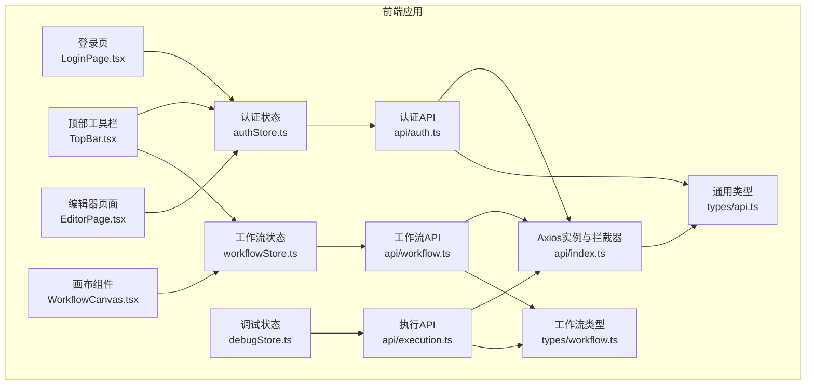
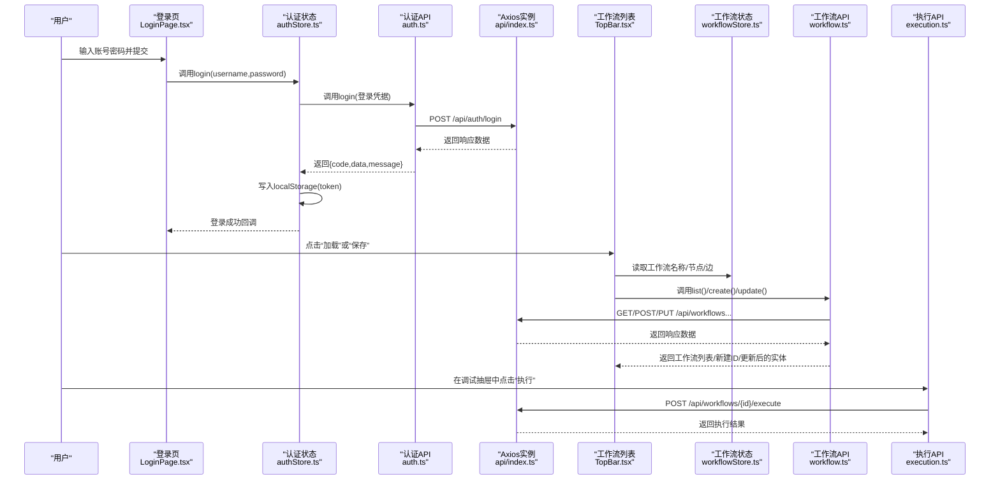
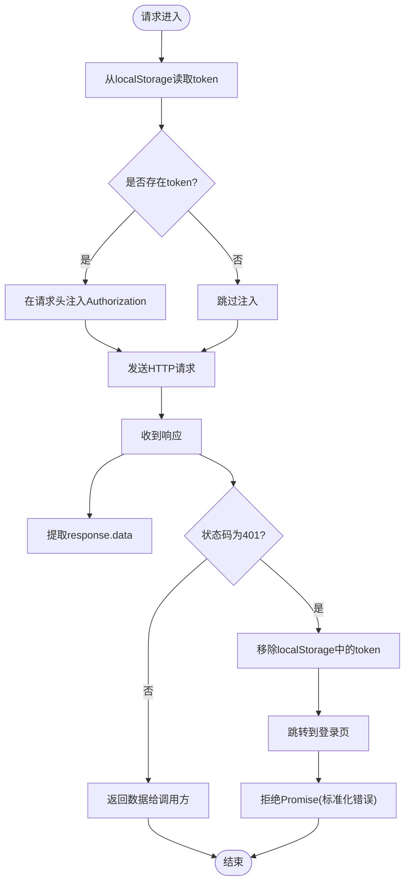
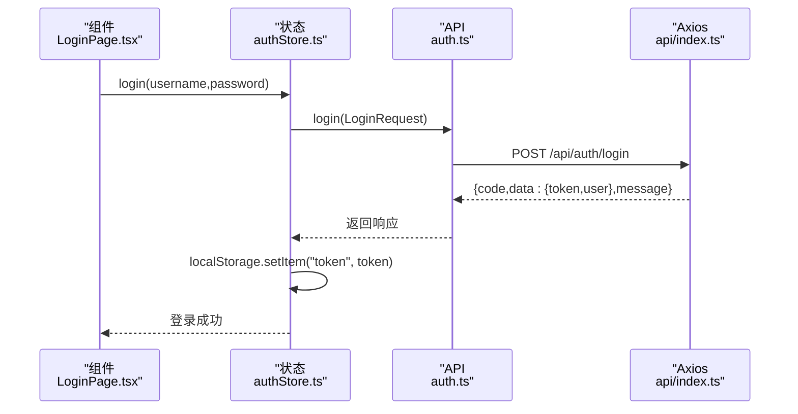
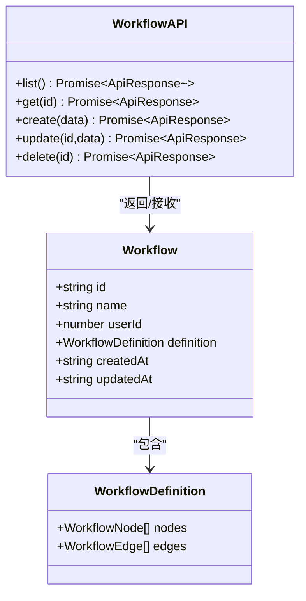
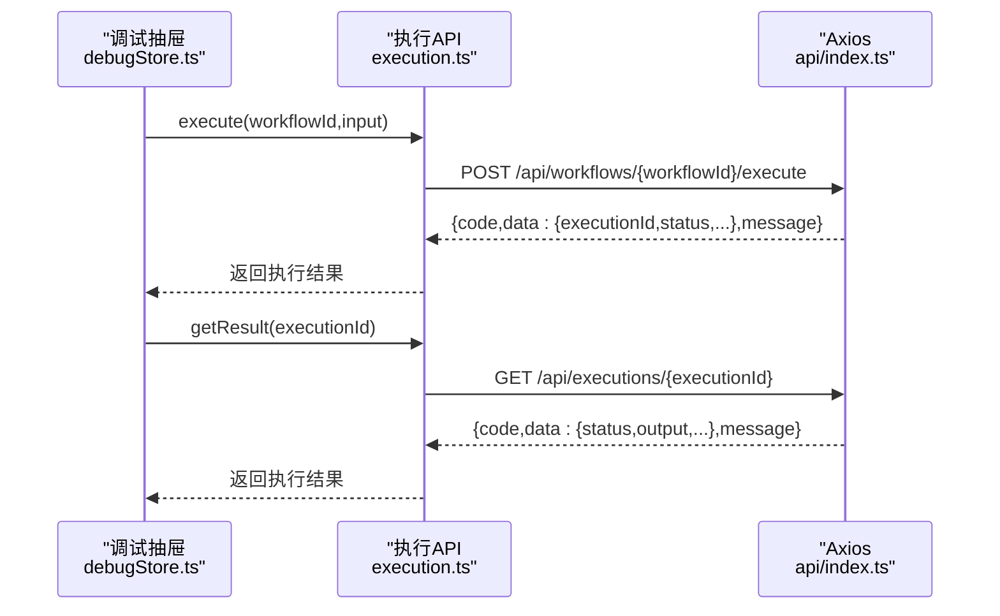
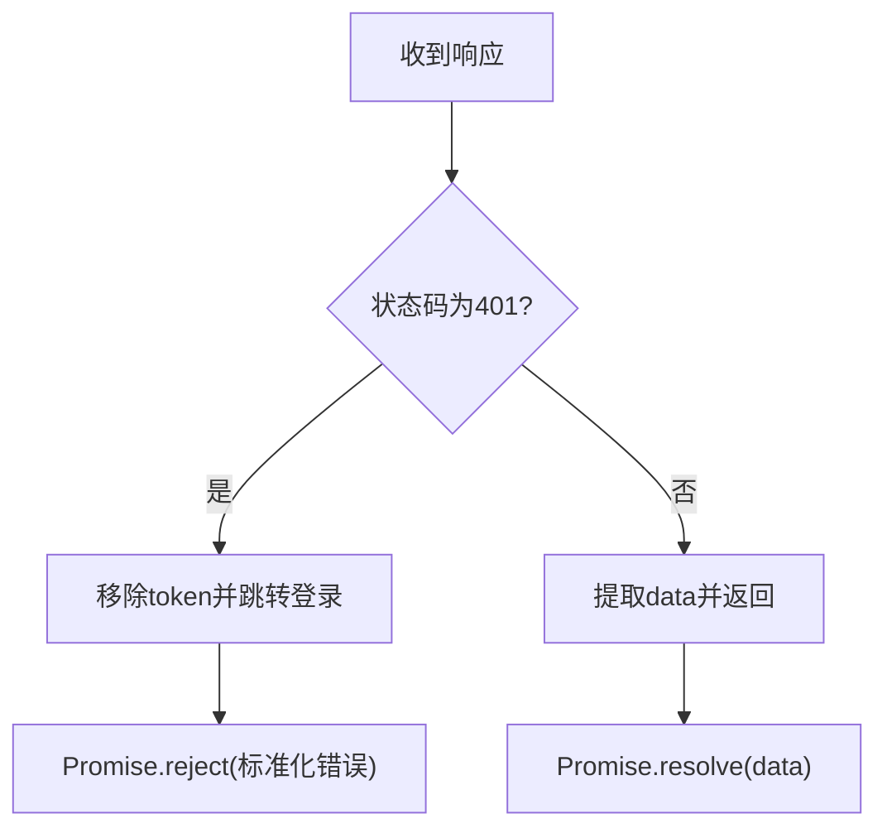
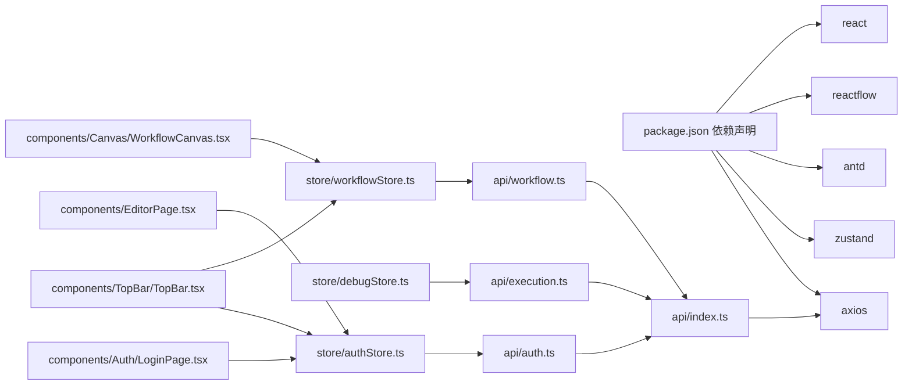

# API客户端集成

<cite>
**本文引用的文件**
- [frontend/src/api/index.ts](file://frontend/src/api/index.ts)
- [frontend/src/api/auth.ts](file://frontend/src/api/auth.ts)
- [frontend/src/api/workflow.ts](file://frontend/src/api/workflow.ts)
- [frontend/src/api/execution.ts](file://frontend/src/api/execution.ts)
- [frontend/src/store/authStore.ts](file://frontend/src/store/authStore.ts)
- [frontend/src/store/debugStore.ts](file://frontend/src/store/debugStore.ts)
- [frontend/src/types/api.ts](file://frontend/src/types/api.ts)
- [frontend/src/types/workflow.ts](file://frontend/src/types/workflow.ts)
- [frontend/src/components/Auth/LoginPage.tsx](file://frontend/src/components/Auth/LoginPage.tsx)
- [frontend/src/components/TopBar/TopBar.tsx](file://frontend/src/components/TopBar/TopBar.tsx)
- [frontend/src/components/EditorPage.tsx](file://frontend/src/components/EditorPage.tsx)
- [frontend/src/components/Canvas/WorkflowCanvas.tsx](file://frontend/src/components/Canvas/WorkflowCanvas.tsx)
- [frontend/package.json](file://frontend/package.json)
</cite>

## 目录
1. [简介](#简介)
2. [项目结构](#项目结构)
3. [核心组件](#核心组件)
4. [架构总览](#架构总览)
5. [详细组件分析](#详细组件分析)
6. [依赖关系分析](#依赖关系分析)
7. [性能考虑](#性能考虑)
8. [故障排查指南](#故障排查指南)
9. [结论](#结论)
10. [附录：使用示例与集成指南](#附录使用示例与集成指南)

## 简介
本文件面向前端开发者，系统性梳理该前端项目中的API客户端集成方案，重点覆盖以下方面：
- Axios基础配置与拦截器（请求头注入、统一响应数据提取、401自动登出）
- 认证流程与JWT令牌管理（登录、获取当前用户、登出、鉴权检查）
- 工作流API封装（CRUD、批量加载、保存与更新）
- 执行API实现（触发执行、获取结果）
- 错误处理策略（网络错误、服务器错误、业务错误）
- 最佳实践（请求去重、缓存策略、性能优化）
- 使用示例与集成指南

## 项目结构
前端采用模块化组织，API层通过Axios统一发起HTTP请求；状态管理使用Zustand；类型定义位于独立的类型文件中；页面组件通过store与API交互。

图表来源
- [frontend/src/api/index.ts:1-31](file://frontend/src/api/index.ts#L1-L31)
- [frontend/src/api/auth.ts:1-12](file://frontend/src/api/auth.ts#L1-L12)
- [frontend/src/api/workflow.ts:1-22](file://frontend/src/api/workflow.ts#L1-L22)
- [frontend/src/api/execution.ts:1-13](file://frontend/src/api/execution.ts#L1-L13)
- [frontend/src/store/authStore.ts:1-50](file://frontend/src/store/authStore.ts#L1-L50)
- [frontend/src/store/debugStore.ts:1-45](file://frontend/src/store/debugStore.ts#L1-L45)
- [frontend/src/types/api.ts:1-22](file://frontend/src/types/api.ts#L1-L22)
- [frontend/src/types/workflow.ts:1-71](file://frontend/src/types/workflow.ts#L1-L71)

章节来源
- [frontend/src/api/index.ts:1-31](file://frontend/src/api/index.ts#L1-L31)
- [frontend/src/store/authStore.ts:1-50](file://frontend/src/store/authStore.ts#L1-L50)
- [frontend/src/store/debugStore.ts:1-45](file://frontend/src/store/debugStore.ts#L1-L45)
- [frontend/src/types/api.ts:1-22](file://frontend/src/types/api.ts#L1-L22)
- [frontend/src/types/workflow.ts:1-71](file://frontend/src/types/workflow.ts#L1-L71)

## 核心组件
- Axios实例与拦截器
  - 基础配置：baseURL、超时、Content-Type
  - 请求拦截器：从localStorage读取token并注入Authorization头
  - 响应拦截器：统一提取response.data；对401进行清理并跳转登录
- 认证API
  - 登录接口：提交用户名密码，返回token与用户信息
  - 获取当前用户：携带token访问受保护资源
- 工作流API
  - 列表、详情、创建、更新、删除
- 执行API
  - 触发执行：传入workflowId与输入文本
  - 获取结果：根据executionId查询执行结果
- 状态管理
  - 认证状态：登录、登出、鉴权检查
  - 调试状态：打开/关闭调试抽屉、执行输入、结果与错误状态
- 类型定义
  - 通用响应体、登录请求/响应、用户信息
  - 工作流定义、工作流实体、执行结果与节点日志

章节来源
- [frontend/src/api/index.ts:1-31](file://frontend/src/api/index.ts#L1-L31)
- [frontend/src/api/auth.ts:1-12](file://frontend/src/api/auth.ts#L1-L12)
- [frontend/src/api/workflow.ts:1-22](file://frontend/src/api/workflow.ts#L1-L22)
- [frontend/src/api/execution.ts:1-13](file://frontend/src/api/execution.ts#L1-L13)
- [frontend/src/store/authStore.ts:1-50](file://frontend/src/store/authStore.ts#L1-L50)
- [frontend/src/store/debugStore.ts:1-45](file://frontend/src/store/debugStore.ts#L1-L45)
- [frontend/src/types/api.ts:1-22](file://frontend/src/types/api.ts#L1-L22)
- [frontend/src/types/workflow.ts:1-71](file://frontend/src/types/workflow.ts#L1-L71)

## 架构总览
下图展示了从前端组件到API层再到后端的整体调用链路与数据流。

图表来源
- [frontend/src/components/Auth/LoginPage.tsx:1-46](file://frontend/src/components/Auth/LoginPage.tsx#L1-L46)
- [frontend/src/store/authStore.ts:1-50](file://frontend/src/store/authStore.ts#L1-L50)
- [frontend/src/api/auth.ts:1-12](file://frontend/src/api/auth.ts#L1-L12)
- [frontend/src/api/index.ts:1-31](file://frontend/src/api/index.ts#L1-L31)
- [frontend/src/components/TopBar/TopBar.tsx:1-145](file://frontend/src/components/TopBar/TopBar.tsx#L1-L145)
- [frontend/src/store/workflowStore.ts:1-95](file://frontend/src/store/workflowStore.ts#L1-L95)
- [frontend/src/api/workflow.ts:1-22](file://frontend/src/api/workflow.ts#L1-L22)
- [frontend/src/api/execution.ts:1-13](file://frontend/src/api/execution.ts#L1-L13)

## 详细组件分析

### Axios配置与拦截器
- 基础配置
  - baseURL指向后端统一前缀
  - 超时时间与Content-Type设置
- 请求拦截器
  - 从localStorage读取token并在请求头注入Authorization
- 响应拦截器
  - 统一提取response.data作为业务数据
  - 对401错误移除token并跳转登录页，同时向调用方抛出标准化错误对象

图表来源
- [frontend/src/api/index.ts:1-31](file://frontend/src/api/index.ts#L1-L31)

章节来源
- [frontend/src/api/index.ts:1-31](file://frontend/src/api/index.ts#L1-L31)

### 认证拦截器与登录流程
- 登录
  - 组件触发store.login，内部调用authApi.login
  - 成功后持久化token并更新状态
- 获取当前用户
  - 鉴权检查时调用authApi.getMe，成功则写入用户信息
- 登出
  - 清理token与状态，并跳转登录页
- 401自动处理
  - 响应拦截器检测401，自动清理token并跳转登录

图表来源
- [frontend/src/components/Auth/LoginPage.tsx:1-46](file://frontend/src/components/Auth/LoginPage.tsx#L1-L46)
- [frontend/src/store/authStore.ts:1-50](file://frontend/src/store/authStore.ts#L1-L50)
- [frontend/src/api/auth.ts:1-12](file://frontend/src/api/auth.ts#L1-L12)
- [frontend/src/api/index.ts:1-31](file://frontend/src/api/index.ts#L1-L31)

章节来源
- [frontend/src/store/authStore.ts:1-50](file://frontend/src/store/authStore.ts#L1-L50)
- [frontend/src/api/auth.ts:1-12](file://frontend/src/api/auth.ts#L1-L12)
- [frontend/src/api/index.ts:1-31](file://frontend/src/api/index.ts#L1-L31)

### 工作流API封装
- CRUD能力
  - 列表：GET /api/workflows
  - 详情：GET /api/workflows/{id}
  - 创建：POST /api/workflows
  - 更新：PUT /api/workflows/{id}
  - 删除：DELETE /api/workflows/{id}
- 批量与数据格式
  - 列表返回数组，单个返回对象
  - 定义包含节点与边，便于直接渲染与编辑

图表来源
- [frontend/src/api/workflow.ts:1-22](file://frontend/src/api/workflow.ts#L1-L22)
- [frontend/src/types/workflow.ts:43-50](file://frontend/src/types/workflow.ts#L43-L50)
- [frontend/src/types/workflow.ts:38-41](file://frontend/src/types/workflow.ts#L38-L41)

章节来源
- [frontend/src/api/workflow.ts:1-22](file://frontend/src/api/workflow.ts#L1-L22)
- [frontend/src/types/workflow.ts:1-71](file://frontend/src/types/workflow.ts#L1-L71)

### 执行API实现
- 触发执行
  - POST /api/workflows/{workflowId}/execute，传入输入文本
- 获取结果
  - GET /api/executions/{executionId}
- 结果结构
  - 包含执行ID、状态、输出（文本/音频）、节点日志、耗时等

图表来源
- [frontend/src/store/debugStore.ts:1-45](file://frontend/src/store/debugStore.ts#L1-L45)
- [frontend/src/api/execution.ts:1-13](file://frontend/src/api/execution.ts#L1-L13)
- [frontend/src/api/index.ts:1-31](file://frontend/src/api/index.ts#L1-L31)

章节来源
- [frontend/src/store/debugStore.ts:1-45](file://frontend/src/store/debugStore.ts#L1-L45)
- [frontend/src/api/execution.ts:1-13](file://frontend/src/api/execution.ts#L1-L13)
- [frontend/src/types/workflow.ts:52-70](file://frontend/src/types/workflow.ts#L52-L70)

### 错误处理策略
- 网络错误
  - Axios拦截器统一捕获并返回标准化错误对象
- 服务器错误
  - 后端返回的业务错误通过响应体的code/message传递
- 401未授权
  - 自动清理token并跳转登录页，避免重复登录失败的循环

图表来源
- [frontend/src/api/index.ts:19-28](file://frontend/src/api/index.ts#L19-L28)

章节来源
- [frontend/src/api/index.ts:19-28](file://frontend/src/api/index.ts#L19-L28)

### 最佳实践
- 请求去重
  - 可基于请求URL与参数生成唯一键，利用Map缓存进行去重
- 缓存策略
  - 对只读列表与静态元数据可做内存缓存；对执行结果建议按需缓存并设置TTL
- 性能优化
  - 合理设置超时时间；对高频请求合并或节流
  - 在UI层对loading态与错误态进行显式反馈，提升用户体验

[本节为通用指导，不直接分析具体文件]

## 依赖关系分析
- 外部依赖
  - axios：HTTP客户端
  - zustand：轻量状态管理
  - antd/react/reactflow：UI与画布
- 内部依赖
  - API层依赖Axios实例与类型定义
  - 页面组件依赖store与API层
  - store依赖API层与类型定义

图表来源
- [frontend/package.json:12-21](file://frontend/package.json#L12-L21)
- [frontend/src/api/index.ts:1-31](file://frontend/src/api/index.ts#L1-L31)
- [frontend/src/api/auth.ts:1-12](file://frontend/src/api/auth.ts#L1-L12)
- [frontend/src/api/workflow.ts:1-22](file://frontend/src/api/workflow.ts#L1-L22)
- [frontend/src/api/execution.ts:1-13](file://frontend/src/api/execution.ts#L1-L13)
- [frontend/src/store/authStore.ts:1-50](file://frontend/src/store/authStore.ts#L1-L50)
- [frontend/src/store/debugStore.ts:1-45](file://frontend/src/store/debugStore.ts#L1-L45)
- [frontend/src/store/workflowStore.ts:1-95](file://frontend/src/store/workflowStore.ts#L1-L95)
- [frontend/src/components/Auth/LoginPage.tsx:1-46](file://frontend/src/components/Auth/LoginPage.tsx#L1-L46)
- [frontend/src/components/TopBar/TopBar.tsx:1-145](file://frontend/src/components/TopBar/TopBar.tsx#L1-L145)
- [frontend/src/components/EditorPage.tsx:1-40](file://frontend/src/components/EditorPage.tsx#L1-L40)
- [frontend/src/components/Canvas/WorkflowCanvas.tsx:1-133](file://frontend/src/components/Canvas/WorkflowCanvas.tsx#L1-L133)

章节来源
- [frontend/package.json:12-21](file://frontend/package.json#L12-L21)

## 性能考虑
- 合理设置超时与重试策略，避免长时间阻塞UI
- 对高频读取的数据进行本地缓存，减少重复请求
- 在执行长任务时，采用轮询或WebSocket（如后端支持）降低延迟
- 控制并发请求数，避免过度占用带宽与服务器资源

[本节为通用指导，不直接分析具体文件]

## 故障排查指南
- 登录后立即跳转登录页
  - 检查响应拦截器是否正确识别401并清理token
  - 确认后端返回的token有效且未过期
- 无法获取当前用户
  - 确保鉴权检查时携带正确的Authorization头
  - 检查后端路由权限配置
- 执行无结果或报错
  - 确认workflowId与输入文本格式正确
  - 检查后端执行引擎是否正常运行
- 网络错误或超时
  - 调整Axios超时时间与重试策略
  - 检查网络连通性与代理配置

章节来源
- [frontend/src/api/index.ts:19-28](file://frontend/src/api/index.ts#L19-L28)
- [frontend/src/store/authStore.ts:38-48](file://frontend/src/store/authStore.ts#L38-L48)
- [frontend/src/store/debugStore.ts:30-41](file://frontend/src/store/debugStore.ts#L30-L41)

## 结论
该前端API客户端以Axios为核心，结合拦截器实现了统一的认证与错误处理；通过Zustand管理认证与调试状态，配合类型定义确保前后端契约清晰。工作流与执行API封装简洁明确，满足编辑、保存、调试与执行的完整闭环。建议在生产环境中进一步完善请求去重、缓存与重试策略，并在UI层提供更丰富的错误提示与加载态反馈。

[本节为总结，不直接分析具体文件]

## 附录：使用示例与集成指南

### 集成步骤
- 初始化Axios实例与拦截器
  - 在入口处引入并导出API实例，确保全局生效
- 在登录页调用认证API
  - 使用store.login完成登录，成功后持久化token
- 在工作流页面调用工作流API
  - 新建/保存/加载工作流，将节点与边序列化为定义
- 在调试抽屉调用执行API
  - 触发执行并轮询结果，展示节点日志与耗时

章节来源
- [frontend/src/api/index.ts:1-31](file://frontend/src/api/index.ts#L1-L31)
- [frontend/src/components/Auth/LoginPage.tsx:12-23](file://frontend/src/components/Auth/LoginPage.tsx#L12-L23)
- [frontend/src/components/TopBar/TopBar.tsx:31-67](file://frontend/src/components/TopBar/TopBar.tsx#L31-L67)
- [frontend/src/store/debugStore.ts:30-41](file://frontend/src/store/debugStore.ts#L30-L41)

### 关键调用路径参考
- 登录
  - [frontend/src/components/Auth/LoginPage.tsx:12-23](file://frontend/src/components/Auth/LoginPage.tsx#L12-L23)
  - [frontend/src/store/authStore.ts:19-30](file://frontend/src/store/authStore.ts#L19-L30)
  - [frontend/src/api/auth.ts:5-6](file://frontend/src/api/auth.ts#L5-L6)
- 工作流CRUD
  - [frontend/src/components/TopBar/TopBar.tsx:31-48](file://frontend/src/components/TopBar/TopBar.tsx#L31-L48)
  - [frontend/src/api/workflow.ts:6-20](file://frontend/src/api/workflow.ts#L6-L20)
- 执行与结果获取
  - [frontend/src/store/debugStore.ts:30-41](file://frontend/src/store/debugStore.ts#L30-L41)
  - [frontend/src/api/execution.ts:6-11](file://frontend/src/api/execution.ts#L6-L11)