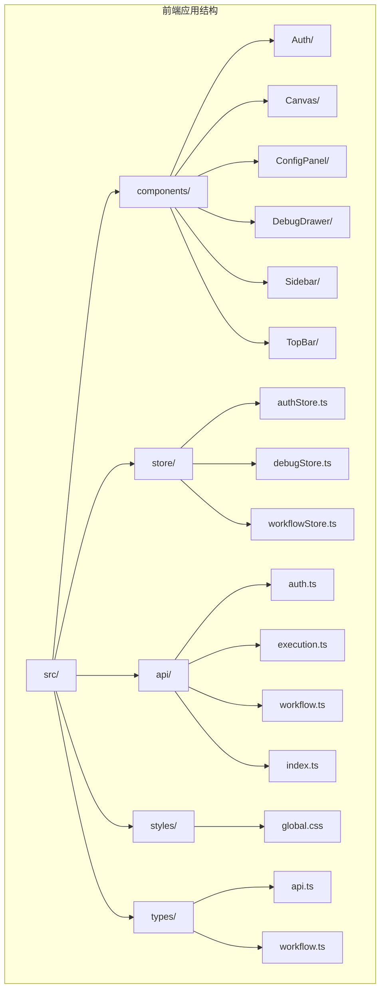
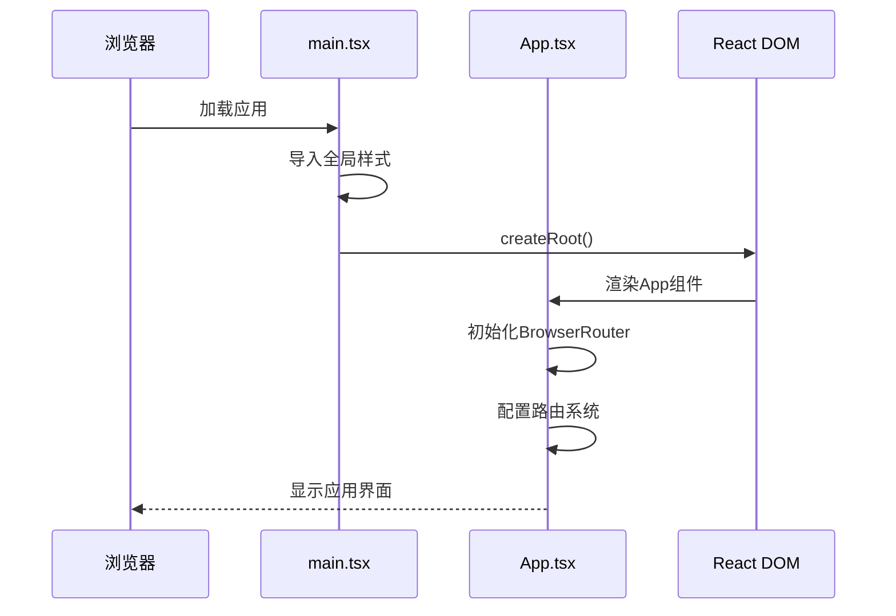
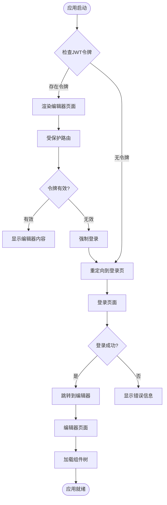
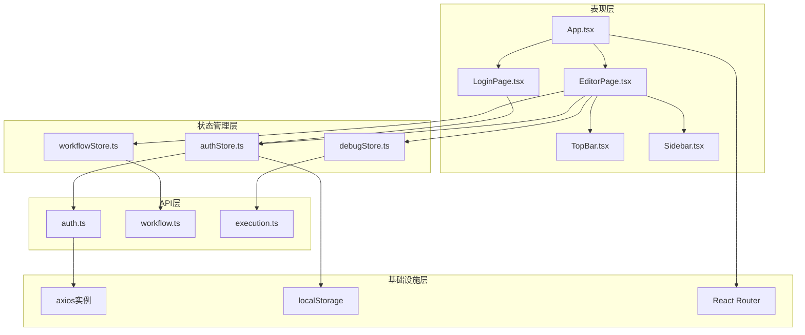
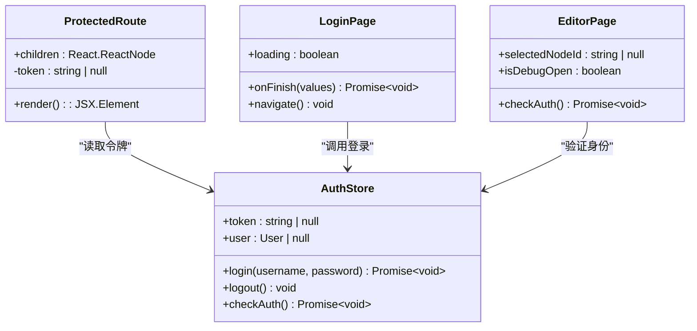
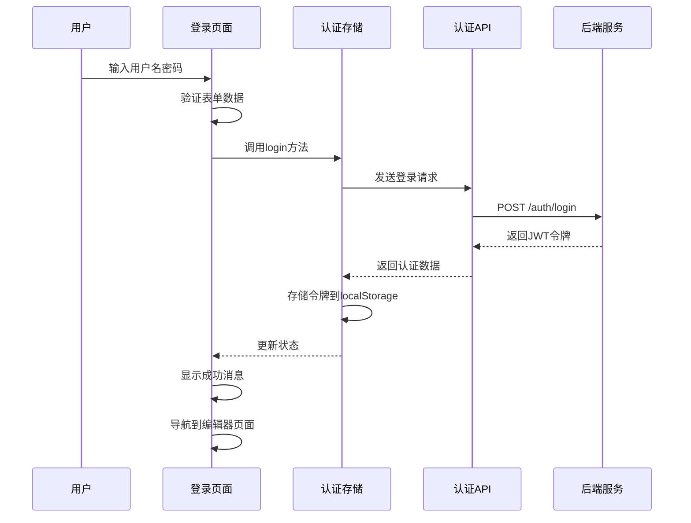
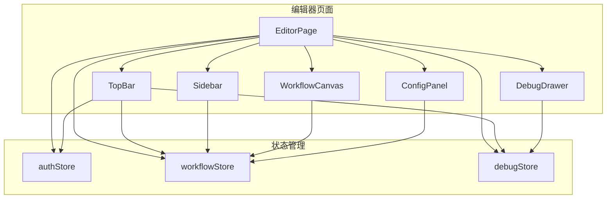
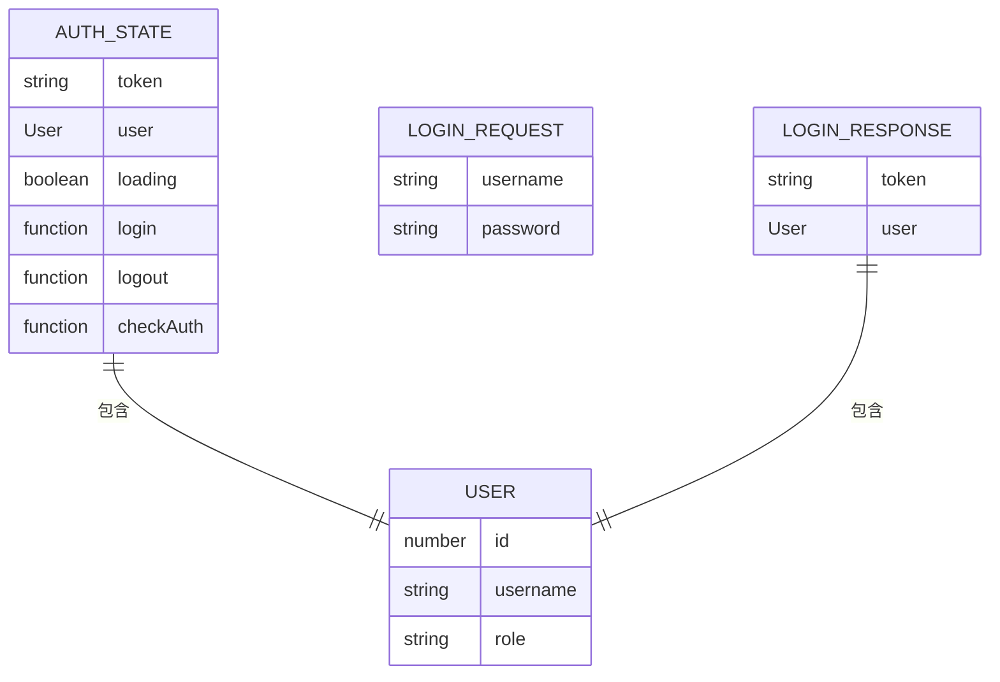
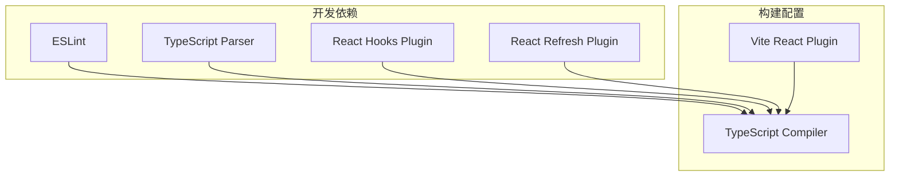
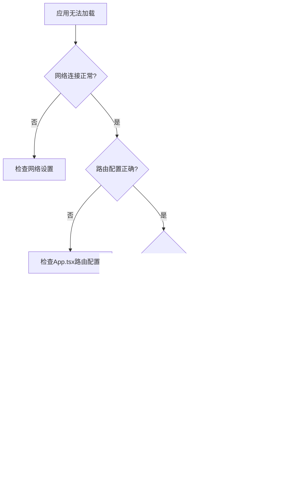

# React应用结构

<cite>
**本文档引用的文件**
- [App.tsx](file://frontend/src/App.tsx)
- [main.tsx](file://frontend/src/main.tsx)
- [LoginPage.tsx](file://frontend/src/components/Auth/LoginPage.tsx)
- [EditorPage.tsx](file://frontend/src/components/EditorPage.tsx)
- [authStore.ts](file://frontend/src/store/authStore.ts)
- [auth.ts](file://frontend/src/api/auth.ts)
- [global.css](file://frontend/src/styles/global.css)
- [package.json](file://frontend/package.json)
- [vite.config.ts](file://frontend/vite.config.ts)
- [tsconfig.json](file://frontend/tsconfig.json)
- [index.ts](file://frontend/src/api/index.ts)
- [api.ts](file://frontend/src/types/api.ts)
- [TopBar.tsx](file://frontend/src/components/TopBar/TopBar.tsx)
- [Sidebar.tsx](file://frontend/src/components/Sidebar/Sidebar.tsx)
</cite>

## 目录
1. [简介](#简介)
2. [项目结构](#项目结构)
3. [核心组件](#核心组件)
4. [架构概览](#架构概览)
5. [详细组件分析](#详细组件分析)
6. [依赖关系分析](#依赖关系分析)
7. [性能考虑](#性能考虑)
8. [故障排除指南](#故障排除指南)
9. [结论](#结论)

## 简介

这是一个基于React 18和TypeScript构建的现代化工作流编辑器应用。应用采用模块化架构设计，集成了JWT认证、状态管理、组件化开发等现代前端技术栈。系统提供了完整的用户认证流程、可视化工作流编辑功能，以及响应式UI设计。

## 项目结构

前端项目采用清晰的分层架构，主要目录结构如下：



**图表来源**
- [App.tsx:1-31](file://frontend/src/App.tsx#L1-L31)
- [main.tsx:1-11](file://frontend/src/main.tsx#L1-L11)

**章节来源**
- [package.json:1-35](file://frontend/package.json#L1-L35)
- [tsconfig.json:1-26](file://frontend/tsconfig.json#L1-L26)

## 核心组件

### 应用入口点配置

应用入口点位于main.tsx，负责初始化React应用并配置全局样式：



**图表来源**
- [main.tsx:1-11](file://frontend/src/main.tsx#L1-L11)
- [App.tsx:12-28](file://frontend/src/App.tsx#L12-L28)

应用入口点的主要职责：
- 使用React DOM进行应用渲染
- 导入全局CSS样式文件
- 在StrictMode模式下运行应用
- 提供TypeScript类型安全的开发体验

**章节来源**
- [main.tsx:1-11](file://frontend/src/main.tsx#L1-L11)

### 路由配置与导航

应用采用React Router v6进行路由管理，实现了完整的单页应用导航体系：



**图表来源**
- [App.tsx:6-10](file://frontend/src/App.tsx#L6-L10)
- [App.tsx:12-28](file://frontend/src/App.tsx#L12-L28)

**章节来源**
- [App.tsx:1-31](file://frontend/src/App.tsx#L1-L31)

## 架构概览

应用采用分层架构设计，各层职责明确：



**图表来源**
- [App.tsx:1-31](file://frontend/src/App.tsx#L1-L31)
- [authStore.ts:1-50](file://frontend/src/store/authStore.ts#L1-L50)

## 详细组件分析

### 受保护路由实现

应用的核心安全机制通过自定义受保护路由组件实现：



**图表来源**
- [App.tsx:6-10](file://frontend/src/App.tsx#L6-L10)
- [authStore.ts:14-49](file://frontend/src/store/authStore.ts#L14-L49)

受保护路由的工作原理：
1. 检查全局状态中的JWT令牌
2. 如果令牌不存在，自动重定向到登录页面
3. 如果令牌存在，渲染子组件内容
4. 支持程序化的路由控制和条件渲染

**章节来源**
- [App.tsx:6-10](file://frontend/src/App.tsx#L6-L10)

### 登录页面组件

登录页面实现了完整的用户认证流程：



**图表来源**
- [LoginPage.tsx:12-23](file://frontend/src/components/Auth/LoginPage.tsx#L12-L23)
- [authStore.ts:19-30](file://frontend/src/store/authStore.ts#L19-L30)

登录流程的关键特性：
- 表单验证和错误处理
- 异步登录操作的状态管理
- 成功后的自动页面跳转
- 错误情况下的用户反馈

**章节来源**
- [LoginPage.tsx:1-46](file://frontend/src/components/Auth/LoginPage.tsx#L1-L46)

### 编辑器页面组件

编辑器页面作为应用的核心功能组件，集成了多个子组件：



**图表来源**
- [EditorPage.tsx:11-39](file://frontend/src/components/EditorPage.tsx#L11-L39)

编辑器页面的功能特性：
- 自动身份验证检查
- 多组件协作的复杂布局
- 条件渲染的配置面板
- 调试功能的集成

**章节来源**
- [EditorPage.tsx:1-40](file://frontend/src/components/EditorPage.tsx#L1-L40)

### 状态管理架构

应用采用Zustand进行轻量级状态管理：



**图表来源**
- [authStore.ts:5-12](file://frontend/src/store/authStore.ts#L5-L12)
- [api.ts:1-22](file://frontend/src/types/api.ts#L1-L22)

状态管理的设计原则：
- 单一职责原则的状态分离
- 异步操作的完整生命周期管理
- 类型安全的接口定义
- 本地存储的持久化机制

**章节来源**
- [authStore.ts:1-50](file://frontend/src/store/authStore.ts#L1-L50)

## 依赖关系分析

### 技术栈依赖

应用采用现代化的前端技术栈，各依赖包的作用如下：

```mermaid
graph LR
subgraph "核心框架"
A[React 18.2.0]
B[React DOM 18.2.0]
C[React Router DOM 6.21.0]
end
subgraph "状态管理"
D[Zustand 4.4.7]
end
subgraph "UI组件库"
E[Ant Design 5.12.2]
F[@ant-design/icons 5.2.6]
end
subgraph "HTTP客户端"
G[Axios 1.6.2]
end
subgraph "可视化库"
H[React Flow 11.10.1]
end
subgraph "构建工具"
I[Vite 5.0.8]
J[TypeScript 5.2.2]
end
A --> B
A --> C
A --> D
A --> E
E --> F
A --> G
A --> H
A --> I
I --> J
```

**图表来源**
- [package.json:12-32](file://frontend/package.json#L12-L32)

### 开发工具链



**图表来源**
- [package.json:22-32](file://frontend/package.json#L22-L32)

**章节来源**
- [package.json:1-35](file://frontend/package.json#L1-L35)

## 性能考虑

### 路由性能优化

应用采用了多种性能优化策略：

1. **懒加载机制**：通过条件渲染避免不必要的组件加载
2. **状态缓存**：使用localStorage持久化认证状态
3. **请求拦截器**：统一处理HTTP请求和响应
4. **组件复用**：通过状态管理减少组件间的重复渲染

### 构建优化

Vite配置提供了高效的开发体验：
- 热模块替换(HMR)支持
- 内置代理服务器
- TypeScript编译优化
- 生产环境代码压缩

## 故障排除指南

### 常见问题诊断



### 调试技巧

1. **浏览器开发者工具**：监控网络请求和状态变化
2. **React DevTools**：检查组件树和状态更新
3. **控制台日志**：跟踪异步操作的执行流程
4. **localStorage检查**：验证JWT令牌的存储状态

**章节来源**
- [index.ts:19-28](file://frontend/src/api/index.ts#L19-L28)

## 结论

该React应用展现了现代前端开发的最佳实践，具有以下特点：

1. **架构清晰**：分层设计使得代码易于维护和扩展
2. **安全性强**：完整的JWT认证和授权机制
3. **用户体验佳**：响应式设计和流畅的交互体验
4. **开发效率高**：完善的TypeScript支持和开发工具链

应用的核心优势在于其模块化的组件设计、强大的状态管理和完善的路由系统，为后续的功能扩展奠定了坚实的基础。通过合理的架构设计和最佳实践的应用，该应用能够满足复杂业务场景的需求，并具备良好的可维护性和可扩展性。