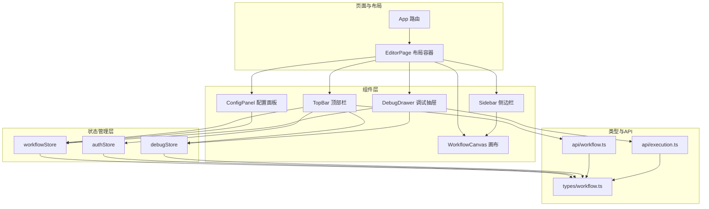
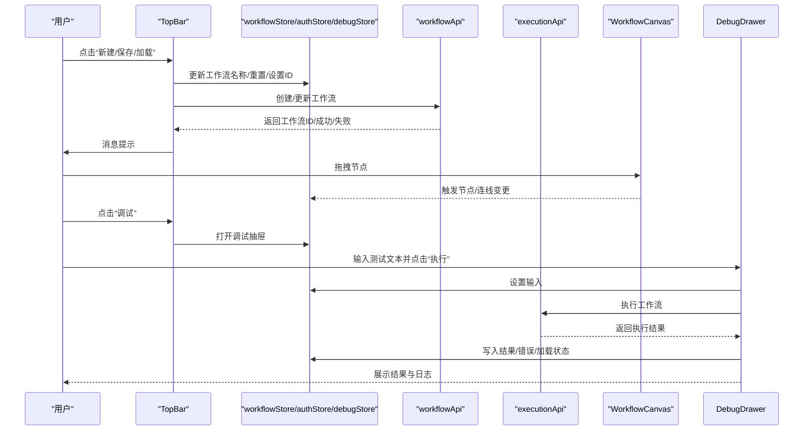
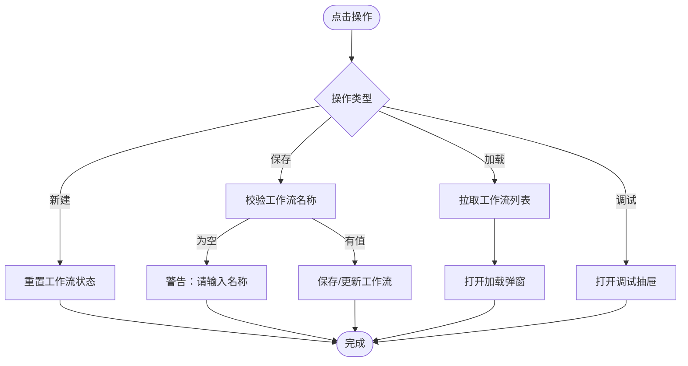
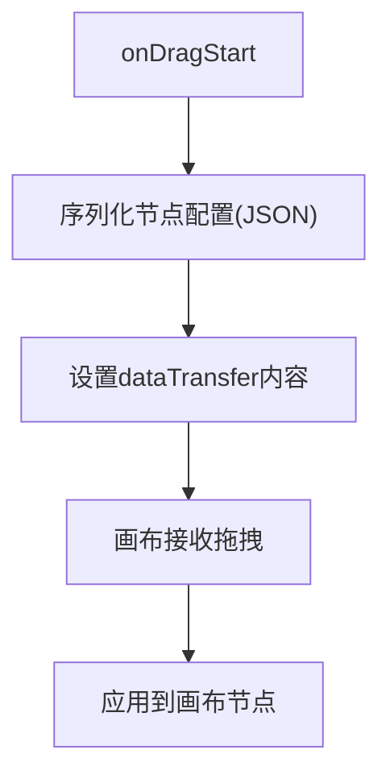
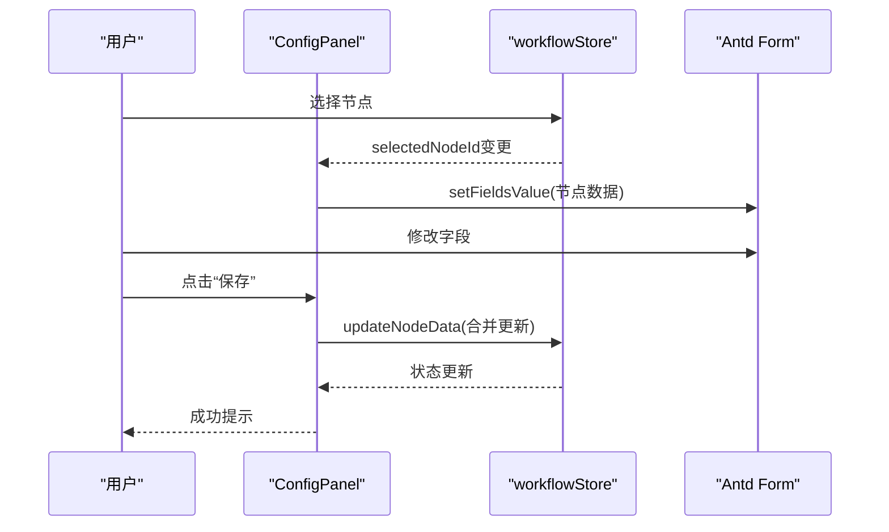
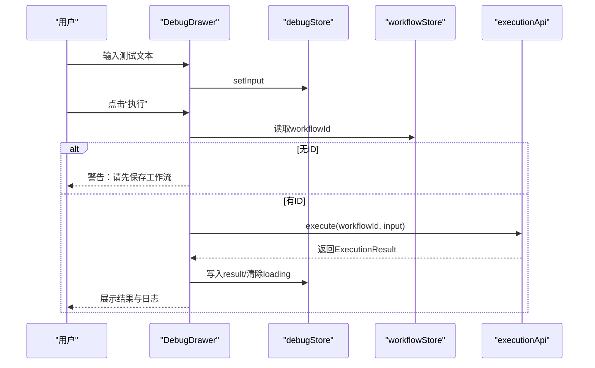
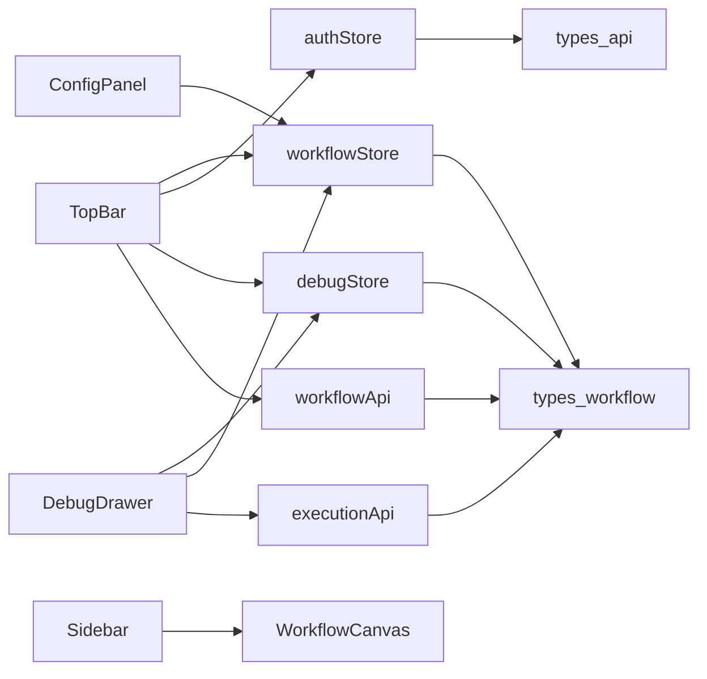

# UI组件库

<cite>
**本文引用的文件**
- [frontend/src/components/TopBar/TopBar.tsx](file://frontend/src/components/TopBar/TopBar.tsx)
- [frontend/src/components/Sidebar/Sidebar.tsx](file://frontend/src/components/Sidebar/Sidebar.tsx)
- [frontend/src/components/ConfigPanel/ConfigPanel.tsx](file://frontend/src/components/ConfigPanel/ConfigPanel.tsx)
- [frontend/src/components/DebugDrawer/DebugDrawer.tsx](file://frontend/src/components/DebugDrawer/DebugDrawer.tsx)
- [frontend/src/components/EditorPage.tsx](file://frontend/src/components/EditorPage.tsx)
- [frontend/src/store/workflowStore.ts](file://frontend/src/store/workflowStore.ts)
- [frontend/src/store/authStore.ts](file://frontend/src/store/authStore.ts)
- [frontend/src/store/debugStore.ts](file://frontend/src/store/debugStore.ts)
- [frontend/src/types/workflow.ts](file://frontend/src/types/workflow.ts)
- [frontend/src/types/api.ts](file://frontend/src/types/api.ts)
- [frontend/src/api/workflow.ts](file://frontend/src/api/workflow.ts)
- [frontend/src/api/execution.ts](file://frontend/src/api/execution.ts)
- [frontend/src/App.tsx](file://frontend/src/App.tsx)
</cite>

## 目录
1. [简介](#简介)
2. [项目结构](#项目结构)
3. [核心组件](#核心组件)
4. [架构总览](#架构总览)
5. [组件详细分析](#组件详细分析)
6. [依赖关系分析](#依赖关系分析)
7. [性能与可访问性](#性能与可访问性)
8. [故障排查指南](#故障排查指南)
9. [结论](#结论)
10. [附录：使用示例与最佳实践](#附录使用示例与最佳实践)

## 简介
本技术文档围绕前端UI组件库中的四个关键组件展开：顶部栏TopBar、侧边栏Sidebar、配置面板ConfigPanel与调试抽屉DebugDrawer。文档从系统架构、组件职责、数据流、状态管理、交互流程、样式与可访问性、以及组件间通信机制等方面进行深入解析，并提供使用示例与最佳实践，帮助开发者正确使用与扩展这些组件。

## 项目结构
该UI组件库采用分层与功能模块化结合的方式组织：
- 组件层：TopBar、Sidebar、ConfigPanel、DebugDrawer、EditorPage等
- 状态管理层：使用zustand创建独立的全局状态（workflowStore、authStore、debugStore）
- 类型与API层：统一的类型定义与后端API封装
- 页面入口：App路由控制与EditorPage布局容器

图表来源
- [frontend/src/App.tsx:12-28](file://frontend/src/App.tsx#L12-L28)
- [frontend/src/components/EditorPage.tsx:11-39](file://frontend/src/components/EditorPage.tsx#L11-L39)
- [frontend/src/components/TopBar/TopBar.tsx:18-144](file://frontend/src/components/TopBar/TopBar.tsx#L18-L144)
- [frontend/src/components/Sidebar/Sidebar.tsx:22-69](file://frontend/src/components/Sidebar/Sidebar.tsx#L22-L69)
- [frontend/src/components/ConfigPanel/ConfigPanel.tsx:9-119](file://frontend/src/components/ConfigPanel/ConfigPanel.tsx#L9-L119)
- [frontend/src/components/DebugDrawer/DebugDrawer.tsx:8-126](file://frontend/src/components/DebugDrawer/DebugDrawer.tsx#L8-L126)
- [frontend/src/store/workflowStore.ts:39-94](file://frontend/src/store/workflowStore.ts#L39-L94)
- [frontend/src/store/authStore.ts:14-49](file://frontend/src/store/authStore.ts#L14-L49)
- [frontend/src/store/debugStore.ts:19-44](file://frontend/src/store/debugStore.ts#L19-L44)
- [frontend/src/types/workflow.ts:1-71](file://frontend/src/types/workflow.ts#L1-L71)
- [frontend/src/api/workflow.ts:5-21](file://frontend/src/api/workflow.ts#L5-L21)
- [frontend/src/api/execution.ts:5-12](file://frontend/src/api/execution.ts#L5-L12)

章节来源
- [frontend/src/App.tsx:12-28](file://frontend/src/App.tsx#L12-L28)
- [frontend/src/components/EditorPage.tsx:11-39](file://frontend/src/components/EditorPage.tsx#L11-L39)

## 核心组件
本节概述四个核心组件的职责与交互要点：
- 顶部栏TopBar：负责工作流新建/保存/加载、用户信息展示与登出、打开调试抽屉
- 侧边栏Sidebar：提供节点库（LLM节点、工具节点），支持拖拽到画布
- 配置面板ConfigPanel：根据选中节点动态渲染表单，保存节点配置
- 调试抽屉DebugDrawer：输入测试文本，执行工作流，展示执行结果与节点日志

章节来源
- [frontend/src/components/TopBar/TopBar.tsx:18-144](file://frontend/src/components/TopBar/TopBar.tsx#L18-L144)
- [frontend/src/components/Sidebar/Sidebar.tsx:22-69](file://frontend/src/components/Sidebar/Sidebar.tsx#L22-L69)
- [frontend/src/components/ConfigPanel/ConfigPanel.tsx:9-119](file://frontend/src/components/ConfigPanel/ConfigPanel.tsx#L9-L119)
- [frontend/src/components/DebugDrawer/DebugDrawer.tsx:8-126](file://frontend/src/components/DebugDrawer/DebugDrawer.tsx#L8-L126)

## 架构总览
组件间通过状态管理与API进行解耦协作：
- EditorPage作为布局容器，按需渲染配置面板与调试抽屉
- TopBar与Sidebar不直接依赖画布，但通过状态共享与API协同
- ConfigPanel依赖workflowStore选择节点并更新节点数据
- DebugDrawer依赖debugStore与workflowStore，调用executionApi执行工作流

图表来源
- [frontend/src/components/TopBar/TopBar.tsx:26-67](file://frontend/src/components/TopBar/TopBar.tsx#L26-L67)
- [frontend/src/components/DebugDrawer/DebugDrawer.tsx:13-18](file://frontend/src/components/DebugDrawer/DebugDrawer.tsx#L13-L18)
- [frontend/src/store/workflowStore.ts:39-94](file://frontend/src/store/workflowStore.ts#L39-L94)
- [frontend/src/store/debugStore.ts:19-44](file://frontend/src/store/debugStore.ts#L19-L44)
- [frontend/src/api/workflow.ts:5-21](file://frontend/src/api/workflow.ts#L5-L21)
- [frontend/src/api/execution.ts:5-12](file://frontend/src/api/execution.ts#L5-L12)

## 组件详细分析

### 顶部栏组件 TopBar.tsx
- 导航菜单与快捷操作
  - 新建：清空当前工作流状态，触发成功消息
  - 加载：拉取工作流列表，弹窗展示并支持选择加载
  - 保存：校验工作流名称，保存或更新工作流定义
  - 调试：打开调试抽屉
- 用户信息显示
  - 显示当前用户名；登出时清理本地token并跳转登录页
- 交互与状态
  - 使用workflowStore、authStore、debugStore与workflowApi
  - Modal用于加载工作流列表，支持鼠标悬停高亮
- 错误处理
  - 保存失败与加载失败的消息提示

图表来源
- [frontend/src/components/TopBar/TopBar.tsx:26-67](file://frontend/src/components/TopBar/TopBar.tsx#L26-L67)

章节来源
- [frontend/src/components/TopBar/TopBar.tsx:18-144](file://frontend/src/components/TopBar/TopBar.tsx#L18-L144)
- [frontend/src/store/authStore.ts:14-49](file://frontend/src/store/authStore.ts#L14-L49)
- [frontend/src/store/debugStore.ts:19-44](file://frontend/src/store/debugStore.ts#L19-L44)
- [frontend/src/api/workflow.ts:5-21](file://frontend/src/api/workflow.ts#L5-L21)

### 侧边栏组件 Sidebar.tsx
- 节点库组织
  - LLM节点：包含多种提供商与颜色标识
  - 工具节点：如TTS节点
- 拖拽交互
  - 将节点配置序列化为自定义MIME类型，允许拖拽到画布
- 可视化
  - 分组标题、图标背景色、提示文案

图表来源
- [frontend/src/components/Sidebar/Sidebar.tsx:22-26](file://frontend/src/components/Sidebar/Sidebar.tsx#L22-L26)

章节来源
- [frontend/src/components/Sidebar/Sidebar.tsx:22-69](file://frontend/src/components/Sidebar/Sidebar.tsx#L22-L69)

### 配置面板组件 ConfigPanel.tsx
- 动态表单渲染
  - 根据节点类型渲染不同字段（LLM、TTS、Input、Output）
  - 使用Ant Design表单控件与布局
- 实时更新机制
  - 通过useEffect监听选中节点变化，自动填充表单
  - 保存时合并更新节点数据
- 参数验证与提示
  - 表单控件自带校验（如数值范围）
  - 保存成功消息提示

图表来源
- [frontend/src/components/ConfigPanel/ConfigPanel.tsx:9-29](file://frontend/src/components/ConfigPanel/ConfigPanel.tsx#L9-L29)
- [frontend/src/store/workflowStore.ts:73-79](file://frontend/src/store/workflowStore.ts#L73-L79)

章节来源
- [frontend/src/components/ConfigPanel/ConfigPanel.tsx:9-119](file://frontend/src/components/ConfigPanel/ConfigPanel.tsx#L9-L119)
- [frontend/src/store/workflowStore.ts:39-94](file://frontend/src/store/workflowStore.ts#L39-L94)
- [frontend/src/types/workflow.ts:1-71](file://frontend/src/types/workflow.ts#L1-L71)

### 调试抽屉组件 DebugDrawer.tsx
- 执行流程
  - 输入测试文本，点击执行
  - 调用executionApi执行工作流，返回执行结果
- 结果展示
  - 执行状态、耗时、文本输出、音频播放、节点日志
- 错误处理
  - 失败时显示错误消息
  - 未保存工作流时给出警告提示

图表来源
- [frontend/src/components/DebugDrawer/DebugDrawer.tsx:8-126](file://frontend/src/components/DebugDrawer/DebugDrawer.tsx#L8-L126)
- [frontend/src/store/debugStore.ts:19-44](file://frontend/src/store/debugStore.ts#L19-L44)
- [frontend/src/store/workflowStore.ts:15-34](file://frontend/src/store/workflowStore.ts#L15-L34)
- [frontend/src/api/execution.ts:5-12](file://frontend/src/api/execution.ts#L5-L12)

章节来源
- [frontend/src/components/DebugDrawer/DebugDrawer.tsx:8-126](file://frontend/src/components/DebugDrawer/DebugDrawer.tsx#L8-L126)
- [frontend/src/store/debugStore.ts:19-44](file://frontend/src/store/debugStore.ts#L19-L44)
- [frontend/src/types/workflow.ts:52-71](file://frontend/src/types/workflow.ts#L52-L71)

## 依赖关系分析
- 组件依赖
  - TopBar依赖workflowStore、authStore、debugStore与workflowApi
  - Sidebar仅依赖组件内部逻辑，通过拖拽与画布交互
  - ConfigPanel依赖workflowStore与Antd表单
  - DebugDrawer依赖debugStore、workflowStore与executionApi
- 状态管理
  - workflowStore：节点、连线、选中节点、工作流元数据
  - authStore：用户认证、登录/登出、令牌持久化
  - debugStore：调试抽屉开关、输入、执行结果、加载与错误状态
- 类型与API
  - types/workflow.ts定义节点类型、工作流结构与执行结果
  - api/workflow.ts与api/execution.ts封装HTTP请求

图表来源
- [frontend/src/components/TopBar/TopBar.tsx:10-13](file://frontend/src/components/TopBar/TopBar.tsx#L10-L13)
- [frontend/src/components/ConfigPanel/ConfigPanel.tsx:1-2](file://frontend/src/components/ConfigPanel/ConfigPanel.tsx#L1-L2)
- [frontend/src/components/DebugDrawer/DebugDrawer.tsx:3-4](file://frontend/src/components/DebugDrawer/DebugDrawer.tsx#L3-L4)
- [frontend/src/store/workflowStore.ts:1-13](file://frontend/src/store/workflowStore.ts#L1-L13)
- [frontend/src/store/authStore.ts:1-3](file://frontend/src/store/authStore.ts#L1-L3)
- [frontend/src/store/debugStore.ts:1-3](file://frontend/src/store/debugStore.ts#L1-L3)
- [frontend/src/types/workflow.ts:1-71](file://frontend/src/types/workflow.ts#L1-L71)
- [frontend/src/api/workflow.ts:1-4](file://frontend/src/api/workflow.ts#L1-L4)
- [frontend/src/api/execution.ts:1-4](file://frontend/src/api/execution.ts#L1-L4)

章节来源
- [frontend/src/store/workflowStore.ts:39-94](file://frontend/src/store/workflowStore.ts#L39-L94)
- [frontend/src/store/authStore.ts:14-49](file://frontend/src/store/authStore.ts#L14-L49)
- [frontend/src/store/debugStore.ts:19-44](file://frontend/src/store/debugStore.ts#L19-L44)
- [frontend/src/types/workflow.ts:1-71](file://frontend/src/types/workflow.ts#L1-L71)
- [frontend/src/api/workflow.ts:5-21](file://frontend/src/api/workflow.ts#L5-L21)
- [frontend/src/api/execution.ts:5-12](file://frontend/src/api/execution.ts#L5-L12)

## 性能与可访问性
- 性能
  - 使用zustand替代Redux，减少样板代码与内存占用
  - 表单仅在选中节点变化时重置，避免不必要的重渲染
  - 调试抽屉按需渲染，减少DOM树复杂度
- 可访问性
  - 使用语义化标签与Antd组件，具备键盘导航与屏幕阅读器支持
  - 提供明确的提示与错误信息，便于用户理解操作结果
  - 颜色对比符合基础可读性要求（如成功/失败状态色）

[本节为通用建议，无需特定文件来源]

## 故障排查指南
- 保存失败
  - 检查工作流名称是否为空；确认网络请求是否成功
  - 查看workflowApi返回与消息提示
- 加载失败
  - 确认后端接口可用；检查列表请求是否抛错
- 调试执行失败
  - 确认已保存工作流并获取有效ID；检查输入非空
  - 查看debugStore中的错误消息与executionApi返回
- 登录/登出异常
  - 检查authStore中token的本地存储与路由跳转逻辑

章节来源
- [frontend/src/components/TopBar/TopBar.tsx:31-48](file://frontend/src/components/TopBar/TopBar.tsx#L31-L48)
- [frontend/src/components/TopBar/TopBar.tsx:50-58](file://frontend/src/components/TopBar/TopBar.tsx#L50-L58)
- [frontend/src/components/DebugDrawer/DebugDrawer.tsx:13-18](file://frontend/src/components/DebugDrawer/DebugDrawer.tsx#L13-L18)
- [frontend/src/store/authStore.ts:32-36](file://frontend/src/store/authStore.ts#L32-L36)
- [frontend/src/store/debugStore.ts:30-41](file://frontend/src/store/debugStore.ts#L30-L41)

## 结论
该UI组件库通过清晰的职责划分与状态管理，实现了工作流编辑器的高效开发体验。TopBar负责工作流生命周期与用户交互，Sidebar提供节点库与拖拽能力，ConfigPanel实现节点配置的动态表单与实时更新，DebugDrawer提供调试执行与结果可视化。四者通过store与API解耦协作，具备良好的扩展性与可维护性。

[本节为总结，无需特定文件来源]

## 附录：使用示例与最佳实践
- 使用示例
  - 在EditorPage中按需渲染配置面板与调试抽屉
  - 通过TopBar的保存/加载功能管理工作流
  - 在Sidebar中拖拽节点到画布，随后在ConfigPanel中配置节点
  - 在DebugDrawer中输入测试文本并执行工作流
- 最佳实践
  - 保持节点数据结构一致，遵循types/workflow.ts定义
  - 在ConfigPanel中为新增节点类型补充表单项与默认值
  - 对于长耗时操作，使用debugStore的loading与错误状态反馈
  - 为可访问性考虑，确保按钮与表单具备明确的标签与提示

章节来源
- [frontend/src/components/EditorPage.tsx:11-39](file://frontend/src/components/EditorPage.tsx#L11-L39)
- [frontend/src/types/workflow.ts:1-71](file://frontend/src/types/workflow.ts#L1-L71)
- [frontend/src/store/debugStore.ts:19-44](file://frontend/src/store/debugStore.ts#L19-L44)