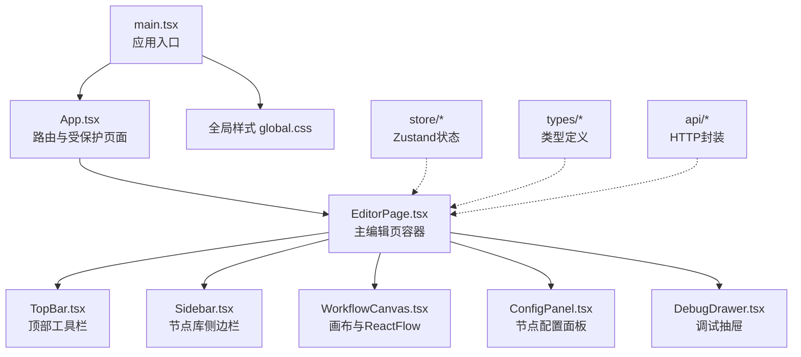
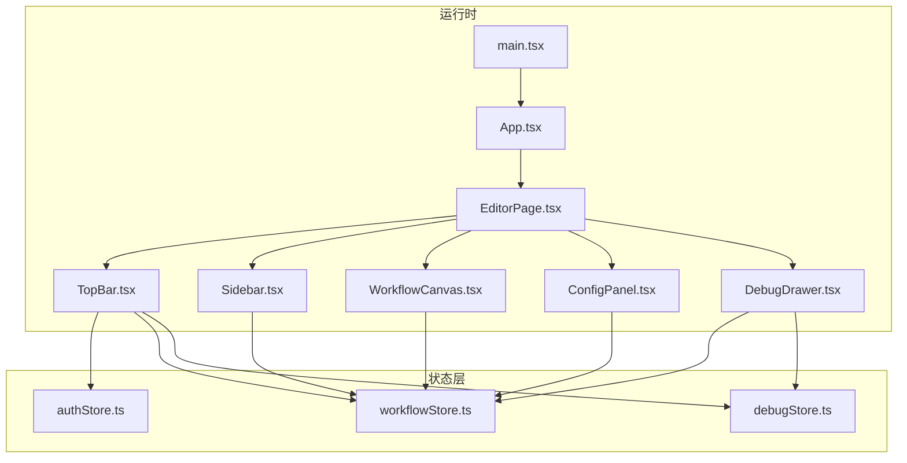
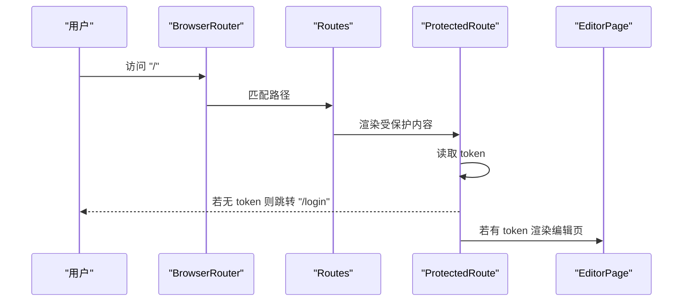
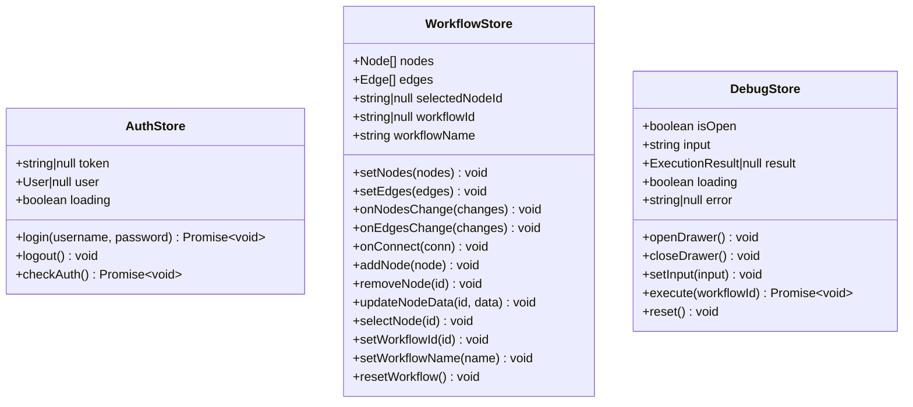
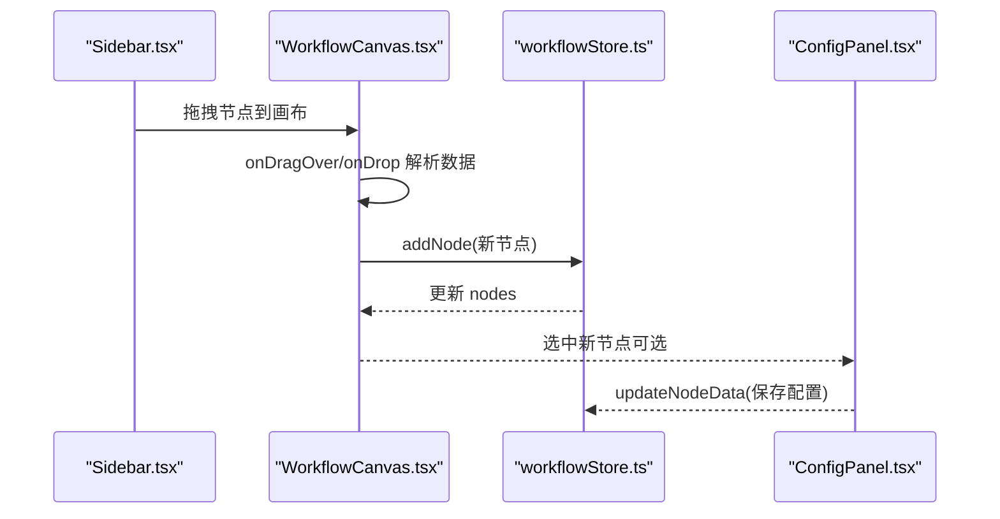
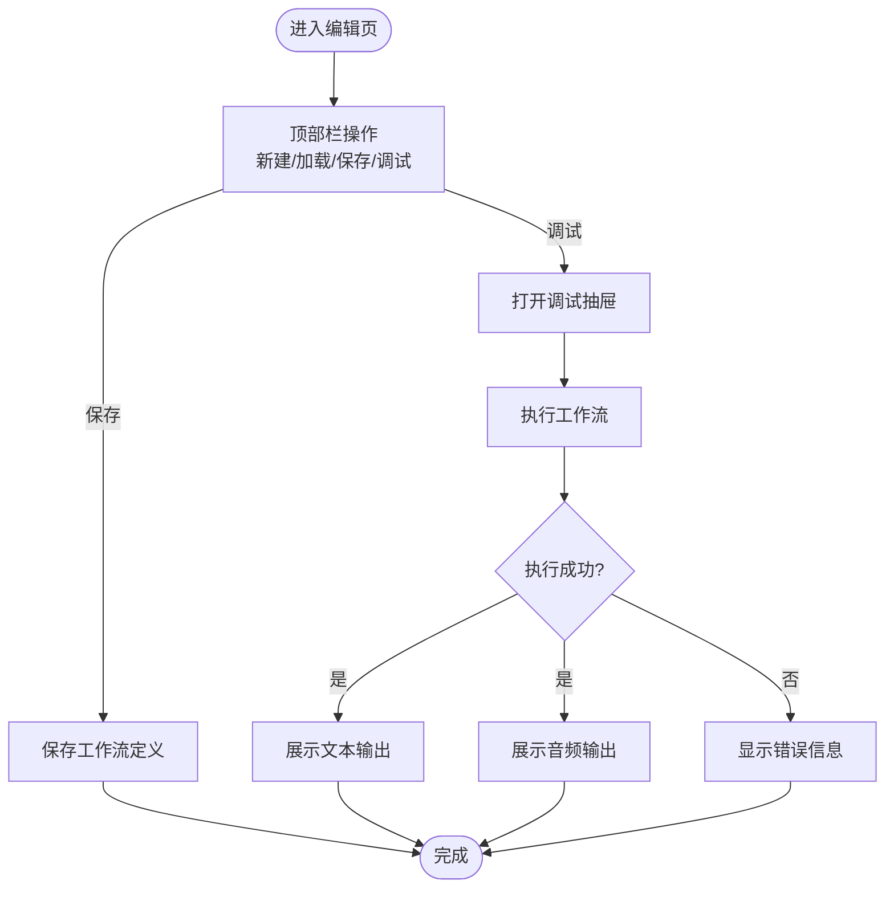
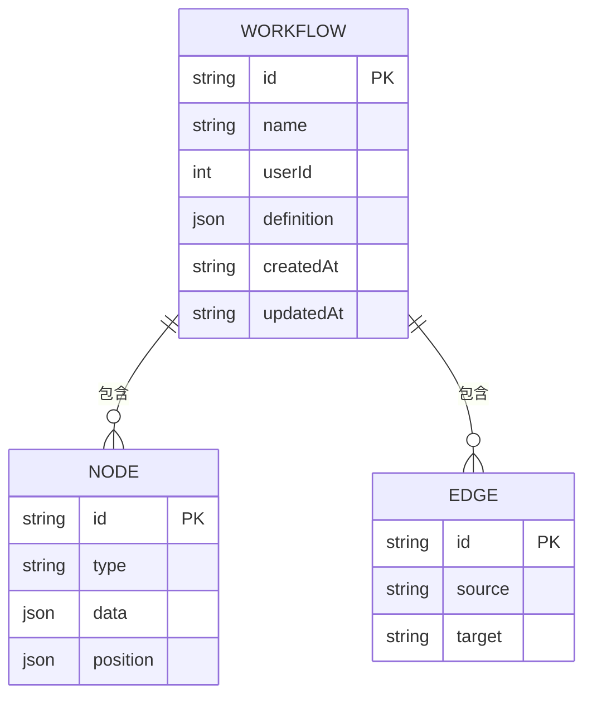
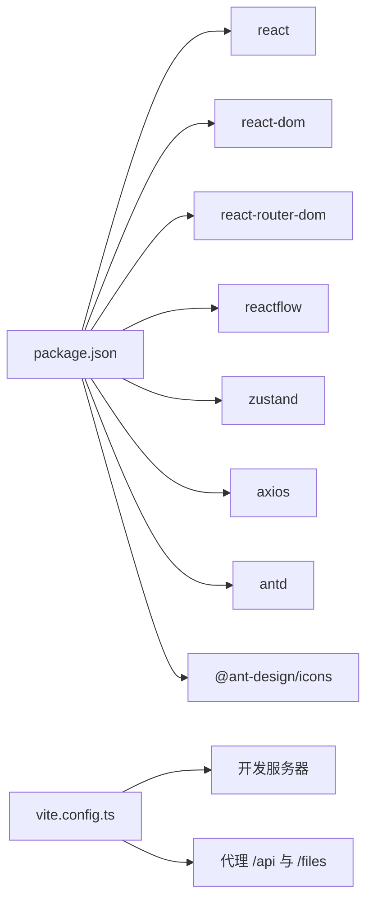

# 前端架构

<cite>
**本文引用的文件**
- [frontend/src/App.tsx](file://frontend/src/App.tsx)
- [frontend/src/main.tsx](file://frontend/src/main.tsx)
- [frontend/package.json](file://frontend/package.json)
- [frontend/vite.config.ts](file://frontend/vite.config.ts)
- [frontend/tsconfig.json](file://frontend/tsconfig.json)
- [frontend/src/components/EditorPage.tsx](file://frontend/src/components/EditorPage.tsx)
- [frontend/src/store/authStore.ts](file://frontend/src/store/authStore.ts)
- [frontend/src/store/workflowStore.ts](file://frontend/src/store/workflowStore.ts)
- [frontend/src/store/debugStore.ts](file://frontend/src/store/debugStore.ts)
- [frontend/src/components/TopBar/TopBar.tsx](file://frontend/src/components/TopBar/TopBar.tsx)
- [frontend/src/components/Sidebar/Sidebar.tsx](file://frontend/src/components/Sidebar/Sidebar.tsx)
- [frontend/src/components/Canvas/WorkflowCanvas.tsx](file://frontend/src/components/Canvas/WorkflowCanvas.tsx)
- [frontend/src/components/ConfigPanel/ConfigPanel.tsx](file://frontend/src/components/ConfigPanel/ConfigPanel.tsx)
- [frontend/src/components/DebugDrawer/DebugDrawer.tsx](file://frontend/src/components/DebugDrawer/DebugDrawer.tsx)
- [frontend/src/types/workflow.ts](file://frontend/src/types/workflow.ts)
</cite>

## 目录
1. [简介](#简介)
2. [项目结构](#项目结构)
3. [核心组件](#核心组件)
4. [架构总览](#架构总览)
5. [详细组件分析](#详细组件分析)
6. [依赖关系分析](#依赖关系分析)
7. [性能考虑](#性能考虑)
8. [故障排查指南](#故障排查指南)
9. [结论](#结论)
10. [附录](#附录)

## 简介
本文件面向PaiAgent前端团队与协作开发者，系统性梳理React应用的组件结构、路由配置与状态管理策略，深入解析Zustand在认证、工作流与调试场景下的使用方式，并详解可视化编辑器（基于ReactFlow）的实现与交互逻辑。同时，文档给出UI组件库的设计模式（顶部栏、侧边栏、配置面板、调试抽屉），并通过多种Mermaid图示帮助读者快速建立对整体架构的认知。

## 项目结构
前端采用Vite + TypeScript + React技术栈，按功能域划分目录：组件层（components）、状态层（store）、类型定义（types）、API封装（api）、样式（styles）。入口文件负责挂载应用与全局样式引入；路由通过react-router-dom进行受保护页面渲染；开发服务器通过Vite配置代理后端接口。

图表来源
- [frontend/src/main.tsx:1-11](file://frontend/src/main.tsx#L1-L11)
- [frontend/src/App.tsx:12-28](file://frontend/src/App.tsx#L12-L28)
- [frontend/src/components/EditorPage.tsx:11-39](file://frontend/src/components/EditorPage.tsx#L11-L39)

章节来源
- [frontend/src/main.tsx:1-11](file://frontend/src/main.tsx#L1-L11)
- [frontend/src/App.tsx:1-31](file://frontend/src/App.tsx#L1-L31)
- [frontend/vite.config.ts:1-20](file://frontend/vite.config.ts#L1-L20)
- [frontend/tsconfig.json:1-26](file://frontend/tsconfig.json#L1-L26)

## 核心组件
- 应用入口与挂载：负责引入全局样式并渲染根组件。
- 路由与受保护页面：登录页与编辑页，编辑页通过Zustand读取token进行鉴权拦截。
- 主编辑页容器：组织顶部栏、侧边栏、画布、配置面板与调试抽屉。
- 状态管理：三个Zustand Store分别管理认证、工作流与调试状态。
- 可视化编辑器：以ReactFlow为核心，结合自定义节点类型与拖拽放置逻辑。
- UI组件库：顶部栏、侧边栏、配置面板、调试抽屉遵循统一Ant Design风格与交互规范。

章节来源
- [frontend/src/main.tsx:1-11](file://frontend/src/main.tsx#L1-L11)
- [frontend/src/App.tsx:1-31](file://frontend/src/App.tsx#L1-L31)
- [frontend/src/components/EditorPage.tsx:1-40](file://frontend/src/components/EditorPage.tsx#L1-L40)

## 架构总览
下图展示从入口到各子系统的调用关系与数据流向，强调Zustand状态在组件间的解耦作用以及ReactFlow在可视化编辑中的核心地位。

图表来源
- [frontend/src/main.tsx:6-10](file://frontend/src/main.tsx#L6-L10)
- [frontend/src/App.tsx:12-28](file://frontend/src/App.tsx#L12-L28)
- [frontend/src/components/EditorPage.tsx:11-39](file://frontend/src/components/EditorPage.tsx#L11-L39)
- [frontend/src/store/authStore.ts:14-49](file://frontend/src/store/authStore.ts#L14-L49)
- [frontend/src/store/workflowStore.ts:39-94](file://frontend/src/store/workflowStore.ts#L39-L94)
- [frontend/src/store/debugStore.ts:19-44](file://frontend/src/store/debugStore.ts#L19-L44)

## 详细组件分析

### 路由与受保护页面
- 使用BrowserRouter包裹Routes，定义/login与根路径“/”。
- 自定义ProtectedRoute根据Zustand中的token判断是否重定向至登录页。
- 根路径下渲染EditorPage，内部再按需渲染配置面板与调试抽屉。

图表来源
- [frontend/src/App.tsx:6-10](file://frontend/src/App.tsx#L6-L10)
- [frontend/src/App.tsx:17-24](file://frontend/src/App.tsx#L17-L24)

章节来源
- [frontend/src/App.tsx:1-31](file://frontend/src/App.tsx#L1-L31)

### 状态管理策略（Zustand）
- 认证状态（authStore）
  - 管理token、用户信息与加载状态。
  - 提供登录、登出、鉴权检查方法，登录成功写入localStorage，登出清理并跳转登录页。
- 工作流状态（workflowStore）
  - 维护nodes、edges、选中节点、工作流元信息（id、name）。
  - 封装节点增删改、连线连接、选择与重置等操作，统一使用applyNodeChanges/applyEdgeChanges/addEdge。
- 调试状态（debugStore）
  - 管理调试抽屉开关、输入、执行结果、加载与错误状态。
  - 提供打开/关闭抽屉、设置输入、执行工作流与重置方法。

图表来源
- [frontend/src/store/authStore.ts:5-12](file://frontend/src/store/authStore.ts#L5-L12)
- [frontend/src/store/workflowStore.ts:15-34](file://frontend/src/store/workflowStore.ts#L15-L34)
- [frontend/src/store/debugStore.ts:5-17](file://frontend/src/store/debugStore.ts#L5-L17)

章节来源
- [frontend/src/store/authStore.ts:1-50](file://frontend/src/store/authStore.ts#L1-L50)
- [frontend/src/store/workflowStore.ts:1-95](file://frontend/src/store/workflowStore.ts#L1-L95)
- [frontend/src/store/debugStore.ts:1-45](file://frontend/src/store/debugStore.ts#L1-L45)

### 可视化编辑器（ReactFlow集成）
- 节点类型注册：在画布中注册input、output、llm、tts四种节点类型。
- 拖拽放置：侧边栏节点以JSON形式通过drag data传输，画布计算drop位置生成新节点并加入store。
- 交互事件：支持节点变更、连线变更、连线、点击节点/画布等事件，统一委托给workflowStore处理。
- 默认节点数据：根据节点类型生成默认配置，便于快速开始。

图表来源
- [frontend/src/components/Sidebar/Sidebar.tsx:22-69](file://frontend/src/components/Sidebar/Sidebar.tsx#L22-L69)
- [frontend/src/components/Canvas/WorkflowCanvas.tsx:26-102](file://frontend/src/components/Canvas/WorkflowCanvas.tsx#L26-L102)
- [frontend/src/store/workflowStore.ts:61-79](file://frontend/src/store/workflowStore.ts#L61-L79)
- [frontend/src/components/ConfigPanel/ConfigPanel.tsx:9-29](file://frontend/src/components/ConfigPanel/ConfigPanel.tsx#L9-L29)

章节来源
- [frontend/src/components/Canvas/WorkflowCanvas.tsx:1-133](file://frontend/src/components/Canvas/WorkflowCanvas.tsx#L1-L133)
- [frontend/src/components/Sidebar/Sidebar.tsx:1-70](file://frontend/src/components/Sidebar/Sidebar.tsx#L1-L70)
- [frontend/src/store/workflowStore.ts:1-95](file://frontend/src/store/workflowStore.ts#L1-L95)
- [frontend/src/components/ConfigPanel/ConfigPanel.tsx:1-120](file://frontend/src/components/ConfigPanel/ConfigPanel.tsx#L1-L120)

### UI组件库设计模式
- 顶部栏（TopBar）
  - 功能：新建、加载、保存工作流；打开调试抽屉；显示当前用户并登出。
  - 数据：从workflowStore读取名称、id、节点与连线；从authStore读取用户；从debugStore打开抽屉。
  - 交互：保存前校验名称；加载时弹窗列出已有工作流；选择后回填节点与连线。
- 侧边栏（Sidebar）
  - 功能：提供节点库（LLM与Tool两类），支持拖拽到画布。
  - 设计：分组标题、颜色标识、图标与提示文案。
- 配置面板（ConfigPanel）
  - 功能：根据选中节点类型渲染不同表单项，保存后更新节点数据。
  - 设计：垂直表单布局，字段随节点类型动态变化。
- 调试抽屉（DebugDrawer）
  - 功能：右侧抽屉展示调试输入、执行按钮、加载状态、错误提示与执行结果卡片。
  - 设计：输入为空或未保存工作流时禁用执行；结果包含文本输出、音频播放与节点日志列表。

图表来源
- [frontend/src/components/TopBar/TopBar.tsx:18-67](file://frontend/src/components/TopBar/TopBar.tsx#L18-L67)
- [frontend/src/components/DebugDrawer/DebugDrawer.tsx:8-18](file://frontend/src/components/DebugDrawer/DebugDrawer.tsx#L8-L18)
- [frontend/src/store/debugStore.ts:30-41](file://frontend/src/store/debugStore.ts#L30-L41)

章节来源
- [frontend/src/components/TopBar/TopBar.tsx:1-145](file://frontend/src/components/TopBar/TopBar.tsx#L1-L145)
- [frontend/src/components/Sidebar/Sidebar.tsx:1-70](file://frontend/src/components/Sidebar/Sidebar.tsx#L1-L70)
- [frontend/src/components/ConfigPanel/ConfigPanel.tsx:1-120](file://frontend/src/components/ConfigPanel/ConfigPanel.tsx#L1-L120)
- [frontend/src/components/DebugDrawer/DebugDrawer.tsx:1-127](file://frontend/src/components/DebugDrawer/DebugDrawer.tsx#L1-L127)

### 类型与数据模型
- 节点类型与数据结构：定义LLM、TTS、Input、Output四类节点的数据字段与默认值。
- 工作流定义：包含nodes与edges两部分。
- 执行结果：包含执行状态、耗时、文本/音频输出与节点级日志。

图表来源
- [frontend/src/types/workflow.ts:43-50](file://frontend/src/types/workflow.ts#L43-L50)
- [frontend/src/types/workflow.ts:35-41](file://frontend/src/types/workflow.ts#L35-L41)

章节来源
- [frontend/src/types/workflow.ts:1-71](file://frontend/src/types/workflow.ts#L1-L71)

## 依赖关系分析
- 运行时依赖：React、ReactDOM、react-router-dom、reactflow、zustand、axios、antd及其图标。
- 开发依赖：TypeScript、Vite、ESLint、React Hooks与React Refresh插件。
- 构建与代理：Vite配置本地开发服务器端口与/api、/files代理到后端服务。

图表来源
- [frontend/package.json:12-21](file://frontend/package.json#L12-L21)
- [frontend/vite.config.ts:4-19](file://frontend/vite.config.ts#L4-L19)

章节来源
- [frontend/package.json:1-35](file://frontend/package.json#L1-L35)
- [frontend/vite.config.ts:1-20](file://frontend/vite.config.ts#L1-L20)
- [frontend/tsconfig.json:1-26](file://frontend/tsconfig.json#L1-L26)

## 性能考虑
- 状态粒度：Zustand按域拆分Store，避免无关订阅导致的重渲染。
- ReactFlow优化：仅在必要时更新nodes/edges；使用默认边类型与动画选项时注意复杂度。
- 组件渲染：EditorPage按条件渲染配置面板与调试抽屉，减少DOM树深度。
- 拖拽性能：在画布上限制频繁的setState调用，合并状态更新。
- 缓存与持久化：认证token存储于localStorage，减少重复鉴权请求。

## 故障排查指南
- 登录失败
  - 现象：登录接口返回异常，状态未更新。
  - 排查：确认后端接口连通性、代理配置与凭证正确性。
  - 参考路径：[frontend/src/store/authStore.ts:19-30](file://frontend/src/store/authStore.ts#L19-L30)
- 鉴权失效
  - 现象：token过期或被删除后无法访问受保护页面。
  - 排查：检查localStorage中token是否存在，后端JWT有效性。
  - 参考路径：[frontend/src/store/authStore.ts:38-48](file://frontend/src/store/authStore.ts#L38-L48)
- 保存工作流失败
  - 现象：保存时提示失败或未生成id。
  - 排查：确认工作流名称非空、后端接口可用、网络代理正常。
  - 参考路径：[frontend/src/components/TopBar/TopBar.tsx:31-48](file://frontend/src/components/TopBar/TopBar.tsx#L31-L48)
- 调试执行无响应
  - 现象：点击执行按钮无反应或报错。
  - 排查：确认已保存工作流且输入非空；查看错误状态与后端执行日志。
  - 参考路径：[frontend/src/store/debugStore.ts:30-41](file://frontend/src/store/debugStore.ts#L30-L41)
- 节点拖拽不生效
  - 现象：从侧边栏拖拽到画布无新节点出现。
  - 排查：检查dataTransfer格式、画布事件绑定与ReactFlow实例初始化。
  - 参考路径：[frontend/src/components/Canvas/WorkflowCanvas.tsx:42-66](file://frontend/src/components/Canvas/WorkflowCanvas.tsx#L42-L66)

章节来源
- [frontend/src/store/authStore.ts:19-48](file://frontend/src/store/authStore.ts#L19-L48)
- [frontend/src/components/TopBar/TopBar.tsx:31-48](file://frontend/src/components/TopBar/TopBar.tsx#L31-L48)
- [frontend/src/store/debugStore.ts:30-41](file://frontend/src/store/debugStore.ts#L30-L41)
- [frontend/src/components/Canvas/WorkflowCanvas.tsx:42-66](file://frontend/src/components/Canvas/WorkflowCanvas.tsx#L42-L66)

## 结论
PaiAgent前端采用清晰的分层架构：入口与路由负责页面生命周期，Zustand在认证、工作流与调试三域内实现高内聚低耦合的状态管理，ReactFlow作为可视化编辑器的核心承载了丰富的节点类型与交互能力。UI组件库遵循Ant Design风格，配合条件渲染与受保护路由，形成一致且高效的开发体验。建议后续持续关注ReactFlow复杂度与Zustand状态规模的增长，适时引入模块化拆分与选择性订阅优化。

## 附录
- 关键实现路径索引
  - 路由与受保护页面：[frontend/src/App.tsx:12-28](file://frontend/src/App.tsx#L12-L28)
  - 主编辑页容器：[frontend/src/components/EditorPage.tsx:11-39](file://frontend/src/components/EditorPage.tsx#L11-L39)
  - 认证状态管理：[frontend/src/store/authStore.ts:14-49](file://frontend/src/store/authStore.ts#L14-L49)
  - 工作流状态管理：[frontend/src/store/workflowStore.ts:39-94](file://frontend/src/store/workflowStore.ts#L39-L94)
  - 调试状态管理：[frontend/src/store/debugStore.ts:19-44](file://frontend/src/store/debugStore.ts#L19-L44)
  - 顶部栏功能：[frontend/src/components/TopBar/TopBar.tsx:18-67](file://frontend/src/components/TopBar/TopBar.tsx#L18-L67)
  - 侧边栏节点库：[frontend/src/components/Sidebar/Sidebar.tsx:22-69](file://frontend/src/components/Sidebar/Sidebar.tsx#L22-L69)
  - 画布与节点：[frontend/src/components/Canvas/WorkflowCanvas.tsx:26-102](file://frontend/src/components/Canvas/WorkflowCanvas.tsx#L26-L102)
  - 配置面板：[frontend/src/components/ConfigPanel/ConfigPanel.tsx:9-93](file://frontend/src/components/ConfigPanel/ConfigPanel.tsx#L9-L93)
  - 调试抽屉：[frontend/src/components/DebugDrawer/DebugDrawer.tsx:8-126](file://frontend/src/components/DebugDrawer/DebugDrawer.tsx#L8-L126)
  - 类型定义：[frontend/src/types/workflow.ts:1-71](file://frontend/src/types/workflow.ts#L1-L71)