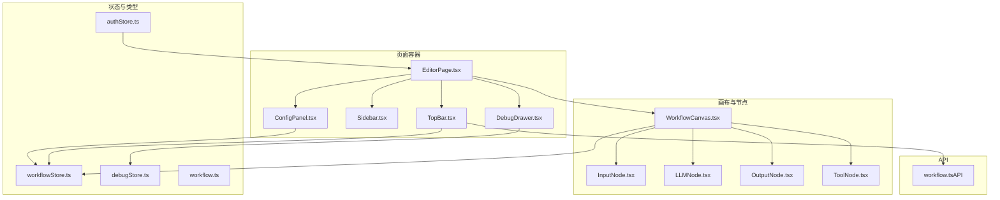
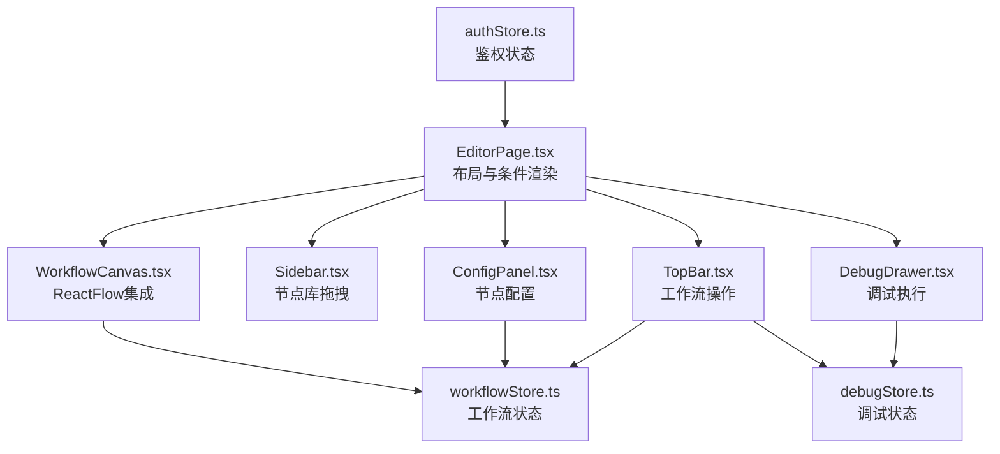
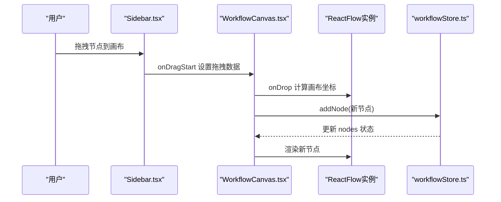
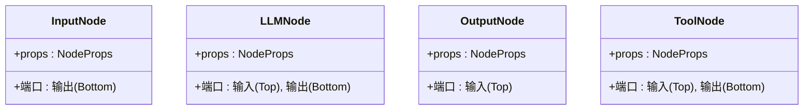
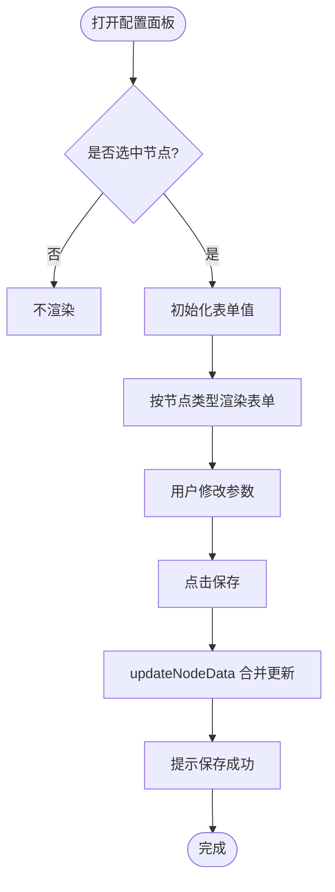
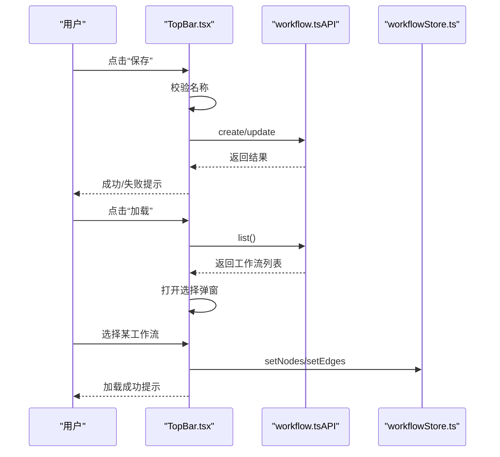
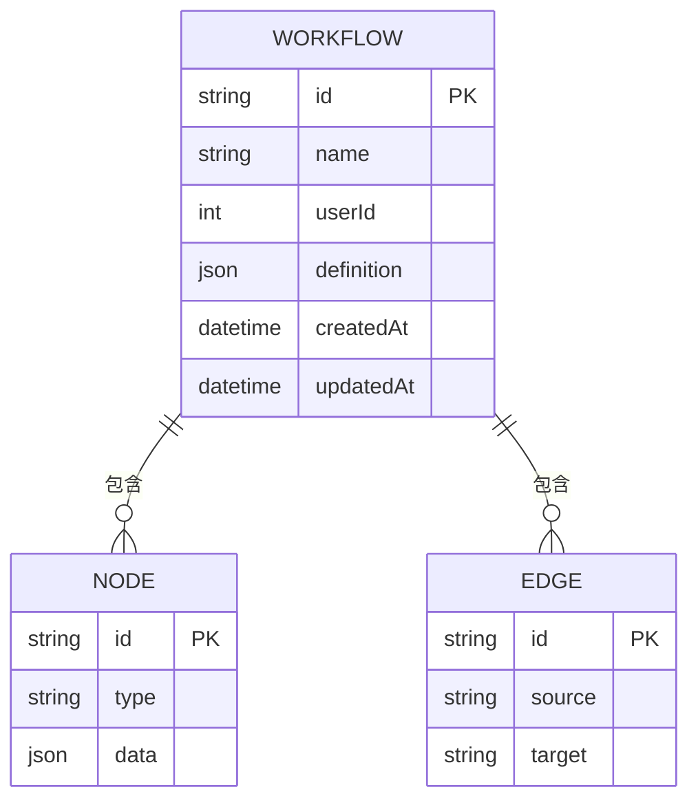
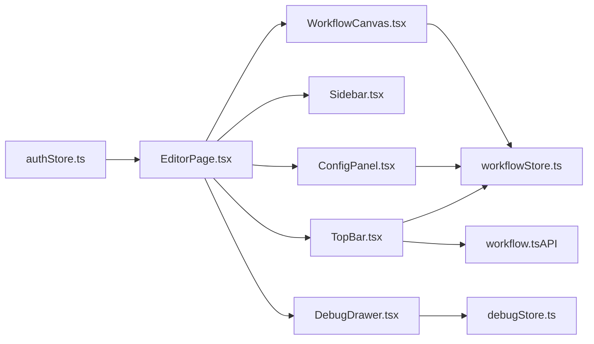

# 可视化编辑器

<cite>
**本文引用的文件**
- [EditorPage.tsx](file://frontend/src/components/EditorPage.tsx)
- [WorkflowCanvas.tsx](file://frontend/src/components/Canvas/WorkflowCanvas.tsx)
- [InputNode.tsx](file://frontend/src/components/Canvas/nodes/InputNode.tsx)
- [LLMNode.tsx](file://frontend/src/components/Canvas/nodes/LLMNode.tsx)
- [OutputNode.tsx](file://frontend/src/components/Canvas/nodes/OutputNode.tsx)
- [ToolNode.tsx](file://frontend/src/components/Canvas/nodes/ToolNode.tsx)
- [ConfigPanel.tsx](file://frontend/src/components/ConfigPanel/ConfigPanel.tsx)
- [Sidebar.tsx](file://frontend/src/components/Sidebar/Sidebar.tsx)
- [TopBar.tsx](file://frontend/src/components/TopBar/TopBar.tsx)
- [DebugDrawer.tsx](file://frontend/src/components/DebugDrawer/DebugDrawer.tsx)
- [workflowStore.ts](file://frontend/src/store/workflowStore.ts)
- [debugStore.ts](file://frontend/src/store/debugStore.ts)
- [authStore.ts](file://frontend/src/store/authStore.ts)
- [workflow.ts](file://frontend/src/types/workflow.ts)
- [workflow.ts（API）](file://frontend/src/api/workflow.ts)
</cite>

## 目录
1. [简介](#简介)
2. [项目结构](#项目结构)
3. [核心组件](#核心组件)
4. [架构总览](#架构总览)
5. [详细组件分析](#详细组件分析)
6. [依赖关系分析](#依赖关系分析)
7. [性能考量](#性能考量)
8. [故障排查指南](#故障排查指南)
9. [结论](#结论)
10. [附录](#附录)

## 简介
本技术文档围绕可视化编辑器展开，重点解析以下方面：
- 主编辑器页面布局与控制流：EditorPage.tsx 的容器布局、工具栏集成与画布管理。
- ReactFlow 集成：WorkflowCanvas.tsx 中的节点拖拽、连接线绘制、画布缩放与交互事件。
- 自定义节点组件：InputNode、LLMNode、OutputNode、ToolNode 的实现细节与端口设计。
- 节点配置面板：ConfigPanel.tsx 的参数设置、表单渲染、验证与保存流程。
- 数据流与状态管理：基于 Zustand 的工作流状态、调试状态与鉴权状态。
- 事件处理机制：从侧边栏拖拽到画布、节点选择、连线、保存/加载工作流等。
- 序列化与反序列化：工作流定义的保存与加载流程。
- 用户交互流程图与节点生命周期管理。

## 项目结构
前端采用按功能分层的组织方式，编辑器由页面容器、画布、节点、配置面板、侧边栏、顶部工具栏与调试抽屉组成；状态通过 Zustand 管理，类型定义集中在 types 目录，API 封装在 api 目录。

图表来源
- [EditorPage.tsx:11-39](file://frontend/src/components/EditorPage.tsx#L11-L39)
- [WorkflowCanvas.tsx:26-102](file://frontend/src/components/Canvas/WorkflowCanvas.tsx#L26-L102)
- [ConfigPanel.tsx:9-119](file://frontend/src/components/ConfigPanel/ConfigPanel.tsx#L9-L119)
- [TopBar.tsx:18-144](file://frontend/src/components/TopBar/TopBar.tsx#L18-L144)
- [DebugDrawer.tsx:8-126](file://frontend/src/components/DebugDrawer/DebugDrawer.tsx#L8-L126)
- [workflowStore.ts:39-94](file://frontend/src/store/workflowStore.ts#L39-L94)
- [debugStore.ts:19-44](file://frontend/src/store/debugStore.ts#L19-L44)
- [authStore.ts:14-49](file://frontend/src/store/authStore.ts#L14-L49)
- [workflow.ts:1-71](file://frontend/src/types/workflow.ts#L1-L71)
- [workflow.ts（API）:5-21](file://frontend/src/api/workflow.ts#L5-L21)

章节来源
- [EditorPage.tsx:11-39](file://frontend/src/components/EditorPage.tsx#L11-L39)
- [TopBar.tsx:18-144](file://frontend/src/components/TopBar/TopBar.tsx#L18-L144)
- [Sidebar.tsx:22-69](file://frontend/src/components/Sidebar/Sidebar.tsx#L22-L69)
- [WorkflowCanvas.tsx:26-102](file://frontend/src/components/Canvas/WorkflowCanvas.tsx#L26-L102)
- [ConfigPanel.tsx:9-119](file://frontend/src/components/ConfigPanel/ConfigPanel.tsx#L9-L119)
- [DebugDrawer.tsx:8-126](file://frontend/src/components/DebugDrawer/DebugDrawer.tsx#L8-L126)
- [workflowStore.ts:39-94](file://frontend/src/store/workflowStore.ts#L39-L94)
- [debugStore.ts:19-44](file://frontend/src/store/debugStore.ts#L19-L44)
- [authStore.ts:14-49](file://frontend/src/store/authStore.ts#L14-L49)
- [workflow.ts:1-71](file://frontend/src/types/workflow.ts#L1-L71)
- [workflow.ts（API）:5-21](file://frontend/src/api/workflow.ts#L5-L21)

## 核心组件
- 编辑器页面容器：负责布局划分、条件渲染配置面板与调试抽屉、鉴权检查。
- 画布与节点：基于 ReactFlow 实现拖拽、连线、缩放与节点渲染。
- 配置面板：根据选中节点类型动态渲染表单，支持保存配置。
- 侧边栏：提供可拖拽的节点库，封装节点元信息。
- 工具栏：工作流命名、新建、保存、加载、调试入口。
- 调试抽屉：执行工作流、展示结果与节点日志。
- 状态管理：工作流状态、调试状态、鉴权状态。

章节来源
- [EditorPage.tsx:11-39](file://frontend/src/components/EditorPage.tsx#L11-L39)
- [WorkflowCanvas.tsx:26-102](file://frontend/src/components/Canvas/WorkflowCanvas.tsx#L26-L102)
- [ConfigPanel.tsx:9-119](file://frontend/src/components/ConfigPanel/ConfigPanel.tsx#L9-L119)
- [Sidebar.tsx:22-69](file://frontend/src/components/Sidebar/Sidebar.tsx#L22-L69)
- [TopBar.tsx:18-144](file://frontend/src/components/TopBar/TopBar.tsx#L18-L144)
- [DebugDrawer.tsx:8-126](file://frontend/src/components/DebugDrawer/DebugDrawer.tsx#L8-L126)
- [workflowStore.ts:39-94](file://frontend/src/store/workflowStore.ts#L39-L94)
- [debugStore.ts:19-44](file://frontend/src/store/debugStore.ts#L19-L44)
- [authStore.ts:14-49](file://frontend/src/store/authStore.ts#L14-L49)

## 架构总览
编辑器采用“页面容器 + 画布 + 节点 + 配置面板 + 工具栏 + 调试抽屉”的组合式架构，状态通过 Zustand 在组件间共享，API 层负责与后端交互。

图表来源
- [EditorPage.tsx:20-39](file://frontend/src/components/EditorPage.tsx#L20-L39)
- [TopBar.tsx:18-144](file://frontend/src/components/TopBar/TopBar.tsx#L18-L144)
- [Sidebar.tsx:22-69](file://frontend/src/components/Sidebar/Sidebar.tsx#L22-L69)
- [WorkflowCanvas.tsx:30-102](file://frontend/src/components/Canvas/WorkflowCanvas.tsx#L30-L102)
- [ConfigPanel.tsx:9-119](file://frontend/src/components/ConfigPanel/ConfigPanel.tsx#L9-L119)
- [DebugDrawer.tsx:8-126](file://frontend/src/components/DebugDrawer/DebugDrawer.tsx#L8-L126)
- [workflowStore.ts:39-94](file://frontend/src/store/workflowStore.ts#L39-L94)
- [debugStore.ts:19-44](file://frontend/src/store/debugStore.ts#L19-L44)
- [authStore.ts:14-49](file://frontend/src/store/authStore.ts#L14-L49)

## 详细组件分析

### EditorPage.tsx：主编辑器容器
- 布局：顶部工具栏、左侧侧边栏、中间画布、右侧配置面板、底部调试抽屉。
- 条件渲染：当存在选中节点时显示配置面板；当调试抽屉打开时显示调试区域。
- 鉴权：初始化时调用鉴权检查，确保用户登录状态。

章节来源
- [EditorPage.tsx:11-39](file://frontend/src/components/EditorPage.tsx#L11-L39)

### WorkflowCanvas.tsx：ReactFlow 集成与交互
- 节点类型注册：将自定义节点组件注册到 ReactFlow。
- 拖拽添加节点：侧边栏拖拽事件携带节点配置，画布接收后生成新节点并加入状态。
- 事件绑定：节点变化、连线、点击、画布点击（取消选择）等。
- 默认节点数据：根据节点类型返回默认字段，如 LLM 的 provider、model、prompt 等。
- 画布控件：背景网格、缩略图、控制条。

图表来源
- [Sidebar.tsx:22-26](file://frontend/src/components/Sidebar/Sidebar.tsx#L22-L26)
- [WorkflowCanvas.tsx:42-66](file://frontend/src/components/Canvas/WorkflowCanvas.tsx#L42-L66)
- [WorkflowCanvas.tsx:104-132](file://frontend/src/components/Canvas/WorkflowCanvas.tsx#L104-L132)
- [workflowStore.ts:61-63](file://frontend/src/store/workflowStore.ts#L61-L63)

章节来源
- [WorkflowCanvas.tsx:26-102](file://frontend/src/components/Canvas/WorkflowCanvas.tsx#L26-L102)
- [WorkflowCanvas.tsx:104-132](file://frontend/src/components/Canvas/WorkflowCanvas.tsx#L104-L132)
- [workflowStore.ts:39-94](file://frontend/src/store/workflowStore.ts#L39-L94)

### 自定义节点组件
- InputNode：仅输出端口（Bottom），用于数据输入。
- LLMNode：带输入端口（Top）与输出端口（Bottom），用于大模型推理。
- OutputNode：仅输入端口（Top），用于输出结果。
- ToolNode：带输入端口（Top）与输出端口（Bottom），用于工具节点（如 TTS）。

图表来源
- [InputNode.tsx:5-14](file://frontend/src/components/Canvas/nodes/InputNode.tsx#L5-L14)
- [LLMNode.tsx:5-15](file://frontend/src/components/Canvas/nodes/LLMNode.tsx#L5-L15)
- [OutputNode.tsx:5-14](file://frontend/src/components/Canvas/nodes/OutputNode.tsx#L5-L14)
- [ToolNode.tsx:5-15](file://frontend/src/components/Canvas/nodes/ToolNode.tsx#L5-L15)

章节来源
- [InputNode.tsx:5-14](file://frontend/src/components/Canvas/nodes/InputNode.tsx#L5-L14)
- [LLMNode.tsx:5-15](file://frontend/src/components/Canvas/nodes/LLMNode.tsx#L5-L15)
- [OutputNode.tsx:5-14](file://frontend/src/components/Canvas/nodes/OutputNode.tsx#L5-L14)
- [ToolNode.tsx:5-15](file://frontend/src/components/Canvas/nodes/ToolNode.tsx#L5-L15)

### ConfigPanel.tsx：节点配置面板
- 动态表单：根据节点类型渲染不同表单项（LLM、TTS、Input、Output）。
- 表单值同步：选中节点变化时，使用 Form.setFieldsValue 同步当前节点数据。
- 保存逻辑：点击保存后调用 updateNodeData，合并更新节点数据。
- 提示与反馈：保存成功消息提示。

图表来源
- [ConfigPanel.tsx:9-119](file://frontend/src/components/ConfigPanel/ConfigPanel.tsx#L9-L119)
- [workflowStore.ts:73-79](file://frontend/src/store/workflowStore.ts#L73-L79)

章节来源
- [ConfigPanel.tsx:9-119](file://frontend/src/components/ConfigPanel/ConfigPanel.tsx#L9-L119)
- [workflowStore.ts:73-79](file://frontend/src/store/workflowStore.ts#L73-L79)

### Sidebar.tsx：节点库与拖拽
- 节点库：LLM 节点与 Tool 节点两类，每类包含多个子类型。
- 拖拽事件：onDragStart 将节点配置序列化为字符串写入 dataTransfer。
- 视觉样式：图标、颜色与标题分组。

章节来源
- [Sidebar.tsx:11-20](file://frontend/src/components/Sidebar/Sidebar.tsx#L11-L20)
- [Sidebar.tsx:22-69](file://frontend/src/components/Sidebar/Sidebar.tsx#L22-L69)

### TopBar.tsx：工具栏与工作流管理
- 新建：重置工作流状态。
- 保存：校验名称，构造定义对象，调用 API 创建或更新。
- 加载：拉取工作流列表，弹窗选择后回填 nodes 与 edges。
- 调试：打开调试抽屉。
- 登录状态：显示用户名，提供登出。

图表来源
- [TopBar.tsx:31-67](file://frontend/src/components/TopBar/TopBar.tsx#L31-L67)
- [workflow.ts（API）:5-21](file://frontend/src/api/workflow.ts#L5-L21)
- [workflowStore.ts:46-59](file://frontend/src/store/workflowStore.ts#L46-L59)

章节来源
- [TopBar.tsx:18-144](file://frontend/src/components/TopBar/TopBar.tsx#L18-L144)
- [workflow.ts（API）:5-21](file://frontend/src/api/workflow.ts#L5-L21)
- [workflowStore.ts:46-59](file://frontend/src/store/workflowStore.ts#L46-L59)

### DebugDrawer.tsx：调试执行与结果展示
- 输入：测试输入文本。
- 执行：调用执行 API，展示加载状态与错误。
- 结果：展示执行状态、耗时、文本输出与音频播放、节点日志。

章节来源
- [DebugDrawer.tsx:8-126](file://frontend/src/components/DebugDrawer/DebugDrawer.tsx#L8-L126)
- [debugStore.ts:19-44](file://frontend/src/store/debugStore.ts#L19-L44)

### 状态管理与数据模型
- 工作流状态：nodes、edges、selectedNodeId、workflowId、workflowName 等。
- 调试状态：isOpen、input、result、loading、error。
- 鉴权状态：token、user、login/logout/checkAuth。
- 类型定义：节点数据结构、工作流定义、执行结果与节点日志。

图表来源
- [workflow.ts:43-50](file://frontend/src/types/workflow.ts#L43-L50)
- [workflow.ts:38-41](file://frontend/src/types/workflow.ts#L38-L41)

章节来源
- [workflowStore.ts:39-94](file://frontend/src/store/workflowStore.ts#L39-L94)
- [debugStore.ts:19-44](file://frontend/src/store/debugStore.ts#L19-L44)
- [authStore.ts:14-49](file://frontend/src/store/authStore.ts#L14-L49)
- [workflow.ts:1-71](file://frontend/src/types/workflow.ts#L1-L71)

## 依赖关系分析
- 组件耦合：EditorPage 作为容器，其余组件均为其子组件；画布与节点通过 ReactFlow 解耦；配置面板与画布通过状态解耦。
- 外部依赖：ReactFlow、Ant Design、Zustand、浏览器拖拽 API。
- 状态耦合：ConfigPanel 与 WorkflowCanvas 共享 workflowStore；TopBar 与 DebugDrawer 分别与 workflowStore 和 debugStore 交互。

图表来源
- [EditorPage.tsx:20-39](file://frontend/src/components/EditorPage.tsx#L20-L39)
- [TopBar.tsx:18-144](file://frontend/src/components/TopBar/TopBar.tsx#L18-L144)
- [Sidebar.tsx:22-69](file://frontend/src/components/Sidebar/Sidebar.tsx#L22-L69)
- [WorkflowCanvas.tsx:30-102](file://frontend/src/components/Canvas/WorkflowCanvas.tsx#L30-L102)
- [ConfigPanel.tsx:9-119](file://frontend/src/components/ConfigPanel/ConfigPanel.tsx#L9-L119)
- [DebugDrawer.tsx:8-126](file://frontend/src/components/DebugDrawer/DebugDrawer.tsx#L8-L126)
- [workflowStore.ts:39-94](file://frontend/src/store/workflowStore.ts#L39-L94)
- [debugStore.ts:19-44](file://frontend/src/store/debugStore.ts#L19-L44)
- [authStore.ts:14-49](file://frontend/src/store/authStore.ts#L14-L49)
- [workflow.ts（API）:5-21](file://frontend/src/api/workflow.ts#L5-L21)

## 性能考量
- 节点渲染：使用 memo 包裹节点组件，减少不必要的重渲染。
- 状态粒度：Zustand 将工作流状态集中管理，避免跨组件重复计算。
- 画布优化：ReactFlow 默认启用平滑曲线与动画，可根据需要调整 edge 类型与动画开关以平衡视觉与性能。
- 表单更新：ConfigPanel 使用受控表单，建议在高频输入场景下结合节流策略。

## 故障排查指南
- 保存失败：检查工作流名称是否为空，确认 API 返回状态码与错误信息。
- 加载无数据：确认后端接口返回的工作流列表非空，检查 setNodes/setEdges 是否正确赋值。
- 调试执行失败：确认已保存工作流并获取 workflowId，查看错误提示与网络请求。
- 节点无法连线：检查端口位置与连接方向，确保 source/target 正确。
- 节点配置未生效：确认 updateNodeData 是否被调用，以及表单字段名与节点数据结构一致。

章节来源
- [TopBar.tsx:31-67](file://frontend/src/components/TopBar/TopBar.tsx#L31-L67)
- [DebugDrawer.tsx:13-18](file://frontend/src/components/DebugDrawer/DebugDrawer.tsx#L13-L18)
- [workflowStore.ts:73-79](file://frontend/src/store/workflowStore.ts#L73-L79)

## 结论
该可视化编辑器通过清晰的组件边界与状态管理，实现了从节点拖拽、连线、配置到保存/加载与调试执行的完整工作流。ReactFlow 提供了强大的画布能力，Zustand 简化了状态共享，Ant Design 组件提升了交互体验。后续可在性能优化、表单校验与节点类型扩展方面进一步增强。

## 附录
- 节点类型与默认字段：参见类型定义与默认节点数据函数。
- API 接口：工作流的增删改查与执行接口封装。

章节来源
- [workflow.ts:7-31](file://frontend/src/types/workflow.ts#L7-L31)
- [WorkflowCanvas.tsx:104-132](file://frontend/src/components/Canvas/WorkflowCanvas.tsx#L104-L132)
- [workflow.ts（API）:5-21](file://frontend/src/api/workflow.ts#L5-L21)