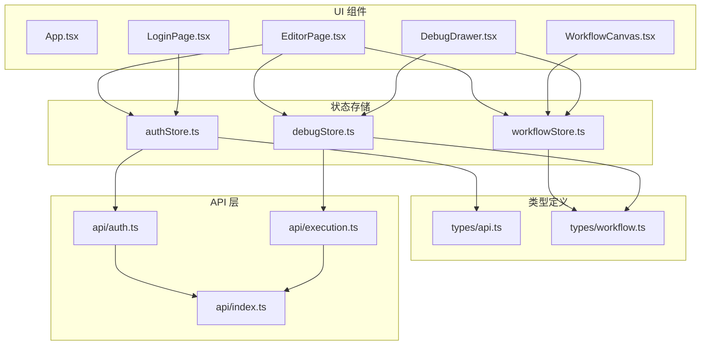
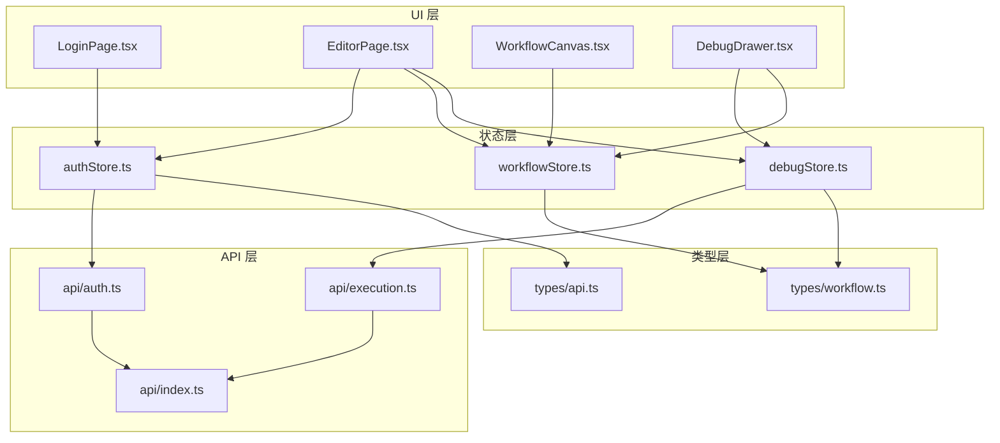
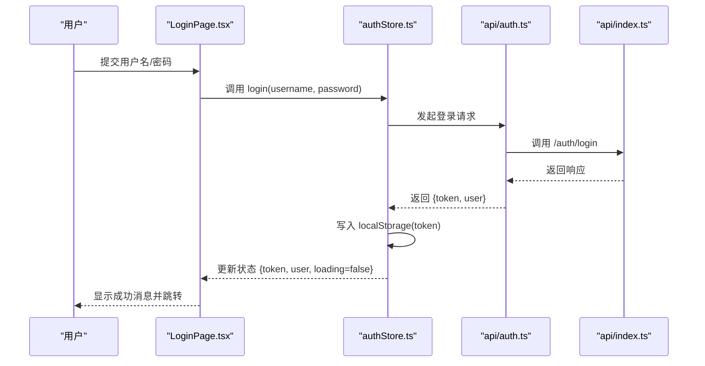
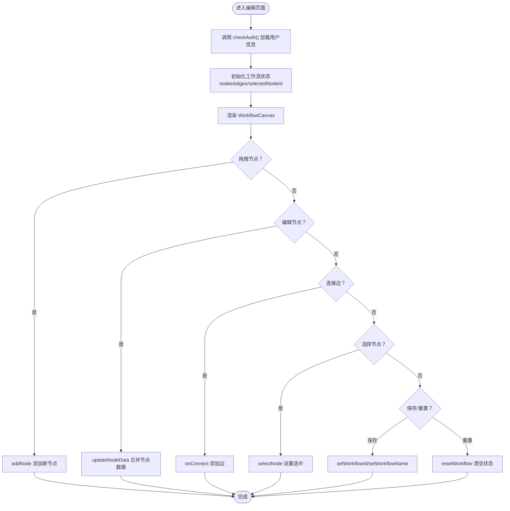
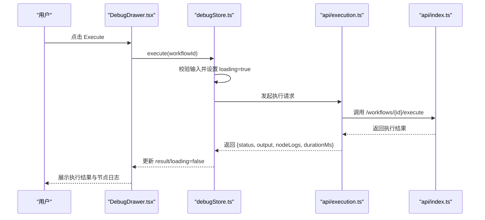
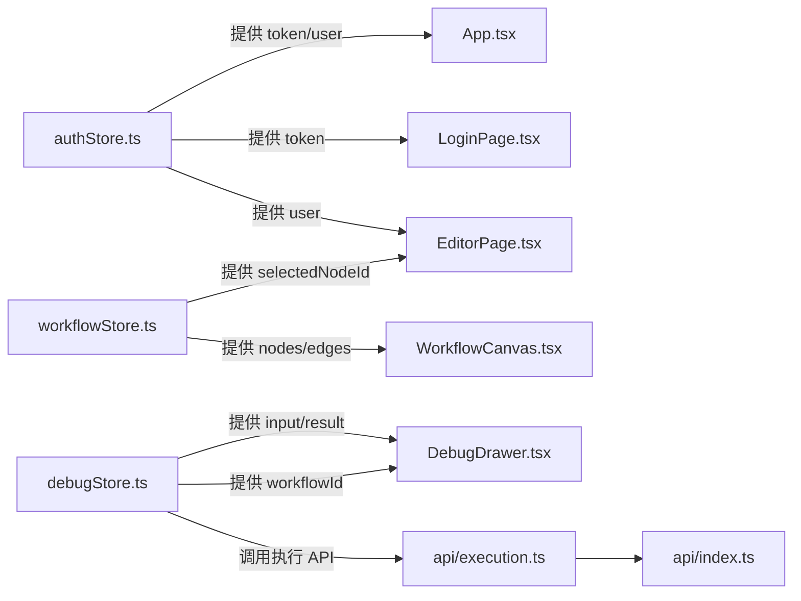
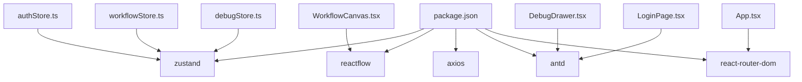

# 状态管理系统

<cite>
**本文引用的文件**
- [authStore.ts](file://frontend/src/store/authStore.ts)
- [workflowStore.ts](file://frontend/src/store/workflowStore.ts)
- [debugStore.ts](file://frontend/src/store/debugStore.ts)
- [api.ts（认证）](file://frontend/src/api/auth.ts)
- [api.ts（执行）](file://frontend/src/api/execution.ts)
- [api.ts（通用）](file://frontend/src/api/index.ts)
- [api.ts（类型定义）](file://frontend/src/types/api.ts)
- [workflow.ts（类型定义）](file://frontend/src/types/workflow.ts)
- [LoginPage.tsx](file://frontend/src/components/Auth/LoginPage.tsx)
- [EditorPage.tsx](file://frontend/src/components/EditorPage.tsx)
- [App.tsx](file://frontend/src/App.tsx)
- [WorkflowCanvas.tsx](file://frontend/src/components/Canvas/WorkflowCanvas.tsx)
- [DebugDrawer.tsx](file://frontend/src/components/DebugDrawer/DebugDrawer.tsx)
- [package.json](file://frontend/package.json)
</cite>

## 目录
1. [简介](#简介)
2. [项目结构](#项目结构)
3. [核心组件](#核心组件)
4. [架构总览](#架构总览)
5. [详细组件分析](#详细组件分析)
6. [依赖分析](#依赖分析)
7. [性能考虑](#性能考虑)
8. [故障排查指南](#故障排查指南)
9. [结论](#结论)
10. [附录](#附录)

## 简介
本文件为前端状态管理系统的技术文档，基于 Zustand 状态管理库实现，覆盖认证状态、工作流状态与调试状态三大模块。文档从系统架构、组件关系、数据流、处理逻辑、集成点、错误处理与性能优化等方面进行深入解析，并提供状态流转图与组件交互图，帮助开发者快速理解与扩展系统。

## 项目结构
前端采用 Zustand 进行状态管理，配合 React 组件与 ReactFlow 可视化画布，形成“状态存储 + UI 组件”的清晰分层：
- 状态存储：authStore.ts、workflowStore.ts、debugStore.ts
- 类型定义：types/api.ts、types/workflow.ts
- API 层：api/index.ts、api/auth.ts、api/execution.ts
- UI 组件：App.tsx、EditorPage.tsx、LoginPage.tsx、WorkflowCanvas.tsx、DebugDrawer.tsx

图表来源
- [authStore.ts:1-50](file://frontend/src/store/authStore.ts#L1-L50)
- [workflowStore.ts:1-95](file://frontend/src/store/workflowStore.ts#L1-L95)
- [debugStore.ts:1-45](file://frontend/src/store/debugStore.ts#L1-L45)
- [api.ts（认证）:1-12](file://frontend/src/api/auth.ts#L1-L12)
- [api.ts（执行）:1-13](file://frontend/src/api/execution.ts#L1-L13)
- [api.ts（通用）](file://frontend/src/api/index.ts)
- [api.ts（类型定义）:1-22](file://frontend/src/types/api.ts#L1-L22)
- [workflow.ts（类型定义）:1-71](file://frontend/src/types/workflow.ts#L1-L71)
- [LoginPage.tsx:1-46](file://frontend/src/components/Auth/LoginPage.tsx#L1-L46)
- [EditorPage.tsx:1-40](file://frontend/src/components/EditorPage.tsx#L1-L40)
- [App.tsx:1-31](file://frontend/src/App.tsx#L1-L31)
- [WorkflowCanvas.tsx:1-133](file://frontend/src/components/Canvas/WorkflowCanvas.tsx#L1-L133)
- [DebugDrawer.tsx:1-127](file://frontend/src/components/DebugDrawer/DebugDrawer.tsx#L1-L127)

章节来源
- [authStore.ts:1-50](file://frontend/src/store/authStore.ts#L1-L50)
- [workflowStore.ts:1-95](file://frontend/src/store/workflowStore.ts#L1-L95)
- [debugStore.ts:1-45](file://frontend/src/store/debugStore.ts#L1-L45)
- [api.ts（认证）:1-12](file://frontend/src/api/auth.ts#L1-L12)
- [api.ts（执行）:1-13](file://frontend/src/api/execution.ts#L1-L13)
- [api.ts（通用）](file://frontend/src/api/index.ts)
- [api.ts（类型定义）:1-22](file://frontend/src/types/api.ts#L1-L22)
- [workflow.ts（类型定义）:1-71](file://frontend/src/types/workflow.ts#L1-L71)
- [LoginPage.tsx:1-46](file://frontend/src/components/Auth/LoginPage.tsx#L1-L46)
- [EditorPage.tsx:1-40](file://frontend/src/components/EditorPage.tsx#L1-L40)
- [App.tsx:1-31](file://frontend/src/App.tsx#L1-L31)
- [WorkflowCanvas.tsx:1-133](file://frontend/src/components/Canvas/WorkflowCanvas.tsx#L1-L133)
- [DebugDrawer.tsx:1-127](file://frontend/src/components/DebugDrawer/DebugDrawer.tsx#L1-L127)

## 核心组件
- 认证状态存储（authStore.ts）
  - 负责 token 存储、用户信息、登录/登出、鉴权检查
  - 使用 localStorage 持久化 token
- 工作流状态存储（workflowStore.ts）
  - 负责节点与边的增删改查、选择状态、工作流元数据
  - 基于 ReactFlow 的变更处理器与连接器
- 调试状态存储（debugStore.ts）
  - 负责调试抽屉开关、输入、执行结果、错误与加载状态
  - 通过 API 执行工作流并返回节点级日志

章节来源
- [authStore.ts:1-50](file://frontend/src/store/authStore.ts#L1-L50)
- [workflowStore.ts:1-95](file://frontend/src/store/workflowStore.ts#L1-L95)
- [debugStore.ts:1-45](file://frontend/src/store/debugStore.ts#L1-L45)

## 架构总览
系统采用“Zustand 状态 + React 组件 + ReactFlow 画布 + API 接口”的分层架构。UI 组件通过 Zustand 订阅状态变化，触发动作函数更新状态；API 层负责与后端交互，返回标准化响应。

图表来源
- [LoginPage.tsx:1-46](file://frontend/src/components/Auth/LoginPage.tsx#L1-L46)
- [EditorPage.tsx:1-40](file://frontend/src/components/EditorPage.tsx#L1-L40)
- [WorkflowCanvas.tsx:1-133](file://frontend/src/components/Canvas/WorkflowCanvas.tsx#L1-L133)
- [DebugDrawer.tsx:1-127](file://frontend/src/components/DebugDrawer/DebugDrawer.tsx#L1-L127)
- [authStore.ts:1-50](file://frontend/src/store/authStore.ts#L1-L50)
- [workflowStore.ts:1-95](file://frontend/src/store/workflowStore.ts#L1-L95)
- [debugStore.ts:1-45](file://frontend/src/store/debugStore.ts#L1-L45)
- [api.ts（认证）:1-12](file://frontend/src/api/auth.ts#L1-L12)
- [api.ts（执行）:1-13](file://frontend/src/api/execution.ts#L1-L13)
- [api.ts（通用）](file://frontend/src/api/index.ts)
- [api.ts（类型定义）:1-22](file://frontend/src/types/api.ts#L1-L22)
- [workflow.ts（类型定义）:1-71](file://frontend/src/types/workflow.ts#L1-L71)

## 详细组件分析

### 认证状态管理（authStore.ts）
- 状态字段
  - token：字符串或空，用于鉴权
  - user：用户对象或空
  - loading：布尔值，表示登录流程状态
- 动作函数
  - login(username, password)：调用认证 API 获取 token 与用户信息，写入 localStorage 并更新状态
  - logout()：移除本地 token，清空状态并跳转到登录页
  - checkAuth()：从 localStorage 读取 token，若存在则调用“获取当前用户”接口校验并更新 user
- 订阅与使用
  - LoginPage.tsx 通过订阅 login 动作完成登录表单提交
  - App.tsx 通过订阅 token 实现路由保护
  - EditorPage.tsx 在挂载时调用 checkAuth 完成自动登录

图表来源
- [LoginPage.tsx:12-23](file://frontend/src/components/Auth/LoginPage.tsx#L12-L23)
- [authStore.ts:19-30](file://frontend/src/store/authStore.ts#L19-L30)
- [api.ts（认证）:5-10](file://frontend/src/api/auth.ts#L5-L10)
- [api.ts（通用）](file://frontend/src/api/index.ts)

章节来源
- [authStore.ts:1-50](file://frontend/src/store/authStore.ts#L1-L50)
- [api.ts（认证）:1-12](file://frontend/src/api/auth.ts#L1-L12)
- [LoginPage.tsx:1-46](file://frontend/src/components/Auth/LoginPage.tsx#L1-L46)
- [App.tsx:6-10](file://frontend/src/App.tsx#L6-L10)
- [EditorPage.tsx:11-18](file://frontend/src/components/EditorPage.tsx#L11-L18)

### 工作流状态管理（workflowStore.ts）
- 状态字段
  - nodes：节点数组
  - edges：边数组
  - selectedNodeId：选中节点 ID 或空
  - workflowId / workflowName：工作流标识与名称
- 动作函数
  - setNodes/setEdges：直接替换集合
  - onNodesChange/onEdgesChange/onConnect：应用 ReactFlow 变更与连接
  - addNode/removeNode/updateNodeData：增删改节点及数据合并
  - selectNode：设置选中节点
  - setWorkflowId/setWorkflowName/resetWorkflow：工作流元数据与重置
- 与 UI 集成
  - WorkflowCanvas.tsx 将状态与 ReactFlow 绑定，支持拖拽添加节点、点击选择、连接边等

图表来源
- [EditorPage.tsx:11-18](file://frontend/src/components/EditorPage.tsx#L11-L18)
- [workflowStore.ts:39-94](file://frontend/src/store/workflowStore.ts#L39-L94)
- [WorkflowCanvas.tsx:42-77](file://frontend/src/components/Canvas/WorkflowCanvas.tsx#L42-L77)

章节来源
- [workflowStore.ts:1-95](file://frontend/src/store/workflowStore.ts#L1-L95)
- [WorkflowCanvas.tsx:1-133](file://frontend/src/components/Canvas/WorkflowCanvas.tsx#L1-L133)
- [EditorPage.tsx:1-40](file://frontend/src/components/EditorPage.tsx#L1-L40)

### 调试状态管理（debugStore.ts）
- 状态字段
  - isOpen：调试抽屉是否打开
  - input：测试输入文本
  - result：执行结果（含状态、耗时、输出、节点日志）
  - loading/error：执行过程中的加载与错误状态
- 动作函数
  - openDrawer/closeDrawer：控制抽屉开关
  - setInput：设置输入文本
  - execute(workflowId)：调用执行 API，捕获异常并更新状态
  - reset：清空输入、结果与错误
- 与 UI 集成
  - DebugDrawer.tsx 读取 isOpen、input、result、loading、error，渲染执行按钮、进度与结果卡片

图表来源
- [DebugDrawer.tsx:13-18](file://frontend/src/components/DebugDrawer/DebugDrawer.tsx#L13-L18)
- [debugStore.ts:30-41](file://frontend/src/store/debugStore.ts#L30-L41)
- [api.ts（执行）:6-8](file://frontend/src/api/execution.ts#L6-L8)
- [api.ts（通用）](file://frontend/src/api/index.ts)

章节来源
- [debugStore.ts:1-45](file://frontend/src/store/debugStore.ts#L1-L45)
- [DebugDrawer.tsx:1-127](file://frontend/src/components/DebugDrawer/DebugDrawer.tsx#L1-L127)
- [api.ts（执行）:1-13](file://frontend/src/api/execution.ts#L1-L13)

### 组件状态交互图
以下图展示三大状态存储之间的交互关系与数据流向。

图表来源
- [authStore.ts:1-50](file://frontend/src/store/authStore.ts#L1-L50)
- [workflowStore.ts:1-95](file://frontend/src/store/workflowStore.ts#L1-L95)
- [debugStore.ts:1-45](file://frontend/src/store/debugStore.ts#L1-L45)
- [App.tsx:1-31](file://frontend/src/App.tsx#L1-L31)
- [LoginPage.tsx:1-46](file://frontend/src/components/Auth/LoginPage.tsx#L1-L46)
- [EditorPage.tsx:1-40](file://frontend/src/components/EditorPage.tsx#L1-L40)
- [WorkflowCanvas.tsx:1-133](file://frontend/src/components/Canvas/WorkflowCanvas.tsx#L1-L133)
- [DebugDrawer.tsx:1-127](file://frontend/src/components/DebugDrawer/DebugDrawer.tsx#L1-L127)
- [api.ts（执行）:1-13](file://frontend/src/api/execution.ts#L1-L13)
- [api.ts（通用）](file://frontend/src/api/index.ts)

## 依赖分析
- 外部依赖
  - zustand：状态管理核心库
  - reactflow：可视化画布与节点/边操作
  - axios：HTTP 请求封装
  - antd：UI 组件库
  - react-router-dom：路由与受保护路由
- 内部依赖
  - 类型定义被状态存储与 API 层共享
  - API 层统一通过 api/index.ts 封装请求方法
  - UI 组件通过 Zustand 订阅状态并触发动作

图表来源
- [package.json:12-21](file://frontend/package.json#L12-L21)
- [authStore.ts:1-1](file://frontend/src/store/authStore.ts#L1-L1)
- [workflowStore.ts:1-1](file://frontend/src/store/workflowStore.ts#L1-L1)
- [debugStore.ts:1-1](file://frontend/src/store/debugStore.ts#L1-L1)
- [WorkflowCanvas.tsx:1-10](file://frontend/src/components/Canvas/WorkflowCanvas.tsx#L1-L10)
- [DebugDrawer.tsx:1-6](file://frontend/src/components/DebugDrawer/DebugDrawer.tsx#L1-L6)
- [LoginPage.tsx:1-6](file://frontend/src/components/Auth/LoginPage.tsx#L1-L6)
- [App.tsx:1-3](file://frontend/src/App.tsx#L1-L3)

章节来源
- [package.json:1-35](file://frontend/package.json#L1-L35)

## 性能考虑
- 状态粒度拆分
  - 将认证、工作流、调试拆分为独立状态存储，降低不必要的重渲染
- 选择性订阅
  - 组件仅订阅所需字段，避免全量状态更新导致的重渲染
- ReactFlow 优化
  - 使用默认边样式与动画选项，必要时可关闭动画以提升性能
- 异步执行
  - 登录与执行均采用异步流程，避免阻塞 UI
- 缓存与持久化
  - 认证 token 使用 localStorage，减少重复登录开销
- 建议
  - 对大型工作流，可考虑分页加载节点/边
  - 对频繁变更的节点数据，使用浅比较或自定义选择器优化重渲染

## 故障排查指南
- 登录失败
  - 现象：登录按钮报错，状态未更新
  - 排查：确认 API 返回格式与类型定义一致；检查网络请求与错误提示
  - 参考路径：[authStore.ts:19-30](file://frontend/src/store/authStore.ts#L19-L30)、[api.ts（认证）:5-10](file://frontend/src/api/auth.ts#L5-L10)
- 鉴权失效
  - 现象：token 存在但无法获取用户信息
  - 排查：清除 localStorage 中 token，重新登录；检查后端 JWT 校验
  - 参考路径：[authStore.ts:38-48](file://frontend/src/store/authStore.ts#L38-L48)
- 执行无结果
  - 现象：点击 Execute 无响应或报错
  - 排查：确认已保存工作流并获取 workflowId；检查输入非空；查看错误状态
  - 参考路径：[debugStore.ts:30-41](file://frontend/src/store/debugStore.ts#L30-L41)、[DebugDrawer.tsx:13-18](file://frontend/src/components/DebugDrawer/DebugDrawer.tsx#L13-L18)
- 画布无节点
  - 现象：拖拽节点无效或节点不显示
  - 排查：确认节点类型映射与默认数据；检查 ReactFlow 实例初始化
  - 参考路径：[WorkflowCanvas.tsx:16-21](file://frontend/src/components/Canvas/WorkflowCanvas.tsx#L16-L21)、[WorkflowCanvas.tsx:104-132](file://frontend/src/components/Canvas/WorkflowCanvas.tsx#L104-L132)

章节来源
- [authStore.ts:1-50](file://frontend/src/store/authStore.ts#L1-L50)
- [debugStore.ts:1-45](file://frontend/src/store/debugStore.ts#L1-L45)
- [DebugDrawer.tsx:1-127](file://frontend/src/components/DebugDrawer/DebugDrawer.tsx#L1-L127)
- [WorkflowCanvas.tsx:1-133](file://frontend/src/components/Canvas/WorkflowCanvas.tsx#L1-L133)

## 结论
本状态管理系统以 Zustand 为核心，结合 ReactFlow 与 API 层，实现了认证、工作流与调试三大功能域的清晰分离。通过类型定义与统一 API 封装，提升了代码一致性与可维护性。建议在后续迭代中引入状态持久化策略（如 Redux DevTools 或 Zustand Devtools）、对大型工作流进行分页与懒加载优化，并完善错误边界与日志上报机制。

## 附录
- 状态持久化策略建议
  - 认证：localStorage 持久化 token，自动登录校验
  - 工作流：可选将 nodes/edges 序列化至 localStorage 或 IndexedDB，支持断点续做
  - 调试：仅缓存最近一次执行结果，避免占用过多内存
- 开发工具
  - 使用 React DevTools 与 Zustand Devtools 辅助调试
  - ESLint + TypeScript 保障类型安全与代码质量