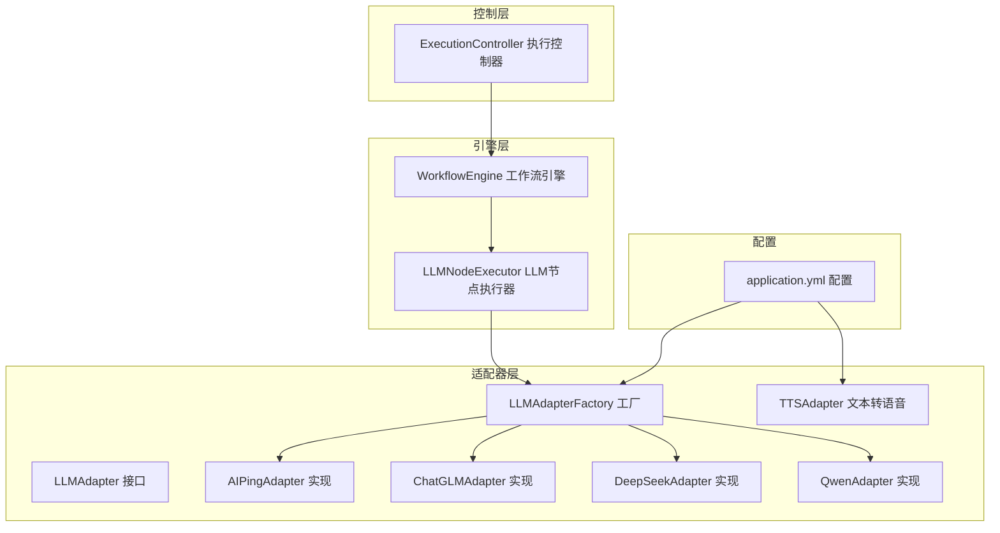
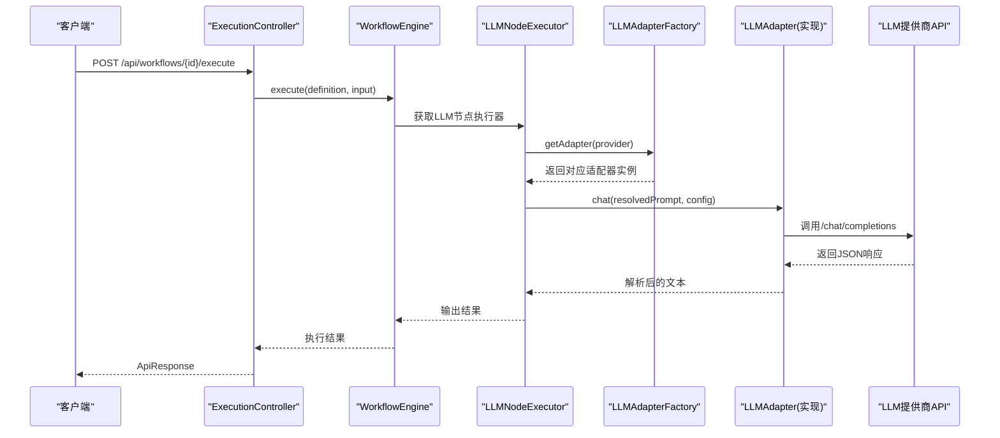
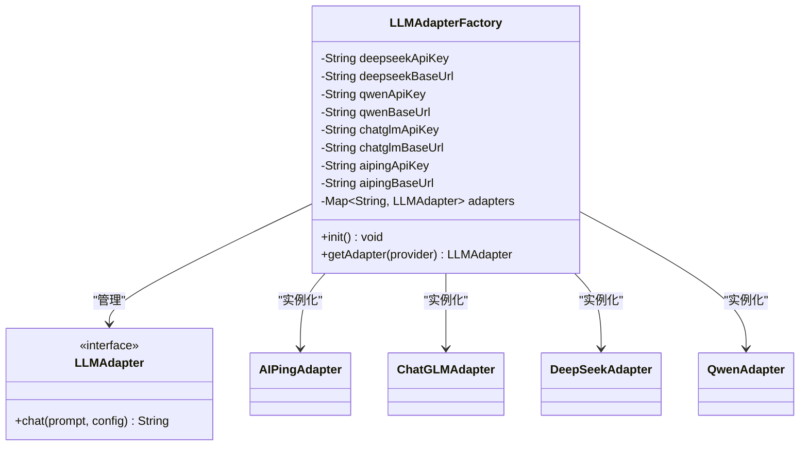
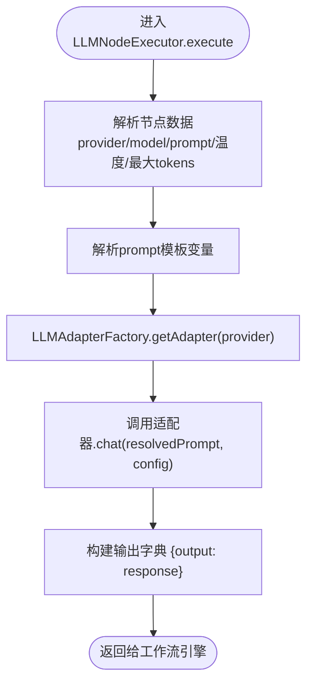
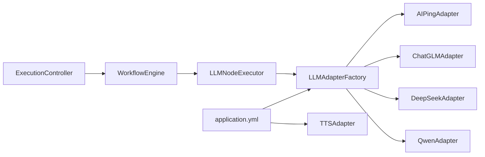

# AI服务适配器

<cite>
**本文引用的文件列表**
- [LLMAdapter.java](file://backend/src/main/java/com/paiagent/adapter/LLMAdapter.java)
- [TTSAdapter.java](file://backend/src/main/java/com/paiagent/adapter/TTSAdapter.java)
- [LLMAdapterFactory.java](file://backend/src/main/java/com/paiagent/adapter/LLMAdapterFactory.java)
- [AIPingAdapter.java](file://backend/src/main/java/com/paiagent/adapter/impl/AIPingAdapter.java)
- [ChatGLMAdapter.java](file://backend/src/main/java/com/paiagent/adapter/impl/ChatGLMAdapter.java)
- [DeepSeekAdapter.java](file://backend/src/main/java/com/paiagent/adapter/impl/DeepSeekAdapter.java)
- [QwenAdapter.java](file://backend/src/main/java/com/paiagent/adapter/impl/QwenAdapter.java)
- [application.yml](file://backend/src/main/resources/application.yml)
- [WorkflowEngine.java](file://backend/src/main/java/com/paiagent/engine/WorkflowEngine.java)
- [LLMNodeExecutor.java](file://backend/src/main/java/com/paiagent/engine/executors/LLMNodeExecutor.java)
- [ExecutionController.java](file://backend/src/main/java/com/paiagent/controller/ExecutionController.java)
- [ExecutionRequest.java](file://backend/src/main/java/com/paiagent/model/dto/ExecutionRequest.java)
</cite>

## 目录
1. [简介](#简介)
2. [项目结构](#项目结构)
3. [核心组件](#核心组件)
4. [架构总览](#架构总览)
5. [详细组件分析](#详细组件分析)
6. [依赖关系分析](#依赖关系分析)
7. [性能考量](#性能考量)
8. [故障排查指南](#故障排查指南)
9. [结论](#结论)
10. [附录](#附录)

## 简介
本技术文档围绕PaiAgent的AI服务适配器系统展开，重点阐述适配器模式在多AI服务提供商集成中的应用与统一抽象机制。系统通过LLMAdapter接口定义统一的对话式语言模型调用规范，通过LLMAdapterFactory工厂类实现适配器的实例化、配置注入与动态选择；同时提供四种具体适配器（AIPingAdapter、ChatGLMAdapter、DeepSeekAdapter、QwenAdapter）以适配不同供应商的OpenAI兼容API格式。此外，系统还包含TTSAdapter用于文本转语音合成，并通过WorkflowEngine与LLMNodeExecutor将LLM节点嵌入到工作流执行流程中。

## 项目结构
后端采用Spring Boot工程组织，适配器相关代码位于adapter包及子包，工作流引擎位于engine包，控制器位于controller包，配置位于resources目录。

图表来源
- [LLMAdapter.java:1-17](file://backend/src/main/java/com/paiagent/adapter/LLMAdapter.java#L1-L17)
- [LLMAdapterFactory.java:1-52](file://backend/src/main/java/com/paiagent/adapter/LLMAdapterFactory.java#L1-L52)
- [AIPingAdapter.java:1-65](file://backend/src/main/java/com/paiagent/adapter/impl/AIPingAdapter.java#L1-L65)
- [ChatGLMAdapter.java:1-61](file://backend/src/main/java/com/paiagent/adapter/impl/ChatGLMAdapter.java#L1-L61)
- [DeepSeekAdapter.java:1-61](file://backend/src/main/java/com/paiagent/adapter/impl/DeepSeekAdapter.java#L1-L61)
- [QwenAdapter.java:1-61](file://backend/src/main/java/com/paiagent/adapter/impl/QwenAdapter.java#L1-L61)
- [TTSAdapter.java:1-108](file://backend/src/main/java/com/paiagent/adapter/TTSAdapter.java#L1-L108)
- [WorkflowEngine.java:1-136](file://backend/src/main/java/com/paiagent/engine/WorkflowEngine.java#L1-L136)
- [LLMNodeExecutor.java:1-48](file://backend/src/main/java/com/paiagent/engine/executors/LLMNodeExecutor.java#L1-L48)
- [ExecutionController.java:1-93](file://backend/src/main/java/com/paiagent/controller/ExecutionController.java#L1-L93)
- [application.yml:1-44](file://backend/src/main/resources/application.yml#L1-L44)

章节来源
- [application.yml:1-44](file://backend/src/main/resources/application.yml#L1-L44)

## 核心组件
- LLMAdapter接口：定义统一的聊天调用方法，接收用户提示词与配置映射，返回模型响应文本。该接口是所有LLM适配器的统一抽象，确保上层调用无需关心底层供应商差异。
- LLMAdapterFactory工厂：负责从配置中读取各供应商的API密钥与基础URL，初始化并缓存四种适配器实例，提供按供应商名称动态获取适配器的能力。
- 四种具体适配器：
  - AIPingAdapter：遵循OpenAI兼容API格式，调用/chat/completions端点，解析choices.0.message.content作为输出。
  - ChatGLMAdapter：默认使用智谱AI的兼容模式，同样遵循OpenAI兼容API格式。
  - DeepSeekAdapter：默认使用DeepSeek官方兼容端点，遵循OpenAI兼容API格式。
  - QwenAdapter：默认使用DashScope兼容模式端点，遵循OpenAI兼容API格式。
- TTSAdapter：负责文本转语音合成，支持外部TTS API调用与本地占位生成两种路径，输出音频文件URL路径。
- WorkflowEngine与LLMNodeExecutor：将LLM节点纳入工作流执行，按拓扑顺序执行节点，注入用户输入，调用适配器并收集结果与日志。
- ExecutionController：对外提供执行工作流的REST接口，封装请求校验、执行、日志记录与响应包装。

章节来源
- [LLMAdapter.java:1-17](file://backend/src/main/java/com/paiagent/adapter/LLMAdapter.java#L1-L17)
- [LLMAdapterFactory.java:1-52](file://backend/src/main/java/com/paiagent/adapter/LLMAdapterFactory.java#L1-L52)
- [AIPingAdapter.java:1-65](file://backend/src/main/java/com/paiagent/adapter/impl/AIPingAdapter.java#L1-L65)
- [ChatGLMAdapter.java:1-61](file://backend/src/main/java/com/paiagent/adapter/impl/ChatGLMAdapter.java#L1-L61)
- [DeepSeekAdapter.java:1-61](file://backend/src/main/java/com/paiagent/adapter/impl/DeepSeekAdapter.java#L1-L61)
- [QwenAdapter.java:1-61](file://backend/src/main/java/com/paiagent/adapter/impl/QwenAdapter.java#L1-L61)
- [TTSAdapter.java:1-108](file://backend/src/main/java/com/paiagent/adapter/TTSAdapter.java#L1-L108)
- [WorkflowEngine.java:1-136](file://backend/src/main/java/com/paiagent/engine/WorkflowEngine.java#L1-L136)
- [LLMNodeExecutor.java:1-48](file://backend/src/main/java/com/paiagent/engine/executors/LLMNodeExecutor.java#L1-L48)
- [ExecutionController.java:1-93](file://backend/src/main/java/com/paiagent/controller/ExecutionController.java#L1-L93)

## 架构总览
下图展示了从HTTP请求到LLM调用再到工作流执行的整体链路，以及适配器工厂与具体适配器之间的关系。

图表来源
- [ExecutionController.java:37-82](file://backend/src/main/java/com/paiagent/controller/ExecutionController.java#L37-L82)
- [WorkflowEngine.java:20-108](file://backend/src/main/java/com/paiagent/engine/WorkflowEngine.java#L20-L108)
- [LLMNodeExecutor.java:21-46](file://backend/src/main/java/com/paiagent/engine/executors/LLMNodeExecutor.java#L21-L46)
- [LLMAdapterFactory.java:44-50](file://backend/src/main/java/com/paiagent/adapter/LLMAdapterFactory.java#L44-L50)
- [AIPingAdapter.java:30-63](file://backend/src/main/java/com/paiagent/adapter/impl/AIPingAdapter.java#L30-L63)
- [ChatGLMAdapter.java:30-59](file://backend/src/main/java/com/paiagent/adapter/impl/ChatGLMAdapter.java#L30-L59)
- [DeepSeekAdapter.java:30-59](file://backend/src/main/java/com/paiagent/adapter/impl/DeepSeekAdapter.java#L30-L59)
- [QwenAdapter.java:30-59](file://backend/src/main/java/com/paiagent/adapter/impl/QwenAdapter.java#L30-L59)

## 详细组件分析

### LLMAdapter接口设计
- 统一抽象：定义chat方法，接收prompt与配置映射，返回字符串响应，屏蔽不同供应商的API差异。
- 设计原则：单一职责、最小接口、可扩展性，便于新增适配器时保持调用一致性。

章节来源
- [LLMAdapter.java:8-16](file://backend/src/main/java/com/paiagent/adapter/LLMAdapter.java#L8-L16)

### LLMAdapterFactory工厂实现
- 配置注入：从application.yml读取各供应商的API密钥与基础URL，支持环境变量覆盖。
- 实例化策略：在初始化阶段将四种适配器注册到映射表，键为供应商标识（如“deepseek”、“qwen”等）。
- 动态选择：根据节点配置中的provider键选择对应适配器实例，若未找到则抛出非法参数异常。

图表来源
- [LLMAdapterFactory.java:12-50](file://backend/src/main/java/com/paiagent/adapter/LLMAdapterFactory.java#L12-L50)
- [AIPingAdapter.java:14-28](file://backend/src/main/java/com/paiagent/adapter/impl/AIPingAdapter.java#L14-L28)
- [ChatGLMAdapter.java:14-27](file://backend/src/main/java/com/paiagent/adapter/impl/ChatGLMAdapter.java#L14-L27)
- [DeepSeekAdapter.java:14-27](file://backend/src/main/java/com/paiagent/adapter/impl/DeepSeekAdapter.java#L14-L27)
- [QwenAdapter.java:14-27](file://backend/src/main/java/com/paiagent/adapter/impl/QwenAdapter.java#L14-L27)

章节来源
- [LLMAdapterFactory.java:1-52](file://backend/src/main/java/com/paiagent/adapter/LLMAdapterFactory.java#L1-L52)
- [application.yml:21-43](file://backend/src/main/resources/application.yml#L21-L43)

### AIPingAdapter实现细节
- API调用方式：构造OpenAI兼容的请求体，包含model、messages、temperature、max_tokens字段，POST至/chat/completions。
- 参数映射：从配置映射中读取model、temperature、maxTokens，提供默认值。
- 响应处理：解析JSON响应，提取choices.0.message.content作为最终文本。
- 错误处理：对非成功状态码抛出运行时异常，包含HTTP状态码与响应体信息。

章节来源
- [AIPingAdapter.java:30-63](file://backend/src/main/java/com/paiagent/adapter/impl/AIPingAdapter.java#L30-L63)

### ChatGLMAdapter实现细节
- 默认基础URL：若未显式配置，则使用智谱AI的兼容端点。
- 参数映射：与AIPing一致，但默认model为“glm-4-flash”。
- 响应处理：同上，解析choices.0.message.content。

章节来源
- [ChatGLMAdapter.java:21-59](file://backend/src/main/java/com/paiagent/adapter/impl/ChatGLMAdapter.java#L21-L59)

### DeepSeekAdapter实现细节
- 默认基础URL：若未显式配置，则使用DeepSeek官方兼容端点。
- 参数映射：默认model为“deepseek-chat”。
- 响应处理：同上。

章节来源
- [DeepSeekAdapter.java:21-59](file://backend/src/main/java/com/paiagent/adapter/impl/DeepSeekAdapter.java#L21-L59)

### QwenAdapter实现细节
- 默认基础URL：若未显式配置，则使用DashScope兼容模式端点。
- 参数映射：默认model为“qwen-turbo”。
- 响应处理：同上。

章节来源
- [QwenAdapter.java:21-59](file://backend/src/main/java/com/paiagent/adapter/impl/QwenAdapter.java#L21-L59)

### TTSAdapter实现细节
- 配置注入：从application.yml读取API密钥、基础URL与音频存储路径。
- 合成流程：若配置了基础URL则调用真实TTS API，否则生成占位MP3文件用于演示。
- 文件存储：确保音频目录存在，生成UUID命名的MP3文件，返回相对URL路径。
- 错误处理：对非成功HTTP响应抛出运行时异常，包含状态码；占位生成仅用于测试场景。

章节来源
- [TTSAdapter.java:18-106](file://backend/src/main/java/com/paiagent/adapter/TTSAdapter.java#L18-L106)
- [application.yml:36-43](file://backend/src/main/resources/application.yml#L36-L43)

### LLMNodeExecutor与工作流集成
- 节点数据解析：从节点数据中读取provider、model、prompt模板、temperature、maxTokens等参数。
- 模板解析：使用上下文解析prompt模板中的变量。
- 适配器选择：通过LLMAdapterFactory按provider获取适配器实例。
- 结果封装：将适配器返回的文本封装为输出字典，供后续节点使用。

图表来源
- [LLMNodeExecutor.java:21-46](file://backend/src/main/java/com/paiagent/engine/executors/LLMNodeExecutor.java#L21-L46)
- [LLMAdapterFactory.java:44-50](file://backend/src/main/java/com/paiagent/adapter/LLMAdapterFactory.java#L44-L50)

章节来源
- [LLMNodeExecutor.java:1-48](file://backend/src/main/java/com/paiagent/engine/executors/LLMNodeExecutor.java#L1-L48)
- [WorkflowEngine.java:20-108](file://backend/src/main/java/com/paiagent/engine/WorkflowEngine.java#L20-L108)

### 执行控制器与API调用示例
- 请求入口：POST /api/workflows/{id}/execute，携带输入文本。
- 执行流程：控制器加载工作流定义，调用WorkflowEngine.execute，捕获异常并记录执行日志。
- 响应封装：使用ApiResponse统一封装成功/失败响应，包含执行耗时、执行ID等元信息。

章节来源
- [ExecutionController.java:37-82](file://backend/src/main/java/com/paiagent/controller/ExecutionController.java#L37-L82)
- [ExecutionRequest.java:1-12](file://backend/src/main/java/com/paiagent/model/dto/ExecutionRequest.java#L1-L12)

## 依赖关系分析
- 低耦合高内聚：适配器实现与工厂解耦，通过接口通信；工作流引擎与执行器也通过接口解耦。
- 配置驱动：工厂与TTS适配器均通过application.yml进行配置注入，便于环境切换与扩展。
- 可扩展性：新增适配器只需实现LLMAdapter接口并在工厂中注册即可被工作流使用。

图表来源
- [application.yml:21-43](file://backend/src/main/resources/application.yml#L21-L43)
- [LLMAdapterFactory.java:36-50](file://backend/src/main/java/com/paiagent/adapter/LLMAdapterFactory.java#L36-L50)
- [TTSAdapter.java:18-27](file://backend/src/main/java/com/paiagent/adapter/TTSAdapter.java#L18-L27)
- [WorkflowEngine.java:12-18](file://backend/src/main/java/com/paiagent/engine/WorkflowEngine.java#L12-L18)
- [LLMNodeExecutor.java:12-19](file://backend/src/main/java/com/paiagent/engine/executors/LLMNodeExecutor.java#L12-L19)
- [ExecutionController.java:27-34](file://backend/src/main/java/com/paiagent/controller/ExecutionController.java#L27-L34)

## 性能考量
- 超时设置：OkHttp客户端设置了连接与读取超时，避免阻塞导致资源浪费。
- JSON解析：Jackson用于请求体序列化与响应解析，建议在高频调用场景下复用ObjectMapper实例。
- 并发与线程：当前实现为单次请求处理，若需并发执行多个工作流，建议在控制器或引擎层引入异步与限流策略。
- 缓存与重试：可在适配器层增加幂等重试与响应缓存策略，减少外部API抖动影响。

## 故障排查指南
- 未知供应商：当provider不在工厂注册表中时会抛出非法参数异常，检查节点配置与工厂初始化。
- API密钥或基础URL缺失：适配器在调用前会校验基础URL，缺失时抛出运行时异常；检查application.yml配置。
- HTTP非成功响应：适配器对非成功状态码抛出异常，包含状态码与响应体；查看日志定位具体错误原因。
- TTS合成失败：若未配置基础URL，将生成占位音频文件；检查配置与网络连通性。
- 工作流循环依赖：拓扑排序检测到环会抛出非法参数异常，检查工作流定义的边连接。

章节来源
- [LLMAdapterFactory.java:44-50](file://backend/src/main/java/com/paiagent/adapter/LLMAdapterFactory.java#L44-L50)
- [AIPingAdapter.java:32-34](file://backend/src/main/java/com/paiagent/adapter/impl/AIPingAdapter.java#L32-L34)
- [ChatGLMAdapter.java:51-53](file://backend/src/main/java/com/paiagent/adapter/impl/ChatGLMAdapter.java#L51-L53)
- [DeepSeekAdapter.java:51-53](file://backend/src/main/java/com/paiagent/adapter/impl/DeepSeekAdapter.java#L51-L53)
- [QwenAdapter.java:51-53](file://backend/src/main/java/com/paiagent/adapter/impl/QwenAdapter.java#L51-L53)
- [TTSAdapter.java:76-85](file://backend/src/main/java/com/paiagent/adapter/TTSAdapter.java#L76-L85)
- [WorkflowEngine.java:130-133](file://backend/src/main/java/com/paiagent/engine/WorkflowEngine.java#L130-L133)

## 结论
PaiAgent的适配器系统通过统一接口与工厂模式实现了对多家LLM提供商的无缝集成，配合工作流引擎与控制器，形成了从请求到执行再到日志记录的完整闭环。该设计具备良好的可扩展性与可维护性，便于未来接入更多AI服务提供商与增强功能模块。

## 附录

### 适配器扩展指南
- 新增适配器步骤
  1) 实现LLMAdapter接口，完成chat方法的API调用与响应解析。
  2) 在LLMAdapterFactory的初始化方法中注册新适配器实例，键为新的供应商标识。
  3) 在application.yml中新增该供应商的API密钥与基础URL配置项。
  4) 在工作流节点中通过provider字段指定新适配器，即可参与执行。
- 注意事项
  - 保持chat方法签名与行为一致，确保工作流节点执行器无需修改。
  - 对外部API调用做好超时与异常处理，避免影响整体执行稳定性。
  - 如需特殊参数映射，可在节点数据中约定字段名并在执行器中解析。

章节来源
- [LLMAdapter.java:8-16](file://backend/src/main/java/com/paiagent/adapter/LLMAdapter.java#L8-L16)
- [LLMAdapterFactory.java:36-50](file://backend/src/main/java/com/paiagent/adapter/LLMAdapterFactory.java#L36-L50)
- [application.yml:21-43](file://backend/src/main/resources/application.yml#L21-L43)