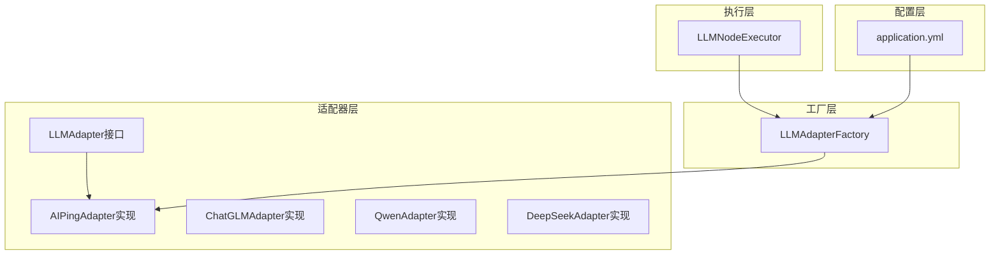
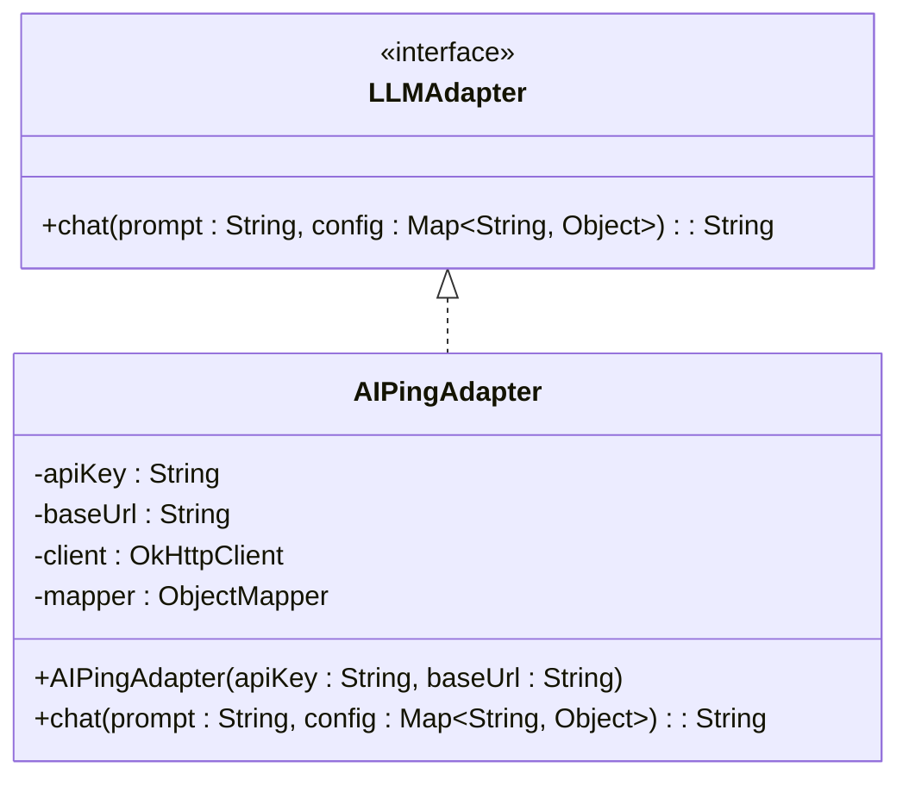
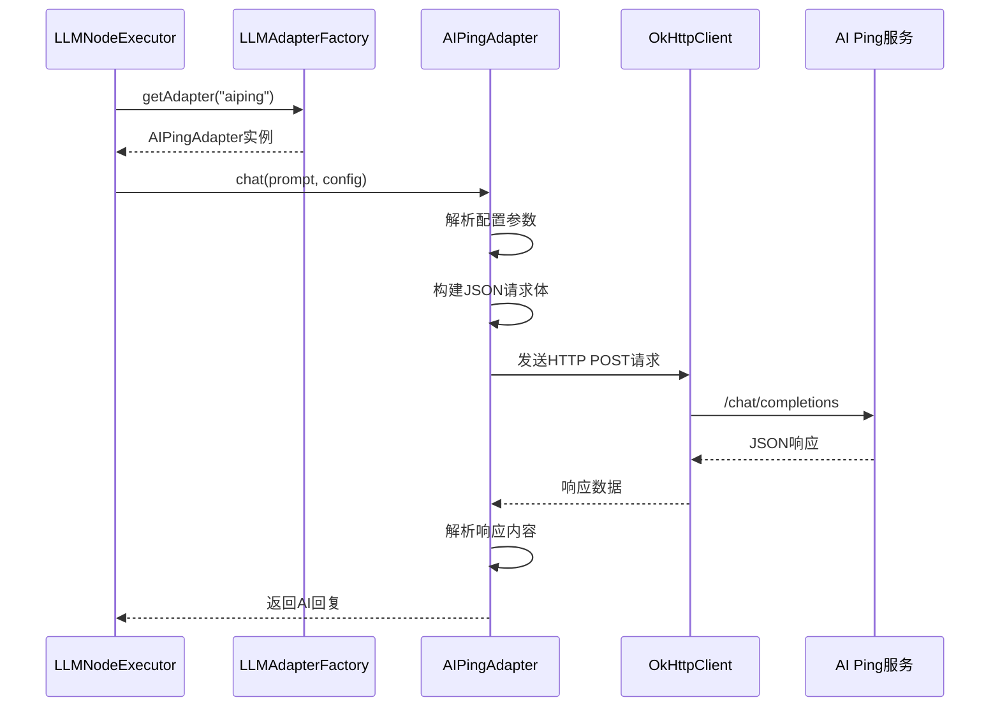
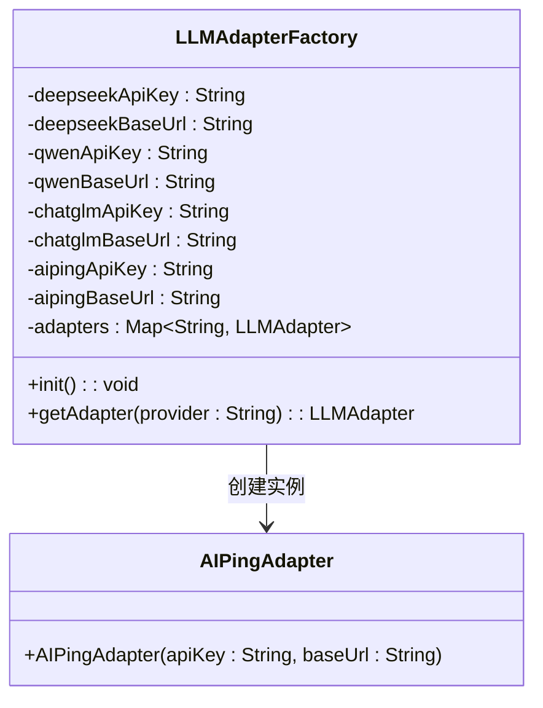
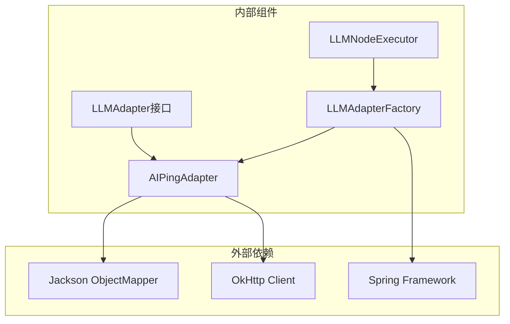

# AIPing适配器

<cite>
**本文档引用的文件**
- [AIPingAdapter.java](file://backend/src/main/java/com/paiagent/adapter/impl/AIPingAdapter.java)
- [LLMAdapter.java](file://backend/src/main/java/com/paiagent/adapter/LLMAdapter.java)
- [LLMAdapterFactory.java](file://backend/src/main/java/com/paiagent/adapter/LLMAdapterFactory.java)
- [LLMNodeExecutor.java](file://backend/src/main/java/com/paiagent/engine/executors/LLMNodeExecutor.java)
- [application.yml](file://backend/src/main/resources/application.yml)
</cite>

## 目录
1. [简介](#简介)
2. [项目结构](#项目结构)
3. [核心组件](#核心组件)
4. [架构概览](#架构概览)
5. [详细组件分析](#详细组件分析)
6. [依赖关系分析](#依赖关系分析)
7. [性能考虑](#性能考虑)
8. [故障排除指南](#故障排除指南)
9. [结论](#结论)

## 简介

AIPing适配器是PaiAgent项目中的一个LLM适配器实现，专门用于与AIPing服务进行交互。该适配器遵循OpenAI兼容的API格式，通过HTTP请求与外部AI服务通信，实现了统一的LLM接口规范。

AIPing适配器的主要特点：
- 实现了LLMAdapter接口，提供统一的聊天接口
- 遵循OpenAI兼容的API格式
- 使用OkHttp客户端进行HTTP通信
- 支持配置化的模型参数（temperature、max_tokens）
- 提供完整的错误处理机制

## 项目结构

PaiAgent项目采用分层架构设计，AIPing适配器位于适配器层，与业务逻辑层分离：



**图表来源**
- [AIPingAdapter.java:1-65](file://backend/src/main/java/com/paiagent/adapter/impl/AIPingAdapter.java#L1-L65)
- [LLMAdapterFactory.java:1-52](file://backend/src/main/java/com/paiagent/adapter/LLMAdapterFactory.java#L1-L52)
- [LLMNodeExecutor.java:1-48](file://backend/src/main/java/com/paiagent/engine/executors/LLMNodeExecutor.java#L1-L48)

**章节来源**
- [AIPingAdapter.java:1-65](file://backend/src/main/java/com/paiagent/adapter/impl/AIPingAdapter.java#L1-L65)
- [LLMAdapterFactory.java:1-52](file://backend/src/main/java/com/paiagent/adapter/LLMAdapterFactory.java#L1-L52)

## 核心组件

### LLMAdapter接口

LLMAdapter定义了所有LLM适配器必须实现的标准接口：



**图表来源**
- [LLMAdapter.java:8-16](file://backend/src/main/java/com/paiagent/adapter/LLMAdapter.java#L8-L16)
- [AIPingAdapter.java:14-28](file://backend/src/main/java/com/paiagent/adapter/impl/AIPingAdapter.java#L14-L28)

### AIPingAdapter实现

AIPingAdapter类实现了LLMAdapter接口，提供了具体的AI服务集成逻辑：

**章节来源**
- [AIPingAdapter.java:14-65](file://backend/src/main/java/com/paiagent/adapter/impl/AIPingAdapter.java#L14-L65)

## 架构概览

AIPing适配器在整个系统中的位置和交互关系：



**图表来源**
- [LLMNodeExecutor.java:35-41](file://backend/src/main/java/com/paiagent/engine/executors/LLMNodeExecutor.java#L35-L41)
- [LLMAdapterFactory.java:41-49](file://backend/src/main/java/com/paiagent/adapter/LLMAdapterFactory.java#L41-L49)
- [AIPingAdapter.java:31-63](file://backend/src/main/java/com/paiagent/adapter/impl/AIPingAdapter.java#L31-L63)

## 详细组件分析

### HTTP请求构建过程

AIPingAdapter在构建HTTP请求时遵循以下步骤：

#### 1. 基础URL验证
- 检查baseUrl是否为空或null
- 如果未配置则抛出运行时异常

#### 2. 参数映射
从配置映射中提取必要的参数：
- `model`: 模型名称，默认为空字符串
- `temperature`: 采样温度，默认0.7
- `maxTokens`: 最大生成tokens，默认2048

#### 3. 请求体构造
使用Jackson ObjectMapper将参数转换为JSON格式：
```json
{
  "model": "模型名称",
  "messages": [
    {
      "role": "user",
      "content": "用户提示词"
    }
  ],
  "temperature": 0.7,
  "max_tokens": 2048
}
```

#### 4. HTTP头部设置
- Authorization: Bearer + API密钥
- Content-Type: application/json

#### 5. 请求发送
通过OkHttp客户端发送POST请求到`baseUrl/chat/completions`

**章节来源**
- [AIPingAdapter.java:31-52](file://backend/src/main/java/com/paiagent/adapter/impl/AIPingAdapter.java#L31-L52)

### 响应解析流程

AIPingAdapter使用JSON路径表达式从响应中提取AI回复内容：

```mermaid
flowchart TD
Start([开始解析]) --> CheckStatus{HTTP状态检查}
CheckStatus --> |成功| ParseJSON[解析JSON响应]
CheckStatus --> |失败| ThrowError[抛出异常]
ParseJSON --> ExtractContent[提取choices[0].message.content]
ExtractContent --> ReturnResult[返回AI回复]
ThrowError --> End([结束])
ReturnResult --> End
```

**图表来源**
- [AIPingAdapter.java:54-62](file://backend/src/main/java/com/paiagent/adapter/impl/AIPingAdapter.java#L54-L62)

**章节来源**
- [AIPingAdapter.java:54-62](file://backend/src/main/java/com/paiagent/adapter/impl/AIPingAdapter.java#L54-L62)

### 配置管理

#### 应用程序配置
AIPing适配器的配置通过application.yml文件管理：

| 配置项 | 默认值 | 描述 |
|--------|--------|------|
| `llm.aiping.api-key` | 空字符串 | AIPing服务API密钥 |
| `llm.aiping.base-url` | 空字符串 | AIPing服务基础URL |

#### 工厂模式配置
LLMAdapterFactory负责管理所有LLM适配器实例：



**图表来源**
- [LLMAdapterFactory.java:14-41](file://backend/src/main/java/com/paiagent/adapter/LLMAdapterFactory.java#L14-L41)

**章节来源**
- [application.yml:32-34](file://backend/src/main/resources/application.yml#L32-L34)
- [LLMAdapterFactory.java:14-41](file://backend/src/main/java/com/paiagent/adapter/LLMAdapterFactory.java#L14-L41)

## 依赖关系分析

### 组件依赖图



**图表来源**
- [AIPingAdapter.java:3-6](file://backend/src/main/java/com/paiagent/adapter/impl/AIPingAdapter.java#L3-L6)
- [LLMAdapterFactory.java:3](file://backend/src/main/java/com/paiagent/adapter/LLMAdapterFactory.java#L3)

### 错误处理机制

AIPingAdapter实现了多层次的错误处理：

1. **配置验证**: 检查baseUrl是否正确配置
2. **HTTP状态检查**: 验证响应状态码
3. **异常包装**: 将底层异常包装为运行时异常
4. **资源清理**: 使用try-with-resources确保响应体正确关闭

**章节来源**
- [AIPingAdapter.java:32-34](file://backend/src/main/java/com/paiagent/adapter/impl/AIPingAdapter.java#L32-L34)
- [AIPingAdapter.java:55-58](file://backend/src/main/java/com/paiagent/adapter/impl/AIPingAdapter.java#L55-L58)

## 性能考虑

### OkHttp客户端配置

AIPingAdapter使用OkHttp客户端进行HTTP通信，配置了以下超时参数：

- **连接超时**: 30秒
- **读取超时**: 120秒

这些配置适用于AI服务的网络延迟和响应时间特性。

### 内存管理

- 使用Jackson ObjectMapper进行JSON序列化和反序列化
- 通过try-with-resources确保HTTP响应体正确释放
- 避免不必要的对象创建和内存泄漏

## 故障排除指南

### 常见问题及解决方案

#### 1. 基础URL配置错误
**症状**: 运行时抛出"AI Ping base URL not configured"异常
**解决方案**: 在application.yml中正确配置`llm.aiping.base-url`

#### 2. API密钥无效
**症状**: HTTP 401或403错误
**解决方案**: 验证`llm.aiping.api-key`配置是否正确

#### 3. 网络连接超时
**症状**: 连接超时或读取超时异常
**解决方案**: 检查网络连接，确认AI服务可用性

#### 4. JSON解析错误
**症状**: JSON树解析异常
**解决方案**: 检查AI服务响应格式是否符合预期

### 调试建议

1. **启用日志**: 在开发环境中启用详细的HTTP请求日志
2. **测试连接**: 使用curl命令测试直接的API调用
3. **检查响应**: 验证AI服务返回的JSON格式
4. **监控超时**: 观察网络延迟和响应时间

**章节来源**
- [AIPingAdapter.java:32-34](file://backend/src/main/java/com/paiagent/adapter/impl/AIPingAdapter.java#L32-L34)
- [AIPingAdapter.java:55-58](file://backend/src/main/java/com/paiagent/adapter/impl/AIPingAdapter.java#L55-L58)

## 结论

AIPing适配器是一个设计良好的LLM适配器实现，具有以下特点：

**优势**:
- 遵循OpenAI兼容的API格式，便于集成和扩展
- 使用工厂模式管理多个LLM提供商
- 实现了完整的错误处理和资源管理
- 配置灵活，支持环境变量注入

**适用场景**:
- 需要与AIPing服务集成的AI应用
- 多LLM提供商统一管理的系统
- 需要OpenAI兼容API格式的应用

**改进建议**:
- 添加重试机制以提高可靠性
- 实现更详细的日志记录
- 考虑添加请求缓存功能
- 增加更多的配置选项和自定义能力