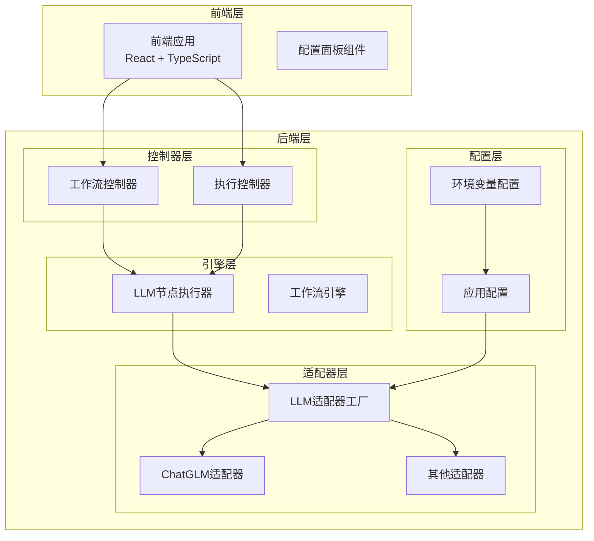
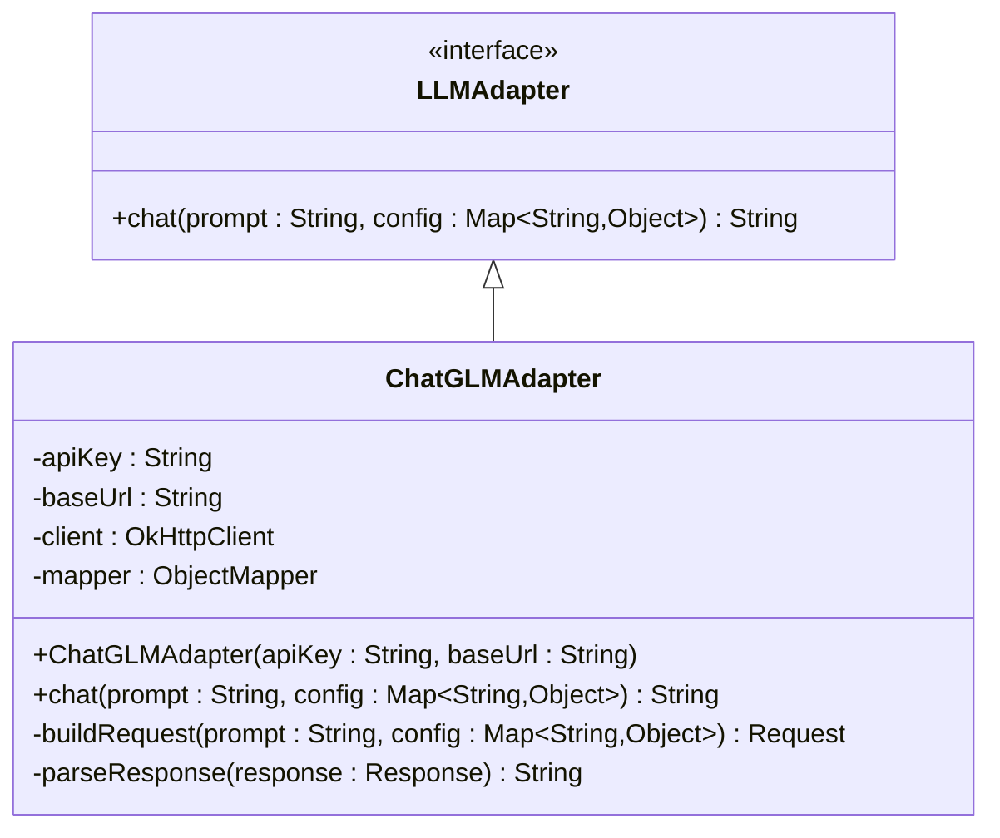
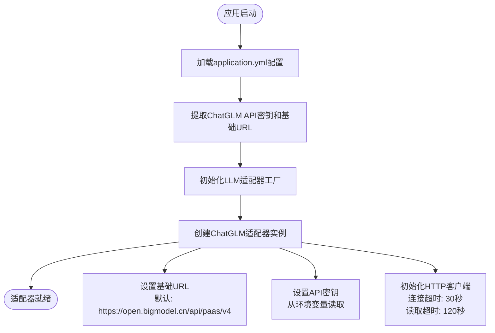
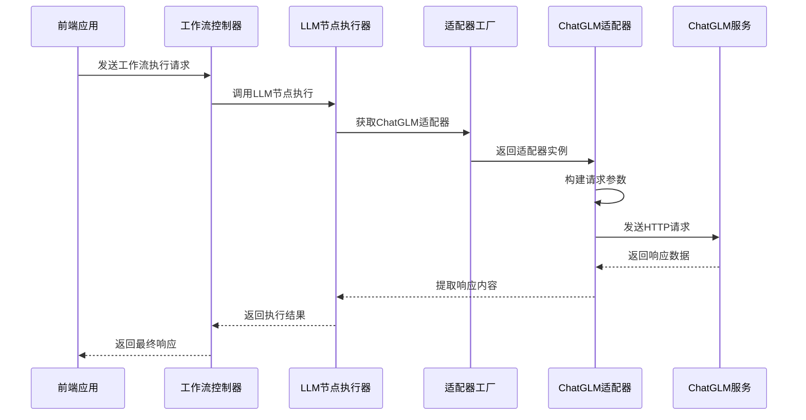
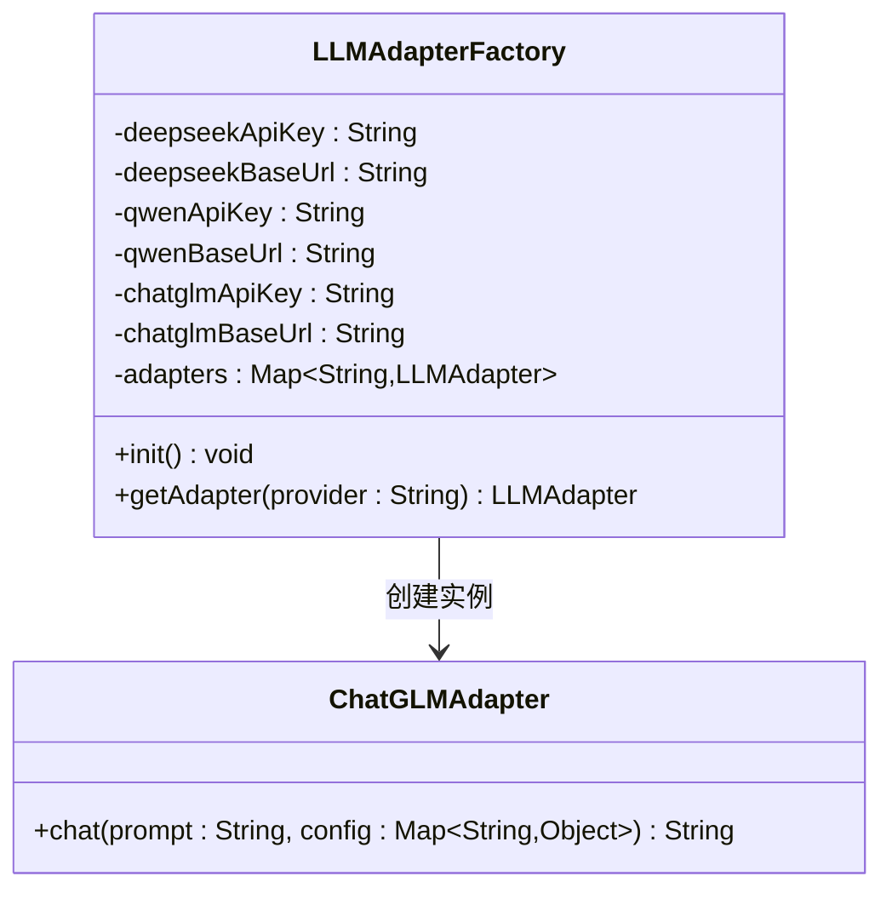
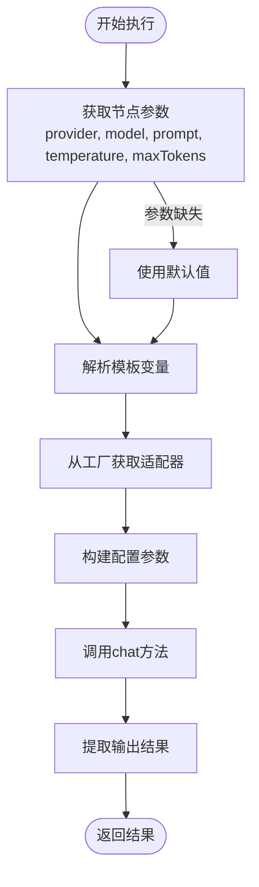
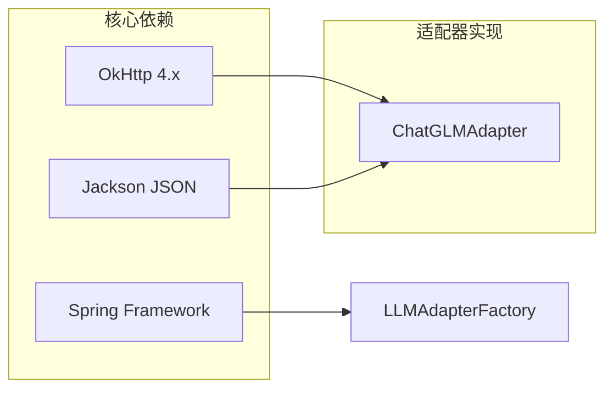
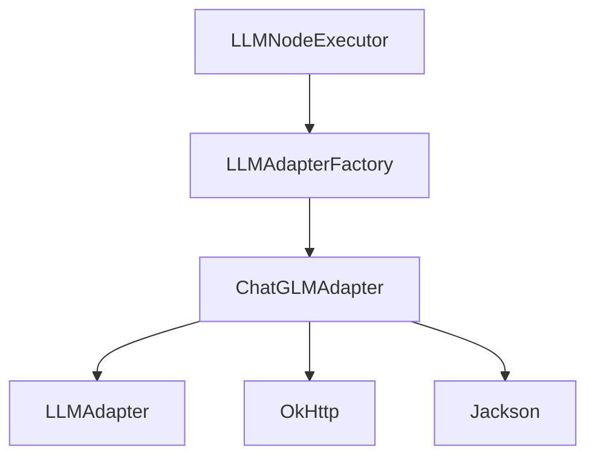
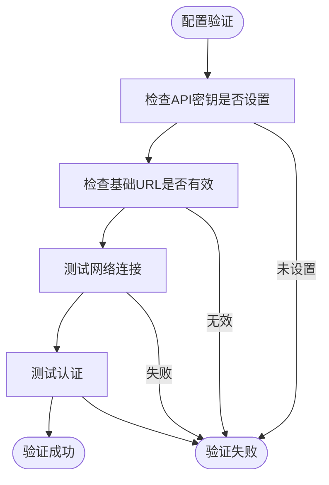

# ChatGLM适配器

<cite>
**本文档引用的文件**
- [ChatGLMAdapter.java](file://backend/src/main/java/com/paiagent/adapter/impl/ChatGLMAdapter.java)
- [LLMAdapter.java](file://backend/src/main/java/com/paiagent/adapter/LLMAdapter.java)
- [LLMAdapterFactory.java](file://backend/src/main/java/com/paiagent/adapter/LLMAdapterFactory.java)
- [LLMNodeExecutor.java](file://backend/src/main/java/com/paiagent/engine/executors/LLMNodeExecutor.java)
- [application.yml](file://backend/src/main/resources/application.yml)
- [ConfigPanel.tsx](file://frontend/src/components/ConfigPanel/ConfigPanel.tsx)
</cite>

## 目录
1. [简介](#简介)
2. [项目结构](#项目结构)
3. [核心组件](#核心组件)
4. [架构概览](#架构概览)
5. [详细组件分析](#详细组件分析)
6. [依赖关系分析](#依赖关系分析)
7. [性能考虑](#性能考虑)
8. [故障排除指南](#故障排除指南)
9. [结论](#结论)
10. [附录](#附录)

## 简介

ChatGLM适配器是PaiAgent系统中的一个关键组件，负责与ChatGLM（智谱AI）大语言模型服务进行集成。该适配器实现了统一的LLM接口，提供了OpenAI兼容的API格式，支持通过HTTP请求与ChatGLM服务进行交互。

ChatGLM适配器的主要功能包括：
- HTTP请求构建和发送
- 请求头配置（包含认证信息）
- 请求体格式化（JSON格式）
- 响应数据解析和提取
- 错误处理和异常管理
- 配置参数管理和默认值设置

## 项目结构

PaiAgent项目采用分层架构设计，ChatGLM适配器位于适配器层，与业务逻辑层和控制器层分离，确保了良好的可维护性和扩展性。

**图表来源**
- [LLMAdapterFactory.java:36-42](file://backend/src/main/java/com/paiagent/adapter/LLMAdapterFactory.java#L36-L42)
- [LLMNodeExecutor.java:35-41](file://backend/src/main/java/com/paiagent/engine/executors/LLMNodeExecutor.java#L35-L41)

**章节来源**
- [application.yml:21-34](file://backend/src/main/resources/application.yml#L21-L34)
- [LLMAdapterFactory.java:11-51](file://backend/src/main/java/com/paiagent/adapter/LLMAdapterFactory.java#L11-L51)

## 核心组件

### ChatGLM适配器接口

ChatGLM适配器实现了统一的LLM接口，提供了标准化的聊天功能：

**图表来源**
- [LLMAdapter.java:8-16](file://backend/src/main/java/com/paiagent/adapter/LLMAdapter.java#L8-L16)
- [ChatGLMAdapter.java:14-28](file://backend/src/main/java/com/paiagent/adapter/impl/ChatGLMAdapter.java#L14-L28)

### 配置管理系统

系统通过Spring框架的配置注入机制管理ChatGLM适配器的配置：

**图表来源**
- [application.yml:29-31](file://backend/src/main/resources/application.yml#L29-L31)
- [LLMAdapterFactory.java:24-27](file://backend/src/main/java/com/paiagent/adapter/LLMAdapterFactory.java#L24-L27)
- [ChatGLMAdapter.java:21-28](file://backend/src/main/java/com/paiagent/adapter/impl/ChatGLMAdapter.java#L21-L28)

**章节来源**
- [LLMAdapter.java:1-17](file://backend/src/main/java/com/paiagent/adapter/LLMAdapter.java#L1-L17)
- [ChatGLMAdapter.java:14-60](file://backend/src/main/java/com/paiagent/adapter/impl/ChatGLMAdapter.java#L14-L60)

## 架构概览

ChatGLM适配器在整个系统架构中扮演着关键的数据传输角色，负责将用户请求转换为ChatGLM服务可理解的格式，并将服务响应转换为系统内部使用的标准格式。

**图表来源**
- [LLMNodeExecutor.java:35-41](file://backend/src/main/java/com/paiagent/engine/executors/LLMNodeExecutor.java#L35-L41)
- [LLMAdapterFactory.java:44-49](file://backend/src/main/java/com/paiagent/adapter/LLMAdapterFactory.java#L44-L49)
- [ChatGLMAdapter.java:50-58](file://backend/src/main/java/com/paiagent/adapter/impl/ChatGLMAdapter.java#L50-L58)

## 详细组件分析

### ChatGLM适配器实现

ChatGLM适配器的核心实现包含了完整的HTTP请求构建和响应处理逻辑：

#### HTTP请求构建过程

适配器在构建HTTP请求时遵循以下步骤：

1. **URL构建**：将基础URL与"/chat/completions"路径组合
2. **头部配置**：
   - Authorization: Bearer + API密钥
   - Content-Type: application/json
3. **请求体格式化**：使用JSON格式包含模型参数、消息内容和生成参数

#### 参数映射和验证

适配器对输入参数进行了智能的类型转换和默认值处理：

| 参数名称 | 类型 | 默认值 | 作用 |
|---------|------|--------|------|
| model | String | "glm-4-flash" | 指定使用的ChatGLM模型 |
| temperature | Number | 0.7 | 控制生成文本的随机性 |
| maxTokens | Number | 2048 | 限制生成文本的最大长度 |

#### 响应数据提取

适配器使用JSONPath表达式从响应中提取生成的文本内容：
- 路径：/choices/0/message/content
- 解析：使用Jackson库进行JSON树解析

**章节来源**
- [ChatGLMAdapter.java:30-59](file://backend/src/main/java/com/paiagent/adapter/impl/ChatGLMAdapter.java#L30-L59)

### LLM适配器工厂

适配器工厂负责管理所有LLM适配器实例的生命周期：

**图表来源**
- [LLMAdapterFactory.java:12-51](file://backend/src/main/java/com/paiagent/adapter/LLMAdapterFactory.java#L12-L51)

**章节来源**
- [LLMAdapterFactory.java:36-50](file://backend/src/main/java/com/paiagent/adapter/LLMAdapterFactory.java#L36-L50)

### LLM节点执行器

LLM节点执行器负责协调整个LLM调用流程：

**图表来源**
- [LLMNodeExecutor.java:21-46](file://backend/src/main/java/com/paiagent/engine/executors/LLMNodeExecutor.java#L21-L46)

**章节来源**
- [LLMNodeExecutor.java:22-46](file://backend/src/main/java/com/paiagent/engine/executors/LLMNodeExecutor.java#L22-L46)

## 依赖关系分析

### 外部依赖

ChatGLM适配器依赖于以下外部库和框架：

**图表来源**
- [ChatGLMAdapter.java:3-6](file://backend/src/main/java/com/paiagent/adapter/impl/ChatGLMAdapter.java#L3-L6)
- [LLMAdapterFactory.java:3](file://backend/src/main/java/com/paiagent/adapter/LLMAdapterFactory.java#L3)

### 内部依赖关系

**图表来源**
- [LLMNodeExecutor.java:15-19](file://backend/src/main/java/com/paiagent/engine/executors/LLMNodeExecutor.java#L15-L19)
- [LLMAdapterFactory.java:36-42](file://backend/src/main/java/com/paiagent/adapter/LLMAdapterFactory.java#L36-L42)

**章节来源**
- [ChatGLMAdapter.java:14-28](file://backend/src/main/java/com/paiagent/adapter/impl/ChatGLMAdapter.java#L14-L28)
- [LLMAdapterFactory.java:34-50](file://backend/src/main/java/com/paiagent/adapter/LLMAdapterFactory.java#L34-L50)

## 性能考虑

### 连接池和超时配置

ChatGLM适配器采用了合理的超时配置以平衡性能和稳定性：

- **连接超时**：30秒
- **读取超时**：120秒
- **连接池复用**：通过OkHttpClient实现连接复用

### 请求优化策略

1. **最小化请求体大小**：仅包含必要的参数
2. **及时释放资源**：使用try-with-resources确保响应体正确关闭
3. **错误快速失败**：对非成功状态码立即抛出异常

### 缓存和重试机制

当前实现未包含缓存和重试机制，建议在生产环境中考虑：
- 添加请求结果缓存
- 实现指数退避重试
- 添加熔断器模式

## 故障排除指南

### 常见错误类型

| 错误类型 | 可能原因 | 解决方案 |
|---------|---------|---------|
| 认证失败 | API密钥无效或过期 | 检查环境变量配置 |
| 网络超时 | 网络连接不稳定 | 检查网络连接和防火墙设置 |
| 请求格式错误 | JSON格式不正确 | 验证请求体结构 |
| 服务不可用 | ChatGLM服务维护 | 稍后重试或检查服务状态 |

### 调试技巧

1. **启用详细日志**：在开发环境中启用HTTP请求日志
2. **参数验证**：确保所有必需参数都已正确设置
3. **网络监控**：使用工具监控网络请求和响应时间
4. **错误追踪**：捕获并记录完整的异常堆栈信息

### 配置验证

**图表来源**
- [application.yml:29-31](file://backend/src/main/resources/application.yml#L29-L31)
- [ChatGLMAdapter.java:21-28](file://backend/src/main/java/com/paiagent/adapter/impl/ChatGLMAdapter.java#L21-L28)

**章节来源**
- [ChatGLMAdapter.java:50-54](file://backend/src/main/java/com/paiagent/adapter/impl/ChatGLMAdapter.java#L50-L54)

## 结论

ChatGLM适配器是一个设计良好、实现简洁的组件，它成功地将ChatGLM服务集成到PaiAgent系统中。适配器的主要优势包括：

1. **标准化接口**：通过统一的LLM接口简化了多供应商支持
2. **清晰的职责分离**：适配器专注于HTTP通信，业务逻辑由其他组件处理
3. **合理的错误处理**：提供了详细的错误信息和异常处理机制
4. **灵活的配置管理**：支持通过环境变量进行配置

未来可以考虑的改进方向：
- 添加请求重试和熔断机制
- 实现请求结果缓存
- 增加更详细的性能监控
- 支持更多的ChatGLM模型选项

## 附录

### API配置参数

| 参数名称 | 环境变量 | 默认值 | 描述 |
|---------|---------|--------|------|
| CHATGLM_API_KEY | CHATGLM_API_KEY | 空 | ChatGLM API密钥 |
| CHATGLM_BASE_URL | CHATGLM_BASE_URL | https://open.bigmodel.cn/api/paas/v4 | ChatGLM服务基础URL |

### 使用示例

前端配置示例：
- Provider选择：chatglm
- Model参数：glm-4-flash 或其他支持的模型
- Temperature范围：0.0-2.0
- MaxTokens范围：1-8192

后端调用示例：
- 通过LLMNodeExecutor调用
- 自动解析模板变量
- 统一的错误处理机制

**章节来源**
- [application.yml:29-31](file://backend/src/main/resources/application.yml#L29-L31)
- [ConfigPanel.tsx:40](file://frontend/src/components/ConfigPanel/ConfigPanel.tsx#L40)