# DeepSeek适配器

<cite>
**本文档引用的文件**
- [DeepSeekAdapter.java](file://backend/src/main/java/com/paiagent/adapter/impl/DeepSeekAdapter.java)
- [LLMAdapter.java](file://backend/src/main/java/com/paiagent/adapter/LLMAdapter.java)
- [LLMAdapterFactory.java](file://backend/src/main/java/com/paiagent/adapter/LLMAdapterFactory.java)
- [LLMNodeExecutor.java](file://backend/src/main/java/com/paiagent/engine/executors/LLMNodeExecutor.java)
- [ExecutionContext.java](file://backend/src/main/java/com/paiagent/engine/ExecutionContext.java)
- [application.yml](file://backend/src/main/resources/application.yml)
- [docker-compose.yml](file://docker-compose.yml)
- [GlobalExceptionHandler.java](file://backend/src/main/java/com/paiagent/exception/GlobalExceptionHandler.java)
</cite>

## 目录
1. [简介](#简介)
2. [项目结构](#项目结构)
3. [核心组件](#核心组件)
4. [架构概览](#架构概览)
5. [详细组件分析](#详细组件分析)
6. [依赖关系分析](#依赖关系分析)
7. [性能考虑](#性能考虑)
8. [故障排除指南](#故障排除指南)
9. [结论](#结论)
10. [附录](#附录)

## 简介

DeepSeek适配器是PaiAgent项目中的一个关键组件，负责与DeepSeek大语言模型服务进行集成。该项目是一个基于Spring Boot的低代码工作流引擎，支持多种大语言模型提供商，包括DeepSeek、通义千问、ChatGLM和AI Ping等。

DeepSeek适配器实现了统一的LLM接口，采用OpenAI兼容的API格式，提供了简洁而强大的HTTP请求处理机制。该适配器通过OkHttp客户端发送HTTP请求，使用Jackson进行JSON数据序列化和反序列化，并通过严格的错误处理机制确保系统的稳定性。

## 项目结构

PaiAgent项目采用分层架构设计，主要包含以下核心模块：

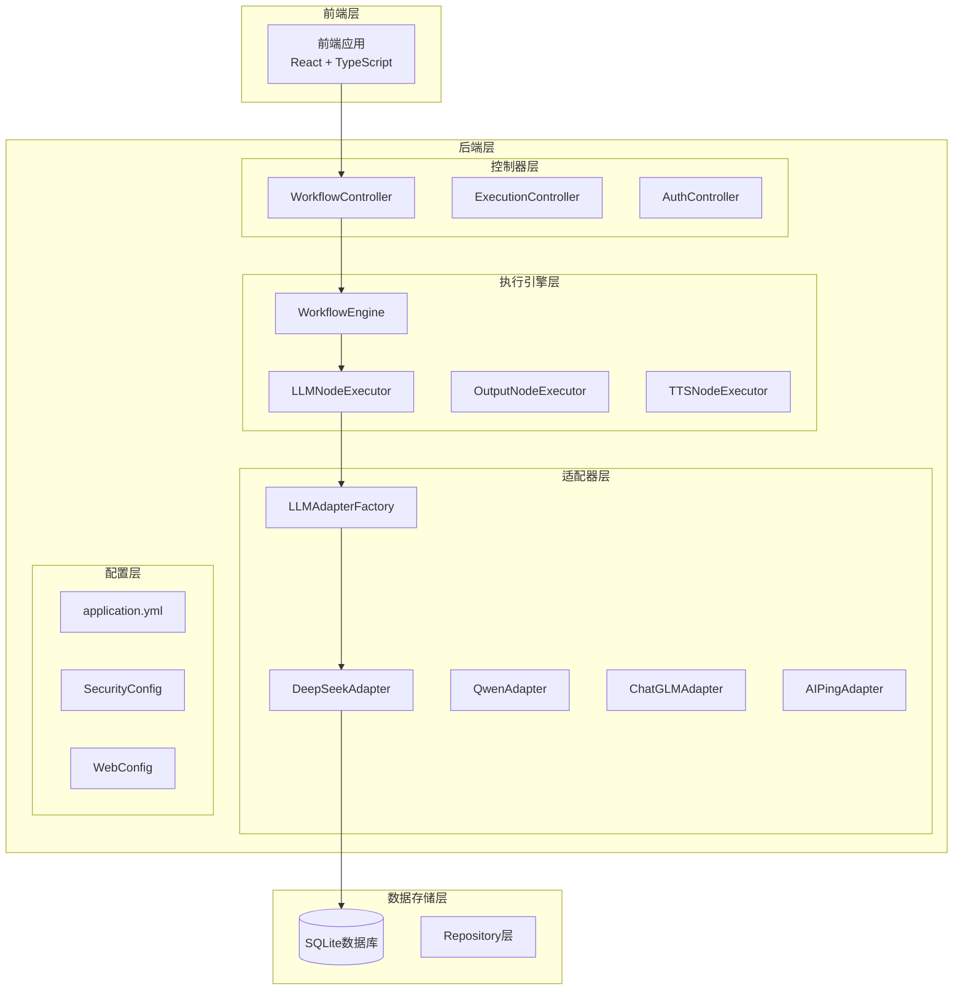

**图表来源**
- [application.yml:1-44](file://backend/src/main/resources/application.yml#L1-L44)
- [LLMAdapterFactory.java:1-52](file://backend/src/main/java/com/paiagent/adapter/LLMAdapterFactory.java#L1-L52)

**章节来源**
- [application.yml:1-44](file://backend/src/main/resources/application.yml#L1-L44)
- [docker-compose.yml:1-23](file://docker-compose.yml#L1-L23)

## 核心组件

### LLMAdapter接口

LLMAdapter定义了所有大语言模型适配器的统一接口规范：

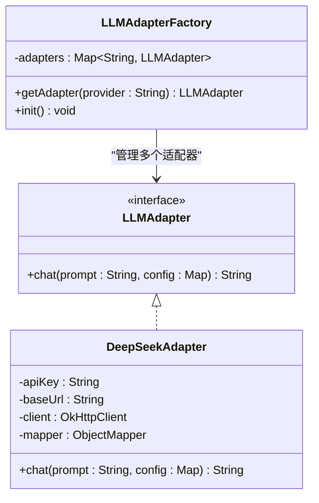

**图表来源**
- [LLMAdapter.java:1-17](file://backend/src/main/java/com/paiagent/adapter/LLMAdapter.java#L1-L17)
- [DeepSeekAdapter.java:14-60](file://backend/src/main/java/com/paiagent/adapter/impl/DeepSeekAdapter.java#L14-L60)
- [LLMAdapterFactory.java:12-51](file://backend/src/main/java/com/paiagent/adapter/LLMAdapterFactory.java#L12-L51)

### DeepSeekAdapter实现

DeepSeekAdapter是LLMAdapter接口的具体实现，提供了与DeepSeek服务交互的核心功能。该实现具有以下特点：

- **OpenAI兼容API**: 遵循OpenAI标准的API格式，便于与其他适配器保持一致性
- **配置驱动**: 通过application.yml配置文件进行参数配置
- **错误处理**: 实现了完善的错误处理机制
- **超时控制**: 设置了合理的连接和读取超时时间

**章节来源**
- [DeepSeekAdapter.java:11-60](file://backend/src/main/java/com/paiagent/adapter/impl/DeepSeekAdapter.java#L11-L60)

## 架构概览

DeepSeek适配器在整个系统架构中扮演着关键角色，作为外部服务集成的桥梁：

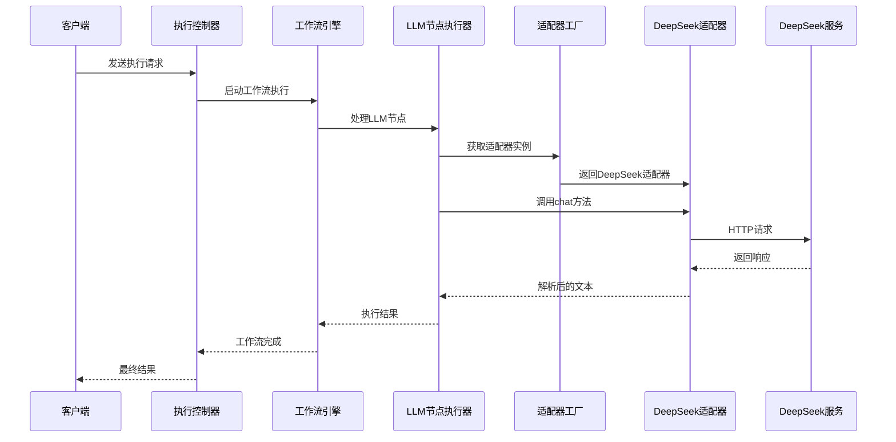

**图表来源**
- [LLMNodeExecutor.java:21-46](file://backend/src/main/java/com/paiagent/engine/executors/LLMNodeExecutor.java#L21-L46)
- [LLMAdapterFactory.java:36-42](file://backend/src/main/java/com/paiagent/adapter/LLMAdapterFactory.java#L36-L42)
- [DeepSeekAdapter.java:30-59](file://backend/src/main/java/com/paiagent/adapter/impl/DeepSeekAdapter.java#L30-L59)

## 详细组件分析

### DeepSeekAdapter类分析

DeepSeekAdapter类实现了LLMAdapter接口，提供了与DeepSeek服务交互的完整功能：

#### 类结构和属性

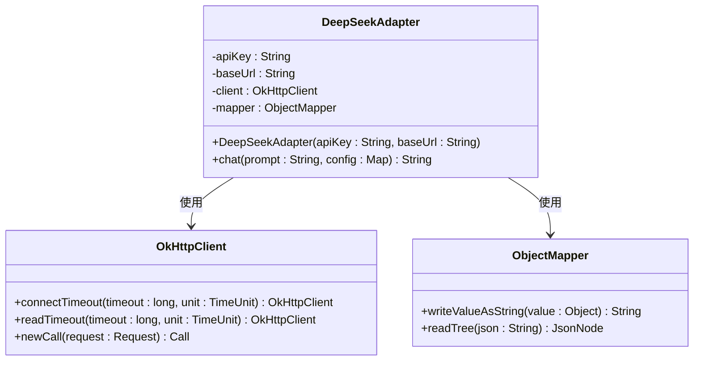

**图表来源**
- [DeepSeekAdapter.java:14-28](file://backend/src/main/java/com/paiagent/adapter/impl/DeepSeekAdapter.java#L14-L28)

#### HTTP请求处理流程

DeepSeekAdapter的HTTP请求处理遵循以下流程：

1. **配置验证**: 检查API密钥和基础URL的有效性
2. **请求体构建**: 使用Jackson将请求参数序列化为JSON格式
3. **头部设置**: 添加必要的HTTP头部信息
4. **超时配置**: 设置连接和读取超时时间
5. **请求发送**: 通过OkHttp客户端发送HTTP请求
6. **响应解析**: 解析JSON响应并提取所需内容

#### chat方法实现详解

chat方法是DeepSeekAdapter的核心功能，实现了完整的对话处理流程：

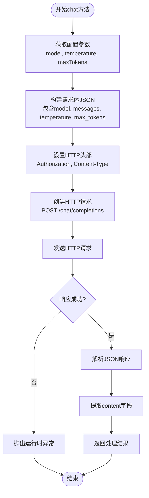

**图表来源**
- [DeepSeekAdapter.java:30-59](file://backend/src/main/java/com/paiagent/adapter/impl/DeepSeekAdapter.java#L30-L59)

#### 请求参数配置

DeepSeekAdapter支持以下配置参数：

| 参数名称 | 类型 | 默认值 | 描述 |
|---------|------|--------|------|
| model | String | "deepseek-chat" | 模型名称 |
| temperature | Number | 0.7 | 采样温度，控制随机性 |
| maxTokens | Number | 2048 | 最大生成tokens数量 |

#### 响应解析机制

DeepSeekAdapter使用Jackson库进行JSON响应解析，通过路径表达式提取所需的响应内容：

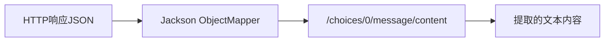

**图表来源**
- [DeepSeekAdapter.java:55-57](file://backend/src/main/java/com/paiagent/adapter/impl/DeepSeekAdapter.java#L55-L57)

**章节来源**
- [DeepSeekAdapter.java:30-59](file://backend/src/main/java/com/paiagent/adapter/impl/DeepSeekAdapter.java#L30-L59)

### LLMAdapterFactory集成

LLMAdapterFactory负责管理所有LLM适配器实例，为工作流引擎提供统一的适配器访问接口：

#### 适配器注册机制

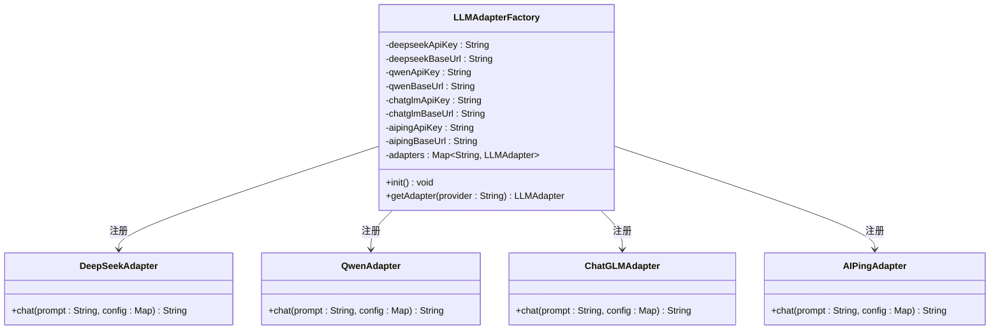

**图表来源**
- [LLMAdapterFactory.java:12-42](file://backend/src/main/java/com/paiagent/adapter/LLMAdapterFactory.java#L12-L42)

#### 配置注入机制

LLMAdapterFactory通过Spring框架的@Value注解从配置文件中注入API密钥和基础URL：

**章节来源**
- [LLMAdapterFactory.java:14-42](file://backend/src/main/java/com/paiagent/adapter/LLMAdapterFactory.java#L14-L42)

### LLMNodeExecutor集成

LLMNodeExecutor负责在工作流执行过程中调用相应的LLM适配器：

#### 执行流程

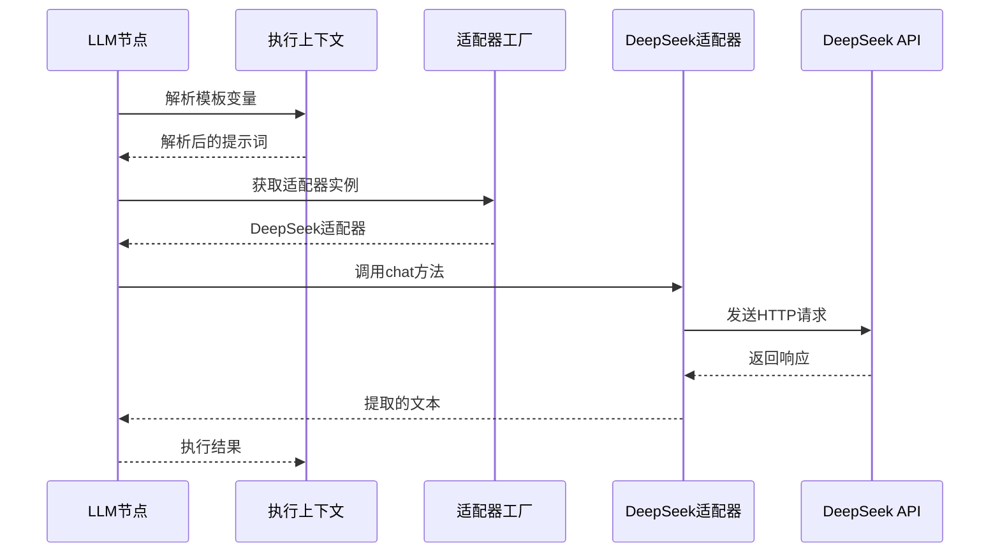

**图表来源**
- [LLMNodeExecutor.java:21-46](file://backend/src/main/java/com/paiagent/engine/executors/LLMNodeExecutor.java#L21-L46)

**章节来源**
- [LLMNodeExecutor.java:21-46](file://backend/src/main/java/com/paiagent/engine/executors/LLMNodeExecutor.java#L21-L46)

## 依赖关系分析

### 外部依赖

DeepSeek适配器依赖于以下外部库：

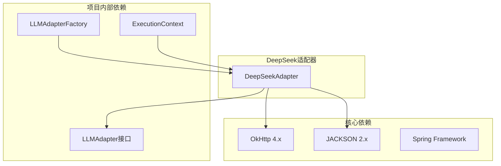

**图表来源**
- [DeepSeekAdapter.java:3-6](file://backend/src/main/java/com/paiagent/adapter/impl/DeepSeekAdapter.java#L3-L6)
- [LLMAdapterFactory.java:3](file://backend/src/main/java/com/paiagent/adapter/LLMAdapterFactory.java#L3)

### 内部耦合关系

DeepSeek适配器与项目其他组件的耦合关系相对松散，主要通过接口和工厂模式实现解耦：

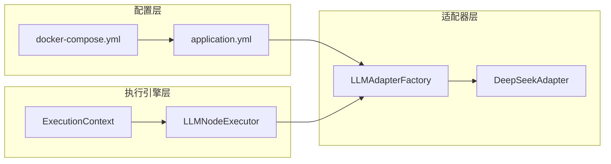

**图表来源**
- [application.yml:22-34](file://backend/src/main/resources/application.yml#L22-L34)
- [docker-compose.yml:17-22](file://docker-compose.yml#L17-L22)

**章节来源**
- [application.yml:22-34](file://backend/src/main/resources/application.yml#L22-L34)
- [docker-compose.yml:17-22](file://docker-compose.yml#L17-L22)

## 性能考虑

### 超时配置

DeepSeekAdapter设置了合理的超时配置以平衡性能和可靠性：

- **连接超时**: 30秒
- **读取超时**: 120秒

这些配置适用于大多数场景，但可能需要根据网络环境和具体需求进行调整。

### 连接池管理

OkHttp客户端默认使用连接池管理，可以有效复用HTTP连接，减少连接建立开销。

### JSON处理优化

使用Jackson库进行JSON序列化和反序列化，具有较好的性能表现和内存效率。

## 故障排除指南

### 常见错误类型

#### API密钥错误

当API密钥无效或过期时，DeepSeek服务会返回相应的错误响应。DeepSeekAdapter会捕获这些错误并抛出运行时异常。

#### 网络连接问题

网络不稳定或超时可能导致请求失败。建议检查网络连接状态和防火墙设置。

#### 配置错误

错误的配置参数（如无效的模型名称）可能导致API调用失败。

### 错误处理机制

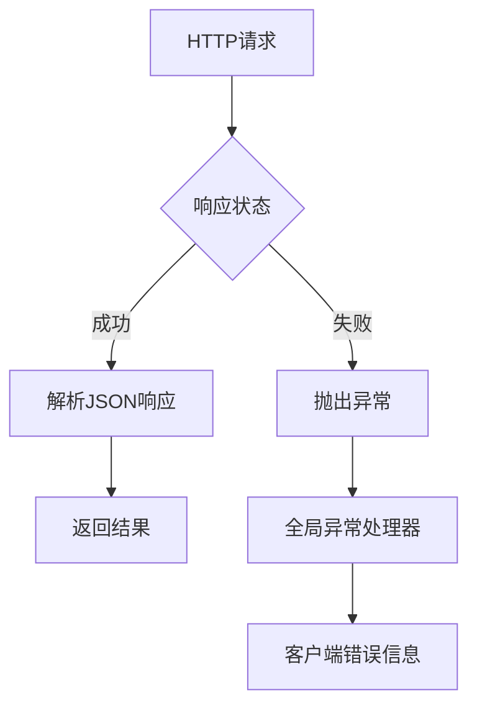

**图表来源**
- [DeepSeekAdapter.java:50-54](file://backend/src/main/java/com/paiagent/adapter/impl/DeepSeekAdapter.java#L50-L54)
- [GlobalExceptionHandler.java:12-28](file://backend/src/main/java/com/paiagent/exception/GlobalExceptionHandler.java#L12-L28)

### 调试建议

1. **启用日志**: 在开发环境中启用详细的日志记录
2. **检查配置**: 确认application.yml中的配置正确无误
3. **测试连接**: 使用curl命令测试直接的API调用
4. **监控超时**: 观察是否有频繁的超时错误

**章节来源**
- [GlobalExceptionHandler.java:12-28](file://backend/src/main/java/com/paiagent/exception/GlobalExceptionHandler.java#L12-L28)

## 结论

DeepSeek适配器作为PaiAgent项目的重要组成部分，成功实现了与DeepSeek大语言模型服务的集成。该适配器具有以下优势：

1. **标准化接口**: 通过LLMAdapter接口实现了统一的抽象
2. **OpenAI兼容**: 采用OpenAI标准的API格式，便于扩展其他兼容服务
3. **健壮性**: 实现了完善的错误处理和超时控制机制
4. **可配置性**: 通过配置文件灵活管理API密钥和基础URL
5. **可扩展性**: 支持通过工厂模式轻松添加新的LLM提供商

该适配器为整个工作流引擎提供了可靠的大语言模型服务能力，是实现复杂业务逻辑的重要基础设施。

## 附录

### 配置示例

#### application.yml配置

```yaml
llm:
  deepseek:
    api-key: ${DEEPSEEK_API_KEY:your-api-key-here}
    base-url: https://api.deepseek.com/v1
```

#### docker-compose环境变量

```yaml
environment:
  - DEEPSEEK_API_KEY=${DEEPSEEK_API_KEY}
```

### 使用示例

#### 基本使用

```java
// 通过工厂获取适配器实例
LLMAdapter adapter = adapterFactory.getAdapter("deepseek");

// 调用chat方法
String response = adapter.chat("你好，DeepSeek！", Map.of(
    "model", "deepseek-chat",
    "temperature", 0.7,
    "maxTokens", 2048
));
```

#### 在工作流中使用

```java
// LLM节点配置
{
  "provider": "deepseek",
  "model": "deepseek-chat",
  "prompt": "请帮我写一段关于{{node_1.output}}的描述",
  "temperature": 0.7,
  "maxTokens": 2048
}
```

### 最佳实践

1. **配置管理**: 将API密钥存储在环境变量中，避免硬编码
2. **错误处理**: 实现适当的重试机制和降级策略
3. **性能监控**: 监控API调用延迟和成功率
4. **安全考虑**: 确保API密钥的安全存储和传输
5. **版本兼容**: 关注DeepSeek API的版本更新和兼容性变化