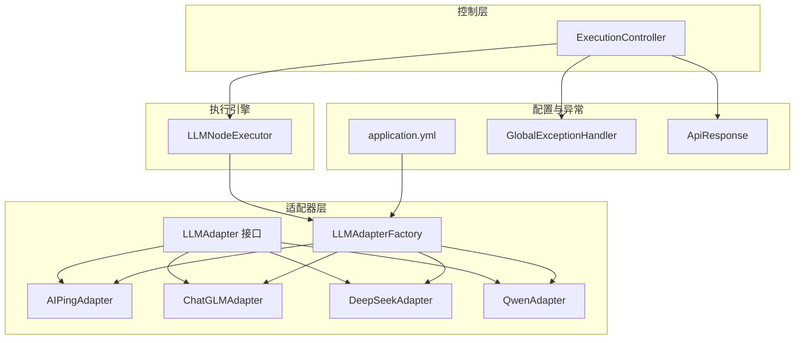
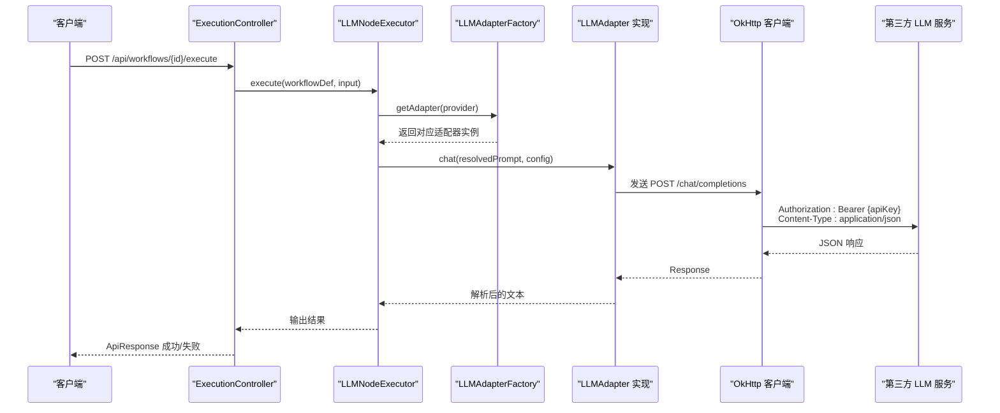
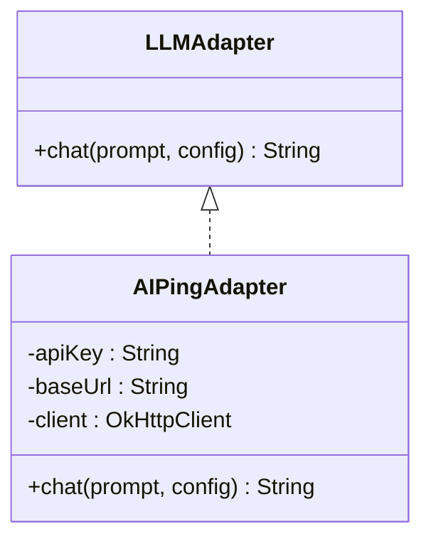
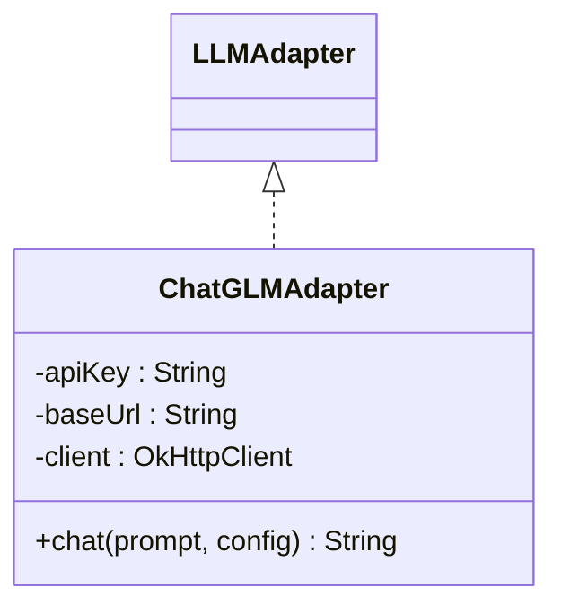
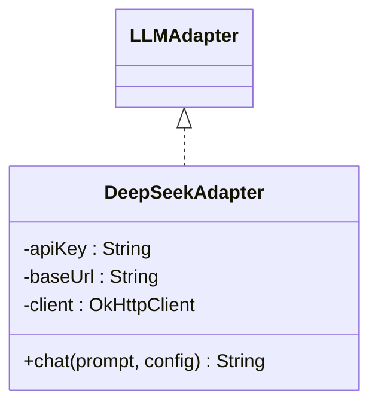
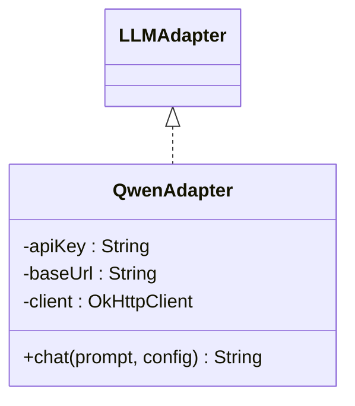
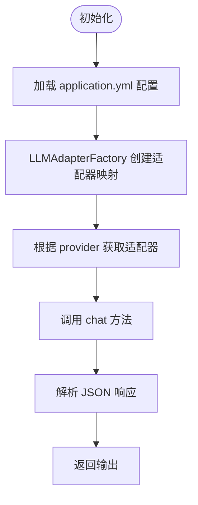
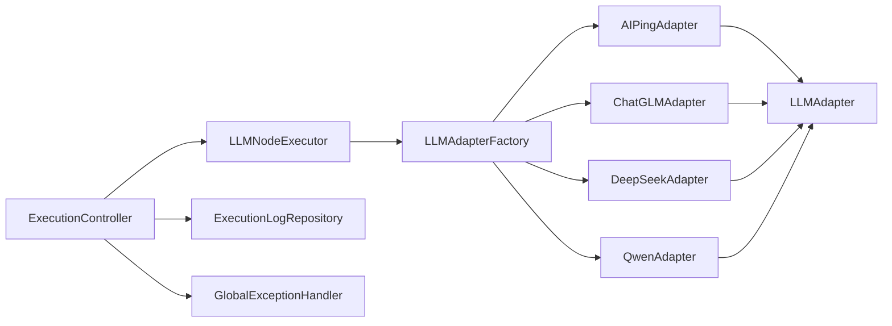

# 具体适配器实现

<cite>
**本文档引用的文件**
- [AIPingAdapter.java](file://backend/src/main/java/com/paiagent/adapter/impl/AIPingAdapter.java)
- [ChatGLMAdapter.java](file://backend/src/main/java/com/paiagent/adapter/impl/ChatGLMAdapter.java)
- [DeepSeekAdapter.java](file://backend/src/main/java/com/paiagent/adapter/impl/DeepSeekAdapter.java)
- [QwenAdapter.java](file://backend/src/main/java/com/paiagent/adapter/impl/QwenAdapter.java)
- [LLMAdapter.java](file://backend/src/main/java/com/paiagent/adapter/LLMAdapter.java)
- [LLMAdapterFactory.java](file://backend/src/main/java/com/paiagent/adapter/LLMAdapterFactory.java)
- [LLMNodeExecutor.java](file://backend/src/main/java/com/paiagent/engine/executors/LLMNodeExecutor.java)
- [application.yml](file://backend/src/main/resources/application.yml)
- [ExecutionController.java](file://backend/src/main/java/com/paiagent/controller/ExecutionController.java)
- [GlobalExceptionHandler.java](file://backend/src/main/java/com/paiagent/exception/GlobalExceptionHandler.java)
- [ApiResponse.java](file://backend/src/main/java/com/paiagent/model/dto/ApiResponse.java)
- [JwtTokenProvider.java](file://backend/src/main/java/com/paiagent/security/JwtTokenProvider.java)
</cite>

## 目录
1. [简介](#简介)
2. [项目结构](#项目结构)
3. [核心组件](#核心组件)
4. [架构总览](#架构总览)
5. [详细组件分析](#详细组件分析)
6. [依赖关系分析](#依赖关系分析)
7. [性能考虑](#性能考虑)
8. [故障排除指南](#故障排除指南)
9. [结论](#结论)
10. [附录](#附录)

## 简介
本文件针对四个具体的大模型（LLM）适配器进行深入技术分析，包括 AIPingAdapter、ChatGLMAdapter、DeepSeekAdapter 和 QwenAdapter。内容涵盖：
- 各适配器的统一接口设计与实现差异
- HTTP 请求构建、参数映射与响应解析流程
- 配置参数、认证机制与 API 密钥管理策略
- 不同 AI 服务提供商的 API 特点、限制与优化建议
- 错误处理策略、重试机制与超时配置
- 实际代码示例路径、配置模板与调试技巧

## 项目结构
后端采用 Spring Boot 架构，适配器位于 adapter 模块，通过工厂模式按提供商动态注入；执行引擎在 engine 模块中，LLM 节点执行器负责调用适配器并返回结果；控制器层负责接收外部请求并记录执行日志。

图表来源
- [LLMAdapter.java:1-17](file://backend/src/main/java/com/paiagent/adapter/LLMAdapter.java#L1-L17)
- [AIPingAdapter.java:1-65](file://backend/src/main/java/com/paiagent/adapter/impl/AIPingAdapter.java#L1-L65)
- [ChatGLMAdapter.java:1-61](file://backend/src/main/java/com/paiagent/adapter/impl/ChatGLMAdapter.java#L1-L61)
- [DeepSeekAdapter.java:1-61](file://backend/src/main/java/com/paiagent/adapter/impl/DeepSeekAdapter.java#L1-L61)
- [QwenAdapter.java:1-61](file://backend/src/main/java/com/paiagent/adapter/impl/QwenAdapter.java#L1-L61)
- [LLMAdapterFactory.java:1-52](file://backend/src/main/java/com/paiagent/adapter/LLMAdapterFactory.java#L1-L52)
- [LLMNodeExecutor.java:1-48](file://backend/src/main/java/com/paiagent/engine/executors/LLMNodeExecutor.java#L1-L48)
- [ExecutionController.java:1-93](file://backend/src/main/java/com/paiagent/controller/ExecutionController.java#L1-L93)
- [application.yml:1-44](file://backend/src/main/resources/application.yml#L1-L44)
- [GlobalExceptionHandler.java:1-30](file://backend/src/main/java/com/paiagent/exception/GlobalExceptionHandler.java#L1-L30)
- [ApiResponse.java:1-23](file://backend/src/main/java/com/paiagent/model/dto/ApiResponse.java#L1-L23)

章节来源
- [LLMAdapter.java:1-17](file://backend/src/main/java/com/paiagent/adapter/LLMAdapter.java#L1-L17)
- [LLMAdapterFactory.java:1-52](file://backend/src/main/java/com/paiagent/adapter/LLMAdapterFactory.java#L1-L52)
- [LLMNodeExecutor.java:1-48](file://backend/src/main/java/com/paiagent/engine/executors/LLMNodeExecutor.java#L1-L48)
- [ExecutionController.java:1-93](file://backend/src/main/java/com/paiagent/controller/ExecutionController.java#L1-L93)
- [application.yml:1-44](file://backend/src/main/resources/application.yml#L1-L44)

## 核心组件
- 统一接口 LLMAdapter：定义 chat 方法，接受用户提示词与配置参数，返回文本响应。
- 四个适配器：均实现 OpenAI 兼容的 /chat/completions 接口，使用 Bearer Token 认证，JSON 请求体，解析 choices[0].message.content 字段。
- 工厂类 LLMAdapterFactory：从 application.yml 中读取各提供商的 API Key 与 Base URL，按提供商名称创建对应适配器实例。
- 执行节点 LLMNodeExecutor：从工作流节点数据中解析 provider、model、prompt、temperature、maxTokens 等参数，调用适配器并返回结果。
- 控制层 ExecutionController：接收执行请求，调用工作流引擎，记录执行日志并返回 ApiResponse。

章节来源
- [LLMAdapter.java:1-17](file://backend/src/main/java/com/paiagent/adapter/LLMAdapter.java#L1-L17)
- [LLMAdapterFactory.java:1-52](file://backend/src/main/java/com/paiagent/adapter/LLMAdapterFactory.java#L1-L52)
- [LLMNodeExecutor.java:1-48](file://backend/src/main/java/com/paiagent/engine/executors/LLMNodeExecutor.java#L1-L48)
- [ExecutionController.java:1-93](file://backend/src/main/java/com/paiagent/controller/ExecutionController.java#L1-L93)
- [ApiResponse.java:1-23](file://backend/src/main/java/com/paiagent/model/dto/ApiResponse.java#L1-L23)

## 架构总览
下图展示从控制器到适配器的完整调用链路，以及配置注入与异常处理机制。

图表来源
- [ExecutionController.java:1-93](file://backend/src/main/java/com/paiagent/controller/ExecutionController.java#L1-L93)
- [LLMNodeExecutor.java:1-48](file://backend/src/main/java/com/paiagent/engine/executors/LLMNodeExecutor.java#L1-L48)
- [LLMAdapterFactory.java:1-52](file://backend/src/main/java/com/paiagent/adapter/LLMAdapterFactory.java#L1-L52)
- [AIPingAdapter.java:1-65](file://backend/src/main/java/com/paiagent/adapter/impl/AIPingAdapter.java#L1-L65)
- [ChatGLMAdapter.java:1-61](file://backend/src/main/java/com/paiagent/adapter/impl/ChatGLMAdapter.java#L1-L61)
- [DeepSeekAdapter.java:1-61](file://backend/src/main/java/com/paiagent/adapter/impl/DeepSeekAdapter.java#L1-L61)
- [QwenAdapter.java:1-61](file://backend/src/main/java/com/paiagent/adapter/impl/QwenAdapter.java#L1-L61)

## 详细组件分析

### AIPingAdapter 分析
- 实现目标：OpenAI 兼容 API 的适配器，支持自定义 base URL。
- 关键特性：
  - 必须显式提供 base URL，否则抛出运行时异常。
  - 默认模型为空字符串，温度默认 0.7，最大 tokens 默认 2048。
  - 使用 OkHttp 客户端，连接超时 30 秒，读取超时 120 秒。
  - 请求头包含 Authorization: Bearer {apiKey} 与 Content-Type: application/json。
  - 响应解析路径为 /choices/0/message/content。
- 参数映射：
  - model: 来自 config["model"]
  - messages: 单条用户消息，格式为 { role: "user", content: prompt }
  - temperature: 来自 config["temperature"]
  - max_tokens: 来自 config["maxTokens"]

图表来源
- [LLMAdapter.java:1-17](file://backend/src/main/java/com/paiagent/adapter/LLMAdapter.java#L1-L17)
- [AIPingAdapter.java:1-65](file://backend/src/main/java/com/paiagent/adapter/impl/AIPingAdapter.java#L1-L65)

章节来源
- [AIPingAdapter.java:1-65](file://backend/src/main/java/com/paiagent/adapter/impl/AIPingAdapter.java#L1-L65)

### ChatGLMAdapter 分析
- 实现目标：智谱清言（ChatGLM）OpenAI 兼容模式适配器。
- 关键特性：
  - 若未提供 base URL，则默认使用官方 PAAS v4 地址。
  - 默认模型为 glm-4-flash，其余参数行为与 OpenAI 兼容一致。
- 参数映射与请求构建与 AIPingAdapter 类似，仅默认模型不同。

图表来源
- [LLMAdapter.java:1-17](file://backend/src/main/java/com/paiagent/adapter/LLMAdapter.java#L1-L17)
- [ChatGLMAdapter.java:1-61](file://backend/src/main/java/com/paiagent/adapter/impl/ChatGLMAdapter.java#L1-L61)

章节来源
- [ChatGLMAdapter.java:1-61](file://backend/src/main/java/com/paiagent/adapter/impl/ChatGLMAdapter.java#L1-L61)

### DeepSeekAdapter 分析
- 实现目标：DeepSeek OpenAI 兼容模式适配器。
- 关键特性：
  - 若未提供 base URL，则默认使用 https://api.deepseek.com/v1。
  - 默认模型为 deepseek-chat，其余参数行为与 OpenAI 兼容一致。
- 参数映射与请求构建与 AIPingAdapter 类似，仅默认模型不同。

图表来源
- [LLMAdapter.java:1-17](file://backend/src/main/java/com/paiagent/adapter/LLMAdapter.java#L1-L17)
- [DeepSeekAdapter.java:1-61](file://backend/src/main/java/com/paiagent/adapter/impl/DeepSeekAdapter.java#L1-L61)

章节来源
- [DeepSeekAdapter.java:1-61](file://backend/src/main/java/com/paiagent/adapter/impl/DeepSeekAdapter.java#L1-L61)

### QwenAdapter 分析
- 实现目标：通义千问（DashScope）OpenAI 兼容模式适配器。
- 关键特性：
  - 若未提供 base URL，则默认使用 https://dashscope.aliyuncs.com/compatible-mode/v1。
  - 默认模型为 qwen-turbo，其余参数行为与 OpenAI 兼容一致。
- 参数映射与请求构建与 AIPingAdapter 类似，仅默认模型不同。

图表来源
- [LLMAdapter.java:1-17](file://backend/src/main/java/com/paiagent/adapter/LLMAdapter.java#L1-L17)
- [QwenAdapter.java:1-61](file://backend/src/main/java/com/paiagent/adapter/impl/QwenAdapter.java#L1-L61)

章节来源
- [QwenAdapter.java:1-61](file://backend/src/main/java/com/paiagent/adapter/impl/QwenAdapter.java#L1-L61)

### 统一接口与工厂模式
- LLMAdapter 接口定义了 chat 方法，确保各适配器对外行为一致。
- LLMAdapterFactory 通过 Spring 注入 application.yml 中的配置，按提供商名称创建适配器实例，并在未知提供商时抛出非法参数异常。
- LLMNodeExecutor 从工作流节点数据中解析 provider、model、prompt、temperature、maxTokens 等参数，调用适配器并返回结果。

图表来源
- [LLMAdapterFactory.java:1-52](file://backend/src/main/java/com/paiagent/adapter/LLMAdapterFactory.java#L1-L52)
- [LLMNodeExecutor.java:1-48](file://backend/src/main/java/com/paiagent/engine/executors/LLMNodeExecutor.java#L1-L48)
- [application.yml:1-44](file://backend/src/main/resources/application.yml#L1-L44)

章节来源
- [LLMAdapter.java:1-17](file://backend/src/main/java/com/paiagent/adapter/LLMAdapter.java#L1-L17)
- [LLMAdapterFactory.java:1-52](file://backend/src/main/java/com/paiagent/adapter/LLMAdapterFactory.java#L1-L52)
- [LLMNodeExecutor.java:1-48](file://backend/src/main/java/com/paiagent/engine/executors/LLMNodeExecutor.java#L1-L48)

## 依赖关系分析
- 适配器层依赖：
  - LLMAdapter 接口：统一方法签名。
  - OkHttp 客户端：用于 HTTP 请求。
  - Jackson ObjectMapper：用于 JSON 序列化与反序列化。
- 工厂层依赖：
  - Spring @Value 注解：从环境变量或 application.yml 注入配置。
- 执行层依赖：
  - LLMAdapterFactory：按提供商选择适配器。
  - ExecutionContext：用于解析模板变量。
- 控制层依赖：
  - WorkflowEngine：执行工作流定义。
  - ExecutionLogRepository：持久化执行日志。
  - GlobalExceptionHandler：统一异常处理。

图表来源
- [LLMAdapter.java:1-17](file://backend/src/main/java/com/paiagent/adapter/LLMAdapter.java#L1-L17)
- [AIPingAdapter.java:1-65](file://backend/src/main/java/com/paiagent/adapter/impl/AIPingAdapter.java#L1-L65)
- [ChatGLMAdapter.java:1-61](file://backend/src/main/java/com/paiagent/adapter/impl/ChatGLMAdapter.java#L1-L61)
- [DeepSeekAdapter.java:1-61](file://backend/src/main/java/com/paiagent/adapter/impl/DeepSeekAdapter.java#L1-L61)
- [QwenAdapter.java:1-61](file://backend/src/main/java/com/paiagent/adapter/impl/QwenAdapter.java#L1-L61)
- [LLMAdapterFactory.java:1-52](file://backend/src/main/java/com/paiagent/adapter/LLMAdapterFactory.java#L1-L52)
- [LLMNodeExecutor.java:1-48](file://backend/src/main/java/com/paiagent/engine/executors/LLMNodeExecutor.java#L1-L48)
- [ExecutionController.java:1-93](file://backend/src/main/java/com/paiagent/controller/ExecutionController.java#L1-L93)

章节来源
- [LLMAdapterFactory.java:1-52](file://backend/src/main/java/com/paiagent/adapter/LLMAdapterFactory.java#L1-L52)
- [LLMNodeExecutor.java:1-48](file://backend/src/main/java/com/paiagent/engine/executors/LLMNodeExecutor.java#L1-L48)
- [ExecutionController.java:1-93](file://backend/src/main/java/com/paiagent/controller/ExecutionController.java#L1-L93)

## 性能考虑
- 超时设置：
  - 连接超时：30 秒
  - 读取超时：120 秒
  - 适用于长上下文与大模型推理场景，避免长时间阻塞。
- 并发与线程：
  - OkHttp 客户端默认多线程并发，适合高并发请求。
- 建议优化：
  - 对于高延迟网络，可适当增加读取超时。
  - 在生产环境启用连接池复用，减少握手开销。
  - 对于高频调用，可在适配器层引入指数退避重试与熔断策略（当前未实现，建议扩展）。

[本节为通用性能讨论，不直接分析具体文件]

## 故障排除指南
- 常见错误类型与处理：
  - 未知提供商：工厂类在找不到适配器时抛出非法参数异常，控制器捕获并返回 400。
  - API 调用失败：适配器在 HTTP 非成功状态时抛出运行时异常，控制器捕获并返回 500。
  - 基础配置缺失：AIPingAdapter 在未配置 base URL 时抛出运行时异常。
- 日志与追踪：
  - 控制器在执行成功与失败时分别记录执行日志，包含输入、输出、状态、耗时等信息。
- 调试技巧：
  - 开启 Spring SQL 日志以观察数据库交互（当前已关闭 show-sql）。
  - 使用 curl 或 Postman 直接调用 /api/workflows/{id}/execute，检查 ApiResponse 结构。
  - 在 application.yml 中临时打印敏感配置（不建议长期保留），确认 API Key 与 Base URL 是否正确注入。

章节来源
- [GlobalExceptionHandler.java:1-30](file://backend/src/main/java/com/paiagent/exception/GlobalExceptionHandler.java#L1-L30)
- [ExecutionController.java:1-93](file://backend/src/main/java/com/paiagent/controller/ExecutionController.java#L1-L93)
- [AIPingAdapter.java:1-65](file://backend/src/main/java/com/paiagent/adapter/impl/AIPingAdapter.java#L1-L65)

## 结论
四个适配器均遵循 OpenAI 兼容模式，通过统一接口与工厂模式实现松耦合扩展。配置由 application.yml 提供，结合 Spring 注入实现零代码改动即可切换提供商。当前实现简洁可靠，建议后续在适配器层增加重试与熔断机制，以提升稳定性与鲁棒性。

[本节为总结性内容，不直接分析具体文件]

## 附录

### 配置模板与密钥管理
- application.yml 中的 llm 配置段落提供了各提供商的 API Key 与 Base URL 注入方式，支持环境变量覆盖。
- JWT 密钥与过期时间在配置文件中定义，用于身份认证与授权。

章节来源
- [application.yml:1-44](file://backend/src/main/resources/application.yml#L1-L44)
- [JwtTokenProvider.java:1-45](file://backend/src/main/java/com/paiagent/security/JwtTokenProvider.java#L1-L45)

### API 调用流程与参数映射
- 控制器接收执行请求，调用工作流引擎，引擎中的 LLM 节点执行器解析节点数据，调用适配器的 chat 方法。
- 适配器将配置参数映射为 OpenAI 兼容的 JSON 请求体，发送 HTTP 请求并解析响应。

章节来源
- [ExecutionController.java:1-93](file://backend/src/main/java/com/paiagent/controller/ExecutionController.java#L1-L93)
- [LLMNodeExecutor.java:1-48](file://backend/src/main/java/com/paiagent/engine/executors/LLMNodeExecutor.java#L1-L48)
- [AIPingAdapter.java:1-65](file://backend/src/main/java/com/paiagent/adapter/impl/AIPingAdapter.java#L1-L65)
- [ChatGLMAdapter.java:1-61](file://backend/src/main/java/com/paiagent/adapter/impl/ChatGLMAdapter.java#L1-L61)
- [DeepSeekAdapter.java:1-61](file://backend/src/main/java/com/paiagent/adapter/impl/DeepSeekAdapter.java#L1-L61)
- [QwenAdapter.java:1-61](file://backend/src/main/java/com/paiagent/adapter/impl/QwenAdapter.java#L1-L61)

### 错误处理与重试机制
- 当前实现：
  - 未知提供商：返回 400。
  - HTTP 非成功：返回 500。
  - AIPingAdapter：未配置 base URL 抛出异常。
- 建议扩展：
  - 引入指数退避重试与熔断器，降低瞬时故障影响。
  - 区分不同 HTTP 状态码进行差异化处理（如 401、403、429、5xx）。
  - 添加超时与连接池配置的可调参数。

章节来源
- [GlobalExceptionHandler.java:1-30](file://backend/src/main/java/com/paiagent/exception/GlobalExceptionHandler.java#L1-L30)
- [AIPingAdapter.java:1-65](file://backend/src/main/java/com/paiagent/adapter/impl/AIPingAdapter.java#L1-L65)