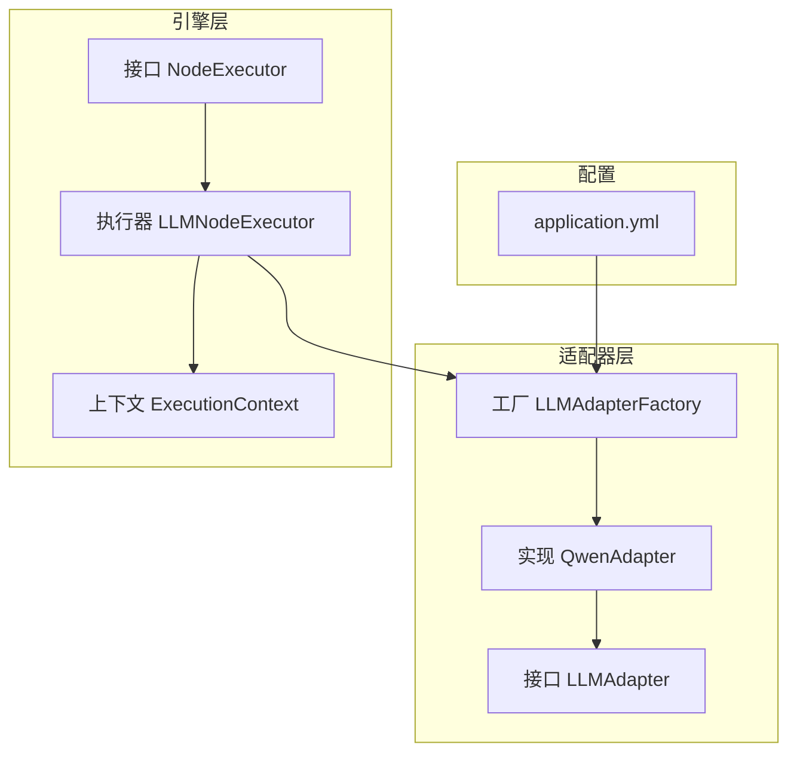
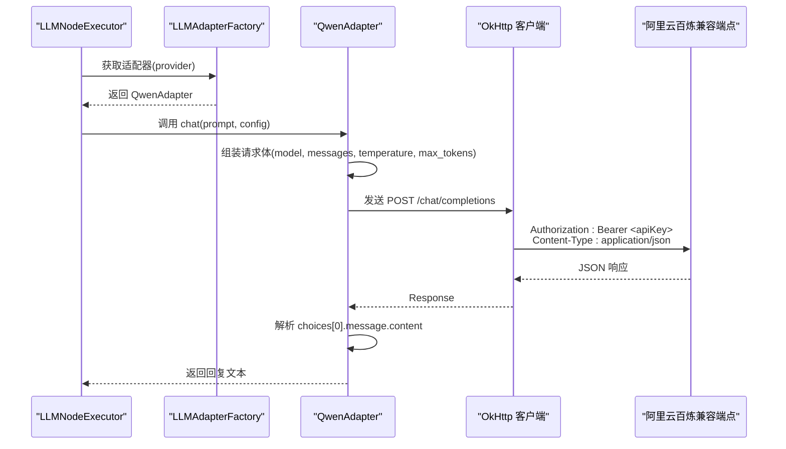
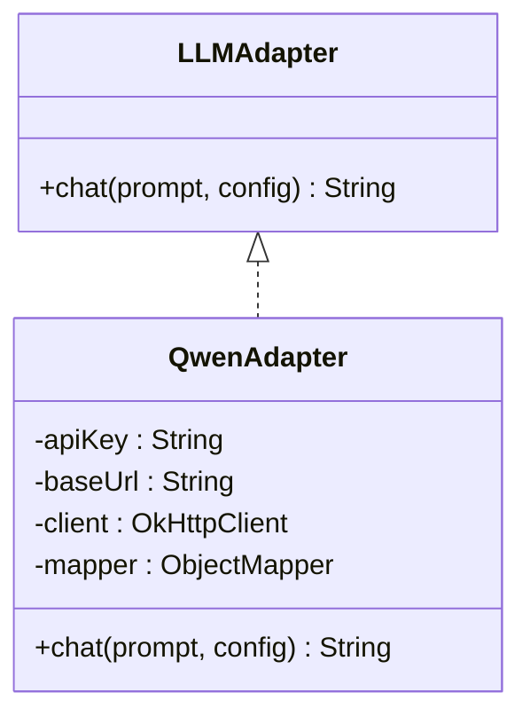
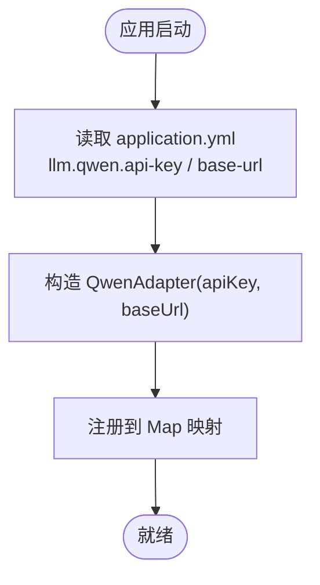
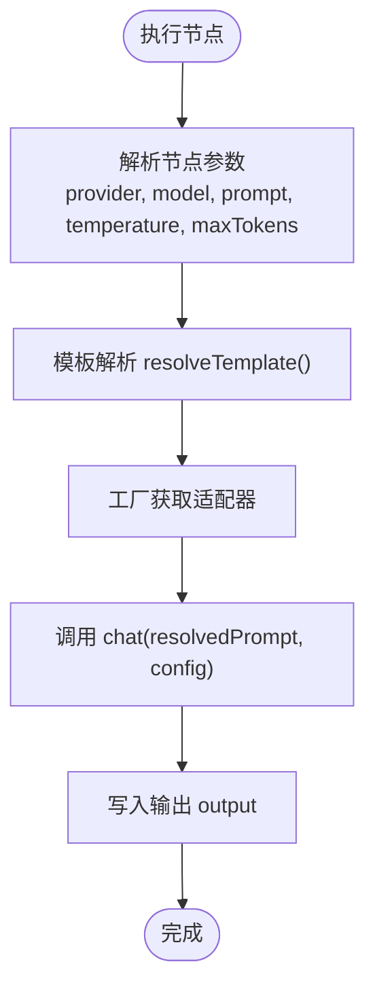
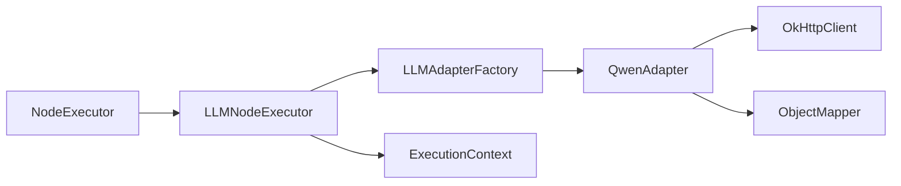

# 通义千问适配器

<cite>
**本文引用的文件**
- [QwenAdapter.java](file://backend/src/main/java/com/paiagent/adapter/impl/QwenAdapter.java)
- [LLMAdapter.java](file://backend/src/main/java/com/paiagent/adapter/LLMAdapter.java)
- [LLMAdapterFactory.java](file://backend/src/main/java/com/paiagent/adapter/LLMAdapterFactory.java)
- [application.yml](file://backend/src/main/resources/application.yml)
- [LLMNodeExecutor.java](file://backend/src/main/java/com/paiagent/engine/executors/LLMNodeExecutor.java)
- [ExecutionContext.java](file://backend/src/main/java/com/paiagent/engine/ExecutionContext.java)
- [NodeExecutor.java](file://backend/src/main/java/com/paiagent/engine/NodeExecutor.java)
</cite>

## 目录
1. [简介](#简介)
2. [项目结构](#项目结构)
3. [核心组件](#核心组件)
4. [架构总览](#架构总览)
5. [详细组件分析](#详细组件分析)
6. [依赖关系分析](#依赖关系分析)
7. [性能考虑](#性能考虑)
8. [故障排除指南](#故障排除指南)
9. [结论](#结论)
10. [附录](#附录)

## 简介
本文件面向通义千问（Qwen）适配器的技术文档，聚焦于以下目标：
- 深入解析 QwenAdapter 的实现细节与阿里云百炼平台兼容模式的集成方式
- 详述 HTTP 请求构建流程：认证方式、请求体格式、关键参数配置
- 阐明 chat 方法的执行逻辑：模型选择、温度参数、最大 token 限制
- 说明通义千问 API 的特点、模型选择策略与性能优化建议
- 提供集成示例、配置模板与故障排除指南

## 项目结构
后端采用 Spring Boot 架构，适配器层位于 adapter 子包，工作流引擎位于 engine 子包，配置集中于 application.yml。Qwen 适配器通过工厂模式统一管理多供应商适配器，并在工作流节点中被调用。

图表来源
- [LLMAdapterFactory.java:36-50](file://backend/src/main/java/com/paiagent/adapter/LLMAdapterFactory.java#L36-L50)
- [QwenAdapter.java:14](file://backend/src/main/java/com/paiagent/adapter/impl/QwenAdapter.java#L14)
- [LLMNodeExecutor.java:13](file://backend/src/main/java/com/paiagent/engine/executors/LLMNodeExecutor.java#L13)
- [application.yml:21-34](file://backend/src/main/resources/application.yml#L21-L34)

章节来源
- [LLMAdapterFactory.java:1-52](file://backend/src/main/java/com/paiagent/adapter/LLMAdapterFactory.java#L1-L52)
- [QwenAdapter.java:1-61](file://backend/src/main/java/com/paiagent/adapter/impl/QwenAdapter.java#L1-L61)
- [LLMNodeExecutor.java:1-48](file://backend/src/main/java/com/paiagent/engine/executors/LLMNodeExecutor.java#L1-L48)
- [application.yml:1-44](file://backend/src/main/resources/application.yml#L1-L44)

## 核心组件
- LLMAdapter 接口：定义统一的聊天接口，输入提示词与配置，输出文本结果。
- QwenAdapter 实现：基于 OkHttp 客户端，向阿里云百炼兼容模式端点发送请求，解析响应并返回模型回复。
- LLMAdapterFactory 工厂：从环境变量读取各供应商的 API Key 与 Base URL，按名称注册适配器实例。
- LLMNodeExecutor 执行器：从工作流节点数据中解析 provider、model、prompt、temperature、maxTokens 等参数，调用对应适配器执行聊天。

章节来源
- [LLMAdapter.java:8-16](file://backend/src/main/java/com/paiagent/adapter/LLMAdapter.java#L8-L16)
- [QwenAdapter.java:14-60](file://backend/src/main/java/com/paiagent/adapter/impl/QwenAdapter.java#L14-L60)
- [LLMAdapterFactory.java:12-50](file://backend/src/main/java/com/paiagent/adapter/LLMAdapterFactory.java#L12-L50)
- [LLMNodeExecutor.java:13-46](file://backend/src/main/java/com/paiagent/engine/executors/LLMNodeExecutor.java#L13-L46)

## 架构总览
Qwen 适配器通过 OpenAI 兼容模式对接阿里云百炼平台，请求路径为 /chat/completions，使用 Authorization: Bearer 方式携带 API Key。工厂负责按供应商名称选择适配器，执行器负责组装参数与模板解析。

图表来源
- [LLMNodeExecutor.java:22-41](file://backend/src/main/java/com/paiagent/engine/executors/LLMNodeExecutor.java#L22-L41)
- [LLMAdapterFactory.java:44-49](file://backend/src/main/java/com/paiagent/adapter/LLMAdapterFactory.java#L44-L49)
- [QwenAdapter.java:31-59](file://backend/src/main/java/com/paiagent/adapter/impl/QwenAdapter.java#L31-L59)

## 详细组件分析

### QwenAdapter 实现细节
- 认证方式：在请求头添加 Authorization: Bearer <apiKey>，符合 OpenAI 兼容模式要求。
- 请求端点：默认基础地址为 https://dashscope.aliyuncs.com/compatible-mode/v1，最终请求 /chat/completions。
- 请求体字段：
  - model：若为空则回退为 qwen-turbo
  - messages：单轮对话仅包含一条用户消息
  - temperature：采样温度，默认 0.7
  - max_tokens：最大生成长度，默认 2048
- 响应解析：使用 Jackson 读取 JSON，提取 /choices/0/message/content 作为回复文本。
- 错误处理：非成功状态码时抛出异常，包含 HTTP 状态码与响应体摘要。

图表来源
- [LLMAdapter.java:8-16](file://backend/src/main/java/com/paiagent/adapter/LLMAdapter.java#L8-L16)
- [QwenAdapter.java:14-60](file://backend/src/main/java/com/paiagent/adapter/impl/QwenAdapter.java#L14-L60)

章节来源
- [QwenAdapter.java:21-28](file://backend/src/main/java/com/paiagent/adapter/impl/QwenAdapter.java#L21-L28)
- [QwenAdapter.java:36-41](file://backend/src/main/java/com/paiagent/adapter/impl/QwenAdapter.java#L36-L41)
- [QwenAdapter.java:43-48](file://backend/src/main/java/com/paiagent/adapter/impl/QwenAdapter.java#L43-L48)
- [QwenAdapter.java:50-58](file://backend/src/main/java/com/paiagent/adapter/impl/QwenAdapter.java#L50-L58)

### LLMAdapterFactory 工厂
- 从 application.yml 中读取 llm.qwen.api-key 与 llm.qwen.base-url
- 在初始化阶段注册 "qwen" 对应的 QwenAdapter 实例
- 提供 getAdapter(provider) 方法，按名称返回适配器；未知供应商抛出异常

图表来源
- [LLMAdapterFactory.java:19-22](file://backend/src/main/java/com/paiagent/adapter/LLMAdapterFactory.java#L19-L22)
- [LLMAdapterFactory.java:36-42](file://backend/src/main/java/com/paiagent/adapter/LLMAdapterFactory.java#L36-L42)

章节来源
- [LLMAdapterFactory.java:12-50](file://backend/src/main/java/com/paiagent/adapter/LLMAdapterFactory.java#L12-L50)
- [application.yml:26-28](file://backend/src/main/resources/application.yml#L26-L28)

### LLMNodeExecutor 执行逻辑
- 从节点数据中解析 provider、model、prompt、temperature、maxTokens
- 使用 ExecutionContext.resolveTemplate 将模板字符串中的占位符替换为上游节点输出
- 通过工厂获取适配器并调用 chat，将返回值写入输出键 output

图表来源
- [LLMNodeExecutor.java:22-46](file://backend/src/main/java/com/paiagent/engine/executors/LLMNodeExecutor.java#L22-L46)
- [ExecutionContext.java:38-61](file://backend/src/main/java/com/paiagent/engine/ExecutionContext.java#L38-L61)

章节来源
- [LLMNodeExecutor.java:13-46](file://backend/src/main/java/com/paiagent/engine/executors/LLMNodeExecutor.java#L13-L46)
- [ExecutionContext.java:10-61](file://backend/src/main/java/com/paiagent/engine/ExecutionContext.java#L10-L61)

### 通义千问 API 特点与模型选择
- 兼容模式：QwenAdapter 使用 OpenAI 兼容的 /chat/completions 接口，便于统一接入。
- 默认模型：当未指定 model 时，默认使用 qwen-turbo。
- 参数范围：temperature 与 max_tokens 分别控制生成多样性与长度上限。
- 基础地址：默认 https://dashscope.aliyuncs.com/compatible-mode/v1，可通过配置覆盖。

章节来源
- [QwenAdapter.java:32-34](file://backend/src/main/java/com/paiagent/adapter/impl/QwenAdapter.java#L32-L34)
- [QwenAdapter.java:36-41](file://backend/src/main/java/com/paiagent/adapter/impl/QwenAdapter.java#L36-L41)
- [application.yml:28](file://backend/src/main/resources/application.yml#L28)

## 依赖关系分析
- QwenAdapter 依赖 OkHttp 与 Jackson 进行 HTTP 请求与 JSON 解析
- LLMAdapterFactory 依赖 Spring 注解注入 API Key 与 Base URL
- LLMNodeExecutor 依赖 LLMAdapterFactory 与 ExecutionContext
- NodeExecutor 为引擎层通用接口，LLMNodeExecutor 实现该接口

图表来源
- [LLMNodeExecutor.java:15-19](file://backend/src/main/java/com/paiagent/engine/executors/LLMNodeExecutor.java#L15-L19)
- [LLMAdapterFactory.java:36-42](file://backend/src/main/java/com/paiagent/adapter/LLMAdapterFactory.java#L36-L42)
- [QwenAdapter.java:16-19](file://backend/src/main/java/com/paiagent/adapter/impl/QwenAdapter.java#L16-L19)
- [NodeExecutor.java:8-16](file://backend/src/main/java/com/paiagent/engine/NodeExecutor.java#L8-L16)

章节来源
- [LLMNodeExecutor.java:1-48](file://backend/src/main/java/com/paiagent/engine/executors/LLMNodeExecutor.java#L1-L48)
- [LLMAdapterFactory.java:1-52](file://backend/src/main/java/com/paiagent/adapter/LLMAdapterFactory.java#L1-L52)
- [QwenAdapter.java:1-61](file://backend/src/main/java/com/paiagent/adapter/impl/QwenAdapter.java#L1-L61)
- [NodeExecutor.java:1-17](file://backend/src/main/java/com/paiagent/engine/NodeExecutor.java#L1-L17)

## 性能考虑
- 超时配置：连接超时 30 秒，读取超时 120 秒，适合长文本生成场景
- 请求体最小化：仅包含必要字段，减少网络开销
- 响应解析：使用流式或分块读取可进一步优化大响应处理（当前直接读取完整响应）
- 并发与重试：可在 OkHttp 层增加重试与连接池配置以提升稳定性

章节来源
- [QwenAdapter.java:24-27](file://backend/src/main/java/com/paiagent/adapter/impl/QwenAdapter.java#L24-L27)

## 故障排除指南
- 401 未授权：检查 llm.qwen.api-key 是否正确设置
- 404/405：确认 llm.qwen.base-url 与 /chat/completions 路径可用
- 4xx/5xx：查看异常信息中的状态码与响应体摘要，定位服务端错误
- 温度与长度：若生成质量不理想，尝试调整 temperature 与 max_tokens
- 模板变量：确保模板中引用的节点 ID 与输出键存在且已计算

章节来源
- [QwenAdapter.java:51-54](file://backend/src/main/java/com/paiagent/adapter/impl/QwenAdapter.java#L51-L54)
- [LLMNodeExecutor.java:32](file://backend/src/main/java/com/paiagent/engine/executors/LLMNodeExecutor.java#L32)
- [application.yml:26-28](file://backend/src/main/resources/application.yml#L26-L28)

## 结论
QwenAdapter 通过 OpenAI 兼容模式与阿里云百炼平台集成，具备清晰的参数映射与错误处理机制。结合工厂与执行器，实现了工作流中的统一调用入口。建议在生产环境中完善超时与重试策略，并根据业务需求选择合适的模型与参数组合。

## 附录

### 集成示例与配置模板
- 设置环境变量或 application.yml 中的 llm.qwen.api-key 与 llm.qwen.base-url
- 在工作流节点中指定 provider 为 "qwen"，并传入 model、temperature、maxTokens 等参数
- 使用模板语法 {{nodeId.output}} 引用上游节点输出

章节来源
- [application.yml:26-28](file://backend/src/main/resources/application.yml#L26-L28)
- [LLMNodeExecutor.java:23-29](file://backend/src/main/java/com/paiagent/engine/executors/LLMNodeExecutor.java#L23-L29)
- [ExecutionContext.java:38-61](file://backend/src/main/java/com/paiagent/engine/ExecutionContext.java#L38-L61)