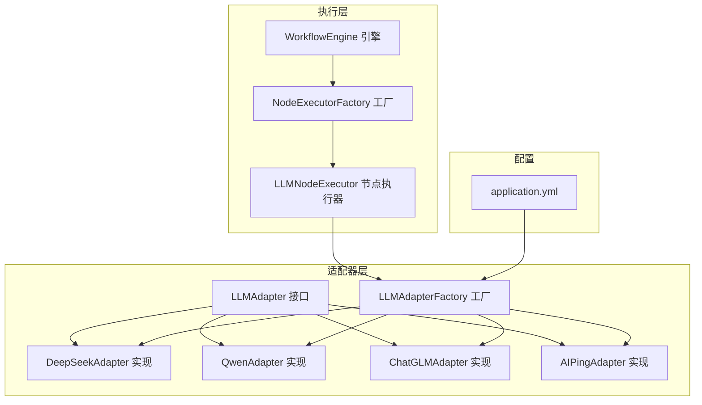
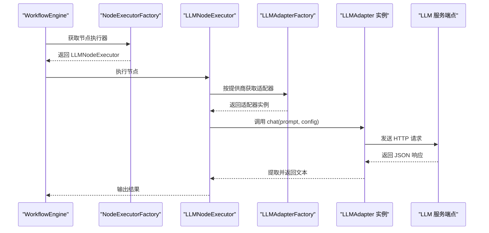
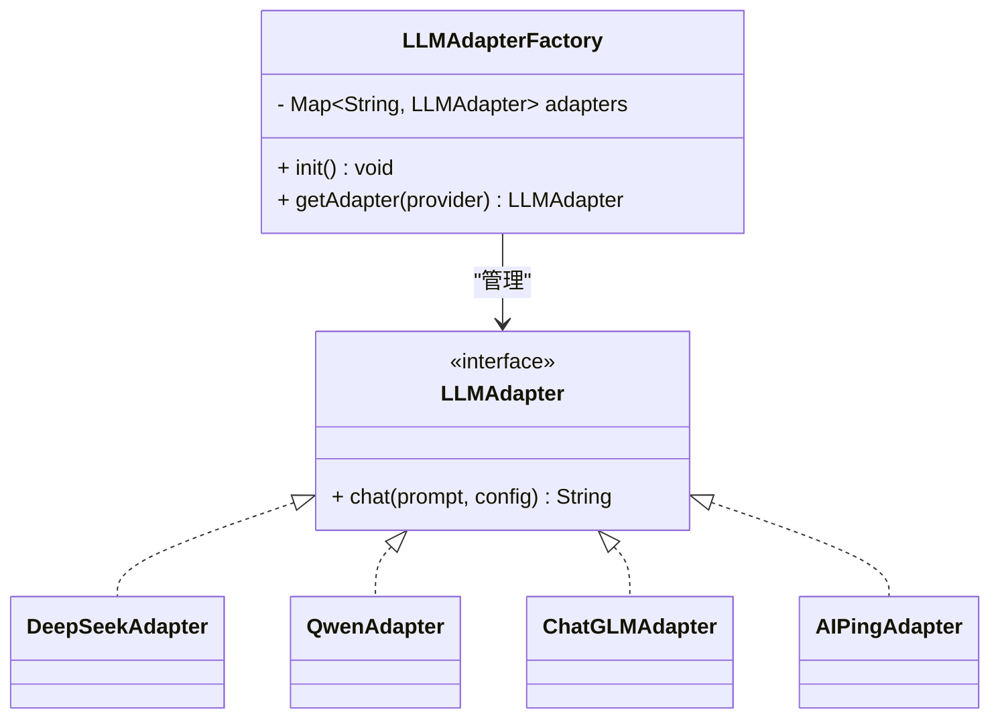
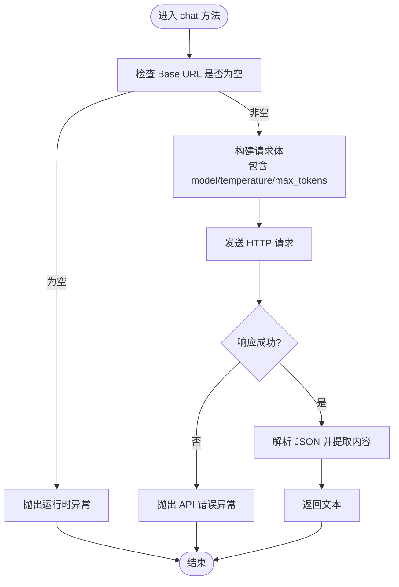
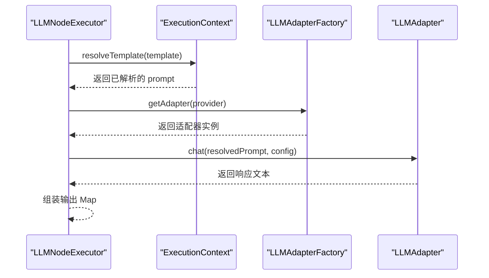
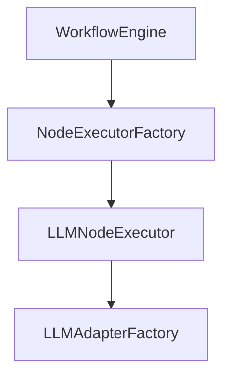
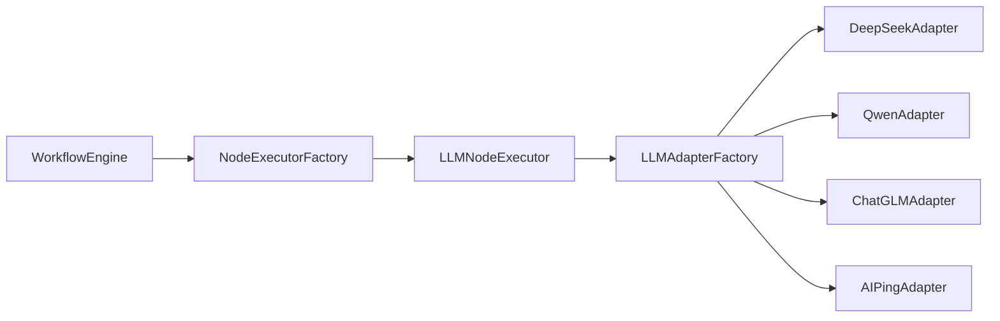

# 适配器工厂模式

<cite>
**本文引用的文件列表**
- [LLMAdapterFactory.java](file://backend/src/main/java/com/paiagent/adapter/LLMAdapterFactory.java)
- [LLMAdapter.java](file://backend/src/main/java/com/paiagent/adapter/LLMAdapter.java)
- [AIPingAdapter.java](file://backend/src/main/java/com/paiagent/adapter/impl/AIPingAdapter.java)
- [QwenAdapter.java](file://backend/src/main/java/com/paiagent/adapter/impl/QwenAdapter.java)
- [ChatGLMAdapter.java](file://backend/src/main/java/com/paiagent/adapter/impl/ChatGLMAdapter.java)
- [DeepSeekAdapter.java](file://backend/src/main/java/com/paiagent/adapter/impl/DeepSeekAdapter.java)
- [application.yml](file://backend/src/main/resources/application.yml)
- [LLMNodeExecutor.java](file://backend/src/main/java/com/paiagent/engine/executors/LLMNodeExecutor.java)
- [ExecutionContext.java](file://backend/src/main/java/com/paiagent/engine/ExecutionContext.java)
- [WorkflowEngine.java](file://backend/src/main/java/com/paiagent/engine/WorkflowEngine.java)
- [NodeExecutorFactory.java](file://backend/src/main/java/com/paiagent/engine/NodeExecutorFactory.java)
</cite>

## 目录
1. [简介](#简介)
2. [项目结构](#项目结构)
3. [核心组件](#核心组件)
4. [架构总览](#架构总览)
5. [详细组件分析](#详细组件分析)
6. [依赖分析](#依赖分析)
7. [性能考量](#性能考量)
8. [故障排查指南](#故障排查指南)
9. [结论](#结论)
10. [附录：扩展与最佳实践](#附录扩展与最佳实践)

## 简介
本文件围绕 LLMAdapterFactory 工厂类展开，系统性阐述其在 AI 服务适配器系统中的工厂模式应用原理与实现机制。重点覆盖：
- 工厂类的实例化策略与配置管理
- 动态适配器选择算法与错误处理
- 单例与缓存策略（基于 Spring 容器）及性能优化
- 扩展指南：新增 AI 服务提供商与配置校验
- 使用示例与常见问题排查

## 项目结构
该系统采用分层与按职责划分的组织方式：
- adapter 层：统一接口与具体适配器实现
- engine 层：工作流执行引擎与节点执行器
- config 层：Spring 配置与数据源等
- model/dto/repository/controller 等支撑模块

下图展示与工厂模式直接相关的核心文件与交互关系：

图表来源
- [LLMAdapterFactory.java:1-52](file://backend/src/main/java/com/paiagent/adapter/LLMAdapterFactory.java#L1-L52)
- [LLMAdapter.java:1-17](file://backend/src/main/java/com/paiagent/adapter/LLMAdapter.java#L1-L17)
- [DeepSeekAdapter.java:1-61](file://backend/src/main/java/com/paiagent/adapter/impl/DeepSeekAdapter.java#L1-L61)
- [QwenAdapter.java:1-61](file://backend/src/main/java/com/paiagent/adapter/impl/QwenAdapter.java#L1-L61)
- [ChatGLMAdapter.java:1-61](file://backend/src/main/java/com/paiagent/adapter/impl/ChatGLMAdapter.java#L1-L61)
- [AIPingAdapter.java:1-65](file://backend/src/main/java/com/paiagent/adapter/impl/AIPingAdapter.java#L1-L65)
- [LLMNodeExecutor.java:1-48](file://backend/src/main/java/com/paiagent/engine/executors/LLMNodeExecutor.java#L1-L48)
- [NodeExecutorFactory.java:1-29](file://backend/src/main/java/com/paiagent/engine/NodeExecutorFactory.java#L1-L29)
- [WorkflowEngine.java:1-136](file://backend/src/main/java/com/paiagent/engine/WorkflowEngine.java#L1-L136)
- [application.yml:1-44](file://backend/src/main/resources/application.yml#L1-L44)

章节来源
- [LLMAdapterFactory.java:1-52](file://backend/src/main/java/com/paiagent/adapter/LLMAdapterFactory.java#L1-L52)
- [application.yml:21-34](file://backend/src/main/resources/application.yml#L21-L34)

## 核心组件
- LLMAdapter 接口：定义统一的聊天调用契约，屏蔽不同提供商的差异。
- 具体适配器：DeepSeek、Qwen、ChatGLM、AIPing 均实现 LLMAdapter，负责构造请求、发送 HTTP 请求并解析响应。
- LLMAdapterFactory：集中管理适配器实例，提供按提供商名称获取适配器的能力，并在初始化阶段加载配置。
- LLMNodeExecutor：工作流中 LLM 节点的执行器，通过工厂获取适配器并执行聊天逻辑。
- NodeExecutorFactory：工作流节点执行器工厂，负责注册与选择不同类型的节点执行器。
- WorkflowEngine：工作流调度与拓扑排序执行引擎，协调上下文与日志记录。
- ExecutionContext：节点间结果传递与模板变量解析的上下文容器。
- application.yml：集中存放各提供商的 API Key 与 Base URL 等配置。

章节来源
- [LLMAdapter.java:1-17](file://backend/src/main/java/com/paiagent/adapter/LLMAdapter.java#L1-L17)
- [LLMAdapterFactory.java:1-52](file://backend/src/main/java/com/paiagent/adapter/LLMAdapterFactory.java#L1-L52)
- [LLMNodeExecutor.java:1-48](file://backend/src/main/java/com/paiagent/engine/executors/LLMNodeExecutor.java#L1-L48)
- [NodeExecutorFactory.java:1-29](file://backend/src/main/java/com/paiagent/engine/NodeExecutorFactory.java#L1-L29)
- [WorkflowEngine.java:1-136](file://backend/src/main/java/com/paiagent/engine/WorkflowEngine.java#L1-L136)
- [ExecutionContext.java:1-63](file://backend/src/main/java/com/paiagent/engine/ExecutionContext.java#L1-L63)
- [application.yml:21-34](file://backend/src/main/resources/application.yml#L21-L34)

## 架构总览
下图展示从工作流到适配器工厂再到具体适配器的调用链路，体现工厂模式在运行时的动态选择能力。

图表来源
- [WorkflowEngine.java:70-71](file://backend/src/main/java/com/paiagent/engine/WorkflowEngine.java#L70-L71)
- [NodeExecutorFactory.java:21-26](file://backend/src/main/java/com/paiagent/engine/NodeExecutorFactory.java#L21-L26)
- [LLMNodeExecutor.java:35-41](file://backend/src/main/java/com/paiagent/engine/executors/LLMNodeExecutor.java#L35-L41)
- [LLMAdapterFactory.java:44-50](file://backend/src/main/java/com/paiagent/adapter/LLMAdapterFactory.java#L44-L50)
- [AIPingAdapter.java:31-63](file://backend/src/main/java/com/paiagent/adapter/impl/AIPingAdapter.java#L31-L63)
- [QwenAdapter.java:30-59](file://backend/src/main/java/com/paiagent/adapter/impl/QwenAdapter.java#L30-L59)
- [ChatGLMAdapter.java:30-59](file://backend/src/main/java/com/paiagent/adapter/impl/ChatGLMAdapter.java#L30-L59)
- [DeepSeekAdapter.java:30-59](file://backend/src/main/java/com/paiagent/adapter/impl/DeepSeekAdapter.java#L30-L59)

## 详细组件分析

### LLMAdapterFactory 工厂类
- 角色定位：集中管理所有 LLM 适配器实例，提供按提供商名称检索的能力；在容器初始化阶段完成实例化与注册。
- 配置注入：通过 Spring 的 @Value 注解从 application.yml 中读取各提供商的 API Key 与 Base URL。
- 实例化策略：
  - 在 @PostConstruct 初始化方法中，将 DeepSeek、Qwen、ChatGLM、AIPing 四个适配器实例以字符串键名注册到内部 Map。
  - 适配器构造函数接收 API Key 与 Base URL，确保每个适配器都具备独立的网络客户端与超时设置。
- 动态适配器选择算法：
  - getAdapter(provider) 通过 Map 快速查找，时间复杂度 O(1)。
  - 若找不到对应提供商，抛出非法参数异常，便于上层捕获并提示配置错误。
- 单例与缓存：
  - 作为 Spring 组件，默认单例作用域，工厂持有的 Map 即为进程级缓存，避免重复创建适配器实例。
- 性能优化：
  - 适配器内部使用 OkHttp 客户端并设置连接与读取超时，减少阻塞风险。
  - 工厂层仅做轻量映射查询，不涉及 IO，性能开销极低。

图表来源
- [LLMAdapterFactory.java:1-52](file://backend/src/main/java/com/paiagent/adapter/LLMAdapterFactory.java#L1-L52)
- [LLMAdapter.java:1-17](file://backend/src/main/java/com/paiagent/adapter/LLMAdapter.java#L1-L17)
- [DeepSeekAdapter.java:1-61](file://backend/src/main/java/com/paiagent/adapter/impl/DeepSeekAdapter.java#L1-L61)
- [QwenAdapter.java:1-61](file://backend/src/main/java/com/paiagent/adapter/impl/QwenAdapter.java#L1-L61)
- [ChatGLMAdapter.java:1-61](file://backend/src/main/java/com/paiagent/adapter/impl/ChatGLMAdapter.java#L1-L61)
- [AIPingAdapter.java:1-65](file://backend/src/main/java/com/paiagent/adapter/impl/AIPingAdapter.java#L1-L65)

章节来源
- [LLMAdapterFactory.java:1-52](file://backend/src/main/java/com/paiagent/adapter/LLMAdapterFactory.java#L1-L52)
- [application.yml:21-34](file://backend/src/main/resources/application.yml#L21-L34)

### LLMAdapter 接口与适配器实现
- 接口设计：统一 chat(prompt, config) 方法签名，屏蔽不同提供商的差异，便于工厂与调用方解耦。
- 实现要点：
  - 各适配器均使用 OkHttp 发送 POST 请求至 /chat/completions。
  - 通过 Jackson 解析响应 JSON，提取 choices[0].message.content 作为返回文本。
  - 对未配置的 Base URL 或请求失败进行显式异常抛出，便于上层统一处理。
- 默认值策略：当 config 缺失时，适配器内部提供合理的默认模型、温度与最大 Token 数。

图表来源
- [AIPingAdapter.java:31-63](file://backend/src/main/java/com/paiagent/adapter/impl/AIPingAdapter.java#L31-L63)
- [QwenAdapter.java:30-59](file://backend/src/main/java/com/paiagent/adapter/impl/QwenAdapter.java#L30-L59)
- [ChatGLMAdapter.java:30-59](file://backend/src/main/java/com/paiagent/adapter/impl/ChatGLMAdapter.java#L30-L59)
- [DeepSeekAdapter.java:30-59](file://backend/src/main/java/com/paiagent/adapter/impl/DeepSeekAdapter.java#L30-L59)

章节来源
- [LLMAdapter.java:1-17](file://backend/src/main/java/com/paiagent/adapter/LLMAdapter.java#L1-L17)
- [AIPingAdapter.java:1-65](file://backend/src/main/java/com/paiagent/adapter/impl/AIPingAdapter.java#L1-L65)
- [QwenAdapter.java:1-61](file://backend/src/main/java/com/paiagent/adapter/impl/QwenAdapter.java#L1-L61)
- [ChatGLMAdapter.java:1-61](file://backend/src/main/java/com/paiagent/adapter/impl/ChatGLMAdapter.java#L1-L61)
- [DeepSeekAdapter.java:1-61](file://backend/src/main/java/com/paiagent/adapter/impl/DeepSeekAdapter.java#L1-L61)

### LLMNodeExecutor 节点执行器
- 输入解析：从节点数据中读取 provider、model、prompt、temperature、maxTokens 等参数。
- 模板解析：通过 ExecutionContext.resolveTemplate 将 {{nodeId.output}} 等占位符替换为上游输出。
- 适配器调用：通过 LLMAdapterFactory 获取对应适配器并执行 chat。
- 输出封装：将响应文本放入输出 Map，供后续节点使用。

图表来源
- [LLMNodeExecutor.java:22-46](file://backend/src/main/java/com/paiagent/engine/executors/LLMNodeExecutor.java#L22-L46)
- [ExecutionContext.java:38-61](file://backend/src/main/java/com/paiagent/engine/ExecutionContext.java#L38-L61)
- [LLMAdapterFactory.java:44-50](file://backend/src/main/java/com/paiagent/adapter/LLMAdapterFactory.java#L44-L50)

章节来源
- [LLMNodeExecutor.java:1-48](file://backend/src/main/java/com/paiagent/engine/executors/LLMNodeExecutor.java#L1-L48)
- [ExecutionContext.java:1-63](file://backend/src/main/java/com/paiagent/engine/ExecutionContext.java#L1-L63)

### NodeExecutorFactory 与 WorkflowEngine
- NodeExecutorFactory：注册 input、output、llm、tts 四类节点执行器，按类型名映射到具体实现。
- WorkflowEngine：解析工作流定义，执行前进行拓扑排序，逐节点调用执行器并将输出写入上下文，同时记录日志与耗时。
- 与工厂的关系：WorkflowEngine 通过 NodeExecutorFactory 获取 LLMNodeExecutor，后者再通过 LLMAdapterFactory 获取具体适配器。

图表来源
- [WorkflowEngine.java:70-71](file://backend/src/main/java/com/paiagent/engine/WorkflowEngine.java#L70-L71)
- [NodeExecutorFactory.java:14-18](file://backend/src/main/java/com/paiagent/engine/NodeExecutorFactory.java#L14-L18)
- [LLMNodeExecutor.java:17-19](file://backend/src/main/java/com/paiagent/engine/executors/LLMNodeExecutor.java#L17-L19)
- [LLMAdapterFactory.java:36-42](file://backend/src/main/java/com/paiagent/adapter/LLMAdapterFactory.java#L36-L42)

章节来源
- [NodeExecutorFactory.java:1-29](file://backend/src/main/java/com/paiagent/engine/NodeExecutorFactory.java#L1-L29)
- [WorkflowEngine.java:1-136](file://backend/src/main/java/com/paiagent/engine/WorkflowEngine.java#L1-L136)

## 依赖分析
- 组件耦合：
  - LLMAdapterFactory 与各适配器实现之间为“工厂-产品”关系，耦合度低，便于扩展新提供商。
  - LLMNodeExecutor 依赖 LLMAdapterFactory，但不关心具体实现细节，符合依赖倒置原则。
  - WorkflowEngine 依赖 NodeExecutorFactory，间接依赖 LLMNodeExecutor 与 LLMAdapterFactory。
- 外部依赖：
  - OkHttp 用于 HTTP 通信，Jackson 用于 JSON 解析。
  - Spring 注解驱动的依赖注入与生命周期回调（@PostConstruct）。
- 可能的循环依赖：
  - 当前结构未见循环依赖；若新增适配器或执行器，需避免相互持有对方的强引用。

图表来源
- [WorkflowEngine.java:70-71](file://backend/src/main/java/com/paiagent/engine/WorkflowEngine.java#L70-L71)
- [NodeExecutorFactory.java:14-18](file://backend/src/main/java/com/paiagent/engine/NodeExecutorFactory.java#L14-L18)
- [LLMNodeExecutor.java:17-19](file://backend/src/main/java/com/paiagent/engine/executors/LLMNodeExecutor.java#L17-L19)
- [LLMAdapterFactory.java:36-42](file://backend/src/main/java/com/paiagent/adapter/LLMAdapterFactory.java#L36-L42)

章节来源
- [LLMAdapterFactory.java:1-52](file://backend/src/main/java/com/paiagent/adapter/LLMAdapterFactory.java#L1-L52)
- [LLMNodeExecutor.java:1-48](file://backend/src/main/java/com/paiagent/engine/executors/LLMNodeExecutor.java#L1-L48)
- [NodeExecutorFactory.java:1-29](file://backend/src/main/java/com/paiagent/engine/NodeExecutorFactory.java#L1-L29)
- [WorkflowEngine.java:1-136](file://backend/src/main/java/com/paiagent/engine/WorkflowEngine.java#L1-L136)

## 性能考量
- 工厂层：
  - Map 查询为 O(1)，初始化一次即可复用，内存占用小。
- 适配器层：
  - OkHttp 客户端复用，连接与读取超时合理设置，避免长时间阻塞。
  - JSON 解析在响应成功后进行，失败路径快速返回。
- 工作流层：
  - 拓扑排序保证节点按依赖顺序执行，避免不必要的重试与回溯。
- 建议优化：
  - 为适配器增加连接池与重试策略（可选），在高并发场景下提升稳定性。
  - 对频繁调用的节点可引入本地缓存（如模型参数缓存），但需注意一致性。

[本节为通用性能建议，无需特定文件引用]

## 故障排查指南
- 常见错误与定位：
  - 未知提供商：工厂在找不到 provider 时抛出异常，检查节点数据中的 provider 字段是否正确。
  - Base URL 未配置：适配器在请求前校验 Base URL，若为空会抛出异常，检查 application.yml 中对应 llm.<provider>.base-url。
  - API 调用失败：适配器对非成功响应抛出异常，查看响应状态码与错误体，确认 API Key 权限与配额。
- 日志与追踪：
  - WorkflowEngine 记录每个节点的执行状态、耗时与输出，便于定位问题节点。
  - ExecutionContext 支持模板解析，可检查上游节点输出是否正确注入。
- 配置校验：
  - application.yml 中的 API Key 与 Base URL 通过 @Value 注入，确保环境变量或配置文件正确设置。

章节来源
- [LLMAdapterFactory.java:44-50](file://backend/src/main/java/com/paiagent/adapter/LLMAdapterFactory.java#L44-L50)
- [AIPingAdapter.java:32-34](file://backend/src/main/java/com/paiagent/adapter/impl/AIPingAdapter.java#L32-L34)
- [QwenAdapter.java:31-34](file://backend/src/main/java/com/paiagent/adapter/impl/QwenAdapter.java#L31-L34)
- [ChatGLMAdapter.java:31-34](file://backend/src/main/java/com/paiagent/adapter/impl/ChatGLMAdapter.java#L31-L34)
- [DeepSeekAdapter.java:31-34](file://backend/src/main/java/com/paiagent/adapter/impl/DeepSeekAdapter.java#L31-L34)
- [WorkflowEngine.java:81-90](file://backend/src/main/java/com/paiagent/engine/WorkflowEngine.java#L81-L90)
- [ExecutionContext.java:38-61](file://backend/src/main/java/com/paiagent/engine/ExecutionContext.java#L38-L61)
- [application.yml:21-34](file://backend/src/main/resources/application.yml#L21-L34)

## 结论
LLMAdapterFactory 通过工厂模式实现了对多提供商 LLM 服务的统一接入与动态选择，结合 Spring 容器的依赖注入与生命周期管理，形成了清晰、可扩展且易于维护的架构。其核心优势在于：
- 低耦合：接口抽象与工厂解耦具体实现
- 易扩展：新增提供商只需实现接口并注册到工厂
- 易运维：集中配置与统一错误处理
- 高性能：轻量映射查询与 OkHttp 客户端复用

[本节为总结性内容，无需特定文件引用]

## 附录：扩展与最佳实践

### 如何添加新的 AI 服务提供商
- 步骤一：实现 LLMAdapter 接口
  - 参考现有适配器的请求构造与响应解析流程，确保统一的 chat 方法签名。
  - 章节来源
    - [LLMAdapter.java:1-17](file://backend/src/main/java/com/paiagent/adapter/LLMAdapter.java#L1-L17)
    - [AIPingAdapter.java:1-65](file://backend/src/main/java/com/paiagent/adapter/impl/AIPingAdapter.java#L1-L65)
    - [QwenAdapter.java:1-61](file://backend/src/main/java/com/paiagent/adapter/impl/QwenAdapter.java#L1-L61)
    - [ChatGLMAdapter.java:1-61](file://backend/src/main/java/com/paiagent/adapter/impl/ChatGLMAdapter.java#L1-L61)
    - [DeepSeekAdapter.java:1-61](file://backend/src/main/java/com/paiagent/adapter/impl/DeepSeekAdapter.java#L1-L61)
- 步骤二：在工厂中注册
  - 在工厂初始化方法中将新适配器实例 put 到 Map 中，并为其命名一个稳定的关键字。
  - 章节来源
    - [LLMAdapterFactory.java:36-42](file://backend/src/main/java/com/paiagent/adapter/LLMAdapterFactory.java#L36-L42)
- 步骤三：在配置文件中添加密钥与基础地址
  - 在 application.yml 中新增 llm.<new-provider> 段落，包含 api-key 与 base-url。
  - 章节来源
    - [application.yml:21-34](file://backend/src/main/resources/application.yml#L21-L34)
- 步骤四：在工作流节点中使用
  - 在 LLM 节点的数据中设置 provider 为新关键字，即可通过工厂自动选择。
  - 章节来源
    - [LLMNodeExecutor.java:23-24](file://backend/src/main/java/com/paiagent/engine/executors/LLMNodeExecutor.java#L23-L24)

### 配置验证机制建议
- 运行时校验：
  - 在适配器构造函数或 chat 方法中对关键字段（如 API Key、Base URL）进行非空校验，失败时抛出明确异常。
- 配置文件校验：
  - 在启动阶段通过 Bean 初始化或自定义校验器对必填配置进行检查，提前暴露配置错误。
- 章节来源
  - [AIPingAdapter.java:32-34](file://backend/src/main/java/com/paiagent/adapter/impl/AIPingAdapter.java#L32-L34)
  - [QwenAdapter.java:31-34](file://backend/src/main/java/com/paiagent/adapter/impl/QwenAdapter.java#L31-L34)
  - [ChatGLMAdapter.java:31-34](file://backend/src/main/java/com/paiagent/adapter/impl/ChatGLMAdapter.java#L31-L34)
  - [DeepSeekAdapter.java:31-34](file://backend/src/main/java/com/paiagent/adapter/impl/DeepSeekAdapter.java#L31-L34)

### 使用示例（步骤说明）
- 示例目标：在工作流中使用 Qwen 适配器生成回复
- 步骤一：准备配置
  - 在 application.yml 中设置 llm.qwen.api-key 与 base-url。
  - 章节来源
    - [application.yml:26-28](file://backend/src/main/resources/application.yml#L26-L28)
- 步骤二：定义工作流节点
  - 在 LLM 节点的数据中设置 provider 为 "qwen"，并传入 prompt、model、temperature、maxTokens 等参数。
  - 章节来源
    - [LLMNodeExecutor.java:23-29](file://backend/src/main/java/com/paiagent/engine/executors/LLMNodeExecutor.java#L23-L29)
- 步骤三：执行工作流
  - WorkflowEngine 会通过 NodeExecutorFactory 与 LLMAdapterFactory 自动选择 Qwen 适配器并执行。
  - 章节来源
    - [WorkflowEngine.java:70-71](file://backend/src/main/java/com/paiagent/engine/WorkflowEngine.java#L70-L71)
    - [LLMAdapterFactory.java:38-39](file://backend/src/main/java/com/paiagent/adapter/LLMAdapterFactory.java#L38-L39)

### 错误处理策略
- 未知提供商：捕获工厂抛出的异常，提示用户检查节点配置。
- API 调用失败：捕获适配器抛出的异常，记录状态与错误信息，必要时重试或降级。
- 配置缺失：在启动阶段或首次调用时进行校验，避免运行期出现空指针或无效请求。
- 章节来源
  - [LLMAdapterFactory.java:44-50](file://backend/src/main/java/com/paiagent/adapter/LLMAdapterFactory.java#L44-L50)
  - [AIPingAdapter.java:55-58](file://backend/src/main/java/com/paiagent/adapter/impl/AIPingAdapter.java#L55-L58)
  - [QwenAdapter.java:51-54](file://backend/src/main/java/com/paiagent/adapter/impl/QwenAdapter.java#L51-L54)
  - [ChatGLMAdapter.java:51-54](file://backend/src/main/java/com/paiagent/adapter/impl/ChatGLMAdapter.java#L51-L54)
  - [DeepSeekAdapter.java:51-54](file://backend/src/main/java/com/paiagent/adapter/impl/DeepSeekAdapter.java#L51-L54)
  - [WorkflowEngine.java:81-90](file://backend/src/main/java/com/paiagent/engine/WorkflowEngine.java#L81-L90)