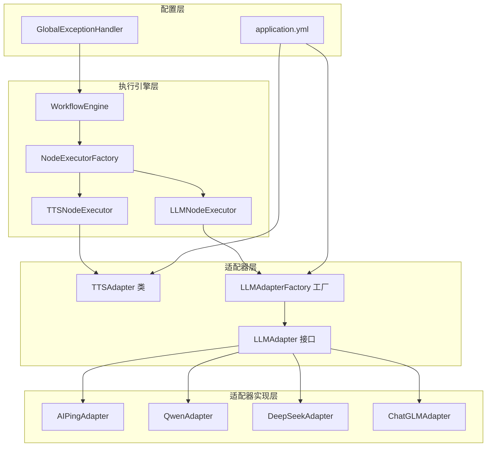
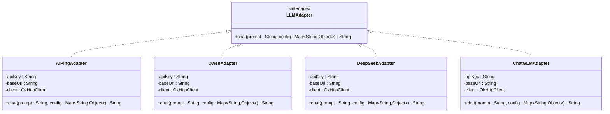
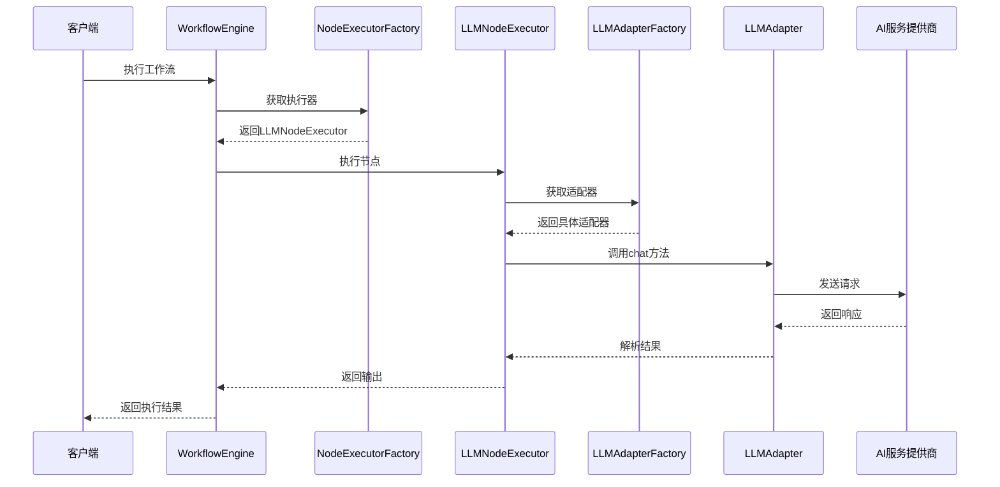
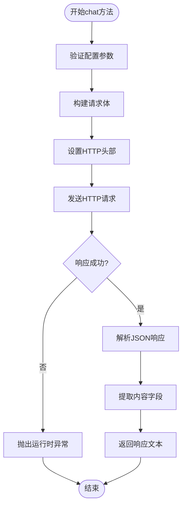
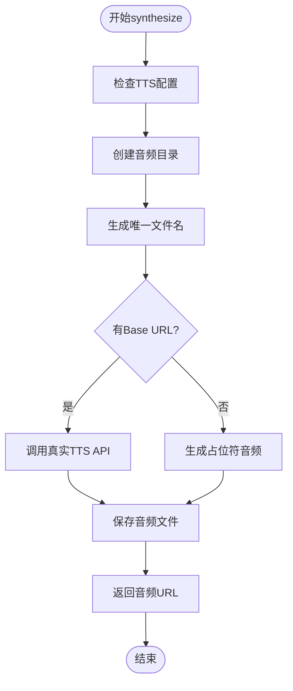
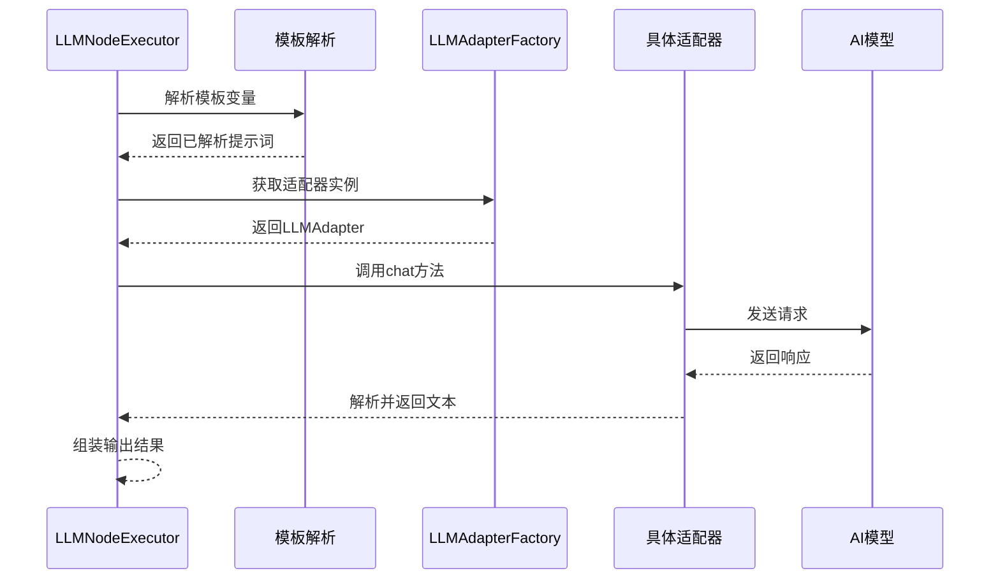
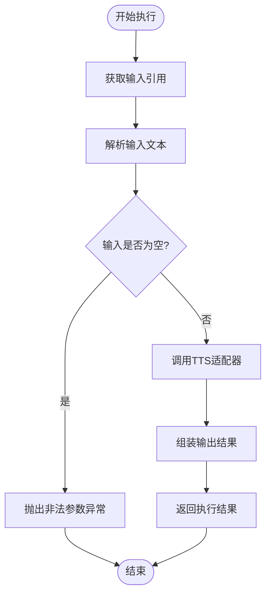
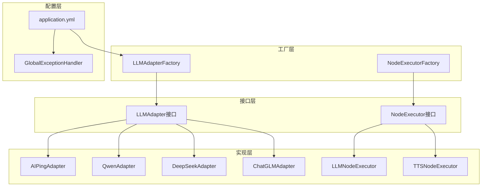
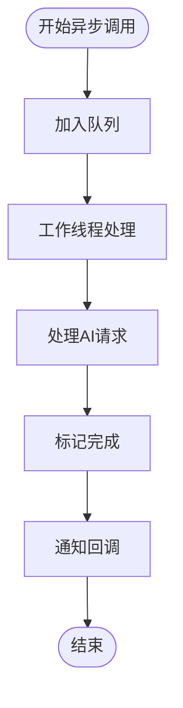
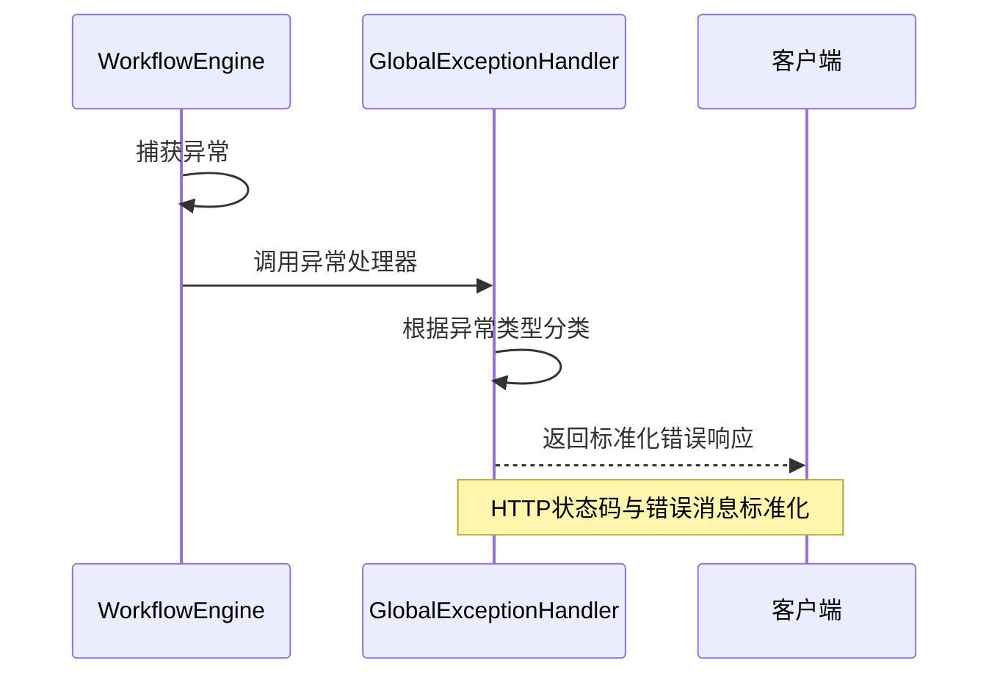

# 适配器接口设计

<cite>
**本文档引用的文件**
- [LLMAdapter.java](file://backend/src/main/java/com/paiagent/adapter/LLMAdapter.java)
- [TTSAdapter.java](file://backend/src/main/java/com/paiagent/adapter/TTSAdapter.java)
- [LLMAdapterFactory.java](file://backend/src/main/java/com/paiagent/adapter/LLMAdapterFactory.java)
- [AIPingAdapter.java](file://backend/src/main/java/com/paiagent/adapter/impl/AIPingAdapter.java)
- [QwenAdapter.java](file://backend/src/main/java/com/paiagent/adapter/impl/QwenAdapter.java)
- [DeepSeekAdapter.java](file://backend/src/main/java/com/paiagent/adapter/impl/DeepSeekAdapter.java)
- [ChatGLMAdapter.java](file://backend/src/main/java/com/paiagent/adapter/impl/ChatGLMAdapter.java)
- [LLMNodeExecutor.java](file://backend/src/main/java/com/paiagent/engine/executors/LLMNodeExecutor.java)
- [TTSNodeExecutor.java](file://backend/src/main/java/com/paiagent/engine/executors/TTSNodeExecutor.java)
- [NodeExecutor.java](file://backend/src/main/java/com/paiagent/engine/NodeExecutor.java)
- [NodeExecutorFactory.java](file://backend/src/main/java/com/paiagent/engine/NodeExecutorFactory.java)
- [WorkflowEngine.java](file://backend/src/main/java/com/paiagent/engine/WorkflowEngine.java)
- [GlobalExceptionHandler.java](file://backend/src/main/java/com/paiagent/exception/GlobalExceptionHandler.java)
- [application.yml](file://backend/src/main/resources/application.yml)
</cite>

## 目录
1. [简介](#简介)
2. [项目结构](#项目结构)
3. [核心组件](#核心组件)
4. [架构概览](#架构概览)
5. [详细组件分析](#详细组件分析)
6. [依赖关系分析](#依赖关系分析)
7. [性能考虑](#性能考虑)
8. [故障排除指南](#故障排除指南)
9. [结论](#结论)

## 简介

本项目实现了基于适配器模式的AI服务集成框架，通过统一的接口抽象实现了对多个大语言模型（LLM）和文本转语音（TTS）服务提供商的无缝集成。该设计模式确保了系统能够灵活地支持不同的AI服务提供商，同时保持客户端代码的一致性和可维护性。

适配器模式在此架构中的核心价值在于：
- **统一抽象**：为不同AI服务提供商提供一致的编程接口
- **可扩展性**：轻松添加新的AI服务提供商而无需修改现有代码
- **解耦合**：业务逻辑与具体AI服务实现分离
- **配置驱动**：通过配置文件动态切换不同的AI服务提供商

## 项目结构

项目采用分层架构设计，主要包含以下核心模块：



**图表来源**
- [LLMAdapter.java:1-17](file://backend/src/main/java/com/paiagent/adapter/LLMAdapter.java#L1-L17)
- [TTSAdapter.java:1-108](file://backend/src/main/java/com/paiagent/adapter/TTSAdapter.java#L1-L108)
- [LLMAdapterFactory.java:1-52](file://backend/src/main/java/com/paiagent/adapter/LLMAdapterFactory.java#L1-L52)
- [LLMNodeExecutor.java:1-48](file://backend/src/main/java/com/paiagent/engine/executors/LLMNodeExecutor.java#L1-L48)
- [TTSNodeExecutor.java:1-48](file://backend/src/main/java/com/paiagent/engine/executors/TTSNodeExecutor.java#L1-L48)

**章节来源**
- [LLMAdapter.java:1-17](file://backend/src/main/java/com/paiagent/adapter/LLMAdapter.java#L1-L17)
- [TTSAdapter.java:1-108](file://backend/src/main/java/com/paiagent/adapter/TTSAdapter.java#L1-L108)
- [LLMAdapterFactory.java:1-52](file://backend/src/main/java/com/paiagent/adapter/LLMAdapterFactory.java#L1-L52)

## 核心组件

### LLMAdapter 接口设计

LLMAdapter是所有大语言模型适配器的统一接口，定义了标准化的聊天交互能力：



**图表来源**
- [LLMAdapter.java:8-16](file://backend/src/main/java/com/paiagent/adapter/LLMAdapter.java#L8-L16)
- [AIPingAdapter.java:14-64](file://backend/src/main/java/com/paiagent/adapter/impl/AIPingAdapter.java#L14-L64)
- [QwenAdapter.java:14-60](file://backend/src/main/java/com/paiagent/adapter/impl/QwenAdapter.java#L14-L60)
- [DeepSeekAdapter.java:14-60](file://backend/src/main/java/com/paiagent/adapter/impl/DeepSeekAdapter.java#L14-L60)
- [ChatGLMAdapter.java:14-60](file://backend/src/main/java/com/paiagent/adapter/impl/ChatGLMAdapter.java#L14-L60)

### TTSAdapter 设计思路

TTSAdapter提供了文本转语音服务的统一抽象，支持外部API集成和本地回退机制：

```mermaid
classDiagram
class TTSAdapter {
-apiKey : String
-baseUrl : String
-audioPath : String
-client : OkHttpClient
+synthesize(text : String, voiceId : String) String
-callTTSApi(text : String, voiceId : String, outputFile : File) void
-generatePlaceholderAudio(text : String, outputFile : File) void
}
note for TTSAdapter : "支持真实API调用和占位符生成"
```

**图表来源**
- [TTSAdapter.java:18-107](file://backend/src/main/java/com/paiagent/adapter/TTSAdapter.java#L18-L107)

**章节来源**
- [LLMAdapter.java:8-16](file://backend/src/main/java/com/paiagent/adapter/LLMAdapter.java#L8-L16)
- [TTSAdapter.java:18-107](file://backend/src/main/java/com/paiagent/adapter/TTSAdapter.java#L18-L107)

## 架构概览

系统采用工厂模式和执行器模式相结合的设计，实现了高度模块化的AI服务集成架构：



**图表来源**
- [WorkflowEngine.java:20-96](file://backend/src/main/java/com/paiagent/engine/WorkflowEngine.java#L20-L96)
- [NodeExecutorFactory.java:21-27](file://backend/src/main/java/com/paiagent/engine/NodeExecutorFactory.java#L21-L27)
- [LLMNodeExecutor.java:35-41](file://backend/src/main/java/com/paiagent/engine/executors/LLMNodeExecutor.java#L35-L41)
- [LLMAdapterFactory.java:44-50](file://backend/src/main/java/com/paiagent/adapter/LLMAdapterFactory.java#L44-L50)

## 详细组件分析

### LLMAdapter 接口详解

#### 方法签名规范

**chat方法**
- **参数定义**：
  - `prompt`: 用户输入的提示词，用于指导AI模型生成响应
  - `config`: 配置映射，包含模型参数和行为控制
- **返回值**：AI模型生成的响应文本
- **异常处理**：抛出通用Exception以供上层处理

#### 配置参数规范

`config`参数是一个Map结构，支持以下关键配置：

| 参数名称 | 类型 | 默认值 | 描述 |
|---------|------|--------|------|
| `model` | String | 空字符串 | 指定要使用的AI模型 |
| `temperature` | Number | 0.7 | 控制生成文本的创造性，数值范围通常为0-2 |
| `maxTokens` | Number | 2048 | 控制生成文本的最大长度 |

#### 实现示例分析

每个具体适配器都遵循统一的实现模式：



**图表来源**
- [AIPingAdapter.java:30-63](file://backend/src/main/java/com/paiagent/adapter/impl/AIPingAdapter.java#L30-L63)
- [QwenAdapter.java:30-59](file://backend/src/main/java/com/paiagent/adapter/impl/QwenAdapter.java#L30-L59)

**章节来源**
- [LLMAdapter.java:9-15](file://backend/src/main/java/com/paiagent/adapter/LLMAdapter.java#L9-L15)
- [AIPingAdapter.java:30-63](file://backend/src/main/java/com/paiagent/adapter/impl/AIPingAdapter.java#L30-L63)
- [QwenAdapter.java:30-59](file://backend/src/main/java/com/paiagent/adapter/impl/QwenAdapter.java#L30-L59)

### LLMAdapterFactory 工厂模式

工厂类负责管理所有LLM适配器实例，提供统一的获取接口：

```mermaid
classDiagram
class LLMAdapterFactory {
-deepseekApiKey : String
-deepseekBaseUrl : String
-qwenApiKey : String
-qwenBaseUrl : String
-chatglmApiKey : String
-chatglmBaseUrl : String
-aipingApiKey : String
-aipingBaseUrl : String
-adapters : Map~String,LLMAdapter~
+init() void
+getAdapter(provider : String) LLMAdapter
}
note for LLMAdapterFactory : "支持四种AI服务提供商"
```

**图表来源**
- [LLMAdapterFactory.java:12-51](file://backend/src/main/java/com/paiagent/adapter/LLMAdapterFactory.java#L12-L51)

#### 支持的AI服务提供商

| 提供商 | 代码标识 | 默认Base URL | 特殊功能 |
|-------|----------|-------------|----------|
| DeepSeek | `deepseek` | `https://api.deepseek.com/v1` | 支持多种深度学习模型 |
| Qwen | `qwen` | `https://dashscope.aliyuncs.com/compatible-mode/v1` | 阿里云通义千问 |
| ChatGLM | `chatglm` | `https://open.bigmodel.cn/api/paas/v4` | 智谱AI模型 |
| AI Ping | `aiping` | 可配置 | OpenAI兼容格式 |

**章节来源**
- [LLMAdapterFactory.java:36-42](file://backend/src/main/java/com/paiagent/adapter/LLMAdapterFactory.java#L36-L42)
- [LLMAdapterFactory.java:44-50](file://backend/src/main/java/com/paiagent/adapter/LLMAdapterFactory.java#L44-L50)

### TTSAdapter 文本转语音服务

#### 核心功能流程



**图表来源**
- [TTSAdapter.java:40-59](file://backend/src/main/java/com/paiagent/adapter/TTSAdapter.java#L40-L59)

#### 配置参数

| 配置项 | 环境变量 | 默认值 | 描述 |
|-------|----------|--------|------|
| `tts.api-key` | `TTS_API_KEY` | 空字符串 | TTS服务API密钥 |
| `tts.base-url` | `TTS_BASE_URL` | 空字符串 | TTS服务基础URL |
| `storage.audio-path` | `DATA_PATH/audio` | `./data/audio` | 音频文件存储路径 |

**章节来源**
- [TTSAdapter.java:20-27](file://backend/src/main/java/com/paiagent/adapter/TTSAdapter.java#L20-L27)
- [TTSAdapter.java:40-59](file://backend/src/main/java/com/paiagent/adapter/TTSAdapter.java#L40-L59)

### 执行器模式实现

#### LLMNodeExecutor 工作流程



**图表来源**
- [LLMNodeExecutor.java:22-46](file://backend/src/main/java/com/paiagent/engine/executors/LLMNodeExecutor.java#L22-L46)

#### TTSNodeExecutor 处理流程



**图表来源**
- [TTSNodeExecutor.java:21-46](file://backend/src/main/java/com/paiagent/engine/executors/TTSNodeExecutor.java#L21-L46)

**章节来源**
- [LLMNodeExecutor.java:22-46](file://backend/src/main/java/com/paiagent/engine/executors/LLMNodeExecutor.java#L22-L46)
- [TTSNodeExecutor.java:21-46](file://backend/src/main/java/com/paiagent/engine/executors/TTSNodeExecutor.java#L21-L46)

## 依赖关系分析

系统采用松耦合的设计，通过接口和工厂模式实现组件间的解耦：



**图表来源**
- [LLMAdapterFactory.java:34-50](file://backend/src/main/java/com/paiagent/adapter/LLMAdapterFactory.java#L34-L50)
- [NodeExecutorFactory.java:14-27](file://backend/src/main/java/com/paiagent/engine/NodeExecutorFactory.java#L14-L27)

### 关键依赖特性

1. **接口隔离**：每个适配器只实现必要的接口方法
2. **工厂注入**：通过Spring工厂模式管理对象生命周期
3. **配置驱动**：所有外部服务配置通过application.yml管理
4. **异常传播**：底层异常向上层传播，由全局异常处理器统一处理

**章节来源**
- [LLMAdapterFactory.java:34-50](file://backend/src/main/java/com/paiagent/adapter/LLMAdapterFactory.java#L34-L50)
- [NodeExecutorFactory.java:14-27](file://backend/src/main/java/com/paiagent/engine/NodeExecutorFactory.java#L14-L27)

## 性能考虑

### 连接池优化

所有适配器都使用OkHttp客户端，并配置了合理的超时参数：

- **连接超时**：30秒
- **读取超时**：120秒
- **连接池复用**：避免频繁建立TCP连接

### 缓存策略

当前实现未包含缓存机制，建议在生产环境中考虑：

1. **响应缓存**：对相同输入的LLM响应进行缓存
2. **模型元数据缓存**：缓存模型配置信息
3. **API密钥缓存**：减少配置读取开销

### 异步处理

建议引入异步处理机制：



## 故障排除指南

### 常见异常类型

| 异常类型 | 触发条件 | 处理建议 |
|---------|----------|----------|
| IllegalArgumentException | 未知LLM提供商或TTS输入为空 | 检查配置文件和输入参数 |
| RuntimeException | AI服务API调用失败 | 查看服务日志和网络连接 |
| Exception | 通用异常 | 检查网络连接和API密钥 |

### 错误处理机制

系统采用全局异常处理器统一处理各种异常：



**图表来源**
- [GlobalExceptionHandler.java:12-28](file://backend/src/main/java/com/paiagent/exception/GlobalExceptionHandler.java#L12-L28)

### 调试技巧

1. **启用详细日志**：检查AI服务提供商的响应和错误信息
2. **验证配置**：确认application.yml中的API密钥和Base URL正确
3. **网络诊断**：测试与AI服务提供商的网络连通性
4. **模板验证**：检查工作流中模板变量的正确性

**章节来源**
- [GlobalExceptionHandler.java:12-28](file://backend/src/main/java/com/paiagent/exception/GlobalExceptionHandler.java#L12-L28)

## 结论

本适配器接口设计成功实现了AI服务集成的统一抽象，通过以下关键特性确保了系统的灵活性和可维护性：

### 设计优势

1. **高度可扩展**：新增AI服务提供商只需实现LLMAdapter接口
2. **配置驱动**：通过环境变量和配置文件实现零代码变更
3. **异常统一**：全局异常处理器确保错误处理的一致性
4. **解耦合设计**：业务逻辑与具体实现完全分离

### 最佳实践建议

1. **接口实现**：新适配器应严格遵循LLMAdapter接口规范
2. **配置管理**：使用application.yml集中管理所有外部服务配置
3. **错误处理**：在适配器实现中提供详细的错误信息
4. **性能监控**：建议添加调用统计和性能指标收集

### 扩展指南

1. **添加新AI提供商**：实现LLMAdapter接口并注册到LLMAdapterFactory
2. **自定义执行器**：实现NodeExecutor接口以支持新的工作流节点类型
3. **配置扩展**：在application.yml中添加新的配置项
4. **异常处理**：根据需要扩展GlobalExceptionHandler的处理逻辑

该设计为AI服务集成提供了一个稳健、可扩展的基础框架，能够适应不断变化的AI服务生态和业务需求。