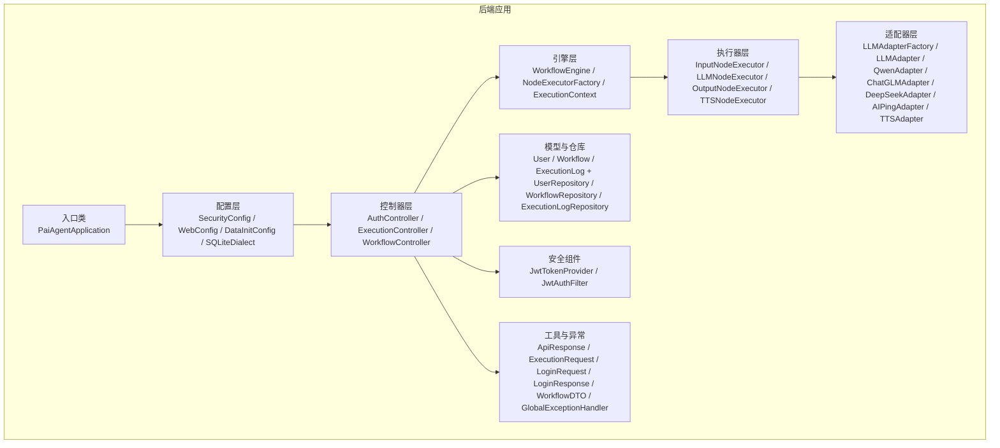
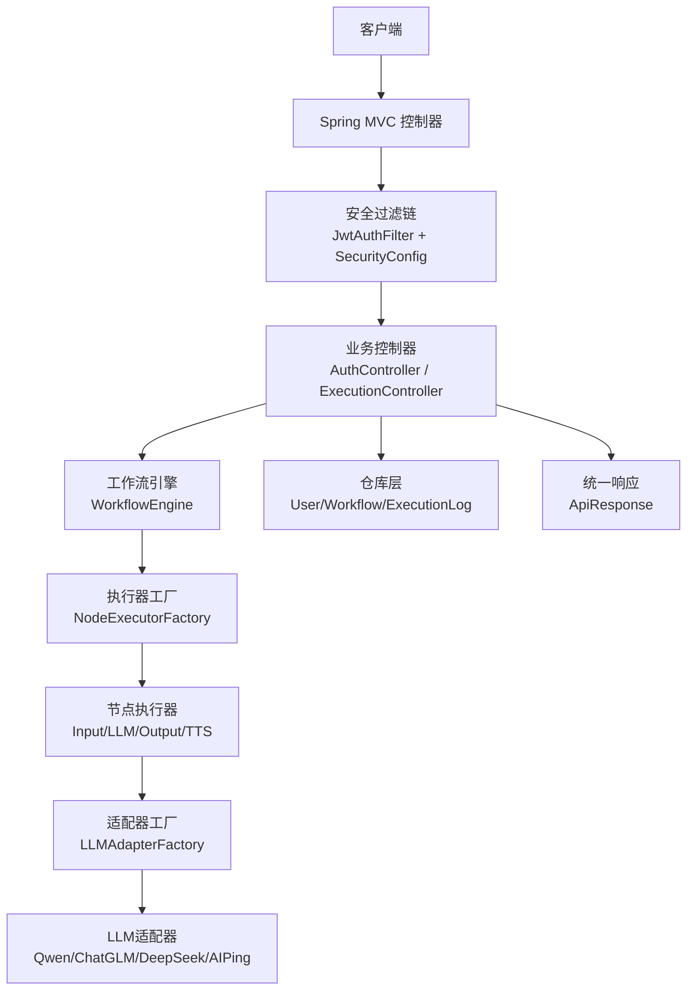
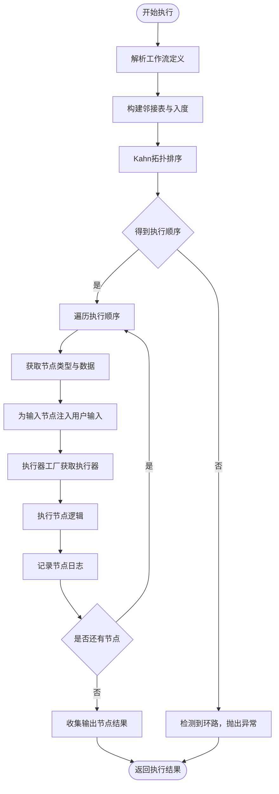
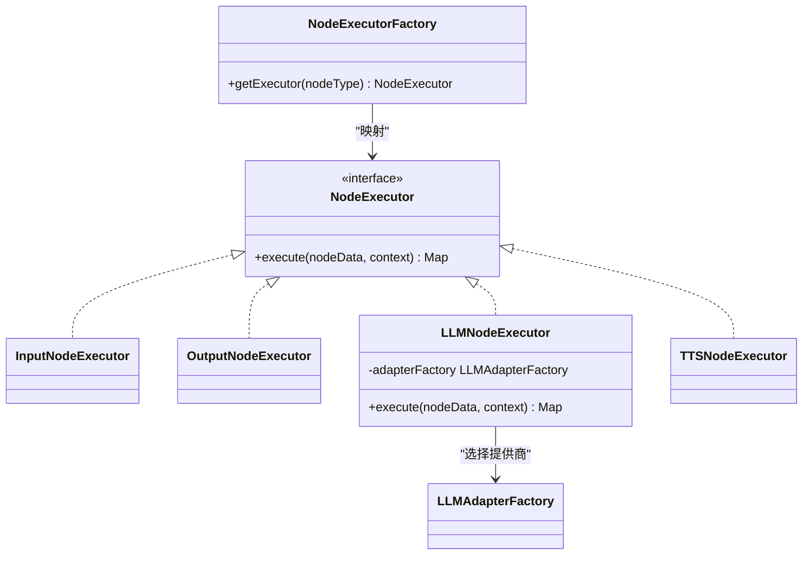
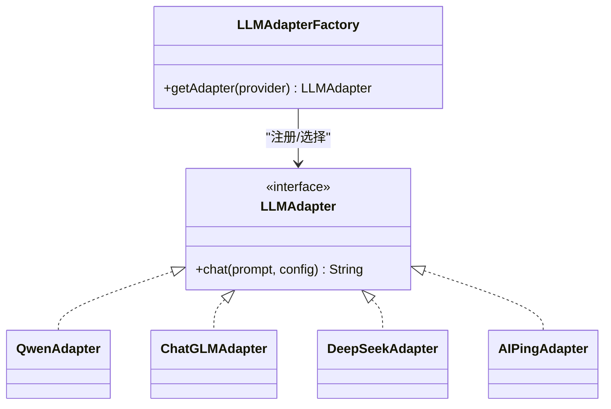
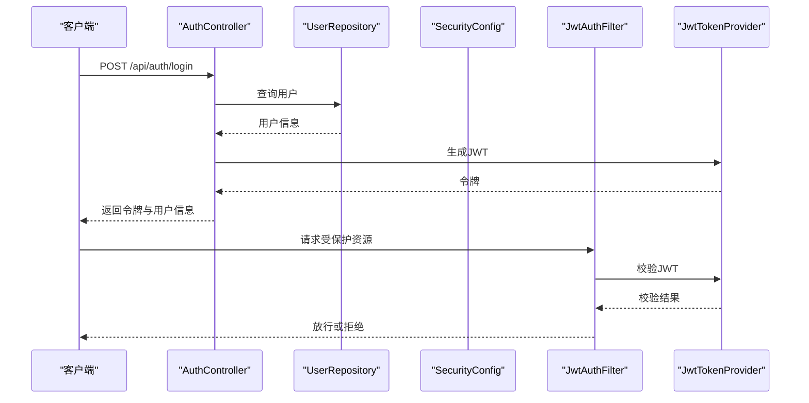
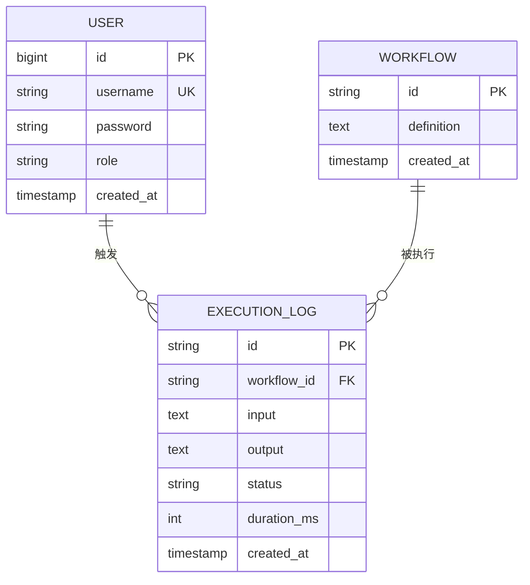
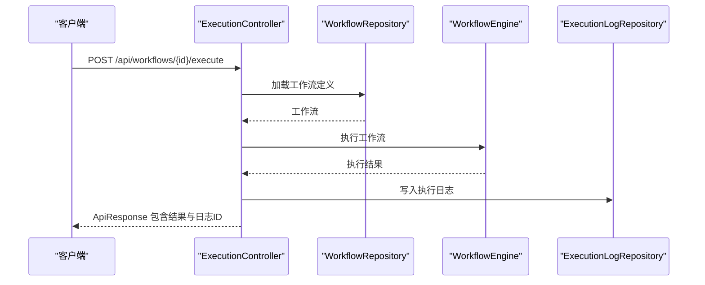
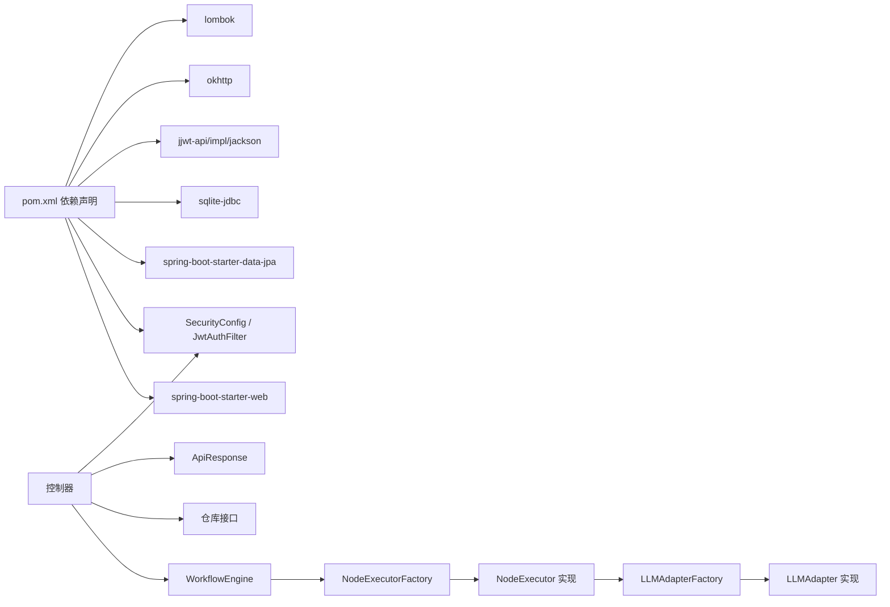

# 后端架构

<cite>
**本文引用的文件**
- [PaiAgentApplication.java](file://backend/src/main/java/com/paiagent/PaiAgentApplication.java)
- [SecurityConfig.java](file://backend/src/main/java/com/paiagent/config/SecurityConfig.java)
- [JwtTokenProvider.java](file://backend/src/main/java/com/paiagent/security/JwtTokenProvider.java)
- [JwtAuthFilter.java](file://backend/src/main/java/com/paiagent/security/JwtAuthFilter.java)
- [AuthController.java](file://backend/src/main/java/com/paiagent/controller/AuthController.java)
- [ExecutionController.java](file://backend/src/main/java/com/paiagent/controller/ExecutionController.java)
- [WorkflowEngine.java](file://backend/src/main/java/com/paiagent/engine/WorkflowEngine.java)
- [NodeExecutorFactory.java](file://backend/src/main/java/com/paiagent/engine/NodeExecutorFactory.java)
- [ExecutionContext.java](file://backend/src/main/java/com/paiagent/engine/ExecutionContext.java)
- [NodeExecutor.java](file://backend/src/main/java/com/paiagent/engine/NodeExecutor.java)
- [LLMNodeExecutor.java](file://backend/src/main/java/com/paiagent/engine/executors/LLMNodeExecutor.java)
- [InputNodeExecutor.java](file://backend/src/main/java/com/paiagent/engine/executors/InputNodeExecutor.java)
- [OutputNodeExecutor.java](file://backend/src/main/java/com/paiagent/engine/executors/OutputNodeExecutor.java)
- [TTSNodeExecutor.java](file://backend/src/main/java/com/paiagent/engine/executors/TTSNodeExecutor.java)
- [LLMAdapterFactory.java](file://backend/src/main/java/com/paiagent/adapter/LLMAdapterFactory.java)
- [LLMAdapter.java](file://backend/src/main/java/com/paiagent/adapter/LLMAdapter.java)
- [QwenAdapter.java](file://backend/src/main/java/com/paiagent/adapter/impl/QwenAdapter.java)
- [ChatGLMAdapter.java](file://backend/src/main/java/com/paiagent/adapter/impl/ChatGLMAdapter.java)
- [DeepSeekAdapter.java](file://backend/src/main/java/com/paiagent/adapter/impl/DeepSeekAdapter.java)
- [AIPingAdapter.java](file://backend/src/main/java/com/paiagent/adapter/impl/AIPingAdapter.java)
- [TTSAdapter.java](file://backend/src/main/java/com/paiagent/adapter/TTSAdapter.java)
- [User.java](file://backend/src/main/java/com/paiagent/model/entity/User.java)
- [UserRepository.java](file://backend/src/main/java/com/paiagent/repository/UserRepository.java)
- [ExecutionLog.java](file://backend/src/main/java/com/paiagent/model/entity/ExecutionLog.java)
- [ExecutionLogRepository.java](file://backend/src/main/java/com/paiagent/repository/ExecutionLogRepository.java)
- [Workflow.java](file://backend/src/main/java/com/paiagent/model/entity/Workflow.java)
- [WorkflowRepository.java](file://backend/src/main/java/com/paiagent/repository/WorkflowRepository.java)
- [ApiResponse.java](file://backend/src/main/java/com/paiagent/model/dto/ApiResponse.java)
- [ExecutionRequest.java](file://backend/src/main/java/com/paiagent/model/dto/ExecutionRequest.java)
- [LoginRequest.java](file://backend/src/main/java/com/paiagent/model/dto/LoginRequest.java)
- [LoginResponse.java](file://backend/src/main/java/com/paiagent/model/dto/LoginResponse.java)
- [WorkflowDTO.java](file://backend/src/main/java/com/paiagent/model/dto/WorkflowDTO.java)
- [GlobalExceptionHandler.java](file://backend/src/main/java/com/paiagent/exception/GlobalExceptionHandler.java)
- [SQLiteDialect.java](file://backend/src/main/java/com/paiagent/config/SQLiteDialect.java)
- [WebConfig.java](file://backend/src/main/java/com/paiagent/config/WebConfig.java)
- [DataInitConfig.java](file://backend/src/main/java/com/paiagent/config/DataInitConfig.java)
- [application.yml](file://backend/src/main/resources/application.yml)
- [schema.sql](file://backend/src/main/resources/schema.sql)
</cite>

## 目录
1. [简介](#简介)
2. [项目结构](#项目结构)
3. [核心组件](#核心组件)
4. [架构总览](#架构总览)
5. [详细组件分析](#详细组件分析)
6. [依赖分析](#依赖分析)
7. [性能考虑](#性能考虑)
8. [故障排查指南](#故障排查指南)
9. [结论](#结论)
10. [附录](#附录)

## 简介
本文件面向PaiAgent后端架构，围绕Spring Boot应用的分层架构与依赖注入、工作流引擎的拓扑排序与节点执行器、适配器模式在多LLM提供商集成中的应用、以及基于JWT的安全认证体系进行系统化技术说明。文档通过架构图、组件交互图与数据流图帮助读者快速理解系统设计思路与实现要点。

## 项目结构
后端采用标准Spring Boot目录组织方式，按功能域划分包结构：入口类、配置、控制器、引擎、适配器、模型与仓库、安全、异常处理等。核心启动类位于根包下，其余模块按职责清晰分离，便于维护与扩展。

**图表来源**
- [PaiAgentApplication.java:1-12](file://backend/src/main/java/com/paiagent/PaiAgentApplication.java#L1-L12)
- [SecurityConfig.java:1-54](file://backend/src/main/java/com/paiagent/config/SecurityConfig.java#L1-L54)
- [AuthController.java:1-56](file://backend/src/main/java/com/paiagent/controller/AuthController.java#L1-L56)
- [ExecutionController.java:1-93](file://backend/src/main/java/com/paiagent/controller/ExecutionController.java#L1-L93)
- [WorkflowEngine.java:1-136](file://backend/src/main/java/com/paiagent/engine/WorkflowEngine.java#L1-L136)
- [NodeExecutorFactory.java:1-29](file://backend/src/main/java/com/paiagent/engine/NodeExecutorFactory.java#L1-L29)
- [LLMAdapterFactory.java:1-52](file://backend/src/main/java/com/paiagent/adapter/LLMAdapterFactory.java#L1-L52)
- [JwtTokenProvider.java:1-55](file://backend/src/main/java/com/paiagent/security/JwtTokenProvider.java#L1-L55)
- [User.java:1-28](file://backend/src/main/java/com/paiagent/model/entity/User.java#L1-L28)
- [Workflow.java](file://backend/src/main/java/com/paiagent/model/entity/Workflow.java)
- [ExecutionLog.java](file://backend/src/main/java/com/paiagent/model/entity/ExecutionLog.java)
- [ApiResponse.java](file://backend/src/main/java/com/paiagent/model/dto/ApiResponse.java)

**章节来源**
- [PaiAgentApplication.java:1-12](file://backend/src/main/java/com/paiagent/PaiAgentApplication.java#L1-L12)
- [application.yml:1-44](file://backend/src/main/resources/application.yml#L1-L44)

## 核心组件
- 分层架构与依赖注入
  - 入口类负责应用启动，自动扫描组件并装配Bean。
  - 配置层定义安全策略、Web跨域与数据源方言。
  - 控制器层接收HTTP请求，调用引擎与仓库完成业务处理。
  - 引擎层负责工作流解析、拓扑排序与节点执行。
  - 适配器层屏蔽不同LLM/TTS提供商差异，统一对外接口。
  - 安全层提供JWT生成、校验与过滤链。
  - 模型与仓库层封装实体与持久化访问。
- 工作流引擎
  - 基于JSON定义解析节点与边，构建邻接表与入度映射，使用Kahn算法进行拓扑排序，按序执行节点并收集日志。
- 适配器模式
  - LLMAdapterFactory集中管理多个LLM提供商实例；LLMAdapter定义统一聊天接口；各具体适配器实现HTTP调用与响应解析。
- 安全认证
  - SecurityConfig启用无状态会话，开放登录路径，其他API需鉴权；JwtAuthFilter拦截请求提取并验证JWT；JwtTokenProvider负责签发与校验。

**章节来源**
- [WorkflowEngine.java:20-108](file://backend/src/main/java/com/paiagent/engine/WorkflowEngine.java#L20-L108)
- [NodeExecutorFactory.java:9-29](file://backend/src/main/java/com/paiagent/engine/NodeExecutorFactory.java#L9-L29)
- [LLMAdapterFactory.java:11-52](file://backend/src/main/java/com/paiagent/adapter/LLMAdapterFactory.java#L11-L52)
- [LLMAdapter.java:1-17](file://backend/src/main/java/com/paiagent/adapter/LLMAdapter.java#L1-L17)
- [SecurityConfig.java:16-54](file://backend/src/main/java/com/paiagent/config/SecurityConfig.java#L16-L54)
- [JwtTokenProvider.java:12-55](file://backend/src/main/java/com/paiagent/security/JwtTokenProvider.java#L12-L55)

## 架构总览
下图展示从客户端到后端各层的交互路径与关键组件协作关系。

**图表来源**
- [AuthController.java:16-56](file://backend/src/main/java/com/paiagent/controller/AuthController.java#L16-L56)
- [ExecutionController.java:18-93](file://backend/src/main/java/com/paiagent/controller/ExecutionController.java#L18-L93)
- [SecurityConfig.java:26-42](file://backend/src/main/java/com/paiagent/config/SecurityConfig.java#L26-L42)
- [JwtAuthFilter.java](file://backend/src/main/java/com/paiagent/security/JwtAuthFilter.java)
- [WorkflowEngine.java:9-18](file://backend/src/main/java/com/paiagent/engine/WorkflowEngine.java#L9-L18)
- [NodeExecutorFactory.java:9-29](file://backend/src/main/java/com/paiagent/engine/NodeExecutorFactory.java#L9-L29)
- [LLMAdapterFactory.java:11-52](file://backend/src/main/java/com/paiagent/adapter/LLMAdapterFactory.java#L11-L52)
- [ApiResponse.java](file://backend/src/main/java/com/paiagent/model/dto/ApiResponse.java)

## 详细组件分析

### 工作流引擎与拓扑排序
- 设计原理
  - 将工作流定义解析为节点与边集合，构建邻接表与入度映射，使用队列实现Kahn算法进行拓扑排序，确保有向无环图（DAG）的有序执行。
  - 执行上下文用于传递节点间的数据与模板变量解析，节点执行失败时记录错误日志并中断后续执行。
- 关键流程
  - 解析JSON定义 → 构建图结构 → 拓扑排序 → 逐节点执行 → 收集输出与日志 → 返回结果。

**图表来源**
- [WorkflowEngine.java:21-108](file://backend/src/main/java/com/paiagent/engine/WorkflowEngine.java#L21-L108)
- [WorkflowEngine.java:110-134](file://backend/src/main/java/com/paiagent/engine/WorkflowEngine.java#L110-L134)

**章节来源**
- [WorkflowEngine.java:9-136](file://backend/src/main/java/com/paiagent/engine/WorkflowEngine.java#L9-L136)

### 节点执行器架构
- 组件关系
  - NodeExecutorFactory根据节点类型映射到具体执行器：输入、输出、LLM、TTS。
  - LLMNodeExecutor通过LLMAdapterFactory选择具体提供商，结合模板变量与配置调用LLMAdapter。
  - InputNodeExecutor与OutputNodeExecutor分别负责输入注入与最终输出收集。
  - TTSNodeExecutor预留语音合成能力，可复用类似工厂与适配器模式。

**图表来源**
- [NodeExecutorFactory.java:9-29](file://backend/src/main/java/com/paiagent/engine/NodeExecutorFactory.java#L9-L29)
- [NodeExecutor.java](file://backend/src/main/java/com/paiagent/engine/NodeExecutor.java)
- [InputNodeExecutor.java](file://backend/src/main/java/com/paiagent/engine/executors/InputNodeExecutor.java)
- [OutputNodeExecutor.java](file://backend/src/main/java/com/paiagent/engine/executors/OutputNodeExecutor.java)
- [LLMNodeExecutor.java:12-48](file://backend/src/main/java/com/paiagent/engine/executors/LLMNodeExecutor.java#L12-L48)
- [TTSNodeExecutor.java](file://backend/src/main/java/com/paiagent/engine/executors/TTSNodeExecutor.java)

**章节来源**
- [NodeExecutorFactory.java:9-29](file://backend/src/main/java/com/paiagent/engine/NodeExecutorFactory.java#L9-L29)
- [LLMNodeExecutor.java:12-48](file://backend/src/main/java/com/paiagent/engine/executors/LLMNodeExecutor.java#L12-L48)

### 适配器模式与LLM集成
- 统一接口
  - LLMAdapter定义统一的聊天接口，屏蔽不同提供商的参数与响应差异。
- 工厂与提供商
  - LLMAdapterFactory集中加载配置并注册各提供商实例；执行阶段按节点配置选择对应适配器。
- 具体实现
  - QwenAdapter示例展示了OpenAI兼容模式的请求构造、头部设置与响应解析；其他适配器遵循相同模式。

**图表来源**
- [LLMAdapter.java:1-17](file://backend/src/main/java/com/paiagent/adapter/LLMAdapter.java#L1-L17)
- [LLMAdapterFactory.java:11-52](file://backend/src/main/java/com/paiagent/adapter/LLMAdapterFactory.java#L11-L52)
- [QwenAdapter.java:14-61](file://backend/src/main/java/com/paiagent/adapter/impl/QwenAdapter.java#L14-L61)
- [ChatGLMAdapter.java](file://backend/src/main/java/com/paiagent/adapter/impl/ChatGLMAdapter.java)
- [DeepSeekAdapter.java](file://backend/src/main/java/com/paiagent/adapter/impl/DeepSeekAdapter.java)
- [AIPingAdapter.java](file://backend/src/main/java/com/paiagent/adapter/impl/AIPingAdapter.java)

**章节来源**
- [LLMAdapterFactory.java:11-52](file://backend/src/main/java/com/paiagent/adapter/LLMAdapterFactory.java#L11-L52)
- [QwenAdapter.java:14-61](file://backend/src/main/java/com/paiagent/adapter/impl/QwenAdapter.java#L14-L61)

### 安全认证与JWT实现
- 认证流程
  - 登录接口验证用户名与密码，成功后签发JWT令牌；资源接口通过JwtAuthFilter拦截并校验令牌有效性。
- 配置要点
  - 无状态会话策略；开放登录与静态资源访问；其他API均需认证。
- 令牌管理
  - JwtTokenProvider负责密钥生成、过期时间与签名算法；提供解析用户名与校验令牌的方法。

**图表来源**
- [AuthController.java:31-43](file://backend/src/main/java/com/paiagent/controller/AuthController.java#L31-L43)
- [SecurityConfig.java:26-42](file://backend/src/main/java/com/paiagent/config/SecurityConfig.java#L26-L42)
- [JwtAuthFilter.java](file://backend/src/main/java/com/paiagent/security/JwtAuthFilter.java)
- [JwtTokenProvider.java:25-44](file://backend/src/main/java/com/paiagent/security/JwtTokenProvider.java#L25-L44)

**章节来源**
- [AuthController.java:16-56](file://backend/src/main/java/com/paiagent/controller/AuthController.java#L16-L56)
- [SecurityConfig.java:16-54](file://backend/src/main/java/com/paiagent/config/SecurityConfig.java#L16-L54)
- [JwtTokenProvider.java:12-55](file://backend/src/main/java/com/paiagent/security/JwtTokenProvider.java#L12-L55)

### 数据模型与仓储
- 实体模型
  - User包含主键、唯一用户名、密码与角色，默认管理员角色。
  - Workflow保存工作流定义的JSON文本。
  - ExecutionLog记录每次执行的输入、输出、状态与耗时。
- 仓储接口
  - UserRepository提供按用户名查询；WorkflowRepository与ExecutionLogRepository提供CRUD操作。

**图表来源**
- [User.java:8-28](file://backend/src/main/java/com/paiagent/model/entity/User.java#L8-L28)
- [Workflow.java](file://backend/src/main/java/com/paiagent/model/entity/Workflow.java)
- [ExecutionLog.java](file://backend/src/main/java/com/paiagent/model/entity/ExecutionLog.java)
- [UserRepository.java:8-11](file://backend/src/main/java/com/paiagent/repository/UserRepository.java#L8-L11)
- [WorkflowRepository.java](file://backend/src/main/java/com/paiagent/repository/WorkflowRepository.java)
- [ExecutionLogRepository.java](file://backend/src/main/java/com/paiagent/repository/ExecutionLogRepository.java)

**章节来源**
- [User.java:8-28](file://backend/src/main/java/com/paiagent/model/entity/User.java#L8-L28)
- [Workflow.java](file://backend/src/main/java/com/paiagent/model/entity/Workflow.java)
- [ExecutionLog.java](file://backend/src/main/java/com/paiagent/model/entity/ExecutionLog.java)
- [UserRepository.java:8-11](file://backend/src/main/java/com/paiagent/repository/UserRepository.java#L8-L11)

### 控制器与统一响应
- 控制器职责
  - AuthController处理登录与当前用户信息查询。
  - ExecutionController负责工作流执行、日志记录与结果返回。
- 统一响应
  - ApiResponse封装状态码、消息与数据，保证前后端一致的响应格式。

**图表来源**
- [ExecutionController.java:37-82](file://backend/src/main/java/com/paiagent/controller/ExecutionController.java#L37-L82)
- [WorkflowEngine.java:21-108](file://backend/src/main/java/com/paiagent/engine/WorkflowEngine.java#L21-L108)
- [ApiResponse.java](file://backend/src/main/java/com/paiagent/model/dto/ApiResponse.java)

**章节来源**
- [ExecutionController.java:18-93](file://backend/src/main/java/com/paiagent/controller/ExecutionController.java#L18-L93)
- [ApiResponse.java](file://backend/src/main/java/com/paiagent/model/dto/ApiResponse.java)

## 依赖分析
- 外部依赖
  - Spring Boot Starter（Web、Security、Data JPA、Validation）
  - SQLite JDBC与自定义方言
  - JWT库（jjwt）
  - OkHttp用于HTTP调用
  - Lombok简化实体代码
- 内部耦合
  - 控制器依赖引擎与仓库；引擎依赖执行器工厂与ObjectMapper；执行器依赖适配器工厂；适配器依赖OkHttp与Jackson。
  - 安全组件通过过滤链与配置共同生效，控制器依赖安全组件提供的认证上下文。

**图表来源**
- [pom.xml:25-91](file://backend/pom.xml#L25-L91)
- [ExecutionController.java:22-35](file://backend/src/main/java/com/paiagent/controller/ExecutionController.java#L22-L35)
- [WorkflowEngine.java:12-18](file://backend/src/main/java/com/paiagent/engine/WorkflowEngine.java#L12-L18)
- [NodeExecutorFactory.java:14-19](file://backend/src/main/java/com/paiagent/engine/NodeExecutorFactory.java#L14-L19)
- [LLMAdapterFactory.java:36-42](file://backend/src/main/java/com/paiagent/adapter/LLMAdapterFactory.java#L36-L42)

**章节来源**
- [pom.xml:1-110](file://backend/pom.xml#L1-L110)

## 性能考虑
- I/O密集优化
  - LLM/TTS调用建议增加超时配置与重试策略，避免阻塞线程；可引入连接池与并发限制。
- JSON解析与序列化
  - 使用Jackson的最小字段策略减少传输体积；对大对象输出进行分页或延迟加载。
- 缓存与日志
  - 对热点工作流定义与用户信息进行缓存；执行日志异步写入数据库，降低请求延迟。
- 数据库
  - SQLite适合开发测试，生产环境建议迁移到关系型数据库；为执行日志建立索引以提升查询性能。

## 故障排查指南
- 认证相关
  - 登录失败：检查用户名是否存在与密码匹配；确认密码编码器与存储一致。
  - 未授权访问：确认请求头携带有效JWT且未过期；检查SecurityConfig放行规则。
- 工作流执行
  - 节点执行异常：查看节点日志中的错误信息与耗时；定位具体节点执行器与适配器实现。
  - 死循环或环路：拓扑排序阶段会抛出异常，检查工作流定义中是否存在环。
- 适配器调用
  - 第三方API错误：检查提供商的API Key、Base URL与网络连通性；关注响应状态码与错误体。
- 数据持久化
  - 执行日志保存失败：确认数据库路径与权限；检查JSON序列化是否异常。

**章节来源**
- [AuthController.java:31-43](file://backend/src/main/java/com/paiagent/controller/AuthController.java#L31-L43)
- [ExecutionController.java:65-81](file://backend/src/main/java/com/paiagent/controller/ExecutionController.java#L65-L81)
- [WorkflowEngine.java:81-91](file://backend/src/main/java/com/paiagent/engine/WorkflowEngine.java#L81-L91)
- [GlobalExceptionHandler.java](file://backend/src/main/java/com/paiagent/exception/GlobalExceptionHandler.java)

## 结论
PaiAgent后端采用清晰的分层架构与依赖注入，结合工作流引擎的拓扑排序与节点执行器，实现了可扩展的工作流编排能力；通过适配器模式统一多LLM提供商接入；JWT安全体系保障了API访问控制。该架构在保持简洁的同时具备良好的可维护性与扩展性，适合进一步引入TTS、更多LLM提供商与更复杂的工作流节点类型。

## 附录
- 配置要点
  - JWT密钥与过期时间通过环境变量配置；LLM与TTS的API Key与Base URL同样支持环境变量覆盖。
  - SQLite数据库路径可通过环境变量指定，音频文件存储路径亦可配置。
- 初始化脚本
  - schema.sql用于初始化数据库表结构，配合DataInitConfig完成初始化逻辑。

**章节来源**
- [application.yml:16-44](file://backend/src/main/resources/application.yml#L16-L44)
- [schema.sql](file://backend/src/main/resources/schema.sql)
- [DataInitConfig.java](file://backend/src/main/java/com/paiagent/config/DataInitConfig.java)
- [SQLiteDialect.java](file://backend/src/main/java/com/paiagent/config/SQLiteDialect.java)
- [WebConfig.java](file://backend/src/main/java/com/paiagent/config/WebConfig.java)