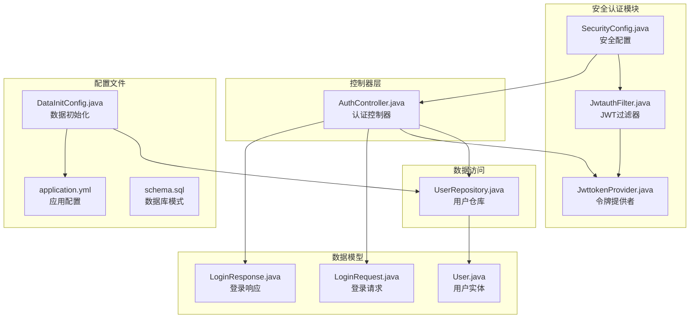
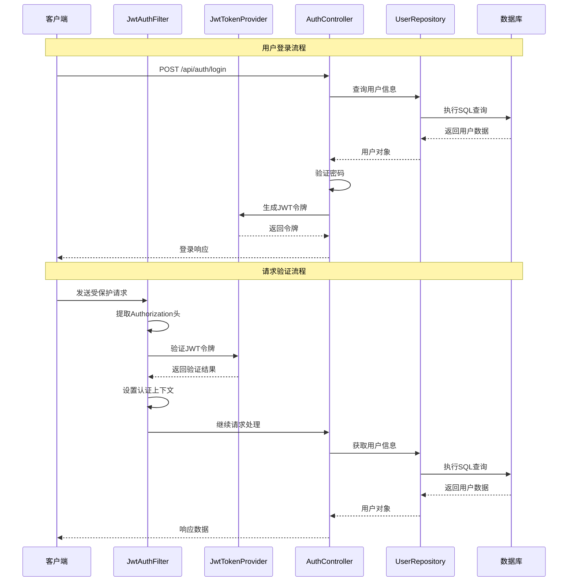
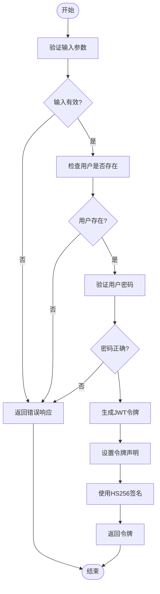
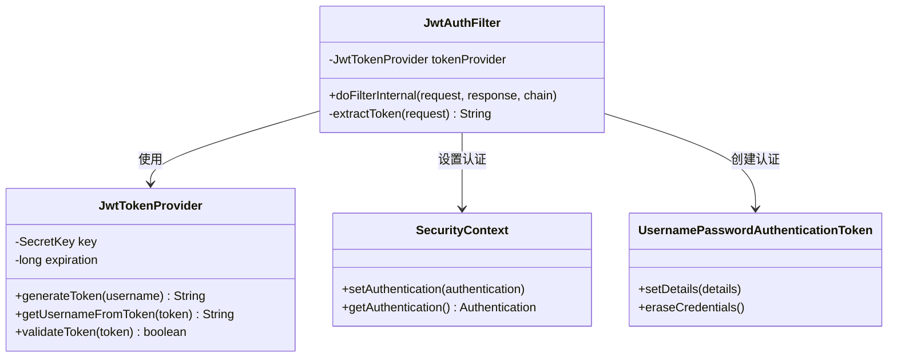
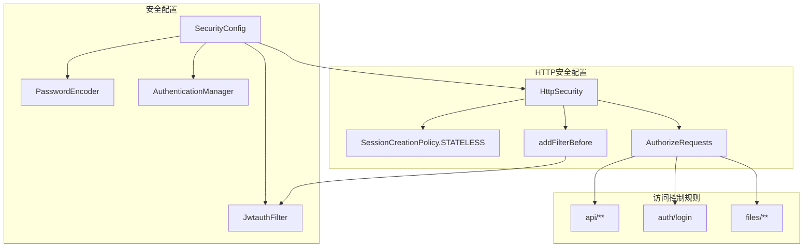
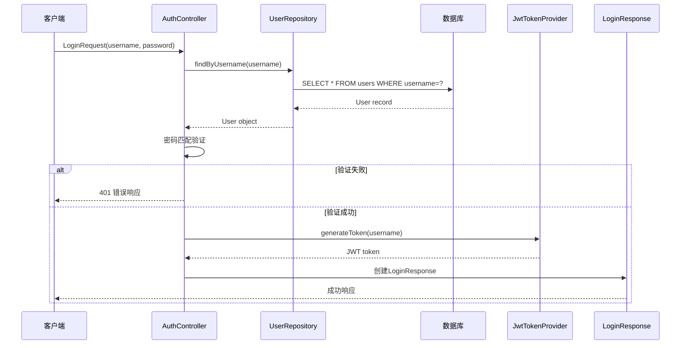
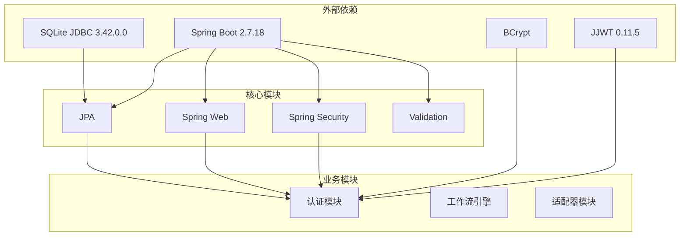

# 安全认证系统

<cite>
**本文档引用的文件**
- [JwtAuthFilter.java](file://backend/src/main/java/com/paiagent/security/JwtAuthFilter.java)
- [JwtTokenProvider.java](file://backend/src/main/java/com/paiagent/security/JwtTokenProvider.java)
- [AuthController.java](file://backend/src/main/java/com/paiagent/controller/AuthController.java)
- [LoginRequest.java](file://backend/src/main/java/com/paiagent/model/dto/LoginRequest.java)
- [LoginResponse.java](file://backend/src/main/java/com/paiagent/model/dto/LoginResponse.java)
- [SecurityConfig.java](file://backend/src/main/java/com/paiagent/config/SecurityConfig.java)
- [User.java](file://backend/src/main/java/com/paiagent/model/entity/User.java)
- [UserRepository.java](file://backend/src/main/java/com/paiagent/repository/UserRepository.java)
- [application.yml](file://backend/src/main/resources/application.yml)
- [DataInitConfig.java](file://backend/src/main/java/com/paiagent/config/DataInitConfig.java)
- [schema.sql](file://backend/src/main/resources/schema.sql)
- [PaiAgentApplication.java](file://backend/src/main/java/com/paiagent/PaiAgentApplication.java)
- [pom.xml](file://backend/pom.xml)
</cite>

## 目录
1. [简介](#简介)
2. [项目结构](#项目结构)
3. [核心组件](#核心组件)
4. [架构概览](#架构概览)
5. [详细组件分析](#详细组件分析)
6. [依赖关系分析](#依赖关系分析)
7. [性能考虑](#性能考虑)
8. [故障排除指南](#故障排除指南)
9. [结论](#结论)
10. [附录](#附录)

## 简介

PaiAgent安全认证系统基于Spring Security和JWT（JSON Web Token）技术构建，提供了完整的用户身份验证和授权机制。该系统采用无状态认证设计，通过JWT令牌实现跨域单点登录，支持管理员角色的权限控制。

系统的核心特性包括：
- 基于JWT的无状态认证机制
- BCrypt密码加密存储
- 自定义JWT过滤器链
- 角色基础的访问控制
- SQLite数据库集成
- RESTful API接口设计

## 项目结构

后端项目采用标准的Spring Boot目录结构，安全认证相关的核心文件分布如下：

**图表来源**
- [SecurityConfig.java:1-54](file://backend/src/main/java/com/paiagent/config/SecurityConfig.java#L1-L54)
- [JwtAuthFilter.java:1-51](file://backend/src/main/java/com/paiagent/security/JwtAuthFilter.java#L1-L51)
- [JwtTokenProvider.java:1-55](file://backend/src/main/java/com/paiagent/security/JwtTokenProvider.java#L1-L55)
- [AuthController.java:1-56](file://backend/src/main/java/com/paiagent/controller/AuthController.java#L1-L56)

**章节来源**
- [PaiAgentApplication.java:1-12](file://backend/src/main/java/com/paiagent/PaiAgentApplication.java#L1-L12)
- [pom.xml:1-110](file://backend/pom.xml#L1-L110)

## 核心组件

### JWT令牌提供者（JwtTokenProvider）

JwtTokenProvider是JWT认证系统的核心组件，负责令牌的生成、验证和解析。该组件使用HS256算法进行对称加密，密钥来自应用程序配置。

主要功能：
- **令牌生成**：基于用户名生成包含过期时间的JWT令牌
- **令牌验证**：验证JWT令牌的有效性和完整性
- **令牌解析**：从有效令牌中提取用户名信息

### JWT认证过滤器（JwtAuthFilter）

JwtAuthFilter实现了Spring Security的OncePerRequestFilter接口，作为自定义过滤器在请求到达控制器之前执行。该过滤器负责：

- 从HTTP请求头中提取JWT令牌
- 验证令牌的有效性
- 在成功验证后设置Spring Security的认证上下文
- 将用户身份传递给后续的控制器处理

### 认证控制器（AuthController）

AuthController提供RESTful API接口，处理用户的登录和信息查询请求。主要接口包括：
- `/api/auth/login`：用户登录接口，返回JWT令牌
- `/api/auth/me`：获取当前登录用户信息接口

**章节来源**
- [JwtTokenProvider.java:12-55](file://backend/src/main/java/com/paiagent/security/JwtTokenProvider.java#L12-L55)
- [JwtAuthFilter.java:17-51](file://backend/src/main/java/com/paiagent/security/JwtAuthFilter.java#L17-L51)
- [AuthController.java:16-56](file://backend/src/main/java/com/paiagent/controller/AuthController.java#L16-L56)

## 架构概览

PaiAgent安全认证系统采用分层架构设计，各组件之间的交互关系如下：

**图表来源**
- [AuthController.java:31-43](file://backend/src/main/java/com/paiagent/controller/AuthController.java#L31-L43)
- [JwtAuthFilter.java:26-41](file://backend/src/main/java/com/paiagent/security/JwtAuthFilter.java#L26-L41)
- [JwtTokenProvider.java:25-35](file://backend/src/main/java/com/paiagent/security/JwtTokenProvider.java#L25-L35)

## 详细组件分析

### JWT令牌生成与验证流程

JWT令牌的生成和验证是整个认证系统的核心机制。下面详细分析这一流程：

**图表来源**
- [AuthController.java:32-42](file://backend/src/main/java/com/paiagent/controller/AuthController.java#L32-L42)
- [JwtTokenProvider.java:25-35](file://backend/src/main/java/com/paiagent/security/JwtTokenProvider.java#L25-L35)

#### 令牌生成策略

令牌生成过程包含以下关键步骤：
1. **时间戳设置**：记录令牌的签发时间和过期时间
2. **声明设置**：设置JWT的标准声明（subject、issuedAt、expiration）
3. **签名算法**：使用HS256算法和对称密钥进行签名
4. **紧凑编码**：将令牌转换为Base64URL编码格式

#### 令牌验证机制

令牌验证过程确保了系统的安全性：
1. **签名验证**：使用相同的密钥和算法验证令牌签名
2. **过期检查**：验证令牌是否仍在有效期内
3. **格式校验**：确保令牌符合JWT标准格式
4. **异常处理**：捕获并处理各种验证异常情况

**章节来源**
- [JwtTokenProvider.java:25-53](file://backend/src/main/java/com/paiagent/security/JwtTokenProvider.java#L25-L53)
- [AuthController.java:36-42](file://backend/src/main/java/com/paiagent/controller/AuthController.java#L36-L42)

### 过滤器链实现分析

JwtAuthFilter作为Spring Security过滤器链的一部分，实现了完整的请求拦截和身份验证流程：

**图表来源**
- [JwtAuthFilter.java:18-41](file://backend/src/main/java/com/paiagent/security/JwtAuthFilter.java#L18-L41)
- [JwtTokenProvider.java:13-23](file://backend/src/main/java/com/paiagent/security/JwtTokenProvider.java#L13-L23)

#### 过滤器执行流程

过滤器的执行流程如下：
1. **令牌提取**：从Authorization头中提取Bearer令牌
2. **令牌验证**：调用JwtTokenProvider验证令牌有效性
3. **用户身份设置**：成功验证后设置Spring Security的认证上下文
4. **请求继续**：将请求传递给下一个过滤器或控制器

**章节来源**
- [JwtAuthFilter.java:26-41](file://backend/src/main/java/com/paiagent/security/JwtAuthFilter.java#L26-L41)
- [SecurityConfig.java:26-42](file://backend/src/main/java/com/paiagent/config/SecurityConfig.java#L26-L42)

### 安全配置详解

SecurityConfig类定义了整个安全框架的配置，包括过滤器链、密码编码器和访问控制规则：

**图表来源**
- [SecurityConfig.java:18-52](file://backend/src/main/java/com/paiagent/config/SecurityConfig.java#L18-L52)

#### 关键配置说明

- **会话管理**：设置为STATELESS，确保无状态认证
- **CORS配置**：启用跨域资源共享支持
- **CSRF禁用**：由于使用JWT，禁用CSRF保护
- **访问控制**：定义不同路径的访问权限规则

**章节来源**
- [SecurityConfig.java:26-42](file://backend/src/main/java/com/paiagent/config/SecurityConfig.java#L26-L42)

### 用户认证流程

系统支持完整的用户认证流程，从登录请求到令牌返回的全过程：

**图表来源**
- [AuthController.java:31-43](file://backend/src/main/java/com/paiagent/controller/AuthController.java#L31-L43)
- [UserRepository.java:8-10](file://backend/src/main/java/com/paiagent/repository/UserRepository.java#L8-L10)

**章节来源**
- [AuthController.java:31-54](file://backend/src/main/java/com/paiagent/controller/AuthController.java#L31-L54)
- [LoginRequest.java:8-13](file://backend/src/main/java/com/paiagent/model/dto/LoginRequest.java#L8-L13)
- [LoginResponse.java:8-19](file://backend/src/main/java/com/paiagent/model/dto/LoginResponse.java#L8-L19)

## 依赖关系分析

系统的关键依赖关系如下：

**图表来源**
- [pom.xml:25-83](file://backend/pom.xml#L25-L83)

### 核心依赖说明

- **Spring Security**：提供安全框架和认证机制
- **JWT库**：实现JSON Web Token的生成和验证
- **SQLite驱动**：支持本地数据库存储
- **BCrypt**：提供密码哈希和验证功能

**章节来源**
- [pom.xml:20-23](file://backend/pom.xml#L20-L23)

## 性能考虑

### JWT令牌性能优化

1. **令牌大小控制**：JWT令牌应保持精简，只包含必要的声明信息
2. **过期时间设置**：合理的过期时间平衡安全性和用户体验
3. **内存缓存**：可以考虑缓存频繁使用的令牌以减少计算开销

### 数据库性能优化

1. **索引优化**：为用户名字段建立唯一索引
2. **查询优化**：使用参数化查询避免SQL注入
3. **连接池**：合理配置数据库连接池参数

### 缓存策略

建议实现多级缓存：
- **令牌缓存**：缓存已验证的令牌以提高验证速度
- **用户信息缓存**：缓存用户的基本信息减少数据库查询

## 故障排除指南

### 常见问题及解决方案

#### 令牌验证失败

**问题现象**：用户登录后无法访问受保护资源

**可能原因**：
1. JWT密钥不匹配
2. 令牌过期
3. 服务器时间不同步

**解决方法**：
1. 检查JWT密钥配置
2. 验证服务器时间同步
3. 检查令牌过期时间设置

#### 用户认证失败

**问题现象**：用户凭据正确但无法登录

**可能原因**：
1. 密码编码不匹配
2. 用户不存在
3. 数据库连接问题

**解决方法**：
1. 验证密码编码器配置
2. 检查用户表数据
3. 排查数据库连接状态

#### CORS跨域问题

**问题现象**：前端请求被浏览器阻止

**解决方法**：
1. 检查CORS配置
2. 验证预检请求处理
3. 确认允许的源列表

**章节来源**
- [JwtTokenProvider.java:46-53](file://backend/src/main/java/com/paiagent/security/JwtTokenProvider.java#L46-L53)
- [SecurityConfig.java:28-42](file://backend/src/main/java/com/paiagent/config/SecurityConfig.java#L28-L42)

## 结论

PaiAgent安全认证系统通过JWT技术和Spring Security的结合，实现了高效、安全的用户身份验证机制。系统的主要优势包括：

1. **无状态设计**：JWT令牌实现真正的无状态认证
2. **安全性保障**：BCrypt密码加密和HS256签名算法
3. **可扩展性**：模块化的架构设计便于功能扩展
4. **易维护性**：清晰的代码结构和完善的配置管理

建议在生产环境中进一步完善：
- 实现令牌刷新机制
- 添加更详细的日志记录
- 考虑分布式缓存方案
- 增强安全监控和审计功能

## 附录

### 配置说明

#### JWT配置参数

| 参数名 | 默认值 | 说明 |
|--------|--------|------|
| jwt.secret | paiagent-default-secret-key-change-in-production | JWT签名密钥 |
| jwt.expiration | 86400000 | 令牌过期时间（毫秒），默认24小时 |

#### 数据库初始化

系统启动时自动创建必要的数据库表结构和初始用户数据。默认的管理员账户信息：
- **用户名**：admin
- **密码**：admin123（BCrypt编码存储）

### API参考

#### 认证接口

**POST /api/auth/login**
- 请求体：LoginRequest
- 响应体：LoginResponse
- 权限：无需认证

**GET /api/auth/me**
- 请求体：无
- 响应体：LoginResponse.UserDTO
- 权限：需要认证

### 最佳实践建议

1. **密钥管理**：生产环境必须使用强随机密钥，定期轮换
2. **密码策略**：实施密码复杂度要求和定期更换策略
3. **日志审计**：记录重要的认证事件用于安全审计
4. **监控告警**：建立认证相关的监控和异常告警机制
5. **安全更新**：定期更新依赖库修复已知安全漏洞