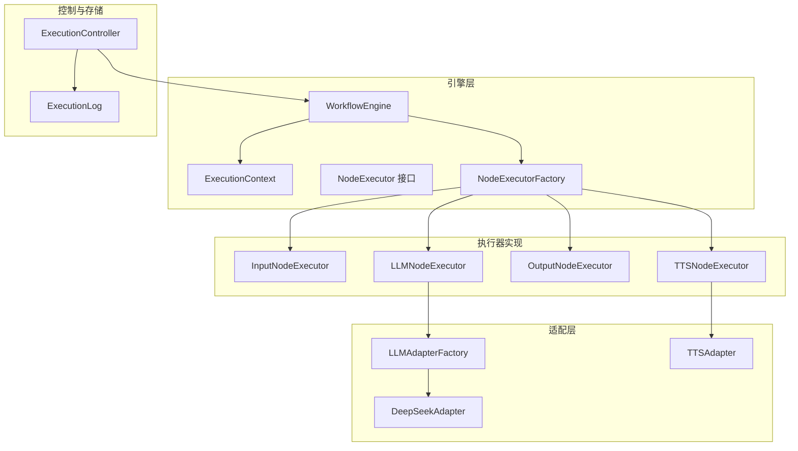
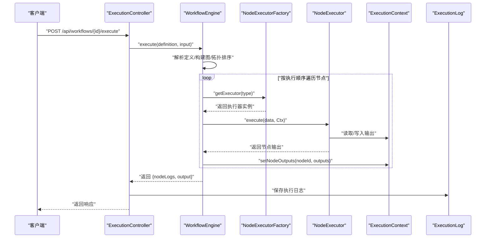
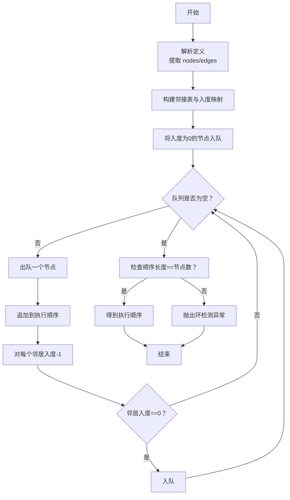
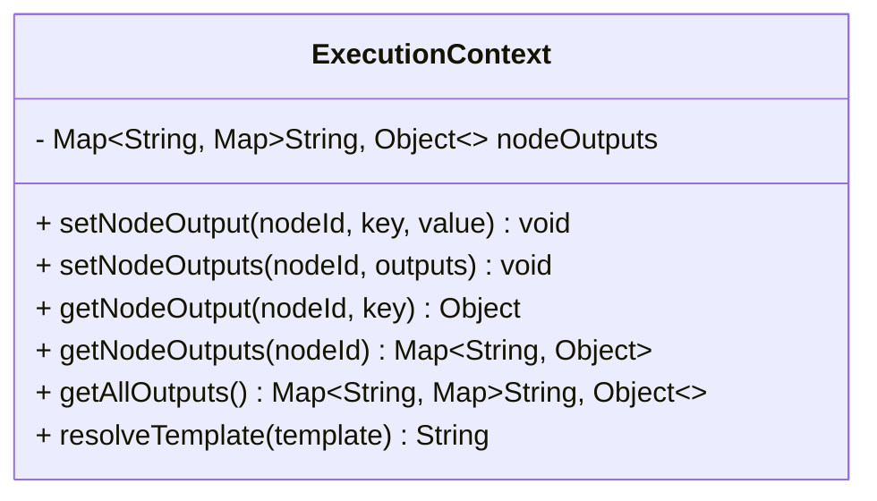
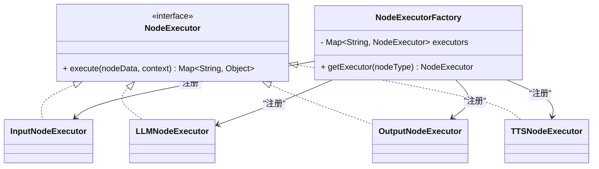
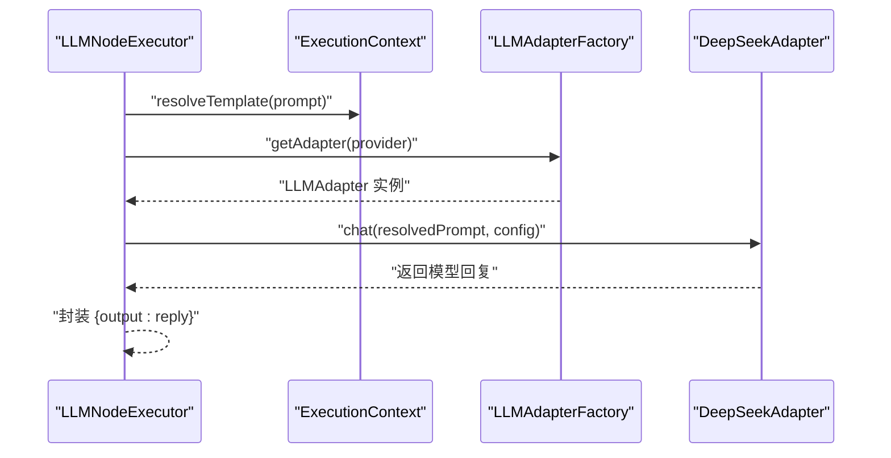
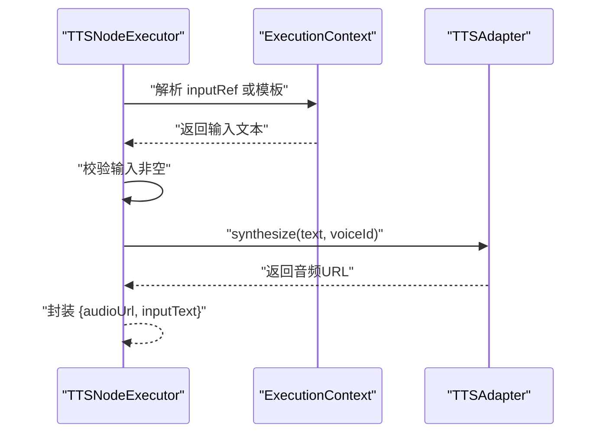
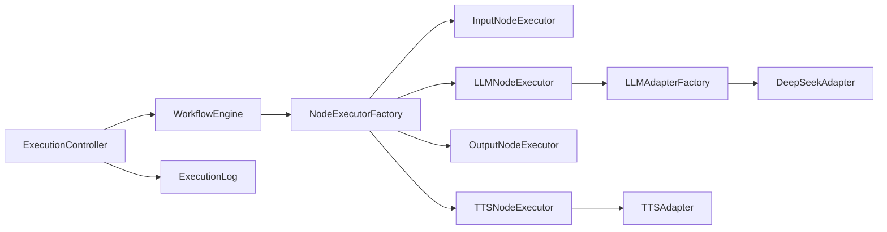

# 工作流引擎

<cite>
**本文引用的文件**
- [WorkflowEngine.java](file://backend/src/main/java/com/paiagent/engine/WorkflowEngine.java)
- [ExecutionContext.java](file://backend/src/main/java/com/paiagent/engine/ExecutionContext.java)
- [NodeExecutor.java](file://backend/src/main/java/com/paiagent/engine/NodeExecutor.java)
- [NodeExecutorFactory.java](file://backend/src/main/java/com/paiagent/engine/NodeExecutorFactory.java)
- [InputNodeExecutor.java](file://backend/src/main/java/com/paiagent/engine/executors/InputNodeExecutor.java)
- [LLMNodeExecutor.java](file://backend/src/main/java/com/paiagent/engine/executors/LLMNodeExecutor.java)
- [OutputNodeExecutor.java](file://backend/src/main/java/com/paiagent/engine/executors/OutputNodeExecutor.java)
- [TTSNodeExecutor.java](file://backend/src/main/java/com/paiagent/engine/executors/TTSNodeExecutor.java)
- [LLMAdapterFactory.java](file://backend/src/main/java/com/paiagent/adapter/LLMAdapterFactory.java)
- [DeepSeekAdapter.java](file://backend/src/main/java/com/paiagent/adapter/impl/DeepSeekAdapter.java)
- [TTSAdapter.java](file://backend/src/main/java/com/paiagent/adapter/TTSAdapter.java)
- [ExecutionController.java](file://backend/src/main/java/com/paiagent/controller/ExecutionController.java)
- [ExecutionLog.java](file://backend/src/main/java/com/paiagent/model/entity/ExecutionLog.java)
- [application.yml](file://backend/src/main/resources/application.yml)
</cite>

## 目录
1. [引言](#引言)
2. [项目结构](#项目结构)
3. [核心组件](#核心组件)
4. [架构总览](#架构总览)
5. [详细组件分析](#详细组件分析)
6. [依赖分析](#依赖分析)
7. [性能考虑](#性能考虑)
8. [故障排查指南](#故障排查指南)
9. [结论](#结论)
10. [附录](#附录)

## 引言
本技术文档围绕 PaiAgent 的工作流引擎展开，系统性阐述工作流执行的核心原理与实现细节，重点包括：
- 拓扑排序算法在工作流中的应用与执行顺序保证机制
- ExecutionContext 执行上下文的设计与变量解析、模板替换、状态管理
- NodeExecutor 接口的统一抽象与 NodeExecutorFactory 工厂模式
- 各类节点执行器（InputNodeExecutor、LLMNodeExecutor、OutputNodeExecutor、TTSNodeExecutor）的功能与执行逻辑
- 工作流执行流程图与节点间数据流转示例，帮助开发者快速理解复杂工作流的执行机制

## 项目结构
后端采用分层与按职责划分的组织方式：
- engine：工作流引擎核心（WorkflowEngine、ExecutionContext、NodeExecutor 及其工厂）
- engine/executors：具体节点执行器实现
- adapter：对外部服务（LLM/TTS）的适配层
- controller：REST 控制器（执行入口）
- model/entity：持久化实体（执行日志等）
- resources：配置文件（application.yml）

图表来源
- [WorkflowEngine.java:1-136](file://backend/src/main/java/com/paiagent/engine/WorkflowEngine.java#L1-L136)
- [ExecutionContext.java:1-63](file://backend/src/main/java/com/paiagent/engine/ExecutionContext.java#L1-L63)
- [NodeExecutor.java:1-17](file://backend/src/main/java/com/paiagent/engine/NodeExecutor.java#L1-L17)
- [NodeExecutorFactory.java:1-29](file://backend/src/main/java/com/paiagent/engine/NodeExecutorFactory.java#L1-L29)
- [InputNodeExecutor.java:1-19](file://backend/src/main/java/com/paiagent/engine/executors/InputNodeExecutor.java#L1-L19)
- [LLMNodeExecutor.java:1-48](file://backend/src/main/java/com/paiagent/engine/executors/LLMNodeExecutor.java#L1-L48)
- [OutputNodeExecutor.java:1-47](file://backend/src/main/java/com/paiagent/engine/executors/OutputNodeExecutor.java#L1-L47)
- [TTSNodeExecutor.java:1-48](file://backend/src/main/java/com/paiagent/engine/executors/TTSNodeExecutor.java#L1-L48)
- [LLMAdapterFactory.java:1-52](file://backend/src/main/java/com/paiagent/adapter/LLMAdapterFactory.java#L1-L52)
- [DeepSeekAdapter.java:1-61](file://backend/src/main/java/com/paiagent/adapter/impl/DeepSeekAdapter.java#L1-L61)
- [TTSAdapter.java:1-108](file://backend/src/main/java/com/paiagent/adapter/TTSAdapter.java#L1-L108)
- [ExecutionController.java:1-93](file://backend/src/main/java/com/paiagent/controller/ExecutionController.java#L1-L93)
- [ExecutionLog.java:1-37](file://backend/src/main/java/com/paiagent/model/entity/ExecutionLog.java#L1-L37)

章节来源
- [WorkflowEngine.java:1-136](file://backend/src/main/java/com/paiagent/engine/WorkflowEngine.java#L1-L136)
- [application.yml:1-44](file://backend/src/main/resources/application.yml#L1-L44)

## 核心组件
- WorkflowEngine：工作流执行主控制器，负责解析定义、构建邻接表与入度映射、执行拓扑排序、按序调度节点、收集输出与日志，并进行最终结果汇总。
- ExecutionContext：跨节点的状态容器，支持节点输出写入、读取、全局模板解析与占位符替换。
- NodeExecutor：节点执行器统一接口，所有节点类型实现该接口以提供可插拔的执行能力。
- NodeExecutorFactory：基于类型注册的工厂，负责根据节点类型返回对应的执行器实例。

章节来源
- [WorkflowEngine.java:20-108](file://backend/src/main/java/com/paiagent/engine/WorkflowEngine.java#L20-L108)
- [ExecutionContext.java:10-61](file://backend/src/main/java/com/paiagent/engine/ExecutionContext.java#L10-L61)
- [NodeExecutor.java:8-15](file://backend/src/main/java/com/paiagent/engine/NodeExecutor.java#L8-L15)
- [NodeExecutorFactory.java:10-27](file://backend/src/main/java/com/paiagent/engine/NodeExecutorFactory.java#L10-L27)

## 架构总览
工作流执行从控制器接收请求，调用 WorkflowEngine 执行，引擎通过工厂选择具体节点执行器，执行器在 ExecutionContext 上下文中读写数据并调用外部适配器完成实际任务，最终生成节点日志与最终输出。

图表来源
- [ExecutionController.java:37-82](file://backend/src/main/java/com/paiagent/controller/ExecutionController.java#L37-L82)
- [WorkflowEngine.java:21-108](file://backend/src/main/java/com/paiagent/engine/WorkflowEngine.java#L21-L108)
- [NodeExecutorFactory.java:21-27](file://backend/src/main/java/com/paiagent/engine/NodeExecutorFactory.java#L21-L27)
- [ExecutionContext.java:13-32](file://backend/src/main/java/com/paiagent/engine/ExecutionContext.java#L13-L32)

## 详细组件分析

### 拓扑排序与执行顺序保证
- 定义解析：从 JSON 中提取节点列表与边列表，构建邻接表与入度映射。
- Kahn 算法：使用队列从入度为 0 的节点开始，逐个出队并更新邻居入度，最终得到执行顺序；若顺序长度小于节点数，说明存在环，抛出异常。
- 执行策略：按拓扑序依次执行，每个节点执行前注入用户输入（针对输入节点），执行后记录节点日志并写入上下文。

图表来源
- [WorkflowEngine.java:30-49](file://backend/src/main/java/com/paiagent/engine/WorkflowEngine.java#L30-L49)
- [WorkflowEngine.java:110-134](file://backend/src/main/java/com/paiagent/engine/WorkflowEngine.java#L110-L134)

章节来源
- [WorkflowEngine.java:21-108](file://backend/src/main/java/com/paiagent/engine/WorkflowEngine.java#L21-L108)

### ExecutionContext 执行上下文
- 数据结构：以 nodeId 为键，映射到该节点输出键值对的 Map。
- 写入：支持单字段写入与整包覆盖写入。
- 读取：支持按节点与键读取，或一次性读取全部输出。
- 模板解析：支持形如 {{nodeId.key}} 或简写 {{nodeId}} 的占位符解析，将引用替换为上下文中的实际值。

图表来源
- [ExecutionContext.java:10-61](file://backend/src/main/java/com/paiagent/engine/ExecutionContext.java#L10-L61)

章节来源
- [ExecutionContext.java:13-32](file://backend/src/main/java/com/paiagent/engine/ExecutionContext.java#L13-L32)
- [ExecutionContext.java:38-61](file://backend/src/main/java/com/paiagent/engine/ExecutionContext.java#L38-L61)

### NodeExecutor 接口与 NodeExecutorFactory 工厂
- NodeExecutor：统一的节点执行接口，要求实现 execute 方法，接收节点数据与上下文，返回该节点的输出键值对。
- NodeExecutorFactory：集中注册与管理节点执行器，按类型查找并返回对应实例；未知类型时抛出异常。

图表来源
- [NodeExecutor.java:8-15](file://backend/src/main/java/com/paiagent/engine/NodeExecutor.java#L8-L15)
- [NodeExecutorFactory.java:10-27](file://backend/src/main/java/com/paiagent/engine/NodeExecutorFactory.java#L10-L27)
- [InputNodeExecutor.java:9-17](file://backend/src/main/java/com/paiagent/engine/executors/InputNodeExecutor.java#L9-L17)
- [LLMNodeExecutor.java:12-46](file://backend/src/main/java/com/paiagent/engine/executors/LLMNodeExecutor.java#L12-L46)
- [OutputNodeExecutor.java:10-44](file://backend/src/main/java/com/paiagent/engine/executors/OutputNodeExecutor.java#L10-L44)
- [TTSNodeExecutor.java:11-46](file://backend/src/main/java/com/paiagent/engine/executors/TTSNodeExecutor.java#L11-L46)

章节来源
- [NodeExecutor.java:8-15](file://backend/src/main/java/com/paiagent/engine/NodeExecutor.java#L8-L15)
- [NodeExecutorFactory.java:14-27](file://backend/src/main/java/com/paiagent/engine/NodeExecutorFactory.java#L14-L27)

### 节点执行器实现

#### InputNodeExecutor
- 功能：将用户输入注入到节点输出中，供后续节点引用。
- 关键点：读取 nodeData 中的 _userInput 字段，写入 output 键。

章节来源
- [InputNodeExecutor.java:11-17](file://backend/src/main/java/com/paiagent/engine/executors/InputNodeExecutor.java#L11-L17)
- [WorkflowEngine.java:64-66](file://backend/src/main/java/com/paiagent/engine/WorkflowEngine.java#L64-L66)

#### LLMNodeExecutor
- 功能：根据 provider/model/temperature/maxTokens 等参数，结合模板解析后的提示词，调用 LLM 适配器生成回复。
- 关键点：模板解析、参数默认值、调用适配器并返回 output。

图表来源
- [LLMNodeExecutor.java:21-46](file://backend/src/main/java/com/paiagent/engine/executors/LLMNodeExecutor.java#L21-L46)
- [LLMAdapterFactory.java:44-50](file://backend/src/main/java/com/paiagent/adapter/LLMAdapterFactory.java#L44-L50)
- [DeepSeekAdapter.java:31-58](file://backend/src/main/java/com/paiagent/adapter/impl/DeepSeekAdapter.java#L31-L58)

章节来源
- [LLMNodeExecutor.java:21-46](file://backend/src/main/java/com/paiagent/engine/executors/LLMNodeExecutor.java#L21-L46)
- [LLMAdapterFactory.java:36-50](file://backend/src/main/java/com/paiagent/adapter/LLMAdapterFactory.java#L36-L50)

#### OutputNodeExecutor
- 功能：聚合来自上游节点的输出，支持多键映射与响应模板渲染；自动识别音频链接并透传。
- 关键点：解析 outputs 列表、模板渲染、音频识别。

章节来源
- [OutputNodeExecutor.java:17-44](file://backend/src/main/java/com/paiagent/engine/executors/OutputNodeExecutor.java#L17-L44)

#### TTSNodeExecutor
- 功能：根据输入引用或模板解析文本，调用 TTS 适配器合成音频并返回音频 URL。
- 关键点：输入解析、空值校验、调用适配器并返回结果。

图表来源
- [TTSNodeExecutor.java:20-46](file://backend/src/main/java/com/paiagent/engine/executors/TTSNodeExecutor.java#L20-L46)
- [TTSAdapter.java:40-59](file://backend/src/main/java/com/paiagent/adapter/TTSAdapter.java#L40-L59)

章节来源
- [TTSNodeExecutor.java:20-46](file://backend/src/main/java/com/paiagent/engine/executors/TTSNodeExecutor.java#L20-L46)
- [TTSAdapter.java:40-59](file://backend/src/main/java/com/paiagent/adapter/TTSAdapter.java#L40-L59)

### 适配层与外部集成
- LLMAdapterFactory：集中管理多个 LLM 提供商适配器（DeepSeek、Qwen、ChatGLM、AIPing），按 provider 返回对应实例。
- DeepSeekAdapter：遵循 OpenAI 兼容格式，构造请求体并解析响应内容。
- TTSAdapter：支持外部 TTS API 与本地占位生成，确保音频目录存在并返回可访问的音频 URL。

章节来源
- [LLMAdapterFactory.java:36-50](file://backend/src/main/java/com/paiagent/adapter/LLMAdapterFactory.java#L36-L50)
- [DeepSeekAdapter.java:31-58](file://backend/src/main/java/com/paiagent/adapter/impl/DeepSeekAdapter.java#L31-L58)
- [TTSAdapter.java:40-106](file://backend/src/main/java/com/paiagent/adapter/TTSAdapter.java#L40-L106)

### 控制器与执行日志
- ExecutionController：提供工作流执行接口，负责加载工作流定义、调用引擎、记录执行日志并返回结果。
- ExecutionLog：持久化执行信息（输入、输出、状态、耗时、节点日志等）。

章节来源
- [ExecutionController.java:37-82](file://backend/src/main/java/com/paiagent/controller/ExecutionController.java#L37-L82)
- [ExecutionLog.java:11-36](file://backend/src/main/java/com/paiagent/model/entity/ExecutionLog.java#L11-L36)

## 依赖分析
- 组件耦合：WorkflowEngine 依赖 NodeExecutorFactory；各执行器依赖适配器；控制器依赖引擎与仓储。
- 外部依赖：OkHttp 客户端用于 HTTP 请求；Jackson 用于 JSON 解析；SQLite/JPA 用于持久化。
- 配置来源：application.yml 提供 LLM/TTS 基础地址与密钥、JWT 密钥、存储路径等。

图表来源
- [ExecutionController.java:27-35](file://backend/src/main/java/com/paiagent/controller/ExecutionController.java#L27-L35)
- [WorkflowEngine.java:15-18](file://backend/src/main/java/com/paiagent/engine/WorkflowEngine.java#L15-L18)
- [NodeExecutorFactory.java:14-19](file://backend/src/main/java/com/paiagent/engine/NodeExecutorFactory.java#L14-L19)
- [LLMAdapterFactory.java:36-50](file://backend/src/main/java/com/paiagent/adapter/LLMAdapterFactory.java#L36-L50)
- [TTSAdapter.java:17-27](file://backend/src/main/java/com/paiagent/adapter/TTSAdapter.java#L17-L27)

章节来源
- [application.yml:16-44](file://backend/src/main/resources/application.yml#L16-L44)

## 性能考虑
- 拓扑排序：时间复杂度 O(V+E)，适合中等规模工作流；建议避免循环依赖以确保线性执行。
- 模板解析：字符串扫描与替换，复杂度与模板长度和引用数量相关；建议减少不必要的嵌套引用。
- 外部调用：LLM/TTS 为 IO 密集型，注意超时设置与并发控制；可引入连接池与重试策略。
- 日志与序列化：节点日志与最终输出需序列化，建议在控制器层统一处理，避免重复转换。

## 故障排查指南
- 环路检测：当工作流包含环时，拓扑排序阶段会抛出异常；请检查边的方向与连接完整性。
- 未知节点类型：工厂未注册该类型时抛出异常；确认节点类型拼写与注册表一致。
- LLM/TTS 失败：适配器会抛出运行时异常；检查配置文件中的 API Key 与 Base URL，以及网络连通性。
- TTS 输入为空：当 inputRef 解析为空时抛出非法参数异常；检查上游节点输出键或模板引用。
- 执行失败日志：控制器捕获异常并记录执行日志，可通过查询接口获取详情。

章节来源
- [WorkflowEngine.java:130-132](file://backend/src/main/java/com/paiagent/engine/WorkflowEngine.java#L130-L132)
- [NodeExecutorFactory.java:23-26](file://backend/src/main/java/com/paiagent/engine/NodeExecutorFactory.java#L23-L26)
- [LLMAdapterFactory.java:46-49](file://backend/src/main/java/com/paiagent/adapter/LLMAdapterFactory.java#L46-L49)
- [TTSNodeExecutor.java:35-37](file://backend/src/main/java/com/paiagent/engine/executors/TTSNodeExecutor.java#L35-L37)
- [ExecutionController.java:65-81](file://backend/src/main/java/com/paiagent/controller/ExecutionController.java#L65-L81)

## 结论
PaiAgent 工作流引擎通过拓扑排序保证确定性的执行顺序，借助 ExecutionContext 实现跨节点的数据传递与模板解析，利用 NodeExecutor 抽象与工厂模式实现可扩展的节点执行体系。配合适配层与控制器，形成从请求到执行再到日志的完整闭环。该设计既满足易扩展的需求，又便于调试与监控。

## 附录
- 配置要点：在 application.yml 中配置 LLM/TTS 的 API Key 与 Base URL，以及存储路径；JWT 密钥建议生产环境覆盖默认值。
- 扩展建议：新增节点类型只需实现 NodeExecutor 并在工厂注册；新增 LLM/TTS 提供商只需实现对应适配器并在工厂注册。

章节来源
- [application.yml:16-44](file://backend/src/main/resources/application.yml#L16-L44)
- [NodeExecutorFactory.java:14-19](file://backend/src/main/java/com/paiagent/engine/NodeExecutorFactory.java#L14-L19)
- [LLMAdapterFactory.java:36-42](file://backend/src/main/java/com/paiagent/adapter/LLMAdapterFactory.java#L36-L42)