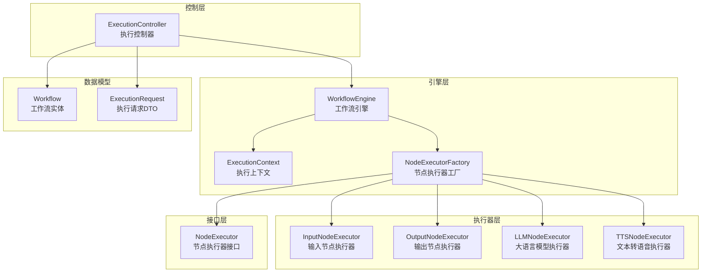
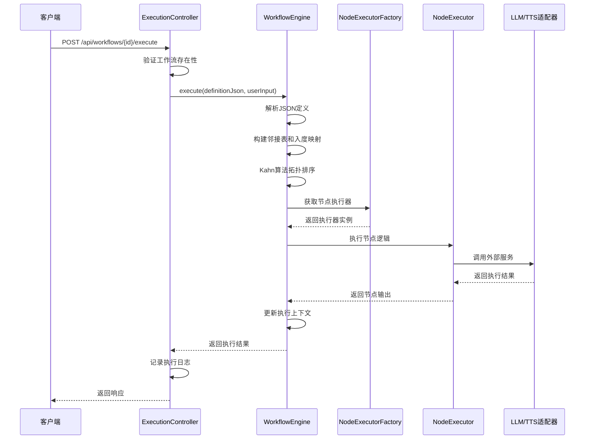
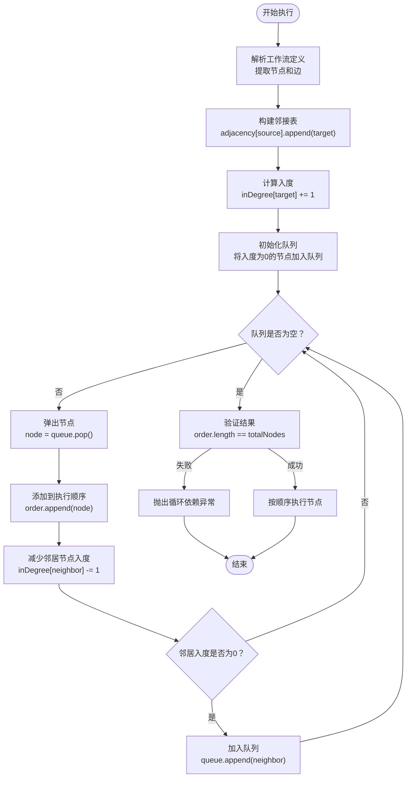
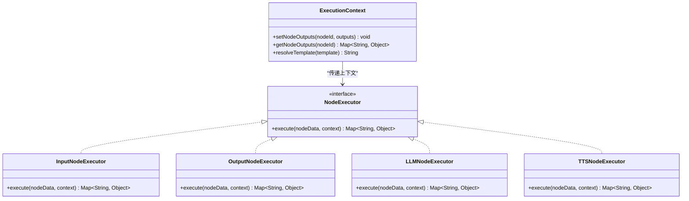
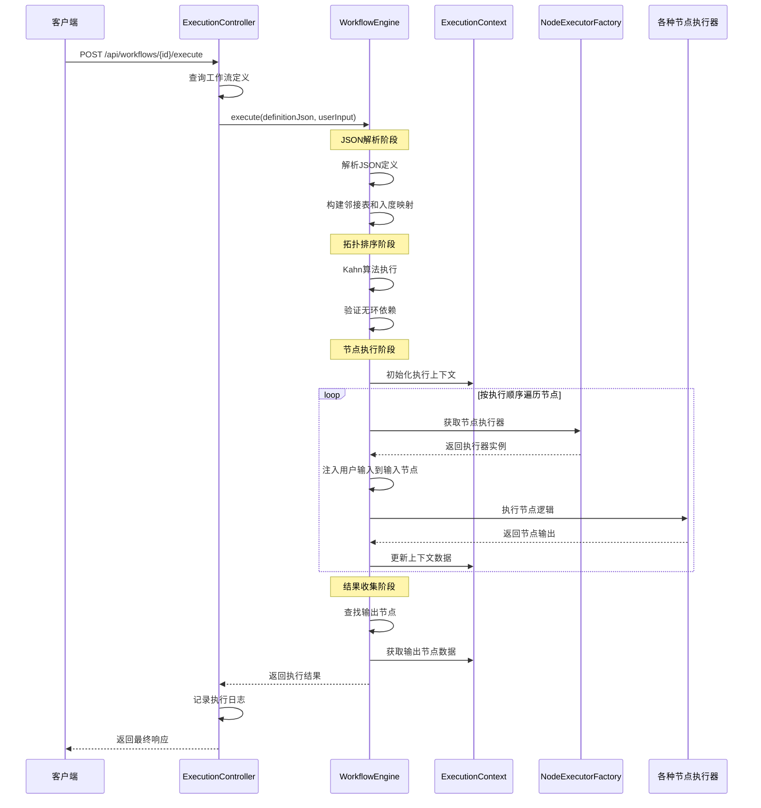
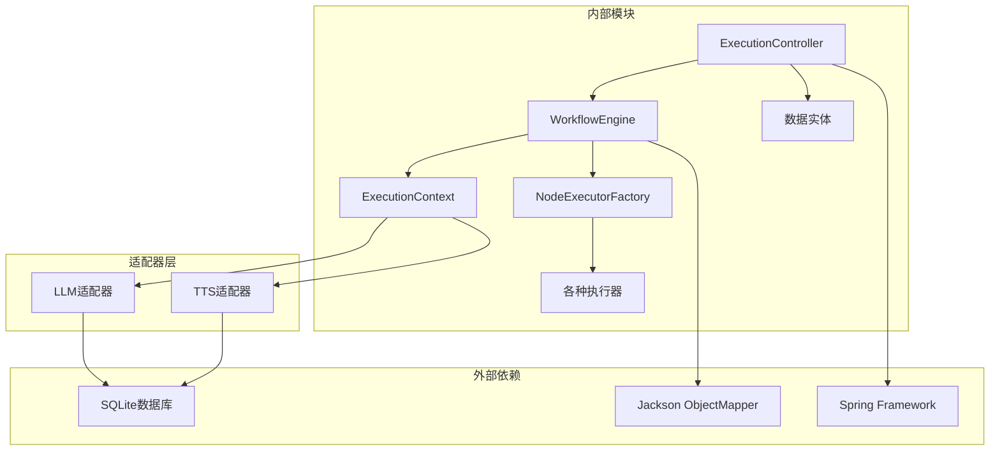

# 工作流执行核心

<cite>
**本文档引用的文件**
- [WorkflowEngine.java](file://backend/src/main/java/com/paiagent/engine/WorkflowEngine.java)
- [ExecutionContext.java](file://backend/src/main/java/com/paiagent/engine/ExecutionContext.java)
- [NodeExecutor.java](file://backend/src/main/java/com/paiagent/engine/NodeExecutor.java)
- [NodeExecutorFactory.java](file://backend/src/main/java/com/paiagent/engine/NodeExecutorFactory.java)
- [InputNodeExecutor.java](file://backend/src/main/java/com/paiagent/engine/executors/InputNodeExecutor.java)
- [OutputNodeExecutor.java](file://backend/src/main/java/com/paiagent/engine/executors/OutputNodeExecutor.java)
- [LLMNodeExecutor.java](file://backend/src/main/java/com/paiagent/engine/executors/LLMNodeExecutor.java)
- [TTSNodeExecutor.java](file://backend/src/main/java/com/paiagent/engine/executors/TTSNodeExecutor.java)
- [ExecutionController.java](file://backend/src/main/java/com/paiagent/controller/ExecutionController.java)
- [Workflow.java](file://backend/src/main/java/com/paiagent/model/entity/Workflow.java)
- [ExecutionRequest.java](file://backend/src/main/java/com/paiagent/model/dto/ExecutionRequest.java)
- [application.yml](file://backend/src/main/resources/application.yml)
</cite>

## 目录
1. [简介](#简介)
2. [项目结构](#项目结构)
3. [核心组件](#核心组件)
4. [架构概览](#架构概览)
5. [详细组件分析](#详细组件分析)
6. [依赖分析](#依赖分析)
7. [性能考虑](#性能考虑)
8. [故障排除指南](#故障排除指南)
9. [结论](#结论)

## 简介

工作流执行核心是PaiAgent系统中负责解析和执行JSON格式工作流定义的关键模块。该系统支持复杂的多节点工作流，包括输入节点、输出节点、大语言模型节点和文本转语音节点等不同类型的工作流节点。系统采用拓扑排序算法确保工作流的正确执行顺序，并通过上下文机制在节点间传递数据。

## 项目结构

工作流执行核心位于后端Java代码的engine包中，主要包含以下关键组件：



**图表来源**
- [WorkflowEngine.java:1-136](file://backend/src/main/java/com/paiagent/engine/WorkflowEngine.java#L1-L136)
- [ExecutionContext.java:1-63](file://backend/src/main/java/com/paiagent/engine/ExecutionContext.java#L1-L63)
- [NodeExecutorFactory.java:1-29](file://backend/src/main/java/com/paiagent/engine/NodeExecutorFactory.java#L1-L29)

**章节来源**
- [WorkflowEngine.java:1-136](file://backend/src/main/java/com/paiagent/engine/WorkflowEngine.java#L1-L136)
- [ExecutionController.java:1-93](file://backend/src/main/java/com/paiagent/controller/ExecutionController.java#L1-L93)

## 核心组件

### WorkflowEngine - 工作流引擎

WorkflowEngine是整个工作流执行系统的核心，负责解析JSON工作流定义、执行拓扑排序算法、管理节点执行顺序以及收集最终结果。

**主要职责：**
- JSON工作流定义解析
- 拓扑排序算法实现
- 节点执行调度
- 结果收集和日志记录

**关键特性：**
- 支持多种节点类型（input、output、llm、tts）
- 实现循环依赖检测
- 提供详细的执行日志
- 错误处理和异常传播

**章节来源**
- [WorkflowEngine.java:10-136](file://backend/src/main/java/com/paiagent/engine/WorkflowEngine.java#L10-L136)

### ExecutionContext - 执行上下文

ExecutionContext作为工作流执行过程中的数据存储中心，负责在不同节点之间传递和共享数据。

**核心功能：**
- 存储节点输出结果
- 模板变量解析
- 节点间数据引用解析

**数据结构：**
- `Map<String, Map<String, Object>> nodeOutputs` - 存储每个节点的输出数据
- 支持模板字符串中的变量替换，如"{{nodeId.key}}"

**章节来源**
- [ExecutionContext.java:10-63](file://backend/src/main/java/com/paiagent/engine/ExecutionContext.java#L10-L63)

### NodeExecutorFactory - 节点执行器工厂

NodeExecutorFactory实现了工厂模式，负责根据节点类型动态创建相应的执行器实例。

**注册的执行器类型：**
- `input`: InputNodeExecutor - 处理用户输入
- `output`: OutputNodeExecutor - 处理最终输出
- `llm`: LLMNodeExecutor - 处理大语言模型调用
- `tts`: TTSNodeExecutor - 处理文本转语音

**章节来源**
- [NodeExecutorFactory.java:10-29](file://backend/src/main/java/com/paiagent/engine/NodeExecutorFactory.java#L10-L29)

## 架构概览

工作流执行系统采用分层架构设计，从上到下分别为控制层、引擎层、执行器层和适配器层。



**图表来源**
- [ExecutionController.java:37-82](file://backend/src/main/java/com/paiagent/controller/ExecutionController.java#L37-L82)
- [WorkflowEngine.java:21-108](file://backend/src/main/java/com/paiagent/engine/WorkflowEngine.java#L21-L108)
- [NodeExecutorFactory.java:21-27](file://backend/src/main/java/com/paiagent/engine/NodeExecutorFactory.java#L21-L27)

## 详细组件分析

### JSON工作流定义解析

系统支持标准的JSON格式工作流定义，包含节点和边两个主要部分：

**节点定义结构：**
```json
{
  "nodes": [
    {
      "id": "node_1",
      "type": "input",
      "data": {
        "_userInput": "用户输入内容"
      }
    },
    {
      "id": "node_2", 
      "type": "llm",
      "data": {
        "provider": "deepseek",
        "model": "deepseek-chat",
        "prompt": "生成回复: {{node_1.output}}"
      }
    }
  ],
  "edges": [
    {
      "source": "node_1",
      "target": "node_2"
    }
  ]
}
```

**解析流程：**
1. 使用Jackson ObjectMapper解析JSON字符串
2. 提取nodes和edges数组
3. 验证节点列表非空
4. 构建节点映射表用于快速查找

**章节来源**
- [WorkflowEngine.java:21-49](file://backend/src/main/java/com/paiagent/engine/WorkflowEngine.java#L21-L49)

### 拓扑排序算法实现（Kahn算法）

系统使用Kahn算法确保工作流的正确执行顺序，避免循环依赖问题。



**算法步骤详解：**

1. **邻接表构建**：遍历所有边，建立源节点到目标节点的映射关系
2. **入度计算**：统计每个节点的入度（有多少条边指向该节点）
3. **队列初始化**：将所有入度为0的节点加入队列（这些节点没有前置依赖）
4. **执行循环**：
   - 弹出队列中的节点，添加到执行顺序列表
   - 对于当前节点的所有邻居，将其入度减1
   - 如果邻居的入度变为0，将其加入队列
5. **结果验证**：检查执行顺序中的节点数量是否等于总节点数

**循环依赖检测：**
如果执行完成后节点数量不匹配，说明存在循环依赖，系统会抛出IllegalArgumentException异常。

**章节来源**
- [WorkflowEngine.java:110-134](file://backend/src/main/java/com/paiagent/engine/WorkflowEngine.java#L110-L134)

### 节点执行流程

每个节点的执行都遵循统一的模式，通过NodeExecutor接口实现不同的执行逻辑。



**图表来源**
- [NodeExecutor.java:8-16](file://backend/src/main/java/com/paiagent/engine/NodeExecutor.java#L8-L16)
- [InputNodeExecutor.java:9-18](file://backend/src/main/java/com/paiagent/engine/executors/InputNodeExecutor.java#L9-L18)
- [OutputNodeExecutor.java:10-46](file://backend/src/main/java/com/paiagent/engine/executors/OutputNodeExecutor.java#L10-L46)
- [LLMNodeExecutor.java:12-47](file://backend/src/main/java/com/paiagent/engine/executors/LLMNodeExecutor.java#L12-L47)
- [TTSNodeExecutor.java:11-47](file://backend/src/main/java/com/paiagent/engine/executors/TTSNodeExecutor.java#L11-L47)

**章节来源**
- [NodeExecutor.java:8-16](file://backend/src/main/java/com/paiagent/engine/NodeExecutor.java#L8-L16)
- [ExecutionContext.java:10-63](file://backend/src/main/java/com/paiagent/engine/ExecutionContext.java#L10-L63)

### 执行时序图

以下是完整的执行流程时序图：



**图表来源**
- [ExecutionController.java:37-82](file://backend/src/main/java/com/paiagent/controller/ExecutionController.java#L37-L82)
- [WorkflowEngine.java:21-108](file://backend/src/main/java/com/paiagent/engine/WorkflowEngine.java#L21-L108)

## 依赖分析

系统采用松耦合的设计，通过接口和工厂模式实现组件间的解耦。



**图表来源**
- [WorkflowEngine.java:3-18](file://backend/src/main/java/com/paiagent/engine/WorkflowEngine.java#L3-L18)
- [ExecutionController.java:22-35](file://backend/src/main/java/com/paiagent/controller/ExecutionController.java#L22-L35)

**依赖关系特点：**
- **低耦合高内聚**：各组件职责明确，通过接口通信
- **可扩展性**：新增节点类型只需实现NodeExecutor接口
- **配置驱动**：通过application.yml配置外部服务参数
- **异常隔离**：节点执行异常不会影响整个工作流的执行

**章节来源**
- [NodeExecutorFactory.java:14-19](file://backend/src/main/java/com/paiagent/engine/NodeExecutorFactory.java#L14-L19)
- [application.yml:21-39](file://backend/src/main/resources/application.yml#L21-L39)

## 性能考虑

### 时间复杂度分析

- **JSON解析**：O(n)，其中n为JSON字符串长度
- **邻接表构建**：O(e)，其中e为边的数量
- **Kahn算法**：O(n + e)，其中n为节点数，e为边数
- **节点执行**：O(n × m)，其中m为平均每个节点的执行时间

### 内存优化策略

1. **延迟加载**：只在需要时创建执行器实例
2. **流式处理**：避免一次性加载大量中间结果
3. **缓存机制**：重复使用的模板和配置进行缓存
4. **垃圾回收**：及时释放不再使用的对象引用

### 并发处理

系统目前采用单线程执行模式，适合大多数工作流场景。对于需要并发执行的场景，可以考虑：
- 将独立的节点组并行化执行
- 使用线程池管理执行器
- 实现节点级别的锁机制

## 故障排除指南

### 常见错误类型及解决方案

**1. 循环依赖错误**
- **症状**：执行时抛出IllegalArgumentException异常
- **原因**：工作流定义中存在循环引用
- **解决**：检查edges定义，移除循环依赖

**2. 节点类型未知**
- **症状**：抛出IllegalArgumentException异常，提示未知节点类型
- **原因**：节点type字段不在支持的类型列表中
- **解决**：确认节点类型拼写正确，或扩展NodeExecutorFactory

**3. 输入节点缺失**
- **症状**：执行过程中找不到输入节点
- **原因**：工作流定义中缺少type为"input"的节点
- **解决**：添加输入节点或修改工作流定义

**4. 输出节点未找到**
- **症状**：最终结果中缺少output字段
- **原因**：工作流定义中缺少type为"output"的节点
- **解决**：添加输出节点并正确配置输出映射

### 调试技巧

1. **启用详细日志**：查看nodeLogs中每个节点的执行状态
2. **检查模板语法**：确保模板字符串格式正确
3. **验证节点连接**：确认所有节点都有正确的输入输出连接
4. **测试单个节点**：单独测试复杂节点的执行逻辑

**章节来源**
- [WorkflowEngine.java:81-90](file://backend/src/main/java/com/paiagent/engine/WorkflowEngine.java#L81-L90)
- [ExecutionContext.java:38-61](file://backend/src/main/java/com/paiagent/engine/ExecutionContext.java#L38-L61)

## 结论

工作流执行核心通过精心设计的架构实现了复杂工作流的可靠执行。系统的主要优势包括：

1. **可靠的执行顺序保证**：通过Kahn算法确保无环依赖的工作流正确执行
2. **灵活的节点扩展**：通过工厂模式轻松添加新的节点类型
3. **强大的数据传递机制**：ExecutionContext提供灵活的节点间数据共享
4. **完善的错误处理**：详细的异常信息和日志记录便于问题诊断
5. **清晰的架构分离**：各层职责明确，便于维护和扩展

该系统为PaiAgent平台提供了强大的工作流编排能力，支持从简单的数据处理到复杂的AI应用集成等各种场景。