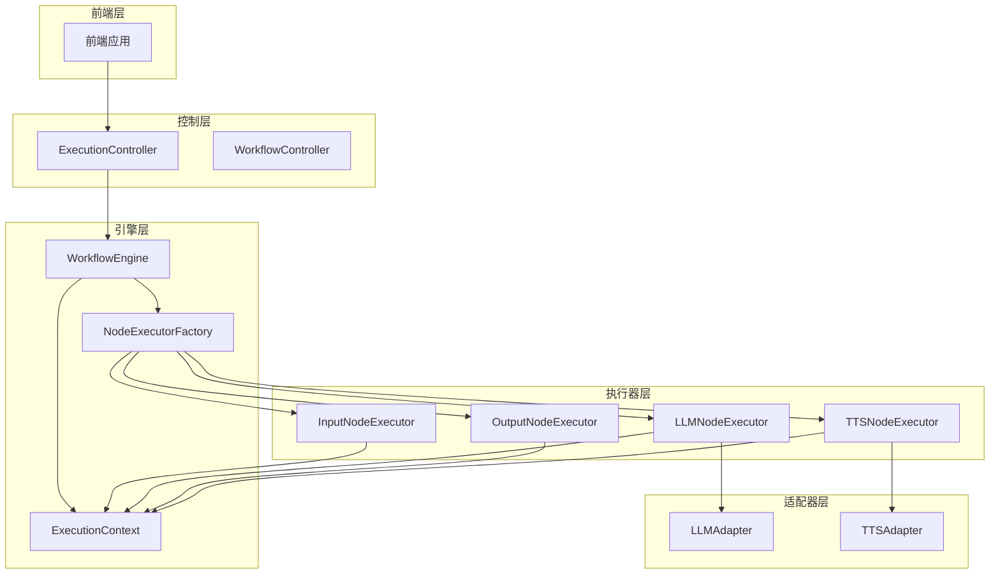
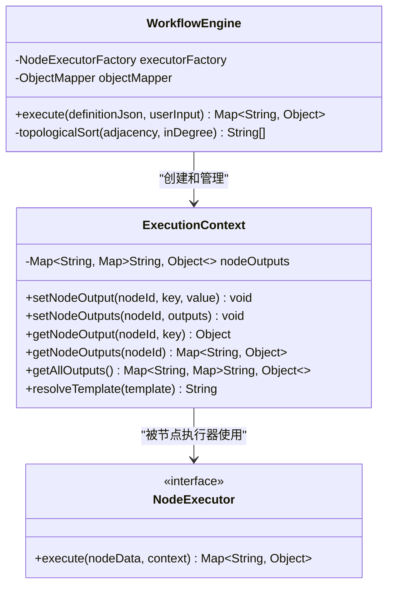
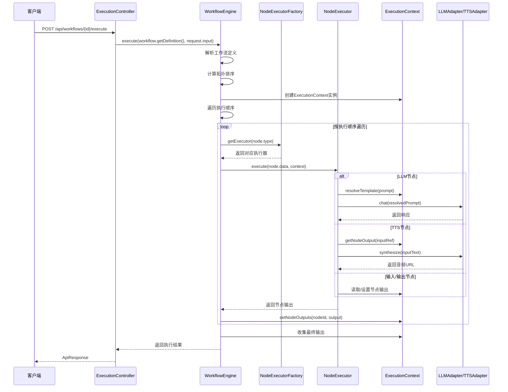
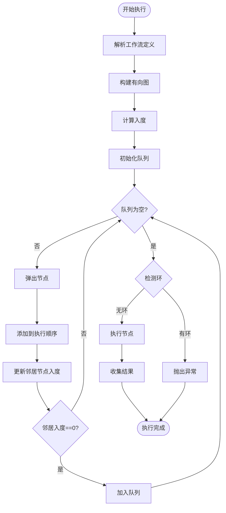
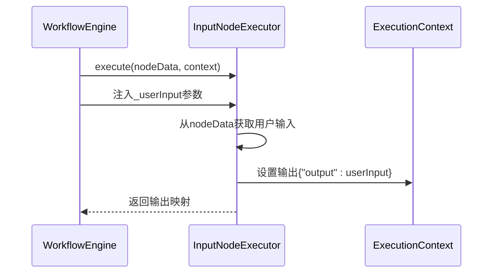
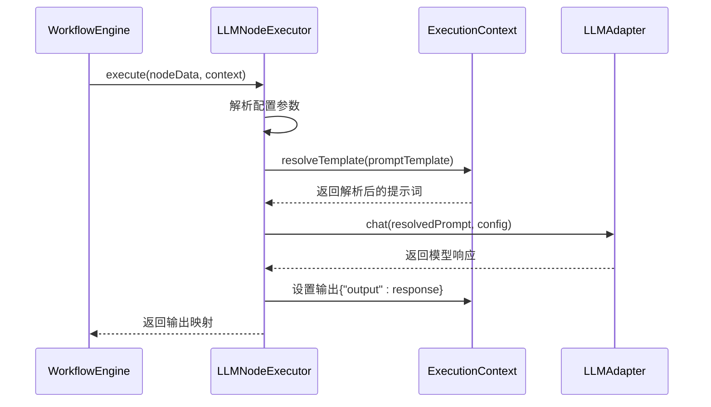
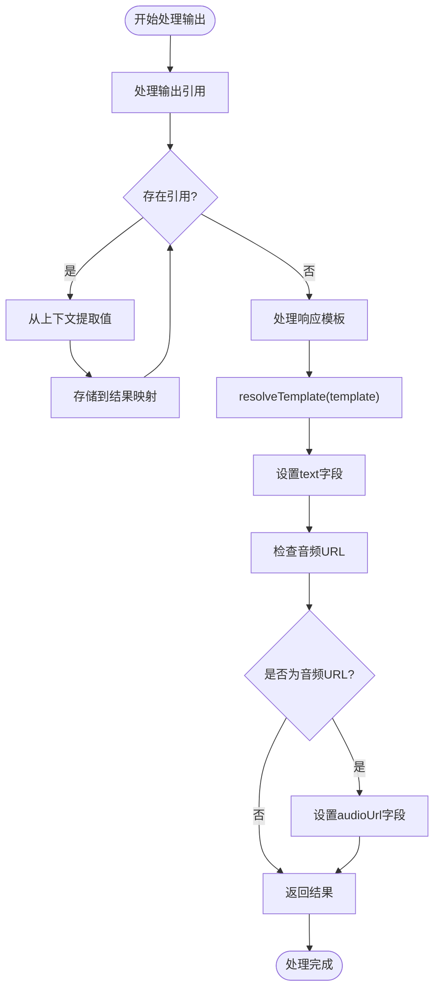
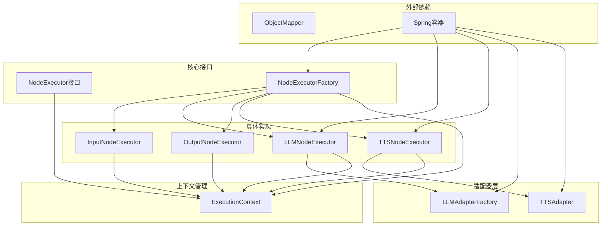

# 执行上下文管理

<cite>
**本文档引用的文件**
- [ExecutionContext.java](file://backend/src/main/java/com/paiagent/engine/ExecutionContext.java)
- [WorkflowEngine.java](file://backend/src/main/java/com/paiagent/engine/WorkflowEngine.java)
- [NodeExecutor.java](file://backend/src/main/java/com/paiagent/engine/NodeExecutor.java)
- [NodeExecutorFactory.java](file://backend/src/main/java/com/paiagent/engine/NodeExecutorFactory.java)
- [InputNodeExecutor.java](file://backend/src/main/java/com/paiagent/engine/executors/InputNodeExecutor.java)
- [LLMNodeExecutor.java](file://backend/src/main/java/com/paiagent/engine/executors/LLMNodeExecutor.java)
- [OutputNodeExecutor.java](file://backend/src/main/java/com/paiagent/engine/executors/OutputNodeExecutor.java)
- [TTSNodeExecutor.java](file://backend/src/main/java/com/paiagent/engine/executors/TTSNodeExecutor.java)
- [ExecutionController.java](file://backend/src/main/java/com/paiagent/controller/ExecutionController.java)
- [ExecutionRequest.java](file://backend/src/main/java/com/paiagent/model/dto/ExecutionRequest.java)
</cite>

## 目录
1. [简介](#简介)
2. [项目结构](#项目结构)
3. [核心组件](#核心组件)
4. [架构概览](#架构概览)
5. [详细组件分析](#详细组件分析)
6. [依赖关系分析](#依赖关系分析)
7. [性能考虑](#性能考虑)
8. [故障排除指南](#故障排除指南)
9. [结论](#结论)

## 简介

执行上下文管理系统是PaigAgent工作流引擎的核心组件，负责在节点间传递和存储中间结果。该系统通过ExecutionContext类提供统一的数据存储接口，支持模板解析、跨节点数据传递和状态管理功能。系统采用工厂模式管理不同类型的节点执行器，实现了可扩展的工作流执行框架。

## 项目结构

PaigAgent项目采用分层架构设计，执行上下文管理位于引擎层的核心位置：



**图表来源**
- [ExecutionController.java:18-93](file://backend/src/main/java/com/paiagent/controller/ExecutionController.java#L18-L93)
- [WorkflowEngine.java:10-136](file://backend/src/main/java/com/paiagent/engine/WorkflowEngine.java#L10-L136)
- [NodeExecutorFactory.java:10-29](file://backend/src/main/java/com/paiagent/engine/NodeExecutorFactory.java#L10-L29)

**章节来源**
- [ExecutionController.java:18-93](file://backend/src/main/java/com/paiagent/controller/ExecutionController.java#L18-L93)
- [WorkflowEngine.java:10-136](file://backend/src/main/java/com/paiagent/engine/WorkflowEngine.java#L10-L136)

## 核心组件

### ExecutionContext类设计

ExecutionContext是执行上下文管理的核心类，采用嵌套HashMap结构存储节点输出数据：



**图表来源**
- [ExecutionContext.java:10-63](file://backend/src/main/java/com/paiagent/engine/ExecutionContext.java#L10-L63)
- [NodeExecutor.java:8-17](file://backend/src/main/java/com/paiagent/engine/NodeExecutor.java#L8-L17)
- [WorkflowEngine.java:10-136](file://backend/src/main/java/com/paiagent/engine/WorkflowEngine.java#L10-L136)

**章节来源**
- [ExecutionContext.java:10-63](file://backend/src/main/java/com/paiagent/engine/ExecutionContext.java#L10-L63)

### 节点执行器体系

系统支持多种类型的节点执行器，每种执行器负责特定的功能：

| 执行器类型 | 功能描述 | 主要用途 |
|------------|----------|----------|
| InputNodeExecutor | 处理用户输入数据 | 接收和验证用户输入 |
| LLMNodeExecutor | 大语言模型调用 | AI对话和文本生成 |
| OutputNodeExecutor | 输出结果处理 | 数据格式化和结果提取 |
| TTSNodeExecutor | 文本转语音处理 | 音频生成和语音合成 |

**章节来源**
- [NodeExecutorFactory.java:10-29](file://backend/src/main/java/com/paiagent/engine/NodeExecutorFactory.java#L10-L29)
- [InputNodeExecutor.java:9-19](file://backend/src/main/java/com/paiagent/engine/executors/InputNodeExecutor.java#L9-L19)
- [LLMNodeExecutor.java:12-48](file://backend/src/main/java/com/paiagent/engine/executors/LLMNodeExecutor.java#L12-L48)
- [OutputNodeExecutor.java:10-47](file://backend/src/main/java/com/paiagent/engine/executors/OutputNodeExecutor.java#L10-L47)
- [TTSNodeExecutor.java:11-48](file://backend/src/main/java/com/paiagent/engine/executors/TTSNodeExecutor.java#L11-L48)

## 架构概览

执行上下文管理系统采用事件驱动的流水线架构，实现了节点间的解耦和可扩展性：



**图表来源**
- [ExecutionController.java:37-82](file://backend/src/main/java/com/paiagent/controller/ExecutionController.java#L37-L82)
- [WorkflowEngine.java:21-108](file://backend/src/main/java/com/paiagent/engine/WorkflowEngine.java#L21-L108)
- [NodeExecutorFactory.java:21-27](file://backend/src/main/java/com/paiagent/engine/NodeExecutorFactory.java#L21-L27)
- [LLMNodeExecutor.java:21-46](file://backend/src/main/java/com/paiagent/engine/executors/LLMNodeExecutor.java#L21-L46)
- [TTSNodeExecutor.java:20-46](file://backend/src/main/java/com/paiagent/engine/executors/TTSNodeExecutor.java#L20-L46)

## 详细组件分析

### ExecutionContext类深度分析

ExecutionContext类提供了完整的节点间数据传递机制：

#### 数据存储结构

```mermaid
graph LR
subgraph "nodeOutputs映射结构"
A[nodeId: String] --> B[Map<String, Object>]
B --> C[key: String] --> D[value: Object]
end
subgraph "模板解析流程"
E[promptTemplate] --> F[resolveTemplate]
F --> G[查找{{nodeId.key}}模式]
G --> H[替换为实际值]
H --> I[返回解析后的字符串]
end
```

**图表来源**
- [ExecutionContext.java:10-63](file://backend/src/main/java/com/paiagent/engine/ExecutionContext.java#L10-L63)

#### 模板解析算法

ExecutionContext实现了智能的模板解析功能，支持以下语法：

| 模板语法 | 描述 | 示例 |
|----------|------|------|
| `{{nodeId.output}}` | 获取指定节点的输出值 | `{{user_input.output}}` |
| `{{nodeId}}` | 简写形式，默认使用output键 | `{{user_input}}` |
| 嵌套引用 | 支持多层模板嵌套 | `{{llm_response.output}}` |

**章节来源**
- [ExecutionContext.java:38-61](file://backend/src/main/java/com/paiagent/engine/ExecutionContext.java#L38-L61)

### WorkflowEngine执行流程

WorkflowEngine负责协调整个工作流的执行过程：

#### 拓扑排序算法



**图表来源**
- [WorkflowEngine.java:110-134](file://backend/src/main/java/com/paiagent/engine/WorkflowEngine.java#L110-L134)

**章节来源**
- [WorkflowEngine.java:21-108](file://backend/src/main/java/com/paiagent/engine/WorkflowEngine.java#L21-L108)

### 节点执行器交互模式

#### 输入节点执行器

InputNodeExecutor专门处理用户输入数据，将用户输入注入到工作流中：



**图表来源**
- [InputNodeExecutor.java:12-17](file://backend/src/main/java/com/paiagent/engine/executors/InputNodeExecutor.java#L12-L17)
- [WorkflowEngine.java:64-66](file://backend/src/main/java/com/paiagent/engine/WorkflowEngine.java#L64-L66)

#### LLM节点执行器

LLMNodeExecutor处理大语言模型调用，展示了上下文模板解析的实际应用：



**图表来源**
- [LLMNodeExecutor.java:21-46](file://backend/src/main/java/com/paiagent/engine/executors/LLMNodeExecutor.java#L21-L46)
- [ExecutionContext.java:38-61](file://backend/src/main/java/com/paiagent/engine/ExecutionContext.java#L38-L61)

**章节来源**
- [LLMNodeExecutor.java:21-46](file://backend/src/main/java/com/paiagent/engine/executors/LLMNodeExecutor.java#L21-L46)

### 输出节点执行器

OutputNodeExecutor负责处理最终输出，支持复杂的数据映射和模板解析：



**图表来源**
- [OutputNodeExecutor.java:14-45](file://backend/src/main/java/com/paiagent/engine/executors/OutputNodeExecutor.java#L14-L45)

**章节来源**
- [OutputNodeExecutor.java:14-45](file://backend/src/main/java/com/paiagent/engine/executors/OutputNodeExecutor.java#L14-L45)

## 依赖关系分析

执行上下文管理系统展现了良好的依赖倒置原则和松耦合设计：



**图表来源**
- [NodeExecutorFactory.java:14-19](file://backend/src/main/java/com/paiagent/engine/NodeExecutorFactory.java#L14-L19)
- [LLMNodeExecutor.java:15-19](file://backend/src/main/java/com/paiagent/engine/executors/LLMNodeExecutor.java#L15-L19)
- [TTSNodeExecutor.java:14-18](file://backend/src/main/java/com/paiagent/engine/executors/TTSNodeExecutor.java#L14-L18)

**章节来源**
- [NodeExecutorFactory.java:10-29](file://backend/src/main/java/com/paiagent/engine/NodeExecutorFactory.java#L10-L29)

### 内存管理策略

系统采用了高效的内存管理策略：

1. **延迟初始化**: nodeOutputs映射采用延迟初始化，只有在需要时才创建子映射
2. **对象复用**: ExecutionContext实例在整个工作流执行过程中复用
3. **垃圾回收友好**: 使用基本数据类型和标准集合类，便于垃圾回收
4. **生命周期管理**: 上下文对象在工作流执行完成后由JVM自动清理

## 性能考虑

### 时间复杂度分析

| 操作 | 时间复杂度 | 说明 |
|------|------------|------|
| setNodeOutput | O(1) | 哈希表插入操作 |
| getNodeOutput | O(1) | 哈希表查找操作 |
| resolveTemplate | O(n*m) | n为模板长度，m为引用数量 |
| 拓扑排序 | O(V+E) | V为节点数，E为边数 |
| 整体执行 | O(V+E) | 受限于拓扑排序 |

### 空间复杂度分析

- **nodeOutputs映射**: O(N*M) - N为节点数，M为平均每个节点的输出键数
- **模板解析**: O(n) - n为模板字符串长度
- **执行日志**: O(L) - L为日志条目数量

### 优化建议

1. **缓存策略**: 对频繁访问的模板解析结果进行缓存
2. **批量操作**: 支持批量设置节点输出以减少方法调用开销
3. **内存池**: 对大型字符串和对象使用内存池技术
4. **异步处理**: 对耗时的LLM和TTS调用使用异步处理

## 故障排除指南

### 常见问题及解决方案

#### 模板解析错误

**问题**: 模板语法不正确导致解析失败
**解决方案**: 
- 检查模板语法是否符合`{{nodeId.key}}`格式
- 确保节点ID和键名存在且正确
- 使用调试模式查看解析前后的模板内容

#### 节点执行失败

**问题**: 节点执行抛出异常
**解决方案**:
- 查看执行日志中的错误信息
- 检查节点配置参数是否正确
- 验证上游节点是否已成功执行

#### 内存溢出问题

**问题**: 大型工作流导致内存不足
**解决方案**:
- 实施分页处理机制
- 优化数据结构存储
- 添加内存使用监控

**章节来源**
- [WorkflowEngine.java:81-90](file://backend/src/main/java/com/paiagent/engine/WorkflowEngine.java#L81-L90)

### 调试技巧

1. **启用详细日志**: 在开发环境中启用DEBUG级别日志
2. **断点调试**: 在关键节点设置断点观察上下文状态
3. **单元测试**: 为每个执行器编写独立的单元测试
4. **性能分析**: 使用性能分析工具监控执行效率

## 结论

执行上下文管理系统通过精心设计的架构实现了高效、可扩展的工作流执行能力。ExecutionContext类提供了简洁而强大的数据存储和模板解析功能，配合工厂模式的节点执行器体系，形成了高度模块化的执行框架。

系统的主要优势包括：
- **清晰的职责分离**: 上下文管理、执行协调和节点处理职责明确
- **灵活的扩展性**: 新的节点类型可以轻松添加到执行器工厂
- **强大的数据传递能力**: 支持复杂的跨节点数据引用和模板解析
- **良好的性能表现**: 采用高效的算法和数据结构设计

未来可以考虑的改进方向：
- 添加执行上下文的持久化支持
- 实现更精细的错误恢复机制
- 增加执行进度的实时监控功能
- 优化大规模工作流的性能表现