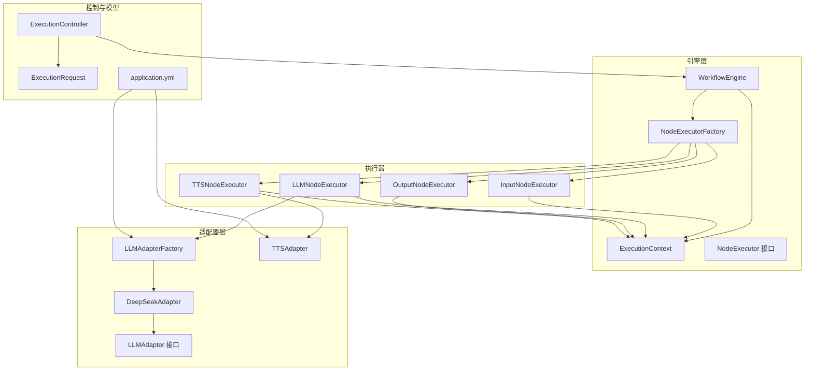
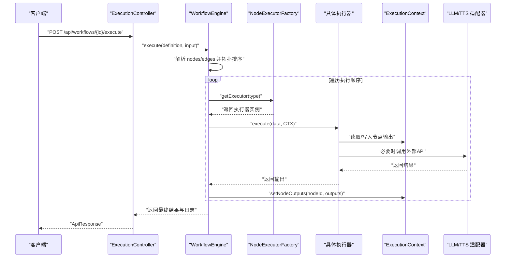
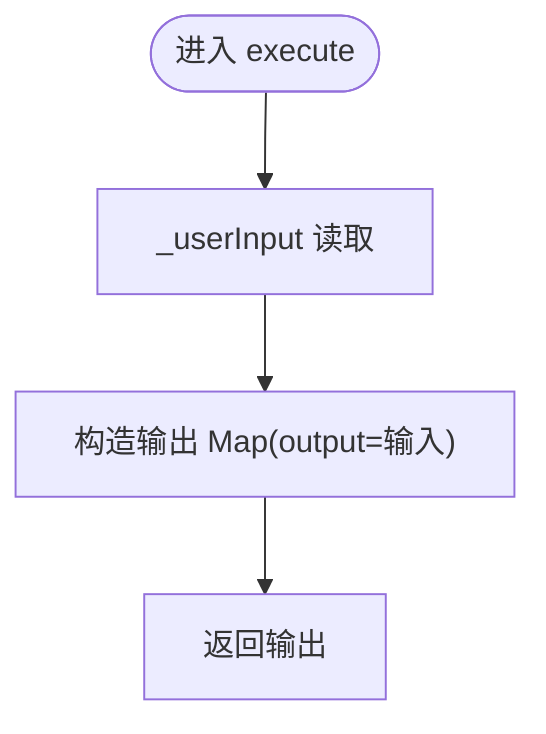
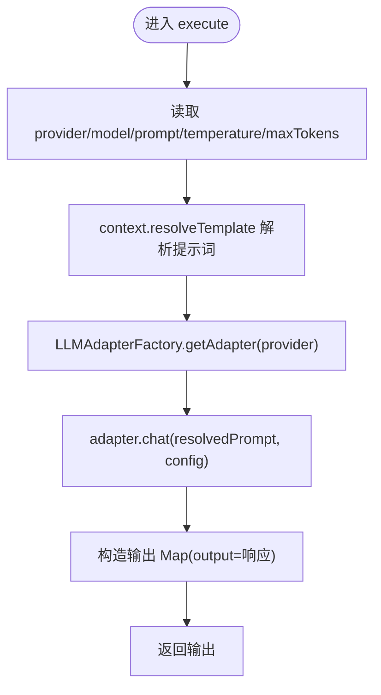
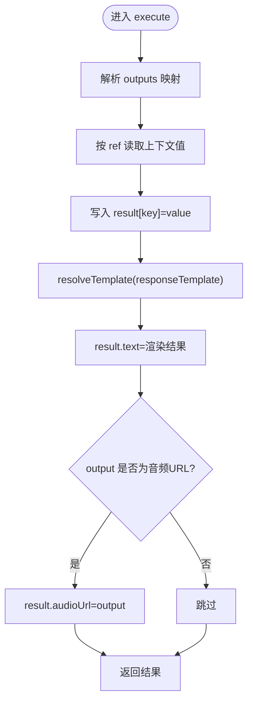
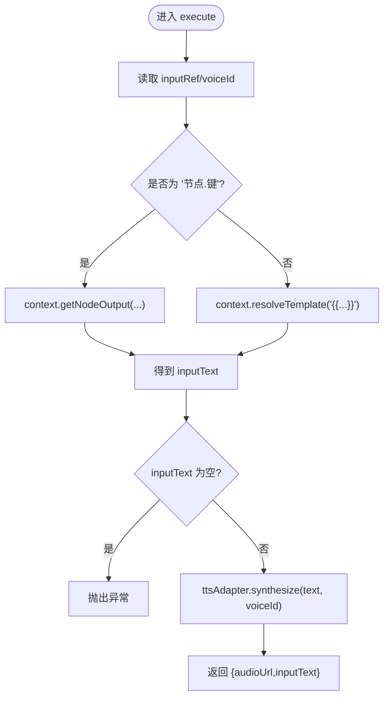
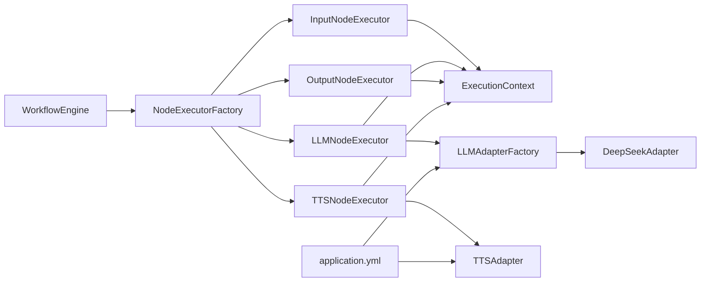

# 节点执行器实现

<cite>
**本文引用的文件**
- [InputNodeExecutor.java](file://backend/src/main/java/com/ paiagent/engine/executors/InputNodeExecutor.java)
- [LLMNodeExecutor.java](file://backend/src/main/java/com/ paiagent/engine/executors/LLMNodeExecutor.java)
- [OutputNodeExecutor.java](file://backend/src/main/java/com/ paiagent/engine/executors/OutputNodeExecutor.java)
- [TTSNodeExecutor.java](file://backend/src/main/java/com/ paiagent/engine/executors/TTSNodeExecutor.java)
- [NodeExecutor.java](file://backend/src/main/java/com/ paiagent/engine/NodeExecutor.java)
- [ExecutionContext.java](file://backend/src/main/java/com/ paiagent/engine/ExecutionContext.java)
- [WorkflowEngine.java](file://backend/src/main/java/com/ paiagent/engine/WorkflowEngine.java)
- [NodeExecutorFactory.java](file://backend/src/main/java/com/ paiagent/engine/NodeExecutorFactory.java)
- [LLMAdapterFactory.java](file://backend/src/main/java/com/ paiagent/adapter/LLMAdapterFactory.java)
- [LLMAdapter.java](file://backend/src/main/java/com/ paiagent/adapter/LLMAdapter.java)
- [DeepSeekAdapter.java](file://backend/src/main/java/com/ paiagent/adapter/impl/DeepSeekAdapter.java)
- [TTSAdapter.java](file://backend/src/main/java/com/ paiagent/adapter/TTSAdapter.java)
- [ExecutionController.java](file://backend/src/main/java/com/ paiagent/controller/ExecutionController.java)
- [ExecutionRequest.java](file://backend/src/main/java/com/ paiagent/model/dto/ExecutionRequest.java)
- [application.yml](file://backend/src/main/resources/application.yml)
</cite>

## 目录
1. [简介](#简介)
2. [项目结构](#项目结构)
3. [核心组件](#核心组件)
4. [架构总览](#架构总览)
5. [详细组件分析](#详细组件分析)
6. [依赖分析](#依赖分析)
7. [性能考虑](#性能考虑)
8. [故障排除指南](#故障排除指南)
9. [结论](#结论)
10. [附录](#附录)

## 简介
本文件面向“节点执行器实现”的参考文档，聚焦以下执行器的输入处理、大语言模型调用、结果收集与文本转语音执行流程：
- InputNodeExecutor：用户输入注入、数据格式与简单校验
- LLMNodeExecutor：参数配置、模板解析、LLM调用与响应处理
- OutputNodeExecutor：输出引用解析、模板渲染、格式化与聚合
- TTSNodeExecutor：文本来源解析、音频合成、URL生成与质量控制

同时给出各执行器的配置参数、使用示例与故障排除建议，并通过图示展示执行器间协作与数据流转。

## 项目结构
后端采用分层与职责分离设计：
- engine 层：执行引擎、上下文、工厂与执行器接口
- adapter 层：LLM/TTS 适配器与具体提供商实现
- controller 层：对外 API 控制器
- model/dto 层：请求/响应与实体模型
- resources：应用配置（含 LLM/TTS/存储等）

图表来源
- [WorkflowEngine.java:1-136](file://backend/src/main/java/com/ paiagent/engine/WorkflowEngine.java#L1-L136)
- [NodeExecutorFactory.java:1-29](file://backend/src/main/java/com/ paiagent/engine/NodeExecutorFactory.java#L1-L29)
- [ExecutionContext.java:1-63](file://backend/src/main/java/com/ paiagent/engine/ExecutionContext.java#L1-L63)
- [NodeExecutor.java:1-17](file://backend/src/main/java/com/ paiagent/engine/NodeExecutor.java#L1-L17)
- [LLMAdapterFactory.java:1-52](file://backend/src/main/java/com/ paiagent/adapter/LLMAdapterFactory.java#L1-L52)
- [LLMAdapter.java:1-17](file://backend/src/main/java/com/ paiagent/adapter/LLMAdapter.java#L1-L17)
- [DeepSeekAdapter.java:1-61](file://backend/src/main/java/com/ paiagent/adapter/impl/DeepSeekAdapter.java#L1-L61)
- [TTSAdapter.java:1-108](file://backend/src/main/java/com/ paiagent/adapter/TTSAdapter.java#L1-L108)
- [ExecutionController.java:1-93](file://backend/src/main/java/com/ paiagent/controller/ExecutionController.java#L1-L93)
- [ExecutionRequest.java:1-12](file://backend/src/main/java/com/ paiagent/model/dto/ExecutionRequest.java#L1-L12)
- [application.yml:1-44](file://backend/src/main/resources/application.yml#L1-L44)

章节来源
- [WorkflowEngine.java:1-136](file://backend/src/main/java/com/ paiagent/engine/WorkflowEngine.java#L1-L136)
- [NodeExecutorFactory.java:1-29](file://backend/src/main/java/com/ paiagent/engine/NodeExecutorFactory.java#L1-L29)
- [ExecutionContext.java:1-63](file://backend/src/main/java/com/ paiagent/engine/ExecutionContext.java#L1-L63)
- [NodeExecutor.java:1-17](file://backend/src/main/java/com/ paiagent/engine/NodeExecutor.java#L1-L17)
- [LLMAdapterFactory.java:1-52](file://backend/src/main/java/com/ paiagent/adapter/LLMAdapterFactory.java#L1-L52)
- [LLMAdapter.java:1-17](file://backend/src/main/java/com/ paiagent/adapter/LLMAdapter.java#L1-L17)
- [DeepSeekAdapter.java:1-61](file://backend/src/main/java/com/ paiagent/adapter/impl/DeepSeekAdapter.java#L1-L61)
- [TTSAdapter.java:1-108](file://backend/src/main/java/com/ paiagent/adapter/TTSAdapter.java#L1-L108)
- [ExecutionController.java:1-93](file://backend/src/main/java/com/ paiagent/controller/ExecutionController.java#L1-L93)
- [ExecutionRequest.java:1-12](file://backend/src/main/java/com/ paiagent/model/dto/ExecutionRequest.java#L1-L12)
- [application.yml:1-44](file://backend/src/main/resources/application.yml#L1-L44)

## 核心组件
- 执行器接口 NodeExecutor：统一的 execute(nodeData, context) 签名，返回键值对写入上下文
- 执行上下文 ExecutionContext：持有各节点输出，支持模板解析与跨节点引用读取
- 工作流引擎 WorkflowEngine：解析工作流定义、拓扑排序、注入用户输入、调度执行器、记录日志与最终输出
- 执行器工厂 NodeExecutorFactory：按节点类型映射到具体执行器实例
- LLM/TTS 适配器：屏蔽不同提供商差异，统一调用入口

章节来源
- [NodeExecutor.java:1-17](file://backend/src/main/java/com/ paiagent/engine/NodeExecutor.java#L1-L17)
- [ExecutionContext.java:1-63](file://backend/src/main/java/com/ paiagent/engine/ExecutionContext.java#L1-L63)
- [WorkflowEngine.java:1-136](file://backend/src/main/java/com/ paiagent/engine/WorkflowEngine.java#L1-L136)
- [NodeExecutorFactory.java:1-29](file://backend/src/main/java/com/ paiagent/engine/NodeExecutorFactory.java#L1-L29)

## 架构总览
下图展示一次工作流执行的端到端流程：控制器接收请求、引擎解析与调度、执行器读写上下文、适配器对接外部服务、最终聚合输出。

图表来源
- [ExecutionController.java:1-93](file://backend/src/main/java/com/ paiagent/controller/ExecutionController.java#L1-L93)
- [WorkflowEngine.java:1-136](file://backend/src/main/java/com/ paiagent/engine/WorkflowEngine.java#L1-L136)
- [NodeExecutorFactory.java:1-29](file://backend/src/main/java/com/ paiagent/engine/NodeExecutorFactory.java#L1-L29)
- [ExecutionContext.java:1-63](file://backend/src/main/java/com/ paiagent/engine/ExecutionContext.java#L1-L63)
- [LLMAdapterFactory.java:1-52](file://backend/src/main/java/com/ paiagent/adapter/LLMAdapterFactory.java#L1-L52)
- [TTSAdapter.java:1-108](file://backend/src/main/java/com/ paiagent/adapter/TTSAdapter.java#L1-L108)

## 详细组件分析

### InputNodeExecutor 输入处理
- 输入注入：在工作流执行前由引擎将用户输入注入到输入节点的数据中
- 数据格式：从节点数据读取用户输入字符串，封装为标准输出键值对
- 验证机制：当前未进行额外校验，保持最小实现以保证可扩展性

图表来源
- [InputNodeExecutor.java:1-19](file://backend/src/main/java/com/ paiagent/engine/executors/InputNodeExecutor.java#L1-L19)
- [WorkflowEngine.java:63-66](file://backend/src/main/java/com/ paiagent/engine/WorkflowEngine.java#L63-L66)

章节来源
- [InputNodeExecutor.java:1-19](file://backend/src/main/java/com/ paiagent/engine/executors/InputNodeExecutor.java#L1-L19)
- [WorkflowEngine.java:63-66](file://backend/src/main/java/com/ paiagent/engine/WorkflowEngine.java#L63-L66)

### LLMNodeExecutor 大语言模型调用
- 参数配置：从节点数据读取提供商、模型、提示词、温度与最大 token 数；均提供默认值
- 模板解析：使用上下文解析提示词中的模板占位符
- 适配器选择：通过工厂按提供商获取对应适配器
- 响应处理：将适配器返回的文本作为标准输出键值对返回

图表来源
- [LLMNodeExecutor.java:1-48](file://backend/src/main/java/com/ paiagent/engine/executors/LLMNodeExecutor.java#L1-L48)
- [LLMAdapterFactory.java:1-52](file://backend/src/main/java/com/ paiagent/adapter/LLMAdapterFactory.java#L1-L52)
- [ExecutionContext.java:38-61](file://backend/src/main/java/com/ paiagent/engine/ExecutionContext.java#L38-L61)

章节来源
- [LLMNodeExecutor.java:1-48](file://backend/src/main/java/com/ paiagent/engine/executors/LLMNodeExecutor.java#L1-L48)
- [LLMAdapterFactory.java:1-52](file://backend/src/main/java/com/ paiagent/adapter/LLMAdapterFactory.java#L1-L52)
- [ExecutionContext.java:38-61](file://backend/src/main/java/com/ paiagent/engine/ExecutionContext.java#L38-L61)

### OutputNodeExecutor 结果收集
- 输出引用解析：遍历节点配置中的输出映射，按“节点.键”解析上下文值并写入新键
- 模板渲染：使用响应模板渲染最终文本输出
- 聚合与透传：若 output 键为音频 URL 或以特定路径开头，则透传为 audioUrl
- 返回：聚合后的结果作为最终输出

图表来源
- [OutputNodeExecutor.java:1-47](file://backend/src/main/java/com/ paiagent/engine/executors/OutputNodeExecutor.java#L1-L47)
- [ExecutionContext.java:21-28](file://backend/src/main/java/com/ paiagent/engine/ExecutionContext.java#L21-L28)
- [ExecutionContext.java:38-61](file://backend/src/main/java/com/ paiagent/engine/ExecutionContext.java#L38-L61)

章节来源
- [OutputNodeExecutor.java:1-47](file://backend/src/main/java/com/ paiagent/engine/executors/OutputNodeExecutor.java#L1-L47)
- [ExecutionContext.java:21-28](file://backend/src/main/java/com/ paiagent/engine/ExecutionContext.java#L21-L28)
- [ExecutionContext.java:38-61](file://backend/src/main/java/com/ paiagent/engine/ExecutionContext.java#L38-L61)

### TTSNodeExecutor 文本转语音执行
- 输入解析：支持“节点.键”或模板变量两种方式解析输入文本
- 调用适配器：调用 TTSAdapter 合成音频，返回本地文件 URL
- 输出：包含音频 URL 与原始输入文本

图表来源
- [TTSNodeExecutor.java:1-48](file://backend/src/main/java/com/ paiagent/engine/executors/TTSNodeExecutor.java#L1-L48)
- [TTSAdapter.java:1-108](file://backend/src/main/java/com/ paiagent/adapter/TTSAdapter.java#L1-L108)
- [ExecutionContext.java:21-28](file://backend/src/main/java/com/ paiagent/engine/ExecutionContext.java#L21-L28)
- [ExecutionContext.java:38-61](file://backend/src/main/java/com/ paiagent/engine/ExecutionContext.java#L38-L61)

章节来源
- [TTSNodeExecutor.java:1-48](file://backend/src/main/java/com/ paiagent/engine/executors/TTSNodeExecutor.java#L1-L48)
- [TTSAdapter.java:1-108](file://backend/src/main/java/com/ paiagent/adapter/TTSAdapter.java#L1-L108)
- [ExecutionContext.java:21-28](file://backend/src/main/java/com/ paiagent/engine/ExecutionContext.java#L21-L28)
- [ExecutionContext.java:38-61](file://backend/src/main/java/com/ paiagent/engine/ExecutionContext.java#L38-L61)

## 依赖分析
- 执行器与上下文：所有执行器均依赖 ExecutionContext 进行读写
- LLM 执行器：依赖 LLMAdapterFactory 与具体 LLMAdapter 实现
- TTS 执行器：依赖 TTSAdapter
- 引擎与工厂：引擎负责调度，工厂负责映射类型到实例
- 配置：application.yml 提供 LLM/TTS 的密钥与基础地址、存储路径

图表来源
- [NodeExecutorFactory.java:1-29](file://backend/src/main/java/com/ paiagent/engine/NodeExecutorFactory.java#L1-L29)
- [LLMAdapterFactory.java:1-52](file://backend/src/main/java/com/ paiagent/adapter/LLMAdapterFactory.java#L1-L52)
- [DeepSeekAdapter.java:1-61](file://backend/src/main/java/com/ paiagent/adapter/impl/DeepSeekAdapter.java#L1-L61)
- [TTSAdapter.java:1-108](file://backend/src/main/java/com/ paiagent/adapter/TTSAdapter.java#L1-L108)
- [application.yml:1-44](file://backend/src/main/resources/application.yml#L1-L44)

章节来源
- [NodeExecutorFactory.java:1-29](file://backend/src/main/java/com/ paiagent/engine/NodeExecutorFactory.java#L1-L29)
- [LLMAdapterFactory.java:1-52](file://backend/src/main/java/com/ paiagent/adapter/LLMAdapterFactory.java#L1-L52)
- [DeepSeekAdapter.java:1-61](file://backend/src/main/java/com/ paiagent/adapter/impl/DeepSeekAdapter.java#L1-L61)
- [TTSAdapter.java:1-108](file://backend/src/main/java/com/ paiagent/adapter/TTSAdapter.java#L1-L108)
- [application.yml:1-44](file://backend/src/main/resources/application.yml#L1-L44)

## 性能考虑
- I/O 与超时：LLM/TTS 适配器设置连接与读取超时，避免阻塞
- 模板解析：ExecutionContext 的模板解析为线性扫描替换，建议控制模板复杂度与引用数量
- 存储路径：TTS 输出目录需确保存在且具备写权限，避免首次初始化开销
- 并发：当前执行器为单线程顺序执行，如需并发可在适配器层引入异步与限流策略

[本节为通用指导，不直接分析具体文件]

## 故障排除指南
- LLM 提供商未知
  - 现象：抛出“未知提供商”异常
  - 排查：确认节点配置的 provider 是否在工厂注册列表中
  - 参考
    - [LLMAdapterFactory.java:44-50](file://backend/src/main/java/com/ paiagent/adapter/LLMAdapterFactory.java#L44-L50)
- LLM API 返回失败
  - 现象：运行时异常，包含状态码与错误体
  - 排查：检查密钥、基础地址、网络连通性与配额
  - 参考
    - [DeepSeekAdapter.java:50-58](file://backend/src/main/java/com/ paiagent/adapter/impl/DeepSeekAdapter.java#L50-L58)
- TTS 输入为空
  - 现象：抛出非法参数异常
  - 排查：确认 inputRef 指向的上游节点输出非空，或模板变量有效
  - 参考
    - [TTSNodeExecutor.java:35-37](file://backend/src/main/java/com/ paiagent/engine/executors/TTSNodeExecutor.java#L35-L37)
- TTS API 调用失败
  - 现象：HTTP 非成功状态码
  - 排查：检查密钥、基础地址、请求体格式
  - 参考
    - [TTSAdapter.java:76-85](file://backend/src/main/java/com/ paiagent/adapter/TTSAdapter.java#L76-L85)
- 模板引用缺失
  - 现象：模板占位符未被替换或为空
  - 排查：确认引用的节点 ID 与键存在，或模板变量已解析
  - 参考
    - [ExecutionContext.java:42-61](file://backend/src/main/java/com/ paiagent/engine/ExecutionContext.java#L42-L61)
- 工作流环路
  - 现象：拓扑排序检测到环，抛出异常
  - 排查：检查边的连接，确保 DAG 结构
  - 参考
    - [WorkflowEngine.java:130-134](file://backend/src/main/java/com/ paiagent/engine/WorkflowEngine.java#L130-L134)

章节来源
- [LLMAdapterFactory.java:44-50](file://backend/src/main/java/com/ paiagent/adapter/LLMAdapterFactory.java#L44-L50)
- [DeepSeekAdapter.java:50-58](file://backend/src/main/java/com/ paiagent/adapter/impl/DeepSeekAdapter.java#L50-L58)
- [TTSNodeExecutor.java:35-37](file://backend/src/main/java/com/ paiagent/engine/executors/TTSNodeExecutor.java#L35-L37)
- [TTSAdapter.java:76-85](file://backend/src/main/java/com/ paiagent/adapter/TTSAdapter.java#L76-L85)
- [ExecutionContext.java:42-61](file://backend/src/main/java/com/ paiagent/engine/ExecutionContext.java#L42-L61)
- [WorkflowEngine.java:130-134](file://backend/src/main/java/com/ paiagent/engine/WorkflowEngine.java#L130-L134)

## 结论
该实现以轻量接口与适配器模式解耦了不同 LLM/TTS 提供商，通过统一的执行上下文与模板系统实现了灵活的节点间数据传递与渲染。Input/LLM/Output/TTS 四类执行器分别承担输入注入、模型调用、结果聚合与音频合成职责，配合工作流引擎完成端到端执行。建议后续增强：
- 执行器内部的参数校验与边界检查
- 适配器层的重试、熔断与指标采集
- 上下文模板的缓存与复杂度限制
- 并发执行与资源池化

[本节为总结，不直接分析具体文件]

## 附录

### 配置参数说明
- LLM 配置（application.yml）
  - llm.deepseek.api-key / base-url
  - llm.qwen.api-key / base-url
  - llm.chatglm.api-key / base-url
  - llm.aiping.api-key / base-url
- TTS 配置（application.yml）
  - tts.api-key / base-url
  - storage.audio-path：音频文件存储根目录
- 示例（来自适配器工厂与适配器）
  - [application.yml:21-44](file://backend/src/main/resources/application.yml#L21-L44)
  - [LLMAdapterFactory.java:14-32](file://backend/src/main/java/com/ paiagent/adapter/LLMAdapterFactory.java#L14-L32)
  - [TTSAdapter.java:20-27](file://backend/src/main/java/com/ paiagent/adapter/TTSAdapter.java#L20-L27)

章节来源
- [application.yml:21-44](file://backend/src/main/resources/application.yml#L21-L44)
- [LLMAdapterFactory.java:14-32](file://backend/src/main/java/com/ paiagent/adapter/LLMAdapterFactory.java#L14-L32)
- [TTSAdapter.java:20-27](file://backend/src/main/java/com/ paiagent/adapter/TTSAdapter.java#L20-L27)

### 使用示例（步骤说明）
- 准备工作流定义：包含 input/llm/tts/output 节点及其数据与边
- 准备用户输入：通过 ExecutionRequest 的 input 字段传入
- 发起执行：调用 /api/workflows/{id}/execute
- 查看结果：响应包含最终 output、执行日志与耗时

章节来源
- [ExecutionController.java:37-82](file://backend/src/main/java/com/ paiagent/controller/ExecutionController.java#L37-L82)
- [ExecutionRequest.java:1-12](file://backend/src/main/java/com/ paiagent/model/dto/ExecutionRequest.java#L1-L12)
- [WorkflowEngine.java:21-108](file://backend/src/main/java/com/ paiagent/engine/WorkflowEngine.java#L21-L108)

### 执行器参数速查
- InputNodeExecutor
  - 输入：节点数据包含 _userInput（由引擎注入）
  - 输出：{"output": 用户输入字符串}
  - 参考
    - [InputNodeExecutor.java:12-17](file://backend/src/main/java/com/ paiagent/engine/executors/InputNodeExecutor.java#L12-L17)
    - [WorkflowEngine.java:63-66](file://backend/src/main/java/com/ paiagent/engine/WorkflowEngine.java#L63-L66)
- LLMNodeExecutor
  - 输入：{"provider","model","prompt","temperature","maxTokens"}
  - 输出：{"output": LLM 响应文本}
  - 参考
    - [LLMNodeExecutor.java:22-46](file://backend/src/main/java/com/ paiagent/engine/executors/LLMNodeExecutor.java#L22-L46)
    - [LLMAdapterFactory.java:44-50](file://backend/src/main/java/com/ paiagent/adapter/LLMAdapterFactory.java#L44-L50)
- OutputNodeExecutor
  - 输入：{"outputs":[{"key","ref"}],"responseTemplate":"{{...}}"}
  - 输出：{"text": 渲染结果,"audioUrl": 若适用}
  - 参考
    - [OutputNodeExecutor.java:17-44](file://backend/src/main/java/com/ paiagent/engine/executors/OutputNodeExecutor.java#L17-L44)
- TTSNodeExecutor
  - 输入：{"inputRef","voiceId"}
  - 输出：{"audioUrl": "/files/audio/...","inputText": 原始文本}
  - 参考
    - [TTSNodeExecutor.java:21-46](file://backend/src/main/java/com/ paiagent/engine/executors/TTSNodeExecutor.java#L21-L46)
    - [TTSAdapter.java:40-59](file://backend/src/main/java/com/ paiagent/adapter/TTSAdapter.java#L40-L59)

章节来源
- [InputNodeExecutor.java:12-17](file://backend/src/main/java/com/ paiagent/engine/executors/InputNodeExecutor.java#L12-L17)
- [WorkflowEngine.java:63-66](file://backend/src/main/java/com/ paiagent/engine/WorkflowEngine.java#L63-L66)
- [LLMNodeExecutor.java:22-46](file://backend/src/main/java/com/ paiagent/engine/executors/LLMNodeExecutor.java#L22-L46)
- [LLMAdapterFactory.java:44-50](file://backend/src/main/java/com/ paiagent/adapter/LLMAdapterFactory.java#L44-L50)
- [OutputNodeExecutor.java:17-44](file://backend/src/main/java/com/ paiagent/engine/executors/OutputNodeExecutor.java#L17-L44)
- [TTSNodeExecutor.java:21-46](file://backend/src/main/java/com/ paiagent/engine/executors/TTSNodeExecutor.java#L21-L46)
- [TTSAdapter.java:40-59](file://backend/src/main/java/com/ paiagent/adapter/TTSAdapter.java#L40-L59)