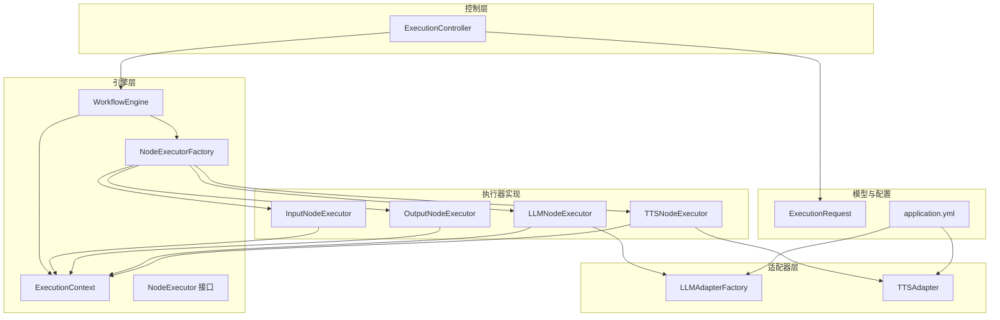
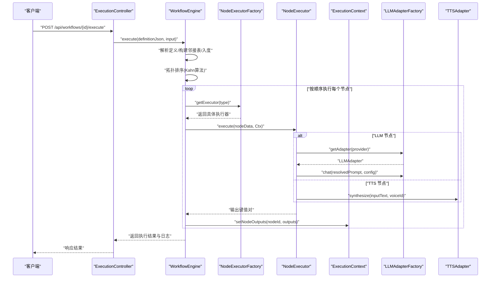
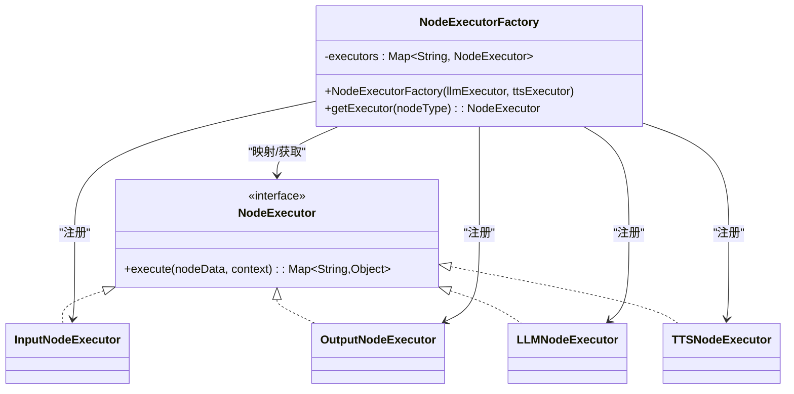
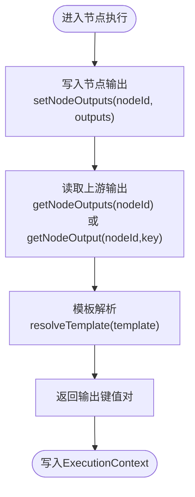
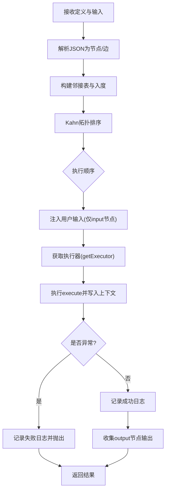
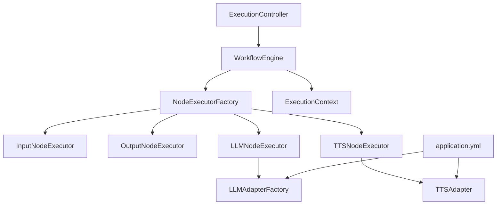

# 节点执行器系统

<cite>
**本文引用的文件**
- [NodeExecutor.java](file://backend/src/main/java/com/paiagent/engine/NodeExecutor.java)
- [NodeExecutorFactory.java](file://backend/src/main/java/com/paiagent/engine/NodeExecutorFactory.java)
- [ExecutionContext.java](file://backend/src/main/java/com/paiagent/engine/ExecutionContext.java)
- [WorkflowEngine.java](file://backend/src/main/java/com/paiagent/engine/WorkflowEngine.java)
- [InputNodeExecutor.java](file://backend/src/main/java/com/paiagent/engine/executors/InputNodeExecutor.java)
- [OutputNodeExecutor.java](file://backend/src/main/java/com/paiagent/engine/executors/OutputNodeExecutor.java)
- [LLMNodeExecutor.java](file://backend/src/main/java/com/paiagent/engine/executors/LLMNodeExecutor.java)
- [TTSNodeExecutor.java](file://backend/src/main/java/com/paiagent/engine/executors/TTSNodeExecutor.java)
- [LLMAdapterFactory.java](file://backend/src/main/java/com/paiagent/adapter/LLMAdapterFactory.java)
- [TTSAdapter.java](file://backend/src/main/java/com/paiagent/adapter/TTSAdapter.java)
- [ExecutionController.java](file://backend/src/main/java/com/paiagent/controller/ExecutionController.java)
- [ExecutionRequest.java](file://backend/src/main/java/com/paiagent/model/dto/ExecutionRequest.java)
- [application.yml](file://backend/src/main/resources/application.yml)
</cite>

## 目录
1. [简介](#简介)
2. [项目结构](#项目结构)
3. [核心组件](#核心组件)
4. [架构总览](#架构总览)
5. [详细组件分析](#详细组件分析)
6. [依赖分析](#依赖分析)
7. [性能考虑](#性能考虑)
8. [故障排查指南](#故障排查指南)
9. [结论](#结论)
10. [附录](#附录)

## 简介
本文件面向“节点执行器系统”的技术文档，围绕以下目标展开：统一抽象的 NodeExecutor 接口设计（execute 方法签名、参数与返回值规范）、NodeExecutorFactory 工厂模式（执行器注册、类型映射与动态创建）、扩展性设计（新增节点类型与自定义执行逻辑）、实现示例与最佳实践（异常处理、性能优化、资源管理）、以及执行器与工作流引擎的协作模式与数据交换协议。

## 项目结构
后端采用分层与按功能域组织的结构：
- engine 层：工作流引擎、执行上下文、节点执行器接口与工厂
- adapter 层：对外部服务（LLM/TTS）的适配器
- controller 层：REST 控制器，暴露执行接口
- model/dto：请求与实体模型
- resources：配置文件（如 application.yml）

图表来源
- [WorkflowEngine.java:1-136](file://backend/src/main/java/com/paiagent/engine/WorkflowEngine.java#L1-136)
- [NodeExecutorFactory.java:1-29](file://backend/src/main/java/com/paiagent/engine/NodeExecutorFactory.java#L1-29)
- [ExecutionContext.java:1-63](file://backend/src/main/java/com/paiagent/engine/ExecutionContext.java#L1-63)
- [NodeExecutor.java:1-17](file://backend/src/main/java/com/paiagent/engine/NodeExecutor.java#L1-17)
- [InputNodeExecutor.java:1-19](file://backend/src/main/java/com/paiagent/engine/executors/InputNodeExecutor.java#L1-19)
- [OutputNodeExecutor.java:1-47](file://backend/src/main/java/com/paiagent/engine/executors/OutputNodeExecutor.java#L1-47)
- [LLMNodeExecutor.java:1-48](file://backend/src/main/java/com/paiagent/engine/executors/LLMNodeExecutor.java#L1-48)
- [TTSNodeExecutor.java:1-48](file://backend/src/main/java/com/paiagent/engine/executors/TTSNodeExecutor.java#L1-48)
- [LLMAdapterFactory.java:1-52](file://backend/src/main/java/com/paiagent/adapter/LLMAdapterFactory.java#L1-52)
- [TTSAdapter.java:1-108](file://backend/src/main/java/com/paiagent/adapter/TTSAdapter.java#L1-108)
- [ExecutionController.java:1-93](file://backend/src/main/java/com/paiagent/controller/ExecutionController.java#L1-93)
- [ExecutionRequest.java:1-12](file://backend/src/main/java/com/paiagent/model/dto/ExecutionRequest.java#L1-12)
- [application.yml:1-44](file://backend/src/main/resources/application.yml#L1-44)

章节来源
- [WorkflowEngine.java:1-136](file://backend/src/main/java/com/paiagent/engine/WorkflowEngine.java#L1-136)
- [NodeExecutorFactory.java:1-29](file://backend/src/main/java/com/paiagent/engine/NodeExecutorFactory.java#L1-29)
- [ExecutionContext.java:1-63](file://backend/src/main/java/com/paiagent/engine/ExecutionContext.java#L1-63)
- [NodeExecutor.java:1-17](file://backend/src/main/java/com/paiagent/engine/NodeExecutor.java#L1-17)
- [ExecutionController.java:1-93](file://backend/src/main/java/com/paiagent/controller/ExecutionController.java#L1-93)
- [application.yml:1-44](file://backend/src/main/resources/application.yml#L1-44)

## 核心组件
- NodeExecutor 接口：定义所有节点执行器的统一抽象，包含 execute(nodeData, context) 方法，用于执行节点逻辑并返回输出键值对。
- NodeExecutorFactory：负责根据节点类型字符串映射到具体执行器实例，支持动态创建与未知类型错误处理。
- ExecutionContext：在节点间传递中间结果，提供模板变量解析能力，支持按节点 ID 和输出键读取或写入。
- WorkflowEngine：工作流调度核心，负责解析工作流定义、拓扑排序、逐节点执行、异常记录与最终输出收集。
- 执行器实现：InputNodeExecutor、OutputNodeExecutor、LLMNodeExecutor、TTSNodeExecutor，分别对应输入、输出、大模型与文本转语音节点。
- 适配器：LLMAdapterFactory、TTSAdapter，封装外部服务调用细节。
- 控制层：ExecutionController 暴露执行接口，接收 ExecutionRequest，调用 WorkflowEngine 并持久化执行日志。

章节来源
- [NodeExecutor.java:1-17](file://backend/src/main/java/com/paiagent/engine/NodeExecutor.java#L1-17)
- [NodeExecutorFactory.java:1-29](file://backend/src/main/java/com/paiagent/engine/NodeExecutorFactory.java#L1-29)
- [ExecutionContext.java:1-63](file://backend/src/main/java/com/paiagent/engine/ExecutionContext.java#L1-63)
- [WorkflowEngine.java:1-136](file://backend/src/main/java/com/paiagent/engine/WorkflowEngine.java#L1-136)
- [InputNodeExecutor.java:1-19](file://backend/src/main/java/com/paiagent/engine/executors/InputNodeExecutor.java#L1-19)
- [OutputNodeExecutor.java:1-47](file://backend/src/main/java/com/paiagent/engine/executors/OutputNodeExecutor.java#L1-47)
- [LLMNodeExecutor.java:1-48](file://backend/src/main/java/com/paiagent/engine/executors/LLMNodeExecutor.java#L1-48)
- [TTSNodeExecutor.java:1-48](file://backend/src/main/java/com/paiagent/engine/executors/TTSNodeExecutor.java#L1-48)
- [LLMAdapterFactory.java:1-52](file://backend/src/main/java/com/paiagent/adapter/LLMAdapterFactory.java#L1-52)
- [TTSAdapter.java:1-108](file://backend/src/main/java/com/paiagent/adapter/TTSAdapter.java#L1-108)
- [ExecutionController.java:1-93](file://backend/src/main/java/com/paiagent/controller/ExecutionController.java#L1-93)
- [ExecutionRequest.java:1-12](file://backend/src/main/java/com/paiagent/model/dto/ExecutionRequest.java#L1-12)

## 架构总览
下图展示了从控制器到工作流引擎、执行器工厂、执行器与适配器之间的交互流程，以及数据在 ExecutionContext 中的传递。

图表来源
- [ExecutionController.java:37-82](file://backend/src/main/java/com/paiagent/controller/ExecutionController.java#L37-82)
- [WorkflowEngine.java:21-108](file://backend/src/main/java/com/paiagent/engine/WorkflowEngine.java#L21-108)
- [NodeExecutorFactory.java:21-27](file://backend/src/main/java/com/paiagent/engine/NodeExecutorFactory.java#L21-27)
- [LLMNodeExecutor.java:35-41](file://backend/src/main/java/com/paiagent/engine/executors/LLMNodeExecutor.java#L35-41)
- [TTSNodeExecutor.java:40-45](file://backend/src/main/java/com/paiagent/engine/executors/TTSNodeExecutor.java#L40-45)
- [LLMAdapterFactory.java:44-49](file://backend/src/main/java/com/paiagent/adapter/LLMAdapterFactory.java#L44-49)
- [TTSAdapter.java:40-58](file://backend/src/main/java/com/paiagent/adapter/TTSAdapter.java#L40-58)

## 详细组件分析

### NodeExecutor 接口与统一抽象
- 设计目标：为不同类型的节点提供一致的执行契约，屏蔽具体实现差异。
- 方法签名与语义：
  - execute(nodeData, context)：执行节点逻辑；nodeData 来自工作流定义中的节点数据；context 提供跨节点的数据传递与模板解析能力；返回值为该节点产出的键值对，将被写入 ExecutionContext。
- 参数与返回值规范：
  - nodeData：Map<String, Object>，包含节点配置（如 provider、model、prompt、temperature、maxTokens、outputs、responseTemplate、inputRef、voiceId 等）。
  - context：ExecutionContext，提供 setNodeOutput/setNodeOutputs/getNodeOutput/getNodeOutputs/getAllOutputs/resolveTemplate 等能力。
  - 返回值：Map<String, Object>，作为该节点的输出集合，键名自定义，建议包含一个通用输出键以兼容下游节点引用。
- 异常处理：接口声明抛出 Exception，允许执行器在配置错误、外部服务异常等情况下向上抛出，由上层捕获与记录。

章节来源
- [NodeExecutor.java:8-16](file://backend/src/main/java/com/paiagent/engine/NodeExecutor.java#L8-16)

### NodeExecutorFactory 工厂模式
- 注册机制：构造函数中显式注册内置执行器（input、output），以及通过依赖注入传入的 LLMNodeExecutor、TTSNodeExecutor。
- 类型映射：内部维护 nodeType 到执行器实例的映射表。
- 动态创建：通过 getExecutor(nodeType) 获取执行器；若未注册则抛出非法参数异常，避免静默失败。
- 可扩展性：新增节点类型只需在工厂中注册映射，并确保 Spring 容器能注入所需依赖；执行器实现遵循 NodeExecutor 接口即可无缝接入。

图表来源
- [NodeExecutorFactory.java:10-28](file://backend/src/main/java/com/paiagent/engine/NodeExecutorFactory.java#L10-28)
- [NodeExecutor.java:8-16](file://backend/src/main/java/com/paiagent/engine/NodeExecutor.java#L8-16)
- [InputNodeExecutor.java](file://backend/src/main/java/com/paiagent/engine/executors/InputNodeExecutor.java#L9)
- [OutputNodeExecutor.java](file://backend/src/main/java/com/paiagent/engine/executors/OutputNodeExecutor.java#L10)
- [LLMNodeExecutor.java:12-19](file://backend/src/main/java/com/paiagent/engine/executors/LLMNodeExecutor.java#L12-19)
- [TTSNodeExecutor.java:11-18](file://backend/src/main/java/com/paiagent/engine/executors/TTSNodeExecutor.java#L11-18)

章节来源
- [NodeExecutorFactory.java:10-28](file://backend/src/main/java/com/paiagent/engine/NodeExecutorFactory.java#L10-28)

### ExecutionContext 执行上下文
- 数据结构：以节点 ID 为外层键，内部为输出键到值的映射；支持批量设置与按键读取。
- 模板解析：resolveTemplate 支持 {{nodeId.key}} 与单节点简写 {{nodeId}} 的占位符替换，便于在节点配置中引用上游输出。
- 使用场景：各执行器通过 setNodeOutput/setNodeOutputs 写入结果；其他执行器通过 getNodeOutput/getNodeOutputs 读取上游输出；输出节点可汇总最终响应模板。

图表来源
- [ExecutionContext.java:13-32](file://backend/src/main/java/com/paiagent/engine/ExecutionContext.java#L13-32)
- [ExecutionContext.java:38-61](file://backend/src/main/java/com/paiagent/engine/ExecutionContext.java#L38-61)

章节来源
- [ExecutionContext.java:10-63](file://backend/src/main/java/com/paiagent/engine/ExecutionContext.java#L10-63)

### WorkflowEngine 工作流引擎
- 输入：工作流定义 JSON 与用户输入字符串。
- 解析与建模：将 JSON 解析为节点与边列表，构建邻接表与入度映射。
- 拓扑排序：使用 Kahn 算法确定执行顺序，检测环形依赖并抛出异常。
- 执行循环：逐节点获取执行器、注入用户输入（针对 input 节点）、执行并记录日志；异常时记录失败信息并向上抛出。
- 输出收集：遍历执行顺序，从 ExecutionContext 读取 output 节点的输出作为最终结果的一部分。
- 性能与可观测性：记录每个节点的执行状态、耗时与输出，便于调试与监控。

图表来源
- [WorkflowEngine.java:21-108](file://backend/src/main/java/com/paiagent/engine/WorkflowEngine.java#L21-108)
- [WorkflowEngine.java:110-134](file://backend/src/main/java/com/paiagent/engine/WorkflowEngine.java#L110-134)

章节来源
- [WorkflowEngine.java:10-136](file://backend/src/main/java/com/paiagent/engine/WorkflowEngine.java#L10-136)

### 执行器实现与最佳实践

#### InputNodeExecutor
- 作用：将用户输入写入输出，供后续节点引用。
- 最佳实践：
  - 命名约定：输出键建议使用通用名称（如 output），便于下游引用。
  - 空值处理：当未提供用户输入时，应保证空字符串或默认值，避免下游空指针。

章节来源
- [InputNodeExecutor.java:12-17](file://backend/src/main/java/com/paiagent/engine/executors/InputNodeExecutor.java#L12-17)

#### OutputNodeExecutor
- 作用：聚合上游输出，支持多字段映射与响应模板渲染，自动识别音频 URL 并透传。
- 最佳实践：
  - 映射配置：outputs 字段应明确 key 与 ref 的对应关系。
  - 模板策略：responseTemplate 支持复杂模板，需结合 resolveTemplate 进行占位符替换。
  - 音频识别：通过后缀或路径前缀判断音频 URL，确保前端正确播放。

章节来源
- [OutputNodeExecutor.java:14-45](file://backend/src/main/java/com/paiagent/engine/executors/OutputNodeExecutor.java#L14-45)

#### LLMNodeExecutor
- 作用：根据 provider/model/temperature/maxTokens/prompt 等配置调用 LLM 适配器生成回复。
- 关键流程：
  - 从 nodeData 读取 provider/model/prompt/温度/最大 token 数。
  - 使用 ExecutionContext.resolveTemplate 对 prompt 进行变量替换。
  - 通过 LLMAdapterFactory 获取适配器并调用 chat。
  - 将返回文本放入输出。
- 最佳实践：
  - 异常处理：适配器调用可能因网络或鉴权失败抛出异常，应在上层捕获并记录。
  - 配置校验：对缺失关键字段（如 model、prompt）进行校验，避免无效调用。
  - 温度与长度：合理设置 temperature 与 maxTokens，平衡质量与成本。

章节来源
- [LLMNodeExecutor.java:21-46](file://backend/src/main/java/com/paiagent/engine/executors/LLMNodeExecutor.java#L21-46)
- [LLMAdapterFactory.java:44-49](file://backend/src/main/java/com/paiagent/adapter/LLMAdapterFactory.java#L44-49)

#### TTSNodeExecutor
- 作用：将上游文本输出或指定引用转换为音频文件 URL。
- 关键流程：
  - 从 nodeData 读取 inputRef/voiceId。
  - 通过 ExecutionContext.resolveTemplate 或直接读取上游输出解析输入文本。
  - 调用 TTSAdapter 合成音频并返回 URL。
- 最佳实践：
  - 输入校验：若 inputRef 解析为空，应抛出参数异常，避免无效合成。
  - 存储策略：音频文件保存在配置目录，URL 以静态文件形式提供。
  - 回退策略：当未配置远端 TTS 时，生成占位音频以便演示。

章节来源
- [TTSNodeExecutor.java:20-46](file://backend/src/main/java/com/paiagent/engine/executors/TTSNodeExecutor.java#L20-46)
- [TTSAdapter.java:40-58](file://backend/src/main/java/com/paiagent/adapter/TTSAdapter.java#L40-58)

### 执行器与工作流引擎的协作与数据交换
- 协作模式：
  - 控制器接收请求，调用 WorkflowEngine.execute。
  - 引擎解析定义并按拓扑顺序执行节点。
  - 每个节点通过 NodeExecutorFactory 获取执行器，执行后将输出写入 ExecutionContext。
- 数据交换协议：
  - 节点间通过 ExecutionContext 的键值对传递数据；支持模板占位符引用。
  - 输出节点负责将上下文中的输出整合为最终响应。
  - 执行日志包含节点 ID、类型、状态、耗时与输出/错误信息，便于审计与排障。

章节来源
- [ExecutionController.java:37-82](file://backend/src/main/java/com/paiagent/controller/ExecutionController.java#L37-82)
- [WorkflowEngine.java:55-107](file://backend/src/main/java/com/paiagent/engine/WorkflowEngine.java#L55-107)
- [ExecutionContext.java:38-61](file://backend/src/main/java/com/paiagent/engine/ExecutionContext.java#L38-61)

## 依赖分析
- 组件耦合：
  - WorkflowEngine 依赖 NodeExecutorFactory 与 ObjectMapper。
  - NodeExecutorFactory 依赖具体执行器实现与 Spring 容器注入。
  - 执行器实现依赖 ExecutionContext 与外部适配器（LLMAdapterFactory、TTSAdapter）。
- 外部依赖：
  - LLM 与 TTS 服务通过适配器访问，配置来源于 application.yml。
  - SQLite 数据源与 JPA 配置用于持久化执行日志。

图表来源
- [WorkflowEngine.java:12-18](file://backend/src/main/java/com/paiagent/engine/WorkflowEngine.java#L12-18)
- [NodeExecutorFactory.java:14-18](file://backend/src/main/java/com/paiagent/engine/NodeExecutorFactory.java#L14-18)
- [LLMAdapterFactory.java:36-42](file://backend/src/main/java/com/paiagent/adapter/LLMAdapterFactory.java#L36-42)
- [TTSAdapter.java:26-27](file://backend/src/main/java/com/paiagent/adapter/TTSAdapter.java#L26-27)
- [ExecutionController.java:27-34](file://backend/src/main/java/com/paiagent/controller/ExecutionController.java#L27-34)
- [application.yml:21-39](file://backend/src/main/resources/application.yml#L21-39)

章节来源
- [WorkflowEngine.java:12-18](file://backend/src/main/java/com/paiagent/engine/WorkflowEngine.java#L12-18)
- [NodeExecutorFactory.java:14-18](file://backend/src/main/java/com/paiagent/engine/NodeExecutorFactory.java#L14-18)
- [LLMAdapterFactory.java:36-42](file://backend/src/main/java/com/paiagent/adapter/LLMAdapterFactory.java#L36-42)
- [TTSAdapter.java:26-27](file://backend/src/main/java/com/paiagent/adapter/TTSAdapter.java#L26-27)
- [ExecutionController.java:27-34](file://backend/src/main/java/com/paiagent/controller/ExecutionController.java#L27-34)
- [application.yml:21-39](file://backend/src/main/resources/application.yml#L21-39)

## 性能考虑
- 拓扑排序：Kahn 算法时间复杂度 O(V+E)，适合中等规模工作流。
- 上下文访问：HashMap 查找近似 O(1)，模板解析为线性扫描，建议减少嵌套层级与重复引用。
- 外部调用：
  - LLM/TTS 适配器应设置合理的超时与重试策略，避免阻塞整个执行。
  - 音频文件存储建议使用本地 SSD 或对象存储，降低 I/O 延迟。
- 日志与监控：记录节点耗时与状态，便于定位瓶颈与异常。

## 故障排查指南
- 常见问题与定位：
  - 未知节点类型：NodeExecutorFactory.getExecutor 抛出非法参数异常，检查工作流定义中的 type 是否正确注册。
  - 循环依赖：WorkflowEngine.topologicalSort 检测到环，检查边连接是否形成回路。
  - TTS 输入为空：TTSNodeExecutor 抛出参数异常，检查 inputRef 是否指向有效上游输出或模板。
  - LLM/TTS 失败：查看适配器异常与 HTTP 状态码，确认配置项（API Key、Base URL）是否正确。
- 日志与审计：
  - ExecutionController 在成功与失败时均会持久化执行日志，包含输入、输出、状态与耗时，便于回溯。
- 配置核对：
  - application.yml 中的 LLM/TTS 配置与存储路径需与运行环境一致。

章节来源
- [NodeExecutorFactory.java:23-26](file://backend/src/main/java/com/paiagent/engine/NodeExecutorFactory.java#L23-26)
- [WorkflowEngine.java:130-133](file://backend/src/main/java/com/paiagent/engine/WorkflowEngine.java#L130-133)
- [TTSNodeExecutor.java:35-37](file://backend/src/main/java/com/paiagent/engine/executors/TTSNodeExecutor.java#L35-37)
- [ExecutionController.java:65-81](file://backend/src/main/java/com/paiagent/controller/ExecutionController.java#L65-81)
- [application.yml:21-43](file://backend/src/main/resources/application.yml#L21-43)

## 结论
节点执行器系统通过统一的 NodeExecutor 接口与工厂模式实现了良好的扩展性与可维护性。ExecutionContext 提供了灵活的跨节点数据传递与模板解析能力，WorkflowEngine 则负责工作流的编排与执行监控。通过适配器层与外部服务解耦，系统具备较强的可插拔性。建议在生产环境中完善超时与重试、增强日志与指标采集，并持续扩展执行器生态以支持更多节点类型与业务场景。

## 附录

### 扩展新节点类型的步骤
- 实现 NodeExecutor 接口，定义 execute(nodeData, context) 的业务逻辑。
- 在 NodeExecutorFactory 中注册新的 nodeType 与执行器实例。
- 在工作流定义中使用新的 type，并提供必要的 nodeData 配置。
- 如涉及外部服务，通过适配器封装调用并在 application.yml 中配置相应参数。

章节来源
- [NodeExecutor.java:8-16](file://backend/src/main/java/com/paiagent/engine/NodeExecutor.java#L8-16)
- [NodeExecutorFactory.java:14-19](file://backend/src/main/java/com/paiagent/engine/NodeExecutorFactory.java#L14-19)
- [application.yml:21-39](file://backend/src/main/resources/application.yml#L21-39)