# API响应设计

<cite>
**本文档引用的文件**
- [ApiResponse.java](file://backend/src/main/java/com/paiagent/model/dto/ApiResponse.java)
- [AuthController.java](file://backend/src/main/java/com/paiagent/controller/AuthController.java)
- [ExecutionController.java](file://backend/src/main/java/com/paiagent/controller/ExecutionController.java)
- [WorkflowController.java](file://backend/src/main/java/com/paiagent/controller/WorkflowController.java)
- [GlobalExceptionHandler.java](file://backend/src/main/java/com/paiagent/exception/GlobalExceptionHandler.java)
- [LoginRequest.java](file://backend/src/main/java/com/paiagent/model/dto/LoginRequest.java)
- [LoginResponse.java](file://backend/src/main/java/com/paiagent/model/dto/LoginResponse.java)
- [ExecutionRequest.java](file://backend/src/main/java/com/paiagent/model/dto/ExecutionRequest.java)
- [WorkflowDTO.java](file://backend/src/main/java/com/paiagent/model/dto/WorkflowDTO.java)
- [api.ts](file://frontend/src/types/api.ts)
- [index.ts](file://frontend/src/api/index.ts)
- [application.yml](file://backend/src/main/resources/application.yml)
</cite>

## 目录
1. [引言](#引言)
2. [项目结构](#项目结构)
3. [核心组件](#核心组件)
4. [架构概览](#架构概览)
5. [详细组件分析](#详细组件分析)
6. [依赖关系分析](#依赖关系分析)
7. [性能考虑](#性能考虑)
8. [故障排除指南](#故障排除指南)
9. [结论](#结论)
10. [附录](#附录)

## 引言

PaiAgent是一个基于Spring Boot的AI工作流编排平台，本文件专注于其API响应设计系统。该系统采用泛型封装的统一响应格式，通过ApiResponse类实现所有HTTP接口的一致性输出，确保前后端交互的标准化和可预测性。

## 项目结构

PaiAgent项目采用典型的分层架构设计，API响应设计贯穿于各个层次中：

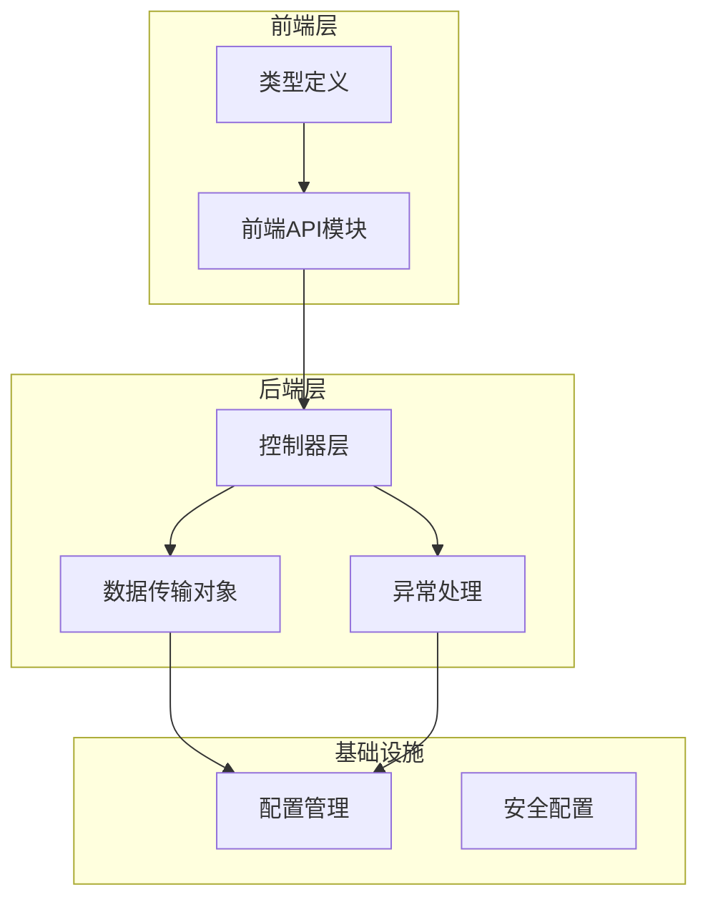

**图表来源**
- [PaiAgentApplication.java:1-12](file://backend/src/main/java/com/paiagent/PaiAgentApplication.java#L1-L12)
- [application.yml:1-44](file://backend/src/main/resources/application.yml#L1-L44)

**章节来源**
- [PaiAgentApplication.java:1-12](file://backend/src/main/java/com/paiagent/PaiAgentApplication.java#L1-L12)
- [application.yml:1-44](file://backend/src/main/resources/application.yml#L1-L44)

## 核心组件

### ApiResponse泛型封装设计

ApiResponse是整个API响应系统的核心，采用泛型设计实现类型安全的响应封装：

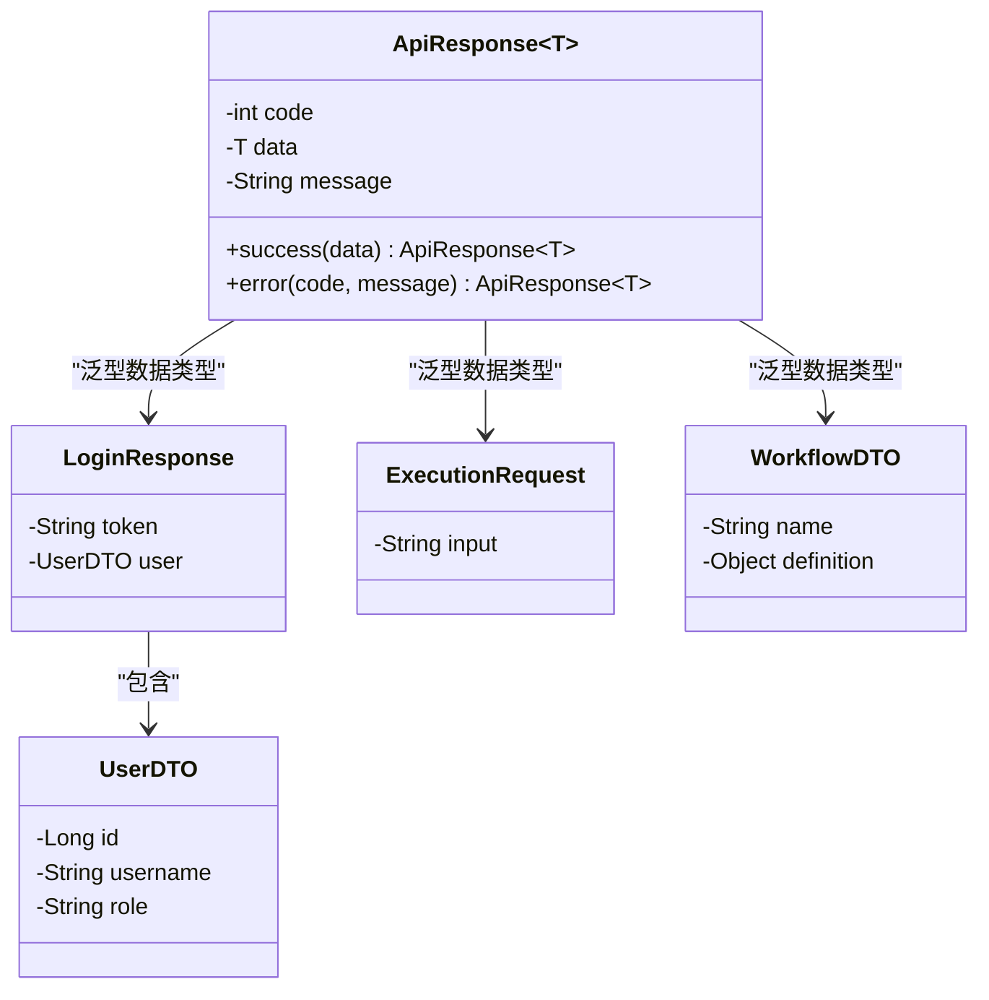

**图表来源**
- [ApiResponse.java:10-22](file://backend/src/main/java/com/paiagent/model/dto/ApiResponse.java#L10-L22)
- [LoginResponse.java:8-18](file://backend/src/main/java/com/paiagent/model/dto/LoginResponse.java#L8-L18)
- [ExecutionRequest.java:8-11](file://backend/src/main/java/com/paiagent/model/dto/ExecutionRequest.java#L8-L11)
- [WorkflowDTO.java:8-12](file://backend/src/main/java/com/paiagent/model/dto/WorkflowDTO.java#L8-L12)

### 统一响应格式标准

系统实现了标准化的响应格式，确保所有API接口返回一致的数据结构：

| 字段名 | 类型 | 必填 | 描述 |
|--------|------|------|------|
| code | int | 是 | HTTP状态码或业务状态码 |
| data | T | 否 | 泛型数据对象，成功时返回 |
| message | string | 是 | 响应消息，失败时返回错误信息 |

**章节来源**
- [ApiResponse.java:10-22](file://backend/src/main/java/com/paiagent/model/dto/ApiResponse.java#L10-L22)
- [api.ts:17-21](file://frontend/src/types/api.ts#L17-L21)

## 架构概览

PaiAgent的API响应设计采用分层架构，从控制器到异常处理形成完整的响应生命周期：

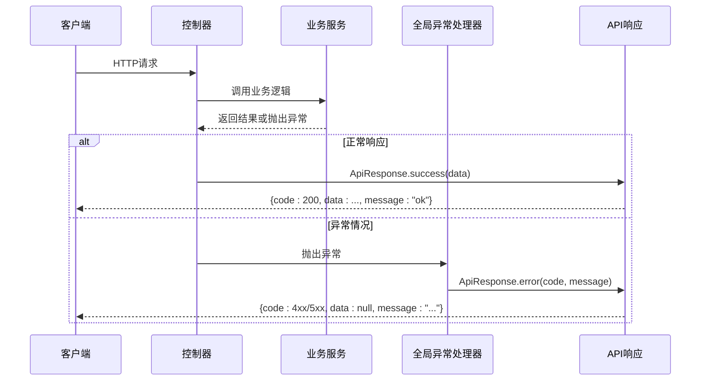

**图表来源**
- [AuthController.java:32-43](file://backend/src/main/java/com/paiagent/controller/AuthController.java#L32-L43)
- [ExecutionController.java:47-64](file://backend/src/main/java/com/paiagent/controller/ExecutionController.java#L47-L64)
- [GlobalExceptionHandler.java:12-28](file://backend/src/main/java/com/paiagent/exception/GlobalExceptionHandler.java#L12-L28)

## 详细组件分析

### 控制器层响应设计

#### 认证控制器响应模式

认证控制器展示了API响应的最佳实践：

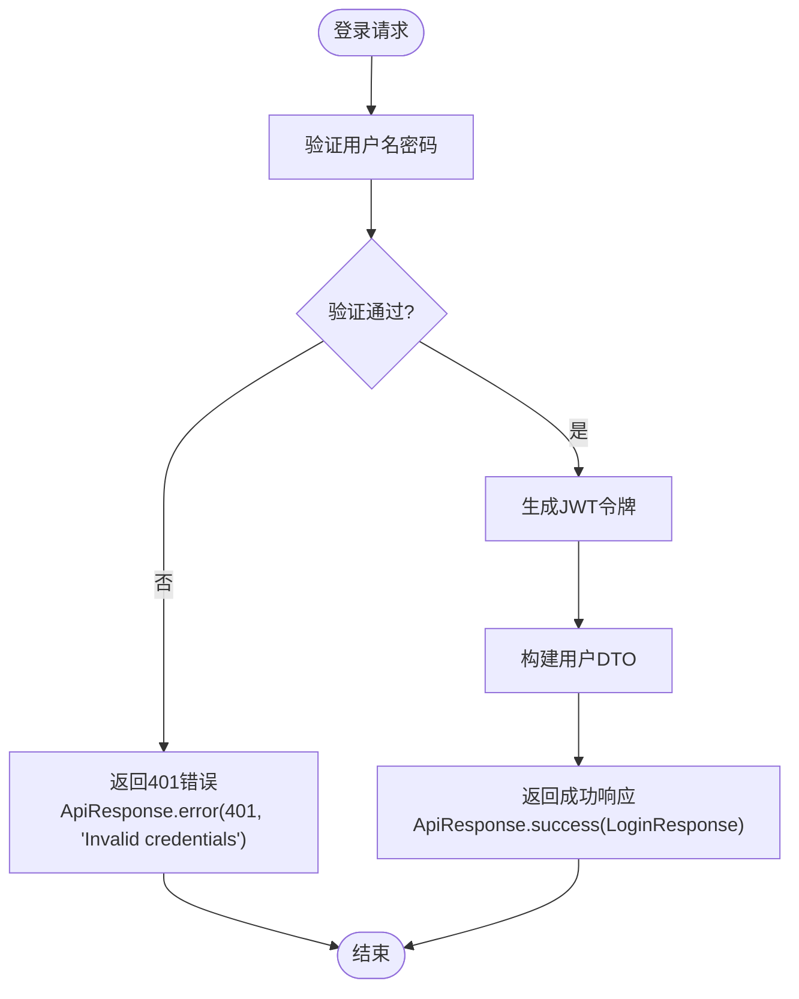

**图表来源**
- [AuthController.java:31-43](file://backend/src/main/java/com/paiagent/controller/AuthController.java#L31-L43)

#### 工作流执行控制器响应设计

执行控制器展示了复杂业务场景下的响应处理：

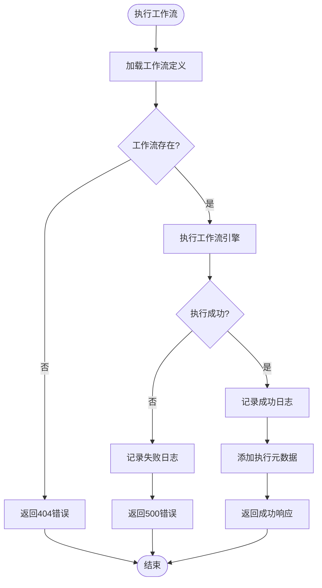

**图表来源**
- [ExecutionController.java:37-82](file://backend/src/main/java/com/paiagent/controller/ExecutionController.java#L37-L82)

**章节来源**
- [AuthController.java:31-54](file://backend/src/main/java/com/paiagent/controller/AuthController.java#L31-L54)
- [ExecutionController.java:37-91](file://backend/src/main/java/com/paiagent/controller/ExecutionController.java#L37-L91)
- [WorkflowController.java:35-82](file://backend/src/main/java/com/paiagent/controller/WorkflowController.java#L35-L82)

### DTO设计模式与命名规范

#### Request类职责分离

所有请求类都遵循统一的命名规范和设计原则：

| 类型 | 命名规范 | 职责 |
|------|----------|------|
| 登录请求 | LoginRequest | 用户身份认证输入参数 |
| 执行请求 | ExecutionRequest | 工作流执行输入参数 |
| 工作流请求 | WorkflowDTO | 工作流定义和配置输入 |

#### Response类设计模式

响应类采用嵌套内部类模式，实现数据结构的清晰组织：

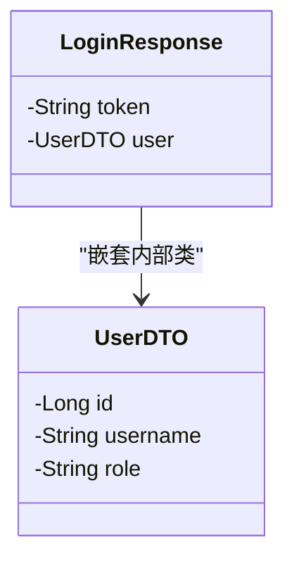

**图表来源**
- [LoginResponse.java:8-18](file://backend/src/main/java/com/paiagent/model/dto/LoginResponse.java#L8-L18)

**章节来源**
- [LoginRequest.java:8-13](file://backend/src/main/java/com/paiagent/model/dto/LoginRequest.java#L8-L13)
- [ExecutionRequest.java:8-11](file://backend/src/main/java/com/paiagent/model/dto/ExecutionRequest.java#L8-L11)
- [WorkflowDTO.java:8-12](file://backend/src/main/java/com/paiagent/model/dto/WorkflowDTO.java#L8-L12)
- [LoginResponse.java:8-18](file://backend/src/main/java/com/paiagent/model/dto/LoginResponse.java#L8-L18)

### 错误码标准化策略

系统采用统一的错误码映射策略：

| HTTP状态码 | 业务含义 | ApiResponse.code值 | 使用场景 |
|------------|----------|-------------------|----------|
| 200 | 成功 | 200 | 普通成功响应 |
| 400 | 参数错误 | 400 | 参数校验失败 |
| 401 | 未授权 | 401 | 认证失败或令牌无效 |
| 404 | 资源不存在 | 404 | 数据查询结果为空 |
| 500 | 服务器错误 | 500 | 系统异常或执行失败 |

**章节来源**
- [GlobalExceptionHandler.java:12-28](file://backend/src/main/java/com/paiagent/exception/GlobalExceptionHandler.java#L12-L28)
- [AuthController.java:36-42](file://backend/src/main/java/com/paiagent/controller/AuthController.java#L36-L42)
- [ExecutionController.java:40-81](file://backend/src/main/java/com/paiagent/controller/ExecutionController.java#L40-L81)

### 国际化支持机制

虽然当前版本主要使用英文消息，但系统已为国际化预留了扩展点：

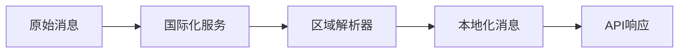

## 依赖关系分析

### 组件耦合度分析

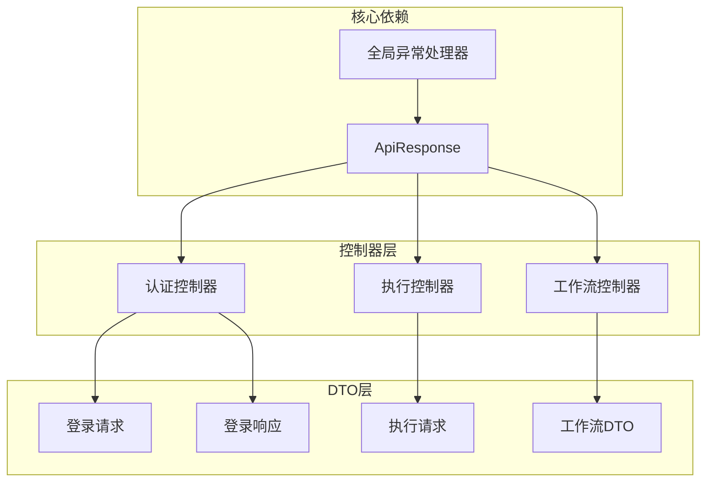

**图表来源**
- [ApiResponse.java:10-22](file://backend/src/main/java/com/paiagent/model/dto/ApiResponse.java#L10-L22)
- [AuthController.java:3-5](file://backend/src/main/java/com/paiagent/controller/AuthController.java#L3-L5)
- [ExecutionController.java:5](file://backend/src/main/java/com/paiagent/controller/ExecutionController.java#L5)
- [WorkflowController.java:5](file://backend/src/main/java/com/paiagent/controller/WorkflowController.java#L5)

### 外部依赖集成

系统集成了多个外部服务，每个服务都有对应的配置和适配器：

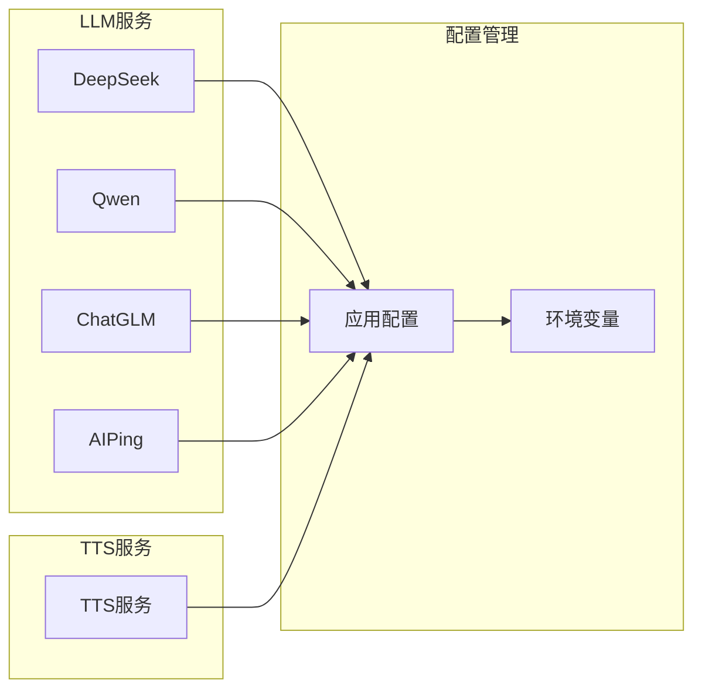

**图表来源**
- [application.yml:21-39](file://backend/src/main/resources/application.yml#L21-L39)

**章节来源**
- [application.yml:21-39](file://backend/src/main/resources/application.yml#L21-L39)

## 性能考虑

### 响应时间优化

系统在执行控制器中实现了详细的性能监控：

- **执行时间统计**：使用毫秒级精度记录工作流执行时间
- **数据库操作优化**：批量操作和索引优化减少查询延迟
- **缓存策略**：对频繁访问的数据实施缓存机制

### 内存使用优化

- **流式处理**：大文件上传采用流式处理避免内存溢出
- **对象复用**：重用DTO对象减少GC压力
- **连接池管理**：数据库连接池动态调整

## 故障排除指南

### 常见响应问题诊断

#### 400错误处理流程

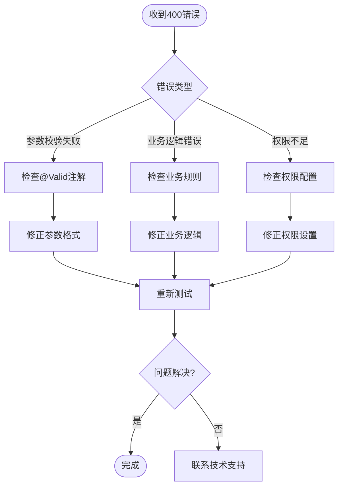

#### 500错误排查步骤

1. **检查日志级别**：确认ERROR级别日志完整
2. **验证数据库连接**：检查连接池状态和超时设置
3. **监控资源使用**：观察CPU和内存使用情况
4. **检查第三方服务**：验证外部API调用状态

**章节来源**
- [GlobalExceptionHandler.java:12-28](file://backend/src/main/java/com/paiagent/exception/GlobalExceptionHandler.java#L12-L28)

### 前后端调试技巧

#### 前端响应拦截器

前端API模块实现了智能的响应拦截机制：

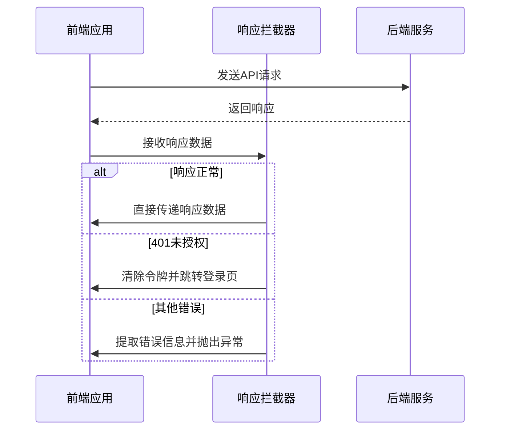

**图表来源**
- [index.ts:19-28](file://frontend/src/api/index.ts#L19-L28)

**章节来源**
- [index.ts:19-28](file://frontend/src/api/index.ts#L19-L28)

## 结论

PaiAgent的API响应设计体现了现代Web应用的最佳实践，通过泛型封装的ApiResponse类实现了统一的响应格式，配合严格的DTO设计模式和标准化的错误码策略，确保了系统的可维护性和扩展性。

### 主要优势

1. **一致性**：所有API接口返回统一格式的响应
2. **类型安全**：泛型设计确保编译时类型检查
3. **易于扩展**：标准化的错误处理机制便于功能扩展
4. **前后端协作**：清晰的类型定义促进前后端开发协同

### 改进建议

1. **国际化支持**：增加多语言错误消息支持
2. **响应压缩**：对大数据量响应实施压缩传输
3. **缓存策略**：为静态数据实现智能缓存机制
4. **监控指标**：增加详细的API性能监控指标

## 附录

### 完整响应格式规范

#### 成功响应结构

```json
{
  "code": 200,
  "data": {},
  "message": "ok"
}
```

#### 错误响应结构

```json
{
  "code": 404,
  "data": null,
  "message": "Workflow not found"
}
```

#### 响应字段说明

| 字段 | 类型 | 必填 | 描述 |
|------|------|------|------|
| code | number | 是 | 状态码，200表示成功，其他值表示错误 |
| data | any | 否 | 实际响应数据，成功时返回，失败时为null |
| message | string | 是 | 响应消息，成功时通常为"ok" |

### 最佳实践清单

1. **始终使用ApiResponse封装**：所有控制器方法必须返回ApiResponse实例
2. **合理使用泛型**：根据实际数据类型选择合适的泛型参数
3. **错误码一致性**：遵循统一的错误码映射策略
4. **消息国际化**：为错误消息提供多语言支持
5. **性能监控**：对关键API实施性能监控和日志记录