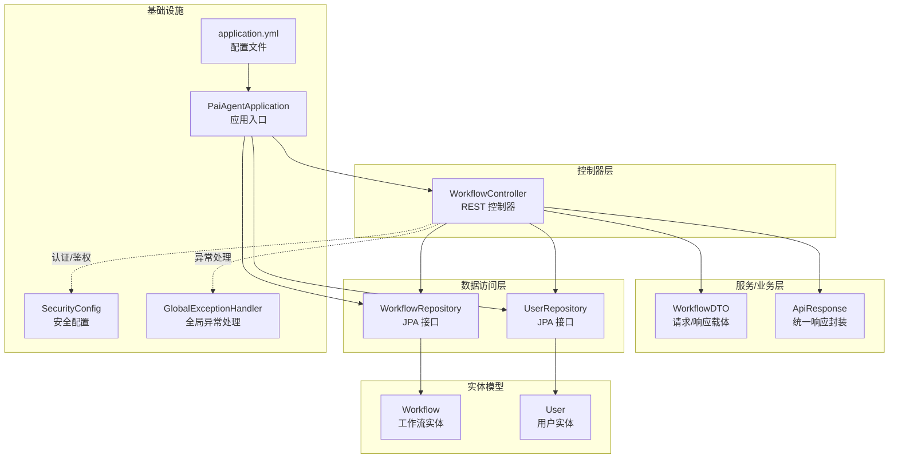
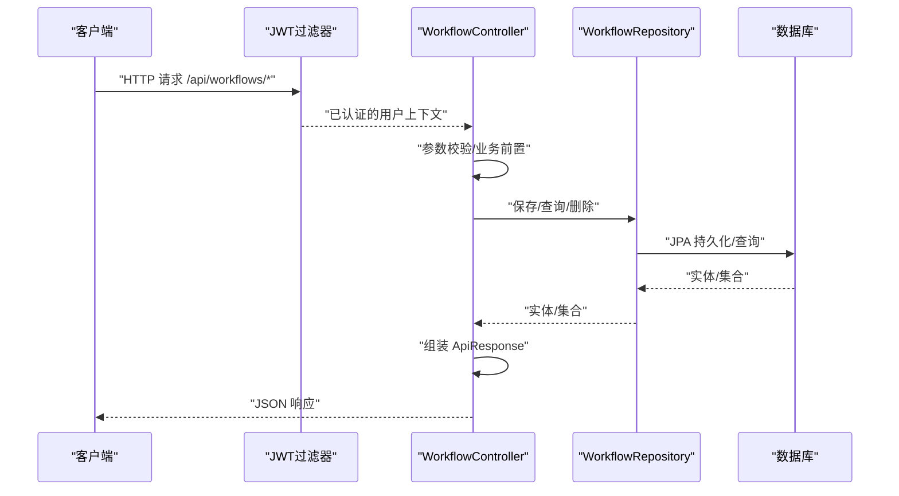
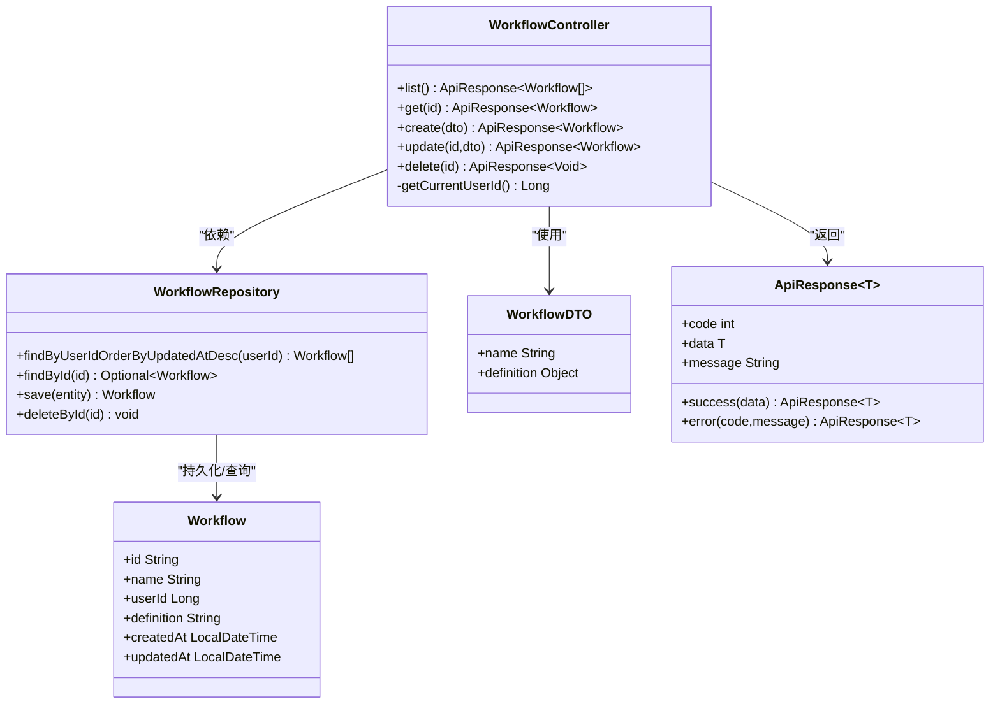
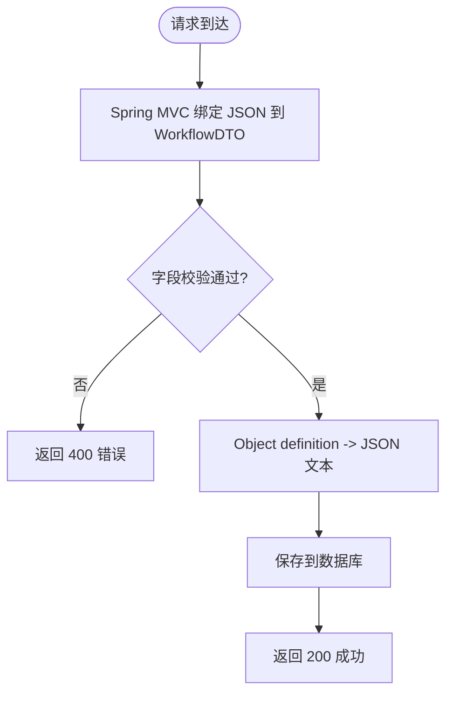
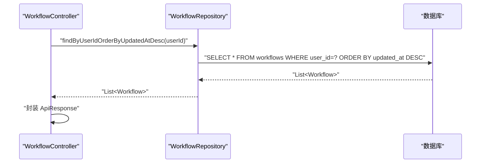
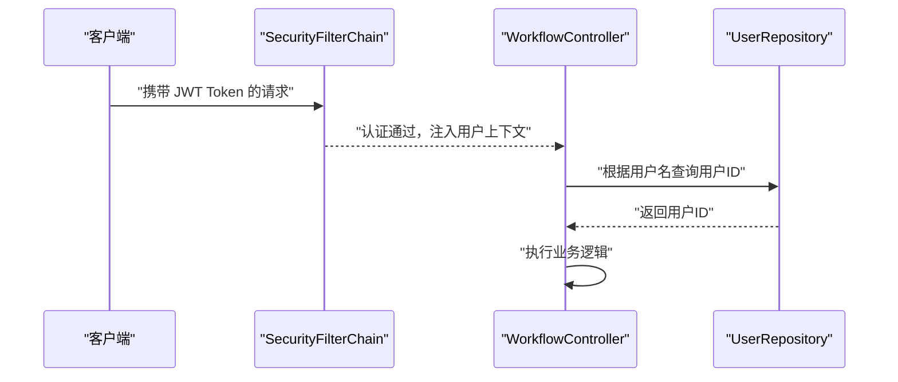
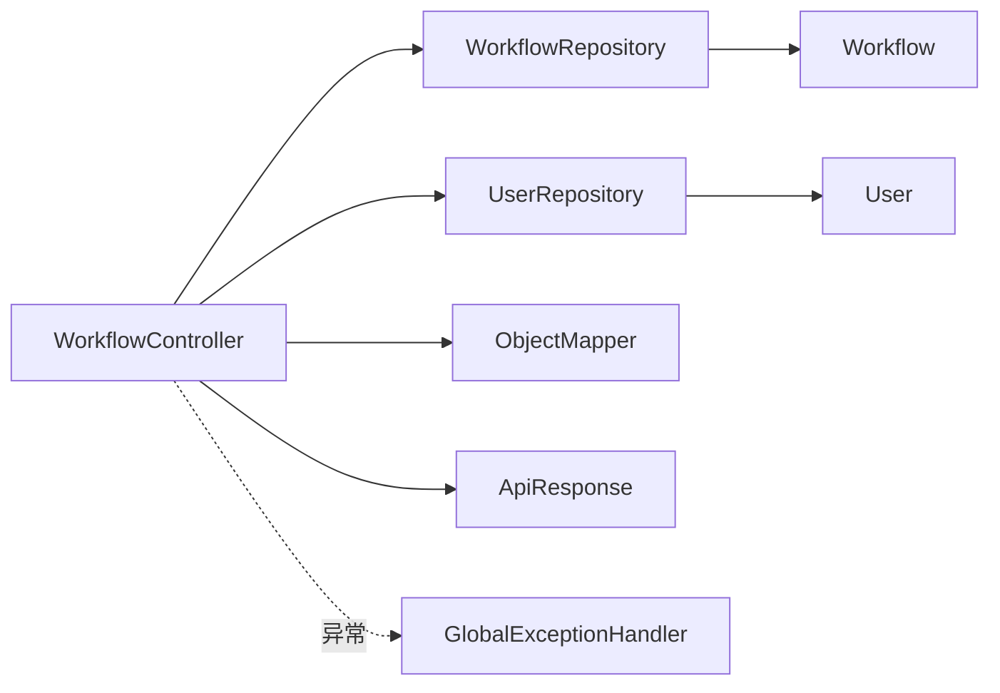

# 工作流控制器

<cite>
**本文引用的文件**
- [WorkflowController.java](file://backend/src/main/java/com/paiagent/controller/WorkflowController.java)
- [WorkflowDTO.java](file://backend/src/main/java/com/paiagent/model/dto/WorkflowDTO.java)
- [Workflow.java](file://backend/src/main/java/com/paiagent/model/entity/Workflow.java)
- [WorkflowRepository.java](file://backend/src/main/java/com/paiagent/repository/WorkflowRepository.java)
- [ApiResponse.java](file://backend/src/main/java/com/paiagent/model/dto/ApiResponse.java)
- [User.java](file://backend/src/main/java/com/paiagent/model/entity/User.java)
- [UserRepository.java](file://backend/src/main/java/com/paiagent/repository/UserRepository.java)
- [application.yml](file://backend/src/main/resources/application.yml)
- [SecurityConfig.java](file://backend/src/main/java/com/paiagent/config/SecurityConfig.java)
- [GlobalExceptionHandler.java](file://backend/src/main/java/com/paiagent/exception/GlobalExceptionHandler.java)
- [PaiAgentApplication.java](file://backend/src/main/java/com/paiagent/PaiAgentApplication.java)
</cite>

## 目录
1. [简介](#简介)
2. [项目结构](#项目结构)
3. [核心组件](#核心组件)
4. [架构总览](#架构总览)
5. [详细组件分析](#详细组件分析)
6. [依赖分析](#依赖分析)
7. [性能考虑](#性能考虑)
8. [故障排除指南](#故障排除指南)
9. [结论](#结论)
10. [附录：API规范](#附录api规范)

## 简介
本文件为 PaiAgent 工作流控制器（WorkflowController）的深度技术文档，聚焦于工作流的 CRUD 操作实现与管理功能。文档从系统架构、组件关系、数据流、处理逻辑、集成点、错误处理到性能特性进行全方位解析，并提供完整的工作流 API 规范、错误处理策略与性能优化建议。读者无需深入的后端背景即可理解工作流的创建、读取、更新与删除流程，以及与数据访问层（WorkflowRepository）的交互方式。

## 项目结构
后端采用 Spring Boot + JPA 的分层架构：
- 控制器层：WorkflowController 提供 REST 接口
- DTO 层：WorkflowDTO 负责请求/响应的数据传输
- 实体层：Workflow 表示数据库中的工作流记录
- 数据访问层：WorkflowRepository 继承 JPA，提供查询与持久化
- 响应封装：ApiResponse 统一返回格式
- 安全与异常：SecurityConfig 配置 JWT 认证；GlobalExceptionHandler 全局异常处理

图表来源
- [WorkflowController.java:1-91](file://backend/src/main/java/com/paiagent/controller/WorkflowController.java#L1-L91)
- [WorkflowDTO.java:1-13](file://backend/src/main/java/com/paiagent/model/dto/WorkflowDTO.java#L1-L13)
- [Workflow.java:1-31](file://backend/src/main/java/com/paiagent/model/entity/Workflow.java#L1-L31)
- [WorkflowRepository.java:1-11](file://backend/src/main/java/com/paiagent/repository/WorkflowRepository.java#L1-L11)
- [UserRepository.java:1-11](file://backend/src/main/java/com/paiagent/repository/UserRepository.java#L1-L11)
- [ApiResponse.java:1-23](file://backend/src/main/java/com/paiagent/model/dto/ApiResponse.java#L1-L23)
- [SecurityConfig.java:1-54](file://backend/src/main/java/com/paiagent/config/SecurityConfig.java#L1-L54)
- [GlobalExceptionHandler.java:1-30](file://backend/src/main/java/com/paiagent/exception/GlobalExceptionHandler.java#L1-L30)
- [PaiAgentApplication.java:1-12](file://backend/src/main/java/com/paiagent/PaiAgentApplication.java#L1-L12)
- [application.yml:1-44](file://backend/src/main/resources/application.yml#L1-L44)

章节来源
- [WorkflowController.java:1-91](file://backend/src/main/java/com/paiagent/controller/WorkflowController.java#L1-L91)
- [application.yml:1-44](file://backend/src/main/resources/application.yml#L1-L44)

## 核心组件
- WorkflowController：提供 /api/workflows 的 REST 接口，负责接收请求、调用仓库、封装响应。
- WorkflowDTO：请求体载体，包含工作流名称与定义对象。
- Workflow：数据库实体，映射 workflows 表，存储工作流元数据与定义文本。
- WorkflowRepository：JPA 接口，扩展 JpaRepository 并自定义查询方法。
- ApiResponse：统一封装响应码、数据与消息，简化前端处理。
- SecurityConfig：启用无状态会话，对 /api/** 进行认证保护。
- GlobalExceptionHandler：捕获运行时异常并返回标准错误响应。

章节来源
- [WorkflowController.java:20-91](file://backend/src/main/java/com/paiagent/controller/WorkflowController.java#L20-L91)
- [WorkflowDTO.java:7-12](file://backend/src/main/java/com/paiagent/model/dto/WorkflowDTO.java#L7-L12)
- [Workflow.java:8-30](file://backend/src/main/java/com/paiagent/model/entity/Workflow.java#L8-L30)
- [WorkflowRepository.java:8-10](file://backend/src/main/java/com/paiagent/repository/WorkflowRepository.java#L8-L10)
- [ApiResponse.java:10-22](file://backend/src/main/java/com/paiagent/model/dto/ApiResponse.java#L10-L22)
- [SecurityConfig.java:26-42](file://backend/src/main/java/com/paiagent/config/SecurityConfig.java#L26-L42)
- [GlobalExceptionHandler.java:9-29](file://backend/src/main/java/com/paiagent/exception/GlobalExceptionHandler.java#L9-L29)

## 架构总览
工作流控制器遵循典型的 MVC 分层与 REST 设计原则：
- 控制器接收 HTTP 请求，执行参数校验与业务前置逻辑（如获取当前用户）
- 调用仓库进行数据持久化或查询
- 使用 ApiResponse 封装结果返回
- 安全层通过 JWT 过滤器拦截请求，确保 /api/** 受保护
- 异常层统一捕获异常并返回标准错误响应

图表来源
- [WorkflowController.java:35-82](file://backend/src/main/java/com/paiagent/controller/WorkflowController.java#L35-L82)
- [WorkflowRepository.java:8-10](file://backend/src/main/java/com/paiagent/repository/WorkflowRepository.java#L8-L10)
- [SecurityConfig.java:26-42](file://backend/src/main/java/com/paiagent/config/SecurityConfig.java#L26-L42)

## 详细组件分析

### WorkflowController 组件分析
- 路由与权限
  - 路径前缀：/api/workflows
  - 所有 /api/** 路由受认证保护（无状态会话）
- 方法与职责
  - GET /api/workflows：按用户列出工作流，按更新时间倒序
  - GET /api/workflows/{id}：按 ID 查询工作流，不存在则返回 404
  - POST /api/workflows：创建新工作流，生成 UUID，序列化定义，设置时间戳
  - PUT /api/workflows/{id}：更新工作流，不存在则返回 404，更新时间戳
  - DELETE /api/workflows/{id}：删除工作流
- 参数校验与数据转换
  - 使用 @Valid 对请求体进行校验（基于 WorkflowDTO 字段约束）
  - 使用 Jackson ObjectMapper 将定义对象序列化为 JSON 文本存入 definition 字段
- 错误处理
  - 未找到工作流时返回 404
  - 全局异常捕获 IllegalArgumentException 返回 400，其他异常返回 500

图表来源
- [WorkflowController.java:20-91](file://backend/src/main/java/com/paiagent/controller/WorkflowController.java#L20-L91)
- [WorkflowRepository.java:8-10](file://backend/src/main/java/com/paiagent/repository/WorkflowRepository.java#L8-L10)
- [WorkflowDTO.java:7-12](file://backend/src/main/java/com/paiagent/model/dto/WorkflowDTO.java#L7-L12)
- [Workflow.java:11-30](file://backend/src/main/java/com/paiagent/model/entity/Workflow.java#L11-L30)
- [ApiResponse.java:10-22](file://backend/src/main/java/com/paiagent/model/dto/ApiResponse.java#L10-L22)

章节来源
- [WorkflowController.java:35-82](file://backend/src/main/java/com/paiagent/controller/WorkflowController.java#L35-L82)
- [WorkflowDTO.java:7-12](file://backend/src/main/java/com/paiagent/model/dto/WorkflowDTO.java#L7-L12)
- [Workflow.java:11-30](file://backend/src/main/java/com/paiagent/model/entity/Workflow.java#L11-L30)
- [ApiResponse.java:10-22](file://backend/src/main/java/com/paiagent/model/dto/ApiResponse.java#L10-L22)

### WorkflowDTO 设计模式与数据传输
- 设计要点
  - 使用 Lombok 注解简化 getter/setter/toString
  - 使用 Bean Validation 注解保证必填字段
  - definition 字段类型为 Object，便于灵活承载不同结构的工作流定义
- 数据传输机制
  - 请求体：JSON -> WorkflowDTO（由 Spring MVC 自动绑定）
  - 响应体：Workflow -> JSON（由 Jackson 序列化）
- 与 ObjectMapper 的配合
  - 控制器在保存/更新时将 definition 从 Object 转换为 JSON 文本，确保数据库以 TEXT 存储

图表来源
- [WorkflowController.java:51-62](file://backend/src/main/java/com/paiagent/controller/WorkflowController.java#L51-L62)
- [WorkflowDTO.java:7-12](file://backend/src/main/java/com/paiagent/model/dto/WorkflowDTO.java#L7-L12)

章节来源
- [WorkflowDTO.java:7-12](file://backend/src/main/java/com/paiagent/model/dto/WorkflowDTO.java#L7-L12)
- [WorkflowController.java:51-62](file://backend/src/main/java/com/paiagent/controller/WorkflowController.java#L51-L62)

### 与 WorkflowRepository 的数据访问层交互
- 查询优化
  - findByUserIdOrderByUpdatedAtDesc：按用户 ID 查询并按更新时间倒序，适合“最近修改”展示
- 事务管理
  - Spring Data JPA 默认在 @Transactional 上下文中执行，增删改查具备一致性保障
- JPA 与 SQL 映射
  - Workflow 实体映射到 workflows 表，definition 使用 TEXT 类型存储 JSON 文本
  - 用户外键约束：userId 外部关联用户表（UserRepository 支持按用户名查找）

图表来源
- [WorkflowController.java:36-39](file://backend/src/main/java/com/paiagent/controller/WorkflowController.java#L36-L39)
- [WorkflowRepository.java:8-10](file://backend/src/main/java/com/paiagent/repository/WorkflowRepository.java#L8-L10)
- [Workflow.java:19-29](file://backend/src/main/java/com/paiagent/model/entity/Workflow.java#L19-L29)

章节来源
- [WorkflowRepository.java:8-10](file://backend/src/main/java/com/paiagent/repository/WorkflowRepository.java#L8-L10)
- [Workflow.java:19-29](file://backend/src/main/java/com/paiagent/model/entity/Workflow.java#L19-L29)

### 安全与认证流程
- 会话策略：STATELESS（无状态）
- 路由规则：/api/** 需要认证；登录与静态资源放行
- 当前用户提取：从 SecurityContext 获取用户名，再通过 UserRepository 查找用户 ID

图表来源
- [SecurityConfig.java:26-42](file://backend/src/main/java/com/paiagent/config/SecurityConfig.java#L26-L42)
- [WorkflowController.java:84-89](file://backend/src/main/java/com/paiagent/controller/WorkflowController.java#L84-L89)
- [UserRepository.java:8-10](file://backend/src/main/java/com/paiagent/repository/UserRepository.java#L8-L10)

章节来源
- [SecurityConfig.java:26-42](file://backend/src/main/java/com/paiagent/config/SecurityConfig.java#L26-L42)
- [WorkflowController.java:84-89](file://backend/src/main/java/com/paiagent/controller/WorkflowController.java#L84-L89)
- [UserRepository.java:8-10](file://backend/src/main/java/com/paiagent/repository/UserRepository.java#L8-L10)

## 依赖分析
- 控制器依赖
  - WorkflowRepository：用于查询与持久化
  - UserRepository：用于获取当前用户 ID
  - ObjectMapper：用于 definition 的序列化
- 实体与仓库
  - Workflow 实体映射 workflows 表
  - WorkflowRepository 继承 JpaRepository 并提供自定义查询
- 响应与异常
  - ApiResponse 统一响应格式
  - GlobalExceptionHandler 统一异常处理

图表来源
- [WorkflowController.java:24-33](file://backend/src/main/java/com/paiagent/controller/WorkflowController.java#L24-L33)
- [WorkflowRepository.java:8-10](file://backend/src/main/java/com/paiagent/repository/WorkflowRepository.java#L8-L10)
- [UserRepository.java:8-10](file://backend/src/main/java/com/paiagent/repository/UserRepository.java#L8-L10)
- [Workflow.java:11-30](file://backend/src/main/java/com/paiagent/model/entity/Workflow.java#L11-L30)
- [User.java:11-27](file://backend/src/main/java/com/paiagent/model/entity/User.java#L11-L27)
- [ApiResponse.java:10-22](file://backend/src/main/java/com/paiagent/model/dto/ApiResponse.java#L10-L22)
- [GlobalExceptionHandler.java:9-29](file://backend/src/main/java/com/paiagent/exception/GlobalExceptionHandler.java#L9-L29)

章节来源
- [WorkflowController.java:24-33](file://backend/src/main/java/com/paiagent/controller/WorkflowController.java#L24-L33)
- [WorkflowRepository.java:8-10](file://backend/src/main/java/com/paiagent/repository/WorkflowRepository.java#L8-L10)
- [UserRepository.java:8-10](file://backend/src/main/java/com/paiagent/repository/UserRepository.java#L8-L10)
- [Workflow.java:11-30](file://backend/src/main/java/com/paiagent/model/entity/Workflow.java#L11-L30)
- [User.java:11-27](file://backend/src/main/java/com/paiagent/model/entity/User.java#L11-L27)
- [ApiResponse.java:10-22](file://backend/src/main/java/com/paiagent/model/dto/ApiResponse.java#L10-L22)
- [GlobalExceptionHandler.java:9-29](file://backend/src/main/java/com/paiagent/exception/GlobalExceptionHandler.java#L9-L29)

## 性能考虑
- 查询优化
  - 列表查询按更新时间倒序，适合“最近修改”场景；可考虑在 user_id + updated_at 上建立复合索引以提升排序效率
- 序列化成本
  - definition 为大对象时，序列化/反序列化可能成为瓶颈；建议在前端控制定义大小，或在数据库层面使用压缩（需额外实现）
- 事务与锁
  - 更新操作仅涉及单表写入，JPA 默认事务可满足一致性；并发冲突可通过乐观锁（版本号）进一步增强
- 缓存策略
  - 对热点工作流定义可引入 Redis 缓存，减少数据库压力（需新增缓存层）
- 日志与监控
  - 关闭生产环境的 SQL 显示（application.yml 中已关闭），避免敏感信息泄露

章节来源
- [WorkflowRepository.java:8-10](file://backend/src/main/java/com/paiagent/repository/WorkflowRepository.java#L8-L10)
- [application.yml:10-14](file://backend/src/main/resources/application.yml#L10-L14)

## 故障排除指南
- 常见错误与处理
  - 404 未找到：当查询或更新指定 ID 的工作流不存在时返回
  - 400 参数错误：请求体不合法或字段缺失触发
  - 500 内部错误：未捕获的运行时异常统一返回
- 排查步骤
  - 检查 JWT Token 是否有效且未过期
  - 确认当前用户是否正确绑定到请求上下文
  - 核对 definition 的 JSON 结构是否合法
  - 查看数据库中 workflows 表的 user_id 与定义字段是否一致

章节来源
- [WorkflowController.java:44-48](file://backend/src/main/java/com/paiagent/controller/WorkflowController.java#L44-L48)
- [WorkflowController.java:67-70](file://backend/src/main/java/com/paiagent/controller/WorkflowController.java#L67-L70)
- [GlobalExceptionHandler.java:12-28](file://backend/src/main/java/com/paiagent/exception/GlobalExceptionHandler.java#L12-L28)

## 结论
WorkflowController 通过清晰的 REST 接口、严格的参数校验与统一的响应封装，实现了工作流的完整生命周期管理。结合 JPA 的数据访问与 Spring Security 的认证体系，系统在安全性与可维护性方面表现良好。建议后续在查询性能、定义体积控制与缓存策略上进一步优化，以支撑更大规模的使用场景。

## 附录：API规范

### 统一响应格式
- 成功响应
  - code：200
  - data：具体数据
  - message："ok"
- 错误响应
  - code：400/404/500
  - data：null
  - message：错误信息

章节来源
- [ApiResponse.java:10-22](file://backend/src/main/java/com/paiagent/model/dto/ApiResponse.java#L10-L22)

### GET /api/workflows
- 功能：按当前用户列出所有工作流，按更新时间倒序
- 认证：需要
- 响应：列表数组，元素为工作流对象
- 错误：无特定错误码，失败时由全局异常处理器返回 500

章节来源
- [WorkflowController.java:35-40](file://backend/src/main/java/com/paiagent/controller/WorkflowController.java#L35-L40)
- [WorkflowRepository.java:8-10](file://backend/src/main/java/com/paiagent/repository/WorkflowRepository.java#L8-L10)

### GET /api/workflows/{id}
- 功能：按 ID 查询工作流
- 认证：需要
- 路径参数：id（字符串）
- 响应：工作流对象
- 错误：
  - 404：工作流不存在

章节来源
- [WorkflowController.java:42-49](file://backend/src/main/java/com/paiagent/controller/WorkflowController.java#L42-L49)

### POST /api/workflows
- 功能：创建新的工作流
- 认证：需要
- 请求体：WorkflowDTO
  - name：非空
  - definition：对象（将被序列化为 JSON 文本）
- 响应：创建的工作流对象
- 错误：400（参数校验失败）、500（内部错误）

章节来源
- [WorkflowController.java:51-62](file://backend/src/main/java/com/paiagent/controller/WorkflowController.java#L51-L62)
- [WorkflowDTO.java:7-12](file://backend/src/main/java/com/paiagent/model/dto/WorkflowDTO.java#L7-L12)

### PUT /api/workflows/{id}
- 功能：更新现有工作流
- 认证：需要
- 路径参数：id（字符串）
- 请求体：WorkflowDTO
  - name：非空
  - definition：对象（将被序列化为 JSON 文本）
- 响应：更新后的对象
- 错误：
  - 404：工作流不存在
  - 400：参数校验失败
  - 500：内部错误

章节来源
- [WorkflowController.java:64-76](file://backend/src/main/java/com/paiagent/controller/WorkflowController.java#L64-L76)
- [WorkflowDTO.java:7-12](file://backend/src/main/java/com/paiagent/model/dto/WorkflowDTO.java#L7-L12)

### DELETE /api/workflows/{id}
- 功能：删除工作流
- 认证：需要
- 路径参数：id（字符串）
- 响应：空数据
- 错误：无特定错误码，失败时由全局异常处理器返回 500

章节来源
- [WorkflowController.java:78-82](file://backend/src/main/java/com/paiagent/controller/WorkflowController.java#L78-L82)

### 数据模型与序列化
- Workflow 实体字段
  - id：主键（字符串）
  - name：工作流名称（字符串）
  - user_id：所属用户 ID（数字）
  - definition：工作流定义（TEXT，JSON 文本）
  - created_at/updated_at：时间戳
- 序列化流程
  - 请求：JSON -> WorkflowDTO -> definition 作为 Object
  - 存储：definition -> JSON 文本 -> definition 字段
  - 响应：Workflow -> JSON

章节来源
- [Workflow.java:11-30](file://backend/src/main/java/com/paiagent/model/entity/Workflow.java#L11-L30)
- [WorkflowController.java:51-62](file://backend/src/main/java/com/paiagent/controller/WorkflowController.java#L51-L62)