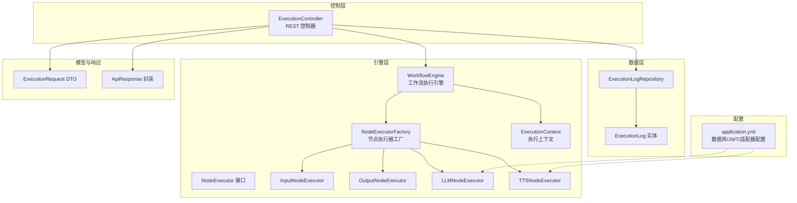
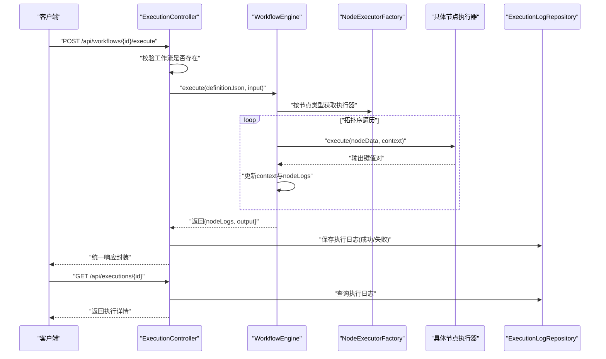
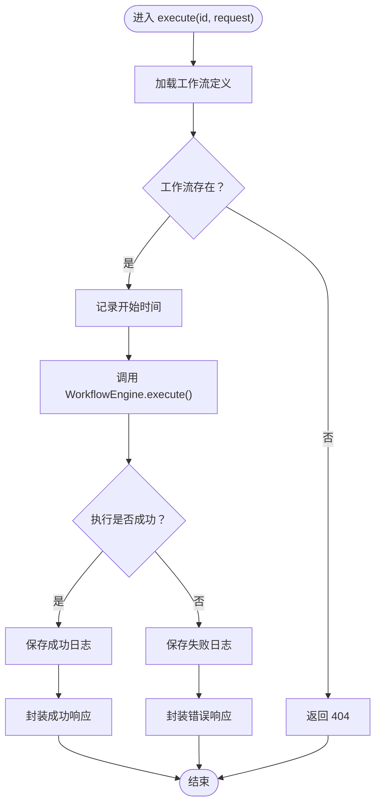
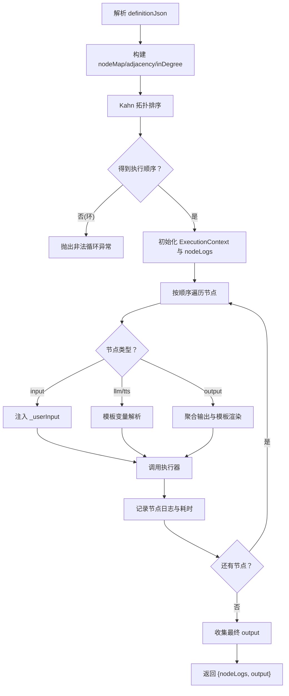
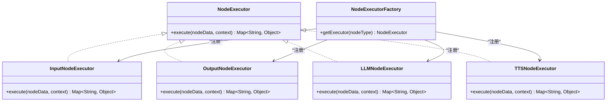
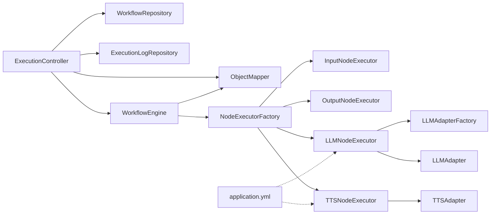

# 执行控制器

<cite>
**本文引用的文件**
- [ExecutionController.java](file://backend/src/main/java/com/paiagent/controller/ExecutionController.java)
- [WorkflowEngine.java](file://backend/src/main/java/com/paiagent/engine/WorkflowEngine.java)
- [ExecutionContext.java](file://backend/src/main/java/com/paiagent/engine/ExecutionContext.java)
- [NodeExecutorFactory.java](file://backend/src/main/java/com/paiagent/engine/NodeExecutorFactory.java)
- [NodeExecutor.java](file://backend/src/main/java/com/paiagent/engine/NodeExecutor.java)
- [InputNodeExecutor.java](file://backend/src/main/java/com/paiagent/engine/executors/InputNodeExecutor.java)
- [OutputNodeExecutor.java](file://backend/src/main/java/com/paiagent/engine/executors/OutputNodeExecutor.java)
- [LLMNodeExecutor.java](file://backend/src/main/java/com/paiagent/engine/executors/LLMNodeExecutor.java)
- [TTSNodeExecutor.java](file://backend/src/main/java/com/paiagent/engine/executors/TTSNodeExecutor.java)
- [ExecutionRequest.java](file://backend/src/main/java/com/paiagent/model/dto/ExecutionRequest.java)
- [ExecutionLog.java](file://backend/src/main/java/com/paiagent/model/entity/ExecutionLog.java)
- [ExecutionLogRepository.java](file://backend/src/main/java/com/paiagent/repository/ExecutionLogRepository.java)
- [ApiResponse.java](file://backend/src/main/java/com/paiagent/model/dto/ApiResponse.java)
- [application.yml](file://backend/src/main/resources/application.yml)
- [execution.ts](file://frontend/src/api/execution.ts)
- [api.ts](file://frontend/src/types/api.ts)
</cite>

## 目录
1. [简介](#简介)
2. [项目结构](#项目结构)
3. [核心组件](#核心组件)
4. [架构总览](#架构总览)
5. [详细组件分析](#详细组件分析)
6. [依赖分析](#依赖分析)
7. [性能考虑](#性能考虑)
8. [故障排除指南](#故障排除指南)
9. [结论](#结论)
10. [附录：执行API文档](#附录执行api文档)

## 简介
本文件面向PaiAgent的执行控制器（ExecutionController），系统性阐述其工作流执行机制与实时结果获取能力。文档覆盖以下关键主题：
- 执行请求处理流程：工作流定义校验、执行上下文创建、执行引擎调用
- 异步执行结果处理：状态跟踪、结果缓存、错误恢复策略
- 与WorkflowEngine的集成：拓扑排序执行、节点执行器调用、执行日志记录
- 完整执行API文档：POST /api/workflows/{id}/execute 与 GET /api/executions/{id}
- 具体代码示例路径、执行流程图与故障排除指南

## 项目结构
后端采用分层架构，执行控制器位于controller层，工作流执行逻辑在engine层，数据持久化通过repository层完成，模型与响应封装在model层。

图表来源
- [ExecutionController.java:18-92](file://backend/src/main/java/com/paiagent/controller/ExecutionController.java#L18-L92)
- [WorkflowEngine.java:10-136](file://backend/src/main/java/com/paiagent/engine/WorkflowEngine.java#L10-L136)
- [NodeExecutorFactory.java:9-29](file://backend/src/main/java/com/paiagent/engine/NodeExecutorFactory.java#L9-L29)
- [ExecutionContext.java:10-63](file://backend/src/main/java/com/paiagent/engine/ExecutionContext.java#L10-L63)
- [ExecutionLogRepository.java:8-11](file://backend/src/main/java/com/paiagent/repository/ExecutionLogRepository.java#L8-L11)
- [ExecutionLog.java:11-37](file://backend/src/main/java/com/paiagent/model/entity/ExecutionLog.java#L11-L37)
- [ExecutionRequest.java:8-12](file://backend/src/main/java/com/paiagent/model/dto/ExecutionRequest.java#L8-L12)
- [ApiResponse.java:10-23](file://backend/src/main/java/com/paiagent/model/dto/ApiResponse.java#L10-L23)
- [application.yml:1-44](file://backend/src/main/resources/application.yml#L1-L44)

章节来源
- [ExecutionController.java:18-92](file://backend/src/main/java/com/paiagent/controller/ExecutionController.java#L18-L92)
- [WorkflowEngine.java:10-136](file://backend/src/main/java/com/paiagent/engine/WorkflowEngine.java#L10-L136)
- [application.yml:1-44](file://backend/src/main/resources/application.yml#L1-L44)

## 核心组件
- 执行控制器（ExecutionController）
  - 提供工作流即时执行与执行结果查询两个HTTP端点
  - 负责工作流存在性校验、异常捕获、执行日志落库与统一响应封装
- 工作流引擎（WorkflowEngine）
  - 解析工作流定义JSON，构建邻接表与入度映射，进行拓扑排序
  - 按序调用节点执行器，维护执行上下文，收集节点日志与最终输出
- 执行上下文（ExecutionContext）
  - 存储各节点输出键值对，支持模板变量解析（如“{{nodeId.key}}”）
- 节点执行器工厂（NodeExecutorFactory）
  - 注册并按类型返回对应节点执行器（输入/输出/LLM/TTS）
- 节点执行器（NodeExecutor 及实现）
  - 输入节点：注入用户输入
  - 输出节点：聚合输出与响应模板渲染
  - LLM节点：模板变量解析后调用适配器
  - TTS节点：从上下文或模板解析文本并合成音频
- 数据与响应
  - 执行日志实体与仓库：持久化执行输入、输出、状态、耗时与时间戳
  - 统一响应封装：统一返回码、数据与消息

章节来源
- [ExecutionController.java:27-92](file://backend/src/main/java/com/paiagent/controller/ExecutionController.java#L27-L92)
- [WorkflowEngine.java:21-108](file://backend/src/main/java/com/paiagent/engine/WorkflowEngine.java#L21-L108)
- [ExecutionContext.java:10-63](file://backend/src/main/java/com/paiagent/engine/ExecutionContext.java#L10-L63)
- [NodeExecutorFactory.java:14-27](file://backend/src/main/java/com/paiagent/engine/NodeExecutorFactory.java#L14-L27)
- [NodeExecutor.java:8-16](file://backend/src/main/java/com/paiagent/engine/NodeExecutor.java#L8-L16)
- [InputNodeExecutor.java:9-18](file://backend/src/main/java/com/paiagent/engine/executors/InputNodeExecutor.java#L9-L18)
- [OutputNodeExecutor.java:10-47](file://backend/src/main/java/com/paiagent/engine/executors/OutputNodeExecutor.java#L10-L47)
- [LLMNodeExecutor.java:12-48](file://backend/src/main/java/com/paiagent/engine/executors/LLMNodeExecutor.java#L12-L48)
- [TTSNodeExecutor.java:11-48](file://backend/src/main/java/com/paiagent/engine/executors/TTSNodeExecutor.java#L11-L48)
- [ExecutionLog.java:11-37](file://backend/src/main/java/com/paiagent/model/entity/ExecutionLog.java#L11-L37)
- [ExecutionLogRepository.java:8-11](file://backend/src/main/java/com/paiagent/repository/ExecutionLogRepository.java#L8-L11)
- [ApiResponse.java:10-23](file://backend/src/main/java/com/paiagent/model/dto/ApiResponse.java#L10-L23)

## 架构总览
执行控制器作为入口，协调工作流引擎与数据层，形成如下闭环：
- 控制器接收请求，校验工作流存在性
- 调用引擎执行，引擎按拓扑顺序执行节点，维护上下文
- 引擎产出节点日志与最终输出，控制器写入执行日志并返回统一响应
- 查询端点用于获取历史执行详情

图表来源
- [ExecutionController.java:37-91](file://backend/src/main/java/com/paiagent/controller/ExecutionController.java#L37-L91)
- [WorkflowEngine.java:21-108](file://backend/src/main/java/com/paiagent/engine/WorkflowEngine.java#L21-L108)
- [NodeExecutorFactory.java:21-27](file://backend/src/main/java/com/paiagent/engine/NodeExecutorFactory.java#L21-L27)

## 详细组件分析

### 执行控制器（ExecutionController）
- 职责
  - 校验工作流存在性，调用引擎执行，捕获异常并记录执行日志
  - 提供执行结果查询接口，返回历史执行详情
- 关键流程
  - POST /api/workflows/{id}/execute
    - 校验工作流存在性
    - 记录开始时间，调用引擎执行
    - 成功：封装结果，写入执行日志，返回统一响应
    - 失败：记录失败日志，返回错误响应
  - GET /api/executions/{id}
    - 查询执行日志，不存在则返回404

图表来源
- [ExecutionController.java:37-82](file://backend/src/main/java/com/paiagent/controller/ExecutionController.java#L37-L82)

章节来源
- [ExecutionController.java:27-92](file://backend/src/main/java/com/paiagent/controller/ExecutionController.java#L27-L92)

### 工作流引擎（WorkflowEngine）
- 职责
  - 解析工作流定义，构建有向图，进行拓扑排序，按序执行节点
  - 维护执行上下文，收集节点日志，提取最终输出
- 关键算法
  - 邻接表与入度构建：遍历节点与边，初始化映射
  - 拓扑排序（Kahn算法）：基于入度队列生成执行顺序
  - 节点执行：根据类型获取执行器，注入用户输入（输入节点），记录节点日志
- 输出结构
  - 包含节点执行日志列表与最终输出对象

图表来源
- [WorkflowEngine.java:21-108](file://backend/src/main/java/com/paiagent/engine/WorkflowEngine.java#L21-L108)
- [WorkflowEngine.java:110-134](file://backend/src/main/java/com/paiagent/engine/WorkflowEngine.java#L110-L134)

章节来源
- [WorkflowEngine.java:10-136](file://backend/src/main/java/com/paiagent/engine/WorkflowEngine.java#L10-L136)

### 执行上下文（ExecutionContext）
- 职责
  - 存储每个节点的输出键值对，支持跨节点引用
  - 提供模板解析能力，将“{{nodeId.key}}”替换为实际值
- 复杂度
  - 设置/读取单个键值为O(1)，模板解析线性于模板长度

章节来源
- [ExecutionContext.java:10-63](file://backend/src/main/java/com/paiagent/engine/ExecutionContext.java#L10-L63)

### 节点执行器与工厂
- 工厂注册
  - input → InputNodeExecutor
  - output → OutputNodeExecutor
  - llm → LLMNodeExecutor
  - tts → TTSNodeExecutor
- 执行器职责
  - InputNodeExecutor：将用户输入注入到输出
  - OutputNodeExecutor：按引用聚合输出，渲染响应模板，识别音频URL
  - LLMNodeExecutor：解析模板，调用适配器，返回大模型回复
  - TTSNodeExecutor：解析输入文本，调用TTS适配器，返回音频URL

图表来源
- [NodeExecutor.java:8-16](file://backend/src/main/java/com/paiagent/engine/NodeExecutor.java#L8-L16)
- [InputNodeExecutor.java:9-18](file://backend/src/main/java/com/paiagent/engine/executors/InputNodeExecutor.java#L9-L18)
- [OutputNodeExecutor.java:10-47](file://backend/src/main/java/com/paiagent/engine/executors/OutputNodeExecutor.java#L10-L47)
- [LLMNodeExecutor.java:12-48](file://backend/src/main/java/com/paiagent/engine/executors/LLMNodeExecutor.java#L12-L48)
- [TTSNodeExecutor.java:11-48](file://backend/src/main/java/com/paiagent/engine/executors/TTSNodeExecutor.java#L11-L48)
- [NodeExecutorFactory.java:14-27](file://backend/src/main/java/com/paiagent/engine/NodeExecutorFactory.java#L14-L27)

章节来源
- [NodeExecutorFactory.java:9-29](file://backend/src/main/java/com/paiagent/engine/NodeExecutorFactory.java#L9-L29)
- [NodeExecutor.java:8-16](file://backend/src/main/java/com/paiagent/engine/NodeExecutor.java#L8-L16)
- [InputNodeExecutor.java:9-18](file://backend/src/main/java/com/paiagent/engine/executors/InputNodeExecutor.java#L9-L18)
- [OutputNodeExecutor.java:10-47](file://backend/src/main/java/com/paiagent/engine/executors/OutputNodeExecutor.java#L10-L47)
- [LLMNodeExecutor.java:12-48](file://backend/src/main/java/com/paiagent/engine/executors/LLMNodeExecutor.java#L12-L48)
- [TTSNodeExecutor.java:11-48](file://backend/src/main/java/com/paiagent/engine/executors/TTSNodeExecutor.java#L11-L48)

### 执行日志与数据持久化
- 实体字段
  - id、workflow_id、input、output、status、duration_ms、node_logs、created_at
- 仓库方法
  - 按工作流ID降序查询最近执行记录
- 控制器行为
  - 成功/失败均写入日志，包含输入、状态、耗时与时间戳

章节来源
- [ExecutionLog.java:11-37](file://backend/src/main/java/com/paiagent/model/entity/ExecutionLog.java#L11-L37)
- [ExecutionLogRepository.java:8-11](file://backend/src/main/java/com/paiagent/repository/ExecutionLogRepository.java#L8-L11)
- [ExecutionController.java:50-81](file://backend/src/main/java/com/paiagent/controller/ExecutionController.java#L50-L81)

## 依赖分析
- 控制器依赖
  - WorkflowRepository：工作流存在性校验
  - ExecutionLogRepository：执行日志持久化
  - WorkflowEngine：工作流执行
  - ObjectMapper：日志输出序列化
- 引擎依赖
  - NodeExecutorFactory：节点执行器选择
  - ObjectMapper：工作流定义反序列化
- 执行器依赖
  - LLMNodeExecutor：LLMAdapterFactory 与 LLMAdapter
  - TTSNodeExecutor：TTSAdapter
- 配置依赖
  - application.yml：数据库连接、JPA方言、JWT密钥、LLM/TTS适配器基础地址与凭据、存储路径

图表来源
- [ExecutionController.java:22-35](file://backend/src/main/java/com/paiagent/controller/ExecutionController.java#L22-L35)
- [WorkflowEngine.java:12-18](file://backend/src/main/java/com/paiagent/engine/WorkflowEngine.java#L12-L18)
- [NodeExecutorFactory.java:14-19](file://backend/src/main/java/com/paiagent/engine/NodeExecutorFactory.java#L14-L19)
- [LLMNodeExecutor.java:15-19](file://backend/src/main/java/com/paiagent/engine/executors/LLMNodeExecutor.java#L15-L19)
- [TTSNodeExecutor.java:14-17](file://backend/src/main/java/com/paiagent/engine/executors/TTSNodeExecutor.java#L14-L17)
- [application.yml:21-39](file://backend/src/main/resources/application.yml#L21-L39)

章节来源
- [ExecutionController.java:22-35](file://backend/src/main/java/com/paiagent/controller/ExecutionController.java#L22-L35)
- [WorkflowEngine.java:12-18](file://backend/src/main/java/com/paiagent/engine/WorkflowEngine.java#L12-L18)
- [NodeExecutorFactory.java:14-19](file://backend/src/main/java/com/paiagent/engine/NodeExecutorFactory.java#L14-L19)
- [LLMNodeExecutor.java:15-19](file://backend/src/main/java/com/paiagent/engine/executors/LLMNodeExecutor.java#L15-L19)
- [TTSNodeExecutor.java:14-17](file://backend/src/main/java/com/paiagent/engine/executors/TTSNodeExecutor.java#L14-L17)
- [application.yml:21-39](file://backend/src/main/resources/application.yml#L21-L39)

## 性能考虑
- 时间复杂度
  - 工作流解析与图构建：O(N+E)，N为节点数，E为边数
  - 拓扑排序：O(N+E)
  - 节点执行：O(N)（假设单次执行为常数时间）
- 空间复杂度
  - 图结构与入度映射：O(N+E)
  - 执行上下文：O(N)（按节点输出数量）
- 建议
  - 对大型工作流可考虑分批执行或并行化（当前实现按拓扑顺序串行）
  - 日志序列化与入库应避免阻塞主线程（当前控制器同步写库）

[本节为通用性能讨论，不直接分析具体文件]

## 故障排除指南
- 常见错误与定位
  - 工作流未找到：检查工作流ID与数据库中记录
  - 执行失败：查看执行日志状态与错误信息
  - 循环依赖：拓扑排序阶段会抛出异常，需修正工作流定义
  - LLM/TTS适配器配置缺失：检查application.yml中的相关配置项
- 诊断步骤
  - 使用GET /api/executions/{id} 获取执行详情
  - 检查日志实体的status、duration_ms与createdAt
  - 核对工作流定义JSON的nodes/edges格式与节点类型

章节来源
- [ExecutionController.java:40-43](file://backend/src/main/java/com/paiagent/controller/ExecutionController.java#L40-L43)
- [ExecutionController.java:65-81](file://backend/src/main/java/com/paiagent/controller/ExecutionController.java#L65-L81)
- [WorkflowEngine.java:130-133](file://backend/src/main/java/com/paiagent/engine/WorkflowEngine.java#L130-L133)
- [application.yml:21-39](file://backend/src/main/resources/application.yml#L21-L39)

## 结论
执行控制器通过清晰的职责划分与标准的执行流程，实现了工作流的即时执行与结果查询。结合拓扑排序与执行上下文，引擎能够稳定地串联多节点执行，并通过统一响应与日志持久化提供可观测性。建议后续在大规模场景下引入异步执行与并发优化，以进一步提升吞吐量与用户体验。

[本节为总结性内容，不直接分析具体文件]

## 附录：执行API文档

### POST /api/workflows/{id}/execute
- 功能
  - 触发指定工作流的即时执行
- 请求参数
  - 路径参数
    - id: 工作流ID（字符串）
  - 请求体
    - input: 用户输入（字符串，必填）
- 响应
  - 成功：返回包含执行结果、状态、耗时与executionId的封装响应
  - 失败：返回错误码与错误信息
- 示例（请求）
  - 路径：/api/workflows/{id}/execute
  - 方法：POST
  - 请求体：{"input": "示例输入"}
- 示例（响应）
  - 成功：{"code": 200, "data": {"executionId": "...", "status": "SUCCESS", "durationMs": 123, ...}, "message": "ok"}
  - 失败：{"code": 500, "data": null, "message": "Execution failed: ..."}

章节来源
- [ExecutionController.java:37-82](file://backend/src/main/java/com/paiagent/controller/ExecutionController.java#L37-L82)
- [ExecutionRequest.java:8-12](file://backend/src/main/java/com/paiagent/model/dto/ExecutionRequest.java#L8-L12)
- [ApiResponse.java:15-21](file://backend/src/main/java/com/paiagent/model/dto/ApiResponse.java#L15-L21)

### GET /api/executions/{id}
- 功能
  - 查询指定执行ID的历史执行详情
- 请求参数
  - 路径参数
    - id: 执行ID（字符串）
- 响应
  - 成功：返回执行日志实体
  - 失败：返回404与错误信息
- 示例（请求）
  - 路径：/api/executions/{id}
  - 方法：GET
- 示例（响应）
  - 成功：{"code": 200, "data": {...执行日志字段...}, "message": "ok"}
  - 失败：{"code": 404, "data": null, "message": "Execution not found"}

章节来源
- [ExecutionController.java:84-91](file://backend/src/main/java/com/paiagent/controller/ExecutionController.java#L84-L91)
- [ExecutionLog.java:11-37](file://backend/src/main/java/com/paiagent/model/entity/ExecutionLog.java#L11-L37)
- [ApiResponse.java:15-21](file://backend/src/main/java/com/paiagent/model/dto/ApiResponse.java#L15-L21)

### 前端调用参考
- 执行工作流
  - 调用路径：/workflows/{workflowId}/execute
  - 参数：{ input }
- 获取执行结果
  - 调用路径：/executions/{executionId}

章节来源
- [execution.ts:6-12](file://frontend/src/api/execution.ts#L6-L12)
- [api.ts:17-21](file://frontend/src/types/api.ts#L17-L21)