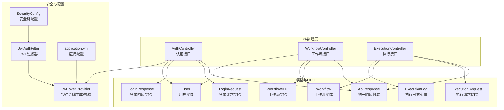
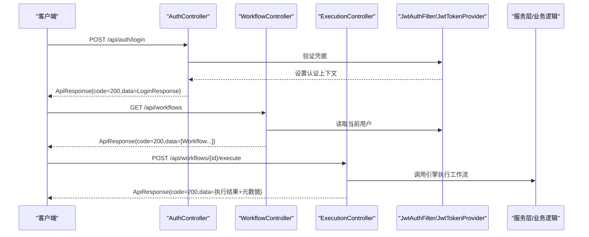
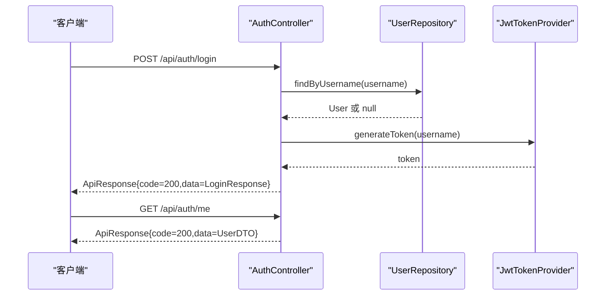
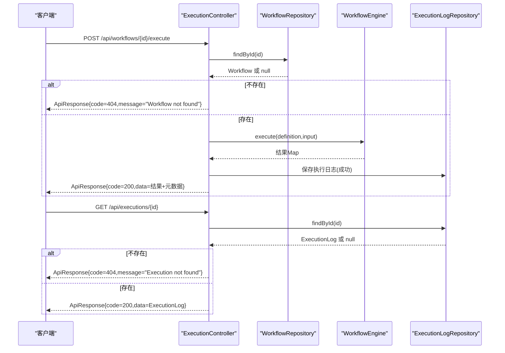
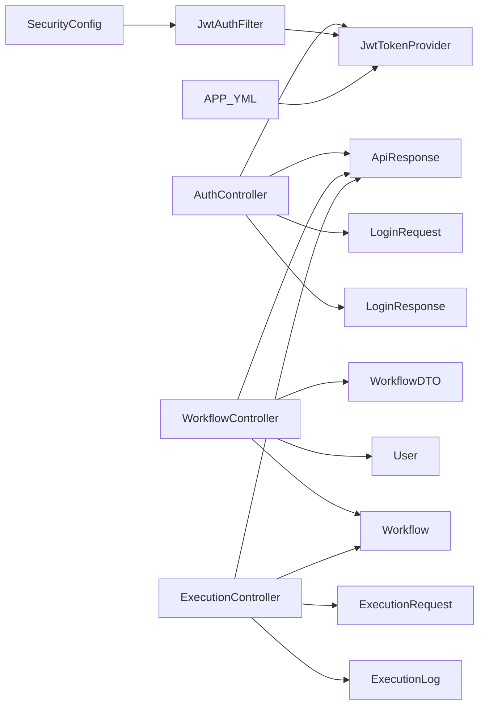

# 控制器层设计

<cite>
**本文引用的文件**
- [AuthController.java](file://backend/src/main/java/com/paiagent/controller/AuthController.java)
- [WorkflowController.java](file://backend/src/main/java/com/paiagent/controller/WorkflowController.java)
- [ExecutionController.java](file://backend/src/main/java/com/paiagent/controller/ExecutionController.java)
- [ApiResponse.java](file://backend/src/main/java/com/paiagent/model/dto/ApiResponse.java)
- [LoginRequest.java](file://backend/src/main/java/com/paiagent/model/dto/LoginRequest.java)
- [LoginResponse.java](file://backend/src/main/java/com/paiagent/model/dto/LoginResponse.java)
- [ExecutionRequest.java](file://backend/src/main/java/com/paiagent/model/dto/ExecutionRequest.java)
- [WorkflowDTO.java](file://backend/src/main/java/com/paiagent/model/dto/WorkflowDTO.java)
- [User.java](file://backend/src/main/java/com/paiagent/model/entity/User.java)
- [Workflow.java](file://backend/src/main/java/com/paiagent/model/entity/Workflow.java)
- [ExecutionLog.java](file://backend/src/main/java/com/paiagent/model/entity/ExecutionLog.java)
- [JwtAuthFilter.java](file://backend/src/main/java/com/paiagent/security/JwtAuthFilter.java)
- [JwtTokenProvider.java](file://backend/src/main/java/com/paiagent/security/JwtTokenProvider.java)
- [SecurityConfig.java](file://backend/src/main/java/com/paiagent/config/SecurityConfig.java)
- [GlobalExceptionHandler.java](file://backend/src/main/java/com/paiagent/exception/GlobalExceptionHandler.java)
- [application.yml](file://backend/src/main/resources/application.yml)
</cite>

## 目录
1. [引言](#引言)
2. [项目结构](#项目结构)
3. [核心组件](#核心组件)
4. [架构总览](#架构总览)
5. [详细组件分析](#详细组件分析)
6. [依赖分析](#依赖分析)
7. [性能考虑](#性能考虑)
8. [故障排查指南](#故障排查指南)
9. [结论](#结论)
10. [附录：API 端点文档](#附录api-端点文档)

## 引言
本文件面向PaiAgent后端控制器层，系统性阐述RESTful API控制器的设计原则与实现模式，覆盖认证控制、工作流控制与执行控制三大控制器的职责边界；统一的API响应封装与错误码标准化；请求参数验证与DTO设计；控制器与服务层交互流程及依赖注入最佳实践；并提供完整端点清单与错误处理策略说明。

## 项目结构
控制器层位于后端模块的controller包中，配合model/dto中的数据传输对象、model/entity中的持久化实体、security中的鉴权过滤器与令牌提供者、config中的安全配置以及exception中的全局异常处理器共同构成完整的API层。



图表来源
- [AuthController.java:1-56](file://backend/src/main/java/com/paiagent/controller/AuthController.java#L1-L56)
- [WorkflowController.java:1-91](file://backend/src/main/java/com/paiagent/controller/WorkflowController.java#L1-L91)
- [ExecutionController.java:1-93](file://backend/src/main/java/com/paiagent/controller/ExecutionController.java#L1-L93)
- [ApiResponse.java:1-23](file://backend/src/main/java/com/paiagent/model/dto/ApiResponse.java#L1-L23)
- [LoginRequest.java:1-14](file://backend/src/main/java/com/paiagent/model/dto/LoginRequest.java#L1-L14)
- [LoginResponse.java:1-20](file://backend/src/main/java/com/paiagent/model/dto/LoginResponse.java#L1-L20)
- [ExecutionRequest.java:1-12](file://backend/src/main/java/com/paiagent/model/dto/ExecutionRequest.java#L1-L12)
- [WorkflowDTO.java:1-13](file://backend/src/main/java/com/paiagent/model/dto/WorkflowDTO.java#L1-L13)
- [User.java:1-28](file://backend/src/main/java/com/paiagent/model/entity/User.java#L1-L28)
- [Workflow.java:1-31](file://backend/src/main/java/com/paiagent/model/entity/Workflow.java#L1-L31)
- [ExecutionLog.java:1-37](file://backend/src/main/java/com/paiagent/model/entity/ExecutionLog.java#L1-L37)
- [JwtTokenProvider.java:1-55](file://backend/src/main/java/com/paiagent/security/JwtTokenProvider.java#L1-L55)
- [JwtAuthFilter.java:1-51](file://backend/src/main/java/com/paiagent/security/JwtAuthFilter.java#L1-L51)
- [SecurityConfig.java:1-54](file://backend/src/main/java/com/paiagent/config/SecurityConfig.java#L1-L54)
- [application.yml:1-44](file://backend/src/main/resources/application.yml#L1-L44)

章节来源
- [AuthController.java:1-56](file://backend/src/main/java/com/paiagent/controller/AuthController.java#L1-L56)
- [WorkflowController.java:1-91](file://backend/src/main/java/com/paiagent/controller/WorkflowController.java#L1-L91)
- [ExecutionController.java:1-93](file://backend/src/main/java/com/paiagent/controller/ExecutionController.java#L1-L93)
- [SecurityConfig.java:1-54](file://backend/src/main/java/com/paiagent/config/SecurityConfig.java#L1-L54)

## 核心组件
- 统一响应封装：通过泛型ApiResponse<T>提供success/error两种静态工厂方法，统一返回结构与状态码语义。
- DTO设计：LoginRequest、LoginResponse、ExecutionRequest、WorkflowDTO等，使用注解进行参数校验，确保输入约束。
- 安全控制：基于JWT的无状态认证，通过JwtAuthFilter在请求进入时解析Authorization头并设置认证上下文。
- 全局异常处理：对非法参数、运行时异常与通用异常进行捕获并以统一响应格式返回。

章节来源
- [ApiResponse.java:1-23](file://backend/src/main/java/com/paiagent/model/dto/ApiResponse.java#L1-L23)
- [LoginRequest.java:1-14](file://backend/src/main/java/com/paiagent/model/dto/LoginRequest.java#L1-L14)
- [LoginResponse.java:1-20](file://backend/src/main/java/com/paiagent/model/dto/LoginResponse.java#L1-L20)
- [ExecutionRequest.java:1-12](file://backend/src/main/java/com/paiagent/model/dto/ExecutionRequest.java#L1-L12)
- [WorkflowDTO.java:1-13](file://backend/src/main/java/com/paiagent/model/dto/WorkflowDTO.java#L1-L13)
- [JwtAuthFilter.java:1-51](file://backend/src/main/java/com/paiagent/security/JwtAuthFilter.java#L1-L51)
- [GlobalExceptionHandler.java:1-30](file://backend/src/main/java/com/paiagent/exception/GlobalExceptionHandler.java#L1-L30)

## 架构总览
控制器层采用分层设计，职责清晰：
- AuthController：负责用户登录与当前用户信息查询，返回含JWT令牌与用户信息的响应。
- WorkflowController：负责工作流的CRUD操作，基于当前认证用户身份进行数据隔离。
- ExecutionController：负责执行工作流定义并记录执行日志，返回执行结果与元数据。



图表来源
- [AuthController.java:31-43](file://backend/src/main/java/com/paiagent/controller/AuthController.java#L31-L43)
- [WorkflowController.java:35-40](file://backend/src/main/java/com/paiagent/controller/WorkflowController.java#L35-L40)
- [ExecutionController.java:37-82](file://backend/src/main/java/com/paiagent/controller/ExecutionController.java#L37-L82)
- [JwtAuthFilter.java:26-41](file://backend/src/main/java/com/paiagent/security/JwtAuthFilter.java#L26-L41)
- [JwtTokenProvider.java:25-43](file://backend/src/main/java/com/paiagent/security/JwtTokenProvider.java#L25-L43)

## 详细组件分析

### AuthController 分析
职责与流程
- 登录接口：接收用户名/密码，校验失败返回401；成功则签发JWT并返回令牌与用户信息。
- 当前用户接口：从安全上下文中提取用户名，查询用户并返回用户信息。



图表来源
- [AuthController.java:31-54](file://backend/src/main/java/com/paiagent/controller/AuthController.java#L31-L54)
- [JwtTokenProvider.java:25-35](file://backend/src/main/java/com/paiagent/security/JwtTokenProvider.java#L25-L35)

章节来源
- [AuthController.java:1-56](file://backend/src/main/java/com/paiagent/controller/AuthController.java#L1-L56)
- [LoginRequest.java:1-14](file://backend/src/main/java/com/paiagent/model/dto/LoginRequest.java#L1-L14)
- [LoginResponse.java:1-20](file://backend/src/main/java/com/paiagent/model/dto/LoginResponse.java#L1-L20)
- [User.java:1-28](file://backend/src/main/java/com/paiagent/model/entity/User.java#L1-L28)

### WorkflowController 分析
职责与流程
- 列表：按当前用户ID查询工作流列表，按更新时间倒序。
- 查询：按ID查询工作流，不存在返回404。
- 创建：接收WorkflowDTO，生成UUID作为主键，序列化definition，保存后返回。
- 更新：按ID查找并更新，不存在返回404。
- 删除：按ID删除。

```mermaid
flowchart TD
Start(["请求进入"]) --> GetID["获取当前用户ID"]
GetID --> Op{"操作类型"}
Op --> |GET /api/workflows| List["查询用户工作流列表"]
Op --> |GET /api/workflows/{id}| Detail["按ID查询工作流"]
Op --> |POST /api/workflows| Create["创建新工作流"]
Op --> |PUT /api/workflows/{id}| Update["更新工作流"]
Op --> |DELETE /api/workflows/{id}| Delete["删除工作流"]
Detail --> Found{"存在?"}
Found --> |否| Err404["返回404"]
Found --> |是| ReturnOK["返回200"]
Create --> Build["构建Workflow实体并序列化definition"]
Build --> Save["保存到数据库"]
Save --> ReturnOK
Update --> Exists{"存在?"}
Exists --> |否| Err404
Exists --> |是| Merge["合并字段并序列化definition"]
Merge --> Save
Save --> ReturnOK
Delete --> Del["删除"]
Del --> ReturnOK
```

图表来源
- [WorkflowController.java:35-89](file://backend/src/main/java/com/paiagent/controller/WorkflowController.java#L35-L89)
- [WorkflowDTO.java:1-13](file://backend/src/main/java/com/paiagent/model/dto/WorkflowDTO.java#L1-L13)
- [Workflow.java:1-31](file://backend/src/main/java/com/paiagent/model/entity/Workflow.java#L1-L31)

章节来源
- [WorkflowController.java:1-91](file://backend/src/main/java/com/paiagent/controller/WorkflowController.java#L1-L91)
- [WorkflowDTO.java:1-13](file://backend/src/main/java/com/paiagent/model/dto/WorkflowDTO.java#L1-L13)
- [Workflow.java:1-31](file://backend/src/main/java/com/paiagent/model/entity/Workflow.java#L1-L31)

### ExecutionController 分析
职责与流程
- 执行：根据工作流ID加载definition，调用引擎执行，记录执行日志（成功/失败），返回结果与元数据。
- 查询执行：根据执行ID查询执行日志，不存在返回404。



图表来源
- [ExecutionController.java:37-91](file://backend/src/main/java/com/paiagent/controller/ExecutionController.java#L37-L91)
- [ExecutionLog.java:1-37](file://backend/src/main/java/com/paiagent/model/entity/ExecutionLog.java#L1-L37)

章节来源
- [ExecutionController.java:1-93](file://backend/src/main/java/com/paiagent/controller/ExecutionController.java#L1-L93)
- [ExecutionRequest.java:1-12](file://backend/src/main/java/com/paiagent/model/dto/ExecutionRequest.java#L1-L12)
- [ExecutionLog.java:1-37](file://backend/src/main/java/com/paiagent/model/entity/ExecutionLog.java#L1-L37)

### DTO 与参数验证
- LoginRequest：用户名与密码非空校验。
- ExecutionRequest：输入字段非空校验。
- WorkflowDTO：名称非空，definition为对象。
- 响应封装：ApiResponse<T>提供统一的code/data/message结构，success/error工厂方法保证一致性。

章节来源
- [LoginRequest.java:1-14](file://backend/src/main/java/com/paiagent/model/dto/LoginRequest.java#L1-L14)
- [ExecutionRequest.java:1-12](file://backend/src/main/java/com/paiagent/model/dto/ExecutionRequest.java#L1-L12)
- [WorkflowDTO.java:1-13](file://backend/src/main/java/com/paiagent/model/dto/WorkflowDTO.java#L1-L13)
- [ApiResponse.java:1-23](file://backend/src/main/java/com/paiagent/model/dto/ApiResponse.java#L1-L23)

### 控制器与服务层交互与依赖注入
- 控制器通过构造函数注入所需依赖（仓库、引擎、ObjectMapper等），遵循不可变注入与最小暴露原则。
- 安全上下文由JwtAuthFilter在过滤链中设置，控制器通过SecurityContextHolder读取当前用户。
- 业务逻辑集中在服务层或引擎层，控制器仅负责编排与响应封装。

章节来源
- [AuthController.java:24-29](file://backend/src/main/java/com/paiagent/controller/AuthController.java#L24-L29)
- [WorkflowController.java:28-33](file://backend/src/main/java/com/paiagent/controller/WorkflowController.java#L28-L33)
- [ExecutionController.java:27-35](file://backend/src/main/java/com/paiagent/controller/ExecutionController.java#L27-L35)
- [JwtAuthFilter.java:26-41](file://backend/src/main/java/com/paiagent/security/JwtAuthFilter.java#L26-L41)

## 依赖分析
- 控制器之间无直接耦合，均通过共享的仓库与工具类协作。
- 安全过滤器链在HttpSecurity中注册，拦截/api/**路径并要求认证。
- JWT密钥与过期时间来自application.yml，令牌生成与校验由JwtTokenProvider提供。



图表来源
- [AuthController.java:1-56](file://backend/src/main/java/com/paiagent/controller/AuthController.java#L1-L56)
- [WorkflowController.java:1-91](file://backend/src/main/java/com/paiagent/controller/WorkflowController.java#L1-L91)
- [ExecutionController.java:1-93](file://backend/src/main/java/com/paiagent/controller/ExecutionController.java#L1-L93)
- [JwtAuthFilter.java:1-51](file://backend/src/main/java/com/paiagent/security/JwtAuthFilter.java#L1-L51)
- [SecurityConfig.java:26-42](file://backend/src/main/java/com/paiagent/config/SecurityConfig.java#L26-L42)
- [application.yml:16-19](file://backend/src/main/resources/application.yml#L16-L19)

章节来源
- [SecurityConfig.java:1-54](file://backend/src/main/java/com/paiagent/config/SecurityConfig.java#L1-L54)
- [application.yml:1-44](file://backend/src/main/resources/application.yml#L1-L44)

## 性能考虑
- 执行耗时统计：执行控制器在try块前后记录毫秒级耗时，并写入执行日志，便于性能监控与回溯。
- JSON序列化：使用ObjectMapper将definition与输出序列化/反序列化，建议在DTO层保持轻量结构以减少序列化开销。
- 数据库访问：工作流列表按用户ID与更新时间排序，建议在用户ID与更新时间上建立索引以提升查询性能。
- 安全过滤：启用无状态会话策略，避免服务器端会话存储带来的扩展性问题。

章节来源
- [ExecutionController.java:45-59](file://backend/src/main/java/com/paiagent/controller/ExecutionController.java#L45-L59)
- [WorkflowController.java:37-39](file://backend/src/main/java/com/paiagent/controller/WorkflowController.java#L37-L39)

## 故障排查指南
- 认证失败：登录接口返回401，检查用户名/密码是否匹配，确认密码编码器配置一致。
- 未授权访问：/api/**需携带有效Bearer Token，检查Authorization头格式与令牌有效性。
- 资源不存在：工作流/执行记录不存在返回404，核对ID与所属用户。
- 参数校验失败：请求体字段缺失或为空导致400，检查DTO注解与前端传参。
- 服务器内部错误：执行异常返回500，查看执行日志与异常堆栈，确认引擎执行过程与外部依赖可用性。

章节来源
- [AuthController.java:36-42](file://backend/src/main/java/com/paiagent/controller/AuthController.java#L36-L42)
- [WorkflowController.java:44-48](file://backend/src/main/java/com/paiagent/controller/WorkflowController.java#L44-L48)
- [ExecutionController.java:40-43](file://backend/src/main/java/com/paiagent/controller/ExecutionController.java#L40-L43)
- [ExecutionController.java:84-91](file://backend/src/main/java/com/paiagent/controller/ExecutionController.java#L84-L91)
- [GlobalExceptionHandler.java:12-28](file://backend/src/main/java/com/paiagent/exception/GlobalExceptionHandler.java#L12-L28)

## 结论
控制器层通过清晰的职责划分、统一的响应封装与严格的参数校验，实现了高内聚低耦合的RESTful接口设计。结合JWT无状态认证与全局异常处理，整体具备良好的可维护性与可扩展性。建议后续在执行引擎与外部LLM/TTS服务间增加超时与重试策略，并完善执行日志的节点级追踪能力。

## 附录：API 端点文档

- 认证接口
  - 登录
    - 方法：POST
    - 路径：/api/auth/login
    - 请求体：LoginRequest（用户名、密码）
    - 响应体：ApiResponse<LoginResponse>（code=200，data包含token与UserDTO）
  - 获取当前用户
    - 方法：GET
    - 路径：/api/auth/me
    - 响应体：ApiResponse<LoginResponse.UserDTO>

- 工作流接口
  - 列出工作流
    - 方法：GET
    - 路径：/api/workflows
    - 响应体：ApiResponse<List<Workflow>>
  - 获取工作流详情
    - 方法：GET
    - 路径：/api/workflows/{id}
    - 响应体：ApiResponse<Workflow>
  - 创建工作流
    - 方法：POST
    - 路径：/api/workflows
    - 请求体：WorkflowDTO（name、definition）
    - 响应体：ApiResponse<Workflow>
  - 更新工作流
    - 方法：PUT
    - 路径：/api/workflows/{id}
    - 请求体：WorkflowDTO（name、definition）
    - 响应体：ApiResponse<Workflow>
  - 删除工作流
    - 方法：DELETE
    - 路径：/api/workflows/{id}
    - 响应体：ApiResponse<Void>

- 执行接口
  - 执行工作流
    - 方法：POST
    - 路径：/api/workflows/{id}/execute
    - 请求体：ExecutionRequest（input）
    - 响应体：ApiResponse<Map<String,Object>>（包含执行结果与元数据：executionId、status、durationMs）
  - 查询执行记录
    - 方法：GET
    - 路径：/api/executions/{id}
    - 响应体：ApiResponse<ExecutionLog>

章节来源
- [AuthController.java:31-54](file://backend/src/main/java/com/paiagent/controller/AuthController.java#L31-L54)
- [WorkflowController.java:35-82](file://backend/src/main/java/com/paiagent/controller/WorkflowController.java#L35-L82)
- [ExecutionController.java:37-91](file://backend/src/main/java/com/paiagent/controller/ExecutionController.java#L37-L91)
- [LoginRequest.java:1-14](file://backend/src/main/java/com/paiagent/model/dto/LoginRequest.java#L1-L14)
- [LoginResponse.java:1-20](file://backend/src/main/java/com/paiagent/model/dto/LoginResponse.java#L1-L20)
- [ExecutionRequest.java:1-12](file://backend/src/main/java/com/paiagent/model/dto/ExecutionRequest.java#L1-L12)
- [WorkflowDTO.java:1-13](file://backend/src/main/java/com/paiagent/model/dto/WorkflowDTO.java#L1-L13)