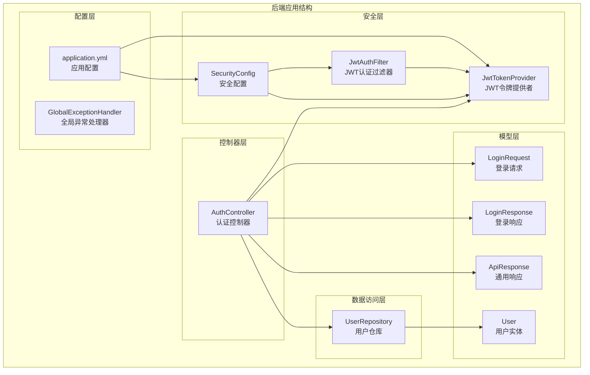
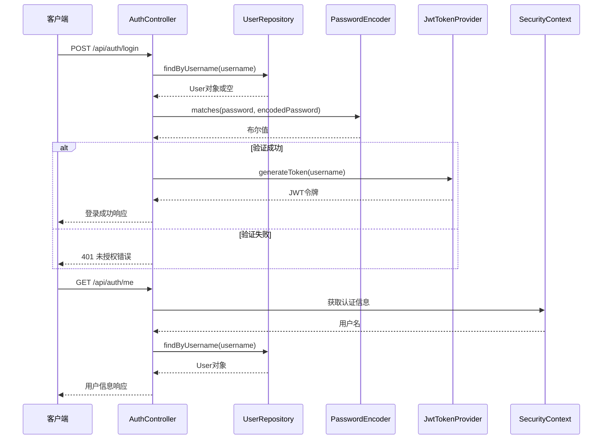
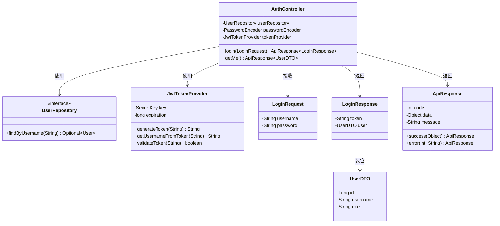
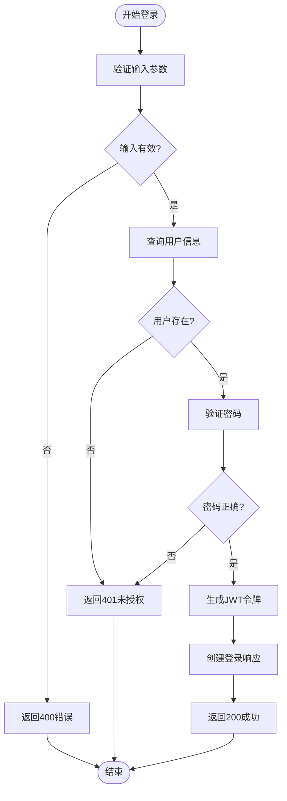
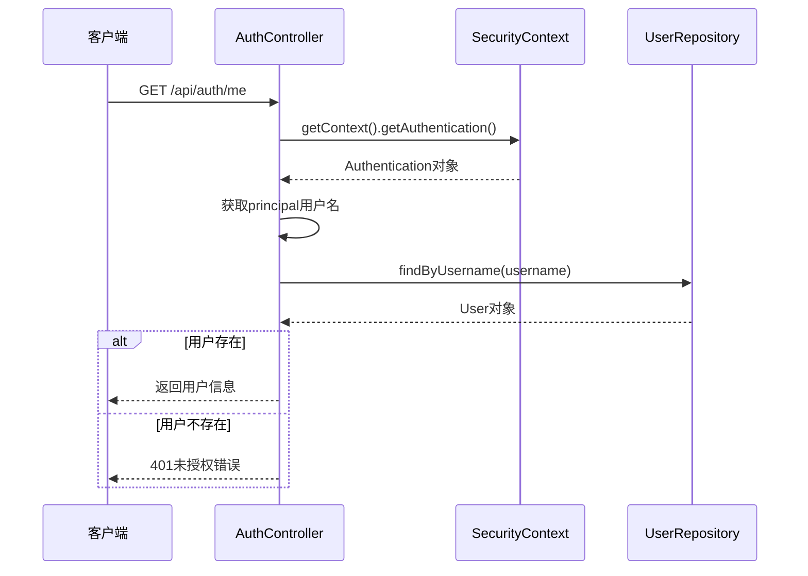
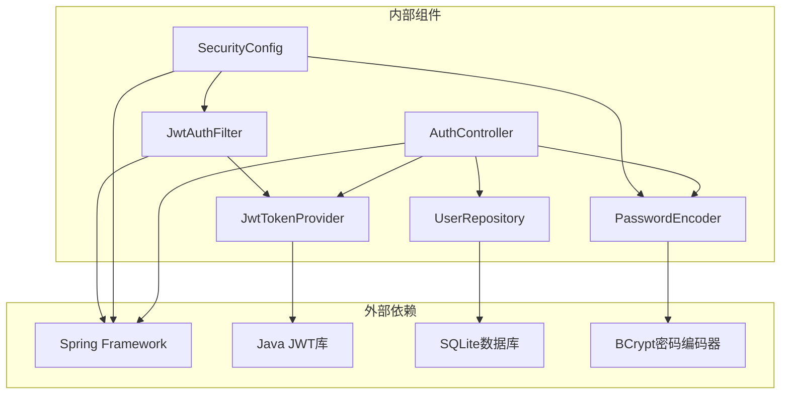
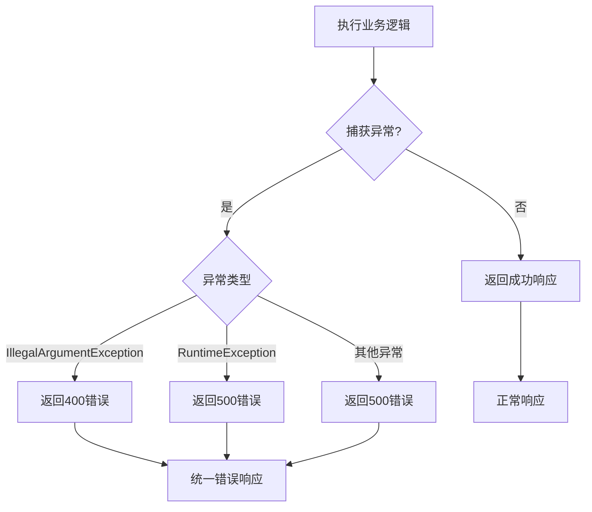

# 认证控制器

<cite>
**本文档引用的文件**
- [AuthController.java](file://backend/src/main/java/com/paiagent/controller/AuthController.java)
- [JwtTokenProvider.java](file://backend/src/main/java/com/paiagent/security/JwtTokenProvider.java)
- [JwtAuthFilter.java](file://backend/src/main/java/com/paiagent/security/JwtAuthFilter.java)
- [SecurityConfig.java](file://backend/src/main/java/com/paiagent/config/SecurityConfig.java)
- [UserRepository.java](file://backend/src/main/java/com/paiagent/repository/UserRepository.java)
- [User.java](file://backend/src/main/java/com/paiagent/model/entity/User.java)
- [LoginRequest.java](file://backend/src/main/java/com/paiagent/model/dto/LoginRequest.java)
- [LoginResponse.java](file://backend/src/main/java/com/paiagent/model/dto/LoginResponse.java)
- [ApiResponse.java](file://backend/src/main/java/com/paiagent/model/dto/ApiResponse.java)
- [application.yml](file://backend/src/main/resources/application.yml)
- [GlobalExceptionHandler.java](file://backend/src/main/java/com/paiagent/exception/GlobalExceptionHandler.java)
</cite>

## 目录
1. [简介](#简介)
2. [项目结构](#项目结构)
3. [核心组件](#核心组件)
4. [架构概览](#架构概览)
5. [详细组件分析](#详细组件分析)
6. [依赖关系分析](#依赖关系分析)
7. [性能考虑](#性能考虑)
8. [故障排除指南](#故障排除指南)
9. [结论](#结论)

## 简介

PaiAgent认证控制器是系统安全架构的核心组件，负责处理用户身份验证和授权管理。该控制器实现了基于JWT（JSON Web Token）的无状态认证机制，提供了用户登录认证和用户信息获取两大核心功能。

本控制器采用Spring Boot框架构建，集成了Spring Security进行安全过滤，并使用BCrypt密码编码器确保密码存储的安全性。系统通过依赖注入模式实现了清晰的组件分离，便于维护和扩展。

## 项目结构

认证控制器位于后端项目的controller包中，与安全配置、数据访问层和模型定义形成完整的分层架构：

**图表来源**
- [AuthController.java:16-29](file://backend/src/main/java/com/paiagent/controller/AuthController.java#L16-L29)
- [SecurityConfig.java:18-52](file://backend/src/main/java/com/paiagent/config/SecurityConfig.java#L18-L52)
- [JwtAuthFilter.java:17-24](file://backend/src/main/java/com/paiagent/security/JwtAuthFilter.java#L17-L24)

**章节来源**
- [AuthController.java:1-56](file://backend/src/main/java/com/paiagent/controller/AuthController.java#L1-L56)
- [SecurityConfig.java:1-54](file://backend/src/main/java/com/paiagent/config/SecurityConfig.java#L1-L54)

## 核心组件

### 认证控制器（AuthController）

AuthController是系统的主要入口点，负责处理所有认证相关的HTTP请求。该控制器采用RESTful设计原则，提供了两个核心API端点：

- `/api/auth/login` - 用户登录认证接口
- `/api/auth/me` - 获取当前用户信息接口

控制器通过构造函数注入的方式依赖以下核心组件：
- UserRepository：用户数据访问接口
- PasswordEncoder：密码编码器（BCrypt）
- JwtTokenProvider：JWT令牌生成和验证工具

### JWT令牌提供者（JwtTokenProvider）

JwtTokenProvider负责JWT令牌的完整生命周期管理，包括令牌生成、解析和验证。该组件使用HS256算法进行签名，密钥从配置文件中读取。

### 安全配置（SecurityConfig）

SecurityConfig定义了整个系统的安全策略，包括：
- 禁用CSRF保护
- 设置会话管理为STATELESS（无状态）
- 配置JWT认证过滤器
- 定义URL访问权限规则

**章节来源**
- [AuthController.java:20-29](file://backend/src/main/java/com/paiagent/controller/AuthController.java#L20-L29)
- [JwtTokenProvider.java:12-23](file://backend/src/main/java/com/paiagent/security/JwtTokenProvider.java#L12-L23)
- [SecurityConfig.java:16-52](file://backend/src/main/java/com/paiagent/config/SecurityConfig.java#L16-L52)

## 架构概览

认证系统的整体架构采用了分层设计模式，确保了关注点分离和可维护性：

**图表来源**
- [AuthController.java:31-54](file://backend/src/main/java/com/paiagent/controller/AuthController.java#L31-L54)
- [JwtTokenProvider.java:25-35](file://backend/src/main/java/com/paiagent/security/JwtTokenProvider.java#L25-L35)

**章节来源**
- [AuthController.java:16-56](file://backend/src/main/java/com/paiagent/controller/AuthController.java#L16-L56)
- [JwtAuthFilter.java:26-41](file://backend/src/main/java/com/paiagent/security/JwtAuthFilter.java#L26-L41)

## 详细组件分析

### 认证控制器类图

**图表来源**
- [AuthController.java:18-29](file://backend/src/main/java/com/paiagent/controller/AuthController.java#L18-L29)
- [UserRepository.java:8-10](file://backend/src/main/java/com/paiagent/repository/UserRepository.java#L8-L10)
- [JwtTokenProvider.java:13-23](file://backend/src/main/java/com/paiagent/security/JwtTokenProvider.java#L13-L23)
- [LoginRequest.java:8-13](file://backend/src/main/java/com/paiagent/model/dto/LoginRequest.java#L8-L13)
- [LoginResponse.java:8-19](file://backend/src/main/java/com/paiagent/model/dto/LoginResponse.java#L8-L19)
- [ApiResponse.java:10-22](file://backend/src/main/java/com/paiagent/model/dto/ApiResponse.java#L10-L22)

### 登录认证流程

登录认证流程是系统最核心的功能，涉及多个安全检查和数据处理步骤：

**图表来源**
- [AuthController.java:31-43](file://backend/src/main/java/com/paiagent/controller/AuthController.java#L31-L43)

#### 登录接口实现细节

登录接口的实现遵循以下设计原则：

1. **输入验证**：使用@Valid注解确保LoginRequest对象的字段不为空
2. **用户查找**：通过UserRepository按用户名查询用户信息
3. **密码验证**：使用BCryptPasswordEncoder进行密码匹配验证
4. **令牌生成**：成功验证后生成JWT令牌
5. **响应封装**：使用ApiResponse统一响应格式

#### 密码加密机制

系统使用BCrypt密码编码器确保密码存储的安全性：
- 密码在存储前经过BCrypt哈希处理
- 验证时使用matches方法进行密码比较
- BCrypt自动处理盐值生成和验证

**章节来源**
- [AuthController.java:31-43](file://backend/src/main/java/com/paiagent/controller/AuthController.java#L31-L43)
- [SecurityConfig.java:44-47](file://backend/src/main/java/com/paiagent/config/SecurityConfig.java#L44-L47)

### 用户信息获取流程

/getMe接口提供了获取当前已认证用户信息的功能：

**图表来源**
- [AuthController.java:45-54](file://backend/src/main/java/com/paiagent/controller/AuthController.java#L45-L54)

#### JWT认证过滤器

JwtAuthFilter负责在每个请求到达控制器之前进行JWT令牌验证：

1. **令牌提取**：从Authorization头中提取Bearer令牌
2. **令牌验证**：使用JwtTokenProvider验证令牌有效性
3. **身份设置**：将用户身份设置到SecurityContext中
4. **权限授予**：为认证用户授予ROLE_ADMIN权限

**章节来源**
- [AuthController.java:45-54](file://backend/src/main/java/com/paiagent/controller/AuthController.java#L45-L54)
- [JwtAuthFilter.java:26-41](file://backend/src/main/java/com/paiagent/security/JwtAuthFilter.java#L26-L41)

### 数据模型设计

系统使用统一的响应格式确保API的一致性和可预测性：

#### 登录响应数据结构

| 字段名 | 类型 | 描述 | 必填 |
|--------|------|------|------|
| code | int | HTTP状态码 | 是 |
| data | object | 响应数据对象 | 否 |
| message | string | 响应消息 | 是 |

#### 用户信息数据结构

| 字段名 | 类型 | 描述 | 必填 |
|--------|------|------|------|
| id | long | 用户唯一标识符 | 是 |
| username | string | 用户名 | 是 |
| role | string | 用户角色 | 是 |

**章节来源**
- [LoginResponse.java:8-19](file://backend/src/main/java/com/paiagent/model/dto/LoginResponse.java#L8-L19)
- [ApiResponse.java:10-22](file://backend/src/main/java/com/paiagent/model/dto/ApiResponse.java#L10-L22)

## 依赖关系分析

认证系统的依赖关系体现了良好的分层架构设计：

**图表来源**
- [AuthController.java:20-29](file://backend/src/main/java/com/paiagent/controller/AuthController.java#L20-L29)
- [SecurityConfig.java:20-24](file://backend/src/main/java/com/paiagent/config/SecurityConfig.java#L20-L24)

### 组件耦合度分析

- **低耦合设计**：各组件通过接口和抽象类进行交互，减少直接依赖
- **依赖注入**：使用Spring的构造函数注入确保组件的不可变性和测试友好性
- **接口隔离**：UserRepository等接口定义明确的职责边界

**章节来源**
- [AuthController.java:20-29](file://backend/src/main/java/com/paiagent/controller/AuthController.java#L20-L29)
- [UserRepository.java:8-10](file://backend/src/main/java/com/paiagent/repository/UserRepository.java#L8-L10)

## 性能考虑

### JWT令牌性能优化

1. **令牌有效期**：默认24小时，可根据业务需求调整
2. **内存缓存**：可考虑添加令牌黑名单缓存以提高验证性能
3. **异步处理**：对于高并发场景可考虑异步密码验证

### 数据库查询优化

1. **索引优化**：用户名字段应建立唯一索引
2. **查询优化**：UserRepository的findByUsername方法已针对用户名查询进行了优化
3. **连接池**：合理配置数据库连接池大小

### 缓存策略

建议实现以下缓存机制：
- 用户信息缓存（短期）
- 权限信息缓存
- 令牌验证结果缓存

## 故障排除指南

### 常见认证问题

#### 登录失败问题

**症状**：用户无法登录，返回401未授权错误

**可能原因**：
1. 用户名不存在
2. 密码不正确
3. 账户被锁定
4. 数据库连接问题

**解决方案**：
1. 检查用户名是否正确
2. 验证密码是否匹配
3. 确认账户状态正常
4. 查看数据库连接日志

#### JWT令牌问题

**症状**：令牌过期或无效

**可能原因**：
1. 令牌过期时间已到
2. 密钥不匹配
3. 令牌被篡改
4. 时间同步问题

**解决方案**：
1. 重新登录获取新令牌
2. 检查JWT密钥配置
3. 验证系统时间同步
4. 查看令牌生成日志

#### 用户信息获取失败

**症状**：/api/auth/me接口返回401错误

**可能原因**：
1. 令牌缺失或格式不正确
2. 用户已被删除
3. 令牌验证失败
4. 安全上下文未正确设置

**解决方案**：
1. 确保携带正确的Authorization头
2. 检查令牌格式（Bearer token）
3. 验证用户是否存在
4. 查看JWT认证过滤器日志

### 异常处理机制

系统使用全局异常处理器统一处理各种异常情况：

**图表来源**
- [GlobalExceptionHandler.java:12-28](file://backend/src/main/java/com/paiagent/exception/GlobalExceptionHandler.java#L12-L28)

**章节来源**
- [GlobalExceptionHandler.java:1-30](file://backend/src/main/java/com/paiagent/exception/GlobalExceptionHandler.java#L1-L30)

## 结论

PaiAgent认证控制器展现了现代Web应用安全架构的最佳实践。通过采用JWT无状态认证、BCrypt密码加密和Spring Security框架，系统实现了高效、安全的身份验证机制。

### 主要优势

1. **安全性**：使用JWT令牌和BCrypt加密确保数据传输和存储安全
2. **可扩展性**：模块化设计支持功能扩展和性能优化
3. **可维护性**：清晰的分层架构便于代码维护和测试
4. **标准化**：遵循RESTful API设计原则和HTTP状态码规范

### 改进建议

1. **令牌刷新机制**：实现短期访问令牌和长期刷新令牌的双令牌机制
2. **多因素认证**：集成短信验证码或邮箱验证提升安全性
3. **审计日志**：记录重要的认证事件便于安全审计
4. **速率限制**：防止暴力破解攻击

该认证控制器为PaiAgent系统提供了坚实的安全基础，为后续功能开发奠定了良好的技术基础。