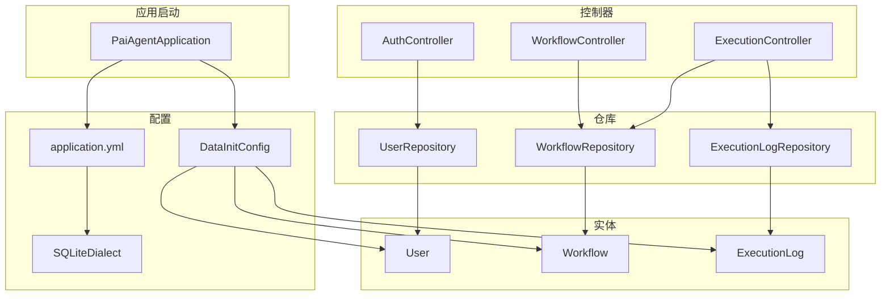
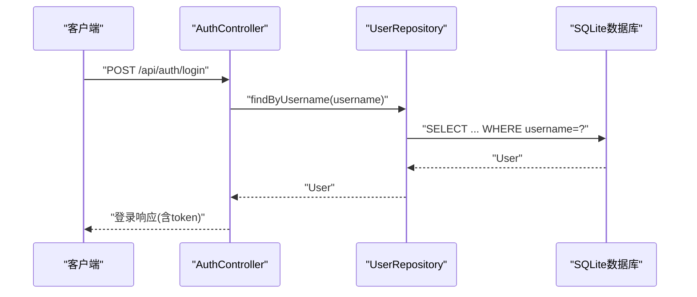
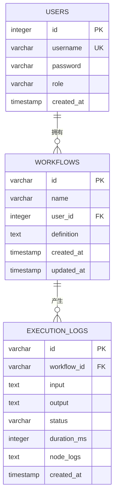
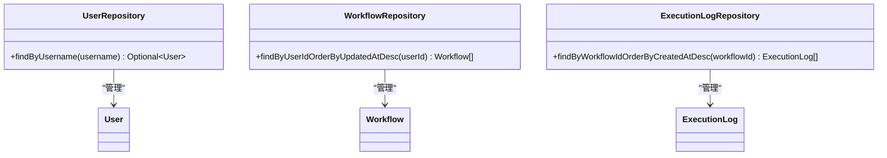
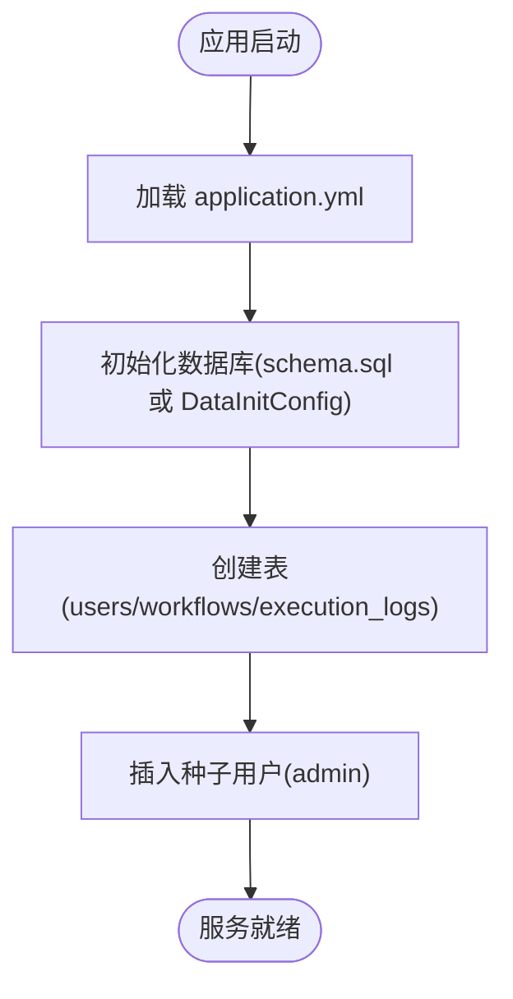
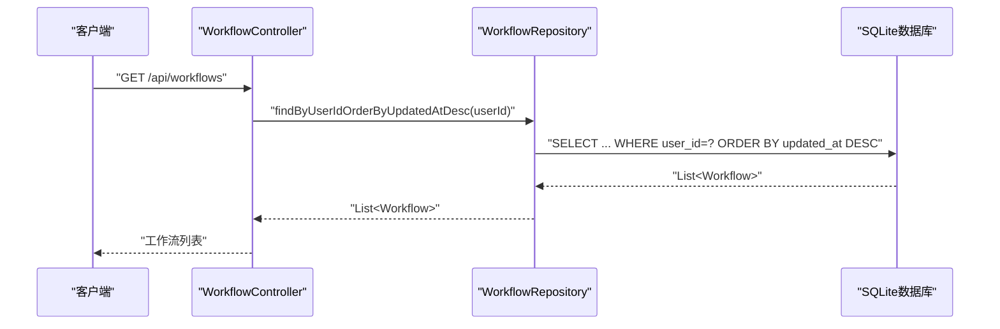
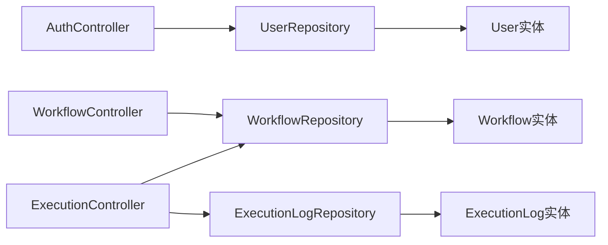

# 数据访问层

<cite>
**本文引用的文件列表**
- [User.java](file://backend/src/main/java/com/paiagent/model/entity/User.java)
- [Workflow.java](file://backend/src/main/java/com/paiagent/model/entity/Workflow.java)
- [ExecutionLog.java](file://backend/src/main/java/com/paiagent/model/entity/ExecutionLog.java)
- [UserRepository.java](file://backend/src/main/java/com/paiagent/repository/UserRepository.java)
- [WorkflowRepository.java](file://backend/src/main/java/com/paiagent/repository/WorkflowRepository.java)
- [ExecutionLogRepository.java](file://backend/src/main/java/com/paiagent/repository/ExecutionLogRepository.java)
- [application.yml](file://backend/src/main/resources/application.yml)
- [schema.sql](file://backend/src/main/resources/schema.sql)
- [DataInitConfig.java](file://backend/src/main/java/com/paiagent/config/DataInitConfig.java)
- [SQLiteDialect.java](file://backend/src/main/java/com/paiagent/config/SQLiteDialect.java)
- [AuthController.java](file://backend/src/main/java/com/paiagent/controller/AuthController.java)
- [WorkflowController.java](file://backend/src/main/java/com/paiagent/controller/WorkflowController.java)
- [ExecutionController.java](file://backend/src/main/java/com/paiagent/controller/ExecutionController.java)
</cite>

## 目录
1. [简介](#简介)
2. [项目结构](#项目结构)
3. [核心组件](#核心组件)
4. [架构总览](#架构总览)
5. [详细组件分析](#详细组件分析)
6. [依赖关系分析](#依赖关系分析)
7. [性能考虑](#性能考虑)
8. [故障排查指南](#故障排查指南)
9. [结论](#结论)
10. [附录](#附录)

## 简介
本文件聚焦于PaiAgent的数据访问层（DAO），系统性阐述JPA实体模型、Repository接口实现模式、数据库初始化脚本与表关系设计，并说明数据访问层与业务逻辑层（Controller/Service）的交互方式。文档同时提供实体关系图与查询示例，帮助开发者快速理解与优化数据层。

## 项目结构
数据访问层主要由以下部分组成：
- 实体模型：User、Workflow、ExecutionLog
- Repository接口：UserRepository、WorkflowRepository、ExecutionLogRepository
- 配置与初始化：application.yml、schema.sql、DataInitConfig、SQLiteDialect
- 控制器（业务层入口）：AuthController、WorkflowController、ExecutionController

**图表来源**
- [PaiAgentApplication.java:1-12](file://backend/src/main/java/com/paiagent/PaiAgentApplication.java#L1-L12)
- [application.yml:1-44](file://backend/src/main/resources/application.yml#L1-L44)
- [SQLiteDialect.java:1-131](file://backend/src/main/java/com/paiagent/config/SQLiteDialect.java#L1-L131)
- [DataInitConfig.java:1-65](file://backend/src/main/java/com/paiagent/config/DataInitConfig.java#L1-L65)
- [User.java:1-28](file://backend/src/main/java/com/paiagent/model/entity/User.java#L1-L28)
- [Workflow.java:1-31](file://backend/src/main/java/com/paiagent/model/entity/Workflow.java#L1-L31)
- [ExecutionLog.java:1-37](file://backend/src/main/java/com/paiagent/model/entity/ExecutionLog.java#L1-L37)
- [UserRepository.java:1-11](file://backend/src/main/java/com/paiagent/repository/UserRepository.java#L1-L11)
- [WorkflowRepository.java:1-11](file://backend/src/main/java/com/paiagent/repository/WorkflowRepository.java#L1-L11)
- [ExecutionLogRepository.java:1-11](file://backend/src/main/java/com/paiagent/repository/ExecutionLogRepository.java#L1-L11)
- [AuthController.java:1-56](file://backend/src/main/java/com/paiagent/controller/AuthController.java#L1-L56)
- [WorkflowController.java:1-91](file://backend/src/main/java/com/paiagent/controller/WorkflowController.java#L1-L91)
- [ExecutionController.java:1-93](file://backend/src/main/java/com/paiagent/controller/ExecutionController.java#L1-L93)

**章节来源**
- [application.yml:1-44](file://backend/src/main/resources/application.yml#L1-L44)
- [schema.sql:1-34](file://backend/src/main/resources/schema.sql#L1-L34)
- [DataInitConfig.java:1-65](file://backend/src/main/java/com/paiagent/config/DataInitConfig.java#L1-L65)
- [SQLiteDialect.java:1-131](file://backend/src/main/java/com/paiagent/config/SQLiteDialect.java#L1-L131)

## 核心组件
- 实体模型：使用JPA注解定义表结构、主键、唯一性、默认值等；字段类型与长度严格对应SQL建表脚本。
- Repository接口：基于Spring Data JPA，继承JpaRepository以获得标准CRUD能力，并通过方法命名约定提供自定义查询。
- 初始化与方言：application.yml配置SQLite数据源与Hibernate行为；schema.sql与DataInitConfig负责建表与种子数据；SQLiteDialect适配SQLite的DDL与IDENTITY支持。
- 控制器交互：控制器通过依赖注入使用Repository进行数据读写，完成认证、工作流管理与执行日志记录。

**章节来源**
- [User.java:1-28](file://backend/src/main/java/com/paiagent/model/entity/User.java#L1-L28)
- [Workflow.java:1-31](file://backend/src/main/java/com/paiagent/model/entity/Workflow.java#L1-L31)
- [ExecutionLog.java:1-37](file://backend/src/main/java/com/paiagent/model/entity/ExecutionLog.java#L1-L37)
- [UserRepository.java:1-11](file://backend/src/main/java/com/paiagent/repository/UserRepository.java#L1-L11)
- [WorkflowRepository.java:1-11](file://backend/src/main/java/com/paiagent/repository/WorkflowRepository.java#L1-L11)
- [ExecutionLogRepository.java:1-11](file://backend/src/main/java/com/paiagent/repository/ExecutionLogRepository.java#L1-L11)

## 架构总览
数据访问层采用“实体+Repository+配置”的分层设计，控制器作为业务入口调用Repository完成数据持久化与查询。

**图表来源**
- [AuthController.java:31-43](file://backend/src/main/java/com/paiagent/controller/AuthController.java#L31-L43)
- [UserRepository.java:9-9](file://backend/src/main/java/com/paiagent/repository/UserRepository.java#L9-L9)
- [application.yml:5-14](file://backend/src/main/resources/application.yml#L5-L14)

## 详细组件分析

### 实体模型设计与约束
- User实体
  - 主键：Long类型的自增ID
  - 字段：username（唯一非空，长度50）、password（非空）、role（默认“admin”，长度20）、createdAt（默认当前时间）
  - 约束：username唯一、非空；password非空；role默认值
- Workflow实体
  - 主键：String类型的UUID（36字符）
  - 外键：userId指向users.id
  - 字段：name（非空，长度100）、userId（非空）、definition（TEXT，非空）、createdAt/updatedAt（默认当前时间）
  - 约束：外键引用users(id)，definition为TEXT
- ExecutionLog实体
  - 主键：String类型的UUID（36字符）
  - 外键：workflowId指向workflows.id
  - 字段：workflowId（非空，36字符）、input/output/nodeLogs（TEXT）、status（长度20）、durationMs（整数）、createdAt（默认当前时间）
  - 约束：外键引用workflows(id)

**图表来源**
- [User.java:11-27](file://backend/src/main/java/com/paiagent/model/entity/User.java#L11-L27)
- [Workflow.java:11-30](file://backend/src/main/java/com/paiagent/model/entity/Workflow.java#L11-L30)
- [ExecutionLog.java:11-36](file://backend/src/main/java/com/paiagent/model/entity/ExecutionLog.java#L11-L36)
- [schema.sql:1-34](file://backend/src/main/resources/schema.sql#L1-L34)

**章节来源**
- [User.java:11-27](file://backend/src/main/java/com/paiagent/model/entity/User.java#L11-L27)
- [Workflow.java:11-30](file://backend/src/main/java/com/paiagent/model/entity/Workflow.java#L11-L30)
- [ExecutionLog.java:11-36](file://backend/src/main/java/com/paiagent/model/entity/ExecutionLog.java#L11-L36)
- [schema.sql:1-34](file://backend/src/main/resources/schema.sql#L1-L34)

### Repository接口实现模式
- UserRepository
  - 继承JpaRepository<User, Long>，具备标准CRUD与分页排序能力
  - 自定义查询：按用户名查找用户（返回Optional）
- WorkflowRepository
  - 继承JpaRepository<Workflow, String>，主键为String
  - 自定义查询：按userId查询并按updatedAt降序排列
- ExecutionLogRepository
  - 继承JpaRepository<ExecutionLog, String>，主键为String
  - 自定义查询：按workflowId查询并按createdAt降序排列

**图表来源**
- [UserRepository.java:8-10](file://backend/src/main/java/com/paiagent/repository/UserRepository.java#L8-L10)
- [WorkflowRepository.java:8-10](file://backend/src/main/java/com/paiagent/repository/WorkflowRepository.java#L8-L10)
- [ExecutionLogRepository.java:8-10](file://backend/src/main/java/com/paiagent/repository/ExecutionLogRepository.java#L8-L10)

**章节来源**
- [UserRepository.java:8-10](file://backend/src/main/java/com/paiagent/repository/UserRepository.java#L8-L10)
- [WorkflowRepository.java:8-10](file://backend/src/main/java/com/paiagent/repository/WorkflowRepository.java#L8-L10)
- [ExecutionLogRepository.java:8-10](file://backend/src/main/java/com/paiagent/repository/ExecutionLogRepository.java#L8-L10)

### 数据库初始化与方言
- application.yml
  - 数据源：SQLite，JDBC URL从环境变量DATA_PATH解析，默认路径为./data/paiagent.db
  - JPA/Hibernate：指定SQLite方言、DDL策略为none（不自动建表）、关闭SQL打印
  - 其他：JWT密钥、LLM/TTS配置、音频存储路径
- schema.sql
  - 建表：users、workflows、execution_logs；定义主键、外键、默认值
  - 种子数据：插入admin用户（BCrypt编码密码）
- DataInitConfig
  - 启动时创建音频目录与数据库表，插入admin用户（若不存在）
- SQLiteDialect
  - 提供SQLite的列类型映射、LIMIT支持、IDENTITY列支持等

**图表来源**
- [application.yml:5-14](file://backend/src/main/resources/application.yml#L5-L14)
- [schema.sql:1-34](file://backend/src/main/resources/schema.sql#L1-L34)
- [DataInitConfig.java:20-63](file://backend/src/main/java/com/paiagent/config/DataInitConfig.java#L20-L63)
- [SQLiteDialect.java:12-129](file://backend/src/main/java/com/paiagent/config/SQLiteDialect.java#L12-L129)

**章节来源**
- [application.yml:5-14](file://backend/src/main/resources/application.yml#L5-L14)
- [schema.sql:1-34](file://backend/src/main/resources/schema.sql#L1-L34)
- [DataInitConfig.java:20-63](file://backend/src/main/java/com/paiagent/config/DataInitConfig.java#L20-L63)
- [SQLiteDialect.java:12-129](file://backend/src/main/java/com/paiagent/config/SQLiteDialect.java#L12-L129)

### 数据访问层与业务逻辑层交互
- 认证流程
  - AuthController通过UserRepository按用户名查询用户，结合PasswordEncoder校验密码，生成JWT
- 工作流管理
  - WorkflowController通过WorkflowRepository按当前用户ID查询工作流列表，或按ID查询单个工作流
  - 创建/更新时将JSON定义序列化为TEXT存入definition字段
- 执行日志
  - ExecutionController根据工作流ID执行引擎，捕获异常并记录成功/失败的日志
  - 将执行结果与耗时信息写入ExecutionLog，并返回给客户端

**图表来源**
- [WorkflowController.java:35-40](file://backend/src/main/java/com/paiagent/controller/WorkflowController.java#L35-L40)
- [WorkflowRepository.java:9-9](file://backend/src/main/java/com/paiagent/repository/WorkflowRepository.java#L9-L9)

**章节来源**
- [AuthController.java:31-43](file://backend/src/main/java/com/paiagent/controller/AuthController.java#L31-L43)
- [WorkflowController.java:35-40](file://backend/src/main/java/com/paiagent/controller/WorkflowController.java#L35-L40)
- [ExecutionController.java:37-82](file://backend/src/main/java/com/paiagent/controller/ExecutionController.java#L37-L82)

## 依赖关系分析
- 实体与表：实体字段与schema.sql中的列定义一一对应，确保ORM映射正确
- Repository与实体：Repository泛型参数与实体主键类型一致（User->Long；Workflow/ExecutionLog->String）
- 控制器与Repository：控制器通过构造函数注入Repository，实现依赖注入与数据访问解耦
- 方言与数据源：SQLiteDialect适配Hibernate对SQLite的DDL/IDENTITY支持，application.yml确保方言正确加载

**图表来源**
- [AuthController.java:20-29](file://backend/src/main/java/com/paiagent/controller/AuthController.java#L20-L29)
- [WorkflowController.java:24-33](file://backend/src/main/java/com/paiagent/controller/WorkflowController.java#L24-L33)
- [ExecutionController.java:27-35](file://backend/src/main/java/com/paiagent/controller/ExecutionController.java#L27-L35)
- [UserRepository.java:8-10](file://backend/src/main/java/com/paiagent/repository/UserRepository.java#L8-L10)
- [WorkflowRepository.java:8-10](file://backend/src/main/java/com/paiagent/repository/WorkflowRepository.java#L8-L10)
- [ExecutionLogRepository.java:8-10](file://backend/src/main/java/com/paiagent/repository/ExecutionLogRepository.java#L8-L10)

**章节来源**
- [AuthController.java:20-29](file://backend/src/main/java/com/paiagent/controller/AuthController.java#L20-L29)
- [WorkflowController.java:24-33](file://backend/src/main/java/com/paiagent/controller/WorkflowController.java#L24-L33)
- [ExecutionController.java:27-35](file://backend/src/main/java/com/paiagent/controller/ExecutionController.java#L27-L35)

## 性能考虑
- 查询排序与索引
  - WorkflowRepository按userId+updatedAt降序查询，建议在workflows表上为(user_id, updated_at)建立复合索引以提升排序效率
  - ExecutionLogRepository按workflow_id+created_at降序查询，建议在execution_logs表上为(workflow_id, created_at)建立复合索引
- 文本字段存储
  - definition、input、output、node_logs为TEXT，避免过长JSON导致单行过大，可考虑拆分或压缩策略（如启用压缩存储或分表）
- 分页与限制
  - 使用Spring Data JPA的分页接口（Pageable）限制结果集大小，避免一次性加载过多数据
- SQL打印与调试
  - 当前show-sql为false，生产环境保持关闭；开发阶段可临时开启以便分析慢查询
- 连接池与事务
  - 默认连接池配置满足小规模场景；高并发下可调整连接池参数与事务传播行为，减少锁竞争

[本节为通用性能建议，无需特定文件引用]

## 故障排查指南
- 登录失败
  - 检查用户名是否存在且密码匹配；确认application.yml中JWT密钥与环境变量设置
  - 参考：[AuthController.java:31-43](file://backend/src/main/java/com/paiagent/controller/AuthController.java#L31-L43)
- 工作流未找到
  - 确认当前用户是否正确绑定；检查WorkflowRepository按userId查询逻辑
  - 参考：[WorkflowController.java:35-40](file://backend/src/main/java/com/paiagent/controller/WorkflowController.java#L35-L40)
- 执行日志保存失败
  - 检查workflow_id是否有效；确认execution_logs表外键约束；查看DataInitConfig是否成功初始化表
  - 参考：[ExecutionController.java:45-82](file://backend/src/main/java/com/paiagent/controller/ExecutionController.java#L45-L82)
- 数据库初始化问题
  - 确认DATA_PATH环境变量；检查schema.sql与DataInitConfig是否一致；核对SQLiteDialect是否生效
  - 参考：[application.yml:5-14](file://backend/src/main/resources/application.yml#L5-L14)，[schema.sql:1-34](file://backend/src/main/resources/schema.sql#L1-L34)，[DataInitConfig.java:20-63](file://backend/src/main/java/com/paiagent/config/DataInitConfig.java#L20-L63)，[SQLiteDialect.java:12-129](file://backend/src/main/java/com/paiagent/config/SQLiteDialect.java#L12-L129)

**章节来源**
- [AuthController.java:31-43](file://backend/src/main/java/com/paiagent/controller/AuthController.java#L31-L43)
- [WorkflowController.java:35-40](file://backend/src/main/java/com/paiagent/controller/WorkflowController.java#L35-L40)
- [ExecutionController.java:45-82](file://backend/src/main/java/com/paiagent/controller/ExecutionController.java#L45-L82)
- [application.yml:5-14](file://backend/src/main/resources/application.yml#L5-L14)
- [schema.sql:1-34](file://backend/src/main/resources/schema.sql#L1-L34)
- [DataInitConfig.java:20-63](file://backend/src/main/java/com/paiagent/config/DataInitConfig.java#L20-L63)
- [SQLiteDialect.java:12-129](file://backend/src/main/java/com/paiagent/config/SQLiteDialect.java#L12-L129)

## 结论
PaiAgent数据访问层以清晰的实体模型与Repository接口为核心，结合SQLite方言与初始化配置，实现了轻量级、可扩展的数据持久化方案。通过控制器与Repository的解耦设计，业务逻辑层能够高效地完成认证、工作流管理与执行日志记录。建议在生产环境中完善索引、分页与事务配置，并持续监控慢查询与资源占用情况。

[本节为总结性内容，无需特定文件引用]

## 附录

### 查询示例（基于Repository方法命名）
- 获取某用户的最新工作流列表
  - 方法：WorkflowRepository.findByUserIdOrderByUpdatedAtDesc(userId)
  - 说明：按用户ID查询并按更新时间倒序
  - 参考：[WorkflowRepository.java:9-9](file://backend/src/main/java/com/paiagent/repository/WorkflowRepository.java#L9-L9)
- 获取某个工作流的执行日志（按时间倒序）
  - 方法：ExecutionLogRepository.findByWorkflowIdOrderByCreatedAtDesc(workflowId)
  - 说明：按工作流ID查询并按创建时间倒序
  - 参考：[ExecutionLogRepository.java:9-9](file://backend/src/main/java/com/paiagent/repository/ExecutionLogRepository.java#L9-L9)

### 表关系与约束对照
- users表
  - 主键：id（INTEGER PRIMARY KEY AUTOINCREMENT）
  - 唯一：username（UNIQUE NOT NULL）
  - 默认：role='admin'，created_at=CURRENT_TIMESTAMP
  - 参考：[schema.sql:1-7](file://backend/src/main/resources/schema.sql#L1-L7)
- workflows表
  - 主键：id（VARCHAR(36) PRIMARY KEY）
  - 外键：user_id -> users(id)
  - 默认：created_at/updated_at=CURRENT_TIMESTAMP
  - 参考：[schema.sql:9-17](file://backend/src/main/resources/schema.sql#L9-L17)
- execution_logs表
  - 主键：id（VARCHAR(36) PRIMARY KEY）
  - 外键：workflow_id -> workflows(id)
  - 默认：created_at=CURRENT_TIMESTAMP
  - 参考：[schema.sql:19-29](file://backend/src/main/resources/schema.sql#L19-L29)

**章节来源**
- [schema.sql:1-34](file://backend/src/main/resources/schema.sql#L1-L34)