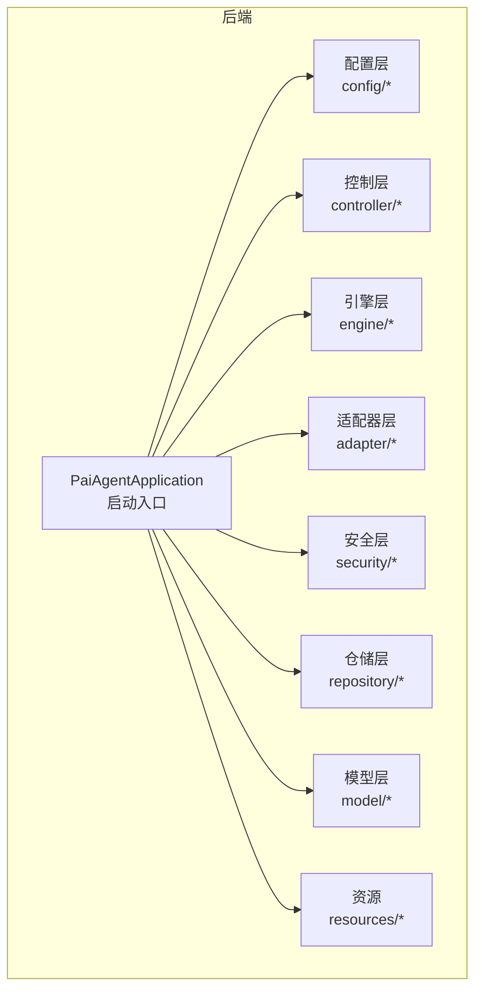
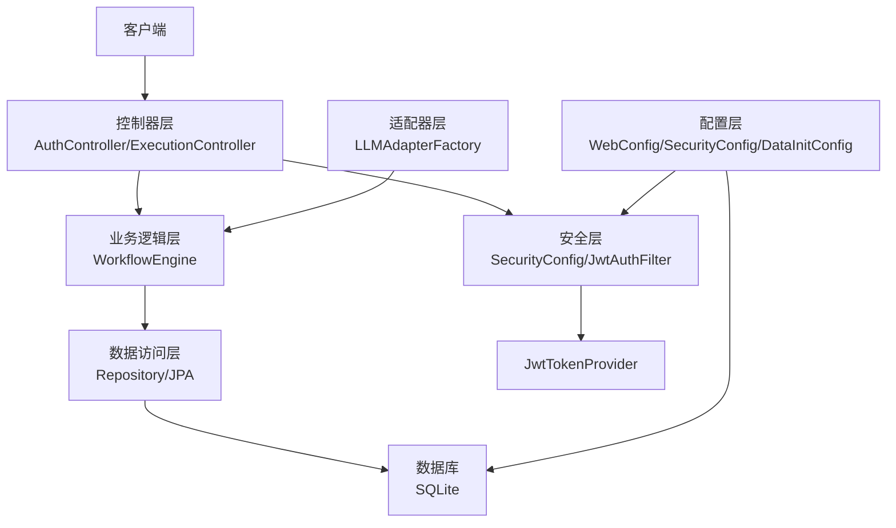
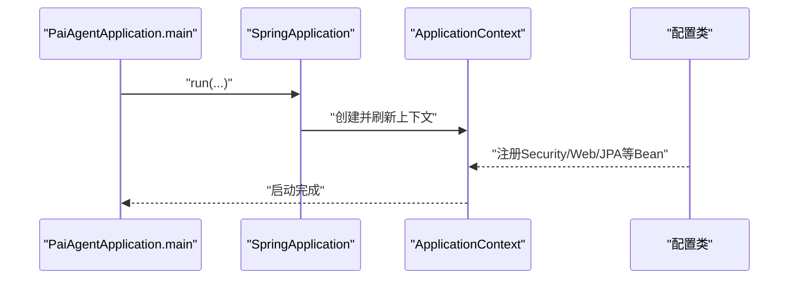
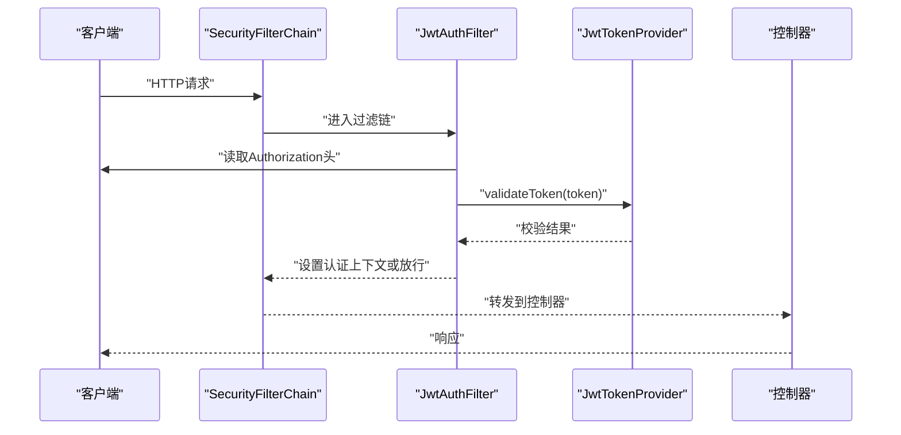
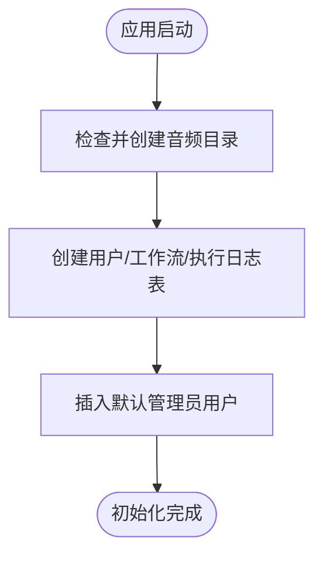
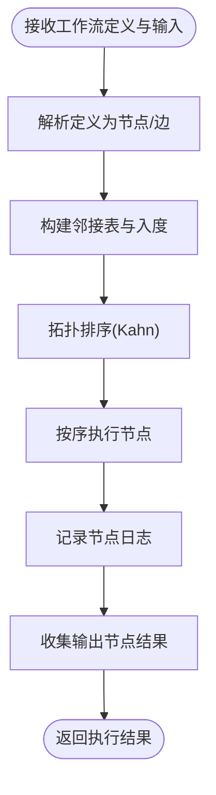
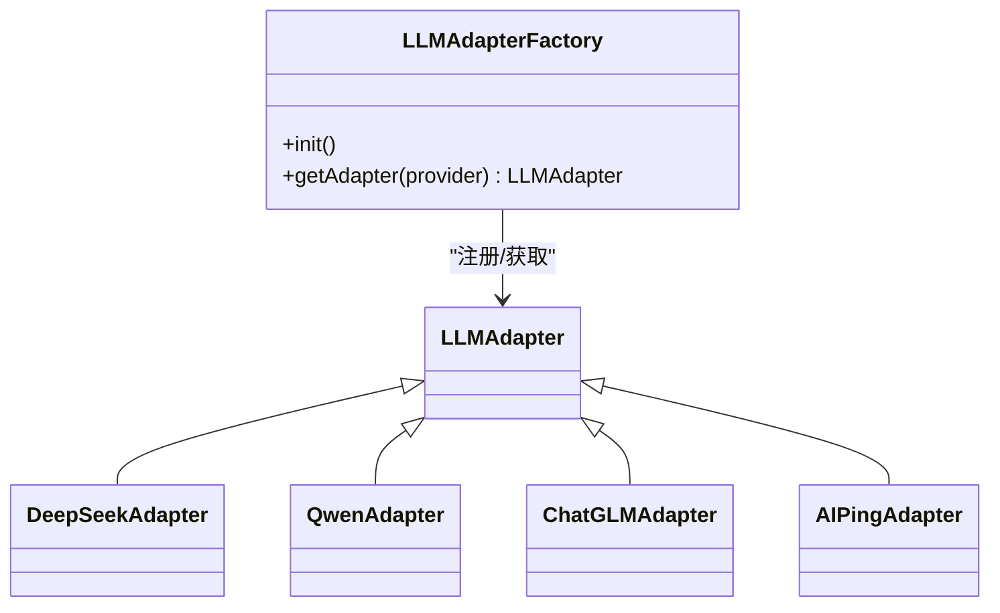
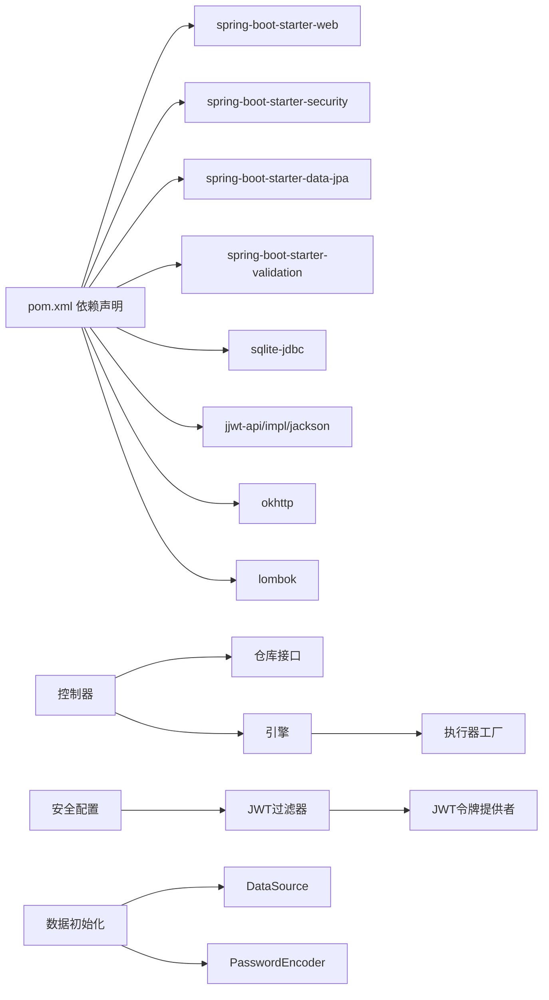

# 核心架构设计

<cite>
**本文引用的文件**
- [PaiAgentApplication.java](file://backend/src/main/java/com/paiagent/PaiAgentApplication.java)
- [application.yml](file://backend/src/main/resources/application.yml)
- [pom.xml](file://backend/pom.xml)
- [SecurityConfig.java](file://backend/src/main/java/com/paiagent/config/SecurityConfig.java)
- [WebConfig.java](file://backend/src/main/java/com/paiagent/config/WebConfig.java)
- [DataInitConfig.java](file://backend/src/main/java/com/paiagent/config/DataInitConfig.java)
- [SQLiteDialect.java](file://backend/src/main/java/com/paiagent/config/SQLiteDialect.java)
- [schema.sql](file://backend/src/main/resources/schema.sql)
- [AuthController.java](file://backend/src/main/java/com/paiagent/controller/AuthController.java)
- [ExecutionController.java](file://backend/src/main/java/com/paiagent/controller/ExecutionController.java)
- [WorkflowEngine.java](file://backend/src/main/java/com/paiagent/engine/WorkflowEngine.java)
- [LLMAdapterFactory.java](file://backend/src/main/java/com/paiagent/adapter/LLMAdapterFactory.java)
- [JwtAuthFilter.java](file://backend/src/main/java/com/paiagent/security/JwtAuthFilter.java)
- [JwtTokenProvider.java](file://backend/src/main/java/com/paiagent/security/JwtTokenProvider.java)
- [ApiResponse.java](file://backend/src/main/java/com/paiagent/model/dto/ApiResponse.java)
</cite>

## 目录
1. [引言](#引言)
2. [项目结构](#项目结构)
3. [核心组件](#核心组件)
4. [架构总览](#架构总览)
5. [详细组件分析](#详细组件分析)
6. [依赖分析](#依赖分析)
7. [性能考虑](#性能考虑)
8. [故障排查指南](#故障排查指南)
9. [结论](#结论)

## 引言
本文件面向PaiAgent后端的架构设计与实现，系统性阐述基于Spring Boot的应用整体架构模式、分层设计原则、依赖注入与Bean管理策略、安全与Web配置、数据初始化与数据库方言适配，以及关键流程的时序图与类图。目标是帮助开发者快速理解系统的设计思路、组件关系与交互路径。

## 项目结构
后端采用标准的Spring Boot多模块布局（此处为单模块工程），按功能域划分包结构：
- config：安全、Web、数据初始化、数据库方言等配置
- controller：REST接口控制器
- engine：工作流执行引擎与节点执行器工厂
- adapter：大模型与TTS适配器及工厂
- security：JWT认证过滤器与令牌提供者
- repository：数据访问层接口
- model：实体与DTO
- resources：配置文件与SQL脚本



**图表来源**
- [PaiAgentApplication.java:1-12](file://backend/src/main/java/com/paiagent/PaiAgentApplication.java#L1-L12)
- [SecurityConfig.java:1-54](file://backend/src/main/java/com/paiagent/config/SecurityConfig.java#L1-L54)
- [WebConfig.java:1-26](file://backend/src/main/java/com/paiagent/config/WebConfig.java#L1-L26)
- [DataInitConfig.java:1-65](file://backend/src/main/java/com/paiagent/config/DataInitConfig.java#L1-L65)
- [AuthController.java:1-56](file://backend/src/main/java/com/paiagent/controller/AuthController.java#L1-L56)
- [ExecutionController.java:1-93](file://backend/src/main/java/com/paiagent/controller/ExecutionController.java#L1-L93)
- [WorkflowEngine.java:1-136](file://backend/src/main/java/com/paiagent/engine/WorkflowEngine.java#L1-L136)
- [LLMAdapterFactory.java:1-52](file://backend/src/main/java/com/paiagent/adapter/LLMAdapterFactory.java#L1-L52)
- [JwtAuthFilter.java:1-51](file://backend/src/main/java/com/paiagent/security/JwtAuthFilter.java#L1-L51)
- [JwtTokenProvider.java:1-55](file://backend/src/main/java/com/paiagent/security/JwtTokenProvider.java#L1-L55)

**章节来源**
- [PaiAgentApplication.java:1-12](file://backend/src/main/java/com/paiagent/PaiAgentApplication.java#L1-L12)
- [application.yml:1-44](file://backend/src/main/resources/application.yml#L1-L44)
- [pom.xml:1-110](file://backend/pom.xml#L1-L110)

## 核心组件
- 启动类与自动配置
  - 启动类使用Spring Boot注解，负责引导应用上下文与Web容器启动。
  - 自动配置由Starter与属性文件驱动，完成安全、Web、JPA、验证等子系统的装配。
- 配置中心
  - application.yml集中定义服务器端口、数据源、JPA、JWT、LLM/TTS等外部服务参数。
  - pom.xml声明核心Starter与运行期依赖，确保自动装配可用。
- 安全与认证
  - 基于Spring Security的无状态JWT方案，通过自定义过滤器解析与校验令牌，设置认证上下文。
- 数据访问与初始化
  - 使用JPA/Hibernate访问SQLite，自定义Dialect适配SQLite语法；通过CommandLineRunner在启动阶段创建目录与表并初始化管理员用户。
- 控制层
  - 提供鉴权与执行接口，统一返回DTO包装响应体。
- 引擎与适配器
  - 工作流引擎解析JSON定义，拓扑排序执行节点；适配器工厂按提供商动态选择具体实现。

**章节来源**
- [PaiAgentApplication.java:1-12](file://backend/src/main/java/com/paiagent/PaiAgentApplication.java#L1-L12)
- [application.yml:1-44](file://backend/src/main/resources/application.yml#L1-L44)
- [pom.xml:1-110](file://backend/pom.xml#L1-L110)
- [SecurityConfig.java:1-54](file://backend/src/main/java/com/paiagent/config/SecurityConfig.java#L1-L54)
- [JwtAuthFilter.java:1-51](file://backend/src/main/java/com/paiagent/security/JwtAuthFilter.java#L1-L51)
- [JwtTokenProvider.java:1-55](file://backend/src/main/java/com/paiagent/security/JwtTokenProvider.java#L1-L55)
- [DataInitConfig.java:1-65](file://backend/src/main/java/com/paiagent/config/DataInitConfig.java#L1-L65)
- [SQLiteDialect.java:1-131](file://backend/src/main/java/com/paiagent/config/SQLiteDialect.java#L1-L131)
- [AuthController.java:1-56](file://backend/src/main/java/com/paiagent/controller/AuthController.java#L1-L56)
- [ExecutionController.java:1-93](file://backend/src/main/java/com/paiagent/controller/ExecutionController.java#L1-L93)
- [WorkflowEngine.java:1-136](file://backend/src/main/java/com/paiagent/engine/WorkflowEngine.java#L1-L136)
- [LLMAdapterFactory.java:1-52](file://backend/src/main/java/com/paiagent/adapter/LLMAdapterFactory.java#L1-L52)

## 架构总览
系统采用经典的分层架构：
- 表示层（Controller）：暴露REST API，处理请求与响应封装
- 业务逻辑层（Engine/Service）：工作流编排与节点执行
- 数据访问层（Repository/JPA）：实体持久化与查询
- 基础设施层（Config/Security/Adapter）：安全、Web、数据初始化、外部服务适配



**图表来源**
- [AuthController.java:1-56](file://backend/src/main/java/com/paiagent/controller/AuthController.java#L1-L56)
- [ExecutionController.java:1-93](file://backend/src/main/java/com/paiagent/controller/ExecutionController.java#L1-L93)
- [WorkflowEngine.java:1-136](file://backend/src/main/java/com/paiagent/engine/WorkflowEngine.java#L1-L136)
- [LLMAdapterFactory.java:1-52](file://backend/src/main/java/com/paiagent/adapter/LLMAdapterFactory.java#L1-L52)
- [SecurityConfig.java:1-54](file://backend/src/main/java/com/paiagent/config/SecurityConfig.java#L1-L54)
- [JwtAuthFilter.java:1-51](file://backend/src/main/java/com/paiagent/security/JwtAuthFilter.java#L1-L51)
- [JwtTokenProvider.java:1-55](file://backend/src/main/java/com/paiagent/security/JwtTokenProvider.java#L1-L55)
- [WebConfig.java:1-26](file://backend/src/main/java/com/paiagent/config/WebConfig.java#L1-L26)
- [DataInitConfig.java:1-65](file://backend/src/main/java/com/paiagent/config/DataInitConfig.java#L1-L65)

## 详细组件分析

### 启动与自动配置
- @SpringBootApplication作为应用入口，启用组件扫描与自动配置，结合Maven Starter与application.yml完成环境装配。
- pom中引入web、security、jpa、validation等Starter，确保控制器、安全、ORM、校验能力可用。



**图表来源**
- [PaiAgentApplication.java:1-12](file://backend/src/main/java/com/paiagent/PaiAgentApplication.java#L1-L12)
- [pom.xml:25-90](file://backend/pom.xml#L25-L90)
- [application.yml:1-44](file://backend/src/main/resources/application.yml#L1-L44)

**章节来源**
- [PaiAgentApplication.java:1-12](file://backend/src/main/java/com/paiagent/PaiAgentApplication.java#L1-L12)
- [pom.xml:1-110](file://backend/pom.xml#L1-L110)
- [application.yml:1-44](file://backend/src/main/resources/application.yml#L1-L44)

### 分层架构设计
- 表示层
  - AuthController：登录与当前用户信息查询
  - ExecutionController：工作流执行与执行记录查询
  - 统一使用ApiResponse进行响应封装
- 业务逻辑层
  - WorkflowEngine：解析工作流定义、拓扑排序、节点执行、结果聚合与日志收集
- 数据访问层
  - Repository接口配合JPA/Hibernate访问SQLite
  - DataInitConfig在启动时创建目录与表，并插入默认管理员用户
- 基础设施层
  - SecurityConfig：禁用CSRF、无状态会话、开放特定路径、注册JWT过滤器
  - WebConfig：跨域与静态资源映射
  - SQLiteDialect：适配SQLite的Hibernate方言

```mermaid
classDiagram
class AuthController
class ExecutionController
class WorkflowEngine
class LLMAdapterFactory
class SecurityConfig
class WebConfig
class DataInitConfig
class JwtAuthFilter
class JwtTokenProvider
class ApiResponse
AuthController --> ApiResponse : "返回"
ExecutionController --> WorkflowEngine : "调用"
ExecutionController --> ApiResponse : "返回"
WorkflowEngine --> LLMAdapterFactory : "获取适配器"
SecurityConfig --> JwtAuthFilter : "注册过滤器"
JwtAuthFilter --> JwtTokenProvider : "校验令牌"
DataInitConfig --> "数据库初始化"
WebConfig --> "跨域/静态资源"
```

**图表来源**
- [AuthController.java:1-56](file://backend/src/main/java/com/paiagent/controller/AuthController.java#L1-L56)
- [ExecutionController.java:1-93](file://backend/src/main/java/com/paiagent/controller/ExecutionController.java#L1-L93)
- [WorkflowEngine.java:1-136](file://backend/src/main/java/com/paiagent/engine/WorkflowEngine.java#L1-L136)
- [LLMAdapterFactory.java:1-52](file://backend/src/main/java/com/paiagent/adapter/LLMAdapterFactory.java#L1-L52)
- [SecurityConfig.java:1-54](file://backend/src/main/java/com/paiagent/config/SecurityConfig.java#L1-L54)
- [WebConfig.java:1-26](file://backend/src/main/java/com/paiagent/config/WebConfig.java#L1-L26)
- [DataInitConfig.java:1-65](file://backend/src/main/java/com/paiagent/config/DataInitConfig.java#L1-L65)
- [JwtAuthFilter.java:1-51](file://backend/src/main/java/com/paiagent/security/JwtAuthFilter.java#L1-L51)
- [JwtTokenProvider.java:1-55](file://backend/src/main/java/com/paiagent/security/JwtTokenProvider.java#L1-L55)
- [ApiResponse.java:1-23](file://backend/src/main/java/com/paiagent/model/dto/ApiResponse.java#L1-L23)

**章节来源**
- [AuthController.java:1-56](file://backend/src/main/java/com/paiagent/controller/AuthController.java#L1-L56)
- [ExecutionController.java:1-93](file://backend/src/main/java/com/paiagent/controller/ExecutionController.java#L1-L93)
- [WorkflowEngine.java:1-136](file://backend/src/main/java/com/paiagent/engine/WorkflowEngine.java#L1-L136)
- [LLMAdapterFactory.java:1-52](file://backend/src/main/java/com/paiagent/adapter/LLMAdapterFactory.java#L1-L52)
- [SecurityConfig.java:1-54](file://backend/src/main/java/com/paiagent/config/SecurityConfig.java#L1-L54)
- [WebConfig.java:1-26](file://backend/src/main/java/com/paiagent/config/WebConfig.java#L1-L26)
- [DataInitConfig.java:1-65](file://backend/src/main/java/com/paiagent/config/DataInitConfig.java#L1-L65)
- [JwtAuthFilter.java:1-51](file://backend/src/main/java/com/paiagent/security/JwtAuthFilter.java#L1-L51)
- [JwtTokenProvider.java:1-55](file://backend/src/main/java/com/paiagent/security/JwtTokenProvider.java#L1-L55)
- [ApiResponse.java:1-23](file://backend/src/main/java/com/paiagent/model/dto/ApiResponse.java#L1-L23)

### 依赖注入与Bean管理
- 控制器通过构造函数注入Repository、Engine、ObjectMapper等依赖，保证不可变与可测试性
- 安全与Web配置以@Bean形式注册SecurityFilterChain、PasswordEncoder、AuthenticationManager等
- 数据初始化通过CommandLineRunner Bean在应用启动后执行
- 适配器工厂在@PostConstruct中构建不同提供商的适配器实例并缓存

**章节来源**
- [AuthController.java:24-29](file://backend/src/main/java/com/paiagent/controller/AuthController.java#L24-L29)
- [ExecutionController.java:27-35](file://backend/src/main/java/com/paiagent/controller/ExecutionController.java#L27-L35)
- [SecurityConfig.java:26-52](file://backend/src/main/java/com/paiagent/config/SecurityConfig.java#L26-L52)
- [DataInitConfig.java:20-63](file://backend/src/main/java/com/paiagent/config/DataInitConfig.java#L20-L63)
- [LLMAdapterFactory.java:36-42](file://backend/src/main/java/com/paiagent/adapter/LLMAdapterFactory.java#L36-L42)

### 安全配置与Web配置
- 安全配置
  - 禁用CSRF与Session（STATELESS）
  - 放行登录与静态文件访问，其余/api路径需认证
  - 注册JWT过滤器，从Authorization头提取Bearer令牌并设置认证上下文
  - 密码编码器使用BCrypt
- Web配置
  - 允许前端本地开发端口跨域访问
  - 映射音频文件静态资源路径到本地文件系统



**图表来源**
- [SecurityConfig.java:26-42](file://backend/src/main/java/com/paiagent/config/SecurityConfig.java#L26-L42)
- [JwtAuthFilter.java:26-41](file://backend/src/main/java/com/paiagent/security/JwtAuthFilter.java#L26-L41)
- [JwtTokenProvider.java:46-53](file://backend/src/main/java/com/paiagent/security/JwtTokenProvider.java#L46-L53)
- [AuthController.java:31-43](file://backend/src/main/java/com/paiagent/controller/AuthController.java#L31-L43)

**章节来源**
- [SecurityConfig.java:1-54](file://backend/src/main/java/com/paiagent/config/SecurityConfig.java#L1-L54)
- [WebConfig.java:1-26](file://backend/src/main/java/com/paiagent/config/WebConfig.java#L1-L26)
- [JwtAuthFilter.java:1-51](file://backend/src/main/java/com/paiagent/security/JwtAuthFilter.java#L1-L51)
- [JwtTokenProvider.java:1-55](file://backend/src/main/java/com/paiagent/security/JwtTokenProvider.java#L1-L55)

### 数据初始化与数据库方言
- DataInitConfig
  - 创建音频存储目录
  - 通过JDBC创建users/workflows/execution_logs表
  - 插入默认管理员用户（密码经BCrypt编码）
- SQLiteDialect
  - 重写列类型映射、IDENTITY支持、LIMIT语法等，适配Hibernate对SQLite的限制
- schema.sql
  - 提供与初始化脚本一致的DDL与种子数据



**图表来源**
- [DataInitConfig.java:20-63](file://backend/src/main/java/com/paiagent/config/DataInitConfig.java#L20-L63)
- [SQLiteDialect.java:12-131](file://backend/src/main/java/com/paiagent/config/SQLiteDialect.java#L12-L131)
- [schema.sql:1-34](file://backend/src/main/resources/schema.sql#L1-L34)

**章节来源**
- [DataInitConfig.java:1-65](file://backend/src/main/java/com/paiagent/config/DataInitConfig.java#L1-L65)
- [SQLiteDialect.java:1-131](file://backend/src/main/java/com/paiagent/config/SQLiteDialect.java#L1-L131)
- [schema.sql:1-34](file://backend/src/main/resources/schema.sql#L1-L34)

### 工作流执行引擎
- 输入定义解析：将JSON定义反序列化为节点与边集合
- 拓扑排序：基于入度与邻接表计算执行顺序
- 节点执行：根据节点类型获取对应执行器，注入用户输入，收集节点日志
- 结果聚合：汇总节点日志与输出节点结果，返回统一格式



**图表来源**
- [WorkflowEngine.java:21-108](file://backend/src/main/java/com/paiagent/engine/WorkflowEngine.java#L21-L108)

**章节来源**
- [WorkflowEngine.java:1-136](file://backend/src/main/java/com/paiagent/engine/WorkflowEngine.java#L1-L136)

### 适配器工厂与LLM提供商
- LLMAdapterFactory
  - 从配置读取各提供商的API Key与Base URL
  - 在初始化时注册多种适配器实现
  - 提供按提供商名称获取适配器的方法



**图表来源**
- [LLMAdapterFactory.java:11-51](file://backend/src/main/java/com/paiagent/adapter/LLMAdapterFactory.java#L11-L51)

**章节来源**
- [LLMAdapterFactory.java:1-52](file://backend/src/main/java/com/paiagent/adapter/LLMAdapterFactory.java#L1-L52)

### 控制器与统一响应
- AuthController
  - 登录：校验凭据，生成JWT并返回用户信息
  - 查询当前用户：从认证上下文解析用户名并返回用户信息
- ExecutionController
  - 执行工作流：加载定义、调用引擎、保存执行日志、返回结果
  - 查询执行：按ID返回执行记录
- ApiResponse
  - 统一响应结构：code/data/message

**章节来源**
- [AuthController.java:1-56](file://backend/src/main/java/com/paiagent/controller/AuthController.java#L1-L56)
- [ExecutionController.java:1-93](file://backend/src/main/java/com/paiagent/controller/ExecutionController.java#L1-L93)
- [ApiResponse.java:1-23](file://backend/src/main/java/com/paiagent/model/dto/ApiResponse.java#L1-L23)

## 依赖分析
- 外部依赖
  - Spring Boot Starter：web、security、data-jpa、validation
  - SQLite JDBC：数据库驱动
  - jjwt：JWT实现
  - OkHttp：HTTP客户端
  - Lombok：简化代码
- 内部模块耦合
  - 控制器依赖仓库与引擎
  - 引擎依赖执行器工厂与ObjectMapper
  - 安全配置依赖JWT过滤器与令牌提供者
  - 数据初始化依赖DataSource与PasswordEncoder



**图表来源**
- [pom.xml:25-90](file://backend/pom.xml#L25-L90)
- [AuthController.java:20-29](file://backend/src/main/java/com/paiagent/controller/AuthController.java#L20-L29)
- [ExecutionController.java:22-35](file://backend/src/main/java/com/paiagent/controller/ExecutionController.java#L22-L35)
- [WorkflowEngine.java:12-18](file://backend/src/main/java/com/paiagent/engine/WorkflowEngine.java#L12-L18)
- [SecurityConfig.java:20-24](file://backend/src/main/java/com/paiagent/config/SecurityConfig.java#L20-L24)
- [JwtAuthFilter.java:20-24](file://backend/src/main/java/com/paiagent/security/JwtAuthFilter.java#L20-L24)
- [JwtTokenProvider.java:15-23](file://backend/src/main/java/com/paiagent/security/JwtTokenProvider.java#L15-L23)
- [DataInitConfig.java:21-21](file://backend/src/main/java/com/paiagent/config/DataInitConfig.java#L21-L21)

**章节来源**
- [pom.xml:1-110](file://backend/pom.xml#L1-L110)
- [AuthController.java:1-56](file://backend/src/main/java/com/paiagent/controller/AuthController.java#L1-L56)
- [ExecutionController.java:1-93](file://backend/src/main/java/com/paiagent/controller/ExecutionController.java#L1-L93)
- [WorkflowEngine.java:1-136](file://backend/src/main/java/com/paiagent/engine/WorkflowEngine.java#L1-L136)
- [SecurityConfig.java:1-54](file://backend/src/main/java/com/paiagent/config/SecurityConfig.java#L1-L54)
- [JwtAuthFilter.java:1-51](file://backend/src/main/java/com/paiagent/security/JwtAuthFilter.java#L1-L51)
- [JwtTokenProvider.java:1-55](file://backend/src/main/java/com/paiagent/security/JwtTokenProvider.java#L1-L55)
- [DataInitConfig.java:1-65](file://backend/src/main/java/com/paiagent/config/DataInitConfig.java#L1-L65)

## 性能考虑
- 序列化/反序列化
  - 使用Jackson ObjectMapper处理工作流定义与日志序列化，建议在高频路径避免重复创建对象
- 数据库访问
  - SQLite适合轻量场景；如并发较高，建议评估连接池与索引优化
- 日志与异常
  - 执行日志包含节点级耗时与状态，便于定位瓶颈；注意异常时的日志落盘开销
- 适配器调用
  - LLM/TTS适配器通过HTTP客户端调用外部服务，建议增加超时与重试策略（可在适配器层扩展）

## 故障排查指南
- 认证失败
  - 检查Authorization头是否为Bearer Token
  - 校验JWT密钥与过期时间配置
- 跨域问题
  - 确认WebConfig允许的前端地址与方法
- 数据库初始化失败
  - 检查DATA_PATH与音频目录权限
  - 确认SQLite驱动与方言配置正确
- 工作流执行异常
  - 查看执行日志中的节点错误与耗时
  - 确认工作流定义的节点类型与数据结构

**章节来源**
- [SecurityConfig.java:26-42](file://backend/src/main/java/com/paiagent/config/SecurityConfig.java#L26-L42)
- [WebConfig.java:11-24](file://backend/src/main/java/com/paiagent/config/WebConfig.java#L11-L24)
- [DataInitConfig.java:20-63](file://backend/src/main/java/com/paiagent/config/DataInitConfig.java#L20-L63)
- [ExecutionController.java:65-81](file://backend/src/main/java/com/paiagent/controller/ExecutionController.java#L65-L81)

## 结论
PaiAgent后端以Spring Boot为核心，采用清晰的分层架构与约定优于配置的自动装配机制，结合JWT无状态认证、SQLite轻量存储与可扩展的适配器体系，实现了从鉴权、工作流编排到外部服务集成的完整闭环。通过统一的响应封装与启动期数据初始化，系统具备良好的可维护性与可部署性。