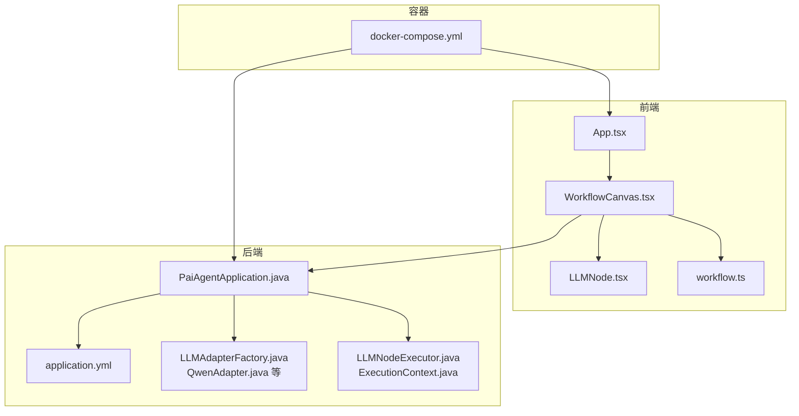
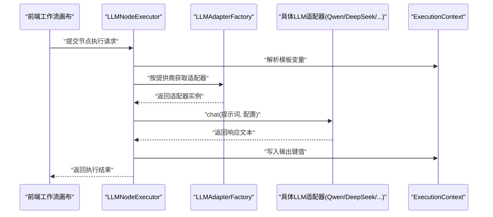
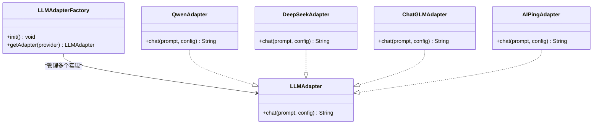
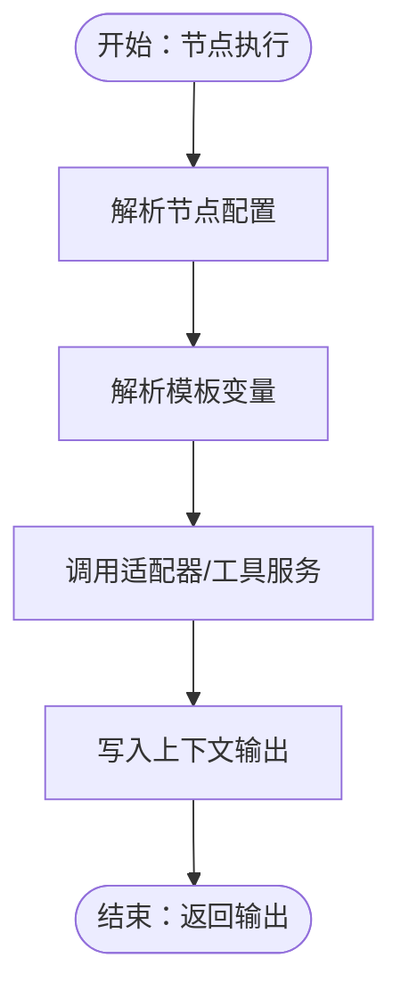
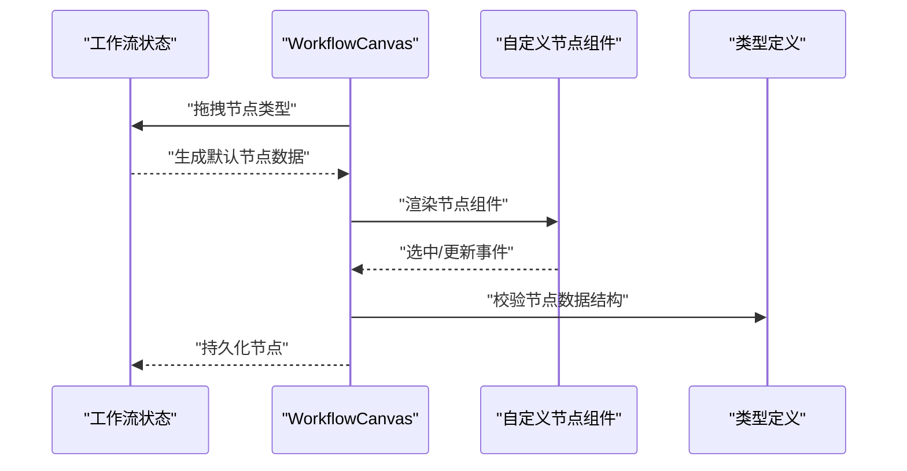
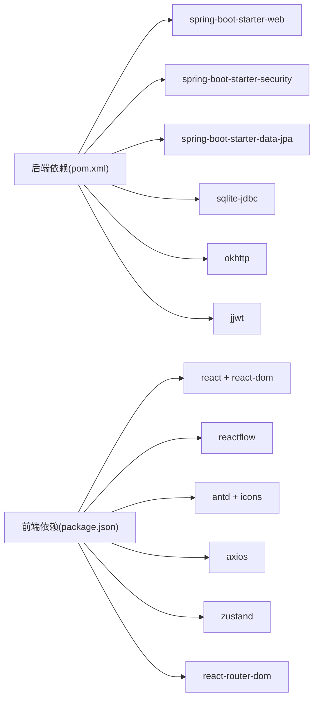

# 开发者指南

<cite>
**本文引用的文件**
- [PaiAgentApplication.java](file://backend/src/main/java/com/paiagent/PaiAgentApplication.java)
- [LLMAdapter.java](file://backend/src/main/java/com/paiagent/adapter/LLMAdapter.java)
- [LLMAdapterFactory.java](file://backend/src/main/java/com/paiagent/adapter/LLMAdapterFactory.java)
- [QwenAdapter.java](file://backend/src/main/java/com/paiagent/adapter/impl/QwenAdapter.java)
- [DeepSeekAdapter.java](file://backend/src/main/java/com/paiagent/adapter/impl/DeepSeekAdapter.java)
- [ChatGLMAdapter.java](file://backend/src/main/java/com/paiagent/adapter/impl/ChatGLMAdapter.java)
- [AIPingAdapter.java](file://backend/src/main/java/com/paiagent/adapter/impl/AIPingAdapter.java)
- [NodeExecutor.java](file://backend/src/main/java/com/paiagent/engine/NodeExecutor.java)
- [LLMNodeExecutor.java](file://backend/src/main/java/com/paiagent/engine/executors/LLMNodeExecutor.java)
- [ExecutionContext.java](file://backend/src/main/java/com/paiagent/engine/ExecutionContext.java)
- [application.yml](file://backend/src/main/resources/application.yml)
- [docker-compose.yml](file://docker-compose.yml)
- [App.tsx](file://frontend/src/App.tsx)
- [WorkflowCanvas.tsx](file://frontend/src/components/Canvas/WorkflowCanvas.tsx)
- [LLMNode.tsx](file://frontend/src/components/Canvas/nodes/LLMNode.tsx)
- [workflow.ts](file://frontend/src/types/workflow.ts)
- [package.json](file://frontend/package.json)
- [pom.xml](file://backend/pom.xml)
</cite>

## 目录
1. [简介](#简介)
2. [项目结构](#项目结构)
3. [核心组件](#核心组件)
4. [架构总览](#架构总览)
5. [详细组件分析](#详细组件分析)
6. [依赖分析](#依赖分析)
7. [性能考虑](#性能考虑)
8. [故障排查指南](#故障排查指南)
9. [结论](#结论)
10. [附录](#附录)

## 简介
本指南面向希望参与 PaiAgent 项目开发与扩展的开发者，覆盖后端适配器扩展、节点执行器与前端节点组件扩展、配置管理、错误处理、测试与调试等全流程技术要点。文档以现有代码为依据，提供可操作的扩展步骤与最佳实践，帮助你在不破坏系统稳定性的前提下快速新增 AI 服务适配器或自定义节点类型。

## 项目结构
项目采用前后端分离架构：后端基于 Spring Boot，提供适配器工厂、节点执行引擎与 REST 接口；前端基于 React + ReactFlow，提供可视化工作流编辑与节点拖拽能力。容器编排通过 docker-compose 启动，统一挂载数据卷与环境变量。

图表来源
- [App.tsx:1-31](file://frontend/src/App.tsx#L1-L31)
- [WorkflowCanvas.tsx:1-133](file://frontend/src/components/Canvas/WorkflowCanvas.tsx#L1-L133)
- [LLMNode.tsx:1-16](file://frontend/src/components/Canvas/nodes/LLMNode.tsx#L1-L16)
- [workflow.ts:1-71](file://frontend/src/types/workflow.ts#L1-L71)
- [PaiAgentApplication.java:1-12](file://backend/src/main/java/com/paiagent/PaiAgentApplication.java#L1-L12)
- [application.yml:1-44](file://backend/src/main/resources/application.yml#L1-L44)
- [LLMAdapterFactory.java:1-52](file://backend/src/main/java/com/paiagent/adapter/LLMAdapterFactory.java#L1-L52)
- [QwenAdapter.java:1-61](file://backend/src/main/java/com/paiagent/adapter/impl/QwenAdapter.java#L1-L61)
- [LLMNodeExecutor.java:1-48](file://backend/src/main/java/com/paiagent/engine/executors/LLMNodeExecutor.java#L1-L48)
- [ExecutionContext.java:1-63](file://backend/src/main/java/com/paiagent/engine/ExecutionContext.java#L1-L63)
- [docker-compose.yml:1-24](file://docker-compose.yml#L1-L24)

章节来源
- [PaiAgentApplication.java:1-12](file://backend/src/main/java/com/paiagent/PaiAgentApplication.java#L1-L12)
- [docker-compose.yml:1-24](file://docker-compose.yml#L1-L24)

## 核心组件
- 统一 LLM 适配器接口：定义统一聊天调用契约，便于新增不同供应商适配器。
- 适配器工厂：集中加载与管理各供应商适配器实例，支持运行时按提供商选择。
- 节点执行器：负责解析节点配置、解析模板、调用适配器并写入上下文。
- 执行上下文：在节点间传递中间结果，支持模板变量替换。
- 前端工作流画布：提供节点拖拽、连线、选中与默认参数填充。
- 配置中心：后端通过 YAML 注入 API Key、Base URL、存储路径等配置。

章节来源
- [LLMAdapter.java:1-17](file://backend/src/main/java/com/paiagent/adapter/LLMAdapter.java#L1-L17)
- [LLMAdapterFactory.java:1-52](file://backend/src/main/java/com/paiagent/adapter/LLMAdapterFactory.java#L1-L52)
- [NodeExecutor.java:1-17](file://backend/src/main/java/com/paiagent/engine/NodeExecutor.java#L1-L17)
- [LLMNodeExecutor.java:1-48](file://backend/src/main/java/com/paiagent/engine/executors/LLMNodeExecutor.java#L1-L48)
- [ExecutionContext.java:1-63](file://backend/src/main/java/com/paiagent/engine/ExecutionContext.java#L1-L63)
- [application.yml:1-44](file://backend/src/main/resources/application.yml#L1-L44)
- [WorkflowCanvas.tsx:1-133](file://frontend/src/components/Canvas/WorkflowCanvas.tsx#L1-L133)

## 架构总览
后端启动后，通过适配器工厂读取配置并初始化各 LLM 适配器。执行引擎在运行时根据节点配置选择适配器，解析模板变量，调用适配器并把输出写入上下文，供下游节点使用。前端通过 ReactFlow 提供可视化的节点编辑体验，并将节点数据与后端工作流定义保持一致。

图表来源
- [LLMNodeExecutor.java:21-46](file://backend/src/main/java/com/paiagent/engine/executors/LLMNodeExecutor.java#L21-L46)
- [LLMAdapterFactory.java:44-50](file://backend/src/main/java/com/paiagent/adapter/LLMAdapterFactory.java#L44-L50)
- [QwenAdapter.java:30-59](file://backend/src/main/java/com/paiagent/adapter/impl/QwenAdapter.java#L30-L59)
- [ExecutionContext.java:38-61](file://backend/src/main/java/com/paiagent/engine/ExecutionContext.java#L38-L61)

## 详细组件分析

### 新增 AI 服务适配器（后端）
目标：为新的 LLM 供应商添加适配器，使其可通过节点配置被选择与调用。

步骤
1. 实现统一接口
   - 在后端适配器包中新增实现类，实现统一接口，确保方法签名与异常约定一致。
   - 参考接口定义与已有实现，保证输入输出格式一致。

2. 配置注入
   - 在配置文件中新增该供应商的 API Key 与 Base URL 的占位符。
   - 在适配器工厂中读取配置并构造适配器实例，注册到映射表中。

3. 错误处理
   - 对外部 API 调用失败进行捕获与包装，抛出可识别的异常信息，便于上层统一处理。

4. 测试验证
   - 编写单元测试，模拟节点执行流程，验证适配器是否能正确解析模板、调用外部服务并返回预期结果。

图表来源
- [LLMAdapter.java:8-16](file://backend/src/main/java/com/paiagent/adapter/LLMAdapter.java#L8-L16)
- [LLMAdapterFactory.java:1-52](file://backend/src/main/java/com/paiagent/adapter/LLMAdapterFactory.java#L1-L52)
- [QwenAdapter.java:1-61](file://backend/src/main/java/com/paiagent/adapter/impl/QwenAdapter.java#L1-L61)
- [DeepSeekAdapter.java](file://backend/src/main/java/com/paiagent/adapter/impl/DeepSeekAdapter.java)
- [ChatGLMAdapter.java](file://backend/src/main/java/com/paiagent/adapter/impl/ChatGLMAdapter.java)
- [AIPingAdapter.java](file://backend/src/main/java/com/paiagent/adapter/impl/AIPingAdapter.java)

章节来源
- [LLMAdapter.java:1-17](file://backend/src/main/java/com/paiagent/adapter/LLMAdapter.java#L1-L17)
- [LLMAdapterFactory.java:1-52](file://backend/src/main/java/com/paiagent/adapter/LLMAdapterFactory.java#L1-L52)
- [application.yml:21-35](file://backend/src/main/resources/application.yml#L21-L35)

### 扩展节点类型（后端）
目标：新增一种节点类型（如新的工具节点），需要实现节点执行器、配置解析与上下文写入。

步骤
1. 定义节点执行器
   - 实现统一执行器接口，接收节点数据与执行上下文，返回输出键值对。
   - 解析节点配置中的必要字段，按需调用适配器或工具服务。

2. 注册执行器
   - 将新执行器以组件形式注册，确保在执行引擎中可被发现与调用。

3. 集成模板解析
   - 如涉及上游引用，使用上下文模板解析能力，将引用替换为实际值。

4. 单元测试
   - 模拟节点数据与上下文，验证执行器行为与输出结构。

图表来源
- [NodeExecutor.java:8-16](file://backend/src/main/java/com/paiagent/engine/NodeExecutor.java#L8-L16)
- [LLMNodeExecutor.java:21-46](file://backend/src/main/java/com/paiagent/engine/executors/LLMNodeExecutor.java#L21-L46)
- [ExecutionContext.java:38-61](file://backend/src/main/java/com/paiagent/engine/ExecutionContext.java#L38-L61)

章节来源
- [NodeExecutor.java:1-17](file://backend/src/main/java/com/paiagent/engine/NodeExecutor.java#L1-L17)
- [LLMNodeExecutor.java:1-48](file://backend/src/main/java/com/paiagent/engine/executors/LLMNodeExecutor.java#L1-L48)
- [ExecutionContext.java:1-63](file://backend/src/main/java/com/paiagent/engine/ExecutionContext.java#L1-L63)

### 扩展节点类型（前端）
目标：在前端工作流画布中新增节点类型，包括节点 UI 组件与默认配置。

步骤
1. 创建节点组件
   - 基于 ReactFlow 的节点组件模式，定义节点渲染与 Handles。
   - 使用类型安全的数据接口，确保节点数据结构与后端一致。

2. 注册节点类型
   - 在工作流画布中注册新节点类型，绑定组件与默认数据生成函数。
   - 默认数据应包含标签、类型、子类型（如适用）以及常用字段。

3. 类型定义同步
   - 在前端类型文件中补充新节点的数据结构，确保编辑器与执行器一致。

4. 交互与校验
   - 在节点组件中处理选中状态、拖拽事件与数据更新回调。
   - 在编辑器侧增加必要的校验与提示。

图表来源
- [WorkflowCanvas.tsx:16-21](file://frontend/src/components/Canvas/WorkflowCanvas.tsx#L16-L21)
- [WorkflowCanvas.tsx:104-132](file://frontend/src/components/Canvas/WorkflowCanvas.tsx#L104-L132)
- [LLMNode.tsx:1-16](file://frontend/src/components/Canvas/nodes/LLMNode.tsx#L1-L16)
- [workflow.ts:7-31](file://frontend/src/types/workflow.ts#L7-L31)

章节来源
- [WorkflowCanvas.tsx:1-133](file://frontend/src/components/Canvas/WorkflowCanvas.tsx#L1-L133)
- [LLMNode.tsx:1-16](file://frontend/src/components/Canvas/nodes/LLMNode.tsx#L1-L16)
- [workflow.ts:1-71](file://frontend/src/types/workflow.ts#L1-L71)

### 自定义 UI 组件开发指导
- 设计原则
  - 保持组件职责单一，避免在节点组件中直接发起网络请求。
  - 使用受控组件模式，通过父级状态驱动渲染。
  - 明确 Handle 的位置与类型，保证连线与数据流向清晰。

- 样式规范
  - 使用统一的类名前缀区分节点类型，便于主题切换与样式覆盖。
  - 选中态通过类名切换实现，避免内联样式的滥用。

- 交互逻辑
  - 处理拖拽事件与点击事件，确保与工作流状态同步。
  - 在节点数据变更时触发回调，由画布统一持久化。

章节来源
- [LLMNode.tsx:5-12](file://frontend/src/components/Canvas/nodes/LLMNode.tsx#L5-L12)
- [WorkflowCanvas.tsx:30-77](file://frontend/src/components/Canvas/WorkflowCanvas.tsx#L30-L77)

### 配置管理与环境准备
- 后端配置
  - 在配置文件中为新增供应商设置 API Key 与 Base URL 的占位符。
  - 在适配器工厂中读取配置并初始化适配器实例。
  - 数据库连接、JPA 方言、JWT 密钥、存储路径等均通过配置文件集中管理。

- 前端与容器
  - 前端脚本包含构建、预览与 ESLint 校验任务。
  - 容器编排通过环境变量注入密钥与配置，服务端口映射与数据卷挂载已配置。

章节来源
- [application.yml:1-44](file://backend/src/main/resources/application.yml#L1-L44)
- [LLMAdapterFactory.java:14-42](file://backend/src/main/java/com/paiagent/adapter/LLMAdapterFactory.java#L14-L42)
- [package.json:6-11](file://frontend/package.json#L6-L11)
- [docker-compose.yml:17-23](file://docker-compose.yml#L17-L23)

## 依赖分析
后端依赖 Spring Boot 生态与 OkHttp 进行外部 API 调用，数据库使用 SQLite 并通过 JPA 管理实体。前端依赖 React、ReactFlow、Ant Design 与 Zustand 状态管理。

图表来源
- [pom.xml:25-83](file://backend/pom.xml#L25-L83)
- [package.json:12-33](file://frontend/package.json#L12-L33)

章节来源
- [pom.xml:1-110](file://backend/pom.xml#L1-L110)
- [package.json:1-35](file://frontend/package.json#L1-L35)

## 性能考虑
- 适配器超时与重试
  - 为外部 API 调整连接与读取超时时间，避免阻塞执行线程。
  - 对不稳定的服务引入指数退避重试策略，降低抖动影响。

- 上下文与模板解析
  - 模板解析为线性扫描，避免复杂嵌套导致的重复计算。
  - 对大文本提示词进行分段或缓存热点键值，减少重复解析成本。

- 前端渲染
  - 使用 React.memo 与浅比较减少不必要的重渲染。
  - 控制节点数量与连线密度，避免 ReactFlow 渲染压力过大。

- 存储与 I/O
  - 将音频等静态资源存储在独立目录，结合 Nginx 缓存提升访问效率。
  - 对频繁读写的日志与中间结果采用内存缓存，定期落盘。

## 故障排查指南
- 适配器调用失败
  - 检查配置文件中的 API Key 与 Base URL 是否正确注入。
  - 查看适配器对外部服务的错误封装，定位 HTTP 状态码与响应体。
  - 关注超时与网络异常，必要时开启更详细的日志级别。

- 执行上下文异常
  - 确认上游节点输出键是否存在，模板引用格式是否正确。
  - 核对节点 ID 与键名大小写，避免因键缺失导致空值。

- 前端节点不显示或无法连线
  - 检查节点类型是否已在画布注册，Handle 位置与类型是否匹配。
  - 确认节点默认数据生成函数返回的字段与类型定义一致。

- 容器启动问题
  - 确认环境变量已正确传入，数据卷权限与路径存在。
  - 检查前后端端口冲突与网络连通性。

章节来源
- [application.yml:16-43](file://backend/src/main/resources/application.yml#L16-L43)
- [QwenAdapter.java:50-58](file://backend/src/main/java/com/paiagent/adapter/impl/QwenAdapter.java#L50-L58)
- [ExecutionContext.java:38-61](file://backend/src/main/java/com/paiagent/engine/ExecutionContext.java#L38-L61)
- [WorkflowCanvas.tsx:16-21](file://frontend/src/components/Canvas/WorkflowCanvas.tsx#L16-L21)
- [docker-compose.yml:17-23](file://docker-compose.yml#L17-L23)

## 结论
通过统一的适配器接口与工厂模式，PaiAgent 能够以最小改动接入新的 LLM 供应商；通过标准化的节点执行器与执行上下文，工作流具备良好的扩展性与可维护性；前端以 ReactFlow 为基础提供了直观的工作流编辑体验。遵循本文的扩展步骤与最佳实践，你可以高效地完成适配器与节点类型的二次开发。

## 附录
- 开发环境配置
  - 后端：Java 11+，Maven，Spring Boot 2.7.x。
  - 前端：Node.js，Vite，TypeScript，React。
  - 容器：Docker Compose。

- 代码贡献规范
  - 遵循现有命名与包结构，新增类文件置于对应包下。
  - 适配器与执行器需提供单元测试，覆盖正常与异常分支。
  - 提交信息清晰描述变更内容与影响范围。

- 测试要求
  - 后端：使用 Spring Boot Starter Test，编写适配器与执行器的单元测试。
  - 前端：使用 Vite 与 React 组件测试工具，覆盖节点渲染与交互逻辑。
  - 端到端：通过容器编排启动后端与前端，验证工作流拖拽、执行与结果展示。

- 调试技巧
  - 后端：启用日志与断点，观察适配器调用链与上下文输出。
  - 前端：利用浏览器开发者工具检查节点事件与状态变化。
  - 配置：优先在本地环境变量中验证配置项，再迁移至容器环境。