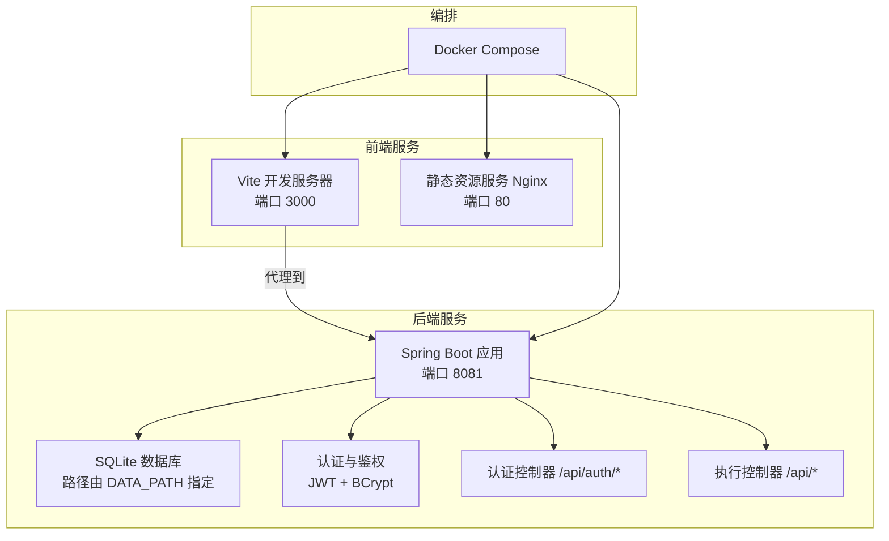
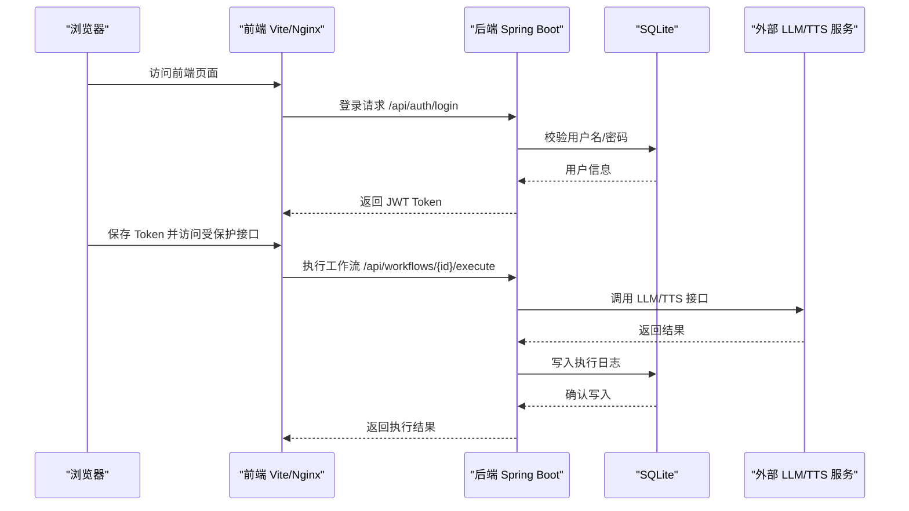
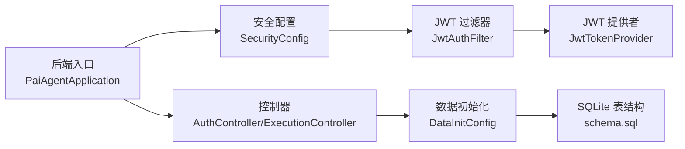

# 快速开始

<cite>
**本文引用的文件**
- [application.yml](file://backend/src/main/resources/application.yml)
- [schema.sql](file://backend/src/main/resources/schema.sql)
- [docker-compose.yml](file://docker-compose.yml)
- [backend/Dockerfile](file://backend/Dockerfile)
- [frontend/Dockerfile](file://frontend/Dockerfile)
- [backend/pom.xml](file://backend/pom.xml)
- [frontend/package.json](file://frontend/package.json)
- [vite.config.ts](file://frontend/vite.config.ts)
- [PaiAgentApplication.java](file://backend/src/main/java/com/paiagent/PaiAgentApplication.java)
- [AuthController.java](file://backend/src/main/java/com/paiagent/controller/AuthController.java)
- [ExecutionController.java](file://backend/src/main/java/com/paiagent/controller/ExecutionController.java)
- [SecurityConfig.java](file://backend/src/main/java/com/paiagent/config/SecurityConfig.java)
- [JwtTokenProvider.java](file://backend/src/main/java/com/paiagent/security/JwtTokenProvider.java)
- [JwtAuthFilter.java](file://backend/src/main/java/com/paiagent/security/JwtAuthFilter.java)
- [DataInitConfig.java](file://backend/src/main/java/com/paiagent/config/DataInitConfig.java)
</cite>

## 目录
1. [简介](#简介)
2. [项目结构](#项目结构)
3. [核心组件](#核心组件)
4. [架构总览](#架构总览)
5. [详细组件分析](#详细组件分析)
6. [依赖关系分析](#依赖关系分析)
7. [性能与资源建议](#性能与资源建议)
8. [故障排查指南](#故障排查指南)
9. [结论](#结论)
10. [附录：环境与部署清单](#附录环境与部署清单)

## 简介
本指南面向不同技术背景的开发者，帮助你在最短时间内完成 PaiAgent 的本地开发与 Docker 部署。内容涵盖环境要求、前置条件、数据库初始化、API 密钥配置、项目启动流程、容器编排与环境变量设置，并提供常见问题的排查与验证步骤。

## 项目结构
项目采用前后端分离架构，后端基于 Spring Boot（Java 11），前端基于 React/Vite，使用 SQLite 作为本地数据库，通过 Docker Compose 编排运行。

图表来源
- [docker-compose.yml:1-24](file://docker-compose.yml#L1-L24)
- [backend/Dockerfile:1-14](file://backend/Dockerfile#L1-L14)
- [frontend/Dockerfile:1-13](file://frontend/Dockerfile#L1-L13)
- [vite.config.ts:1-20](file://frontend/vite.config.ts#L1-L20)

章节来源
- [docker-compose.yml:1-24](file://docker-compose.yml#L1-L24)
- [backend/Dockerfile:1-14](file://backend/Dockerfile#L1-L14)
- [frontend/Dockerfile:1-13](file://frontend/Dockerfile#L1-L13)
- [vite.config.ts:1-20](file://frontend/vite.config.ts#L1-L20)

## 核心组件
- 后端应用入口与启动类负责加载 Spring Boot 上下文，监听 8081 端口。
- 认证与鉴权：基于 JWT 的无状态认证，密码使用 BCrypt 加密存储。
- 控制器层：
  - 认证控制器：登录与当前用户查询。
  - 执行控制器：工作流执行与执行日志查询。
- 数据初始化：启动时自动创建数据目录与数据库表，并插入默认管理员账户。
- 前端开发服务器：本地开发使用 Vite，默认代理到后端 8081 端口；生产构建由 Nginx 提供静态服务。

章节来源
- [PaiAgentApplication.java:1-12](file://backend/src/main/java/com/paiagent/PaiAgentApplication.java#L1-L12)
- [AuthController.java:1-56](file://backend/src/main/java/com/paiagent/controller/AuthController.java#L1-L56)
- [ExecutionController.java:1-93](file://backend/src/main/java/com/paiagent/controller/ExecutionController.java#L1-L93)
- [DataInitConfig.java:1-65](file://backend/src/main/java/com/paiagent/config/DataInitConfig.java#L1-L65)
- [SecurityConfig.java:1-53](file://backend/src/main/java/com/paiagent/config/SecurityConfig.java#L1-L53)
- [JwtTokenProvider.java:1-54](file://backend/src/main/java/com/paiagent/security/JwtTokenProvider.java#L1-L54)
- [JwtAuthFilter.java:1-50](file://backend/src/main/java/com/paiagent/security/JwtAuthFilter.java#L1-L50)
- [vite.config.ts:1-20](file://frontend/vite.config.ts#L1-L20)

## 架构总览
下图展示了从浏览器到后端 API，再到数据库与外部 LLM/TTS 服务的整体调用链路。

图表来源
- [AuthController.java:31-43](file://backend/src/main/java/com/paiagent/controller/AuthController.java#L31-L43)
- [ExecutionController.java:37-82](file://backend/src/main/java/com/paiagent/controller/ExecutionController.java#L37-L82)
- [application.yml:21-39](file://backend/src/main/resources/application.yml#L21-L39)
- [schema.sql:1-34](file://backend/src/main/resources/schema.sql#L1-L34)

## 详细组件分析

### 环境与前置条件
- Java 运行时
  - 版本：Java 11（后端使用 Maven 构建并以 Java 11 运行）
  - 参考：[backend/pom.xml:20-23](file://backend/pom.xml#L20-L23)
- Node.js 与包管理
  - 版本：Node.js 18（前端使用 Node 18 Alpine 构建镜像）
  - 包管理：npm（package.json 中定义了脚本与依赖）
  - 参考：[frontend/package.json:1-35](file://frontend/package.json#L1-L35)，[frontend/Dockerfile](file://frontend/Dockerfile#L1)
- Docker
  - 用于本地一键编排与部署
  - 参考：[docker-compose.yml:1-24](file://docker-compose.yml#L1-L24)
- 数据库
  - SQLite（嵌入式数据库），默认数据目录可由环境变量指定
  - 参考：[application.yml](file://backend/src/main/resources/application.yml#L6)，[schema.sql:1-34](file://backend/src/main/resources/schema.sql#L1-L34)

章节来源
- [backend/pom.xml:20-23](file://backend/pom.xml#L20-L23)
- [frontend/package.json:1-35](file://frontend/package.json#L1-L35)
- [frontend/Dockerfile](file://frontend/Dockerfile#L1)
- [docker-compose.yml:1-24](file://docker-compose.yml#L1-L24)
- [application.yml](file://backend/src/main/resources/application.yml#L6)
- [schema.sql:1-34](file://backend/src/main/resources/schema.sql#L1-L34)

### 本地开发环境搭建

#### 步骤一：准备数据库与初始数据
- 后端启动时会自动创建数据目录与数据库表，并插入默认管理员用户（密码为明文“admin123”，系统会进行加密存储）。
- 若需手动初始化，可参考 SQL 文件中的建表与种子数据。
- 参考：
  - [DataInitConfig.java:20-63](file://backend/src/main/java/com/paiagent/config/DataInitConfig.java#L20-L63)
  - [schema.sql:1-34](file://backend/src/main/resources/schema.sql#L1-L34)

章节来源
- [DataInitConfig.java:20-63](file://backend/src/main/java/com/paiagent/config/DataInitConfig.java#L20-L63)
- [schema.sql:1-34](file://backend/src/main/resources/schema.sql#L1-L34)

#### 步骤二：配置 API 密钥与环境变量
- 后端通过环境变量读取各类 LLM/TTS 的密钥与基础地址，未配置时将无法调用对应服务。
- 关键变量（来自后端配置）：
  - DEEPSEEK_API_KEY
  - QWEN_API_KEY
  - CHATGLM_API_KEY
  - TTS_API_KEY
  - JWT_SECRET
  - DATA_PATH（用于指定 SQLite 数据库与音频目录根路径）
- 参考：
  - [application.yml:21-43](file://backend/src/main/resources/application.yml#L21-L43)

章节来源
- [application.yml:21-43](file://backend/src/main/resources/application.yml#L21-L43)

#### 步骤三：启动后端
- 使用 Spring Boot 默认端口 8081。
- 参考：
  - [PaiAgentApplication.java:7-10](file://backend/src/main/java/com/paiagent/PaiAgentApplication.java#L7-L10)
  - [backend/Dockerfile](file://backend/Dockerfile#L13)

章节来源
- [PaiAgentApplication.java:7-10](file://backend/src/main/java/com/paiagent/PaiAgentApplication.java#L7-L10)
- [backend/Dockerfile](file://backend/Dockerfile#L13)

#### 步骤四：启动前端
- 前端开发服务器默认端口 3000，并通过代理将 /api 与 /files 请求转发至后端 8081。
- 参考：
  - [vite.config.ts:6-18](file://frontend/vite.config.ts#L6-L18)

章节来源
- [vite.config.ts:6-18](file://frontend/vite.config.ts#L6-L18)

#### 步骤五：验证登录与基本功能
- 登录接口：POST /api/auth/login（用户名/密码见默认种子数据）
- 查询当前用户：GET /api/auth/me
- 参考：
  - [AuthController.java:31-54](file://backend/src/main/java/com/paiagent/controller/AuthController.java#L31-L54)

章节来源
- [AuthController.java:31-54](file://backend/src/main/java/com/paiagent/controller/AuthController.java#L31-L54)

### Docker 部署方案

#### 容器编排与端口映射
- 前端服务（Nginx 静态页）：映射宿主机 8080 → 容器 80
- 后端服务（Spring Boot）：映射宿主机 8081 → 容器 8081
- 数据卷：将宿主机 ./data 映射到容器 /app/data，持久化 SQLite 与音频文件
- 参考：
  - [docker-compose.yml:3-24](file://docker-compose.yml#L3-L24)

章节来源
- [docker-compose.yml:3-24](file://docker-compose.yml#L3-L24)

#### 环境变量设置
- 在 compose 中传递以下变量（示例值请按需替换）：
  - DEEPSEEK_API_KEY
  - QWEN_API_KEY
  - CHATGLM_API_KEY
  - TTS_API_KEY
  - JWT_SECRET（建议在生产环境修改默认值）
  - SPRING_PROFILES_ACTIVE=prod
- 参考：
  - [docker-compose.yml:17-23](file://docker-compose.yml#L17-L23)

章节来源
- [docker-compose.yml:17-23](file://docker-compose.yml#L17-L23)

#### 构建镜像
- 后端镜像：基于 Maven + OpenJDK 11，先离线下载依赖，再打包生成可执行 jar
- 前端镜像：基于 Node 18 Alpine，安装依赖并构建，再由 Nginx 提供静态服务
- 参考：
  - [backend/Dockerfile:1-14](file://backend/Dockerfile#L1-L14)
  - [frontend/Dockerfile:1-13](file://frontend/Dockerfile#L1-L13)

章节来源
- [backend/Dockerfile:1-14](file://backend/Dockerfile#L1-L14)
- [frontend/Dockerfile:1-13](file://frontend/Dockerfile#L1-L13)

#### 启动与验证
- 使用 Docker Compose 启动后，访问 http://localhost:8080 查看前端页面，登录后可调用受保护接口。
- 参考：
  - [docker-compose.yml:4-9](file://docker-compose.yml#L4-L9)

章节来源
- [docker-compose.yml:4-9](file://docker-compose.yml#L4-L9)

## 依赖关系分析

图表来源
- [PaiAgentApplication.java:1-12](file://backend/src/main/java/com/paiagent/PaiAgentApplication.java#L1-L12)
- [SecurityConfig.java:1-53](file://backend/src/main/java/com/paiagent/config/SecurityConfig.java#L1-L53)
- [JwtAuthFilter.java:1-50](file://backend/src/main/java/com/paiagent/security/JwtAuthFilter.java#L1-L50)
- [JwtTokenProvider.java:1-54](file://backend/src/main/java/com/paiagent/security/JwtTokenProvider.java#L1-L54)
- [AuthController.java:1-56](file://backend/src/main/java/com/paiagent/controller/AuthController.java#L1-L56)
- [ExecutionController.java:1-93](file://backend/src/main/java/com/paiagent/controller/ExecutionController.java#L1-L93)
- [DataInitConfig.java:1-65](file://backend/src/main/java/com/paiagent/config/DataInitConfig.java#L1-L65)
- [schema.sql:1-34](file://backend/src/main/resources/schema.sql#L1-L34)

## 性能与资源建议
- 数据库：SQLite 适合本地开发与小规模数据；若并发较高或需要更强一致性，请评估迁移到关系型数据库。
- 前端：开发模式使用 Vite 热更新，生产构建由 Nginx 提供静态资源，建议启用缓存策略。
- 后端：JVM 参数可根据实际负载调整，注意堆内存与 GC 设置。
- 外部服务：LLM/TTS 调用存在网络延迟，建议在网关层增加超时与重试策略（可在业务层扩展）。

## 故障排查指南

- 无法访问前端页面
  - 检查前端容器是否正常运行，端口 80 是否被占用；确认 Nginx 配置正确。
  - 参考：[frontend/Dockerfile:8-12](file://frontend/Dockerfile#L8-L12)，[docker-compose.yml:4-9](file://docker-compose.yml#L4-L9)

- 无法访问后端 API 或返回 401
  - 确认已正确登录并携带有效的 Bearer Token。
  - 检查 JWT_SECRET 是否与后端一致。
  - 参考：[AuthController.java:31-54](file://backend/src/main/java/com/paiagent/controller/AuthController.java#L31-L54)，[SecurityConfig.java:26-42](file://backend/src/main/java/com/paiagent/config/SecurityConfig.java#L26-L42)，[application.yml:17-19](file://backend/src/main/resources/application.yml#L17-L19)

- 数据库未初始化或表缺失
  - 启动后端应自动创建表与默认用户；如失败，检查 DATA_PATH 权限与磁盘空间。
  - 参考：[DataInitConfig.java:20-63](file://backend/src/main/java/com/paiagent/config/DataInitConfig.java#L20-L63)，[schema.sql:1-34](file://backend/src/main/resources/schema.sql#L1-L34)

- LLM/TTS 调用失败
  - 检查对应 API Key 与基础地址是否正确配置。
  - 参考：[application.yml:21-39](file://backend/src/main/resources/application.yml#L21-L39)

- 前端代理无效导致跨域
  - 确认本地开发时代理目标为 http://localhost:8081。
  - 参考：[vite.config.ts:8-17](file://frontend/vite.config.ts#L8-L17)

- Docker 启动后端报端口冲突
  - 修改宿主机映射端口或释放 8081 端口占用。
  - 参考：[docker-compose.yml:13-14](file://docker-compose.yml#L13-L14)

章节来源
- [frontend/Dockerfile:8-12](file://frontend/Dockerfile#L8-L12)
- [docker-compose.yml:4-14](file://docker-compose.yml#L4-L14)
- [AuthController.java:31-54](file://backend/src/main/java/com/paiagent/controller/AuthController.java#L31-L54)
- [SecurityConfig.java:26-42](file://backend/src/main/java/com/paiagent/config/SecurityConfig.java#L26-L42)
- [application.yml:17-39](file://backend/src/main/resources/application.yml#L17-L39)
- [DataInitConfig.java:20-63](file://backend/src/main/java/com/paiagent/config/DataInitConfig.java#L20-L63)
- [schema.sql:1-34](file://backend/src/main/resources/schema.sql#L1-L34)
- [vite.config.ts:8-17](file://frontend/vite.config.ts#L8-L17)

## 结论
通过本指南，你可以快速完成本地开发与 Docker 部署。建议在生产环境中：
- 更换默认 JWT_SECRET
- 配置稳定的数据库与备份策略
- 为 LLM/TTS 服务配置合适的超时与重试机制
- 对外暴露的 API 增强安全与限流措施

## 附录：环境与部署清单

- 环境要求
  - Java 11（后端运行）
  - Node.js 18（前端构建）
  - Docker（可选，推荐）

- 关键环境变量
  - DEEPSEEK_API_KEY、QWEN_API_KEY、CHATGLM_API_KEY、TTS_API_KEY
  - JWT_SECRET
  - DATA_PATH（默认 ./data）

- 端口映射
  - 前端：8080 → 80
  - 后端：8081 → 8081

- 默认管理员
  - 用户名：admin
  - 密码：admin123（系统会进行加密存储）

章节来源
- [backend/pom.xml:20-23](file://backend/pom.xml#L20-L23)
- [frontend/package.json:1-35](file://frontend/package.json#L1-L35)
- [docker-compose.yml:17-23](file://docker-compose.yml#L17-L23)
- [application.yml:6-43](file://backend/src/main/resources/application.yml#L6-L43)
- [schema.sql:31-33](file://backend/src/main/resources/schema.sql#L31-L33)