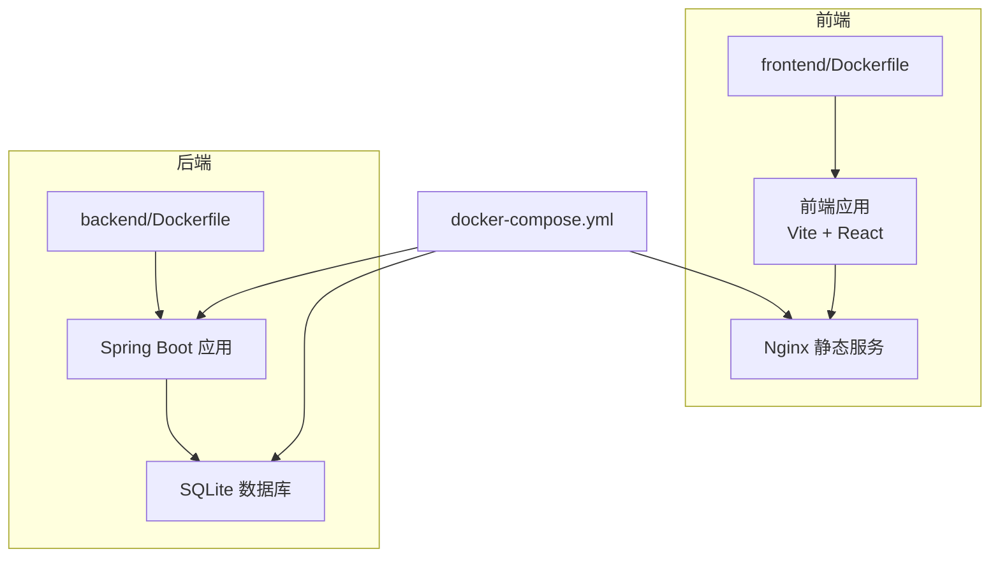
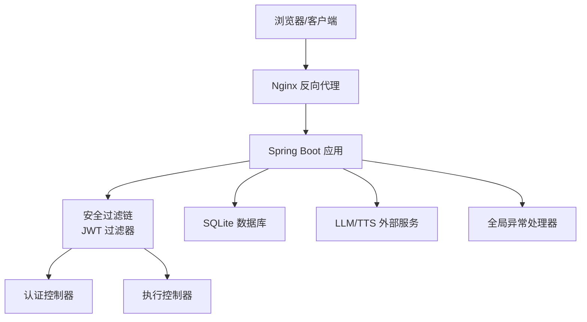
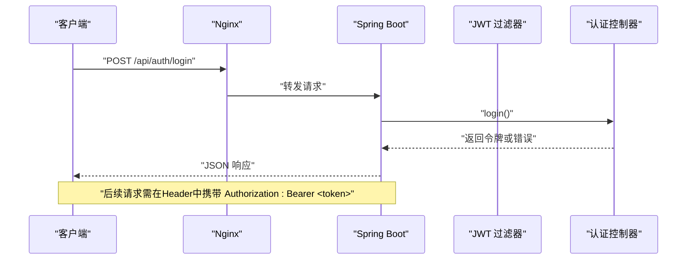
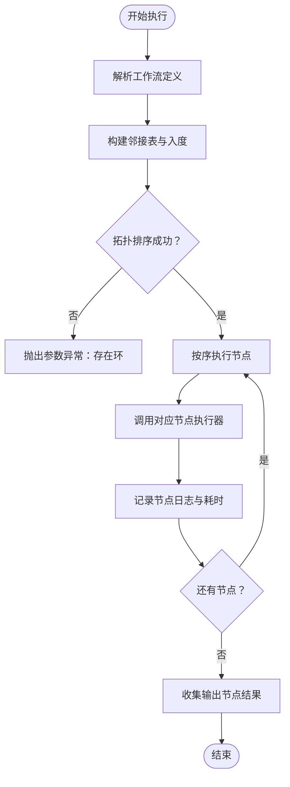
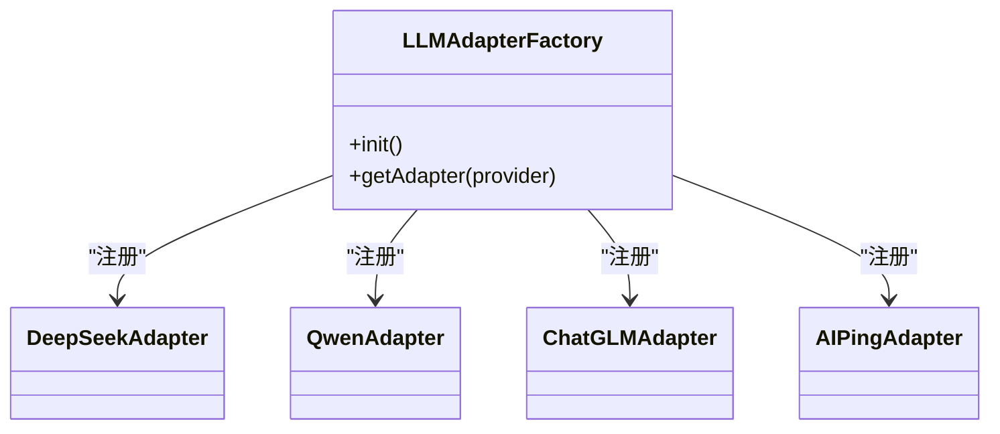
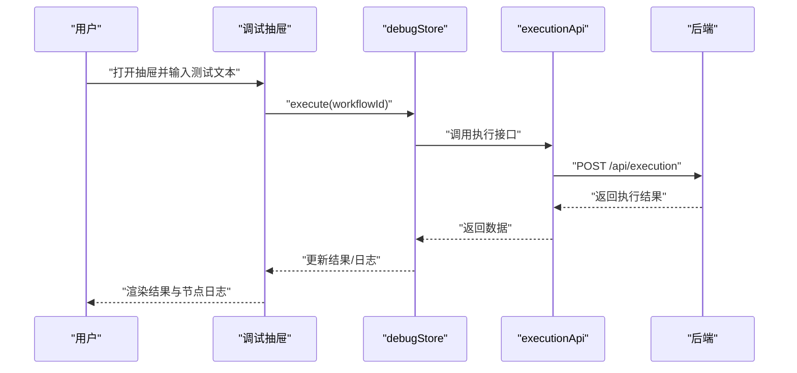
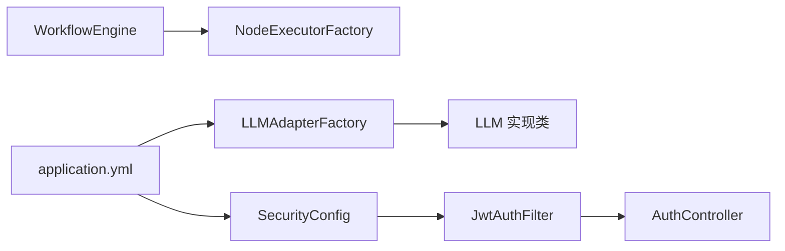

# 故障排除

<cite>
**本文引用的文件**
- [PaiAgentApplication.java](file://backend/src/main/java/com/paiagent/PaiAgentApplication.java)
- [GlobalExceptionHandler.java](file://backend/src/main/java/com/paiagent/exception/GlobalExceptionHandler.java)
- [SecurityConfig.java](file://backend/src/main/java/com/paiagent/config/SecurityConfig.java)
- [JwtAuthFilter.java](file://backend/src/main/java/com/paiagent/security/JwtAuthFilter.java)
- [AuthController.java](file://backend/src/main/java/com/paiagent/controller/AuthController.java)
- [LoginRequest.java](file://backend/src/main/java/com/paiagent/model/dto/LoginRequest.java)
- [ApiResponse.java](file://backend/src/main/java/com/paiagent/model/dto/ApiResponse.java)
- [LLMAdapterFactory.java](file://backend/src/main/java/com/paiagent/adapter/LLMAdapterFactory.java)
- [WorkflowEngine.java](file://backend/src/main/java/com/paiagent/engine/WorkflowEngine.java)
- [application.yml](file://backend/src/main/resources/application.yml)
- [DebugDrawer.tsx](file://frontend/src/components/DebugDrawer/DebugDrawer.tsx)
- [debugStore.ts](file://frontend/src/store/debugStore.ts)
- [docker-compose.yml](file://docker-compose.yml)
- [backend/Dockerfile](file://backend/Dockerfile)
- [frontend/Dockerfile](file://frontend/Dockerfile)
</cite>

## 目录
1. [简介](#简介)
2. [项目结构](#项目结构)
3. [核心组件](#核心组件)
4. [架构总览](#架构总览)
5. [详细组件分析](#详细组件分析)
6. [依赖分析](#依赖分析)
7. [性能考虑](#性能考虑)
8. [故障排除指南](#故障排除指南)
9. [结论](#结论)
10. [附录](#附录)

## 简介
本指南面向PaiAgent项目的开发者与运维人员，聚焦于系统化故障排除与调试实践。内容覆盖认证失败、数据库连接异常、API调用错误等常见问题的诊断与修复；提供日志配置、错误追踪与性能分析方法；阐述全局异常处理机制与错误信息标准化；给出开发与生产环境差异化的调试策略、监控与告警配置建议，并提供问题报告模板与社区支持渠道。

## 项目结构
后端采用Spring Boot，前端基于React/Vite，通过Nginx提供静态资源服务。容器编排使用Compose，分别构建前后端镜像并挂载数据卷。

图表来源
- [docker-compose.yml:1-24](file://docker-compose.yml#L1-L24)
- [frontend/Dockerfile:1-13](file://frontend/Dockerfile#L1-L13)
- [backend/Dockerfile:1-14](file://backend/Dockerfile#L1-L14)

章节来源
- [docker-compose.yml:1-24](file://docker-compose.yml#L1-L24)
- [frontend/Dockerfile:1-13](file://frontend/Dockerfile#L1-L13)
- [backend/Dockerfile:1-14](file://backend/Dockerfile#L1-L14)

## 核心组件
- 全局异常处理器：统一捕获参数校验、运行时与通用异常，返回标准化响应。
- 安全配置与JWT过滤器：无状态鉴权，拦截除登录外的受保护路径。
- 认证控制器：用户名密码校验与令牌签发。
- 工作流引擎：拓扑排序执行节点，记录节点级日志与耗时。
- LLM适配工厂：按提供商注入密钥与基础URL，未知提供商抛出参数异常。
- 前端调试抽屉：可视化调试工作流，展示执行结果与节点日志。

章节来源
- [GlobalExceptionHandler.java:1-30](file://backend/src/main/java/com/paiagent/exception/GlobalExceptionHandler.java#L1-L30)
- [SecurityConfig.java:1-54](file://backend/src/main/java/com/paiagent/config/SecurityConfig.java#L1-L54)
- [JwtAuthFilter.java:1-51](file://backend/src/main/java/com/paiagent/security/JwtAuthFilter.java#L1-L51)
- [AuthController.java:1-56](file://backend/src/main/java/com/paiagent/controller/AuthController.java#L1-L56)
- [WorkflowEngine.java:1-136](file://backend/src/main/java/com/paiagent/engine/WorkflowEngine.java#L1-L136)
- [LLMAdapterFactory.java:1-52](file://backend/src/main/java/com/paiagent/adapter/LLMAdapterFactory.java#L1-L52)
- [DebugDrawer.tsx:1-127](file://frontend/src/components/DebugDrawer/DebugDrawer.tsx#L1-L127)

## 架构总览
下图展示从浏览器到后端服务、数据库与外部大模型/TTS服务的整体交互路径，以及JWT鉴权与异常处理的关键节点。

图表来源
- [docker-compose.yml:1-24](file://docker-compose.yml#L1-L24)
- [SecurityConfig.java:26-42](file://backend/src/main/java/com/paiagent/config/SecurityConfig.java#L26-L42)
- [JwtAuthFilter.java:26-41](file://backend/src/main/java/com/paiagent/security/JwtAuthFilter.java#L26-L41)
- [AuthController.java:31-43](file://backend/src/main/java/com/paiagent/controller/AuthController.java#L31-L43)
- [GlobalExceptionHandler.java:12-28](file://backend/src/main/java/com/paiagent/exception/GlobalExceptionHandler.java#L12-L28)

## 详细组件分析

### 组件A：认证与安全（认证失败排查）
- 关键点
  - 登录接口对用户名/密码进行校验，失败返回401。
  - JWT过滤器从请求头提取Bearer Token并设置认证上下文。
  - 未携带或无效Token导致后续接口401。
- 排查清单
  - 确认请求头是否包含正确的Authorization: Bearer <token>。
  - 检查JWT密钥与过期时间配置。
  - 核对用户是否存在且密码匹配。
- 调试步骤
  - 使用前端调试抽屉执行一次工作流，观察返回的错误提示。
  - 在后端开启更详细的日志级别以捕获认证链路信息。

图表来源
- [AuthController.java:31-43](file://backend/src/main/java/com/paiagent/controller/AuthController.java#L31-L43)
- [JwtAuthFilter.java:26-41](file://backend/src/main/java/com/paiagent/security/JwtAuthFilter.java#L26-L41)
- [SecurityConfig.java:27-42](file://backend/src/main/java/com/paiagent/config/SecurityConfig.java#L27-L42)

章节来源
- [AuthController.java:31-54](file://backend/src/main/java/com/paiagent/controller/AuthController.java#L31-L54)
- [JwtAuthFilter.java:26-50](file://backend/src/main/java/com/paiagent/security/JwtAuthFilter.java#L26-L50)
- [SecurityConfig.java:26-52](file://backend/src/main/java/com/paiagent/config/SecurityConfig.java#L26-L52)

### 组件B：工作流执行（节点失败与循环检测）
- 关键点
  - 执行前解析工作流定义，构建邻接表与入度，进行拓扑排序。
  - 对每个节点按顺序执行，记录成功/失败、输出与耗时。
  - 若工作流存在环，抛出参数异常。
- 排查清单
  - 检查工作流定义中节点与边是否正确。
  - 观察节点日志中的status与error字段定位失败节点。
  - 关注执行耗时异常增长的节点。
- 调试步骤
  - 使用前端调试抽屉输入测试文本，查看节点日志卡片。
  - 在后端启用SQL日志与业务日志，复现失败场景。

图表来源
- [WorkflowEngine.java:21-108](file://backend/src/main/java/com/paiagent/engine/WorkflowEngine.java#L21-L108)

章节来源
- [WorkflowEngine.java:21-136](file://backend/src/main/java/com/paiagent/engine/WorkflowEngine.java#L21-L136)

### 组件C：LLM适配工厂（外部API调用错误）
- 关键点
  - 通过配置文件注入各提供商的API Key与Base URL。
  - 未知提供商名称会触发参数异常。
- 排查清单
  - 确认配置文件中提供商名称与密钥均正确。
  - 检查外部服务可用性与网络连通性。
  - 关注节点执行器内部对外部API的调用错误。
- 调试步骤
  - 在后端日志中定位具体提供商与请求路径。
  - 使用curl或Postman验证外部API连通性与鉴权。

图表来源
- [LLMAdapterFactory.java:36-50](file://backend/src/main/java/com/paiagent/adapter/LLMAdapterFactory.java#L36-L50)

章节来源
- [LLMAdapterFactory.java:14-50](file://backend/src/main/java/com/paiagent/adapter/LLMAdapterFactory.java#L14-L50)
- [application.yml:21-39](file://backend/src/main/resources/application.yml#L21-L39)

### 组件D：前端调试抽屉（本地调试与结果可视化）
- 关键点
  - 提供测试输入、执行按钮与加载状态。
  - 展示执行结果、节点日志与音频播放控件。
  - Store负责发起执行请求与错误归集。
- 排查清单
  - 确保已保存工作流并获取有效ID。
  - 检查网络面板中的请求与响应。
  - 查看控制台是否有JavaScript错误。
- 调试步骤
  - 打开调试抽屉，输入测试文本，点击执行。
  - 观察节点日志卡片中的状态与耗时，定位失败节点。

图表来源
- [DebugDrawer.tsx:8-18](file://frontend/src/components/DebugDrawer/DebugDrawer.tsx#L8-L18)
- [debugStore.ts:30-41](file://frontend/src/store/debugStore.ts#L30-L41)

章节来源
- [DebugDrawer.tsx:1-127](file://frontend/src/components/DebugDrawer/DebugDrawer.tsx#L1-L127)
- [debugStore.ts:1-45](file://frontend/src/store/debugStore.ts#L1-L45)

## 依赖分析
- 组件耦合
  - 安全配置与JWT过滤器强耦合于认证流程。
  - 工作流引擎依赖节点执行器工厂与Jackson。
  - LLM适配工厂依赖配置文件中的提供商参数。
- 外部依赖
  - SQLite数据库与JPA方言。
  - 多个外部LLM/TTS服务。
- 潜在风险
  - 未知提供商名称直接触发参数异常。
  - 工作流存在环时立即失败，需在前端/编辑器侧加强校验。

图表来源
- [SecurityConfig.java:20-24](file://backend/src/main/java/com/paiagent/config/SecurityConfig.java#L20-L24)
- [JwtAuthFilter.java:20-24](file://backend/src/main/java/com/paiagent/security/JwtAuthFilter.java#L20-L24)
- [AuthController.java:20-29](file://backend/src/main/java/com/paiagent/controller/AuthController.java#L20-L29)
- [WorkflowEngine.java:12-17](file://backend/src/main/java/com/paiagent/engine/WorkflowEngine.java#L12-L17)
- [LLMAdapterFactory.java:34-50](file://backend/src/main/java/com/paiagent/adapter/LLMAdapterFactory.java#L34-L50)
- [application.yml:1-44](file://backend/src/main/resources/application.yml#L1-L44)

章节来源
- [SecurityConfig.java:1-54](file://backend/src/main/java/com/paiagent/config/SecurityConfig.java#L1-L54)
- [LLMAdapterFactory.java:1-52](file://backend/src/main/java/com/paiagent/adapter/LLMAdapterFactory.java#L1-L52)
- [application.yml:1-44](file://backend/src/main/resources/application.yml#L1-L44)

## 性能考虑
- 日志级别
  - 生产环境建议关闭show-sql，必要时开启SQL与业务日志以定位慢查询。
- 执行性能
  - 工作流引擎记录节点耗时，可用于识别瓶颈节点。
  - 外部API调用建议增加超时与重试策略。
- 资源与并发
  - 合理配置线程池与连接池大小，避免阻塞。
- 缓存与CDN
  - 前端静态资源由Nginx提供，可结合缓存策略提升访问速度。

## 故障排除指南

### 认证失败
- 现象
  - 登录返回401；后续接口返回401。
- 诊断
  - 检查请求头Authorization是否为Bearer Token。
  - 核对JWT密钥与过期时间配置。
  - 确认用户存在且密码匹配。
- 修复
  - 重新登录获取新令牌。
  - 更新JWT密钥与过期时间配置。
  - 确保用户已创建且密码正确。

章节来源
- [AuthController.java:31-54](file://backend/src/main/java/com/paiagent/controller/AuthController.java#L31-L54)
- [JwtAuthFilter.java:26-50](file://backend/src/main/java/com/paiagent/security/JwtAuthFilter.java#L26-L50)
- [SecurityConfig.java:26-52](file://backend/src/main/java/com/paiagent/config/SecurityConfig.java#L26-L52)
- [application.yml:16-19](file://backend/src/main/resources/application.yml#L16-L19)

### 数据库连接异常
- 现象
  - 启动时报数据库连接错误或无法读写。
- 诊断
  - 检查DATA_PATH与数据库URL配置。
  - 确认数据卷挂载路径与权限。
  - 查看容器内数据库文件是否存在。
- 修复
  - 设置正确的DATA_PATH并确保目录存在。
  - 检查Compose中volumes映射。
  - 在容器内手动创建数据库文件并赋予读写权限。

章节来源
- [application.yml:5-14](file://backend/src/main/resources/application.yml#L5-L14)
- [docker-compose.yml:15-16](file://docker-compose.yml#L15-L16)
- [backend/Dockerfile:10-13](file://backend/Dockerfile#L10-L13)

### API调用错误（LLM/TTS）
- 现象
  - 工作流执行过程中节点失败，返回错误信息。
- 诊断
  - 查看节点日志中的status与error字段。
  - 确认提供商名称与API Key、Base URL配置。
  - 验证外部服务可用性与网络连通性。
- 修复
  - 更正提供商名称与密钥配置。
  - 检查外部服务限流与配额。
  - 增加重试与超时策略。

章节来源
- [WorkflowEngine.java:70-90](file://backend/src/main/java/com/paiagent/engine/WorkflowEngine.java#L70-L90)
- [LLMAdapterFactory.java:14-50](file://backend/src/main/java/com/paiagent/adapter/LLMAdapterFactory.java#L14-L50)
- [application.yml:21-39](file://backend/src/main/resources/application.yml#L21-L39)

### 工作流循环与节点失败
- 现象
  - 执行报错提示“工作流存在环”或部分节点失败。
- 诊断
  - 检查工作流定义中节点与边的拓扑关系。
  - 查看节点日志定位失败节点与错误信息。
- 修复
  - 修正工作流定义，消除环路。
  - 修复失败节点的输入或外部依赖。

章节来源
- [WorkflowEngine.java:110-134](file://backend/src/main/java/com/paiagent/engine/WorkflowEngine.java#L110-L134)
- [WorkflowEngine.java:81-90](file://backend/src/main/java/com/paiagent/engine/WorkflowEngine.java#L81-L90)

### 前端调试与结果可视化
- 现象
  - 调试抽屉无法执行或结果为空。
- 诊断
  - 确认已保存工作流并获取有效ID。
  - 检查网络面板中的请求与响应。
  - 查看控制台是否有JavaScript错误。
- 修复
  - 保存工作流后再进行调试。
  - 修复前端类型或接口调用错误。

章节来源
- [DebugDrawer.tsx:13-18](file://frontend/src/components/DebugDrawer/DebugDrawer.tsx#L13-L18)
- [debugStore.ts:30-41](file://frontend/src/store/debugStore.ts#L30-L41)

### 开发与生产环境调试策略
- 开发环境
  - 启用SQL日志与业务日志，便于定位问题。
  - 使用本地SQLite文件，便于快速迭代。
- 生产环境
  - 关闭SQL日志，降低I/O开销。
  - 使用持久化存储与备份策略。
  - 配置健康检查与日志采集。

章节来源
- [application.yml:8-14](file://backend/src/main/resources/application.yml#L8-L14)
- [docker-compose.yml:22-23](file://docker-compose.yml#L22-L23)

### 监控与告警配置建议
- 指标
  - 请求量、错误率、响应时间、节点执行耗时。
- 日志
  - 分离访问日志与业务日志，设置滚动策略。
- 告警
  - 针对认证失败、数据库连接异常、外部API超时设置阈值告警。
- 可视化
  - 结合日志与指标平台进行聚合分析。

### 全局异常处理与错误标准化
- 机制
  - 参数异常返回400，运行时异常返回500，通用异常返回500。
  - 统一响应体包含code、data、message。
- 建议
  - 为不同异常类型定义明确的错误码与消息。
  - 在前端根据code进行友好提示与重试逻辑。

章节来源
- [GlobalExceptionHandler.java:12-28](file://backend/src/main/java/com/paiagent/exception/GlobalExceptionHandler.java#L12-L28)
- [ApiResponse.java:15-21](file://backend/src/main/java/com/paiagent/model/dto/ApiResponse.java#L15-L21)

### 问题报告模板
- 环境信息
  - 操作系统、浏览器版本、后端版本、数据库版本。
- 复现步骤
  - 详细描述操作步骤与期望结果。
- 实际结果
  - 截图或日志片段链接。
- 日志与配置
  - application.yml相关片段、后端日志片段。
- 附加信息
  - 工作流定义节选、节点日志、网络请求详情。

### 社区支持渠道
- 提交Issue
  - 在仓库Issues页面提交问题报告，附带上述模板信息。
- 讨论区
  - 参考仓库README中的讨论区或论坛链接（如适用）。

## 结论
通过统一的异常处理、标准化响应、完善的日志与监控策略，以及开发/生产差异化调试手段，PaiAgent能够快速定位并解决认证、数据库、API调用与工作流执行中的问题。建议在上线前完善外部依赖的容错与告警配置，并持续优化节点执行性能与用户体验。

## 附录
- 快速检查清单
  - 认证：请求头Authorization、JWT密钥、用户存在性。
  - 数据库：DATA_PATH、数据卷权限、数据库文件。
  - 外部API：提供商名称、API Key、Base URL、网络连通性。
  - 工作流：拓扑合法性、节点日志、耗时分析。
  - 前端：保存工作流、网络面板、控制台错误。