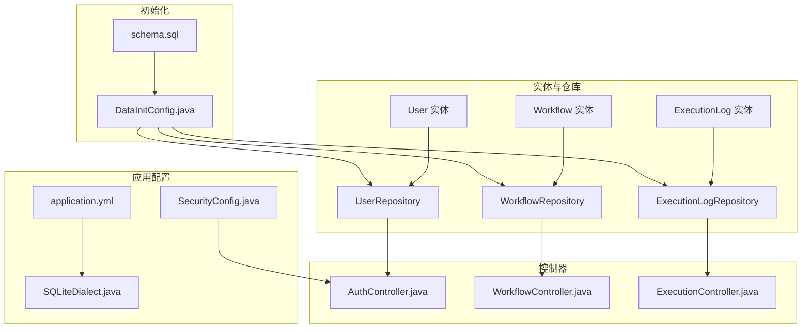
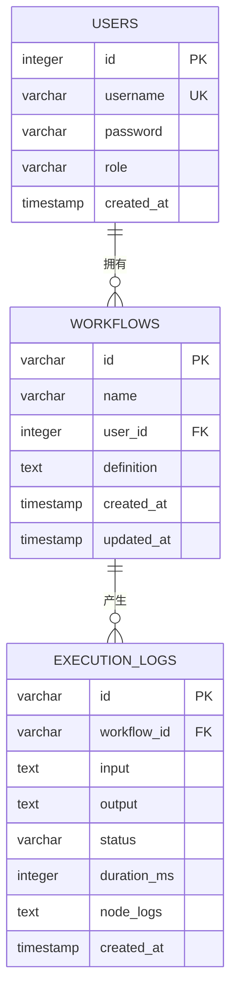
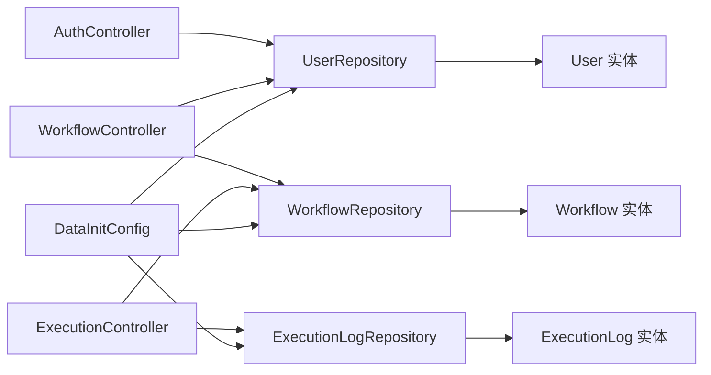

# 数据库设计

<cite>
**本文引用的文件**
- [User.java](file://backend/src/main/java/com/paiagent/model/entity/User.java)
- [Workflow.java](file://backend/src/main/java/com/paiagent/model/entity/Workflow.java)
- [ExecutionLog.java](file://backend/src/main/java/com/paiagent/model/entity/ExecutionLog.java)
- [UserRepository.java](file://backend/src/main/java/com/paiagent/repository/UserRepository.java)
- [WorkflowRepository.java](file://backend/src/main/java/com/paiagent/repository/WorkflowRepository.java)
- [ExecutionLogRepository.java](file://backend/src/main/java/com/paiagent/repository/ExecutionLogRepository.java)
- [schema.sql](file://backend/src/main/resources/schema.sql)
- [DataInitConfig.java](file://backend/src/main/java/com/paiagent/config/DataInitConfig.java)
- [SQLiteDialect.java](file://backend/src/main/java/com/paiagent/config/SQLiteDialect.java)
- [application.yml](file://backend/src/main/resources/application.yml)
- [SecurityConfig.java](file://backend/src/main/java/com/paiagent/config/SecurityConfig.java)
- [JwtAuthFilter.java](file://backend/src/main/java/com/paiagent/security/JwtAuthFilter.java)
- [AuthController.java](file://backend/src/main/java/com/paiagent/controller/AuthController.java)
- [WorkflowController.java](file://backend/src/main/java/com/paiagent/controller/WorkflowController.java)
- [ExecutionController.java](file://backend/src/main/java/com/paiagent/controller/ExecutionController.java)
</cite>

## 目录
1. [简介](#简介)
2. [项目结构](#项目结构)
3. [核心组件](#核心组件)
4. [架构总览](#架构总览)
5. [详细组件分析](#详细组件分析)
6. [依赖分析](#依赖分析)
7. [性能考虑](#性能考虑)
8. [故障排查指南](#故障排查指南)
9. [结论](#结论)
10. [附录](#附录)

## 简介
本文件面向PaiAgent后端数据库设计，聚焦于用户表、工作流表与执行日志表的结构设计、JPA实体映射、初始化脚本与迁移策略、ER关系图、数据访问模式与查询优化、性能与安全控制等。目标是帮助开发者与运维人员快速理解并维护数据库层。

## 项目结构
后端采用Spring Boot + JPA + SQLite方案，数据库初始化通过SQL脚本与启动时CommandLineRunner两种方式实现；安全通过JWT过滤器与BCrypt密码编码器保障。

图表来源
- [application.yml:1-44](file://backend/src/main/resources/application.yml#L1-L44)
- [SecurityConfig.java:1-54](file://backend/src/main/java/com/paiagent/config/SecurityConfig.java#L1-L54)
- [SQLiteDialect.java:1-130](file://backend/src/main/java/com/paiagent/config/SQLiteDialect.java#L1-L130)
- [schema.sql:1-34](file://backend/src/main/resources/schema.sql#L1-L34)
- [DataInitConfig.java:1-65](file://backend/src/main/java/com/paiagent/config/DataInitConfig.java#L1-L65)
- [User.java:1-28](file://backend/src/main/java/com/paiagent/model/entity/User.java#L1-L28)
- [Workflow.java:1-31](file://backend/src/main/java/com/paiagent/model/entity/Workflow.java#L1-L31)
- [ExecutionLog.java:1-37](file://backend/src/main/java/com/paiagent/model/entity/ExecutionLog.java#L1-L37)
- [UserRepository.java:1-11](file://backend/src/main/java/com/paiagent/repository/UserRepository.java#L1-L11)
- [WorkflowRepository.java:1-11](file://backend/src/main/java/com/paiagent/repository/WorkflowRepository.java#L1-L11)
- [ExecutionLogRepository.java:1-11](file://backend/src/main/java/com/paiagent/repository/ExecutionLogRepository.java#L1-L11)
- [AuthController.java:1-56](file://backend/src/main/java/com/paiagent/controller/AuthController.java#L1-L56)
- [WorkflowController.java:1-91](file://backend/src/main/java/com/paiagent/controller/WorkflowController.java#L1-L91)
- [ExecutionController.java:1-93](file://backend/src/main/java/com/paiagent/controller/ExecutionController.java#L1-L93)

章节来源
- [application.yml:1-44](file://backend/src/main/resources/application.yml#L1-L44)
- [schema.sql:1-34](file://backend/src/main/resources/schema.sql#L1-L34)
- [DataInitConfig.java:1-65](file://backend/src/main/java/com/paiagent/config/DataInitConfig.java#L1-L65)

## 核心组件
- 用户表（users）
  - 主键：自增整数ID
  - 唯一约束：用户名
  - 字段：用户名、密码、角色、创建时间
- 工作流表（workflows）
  - 主键：字符串UUID
  - 外键：user_id 指向 users.id
  - 字段：名称、所属用户ID、定义JSON文本、创建/更新时间
- 执行日志表（execution_logs）
  - 主键：字符串UUID
  - 外键：workflow_id 指向 workflows.id
  - 字段：输入输出文本、状态、耗时毫秒、节点日志、创建时间

章节来源
- [User.java:11-27](file://backend/src/main/java/com/paiagent/model/entity/User.java#L11-L27)
- [Workflow.java:11-30](file://backend/src/main/java/com/paiagent/model/entity/Workflow.java#L11-L30)
- [ExecutionLog.java:9-36](file://backend/src/main/java/com/paiagent/model/entity/ExecutionLog.java#L9-L36)
- [schema.sql:1-29](file://backend/src/main/resources/schema.sql#L1-L29)

## 架构总览
下图展示三张表的ER关系以及关键字段约束与外键指向。

图表来源
- [schema.sql:1-29](file://backend/src/main/resources/schema.sql#L1-L29)
- [User.java:11-27](file://backend/src/main/java/com/paiagent/model/entity/User.java#L11-L27)
- [Workflow.java:11-30](file://backend/src/main/java/com/paiagent/model/entity/Workflow.java#L11-L30)
- [ExecutionLog.java:9-36](file://backend/src/main/java/com/paiagent/model/entity/ExecutionLog.java#L9-L36)

## 详细组件分析

### 用户表（users）设计
- 字段与约束
  - id：自增主键
  - username：唯一非空，长度上限50
  - password：非空，长度上限255
  - role：默认“admin”，长度上限20
  - created_at：默认当前时间戳
- JPA映射要点
  - 实体类使用注解声明表名与主键生成策略
  - 使用LocalDateTime记录时间
- 初始化与种子数据
  - schema.sql中创建表并插入管理员用户（密码经BCrypt编码）
  - DataInitConfig在启动时也确保目录与表存在，并插入管理员用户

章节来源
- [User.java:11-27](file://backend/src/main/java/com/paiagent/model/entity/User.java#L11-L27)
- [schema.sql:1-7](file://backend/src/main/resources/schema.sql#L1-L7)
- [DataInitConfig.java:30-60](file://backend/src/main/java/com/paiagent/config/DataInitConfig.java#L30-L60)

### 工作流表（workflows）设计
- 字段与约束
  - id：UUID字符串主键
  - name：非空，长度上限100
  - user_id：非空，外键指向users.id
  - definition：非空文本，存储工作流定义
  - created_at/updated_at：默认当前时间戳
- JPA映射要点
  - 主键为字符串UUID
  - 定义字段以TEXT类型存储
- 访问模式
  - 按用户ID查询并按更新时间倒序排序
- 控制器交互
  - 创建/更新时写入创建与更新时间
  - 删除接口支持按ID删除

章节来源
- [Workflow.java:11-30](file://backend/src/main/java/com/paiagent/model/entity/Workflow.java#L11-L30)
- [WorkflowRepository.java:8-10](file://backend/src/main/java/com/paiagent/repository/WorkflowRepository.java#L8-L10)
- [WorkflowController.java:35-91](file://backend/src/main/java/com/paiagent/controller/WorkflowController.java#L35-L91)
- [schema.sql:9-17](file://backend/src/main/resources/schema.sql#L9-L17)

### 执行日志表（execution_logs）设计
- 字段与约束
  - id：UUID字符串主键
  - workflow_id：非空，外键指向workflows.id
  - input/output：TEXT存储输入输出
  - status：长度上限20
  - duration_ms：整型毫秒
  - node_logs：TEXT存储节点级日志
  - created_at：默认当前时间戳
- JPA映射要点
  - 主键为字符串UUID
  - TEXT字段用于大文本
- 访问模式
  - 按workflow_id查询并按创建时间倒序
- 控制器交互
  - 执行成功或失败均落库，包含耗时统计

章节来源
- [ExecutionLog.java:9-36](file://backend/src/main/java/com/paiagent/model/entity/ExecutionLog.java#L9-L36)
- [ExecutionLogRepository.java:8-10](file://backend/src/main/java/com/paiagent/repository/ExecutionLogRepository.java#L8-L10)
- [ExecutionController.java:37-93](file://backend/src/main/java/com/paiagent/controller/ExecutionController.java#L37-L93)
- [schema.sql:19-29](file://backend/src/main/resources/schema.sql#L19-L29)

### JPA实体映射与索引优化
- 实体映射
  - 表名与列名通过注解声明
  - 主键策略：users使用自增，workflows与execution_logs使用UUID
  - 时间字段统一使用LocalDateTime
- 约束与索引
  - 唯一索引：users.username
  - 外键：workflows.user_id → users.id；execution_logs.workflow_id → workflows.id
  - 建议索引（基于访问模式）
    - workflows.userId + updatedAt（倒序查询）
    - execution_logs.workflow_id + createdAt（倒序查询）

章节来源
- [User.java:10-27](file://backend/src/main/java/com/paiagent/model/entity/User.java#L10-L27)
- [Workflow.java:10-30](file://backend/src/main/java/com/paiagent/model/entity/Workflow.java#L10-L30)
- [ExecutionLog.java:9-36](file://backend/src/main/java/com/paiagent/model/entity/ExecutionLog.java#L9-L36)
- [WorkflowRepository.java:8-10](file://backend/src/main/java/com/paiagent/repository/WorkflowRepository.java#L8-L10)
- [ExecutionLogRepository.java:8-10](file://backend/src/main/java/com/paiagent/repository/ExecutionLogRepository.java#L8-L10)

### 数据库初始化与迁移策略
- 初始化脚本
  - schema.sql：创建三张表并插入管理员用户（密码已BCrypt编码）
- 启动时初始化
  - DataInitConfig：确保音频目录存在；若表不存在则创建；插入管理员用户
- 迁移策略建议
  - 当前DDL-AUTO设为none，不自动建表改结构
  - 新版本如需变更，建议在schema.sql中新增ALTER语句或引入Flyway/Liquibase进行版本化迁移

章节来源
- [schema.sql:1-34](file://backend/src/main/resources/schema.sql#L1-L34)
- [DataInitConfig.java:20-63](file://backend/src/main/java/com/paiagent/config/DataInitConfig.java#L20-L63)
- [application.yml:8-14](file://backend/src/main/resources/application.yml#L8-L14)

### 安全与访问控制
- 密码安全
  - 使用BCrypt对密码进行编码与校验
- 认证与授权
  - JWT过滤器从请求头提取令牌并注入认证上下文
  - 安全配置启用无状态会话，除登录与静态资源外，所有/api路径需认证
- 控制器集成
  - 登录接口验证凭据并签发JWT
  - 工作流与执行接口通过认证上下文获取当前用户ID

章节来源
- [SecurityConfig.java:26-52](file://backend/src/main/java/com/paiagent/config/SecurityConfig.java#L26-L52)
- [JwtAuthFilter.java:26-41](file://backend/src/main/java/com/paiagent/security/JwtAuthFilter.java#L26-L41)
- [AuthController.java:31-54](file://backend/src/main/java/com/paiagent/controller/AuthController.java#L31-L54)
- [WorkflowController.java:84-89](file://backend/src/main/java/com/paiagent/controller/WorkflowController.java#L84-L89)
- [application.yml:16-19](file://backend/src/main/resources/application.yml#L16-L19)

## 依赖分析
- 实体与仓库
  - User ↔ UserRepository
  - Workflow ↔ WorkflowRepository
  - ExecutionLog ↔ ExecutionLogRepository
- 控制器与服务
  - AuthController → UserRepository + PasswordEncoder + JwtTokenProvider
  - WorkflowController → WorkflowRepository + UserRepository + ObjectMapper
  - ExecutionController → WorkflowRepository + ExecutionLogRepository + WorkflowEngine + ObjectMapper
- 初始化与配置
  - DataInitConfig → DataSource + PasswordEncoder
  - application.yml → DataSource URL、JPA方言、JWT配置、存储路径
  - SecurityConfig → HttpSecurity + JwtAuthFilter + PasswordEncoder

图表来源
- [AuthController.java:20-29](file://backend/src/main/java/com/paiagent/controller/AuthController.java#L20-L29)
- [WorkflowController.java:24-33](file://backend/src/main/java/com/paiagent/controller/WorkflowController.java#L24-L33)
- [ExecutionController.java:22-35](file://backend/src/main/java/com/paiagent/controller/ExecutionController.java#L22-L35)
- [DataInitConfig.java:21-22](file://backend/src/main/java/com/paiagent/config/DataInitConfig.java#L21-L22)
- [UserRepository.java:8-10](file://backend/src/main/java/com/paiagent/repository/UserRepository.java#L8-L10)
- [WorkflowRepository.java:8-10](file://backend/src/main/java/com/paiagent/repository/WorkflowRepository.java#L8-L10)
- [ExecutionLogRepository.java:8-10](file://backend/src/main/java/com/paiagent/repository/ExecutionLogRepository.java#L8-L10)

## 性能考虑
- 查询优化
  - workflows按userId+updatedAt倒序查询频繁，建议在(userId, updated_at)上建立复合索引
  - execution_logs按workflow_id+created_at倒序查询频繁，建议在(workflow_id, created_at)上建立复合索引
- 文本字段
  - definition与input/output/node_logs为TEXT，避免超长文本导致IO压力，建议分表或外部存储（如对象存储）配合引用
- 分页与限制
  - SQLite支持LIMIT，建议在控制器侧增加分页参数，避免一次性返回大量日志
- 缓存与异步
  - 对热点工作流定义可做缓存；执行日志入库可异步化，降低RT影响

## 故障排查指南
- 登录失败
  - 检查用户名是否存在与密码是否匹配（BCrypt编码）
  - 确认JWT密钥与过期时间配置
- 工作流执行异常
  - 查看execution_logs中对应记录的状态与耗时
  - 核对workflow.definition是否为有效JSON
- 数据库初始化问题
  - 确认DATA_PATH环境变量正确，SQLite文件可写
  - 检查schema.sql与DataInitConfig是否成功执行
- 权限错误
  - 确认请求头携带有效的Bearer Token
  - 检查SecurityConfig的授权规则与静态资源放行

章节来源
- [AuthController.java:31-43](file://backend/src/main/java/com/paiagent/controller/AuthController.java#L31-L43)
- [ExecutionController.java:45-82](file://backend/src/main/java/com/paiagent/controller/ExecutionController.java#L45-L82)
- [DataInitConfig.java:20-63](file://backend/src/main/java/com/paiagent/config/DataInitConfig.java#L20-L63)
- [SecurityConfig.java:27-42](file://backend/src/main/java/com/paiagent/config/SecurityConfig.java#L27-L42)

## 结论
本数据库设计围绕用户、工作流与执行日志三张核心表展开，采用SQLite与JPA结合的方式，通过初始化脚本与启动时Runner保证一致性，并以JWT与BCrypt保障安全。建议后续在高频查询维度补充索引、优化大文本存储策略，并引入版本化迁移工具以支撑演进式数据库变更。

## 附录

### 字段与类型对照表
- users
  - id: 整数, 自增主键
  - username: 字符串, 非空且唯一
  - password: 字符串, 非空
  - role: 字符串, 默认“admin”
  - created_at: 时间戳
- workflows
  - id: 字符串, UUID主键
  - name: 字符串, 非空
  - user_id: 整数, 非空外键
  - definition: 文本, 非空
  - created_at: 时间戳
  - updated_at: 时间戳
- execution_logs
  - id: 字符串, UUID主键
  - workflow_id: 字符串, 非空外键
  - input: 文本
  - output: 文本
  - status: 字符串
  - duration_ms: 整数
  - node_logs: 文本
  - created_at: 时间戳

章节来源
- [schema.sql:1-29](file://backend/src/main/resources/schema.sql#L1-L29)
- [User.java:11-27](file://backend/src/main/java/com/paiagent/model/entity/User.java#L11-L27)
- [Workflow.java:11-30](file://backend/src/main/java/com/paiagent/model/entity/Workflow.java#L11-L30)
- [ExecutionLog.java:9-36](file://backend/src/main/java/com/paiagent/model/entity/ExecutionLog.java#L9-L36)