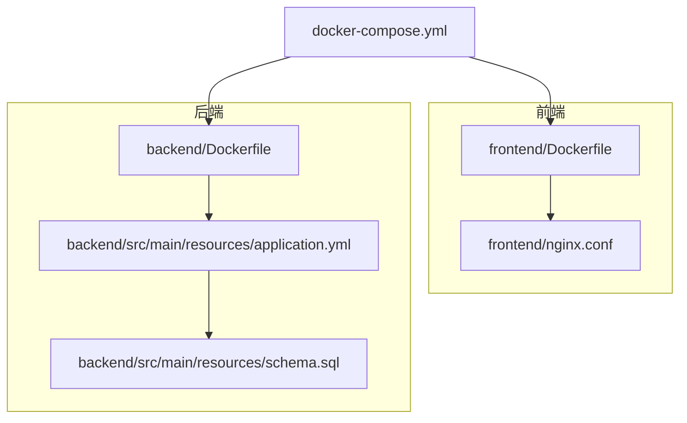
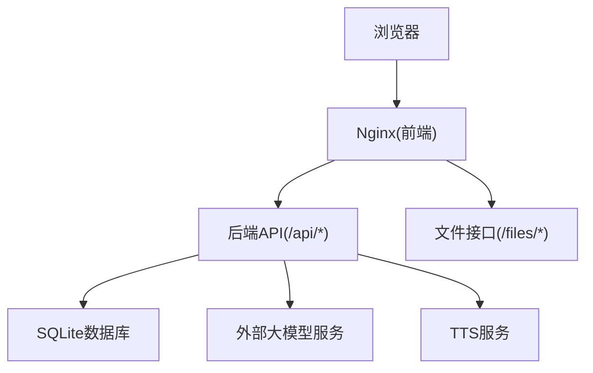
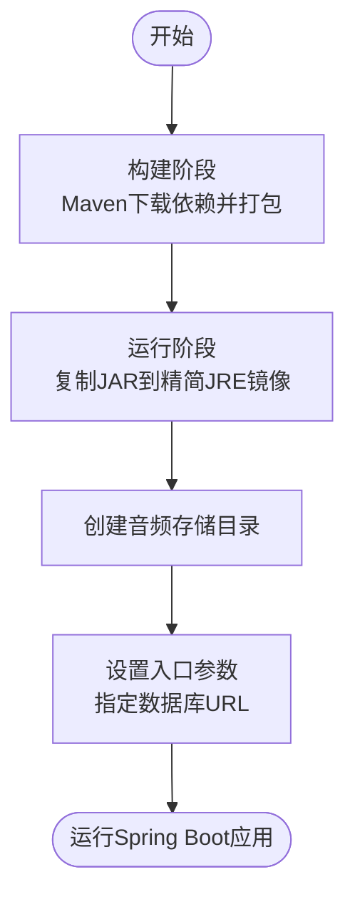
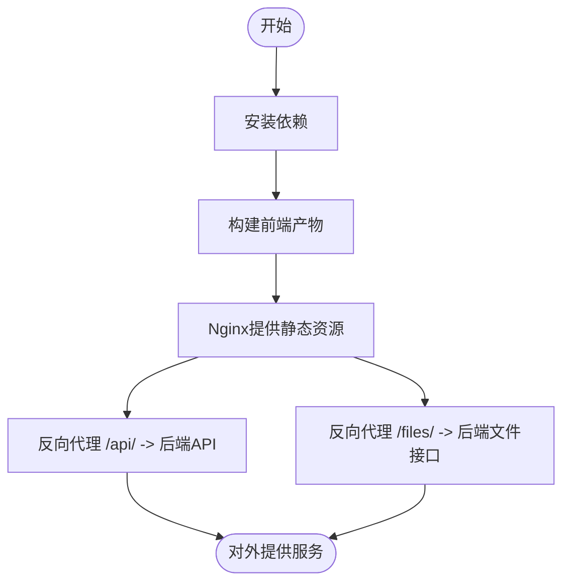
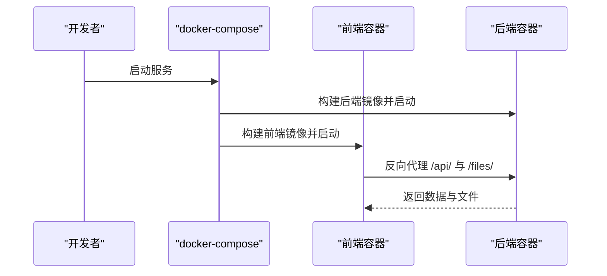
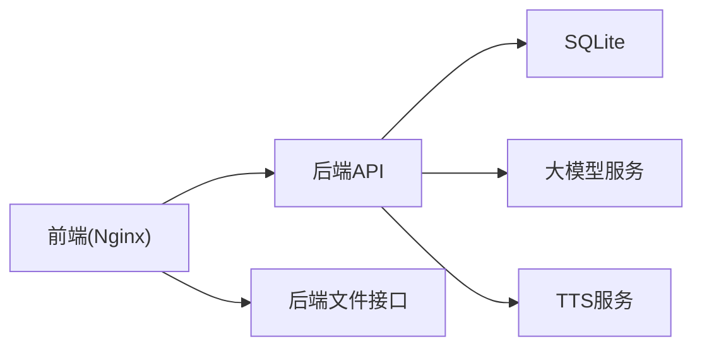

# 部署指南

<cite>
**本文引用的文件**
- [backend/Dockerfile](file://backend/Dockerfile)
- [frontend/Dockerfile](file://frontend/Dockerfile)
- [docker-compose.yml](file://docker-compose.yml)
- [backend/src/main/resources/application.yml](file://backend/src/main/resources/application.yml)
- [backend/src/main/resources/schema.sql](file://backend/src/main/resources/schema.sql)
- [frontend/nginx.conf](file://frontend/nginx.conf)
- [backend/pom.xml](file://backend/pom.xml)
- [frontend/package.json](file://frontend/package.json)
- [backend/src/main/java/com/paiagent/PaiAgentApplication.java](file://backend/src/main/java/com/paiagent/PaiAgentApplication.java)
</cite>

## 目录
1. [简介](#简介)
2. [项目结构](#项目结构)
3. [核心组件](#核心组件)
4. [架构总览](#架构总览)
5. [详细组件分析](#详细组件分析)
6. [依赖分析](#依赖分析)
7. [性能考虑](#性能考虑)
8. [故障排除指南](#故障排除指南)
9. [结论](#结论)
10. [附录](#附录)

## 简介
本指南面向运维与开发团队，提供PaiAgent的完整部署与运维方案，涵盖Docker镜像构建（后端与前端）、容器编排（docker-compose）配置、生产环境优化（性能、安全、监控）、多场景部署方案（本地、云平台、容器编排平台），以及部署验证、故障排除与维护最佳实践。

## 项目结构
- 后端采用Spring Boot应用，使用SQLite作为本地数据库，通过JPA访问数据，并提供REST接口供前端调用。
- 前端基于React/Vite构建，使用Nginx作为静态资源服务器，反向代理到后端服务。
- 使用Dockerfile分别构建后端JAR包镜像与前端Nginx镜像；通过docker-compose编排前后端服务及数据卷挂载。

图表来源
- [frontend/Dockerfile:1-13](file://frontend/Dockerfile#L1-L13)
- [backend/Dockerfile:1-14](file://backend/Dockerfile#L1-L14)
- [docker-compose.yml:1-24](file://docker-compose.yml#L1-L24)
- [backend/src/main/resources/application.yml:1-44](file://backend/src/main/resources/application.yml#L1-L44)
- [backend/src/main/resources/schema.sql:1-34](file://backend/src/main/resources/schema.sql#L1-L34)
- [frontend/nginx.conf:1-24](file://frontend/nginx.conf#L1-L24)

章节来源
- [backend/Dockerfile:1-14](file://backend/Dockerfile#L1-L14)
- [frontend/Dockerfile:1-13](file://frontend/Dockerfile#L1-L13)
- [docker-compose.yml:1-24](file://docker-compose.yml#L1-L24)
- [backend/src/main/resources/application.yml:1-44](file://backend/src/main/resources/application.yml#L1-L44)
- [backend/src/main/resources/schema.sql:1-34](file://backend/src/main/resources/schema.sql#L1-L34)
- [frontend/nginx.conf:1-24](file://frontend/nginx.conf#L1-L24)

## 核心组件
- 后端镜像构建流程
  - 多阶段构建：第一阶段使用Maven构建JAR，第二阶段使用精简JRE运行JAR。
  - 数据目录初始化：在镜像内创建音频存储目录。
  - 入口参数：通过命令行传入数据库连接字符串，确保SQLite数据库位于持久化卷中。
- 前端镜像构建流程
  - 多阶段构建：第一阶段安装依赖并打包，第二阶段使用Nginx提供静态资源。
  - 反向代理：将/api/前缀转发至后端服务，/files/转发至后端文件接口。
- 容器编排
  - 前端暴露宿主8080端口映射至容器80；后端暴露8081端口。
  - 挂载数据卷：将宿主data目录映射到/app/data，持久化SQLite与音频文件。
  - 环境变量：注入各模型API密钥、JWT密钥、激活生产配置文件等。

章节来源
- [backend/Dockerfile:1-14](file://backend/Dockerfile#L1-L14)
- [frontend/Dockerfile:1-13](file://frontend/Dockerfile#L1-L13)
- [docker-compose.yml:1-24](file://docker-compose.yml#L1-L24)

## 架构总览
下图展示容器编排后的系统交互：浏览器请求经Nginx反向代理到后端API与文件接口，后端通过JPA访问SQLite数据库，同时调用外部大模型与TTS服务。

图表来源
- [frontend/nginx.conf:11-22](file://frontend/nginx.conf#L11-L22)
- [backend/src/main/resources/application.yml:4-44](file://backend/src/main/resources/application.yml#L4-L44)

## 详细组件分析

### 后端镜像构建与优化
- 多阶段构建策略
  - 构建阶段：使用Maven离线下载依赖，随后复制源码并打包生成可执行JAR。
  - 运行阶段：基于轻量JRE镜像，仅拷贝JAR并创建音频目录，减少镜像体积与攻击面。
- 入口参数与数据库路径
  - 通过命令行参数指定SQLite JDBC URL，结合数据卷实现持久化。
- 依赖与启动
  - 依赖包含Web、Security、JPA、SQLite驱动、JWT、OkHttp、Lombok等。
  - 应用入口类负责启动Spring Boot应用。

图表来源
- [backend/Dockerfile:1-14](file://backend/Dockerfile#L1-L14)
- [backend/pom.xml:25-91](file://backend/pom.xml#L25-L91)
- [backend/src/main/java/com/paiagent/PaiAgentApplication.java:1-12](file://backend/src/main/java/com/paiagent/PaiAgentApplication.java#L1-L12)

章节来源
- [backend/Dockerfile:1-14](file://backend/Dockerfile#L1-L14)
- [backend/pom.xml:25-91](file://backend/pom.xml#L25-L91)
- [backend/src/main/java/com/paiagent/PaiAgentApplication.java:1-12](file://backend/src/main/java/com/paiagent/PaiAgentApplication.java#L1-L12)

### 前端镜像构建与Nginx配置
- 多阶段构建
  - 第一阶段安装依赖并构建产物，第二阶段使用Nginx提供静态资源。
- Nginx反向代理
  - /api/ 转发至后端API端口。
  - /files/ 转发至后端文件接口端口。
  - 启用单页应用路由回退，保证刷新不丢失路径。
- 构建脚本
  - 包含开发、构建、预览与ESLint校验脚本。

图表来源
- [frontend/Dockerfile:1-13](file://frontend/Dockerfile#L1-L13)
- [frontend/nginx.conf:7-22](file://frontend/nginx.conf#L7-L22)
- [frontend/package.json:6-11](file://frontend/package.json#L6-L11)

章节来源
- [frontend/Dockerfile:1-13](file://frontend/Dockerfile#L1-L13)
- [frontend/nginx.conf:1-24](file://frontend/nginx.conf#L1-L24)
- [frontend/package.json:1-35](file://frontend/package.json#L1-L35)

### docker-compose编排与环境变量
- 服务定义
  - frontend：构建路径为./frontend，端口映射8080:80，依赖后端服务。
  - backend：构建路径为./frontend，端口映射8081:8081，挂载数据卷，注入环境变量。
- 环境变量
  - LLM与TTS相关API密钥：DEEPSEEK_API_KEY、QWEN_API_KEY、CHATGLM_API_KEY、TTS_API_KEY。
  - JWT密钥：JWT_SECRET，默认值可在生产中覆盖。
  - Spring Profile：SPRING_PROFILES_ACTIVE=prod。
- 数据持久化
  - 将宿主data目录映射到/app/data，确保SQLite与音频文件持久化。

图表来源
- [docker-compose.yml:3-24](file://docker-compose.yml#L3-L24)

章节来源
- [docker-compose.yml:1-24](file://docker-compose.yml#L1-L24)

### 生产环境配置要点
- 数据库与文件存储
  - 通过环境变量DATA_PATH控制数据库与音频目录位置，建议指向持久化卷。
- 安全加固
  - 设置强JWT密钥，避免使用默认值。
  - 启用生产配置文件，关闭调试输出。
- 外部服务集成
  - 正确配置各模型API密钥与基础地址，确保网络可达。
- 日志与监控
  - 建议在容器编排层开启标准输出日志采集，结合Prometheus/Grafana进行指标监控。

章节来源
- [backend/src/main/resources/application.yml:4-44](file://backend/src/main/resources/application.yml#L4-L44)
- [docker-compose.yml:17-23](file://docker-compose.yml#L17-L23)

## 依赖分析
- 组件耦合
  - 前端依赖后端API与文件接口，通过Nginx反向代理解耦。
  - 后端依赖SQLite数据库与外部大模型/TTS服务。
- 外部依赖
  - Spring Boot生态、SQLite驱动、JWT库、OkHttp、React生态等。

图表来源
- [frontend/nginx.conf:11-22](file://frontend/nginx.conf#L11-L22)
- [backend/src/main/resources/application.yml:21-39](file://backend/src/main/resources/application.yml#L21-L39)

章节来源
- [frontend/nginx.conf:1-24](file://frontend/nginx.conf#L1-L24)
- [backend/src/main/resources/application.yml:1-44](file://backend/src/main/resources/application.yml#L1-L44)

## 性能考虑
- 镜像体积与启动时间
  - 使用多阶段构建与精简JRE，降低镜像体积与启动时间。
- 端口与网络
  - 明确区分前端与后端端口，避免冲突；合理设置超时参数。
- 数据持久化
  - 将数据库与音频目录映射到持久化卷，避免容器重建导致数据丢失。
- 外部服务调用
  - 合理设置超时与重试策略，避免阻塞请求线程。

## 故障排除指南
- 常见问题定位
  - 端口占用：确认宿主机8080与8081未被占用。
  - 权限问题：确认数据卷目录权限允许容器写入。
  - 环境变量缺失：检查API密钥与JWT密钥是否正确注入。
  - 数据库初始化：首次启动会按SQL脚本创建表与管理员用户。
- 排查步骤
  - 查看容器日志：docker compose logs frontend/backend。
  - 访问健康检查端点：前端页面、后端API根路径。
  - 验证反向代理：确认/api/与/files/代理正常。
- 数据恢复
  - 备份/app/data目录；如需重置管理员账户，参考SQL脚本中的种子数据。

章节来源
- [backend/src/main/resources/schema.sql:31-34](file://backend/src/main/resources/schema.sql#L31-L34)
- [docker-compose.yml:15-16](file://docker-compose.yml#L15-L16)

## 结论
通过多阶段Docker构建与docker-compose编排，PaiAgent实现了前后端分离、数据持久化与外部服务集成的生产级部署。建议在生产环境中强化安全配置、完善监控与备份策略，并根据业务流量对容器资源进行限制与扩缩容规划。

## 附录

### 部署验证清单
- 服务可用性
  - 前端页面可访问且无跨域错误。
  - /api/接口返回正常响应。
- 数据与文件
  - 登录管理员账号，创建工作流并触发执行，检查音频文件生成与存储。
- 环境变量
  - 确认所有API密钥与JWT密钥已正确注入。

### 维护最佳实践
- 版本管理
  - 固定镜像标签，滚动更新时做好回滚准备。
- 备份策略
  - 定期备份/app/data目录。
- 安全更新
  - 定期更新基础镜像与依赖，修补漏洞。