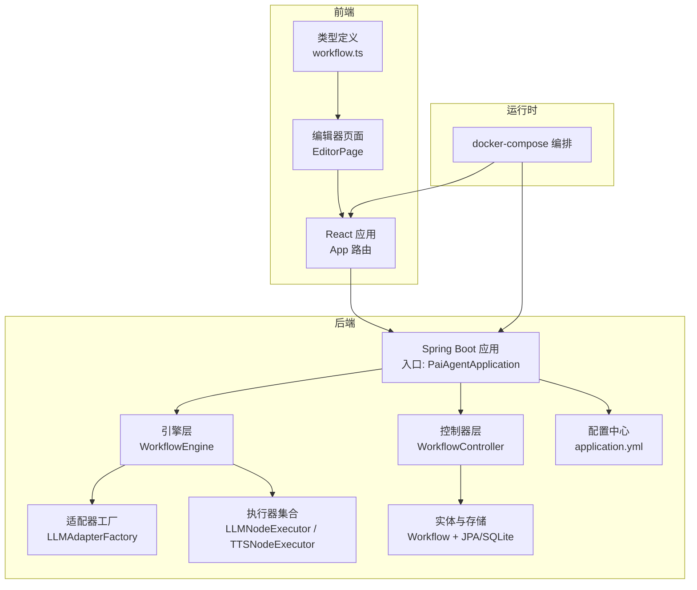
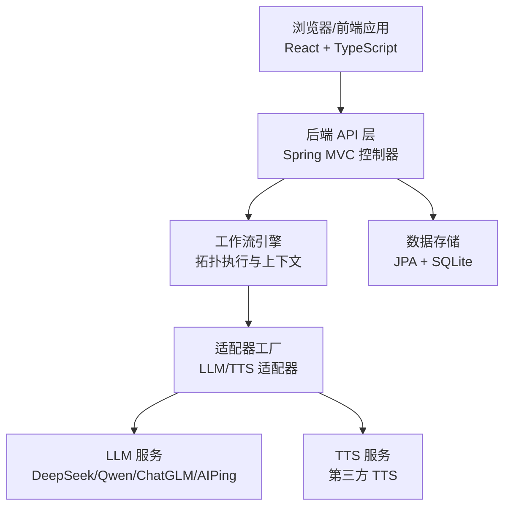
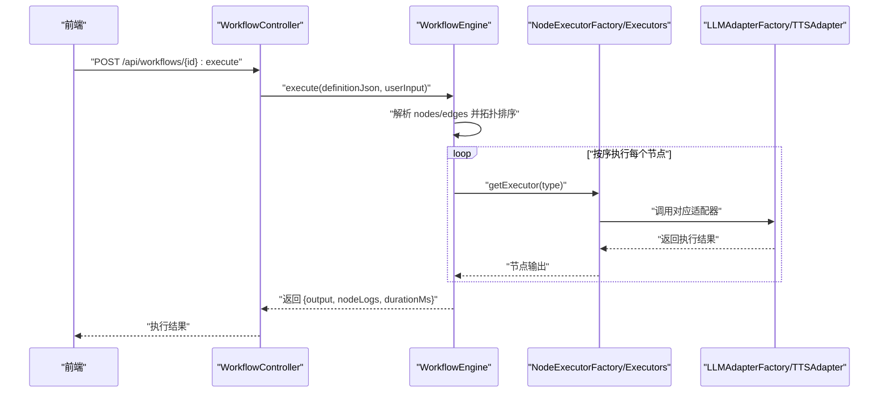
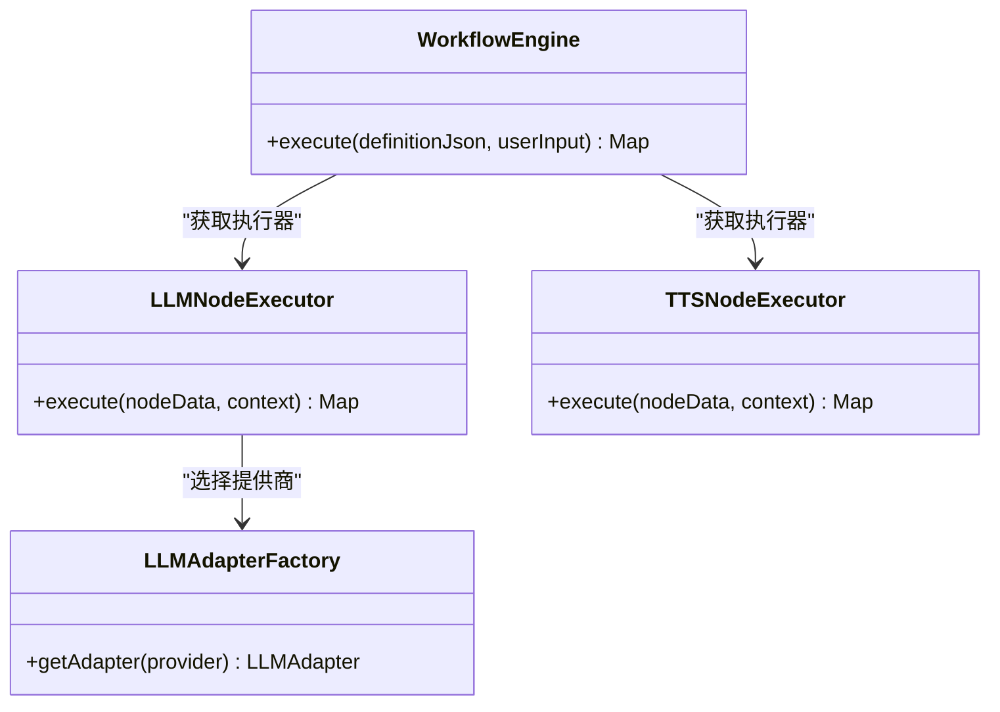
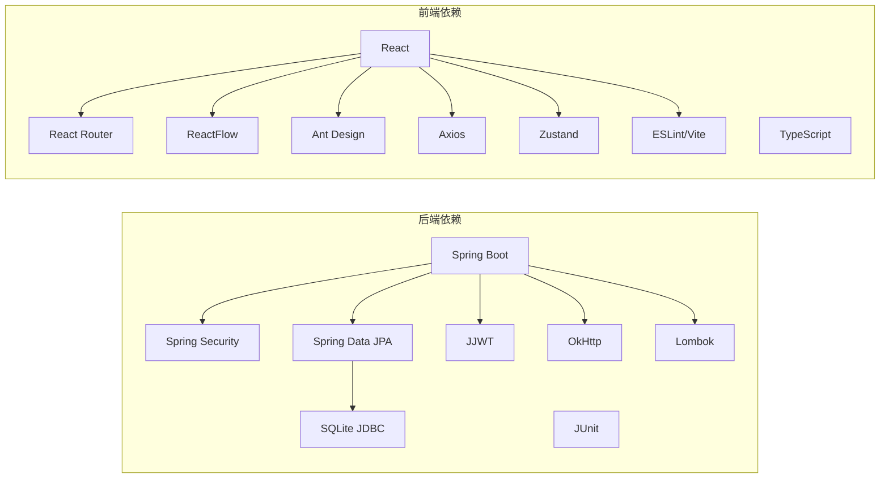

# 项目概述

<cite>
**本文档引用的文件**
- [PaiAgentApplication.java](file://backend/src/main/java/com/ paiagent/PaiAgentApplication.java)
- [application.yml](file://backend/src/main/resources/application.yml)
- [docker-compose.yml](file://docker-compose.yml)
- [package.json](file://frontend/package.json)
- [App.tsx](file://frontend/src/App.tsx)
- [EditorPage.tsx](file://frontend/src/components/EditorPage.tsx)
- [WorkflowController.java](file://backend/src/main/java/com/ paiagent/controller/WorkflowController.java)
- [WorkflowEngine.java](file://backend/src/main/java/com/ paiagent/engine/WorkflowEngine.java)
- [LLMAdapterFactory.java](file://backend/src/main/java/com/ paiagent/adapter/LLMAdapterFactory.java)
- [LLMNodeExecutor.java](file://backend/src/main/java/com/ paiagent/engine/executors/LLMNodeExecutor.java)
- [TTSNodeExecutor.java](file://backend/src/main/java/com/ paiagent/engine/executors/TTSNodeExecutor.java)
- [Workflow.java](file://backend/src/main/java/com/ paiagent/model/entity/Workflow.java)
- [workflow.ts](file://frontend/src/types/workflow.ts)
- [pom.xml](file://backend/pom.xml)
</cite>

## 目录
1. [引言](#引言)
2. [项目结构](#项目结构)
3. [核心组件](#核心组件)
4. [架构总览](#架构总览)
5. [详细组件分析](#详细组件分析)
6. [依赖分析](#依赖分析)
7. [性能考虑](#性能考虑)
8. [故障排除指南](#故障排除指南)
9. [结论](#结论)
10. [附录](#附录)

## 引言
PaiAgent 是一个基于 Web 的可视化智能工作流编排平台，旨在降低 AI 工作流自动化的使用门槛。平台通过图形化节点拖拽的方式，让用户无需编写复杂代码即可构建从输入、大模型推理到输出与语音合成的完整工作流。后端采用 Spring Boot 提供 REST API 与安全控制，前端使用 React + TypeScript 构建可视化编辑器，支持多 LLM 与 TTS 服务集成，具备良好的扩展性与可维护性。

本项目的核心价值主张包括：
- 可视化工作流设计：以节点/连线形式直观表达数据流转与处理逻辑
- 多服务抽象与统一调度：通过适配器模式屏蔽不同 LLM/TTS 供应商差异
- 安全与权限：基于 JWT 的认证与授权，保障用户工作流与数据安全
- 开发友好：前后端分离、容器化部署、环境变量配置，便于二次开发与运维

## 项目结构
项目采用前后端分离架构，根目录包含 backend 与 frontend 两个子工程，配合 docker-compose 进行统一编排与部署。

图表来源
- [PaiAgentApplication.java:1-12](file://backend/src/main/java/com/ paiagent/PaiAgentApplication.java#L1-L12)
- [App.tsx:1-31](file://frontend/src/App.tsx#L1-L31)
- [EditorPage.tsx:1-40](file://frontend/src/components/EditorPage.tsx#L1-L40)
- [WorkflowController.java:1-91](file://backend/src/main/java/com/ paiagent/controller/WorkflowController.java#L1-L91)
- [WorkflowEngine.java:1-136](file://backend/src/main/java/com/ paiagent/engine/WorkflowEngine.java#L1-L136)
- [LLMAdapterFactory.java:1-52](file://backend/src/main/java/com/ paiagent/adapter/LLMAdapterFactory.java#L1-L52)
- [LLMNodeExecutor.java:1-48](file://backend/src/main/java/com/ paiagent/engine/executors/LLMNodeExecutor.java#L1-L48)
- [TTSNodeExecutor.java:1-48](file://backend/src/main/java/com/ paiagent/engine/executors/TTSNodeExecutor.java#L1-L48)
- [Workflow.java:1-31](file://backend/src/main/java/com/ paiagent/model/entity/Workflow.java#L1-L31)
- [application.yml:1-44](file://backend/src/main/resources/application.yml#L1-L44)
- [docker-compose.yml:1-24](file://docker-compose.yml#L1-L24)

章节来源
- [PaiAgentApplication.java:1-12](file://backend/src/main/java/com/ paiagent/PaiAgentApplication.java#L1-L12)
- [App.tsx:1-31](file://frontend/src/App.tsx#L1-L31)
- [EditorPage.tsx:1-40](file://frontend/src/components/EditorPage.tsx#L1-L40)
- [docker-compose.yml:1-24](file://docker-compose.yml#L1-L24)

## 核心组件
- 后端应用入口与启动：Spring Boot 应用程序入口负责加载配置与启动 Web 容器。
- 控制器层：提供工作流的增删改查接口，基于用户上下文进行权限校验与数据隔离。
- 引擎层：解析工作流定义 JSON，拓扑排序确定执行顺序，逐节点执行并收集日志与结果。
- 适配器层：集中管理 LLM/TTS 服务提供商，按需选择具体实现，屏蔽外部 API 差异。
- 前端编辑器：基于 ReactFlow 的画布组件，提供节点面板、配置面板、调试抽屉等交互。
- 配置与部署：application.yml 统一管理数据库、JWT、LLM/TTS 等配置；docker-compose 实现前后端一体化部署。

章节来源
- [WorkflowController.java:1-91](file://backend/src/main/java/com/ paiagent/controller/WorkflowController.java#L1-L91)
- [WorkflowEngine.java:1-136](file://backend/src/main/java/com/ paiagent/engine/WorkflowEngine.java#L1-L136)
- [LLMAdapterFactory.java:1-52](file://backend/src/main/java/com/ paiagent/adapter/LLMAdapterFactory.java#L1-L52)
- [LLMNodeExecutor.java:1-48](file://backend/src/main/java/com/ paiagent/engine/executors/LLMNodeExecutor.java#L1-L48)
- [TTSNodeExecutor.java:1-48](file://backend/src/main/java/com/ paiagent/engine/executors/TTSNodeExecutor.java#L1-L48)
- [workflow.ts:1-71](file://frontend/src/types/workflow.ts#L1-L71)
- [application.yml:1-44](file://backend/src/main/resources/application.yml#L1-L44)

## 架构总览
系统采用典型的前后端分离架构：前端通过 HTTP 接口与后端交互，后端提供 REST API 并负责工作流执行与持久化。JWT 用于认证，SQLite 作为本地轻量级存储，支持多 LLM 与 TTS 服务的统一调度。

图表来源
- [App.tsx:1-31](file://frontend/src/App.tsx#L1-L31)
- [WorkflowController.java:1-91](file://backend/src/main/java/com/ paiagent/controller/WorkflowController.java#L1-L91)
- [WorkflowEngine.java:1-136](file://backend/src/main/java/com/ paiagent/engine/WorkflowEngine.java#L1-L136)
- [LLMAdapterFactory.java:1-52](file://backend/src/main/java/com/ paiagent/adapter/LLMAdapterFactory.java#L1-L52)
- [application.yml:1-44](file://backend/src/main/resources/application.yml#L1-L44)

## 详细组件分析

### 后端应用与配置
- 应用入口：Spring Boot 启动类负责应用初始化与容器启动。
- 配置中心：application.yml 统一管理服务器端口、数据库连接、JWT 密钥、LLM/TTS 服务密钥与基础地址、文件存储路径等。
- 数据库：使用 SQLite 作为嵌入式数据库，JPA/Hibernate 管理实体映射与 DDL 行为。
- 安全：通过 Spring Security 与 JWT 实现登录认证与访问控制。

章节来源
- [PaiAgentApplication.java:1-12](file://backend/src/main/java/com/ paiagent/PaiAgentApplication.java#L1-L12)
- [application.yml:1-44](file://backend/src/main/resources/application.yml#L1-L44)
- [pom.xml:1-110](file://backend/pom.xml#L1-L110)

### 前端路由与编辑器页面
- 路由保护：App 使用 React Router DOM 进行路由管理，登录页与编辑器页受 token 保护。
- 编辑器页面：组织顶部工具栏、侧边栏、画布与配置面板布局，支持调试抽屉展示执行日志。
- 类型定义：workflow.ts 定义了节点类型、工作流结构、执行结果与日志等核心类型，保证前后端契约一致。

章节来源
- [App.tsx:1-31](file://frontend/src/App.tsx#L1-L31)
- [EditorPage.tsx:1-40](file://frontend/src/components/EditorPage.tsx#L1-L40)
- [workflow.ts:1-71](file://frontend/src/types/workflow.ts#L1-L71)

### 工作流控制器与持久化
- 控制器职责：提供工作流列表、详情、创建、更新、删除接口；根据当前登录用户过滤数据。
- 持久化：Workflow 实体包含 id、名称、用户标识、定义 JSON、创建与更新时间戳；通过 JPA 存储至 SQLite。

章节来源
- [WorkflowController.java:1-91](file://backend/src/main/java/com/ paiagent/controller/WorkflowController.java#L1-L91)
- [Workflow.java:1-31](file://backend/src/main/java/com/ paiagent/model/entity/Workflow.java#L1-L31)

### 工作流引擎与执行流程
- 执行入口：WorkflowEngine 接收工作流定义 JSON 与用户输入，解析节点与连线，构建邻接表与入度表。
- 拓扑排序：使用 Kahn 算法生成执行顺序，确保有向无环图按依赖顺序执行。
- 上下文传递：ExecutionContext 在节点间传递输出，支持模板变量解析与引用。
- 结果聚合：收集每个节点的日志与耗时，最终提取输出节点的结果作为整体输出。

图表来源
- [WorkflowEngine.java:1-136](file://backend/src/main/java/com/ paiagent/engine/WorkflowEngine.java#L1-L136)
- [LLMNodeExecutor.java:1-48](file://backend/src/main/java/com/ paiagent/engine/executors/LLMNodeExecutor.java#L1-L48)
- [TTSNodeExecutor.java:1-48](file://backend/src/main/java/com/ paiagent/engine/executors/TTSNodeExecutor.java#L1-L48)
- [LLMAdapterFactory.java:1-52](file://backend/src/main/java/com/ paiagent/adapter/LLMAdapterFactory.java#L1-L52)

### LLM 与 TTS 适配器与执行器
- LLM 适配器工厂：集中注册 DeepSeek、Qwen、ChatGLM、AIPing 四个提供商，按配置注入密钥与基础地址。
- LLM 执行器：解析节点参数（模型、温度、最大 token 数），对提示词模板进行上下文变量替换后调用适配器。
- TTS 执行器：从上下文或模板解析输入文本，调用 TTS 适配器生成音频并返回音频 URL 与原文。

图表来源
- [LLMAdapterFactory.java:1-52](file://backend/src/main/java/com/ paiagent/adapter/LLMAdapterFactory.java#L1-L52)
- [LLMNodeExecutor.java:1-48](file://backend/src/main/java/com/ paiagent/engine/executors/LLMNodeExecutor.java#L1-L48)
- [TTSNodeExecutor.java:1-48](file://backend/src/main/java/com/ paiagent/engine/executors/TTSNodeExecutor.java#L1-L48)
- [WorkflowEngine.java:1-136](file://backend/src/main/java/com/ paiagent/engine/WorkflowEngine.java#L1-L136)

### 工作流定义与节点类型
- 节点类型：输入、输出、LLM、TTS 四种节点，分别承担数据输入、逻辑输出、大模型推理与语音合成。
- 工作流结构：nodes 与 edges 描述节点与连线关系，引擎据此进行拓扑排序与执行。
- 执行结果：包含最终输出与每个节点的执行日志、耗时与错误信息。

章节来源
- [workflow.ts:1-71](file://frontend/src/types/workflow.ts#L1-L71)

## 依赖分析
- 技术栈概览
  - 后端：Spring Boot 2.7.x、Spring Security、Spring Data JPA、SQLite JDBC、JWT(JJWT)、OkHttp、Lombok、JUnit 测试
  - 前端：React 18、TypeScript、React Router、ReactFlow、Ant Design、Axios、Zustand、ESLint/Vite
- 关键依赖关系
  - 后端通过 JPA 访问 SQLite，通过 OkHttp 调用外部 LLM/TTS 服务，通过 JWT 实现认证
  - 前端通过 Axios 调用后端 API，使用 ReactFlow 渲染工作流画布，使用 Zustand 管理状态

图表来源
- [pom.xml:1-110](file://backend/pom.xml#L1-L110)
- [package.json:1-35](file://frontend/package.json#L1-L35)

章节来源
- [pom.xml:1-110](file://backend/pom.xml#L1-L110)
- [package.json:1-35](file://frontend/package.json#L1-L35)

## 性能考虑
- 执行效率
  - 引擎使用拓扑排序确保节点按依赖顺序执行，避免重复计算与死锁
  - 节点执行结果缓存于上下文，减少跨节点数据传输开销
- 网络与外部服务
  - 通过适配器统一调用外部 LLM/TTS 服务，建议在适配器层增加超时与重试策略
- 存储与并发
  - SQLite 适合单机演示场景，生产环境建议迁移到关系型数据库并启用连接池与索引优化
- 前端渲染
  - ReactFlow 的节点与连线渲染应避免频繁重绘，可通过稳定的数据结构与 key 设计提升性能

## 故障排除指南
- 认证失败
  - 检查 JWT 密钥与过期时间配置是否正确，确认前端是否携带有效 token 请求受保护接口
- LLM/TTS 服务异常
  - 核对 application.yml 中对应服务的 API Key 与基础地址是否配置，检查网络连通性
- 工作流执行报错
  - 查看执行日志中的节点状态与错误信息，定位具体节点与适配器调用问题
- 数据库问题
  - 确认 SQLite 文件路径与权限，检查 JPA 配置与实体映射

章节来源
- [application.yml:1-44](file://backend/src/main/resources/application.yml#L1-L44)
- [WorkflowEngine.java:1-136](file://backend/src/main/java/com/ paiagent/engine/WorkflowEngine.java#L1-L136)

## 结论
PaiAgent 以“所见即所得”的可视化方式，将复杂的 AI 工作流自动化变得简单易用。通过模块化的适配器与执行器设计，平台能够灵活接入多家 LLM/TTS 服务；借助前后端分离与容器化部署，既满足快速迭代也便于生产落地。对于初学者，平台提供了直观的编辑器与清晰的节点语义；对于有经验的开发者，其可扩展的架构与完善的类型定义为二次开发提供了坚实基础。

## 附录
- 快速开始
  - 配置环境变量（如 LLM/TTS API Key、JWT Secret、数据路径）
  - 使用 docker-compose 启动前后端服务
  - 登录后进入编辑器，拖拽节点构建工作流并执行
- 生产建议
  - 将 SQLite 替换为高可用数据库
  - 增加限流、熔断与重试机制
  - 引入可观测性（日志、指标、链路追踪）